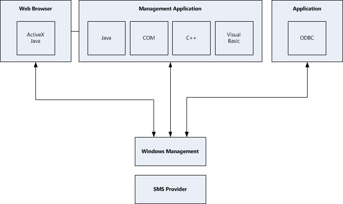
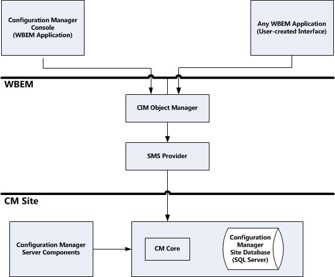

# Architectural overview

Configuration Manager is a configuration management product that requires servers to administer client computers. The following sections describe both Configuration Manager server and client architecture. Gaining an understanding of the concepts relating to both server and client architecture will help you understand how you can customize Configuration Manager for specific uses in your organization.

## Configuration Manager server architecture

The Configuration Manager server architecture can be divided into two separate tiers:

- The Configuration Manager components
- The WBEM interface to the Configuration Manager architecture (SMS Provider)

Configuration Manager components are analogous to the mechanisms and devices that enable the elevator, the phone system, and the electrical system in an office building to work properly. When you make changes through the Configuration Manager console, Configuration Manager services and components start working to complete the operation successfully, whether it's software distribution, hardware inventory, or any other administrator-initiated or schedules Configuration Manager task, feature, or tool.

The WBEM interface to the Configuration Manager architecture is a description of the Configuration Manager framework, much as building plans describe a building. As you become more familiar with Configuration Manager, you might find that your organization needs to provide Configuration Manager functionality in a slightly different fashion. You might need to gather additional inventory information and store it in your Configuration Manager database. The WBEM interface enables you to customer Configuration Manager for optimal change and configuration management.

### SMS component and data store architecture

To fully understand Configuration Manager features, you need a basic understanding of the elements that make up Configuration Manager. Service components, thread components, and data stores are the major elements of Configuration Manager server architecture. Each of these elements does a specific function to complete the work that you assign and schedule.

#### SMS components

In Configuration Manager, components are threads, services, and applications that run on both server and client computers and provide Configuration Manager functionality. Service and thread components accomplish the many tasks Configuration Manager requires to function – tasks such as communication for inter- and intra-site connectivity, configuration, resource discovery, client installation, database maintenance, status, site system installation, and reporting.

#### Data stores

A dynamic computing environment must have a central location that stores the critical operations information. Also, server and client components need access to their configuration data, scheduled times of operation, and the data in the Configuration Manager site database to accomplish tasks. For example, Collection Evaluator operation requires information such as which collections to evaluate, when to evaluate them, and what resources belong to each specific collection. To do these tasks, Collection Evaluator needs access to both configuration data and data stored in the Configuration Manager site database.

In Configuration Manager, there are two basic types of data stores: configuration data and system data.

##### Configuration data

Configuration Manager gathers configuration data from Configuration Manager default settings, changes you make through the Configuration Manager console, and changes Configuration Manager services make. Configuration is a dynamic system that enables you to make decisions about how and with the site will operate. As you make configuration changes, Configuration Manager updates the site control file and the registry. The site control file contains configuration for a Configuration Manager site. Many Configuration Manager features, such as Software Inventory, function on a schedule. After Configuration Manager server service and thread components are enabled, they periodically check the site control file for their configuration and schedule as they continue to work.

##### System data

Configuration Manager gathers system data from the various resources in the site. Systems within an organization change constantly as hardware and software are upgraded and repaired, new systems are brought on line, and old systems are retired. Configuration Manager stores the information in the Configuration Manager site database. This database stores all of the data pertinent to Configuration Manager functions including DDRs, MIF files, network discovery data, and site configuration data.

### The WBEM interface with the SMS architecture

Configuration Manager provides an open architecture that enables you to write applications and scripts that automate and customize Configuration Manager features, such as Software Distribution. You can also create and install customized programs that you can start from the Configuration Manager console.

Terms and concepts that relate to Configuration Manager architecture originate from various sources. Some originated with the Desktop Management Task Force (DMTF) and were created to describe managed objects. Others are standard COM and Web-Based Enterprise Management (WBEM) initiative terms and concepts. Still others are specific to Configuration Manager.

|Term|Definition|
|----------|----------------|
|Windows Management|The Microsoft implementation of one of the DMTF standards for identifying and manipulating managed objects.|
|CIM Object Manager|The primary component in the management infrastructure of the WBEM technology. Client applications access the CIM Object Manager to find the correct provider.|
|SMS Provider|The WBEM provider that exposes the Configuration Manager site database. The SMS Provider acts as an intermediary between the CIM Object Manager and any Configuration Manager data. The SMS Provider also accesses the Configuration Manager site database to provide data to the Configuration Manager console.|
|Configuration Manager Site Database|A SQL Server database that stores Configuration Manager data. The managed objects (such as disk drives or collections) stored in the Configuration Manager site database are represented by instances of Configuration Manager classes in the database rather than records in a database.|
|WBEM Application|An executable application that makes API calls to the CIM Object Manager to view or manage data from providers.|
|Windows Management Service|A Windows service that starts and stops the CIM Object Manager.|
|Configuration Manager Console|A WBEM application.|

### Configuration Manager and the WBEM architecture

Configuration Manager uses the WBEM architecture to manage objects. WBEM is an industry initiative adopted by the DMTF that is also supported by many non-Windows computer and network device manufacturers. The WBEM initiative complements Active Directory that locates and manages entity policies. WBEM also provides a unifying mechanism through which management applications can interact with the managed entities (like Configuration Manager objects) – without you having to understand the underlying management protocols that these entities use.

In Configuration Manager, objects are items such as client computers, advertisements, and packages stored in the Configuration Manager database. The WBEM initiative outlines the architecture used by Windows Management, Microsoft's implementation of one of the DMTF object management standards.

The CIM Object Manager stores the metadata, Windows Management provides access to the Configuration Manager configuration and operations data with an extensible, platform-independent interface. And managed object, such as a disk drive or a collection is represented by an instance of a Configuration Manager class. Each Configuration Manager managed object is represented by a CIM class.

### Configuration Manager and Windows management

To view and manipulate objects, Configuration Manager makes a request to the CIM Object Manager (the central WBEM component). Configuration Manager uses the site database to store managed object data. However, Configuration Manager uses the CIM Object Manager interface and the SMS Provider to view and manipulate that managed data. You can't view or manipulate the Configuration Manager database directly. Instead, you gain access to the underlying Configuration Manager site database through the CIM Object Manager, which in turn communicates with the SMS Provider.

## Client architecture

A Configuration Manager client computer is any computer in your organization that has the Configuration Manager client software installed. Computers serving as Configuration Manager site servers and site systems can also be installed as Configuration Manager client computers, in addition to any other servers in your organization where you install Configuration Manager client software.

Configuration Manager client software:

- Runs almost entirely as services, processes, or applications started from Configuration Manager services.

- Runs from the client computer (as opposed to over the network).

- Maintains history information for most function so the client computer (such as software and hardware inventory).

## See also

[Getting started with Configuration Manager programming](getting-started-with-configuration-manager-programming.md)
