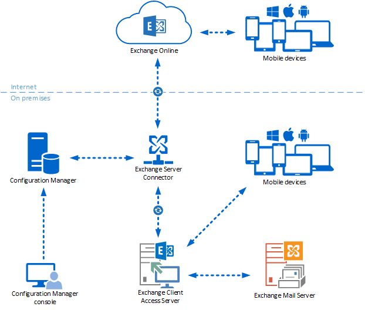

# Device management with Exchange and Configuration Manager

*Applies to: Configuration Manager (current branch)*

If you have mobile devices that you connect to Exchange Server via the ActiveSync protocol, you can use the Exchange Server connector in Configuration Manager to manage these devices. The connector works with both on-premises Exchange Server or Exchange Online. Use the Configuration Manager console to configure Exchange mobile device management features. For example, remote device wipe and settings control for multiple Exchange servers.

  

When you manage mobile devices with this connector, it doesn't install the Configuration Manager client or enroll the devices via MDM. The management functions of Exchange Server are limited in comparison to these other options. For example, you can't install software or use configuration items to configure these devices. For more information, see [Choose a device management solution for Configuration Manager](../../core/plan-design/choose-a-device-management-solution.md).  

## Policies

When you use the connector, Configuration Manager configures settings on the mobile devices. The devices don't use the default Exchange ActiveSync mailbox policies. Define the settings that you want to use in the following groups:

- **General**
- **Password**
- **Email Management**
- **Security**
- **Application**

For example, in the **Password** group, you can configure the following settings:

- Whether mobile devices require a password
- The minimum password length
- Password complexity
- Whether password recovery is allowed

When you configure at least one setting in the group, Configuration Manager manages all settings in the group for mobile devices. If you don't configure any setting in a group, Exchange continues to manage those settings for the mobile devices. Any Exchange ActiveSync mailbox policies that you configure on the Exchange Server and assign to users are still applied.

## Access rules and remote actions

You can also configure the Exchange Server connector to manage the Exchange access rules. These access rules include allow, block, or quarantine mobile devices. You can remotely wipe mobile devices by using the Configuration Manager console.

> [!TIP]  
> When a mobile device is transferred to another user, before the new owner configures their Exchange account on the device, delete the mobile device from the Configuration Manager console.

## Prerequisites

> [!IMPORTANT]  
> Before you install this connector, confirm that Configuration Manager supports your version of Exchange. For more information, see [Supported configurations - Exchange Server connector](../../core/plan-design/configs/supported-operating-systems-for-clients-and-devices.md#bkmk_ExSrvConOS).  

### Permissions to configure the connector

You need the following security permissions to configure the Exchange Server connector in Configuration Manager:

- To add, modify, and delete the Exchange Server connector: **Modify** permission for the **Site** object.  

- To configure the mobile device settings: **ModifyConnectorPolicy** permission for the **Site** object.  

For example, the **Full Administrator** built-in role includes these required permissions.  

### Permissions to manage mobile devices

You need the following security permissions to manage mobile devices:  

- To wipe a mobile device: **Delete resource** for the **Collection** object.  

- To cancel a wipe command: **Modify resource** for the **Collection** object.  

- To allow and block mobile devices: **Modify resource** for the **Collection** object.  

For example, the **Operations Administrator** built-in role includes these required permissions.

For more information, see [Configure role-based administration](../../core/servers/deploy/configure/configure-role-based-administration.md).

## Next steps

> [!div class="nextstepaction"]
> [Install and configure the Exchange connector](install-configure-exchange-connector.md)
