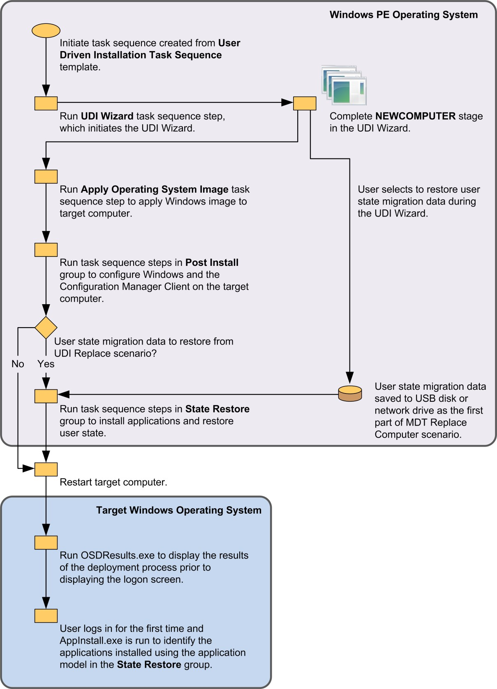
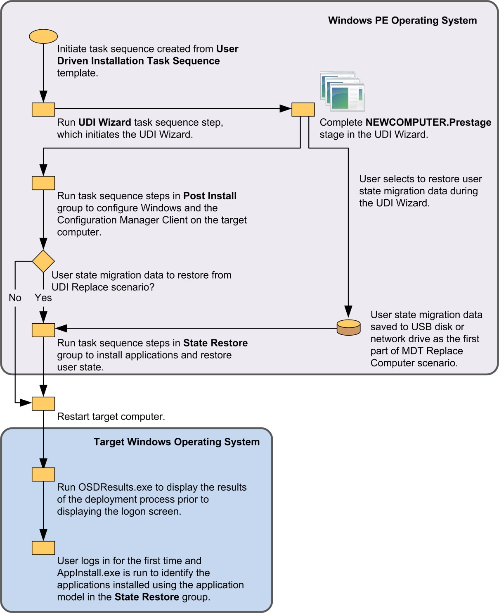
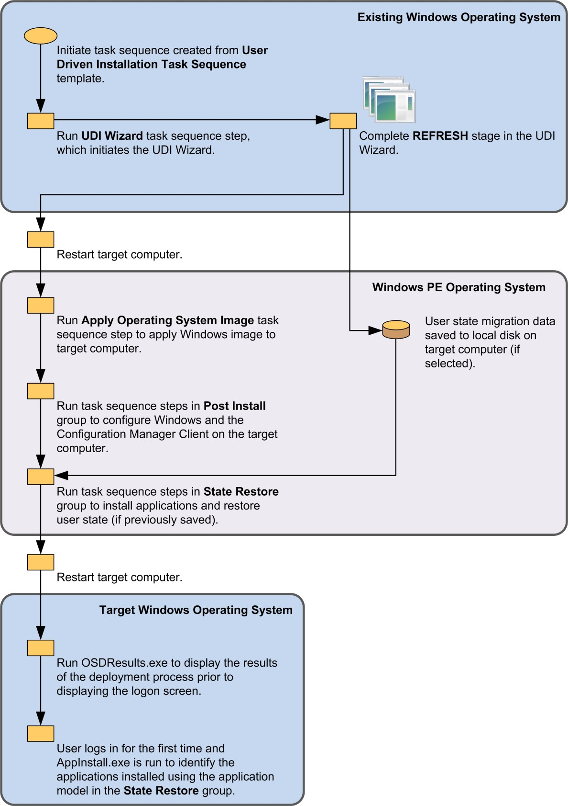
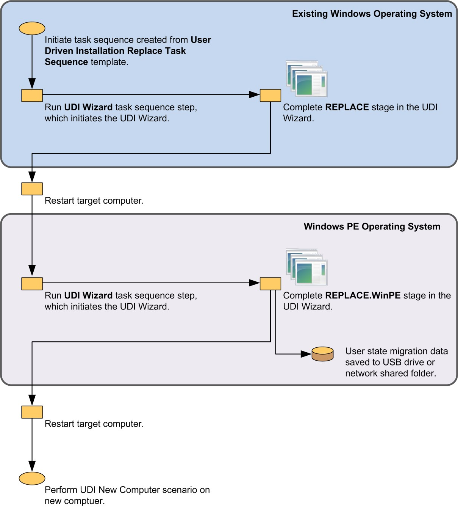
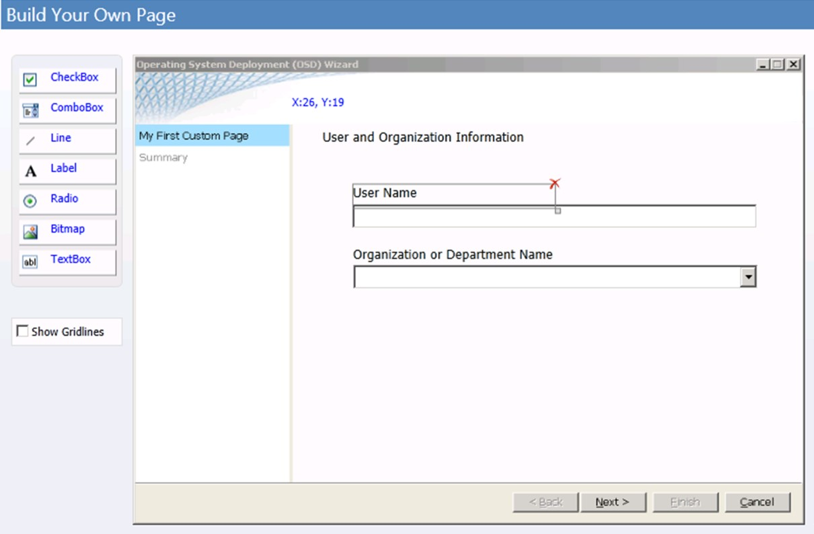

# UDI Reference

This reference provides further information about UDI and includes topics on:

- UDI concepts as described in [UDI Concepts](#udi-concepts)

- OSDResults as described in [OSDResults Reference](#osdresults-reference)

- User Centric App Installer as described in [User-Centric App Installer Reference](#user-centric-app-installer-reference)

- UDI stages as described in [UDI Stage Reference](#udi-stage-reference)

- UDI tasks as described in [UDI Task Reference](#udi-task-reference)

- UDI validators as described in [UDI Validator Reference](#udi-validator-reference)

- UDI Wizard Pages as described in [UDI Wizard Page Reference](#udi-wizard-page-reference)

Each of these reference topics are discussed in subsequent sections.

## UDI Concepts

This section contains concepts that help describe UDI, the UDI Wizard, and the UDI Wizard Designer.

### Display Name

The display name is used to provide a user-friendly, descriptive name for a wizard page within the Page Library in the UDI Wizard Designer. The display name is displayed in blue text for each wizard page in the Page Library and on the **Flow** tab in the UDI Wizard Designer.

 When you add a page to the Page Library, you must provide the display name. After the wizard page is added to the Page Library, you cannot change the display name.

### Flow

The **Flow** tab displays the list of wizard pages within a UDI stage in the UDI Wizard Designer. You can use the **Flow** tab to perform the following tasks:

- Add a wizard page from the Page Library to a UDI stage by dragging the page from the Page Library to the UDI stage.

- Remove a wizard page from a UDI stage.

- Change the sequence of wizard pages within a UDI stage.

### Page Library

The Page Library contains all the pages currently loaded in the UDI Wizard Designer. When loading a UDI Wizard configuration file, all of the wizard pages defined in the configuration file are displayed to the Page Library. The Page Library shows the wizard pages in alphabetical order by page types. Each instance of a specific page type is listed under the page type.

 For example, you may need two different **WelcomePage** wizard pages for different stages. The two **WelcomePage** wizard pages will be listed under the **WelcomePage** wizard page type in the Page Library in the UDI Wizard Designer.

 In addition, each wizard page instance in the Page Library indicates how many times the wizard page is used in the stage flows. When you hover over a wizard page in the Page Library, a thumbnail of the wizard page is displayed along with the stages that include that page.

### Page Name

The page name is used to uniquely identify a wizard page within the Page Library in the UDI Wizard Designer. The *page name* is the name a UDI stage references so that the UDI Wizard knows which wizard page to display within a specific UDI stage. When you add a page to the Page Library, you must provide the page name. After the wizard page is added to the Page Library, you cannot change the page name. In the UDI Wizard Designer, the page name is shown at the bottom of each wizard page in the Page Library in smaller, non-bold text.

### Prestaged Media Deployments

Prestaged media support is an operating system deployment feature in Configuration Manager that allows an administrator to copy and apply prestage bootable media and an operating system image to a hard disk prior to the provisioning process. This work can reduce network traffic and the time needed for the provisioning process. Prestaged media can be deployed as part of the manufacturing process or at an enterprise staging center that is not connected to the Configuration Manager environment.

 For more information about prestaged media deployments, see the following resources:

- [Planning for Media Operating System Deployments in Configuration Manager](/previous-versions/system-center/system-center-2012-R2/hh499044(v=technet.10))

- [About Prestaged Media for Operating System Deployment](../osd/deploy-use/create-prestaged-media.md)

### Stage Group

Use a stage group to group one or more stages in the UDI Wizard Designer. UDI stage groups are loosely related to MDT deployment scenarios, but there is no one-to-one correlation between the two.

### Stage

A *stage* is a subset of all the pages in the UDI Wizard configuration file that an MDT deployment scenario uses. When you start the UDI Wizard using the **UDI Wizard** task sequence step, the **/stage** parameter specifies the stage to run, which in turn specifies the set of pages to use. You can preview how wizard pages will appear in a stage by selecting **Preview** in the **Preview Wizard** group on the Ribbon. You can use a UDI stage in more than one MDT deployment scenario, even though the UDI stage is defined only once in the UDI Wizard Designer. For example, the NewComputer stage can be used in the MDT New Computer and Replace Computer deployment scenarios.

### Task

*UDI tasks* are software that is run on a wizard page to perform specific functions. In some instances, these tasks are used to verify that the target computer is ready for deployment. Other tasks can be used to perform deployment steps, such as copying configuration or result files.

> [!NOTE]
>
> The **Next** button on the wizard page where the tasks are run will be disabled if any of the tasks finish with warning or error completion status.

 UDI includes several built-in tasks that allow you to perform most of the tasks necessary for deployment. For more information about the UDI built-in tasks, see [Built-in UDI Tasks](#built-in-udi-tasks).

 The **Shell Execute** built-in UDI task allows you to run any software (scripts) that can be initiated from a command line, such as Visual Basic or Windows PowerShell scripts. This functionality allows you create tasks using familiar scripting languages. For more information, see [Shell Execute Task](#shell-execute-task).

 If your requirements go beyond scripting, you can write custom UDI tasks. *UDI tasks* are DLLs written in C++ and implement the **ITask** interface. You register the DLL with the UDI Wizard Designer task library by creating a UDI Wizard Designer configuration (.config) file and placing it in the *installation_folder*\Bin\Config folder (where *installation_folder* is the folder in which you installed MDT). For more information on developing custom UDI tasks, see the section, "Creating Custom UDI Tasks", in the *User-Driven Installation Developers Guide*.

### UDI Task Sequence

You create a UDI task sequence using one of the following UDI-specific MDT task sequence templates, which run the UDI Wizard at the appropriate step in the task sequence:

- **User-Driven Installation Task Sequence.** This task sequence template is used for the New Computer, Refresh Computer, and Replace Computer MDT deployment scenarios.

- **User-Driven Installation Replace Task Sequence.** This task sequence template is the first step in a two-step process in the Replace Computer deployment scenario and is used to capture user state migration data. The second step in the two-step process is the User-Driven Installation Task Sequence task sequence template, which you use to deploy the target applications and operating system and restore the user state migration data saved during the first step of the process.

  For more information about UDI task sequence templates, see the section, "Identify the UDI Task Sequence Templates in MDT", in the MDT document *Using the Microsoft Deployment Toolkit*. For more information about these components, see the section, "Identify UDI Deployment Process Components", in the MDT document *Using the Microsoft Deployment Toolkit*, which is included with MDT.

### UDI Wizard

The UDI Wizard provides the UI for collecting deployment settings that the UDI task sequences consume. The UDI Wizard is initiated as a part of a UDI task sequence and collects the necessary configuration information for customizing the deployment of the Windows client operating systems and applications. The wizard pages read their configuration settings from the UDI Wizard configuration file, which is customized using the UDI Wizard Designer.

 The UDI Wizard is initiated by the **UDI Wizard** task sequence step in task sequences created using the UDI task sequence templates. The **UDI Wizard** task sequence step runs the UDIWizard.wsf script, which in turn initiates the UDI Wizard (OSDSetupWizard.exe). Table 9 lists the UDI Wizard command-line parameters and provides a brief description of each.

## Table 9. UDI Wizard Command-Line Parameters

|**Parameter**|**Description**|
|-|-|
|**/preview**|Allows you to preview the current configuration of the wizard by enabling the **Next** button, which allows you to move from page to page without requiring valid input.|
|**/xml**|Specifies the name of the UDI Wizard configuration file. The UDIWizard.wsf script automatically sets this parameter to the OSDSetupWizard.xml file, which is stored in the folder in which the task sequence stores log files. This parameter defaults to the config.xml file.<br><br> The syntax for this parameter is as follows (where `<full_path>` is the fully qualified path to the .xml file, including the file name and extension):<br><br> `/xml:<full_path>`|
|**/stage**|Specifies the name of the UDI stage to run. The UDIWizard.wsf script automatically sets this parameter to the appropriate stage, as described in [UDI Stage Reference](#udi-stage-reference). This parameter defaults to the first stage in the UDI Wizard configuration file.<br><br> The syntax for this parameter is as follows (where `<stage_name>` is the name of the stage to be run):<br><br> `/stage:<stage_name>`<br><br> Note:<br><br> The value for <stage_name> is case sensitive.|
|**/locale**|Specifies the language to use in the UDI Wizard in the form of a locale identifier (LCID), which is represented by a numeric value. For a list of the available LCIDs, see [Locale IDs Assigned by Microsoft](/openspecs/windows_protocols/ms-lcid/a9eac961-e77d-41a6-90a5-ce1a8b0cdb9c).<br><br> You would use this list to identify the language you want to use, and then provide the corresponding LCID.<br><br> The syntax for this parameter is as follows (where `<locale_id>` is the numeric value of the LCID to be used):<br><br> `/locale:<locale_id>`|

### UDI Wizard Application Configuration File

The **ApplicationPage** wizard page configures the UDI Wizard application configuration file, which maintains the list of software to be installed. This file contains an entry for each Configuration Manager application or program and package that was added using the UDI Wizard Designer.

 This file has the same name as the UDI Wizard configuration file but with a .app extension. For example, if the UDI Wizard configuration file is named *Config.xml,* then the corresponding UDI Wizard application configuration file would be *Config.xml.app.* This file is the companion to the UDI Wizard configuration file.

### UDI Wizard Configuration File

The UDI Wizard reads the UDI Wizard configuration file to determine the wizard pages to be displayed, the sequence of the wizard pages, any default for controls on the wizard pages, and whether the controls are enabled or disabled. This file contains all the configuration settings that are displayed in the UDI Wizard and are configured using the UDI Wizard Designer.

 A separate configuration file—the UDI Wizard application configuration file—is used to configure applications to be installed on the target computer.

### UDI Wizard Designer

The UDI Wizard Designer is the primary tool for customizing wizard pages for the different deployment scenarios that UDI supports. Changes made in the UDI Wizard Designer are saved in the UDI Wizard configuration file and ultimately reflected in the user experience in the UDI Wizard. The user performing the deployment will see only the wizard pages in the UDI Wizard that you have selected and configured using the UDI Wizard Designer.

 Although the UDI Wizard would run with the default UDI Wizard configuration file, the wizard pages would not be configured correctly. It is recommended that you use the UDI Wizard Designer to configure the UDI Wizard user experience.

> [!NOTE]
>
> To run the UDI Wizard Designer, you must have the appropriate rights in Configuration Manager to access objects such as packages, applications, or images.

### Validator

You use UDI validators to help ensure that the correct information is entered into text fields on wizard pages in the UDI Wizard. UDI includes several built-in validators that help you perform typical validations of fields used for entering text, such as preventing users from entering invalid characters and ensuring that the field is not empty. When a validator detects an invalid entry in a text box, a message is displayed on the wizard page, and the **Next** button is disabled until all invalid entries are resolved.

 UDI includes built-in validators that allow you to perform most of the validation necessary for deployment. For more information about the UDI built-in validators, see [Built-in UDI Validators](#built-in-udi-validators).

 If your requirements go beyond the built-in UDI validators, you can write custom UDI validators. *UDI validators* are DLLs written in C++ that implement the **IValidator** interface. Register the DLL with the UDI Wizard Designer validator library by creating a UDI Wizard Designer configuration (.config) file and placing it in the *installation_folder*\Bin\Config folder (where *installation_folder* is the folder in which you installed MDT). For more information on developing custom UDI tasks, see the section, "Creating Custom UDI Validators", in the MDT document *User-Driven Installation Developers Guide*.

### Wizard Page

You use a wizard page to collect configuration information in the UDI Wizard. Configure UDI wizard pages using the UDI Wizard Designer. The configuration settings are stored in the UDI Wizard configuration file and are read by the wizard page when the page is initialized in the UDI Wizard.

 Wizard pages are stored in the wizard Page Library, and they can be used in one or more UDI stages. This design allows you to configure a wizard page that is shared between stages once for all stages, dramatically reducing the amount of effort required and the complexity of updating wizard page configuration.

 UDI includes built-in wizard pages and wizard page editors that are typically sufficient for most deployments. For more information about the built-in wizard pages, see [Built-in UDI Wizard Pages](#built-in-udi-wizard-pages).

 If your requirements go beyond the built-in UDI wizard pages and corresponding wizard page editors, you can write custom UDI wizard pages and wizard page editors. UDI wizard pages are implemented as DLLs that the UDI Wizard reads. Wizard page editors are created using C++ in Visual Studio.

 For more information on developing custom UDI wizard pages, see the section, "Creating Custom UDI Wizard Pages", in the MDT document *User-Driven Installation Developers Guide*.

### Wizard Page Editor

You use a wizard page editor to configure a wizard page in the UDI Wizard Designer. A wizard page editor updates the wizard page configuration settings in the UDI Wizard configuration file; UDI includes a built-in wizard page editor for each built-in wizard page. For more information about the built-in wizard pages and wizard page editors, see [Built-in UDI Wizard Pages](#built-in-udi-wizard-pages).

 If your requirements go beyond the built-in UDI wizard pages and corresponding wizard page editors, you can write custom UDI wizard pages and wizard page editors. UDI wizard page editors are implemented as DLLs that the UDI Wizard Designer reads. Create wizard page editors using:

- [Windows Presentation Foundation](/dotnet/desktop-wpf/) version 4.0

- [Microsoft Prism](https://www.codeproject.com/Articles/165370/Creating-View-Switching-Applications-with-Prism-4) version 4.0

- [Microsoft Unity Application Block](https://www.codeproject.com/articles/42524/a-basic-introduction-to-the-unity-application-bloc) (Unity) version 2.1

  For more information on developing custom UDI wizard page editors, see the section, "Creating Custom Wizard Page Editors", in the MDT document *User-Driven Installation Developers Guide*.

## OSDResults Reference

**OSDResults** is a part of UDI that displays the results of a deployment performed using UDI. **OSDResults** displays the **Deployment Complete** dialog box. **OSDResults** is displayed prior to Windows logon the first time the target computer is started. The user can use **OSDResults** and the information in the **Deployment Complete** dialog box to determine the completion status of the deployment process and the configuration of the computer prior to logging on for the first time. In addition, the information in **OSDResults** can be used for troubleshooting any problems encountered during the deployment process.

 You can configure some of the user interface elements for **OSDResults** using the OSDResults.exe.config file, which resides in Tools\OSDResults in the MDT files Configuration Manager package. Table 10 lists the configuration settings in the OSDResults.exe.config file.

## Table 10. Configuration Settings in the OSDResults.exe.config File

|**Setting**|**Description**|
|-|-|
|**headerImagePath**|This setting allows you to specify the fully qualified or relative path to a .bmp file that is displayed in the header of the **OSDResults** dialog box.<br><br> The default value for this setting is as follows:<br><br> `images\UDI_Wizard_Banner.bmp`|
|**backgroundWallpaper**|This setting allows you to specify the fully qualified or relative path to a .jpg file that is displayed as the wallpaper in the **OSDResults** dialog box.<br><br> The default value for this setting is as follows:<br><br> `images\Wallpaper.jpg`|
|**welcomeText**|This setting allows you to specify the text that welcomes the user and provides information about the deployment process. It is displayed in the **OSDResults** dialog box.|
|**completedText**|This setting allows you to specify the text that indicates whether the deployment process is complete. It is displayed in the **OSDResults** dialog box.|
|**timeoutMinutes**|This setting allows you to specify the length of time the **OSDResults** dialog box is displayed prior to automatically displaying the Windows logon screen. The value for this setting is specified in minutes.<br><br> The default value for this setting is zero (0), which indicates that the **OSDResults** dialog box will be displayed indefinitely until manually closed.|

 The following is the high-level process for how the **OSDResults** feature works in UDI:

1. A task sequence runs on the target computer.

    The task sequence is based on one of the followUDI task sequence templates:

   - **User Driven Installation Task Sequence**. This task sequence template is used for the MDT New Computer, Refresh Computer, and Replace Computer MDT deployment scenarios.

   - **User-Driven Installation Replace Task Sequence**. This task sequence template is the first step in a two-step process in the MDT Replace Computer deployment scenario and is used to capture user state migration data. The second step in the two step process is the MDT New Computer deployment scenario using the **User Driven Installation Task Sequence** task sequence template, which is used to deploy the target applications and operating system and restore the user state migration data saved during the first step of the process

     For more information about the:

   - UDI task sequence templates, see the section, "Identify the UDI Task Sequence Templates in MDT", in the MDT document *Using the Microsoft Deployment Toolkit*

   - Relationship between MDT deployment scenarios and UDI stages, see [UDI Stage Reference](#udi-stage-reference)

2. During the task sequence, the configuration settings provided by task sequence variables and from user input in the UDI Wizard are saved in the *%DEPLOYROOT%*\Tools\OSDResults folder on the target computer (where *%DEPLOYROOT%* is the root of the folder in which the MDT files are locally cached on the target computer).

3. In the **OSD Results and Branding** group in the task sequence, the following task sequence steps are run that affect **OSDResults**:

   -   **Cache OSD Results.** This task sequence step copies the contents of the *%DEPLOYROOT%*\Tools\OSDResults folder to the %WINDIR%\UDI folder on the target computer. This ensures that the contents of the OSDResults folder will be persisted after the task sequence finishes.

   -   **Run OSD Results.** This tasks sequence step configures the target computer to run **OSDResults** the first time the computer starts.

4. The target computer starts for the first time, and OSDResults.exe is run prior to the Windows logon screen.

    The **Welcome** tab in the **Deployment Complete** dialog box is displayed. The **Welcome** tab provides helpful information about the deployment and contact information in the event that issues with the deployment are discovered.

    Review the information on the **Deployment Summary** and **Applications Installed** tabs to verify that the operating system and applications were installed correctly. When you have completed reviewing these tables, select **Start Windows** to log on to Windows 7 for the first time.

   > [!NOTE]
   >  Configuration Manager applications are not displayed on the **Applications Installed** tab. The Configuration Manager applications are detected after the user logs on to the target computer the first time.

5. The Windows logon screen is displayed, and the logon process continues normally.

    AppInstall.exe is run the first time a user logs on to the target computer. For more information on this process, see [User-Centric App Installer Reference](#user-centric-app-installer-reference).

## User-Centric App Installer Reference

The User-Centric App Installer feature in UDI is used to report any applications installed during the UDI deployment process to the Application Catalog feature in Configuration Manager. The User-Centric App Installer feature provides the link between the applications selected on the **ApplicatonPage** wizard page in the UDI Wizard and any optional Configuration Manager applications advertised to the users.

 For more information on the Application Catalog feature in Configuration Manager, see [Application Management in Configuration Manager](/previous-versions/system-center/system-center-2012-R2/gg699373(v=technet.10)).

 The following is the high-level process for how the App Install feature works in UDI:

1. Configuration Manager applications are created in Configuration Manager.

    For more information about creating and managing Configuration Manager applications, see the following resources:

   -   [How to Create Applications in Configuration Manager](/previous-versions/system-center/system-center-2012-R2/gg682159(v=technet.10))

   -   [Operations and Maintenance for Application Management in Configuration Manager](/previous-versions/system-center/system-center-2012-R2/gg681963(v=technet.10))

2. The Configuration Manager user collections are created, and users are added to the collection.

    For more information about creating and managing user collections and adding users to collections, see the following resources:

   -   [Collections in Configuration Manager](/previous-versions/system-center/system-center-2012-R2/gg682169(v=technet.10))

   -   [How to Create Collections in Configuration Manager](/previous-versions/system-center/system-center-2012-R2/gg712295(v=technet.10))

3. The Configuration Manager applications are deployed to the user collections.

    For more information about how to deploy the applications to user collections, see [How to Deploy Applications in Configuration Manager](/previous-versions/system-center/system-center-2012-R2/gg682082(v=technet.10)).

4. The Configuration Manager applications are made available on the **ApplicatonPage** wizard page using the UDI Wizard Designer.

    For more information about how to make Configuration Manager applications available on the **ApplicatonPage** wizard page, see the section, "Step 5-11: Customize the UDI Wizard Configuration File for the Target Computer", in the MDT document *Quick Start Guide for User-Driven Installation*.

5. UDA is configured using one of the following methods:

   - In the Configuration Manger console (For more information about configuring UDA in the Configuration Manager console, see [How to Manage User Device Affinity in Configuration Manager](/previous-versions/system-center/system-center-2012-R2/gg699365(v=technet.10)).)

   - On the **UDAPage** wizard page in the UDI Wizard. For more information about the **UDAPage** wizard page, see [UDAPage](#udapage).

     After UDA is configured, the specified user account will be the primary user for the target computer.

   > [!NOTE]
   >  UDA can only be configured by UDI in the New Computer deployment scenario. It cannot be configured in the Refresh Computer or Replace Computer deployment scenarios.

6. The task sequence is run, and the user selects the Configuration Manager applications on the **ApplicatonPage** wizard page in the UDI Wizard.

    The UDI Wizard is run in the **UDI Wizard** task sequence step in the **Preinstall** group of the task sequence. When the user selects Configuration Manager applications on the **ApplicatonPage** wizard page, the wizard page creates a separate task sequence variable for each application selected.

    For more information on selecting the Configuration Manager applications on the **ApplicatonPage** wizard page in the UDI Wizard, see the section, "Step 6-4: Start the Target Computer with the Task Sequence Bootable Media", in the MDT document *Quick Start Guide for User-Driven Installation*.

7. The task sequence installs the Configuration Manager applications that were selected in the previous step.

    The Configuration Manager applications are installed using the following task sequence steps in the **Install Applications** group in the task sequence:

   -   **Convert list to two digits**

   -   **Install Application**

8. The task sequence performs the following tasks in the **OSD Results and Branding** group prior to starting the target operating system for the first time:

   -   Copies the information used for OSDResults.exe to the %WINDIR%\UDI folder on the target computer in the **Cache OSD Results** task sequence step

   -   Records the task sequence variables created in step 6 for the Configuration Manager applications in the registry on the target computer in the **Branding to Reg** and **Branding to Reg x64** task sequence steps

        The tasks sequence variables are saved in the following location in the registry:

        **HKEY_LOCAL_MACHINE\Software\Microsoft\MPSD\OSD**

   -   Configures the target operating system to automatically run OSDResults.exe when the computer starts prior to the Windows logon screen in the **Run OSD Results** task sequence step

   -   Configures the target operating system to automatically run AppInstall.exe when a user logs on to the computer for the first time in the **Run OSD Results** task sequence step

   -   Configures a task on the target operating system to remove the %WINDIR%\UDI folder one month from the date of the deployment

9. The target computer is started, and OSDResults.exe is run.

     For more information about OSDResults.exe, see [OSDResults Reference](#osdresults-reference).

10. A user logs on to the target computer, and AppInstall.exe starts automatically.

11. AppInstall checks whether the currently logged-on user is a primary user who was configured in UDA.

     A *primary user* is a user who uses the device on a regular basis and is considered the owner, or one of the owners, of the device.

     If the currently logged-on user is:

    - Not a primary user, then AppInstall.exe stops

    - A primary user, then AppInstall.exe reads the registry entries saved in step 8 to determine which applications were installed

12. AppIntaller connects to Configuration Manager and reads the Application Catalog using the following steps:

    1. AppInstall will wait 5 minutes after it starts to allow the Configuration Manager policies to be available.

    2. After 5 minutes, AppInstall attempts to connect to the Application Catalog.

    3. If AppInstall is unable to connect, then it will wait for a period of time before attempting to connect again.

    4. AppInstall attempts to connect up to five times before exiting.

       You can configure the connection time-out delay and the number of retries for AppInstall using the AppInstall.exe.config file, which resides in the Tools\OSDResults folder in the MDT files Configuration Manager package. Table 11 lists the configuration settings in the AppInstall.exe.config file.

## Table 11. Configuration Settings in the AppInstall.exe.config File

|**Setting**|**Description**|
|-|-|
|**timeoutMinutes**|This setting allows you to specify the length of time for AppInstall to wait for a response from the Configuration Manager Application Catalog before timing out. The value is specified in minutes. The default value for this setting is **5**.|
|**delayTimer**|This setting allows you to specify the length of time for AppInstall to wait prior to attempting the connection to the Configuration Manager Application Catalog. The value is specified in minutes. The default value for this setting is **5**.|

1. AppInstall compares the list of applications discovered in the registry with the list of applications available from the Configuration Manger Application Catalog for the user currently logged on.

     If the application discovered in the registry:

    - Is available in the Application Catalog, then AppInstall.exe maps the applications and identifies the applications as existing both in the registry and in the Application Catalog. These applications will be used in the following step.

    - Is not available in the Application Catalog, then AppInstall.exe does not create a mapping. These applications will not be used in the following step.

2. AppInstall uses Configuration Manager APIs to initiate the installation of the mapped applications.

     The applications used in this step were mapped in the previous step. That is to say, they were both listed in the registry and found in the Application Catalog.

3. As a part of the installation process, Configuration Manager detects whether the application is already installed.

     Because the application has already been installed, Configuration Manager records that the application has been successfully deployed to that user, and the application will be listed in Software Center for that user. Configuration Manager begins management and monitoring of the application for that user.

4. After 1 month, the task created on the target computer in step 8 runs and removes the %WINDIR%\UDI folder.

     The folder is retained for 1 month so that the primary users have an opportunity to be log on and run AppInstall.exe.

## UDI Stage Reference

The MDT deployment scenarios use one or more UDI [stage](#stage). Each UDI stage used in the MDT deployment scenarios is discussed in a subsequent section in the context of the MDT deployment scenario. In some MDT deployment scenarios, only one stage is used. In other MDT deployment scenarios, multiple stages are used within the scenario. For more information on the MDT deployment scenarios, see the section, "Identifying Deployment Scenarios", in the MDT document *Using the Microsoft Deployment Toolkit.*

 Table 12 lists the MDT deployment scenarios and provides a brief description of each, how each scenario is selected, and which UDI stages are used in each deployment scenario. MDT automatically determines which MDT deployment scenario to use based on the MDT task sequence template you use to create your task sequence and on how the task sequence is initiated.

 Each UDI stage used in the MDT deployment scenarios is discussed in a subsequent section in the context of the MDT deployment scenario. In some MDT deployment scenarios, only one stage is used. In other MDT deployment scenarios, multiple stages are used within the scenario. For more information on the MDT deployment scenarios, see the section, "Identifying Deployment Scenarios", in the MDT document *Using the Microsoft Deployment Toolkit.*

## Table 12. MDT Deployment Scenarios and UDI Stages

|**Scenario**|**Description**|
|-|-|
|New Computer|MDT for UDI automatically selects this scenario when you:<br><br> - Create the advertised task sequence using the User-Driven Installation Task Sequence task sequence template<br><br> - Start the task sequence in Windows PE using PXE boot, task sequence boot media, or prestaged media for the NEWCOMPUTER.Prestaged stage<br><br> This scenario can be used with traditional deployments or with prestaged media deployments as supported in Configuration Manager. Run the UDI Wizard with the following UDI stages to support each type of deployment:<br><br> - **NEWCOMPUTER stage.** The UDI Wizard is run with this stage in the **User-Driven Installation Task Sequence** task sequence when the operating system image is stored on distribution points. For more information, see [NEWCOMPUTER Stage](#newcomputer-stage).<br><br> -                         **NEWCOMPUTER.Prestage stage.** The UDI Wizard is run with this stage in the **User-Driven Installation Task Sequence** task sequence when the operating system image is stored on a local disk on the target computer (prestaged). For more information, see [NEWCOMPUTER.Prestaged Stage](#newcomputerprestaged-stage).|
|Refresh Computer|MDT for UDI automatically selects this scenario when you:<br><br> - Create the advertised task sequence using the User-Driven Installation Task Sequence task sequence template<br><br> - Start the task sequence in the existing Windows operating system on the target computer (not in Windows PE)<br><br> - The UDI Wizard is run with the REFRESH stage to support this deployment scenario. For more information, see [REFRESH Stage](#refresh-stage).|
|Replace Computer|This scenario includes an existing computer and a replacement computer. A separate task sequence is created and run on each computer as described in the following process:<br><br> -                          **On the existing computer.** MDT for UDI automatically selects this portion of the scenario when you:<br><br> - Create the advertised task sequence using the User-Driven Installation Replace Task Sequence task sequence template<br><br> Start the task sequence in the existing Windows operating system on the target computer (not in Windows PE)<br><br> The UDI Wizard is run with the following UDI stages to support this deployment scenario:<br><br> - **REPLACE stage.** This stage is run in the existing Windows operating system and captures configuration information from within Windows.<br><br> -                          **REPLACE.WinPE stage.** This stage is run in Windows PE and completes the capturing of configuration information from the existing computer—for example, running USMT and capturing the user state migration data.<br><br> The user state is captured to a network shared folder or to a local USB drive.<br><br> For more information on the REPLACE and REPLACE.WinPE stages, see [REPLACE and REPLACE.WinPE Stages](#replace-and-replacewinpe-stages).<br><br> -                          **On the replacement computer.** This portion of the scenario is identical to the New Computer scenario, except that the user state captured in the previous step is restored. MDT for UDI automatically selects this portion of the scenario when you:<br><br> - Create the advertised task sequence using the User-Driven Installation Task Sequence task sequence template<br><br> - Start the task sequence in Windows PE using PXE boot, task sequence boot media, or prestaged media for the NEWCOMPUTER.Prestaged stage.<br><br> This portion of the scenario can be used with traditional deployments or with prestaged media deployments as supported in Configuration Manager. As a part of this portion of the scenario, the user state migration data is restored. The UDI Wizard is run with the following UDI stages to support each type of deployment:<br><br> -                          **NEWCOMPUTER stage.** The UDI Wizard is run with this stage in the **User-Driven Installation Task Sequence** task sequence when the operating system image is stored on distribution points. For more information, see [NEWCOMPUTER Stage](#newcomputer-stage).<br><br> -                          **NEWCOMPUTER.Prestage stage.** The UDI Wizard is run with this stage in the **User-Driven Installation Task Sequence** task sequence when the operating system image is stored on a local disk on the target computer (prestaged). For more information, see [NEWCOMPUTER.Prestaged Stage](#newcomputerprestaged-stage).|

#### NEWCOMPUTER Stage

Figure 1 illustrates the use of the NEWCOMPUTER stage in a task sequence created using the User\-Driven Installation Task Sequence task sequence template. The primary difference between the task sequences calling the NEWCOMPUTER stage and the NEWCOMPUTER.Prestaged stage is that the task sequence calling the NEWCOMPUTER.Prestaged stage does not run the **Apply Operating System Image** task sequence step, because the operating system image is already located on the target computer.

 

 **Figure  SEQ Figure \\\* ARABIC 1. Process flow for the NEWCOMPUTER stage**

#### NEWCOMPUTER.Prestaged Stage

Figure 2 illustrates the high\-level process flow for the NEWCOMPUTER.Prestaged stage in a task sequence created using the User\-Driven Installation Task Sequence task sequence template. The primary difference between the task sequences calling the NEWCOMPUTER stage and the NEWCOMPUTER.Prestaged stage is that the task sequence calling the NEWCOMPUTER.Prestaged stage does not run the **Apply Operating System Image** task sequence step, because the operating system image is already located on the target computer.

 

 **Figure 2. Process flow for the NEWCOMPUTER.Prestaged stage**

### REFRESH Stage

Figure 3 illustrates the high\-level process flow for the REFRESH stage in a task sequence created using the User\-Driven Installation Task Sequence task sequence template.

 

 **Figure  SEQ Figure \\\* ARABIC 3. Process flow for the REFRESH stage**

### REPLACE and REPLACE.WinPE Stages

Figure 4 illustrates the high\-level process flow for the REPLACE and REPLACE.WinPE stages in a task sequence created using the User\-Driven Installation Replace Task Sequence task sequence template.

 

 **Figure 4. Process flow for the REPLACE and REPLACE.WinPE stages**

## UDI Task Reference

*UDI tasks* are software that is run on a wizard page that perform specific functions. In some instances, these tasks are used to verify that the target computer is ready for deployment. Other tasks can be used to perform deployment steps, such as copying configuration or result files.

> [!NOTE]
>
> The **Next** button on the wizard page where the tasks are run will be disabled if any of the tasks finish with warning or error completion status.

 This reference includes:

- An overview of UDI tasks, as described in [UDI Task Overview](#udi-task-overview)

- A description of the configuration settings for UDI tasks, as described in [UDI Task Configuration Settings](#udi-task-configuration-settings)

- A description of the built\-in UDI validators that are provided with MDT, as described in [Built\-in UDI Tasks](#built-in-udi-tasks)

### UDI Task Overview

UDI tasks allow you to run software on the target computer that helps with the deployment process. UDI includes several built\-in tasks that help you perform common tasks, such as ensuring that the target computer is not running on a battery and is connected to a wired network connection.

 In addition to the built\-in UDI tasks, you can create custom UDI tasks using the UDI software development kit \(SDK\). For more information about creating custom UDI tasks using the UDI SDK, see *User\-Driven Installation Developers Guide*.

### UDI Task Configuration Settings

You manage tasks using the UDI Wizard Designer. You can add tasks, remove tasks, and edit the configuration of a task in the UDI Wizard Designer. The configuration settings for a task are stored in the UDI Wizard configuration file and are read by the UDI Wizard when the wizard page that contains the task is displayed.

 UTI tasks have some configuration settings that are common to all UDI tasks, as listed in Table 13. For the configuration settings that are specific to each UDI task, see the corresponding section in [Built\-in UDI Tasks](#built-in-udi-tasks).

## Table 13. Configuration Settings Common to All UDI Tasks

|**Task**|**Description**|
|-|-|
|**Bitmap Filename**|This parameter specifies the graphic used to indicate the task type.|
|**Display Name**|This specifies the name of the task, which is displayed on the wizard page when the task is run.|
|**Exit Code Values**|This specifies a list of possible return codes for the task. An item exists in the list for each possible return code.|
|**Error Code Values**|This specifies a list of possible unexpected exceptions that may be encountered \(thrown\) by the task. An item exists in the list for each possible exception.|

### Built\-in UDI Tasks

Table 14 lists the built\-in UDI tasks. Each built\-in UDI task is discussed in a subsequent section.

## Table 14. Built\-in UDI Tasks

|**Task**|**Description**|
|-|-|
|[AC Power Check](#ac-power-check)|This UDI task is used to identify whether the target computer is connected to AC power, not solely on battery.|
|[Application Discovery](#application-discovery)|This UDI task is used to discover applications that are installed on the target computer.|
|[CheckSMSFolderOnUSB](#checksmsfolderonusb)|This UDI task is used to determine whether the \_SMSTaskSequence folder is located on a USB drive on the target computer.|
|[Copy Files Task](#copy-files-task)|This UDI task is used to copy files while the UDI Wizard is running on the target computer.|
|[Shell Execute Task](#shell-execute-task)|This UDI task is used to run software that can be initiated from a command line.|
|[Wired Network Check](#wired-network-check)|This UDI task is used to identify whether the target computer is connected to a wired network, not connected using a wireless network connection.|

#### AC Power Check

Use this UDI task to identify whether the target computer is connected to AC power. This task uses only those parameters common to all UDI tasks. For more information about these parameters, see [UDI Task Configuration Settings](#udi-task-configuration-settings).

 Table 15 lists the error and exit codes that the **AC Power Check** task generates.

## Table 15. Error and Exit Codes for the AC Power Check Task

| **Exit or error code** | **Value** |                                    **Status**                                    |
|------------------------|-----------|----------------------------------------------------------------------------------|
|          Exit          |   **0**   |  **Success**, which indicates that the target computer is plugged into AC power  |
|          Exit          |  **\\***  | **Error**, which indicates that the target computer is not plugged into AC power |

#### Application Discovery

Use this UDI task to discover applications that are installed on the target computer.

 Table 16 lists the parameters that the **Application Discovery** task uses.

## Table 16. Parameters Used by the Application Discovery Task

|**Task**|**Description**|
|-|-|
|**Readcfg**|This parameter specifies the fully qualified or relative path to the location of the .app file that has a list of applications for the task to discover. The .app file contains the list of available software items from which the user can select.<br><br> The **Application Discovery** task reads the .app file and determines whether any of these software items is installed. If a software item is installed, the item is added to the file specified in the **Writecfg** parameter.<br><br> Ensure that this parameter uses the same location and file name as the [ApplicationPage](#applicationpage) wizard page.|
|**Writecfg**|This parameter specifies the fully qualified or relative path to the location of the .xml file that contains a list of the applications discovered by the task.|
|**Log**|This parameter specifies the fully qualified or relative path to the location of the log file generated by this task. The file name of the log file is AppDiscovery.log.|

 In addition to the parameters in Table 16, this task uses the parameters common to all UDI tasks. For more information about these common parameters, see [UDI Task Configuration Settings](#udi-task-configuration-settings).

 Table 17 lists the error and exit codes that the **Application Discovery** task generates.

## Table 17. Error and Exit Codes for the Application Discovery Task

| **Exit or error code** |  **Value**   |                                                **Status and description**                                                |
|------------------------|--------------|--------------------------------------------------------------------------------------------------------------------------|
|          Exit          |    **0**     |                     **Success**, which indicates that the task successfully scanned for applications                     |
|          Exit          |   **\\***    |       **Warning**, which indicates that the application discovery engine could not be run for some unknown reason        |
|          Exit          |    **1**     |           **Warning**, which indicates that the application discovery engine encountered one or more warnings            |
|          Exit          | **16777216** | **Warning**, which indicates that critical problems were encountered while initializing the application discovery engine |
|          Exit          | **33554432** |    **Warning**, which indicates that critical problems were encountered while processing the application master list     |

#### CheckSMSFolderOnUSB

Use this UDI task to identify whether the \_SMSTaskSequence folder is located on a USB drive on the target computer. By default, the Configuration Manager task sequencer places the \_SMSTaskSequence folder on the drive with the most available free disk space. This can cause problems later in the deployment process if the USB drive is removed.

 This task checks to see whether the folder is located on a USB drive and prevents the deployment from proceeding if it is. This task uses only those parameters common to all UDI tasks. For more information about these parameters, see [UDI Task Configuration Settings](#udi-task-configuration-settings).

 If the \_SMSTaskSequence folder is located on a USB drive, this task fails and prevents the deployment from continuing. To resolve this issue and perform the deployment, complete the following steps:

1. Disconnect the USB drive from the target computer before starting the task sequence.

2. Start the task sequence.

3. Wait until the UDI Wizard starts.

4. Connect the USB drive.

5. Complete the UDI Wizard.

   Table 18 lists the error and exit codes that the **CheckSMSFolderOnUSB** task generates.

## Table 18. Error and Exit Codes for the CheckSMSFolderOnUSB Task

| **Exit or error code** | **Value** |                                                          **Status**                                                           |
|------------------------|-----------|-------------------------------------------------------------------------------------------------------------------------------|
|          Exit          |   **0**   | **Success**, which indicates that the \_SMSTaskSequence folder is not located on a USB drive and the deployment can continue. |
|          Exit          |  **\\***  |  **Error**, which indicates that the \_SMSTaskSequence folder is located on a USB drive and the deployment cannot continue.   |

#### Copy Files Task

Use this UDI task to copy files while the UDI Wizard is running on the target computer.

 Table 19 lists the parameters that the **Copy Files** task uses.

## Table 19. Parameters Used by the Copy Files Task

|**Task**|**Description**|
|-|-|
|**Source**|This parameter specifies the fully qualified or relative path to the source file, which can contain wildcards to copy multiple files using a single task.|
|**Destination**|This parameter specifies the fully qualified or relative path to the destination file without a file name.|

 In addition to the parameters in Table 19, this task uses parameters common to all UDI tasks. For more information about these parameters, see [UDI Task Configuration Settings](#udi-task-configuration-settings).

 Table 20 lists the error and exit codes that the **Copy Files** task generates.

## Table 20. Error and Exit Codes for the Copy Files Task

| **Exit or error code** | **Value** |                 **Status and description**                 |
|------------------------|-----------|------------------------------------------------------------|
|          Exit          |   **0**   | **Success**, which indicates that the copy process succeed |
|          Exit          |  **\\***  |  **Error**, which indicates that the copy process failed   |
|         Error          |  **\-1**  |  **Error**, which indicates that the copy process failed   |

#### Shell Execute Task

Use this UDI task to run software that can be initiated from a command line.

 Table 21 lists the parameters that the **Shell Execute** task uses.

## Table 21. Parameters Used by the Shell Execute Task

|**Task**|**Description**|
|-|-|
|**Filename**|This parameter specifies the fully qualified or relative path to the command for the task to run.|
|**Parameters**|This parameter specifies the command\-line parameters that are to be provided when running the command.|

 In addition to the parameters in Table 21, this task uses parameters common to all UDI tasks. For more information about these parameters, see [UDI Task Configuration Settings](#udi-task-configuration-settings).

 You can also run custom Visual Basic scripts designed to run in cscript.exe using the **Shell Execute** task. To run Visual Basic scripts, perform the following steps:

1. Type the following text in the **Filename** parameter:

   ```cmd
   %windir%\system32\cscript.exe
   ```

2. Type name of the Visual Basic script file \(.vbs file\) in the **Parameters** parameter, including any command\-line parameters for the script.

    For example, to run a Visual Basic script named *SelfTest.vbs* with a parameter value of **Debug**, type the following \(where *script\_path* is the fully qualified path to the SelfTest.vbs file\):

   ```cmd
   <script_path>\SelfTest.vbs Debug
   ```

   Table 22 lists the common error and exit codes that the **Shell Execute** task generates.

> [!NOTE]
>
> Each specific task based on the **Shell Execute** task has a unique set of error and exit codes. Please check the return codes for the software you are running using this task.

## Table 22. Common Error and Exit Codes for the Shell Execute Task

| **Exit or error code** | **Value** |                    **Status and description**                    |
|------------------------|-----------|------------------------------------------------------------------|
|          Exit          |   **0**   | **Success**, which indicates that the task finished successfully |
|          Exit          |  **\\***  |         **Error**, which indicates that the task failed          |

#### Wired Network Check

Use this UDI task to determine whether the target computer is connected to a wired network, not using a wireless network connection. This task only uses parameters common to all UDI tasks. For more information about these parameters, see [UDI Task Configuration Settings](#udi-task-configuration-settings).

 Table 23 lists the common error and exit codes that the **Wired Network Check** task generates.

## Table 23. Error and Exit Codes for the Wired Network Check Task

| **Exit or error code** | **Value** |                               **Status and description**                                |
|------------------------|-----------|-----------------------------------------------------------------------------------------|
|          Exit          |   **0**   |  **Success**, which indicates that the target computer is connected to a wired network  |
|          Exit          |  **\\***  | **Error**, which indicates that the target computer is not connected to a wired network |

## UDI Validator Reference

UDI validators are used to validate values entered in text fields on wizard pages. When a UDI validator detects an invalid entry, a message is displayed for the first error encountered at the bottom of the wizard page. The next validation error message, if any, is displayed after you resolve the first validation error. This process continues until all validation errors are resolved. The **Next** button is disabled until all validation errors on the wizard page are resolved.

 This reference includes:

- An overview of UDI validators, as described in [UDI Validator Overview](#udi-validator-overview)

- A description of the built\-in UDI validators provided with MDT, as described in [Built\-in UDI Validators](#built-in-udi-validators)

### UDI Validator Overview

UDI validators are used to help ensure that users provide the correct information in the text fields on wizard pages in the UDI Wizard. UDI includes several built\-in validators that help you perform typical validations of fields used for entering text, such as preventing users from entering invalid characters or ensuring that the field is not empty.

 In addition to the built\-in UDI validators, you can create custom UDI validators using the UDI SDK. For more information about creating custom UDI validators using the UDI SDK, see the MDT document *User\-Driven Installation Developers Guide*.

### Built-in UDI Validators

Table 24 lists the built-in UDI validators. Each built-in validator is discussed in a subsequent section. When a validator detects an invalid entry in a text box, a message is displayed on the wizard page, and the **Next** button is disabled until all invalid entries are resolved.

## Table 24. Built-in UDI Validators

|**Validator**|**Description**|
|-|-|
|[InvalidChars](#invalidchars)|This validator identifies any invalid characters that have been entered from a list that you configure.|
|[NamedPattern](#namedpattern)|This validator helps ensure that the text follows a predefined pattern.|
|[NonEmpty](#nonempty)|This validator is used to require text in a field.|
|[RegEx](#regex)|This validator allows you ensure that the text matches a regular expression that you specify as a part of the validator.|

#### InvalidChars

This validator prevents users from entering specific characters. The **Message** box allows you to enter a message that is displayed if the text field contains any of the invalid characters. The **Invalid Characters** box allows you to enter the characters that are considered invalid. The characters are entered without spaces between them.

#### NamedPattern

This validator helps ensure that the text follows a predefined pattern. The **Message** box allows you to enter a message that is displayed if the text field does not match the named pattern. The **Named Pattern** box allows you to enter the name of the predefined pattern and must be **Username**, **ComputerName**, or **Workgroup**.  The names are case insensitive.

#### NonEmpty

Use this validator to require text in a field. The **Message** box allows you to enter a message that is displayed if the text field is empty.

#### RegEx

This validator allows you ensure that the text matches a regular expression that you specify as a part of the validator. The **Message** box allows you to enter a message that is displayed if the text field does not match the regular expression. The **Regular Expression** box allows you to enter the regular expression used for the validation. For more information about how to build regular expressions for this validator, see [TR1 Regular Expressions](/cpp/standard-library/regular-expressions-cpp).

## UDI Wizard Page Reference

You add a UDI [wizard page](#wizard-page) to stages from the [Page Library](#page-library) in the [UDI Wizard Designer](#udi-wizard-designer). UDI wizard pages are displayed in the [UDI Wizard](#udi-wizard).

 This reference includes:

- An overview of UDI wizard pages, as described in [UDI Wizard Page Overview](#udi-wizard-page-overview)

- A description of the built-in UDI wizard pages that are provided with MDT, as described in [Built-in UDI Wizard Pages](#built-in-udi-wizard-pages)

### UDI Wizard Page Overview

Wizard pages are displayed in the [UDI Wizard](#udi-wizard) and collect the information required to complete the deployment process. You create wizard pages using C++ in Visual Studio. The custom wizard pages are implemented as DLLs that the UDI Wizard reads.

 Each built-in UDI wizard page has a corresponding UDI [wizard page editor](#wizard-page-editor), which you use to configure the wizard page in the [UDI Wizard Designer](#udi-wizard-designer).

 In addition to the built-in UDI wizard pages, you can create custom UDI wizard pages using the UDI SDK. For more information about creating custom UDI wizard pages using the UDI SDK, see the MDT document *User-Driven Installation Developers Guide*.

 Each wizard page can reference the following types of variables:

- Task sequence variables

- Memory variables

- Environment variables

  You can reference task sequence and environment variables by bracketing the variable using percent signs (%), such as *%OSDImageIndex%.* You can reference memory variables by bracketing the variable using dollar signs ($), such as *$VolumeArchitecture$.*

> [!NOTE]
>
> If a task sequence variable and an environment variable both have the same name, then the task sequence variable takes precedence over the environment variable.

 Table 25 lists the memory variables that are set when the UDI Wizard starts, the description of the variables, and whether the UDI Wizard reads or writes the variables during startup.

## Table 25. Memory Variables Set by the UDI Wizard at Startup and Their Descriptions

|**Variable**|**Read**|**Write**|
|-|-|-|
|**LogPath**<br><br> Specifies the fully qualified path to the log files for the UDI Wizard. You can set this variable to one of the following values:<br><br> - The value in the **_SMSTSLogPath** task sequence variable<br><br> - The value of the %TEMP% environment variable if the **_SMSTSLogPath** task sequence variable is not set|No|Yes|
|**WizardConfigFilename**<br><br> Specifies the name of the UDI Wizard configuration file currently in use. The **ApplicationPage** wizard page reads the value of this variable to find the corresponding .app file, which contains the list of applications. For example, if the UDI Wizard configuration file is named *config.xml,* then the wizard page will look for the corresponding .app file (config.xml.app).|No|Yes|

### Built-in UDI Wizard Pages

Table 26 lists the built-in UDI wizard pages. Each built-in UDI wizard page is discussed in a subsequent section.

## Table 26. Built-in Wizard Pages and Their Descriptions

|**Wizard page**|**Description**|
|-|-|
|[AdminAccounts](#adminaccounts)|Use this wizard page to set the password for the local administrator account and add other users to the local Administrators group on the target computer.|
|[ApplicationPage](#applicationpage)|Use this wizard page to configure the list of applications that can be installed during the setup process. These applications can include applications or packages and programs from Configuration Manager.|
|[BitLockerPage](#bitlockerpage)|Use this wizard page to configure BitLocker settings for the target computer.|
|[ComputerPage](#computerpage)|Use this wizard page to configure the computer name of the target computer, the domain or workgroup to join, and the credential to be used when joining a domain.|
|[ConfigScanPage](#configscanpage)|Use this wizard page to run UDI tasks that scan the configuration of the target computer to determine whether the target computer is ready for the deployment of the operating system image. This readiness includes having sufficient system resources and ensuring that any prerequisite software is installed and configured properly.|
|[LanguagePage](#languagepage)|Use this wizard page to determine which language pack should be installed, the default language for the target operating system, the keyboard locale, and the time zone in which the computer will be physically located.|
|[ProgressPage](#progresspage)|Use this wizard page to run UDI tasks that capture the user state migration data from the target computer.|
|[RebootPage](#rebootpage)|Use this wizard page to notify the user that the target computer is going to be restarted. You can configure the notification message using the UDI Wizard Designer.|
|[SummaryPage](#summarypage)|Use this wizard page to notify the user about the configuration options that were selected while running the UDI Wizard. The configuration information displayed on this wizard page is automatically collected from other wizard pages. Some fields on other wizard pages allow you to configure the caption (label) displayed on this wizard page using the UDI Wizard Designer.|
|[UDAPage](#udapage)|Use this wizard page to configure the UDA between the target computer and a specified user. Defining affinity between a computer and a user allows automatic installation of software that is deployed to a user. The UDA feature is only available in Configuration Manager and in the UDI New Computer scenario.|
|[UserStatePage](#userstatepage)|Use this wizard page to configure the settings for capturing or restoring user state migration data. This wizard page allows the user to select the location to capture user state migration to or restore user state migration data from.|
|[VolumePage](#volumepage)|Use this wizard page to configure the settings for the disk volume on target computer where the operating system will be deployed. These settings include selecting the target operating system, selecting the target drive, selecting any Windows installation, and determining whether the target drive should be formatted as a part of the deployment process.|
|[WelcomePage](#welcomepage)|Use this wizard page to provide information to the user about UDI Wizard and the deployment process. You can configure the notification message using the UDI Wizard Designer.|

#### AdminAccounts

Use this wizard page to set the password for the local administrator account and to add other user to the local Administrators group on the target computer.

##### Task Sequence Variables

Table 27 lists the **AdminAccounts** task sequence variables with the description and determines whether the variable is read by the wizard page, written by the wizard page, or can be configured in the UDI Wizard configuration file.

## Table 27. AdminAccounts Task Sequence Variables

|**Variable**|**Read**|**Write**|**Config**|
|-|-|-|-|
|**OSDAddAdmin**<br><br> Specifies a list of additional user names to be added to the local Administrators group on the target computer.|Yes|Yes|Yes|
|**OSDLocalAdminPassword**<br><br> Specifies the passwords for the local built-in Administrator account on the target computer.|Yes|Yes|Yes|

#### ApplicationPage

Use this wizard page to configure the list of application software that can be installed during the setup process. These applications can include applications or packages and programs from Configuration Manager.

> [!NOTE]
>
> If applications appear to be disabled, the application may require administrator approval but has not yet been approved. If the **Require administrator approval if users request this application** check box is selected for the application, verify that the application has been approved. For more information, see [How to Deploy Applications in Configuration Manager](/previous-versions/system-center/system-center-2012-R2/gg682082(v=technet.10)).

##### Task Sequence Variables

Table 28 lists the **ApplicationPage** task sequence variables with the description and whether the variable is read by the wizard page, written by the wizard page, or can be configured in the UDI Wizard configuration file.

## Table 28. ApplicationPage Task Sequence Variables

|**Variable**|**Read**|**Write**|**Config**|
|-|-|-|-|
|**ApplicationBaseVariable**<br><br> Specifies the name used as the base for the task sequence variable names created for each Configuration Manager application selected on the **ApplicationPage** wizard page. This variable is configured using the **Edit Software Settings** button in the **Edit Settings** group on the Ribbon in the UDI Wizard Designer.<br><br> A separate task sequence variable is created for each application selected on this page. The default value for this variable is **APPLICATIONS**. So, for example, the default names of the task sequence variables created for each application selected on this page will be *APPLICATIONS001, APPLICATIONS002, APPLICATIONS003,* and so forth.|No|Yes|Yes|
|**OSDApplicationList**<br><br> Specifies the list of application identifiers that should be initially selected. The variable contains a list of numeric values separated by semicolons (;).<br><br> The application identifiers are found in the **Id** attribute of the **Application** element in the UDI Wizard application configuration file (UDIWizard_Config.xml.app). There is a separate **Application** element for each application displayed in this wizard page.|Yes|No|No|
|**OSDArchitecture**<br><br> Specifies the processor architecture of the target computer. The **ApplicationPage** wizard page uses this variable to filter the available applications when the **VolumeArchitecture** memory variable has not been set. However, if the **VolumeArchitecture** memory variable has been set, it always takes precedence over this task sequence variable for filtering the available applications.<br><br> The value for this variable can be:<br><br> -                                      **x86**, which indicates a 32-bit processor architecture<br><br> -                                      **amd64**, which indicates a 64-bit processor architecture|Yes|No|No|
|**OSDBaseVariableName**<br><br> Specifies the name used as the base for the task sequence variable names created for each Configuration Manager package and program selected on the **ApplicationPage** wizard page. This variable is configured using the **Edit Software Settings** button in the **Page Behavior** group on the Ribbon in the UDI Wizard Designer.<br><br> A separate task sequence variable is created for each application selected on this page. The default value for this variable is **PACKAGES**. So, for example, the default names of the task sequence variables created for each application selected on this page will be *PACKAGES001, PACKAGES002, PACKAGES003,* and so forth.|No|Yes|Yes|

#### Memory Variables

Table 29 lists the **ApplicationPage** memory variables with the description and whether the variable is read or written by the wizard page.

## Table 29. ApplicationPage Memory Variables

|**Variable**|**Read**|**Write**|
|-|-|-|
|**VolumeArchitecture**<br><br> Specifies the processor architecture of the target operating system image to be deployed (whether the image contains a 32-bit or 64-bit operating system). When this page is displayed, it checks to see if this variable has changed. If the variable has changed since the last time the wizard page was displayed, the wizard page filters the programs available for selection based on architecture of the target operating system. For example, if a 32-bit operating system is to be deployed, then the wizard page removes (filters) any 64-bit applications from the list of available applications on the wizard page.|Yes|No|
|**WizardConfigFilename**<br><br> Specifies the name of the UDI Wizard configuration file currently in use. If the value of the **Link.Uri** setter property is empty, the **ApplicationPage** wizard page reads the value of this variable to find the corresponding .app file, which contains the list of applications. For example, if the UDI Wizard configuration file is named *config.xml,* then the wizard page will look for the corresponding .app file (config.xml.app). This variable is set when the UDI Wizard starts.<br><br> The **Link.Uri** setter property is set on the **Software Settings** dialog box, which can be opened using the **Edit Software Settings** button in the **Page Behavior** group on the Ribbon in the UDI Wizard Designer.|Yes|No|

#### BitLockerPage

This wizard page is used to configure BitLocker settings for the target computer.

##### Task Sequence Variables

Table 30 lists the BitLockerPage task sequence variables with a description and whether the variable is read by the wizard page, written by the wizard page, or can be configured in the UDI Wizard configuration file.

## Table 30. BitLockerPage Task Sequence Variables

|**Variable**|**Read**|**Write**|**Config**|
|-|-|-|-|
|**BDEInstallSuppress**<br><br> Specifies whether BitLocker installation should be suppressed. If the variable is set to:<br><br> - **YES**, then the **Enable BitLocker** check box is selected and the installation is performed<br><br> - **NO**, then the **Enable BitLocker** check box is cleared and the installation is not performed|Yes|Yes|Yes|
|**BDEKeyLocation**<br><br> Specifies the fully qualified path to the location where the BitLocker encryption keys are stored, which can be a local or UNC path. This variable is set to the value of the **KeyLocation** setter value in the UDI Wizard configuration file for the **BitLockerPage**. This variable is only considered valid when the **OSDBitLockerMode** is set to **TPMKEY** or **KEY**.|No|Yes|No|
|**BDEPin**<br><br> Specifies the BitLocker PIN value if the **Enable BitLocker using TPM and Pin** option is selected.|Yes|Yes|Yes|
|**OSDBitLockerCreateRecoveryPassword**<br><br> Specifies whether a BitLocker recovery password should be stored in AD DS. If the variable is set to:<br><br> -                                      **AD**, then the **In Active Directory** option is selected and the recovery keys will be stored in AD DS (recommended)<br><br> - **NONE**, then the **Do not create a recovery key** option is selected and the recovery keys will not be stored in AD DS (not recommended)|No|Yes|No|
|**OSDBitLockerMode**<br><br> Specifies the mode to be used when enabling BitLocker on the target computer. Valid values include:<br><br> -                                      **TPM.** This value indicates that the **Enable BitLocker using TPM only** option is selected and that only TPM will be used when enabling BitLocker on the target computer.<br><br> -                                      **TPMPIN.** This value indicates that the **Enable BitLocker using TPM and Pin** option is selected and that TPM and a user-specified PIN will be used when enabling BitLocker on the target computer.<br><br> -                                      **TPMKEY.** This value indicates that the **Enable BitLocker using TPM and Startup Key** option is selected and that TPM and a startup key will be used when enabling BitLocker on the target computer.<br><br> - **KEY.** This value indicates that the **Enable BitLocker using only an External Startup Key** option is selected and that only an external startup key will be used when enabling BitLocker on the target computer.|No|Yes|No|
|**OSDBitLockerStartupKeyDrive**<br><br> Specifies the drive letter where the BitLocker external startup key will be stored on the target computer. This variable is only considered valid when **OSDBitLockerMode** is set to **TPMKEY** or **KEY**.|No|Yes|No|
|**OSDBitLockerWaitForEncryption**<br><br> Specifies whether the task sequence should wait until BitLocker encryption finishes. If the variable is set to:<br><br> -                                      **YES**, then the **Wait for BitLocker Encryption to complete on all drives before continuing** check box is selected and the task sequence will wait until the installation is complete<br><br> -                                      **NO**, then the **Wait for BitLocker Encryption to complete on all drives before continuing** check box is cleared and the task sequence will not wait until the installation is complete|Yes|Yes|Yes|

##### Configuration Variables

Table 31 lists the **BitLockerPage** configuration variables with a description and whether the variable is read by the wizard page, written by the wizard page, or can be configured in the UDI Wizard configuration file.

## Table 31. BitLockerPage Configuration Variables

|**Variable**|**Read**|**Write**|**Config**|
|-|-|-|-|
|**KeyLocation**<br><br> Specifies the fully qualified path to the location where the BitLocker encryption keys are stored, which can be a local or UNC path. This configuration value is used to set the value of the **BDEKeyLocation** task sequence variable for the **BitLockerPage**. This variable is only considered valid when **OSDBitLockerMode** is set to **TPMKEY** or **KEY**.|Yes|No|Yes|

#### ComputerPage

Use this wizard page to configure the computer name of the target computer, the domain or workgroup to join, and the credentials to be used when joining a domain. When you configure this page to join the target computer to a domain, this wizard page will validate the credentials you provide for joining the domain in AD DS by default. Then, this wizard page attempts to modify a computer object in AD DS to verify that the user credentials provided on this page have permissions to create or modify the computer object. You can disable either of these behaviors. If you disable the validation of the credentials, then the verification of permissions for creating or modifying computer objects is also disabled. Both of these validations occur when the **Next** button is selected. If either of the validations encounters an error, an error message will be displayed and this page will continue to be displayed.

 The following is the order of precedence for determining the default computer name:

1. If the **UserExistingComputerName** value in the UDI Wizard configuration file is set to **TRUE**, then the existing computer name is used \(if present\).

2. If the **OSDComputerName** task sequence variable is set, then the computer name in that variable is used.

3. If a default value is specified for the computer name in the UDI Wizard configuration file, then that value is used.

##### Task Sequence Variables

Table 32 lists the **ComputerPage** task sequence variables with a description and whether the variable is read by the wizard page, written by the wizard page, or can be configured in the UDI Wizard configuration file.

## Table 32. ComputerPage Task Sequence Variables

|**Variable**|**Read**|**Write**|**Config**|
|-|-|-|-|
|**OSDComputerName**<br><br> Specifies the name of the target computer. The value of this variable is set in the **Computer name** box.|Yes|Yes|Yes|
|**OSDDomainName**<br><br> Specifies the name of the domain to which the target computer is to be joined. The value of this variable is set in the **Domain** box.|Yes|Yes|Yes|
|**OSDDomainOUName**<br><br> Specifies the name of the OU within the domain to which the target computer object is to be placed. The value of this variable is set in the **Organizational Unit** box.|Yes|Yes|Yes|
|**OSDJoinAccount**<br><br> Specifies the user account used to join the target computer to the domain. The value for this variable is set in the **User name** box.|Yes|Yes|Yes|
|**OSDJoinPassword**<br><br> Specifies the password for the user account used to join the target computer to the domain. The value for this variable is set in the **Password** and **Confirm password** boxes.|Yes|Yes|Yes|
|**OSDNetworkJoinType**<br><br> Specifies if the target computer is to be joined to a workgroup or a domain. If the value is set to:<br><br> \- **0**, then the **Domain** option is selected and the target computer will be joined to a domain<br><br> \-                                      **1**, then the **Workgroup** option is selected and the target computer will be joined to a workgroup|No|Yes|No|
|**SMSTSAssignUsersMode**<br><br> Specifies the mode for configuring user affinity in Configuration Manager. Use this variable to configure the behavior of creating affinity between the target computer and user accounts in the **SMSTSUdaUsers** task sequence variable. If this variable is not specified prior to displaying this page, the value of this variable is set to **Pending**.<br><br> Possible values for this variable include:<br><br> \-                                      **Auto.** The affinity processing is automatically approved by Configuration Manager.<br><br> \- **Pending.** The affinity processing rules will require approval by a Configuration Manager administrator.<br><br> \-                                      **Disabled.** No affinity processing will occur.|No|Yes|No|

##### Configuration Variables

Table 33 lists the **ComputerPage** configuration variables with a description and whether the variable is read by the wizard page, written by the wizard page, or can be configured in the UDI Wizard configuration file.

## Table 33. ComputerPage Configuration Variables

|**Variable**|**Read**|**Write**|**Config**|
|-|-|-|-|
|**ADComputerObjectCheck**<br><br> Specifies whether the **ComputerPage** wizard page will validate that the credentials provided have the appropriate permissions to modify a computer object in AD DS prior to continuing to the next wizard page.<br><br> Note:<br><br> This configuration setting is ignored if **ADCredentialCheck** is set to **FALSE**.<br><br> If the value is set to:<br><br> \- **TRUE**, then the **Active Directory Computer Object Check** check box is selected in the wizard page editor in the **Domain Join Credentials** section in the UDI Wizard Designer, and permissions to modify a computer object for the credentials are validated<br><br> \- **FALSE**, then the **Active Directory Computer Object Check** check box is cleared in the wizard page editor in the **Domain Join Credentials** section in the UDI Wizard Designer, and permissions to modify a computer object for the credentials are not validated|Yes|No|Yes|
|**ADCredentialCheck**<br><br> Specifies whether the **ComputerPage** wizard page will validate the credentials provided for joining a domain prior to continuing to the next wizard page. If the value is set to:<br><br> \-                                      **TRUE**, then the **Active Directory Credential Check** check box is selected in the wizard page editor in the **Domain Join Credentials** section in the UDI Wizard Designer, and credentials are validated<br><br> If this configuration setting is set to **TRUE**, then the credentials are validated even if the credential fields are disabled \(locked\).<br><br> \- **FALSE**, then the **Active Directory Credential Check** check box is cleared in the wizard page editor in the **Domain Join Credentials** section in the UDI Wizard Designer, and credentials are not validated<br><br> If this configuration setting is set to **FALSE**, then the **ADComputerObjectCheck** configuration setting is ignored and the validation that the provided credentials can modify a computer object in AD DS is not performed.|Yes|No|Yes|
|**UseExistingComputerName**<br><br> Specifies whether the **ComputerPage** wizard page will use the existing computer name on the target computer as the default for the computer name.<br><br> Note:<br><br> This check box is only relevant for the Refresh Computer deployment scenario.<br><br> If the value is set to:<br><br> \- **TRUE**, then the **Use Existing Computer Name** check box is selected in the wizard page editor in the **Computer Name** section in the UDI Wizard Designer, and the existing computer name will be used as the default computer name for the target computer after the new operating system is deployed<br><br> \-                                      **FALSE**, then the **Use Existing Computer Name** check box is cleared in the wizard page editor in the **Computer Name** section in the UDI Wizard Designer, and the existing computer name will not be used as the default computer name for the target computer after the new operating system is deployed|Yes|No|Yes|

#### ConfigScanPage

Use this wizard page to run UDI tasks that scan the configuration of the target computer to determine whether the target computer is ready for the deployment of the operating system image. This readiness includes having sufficient system resources and any prerequisite software being installed and configured properly. In addition, other UDI tasks are run that collect configuration information about the target computer, such as identifying:

- Whether the computer is connected to power \(as opposed to running on a battery\)

- Whether the computer is connected to a wired network connection \(as opposed to using a wireless network connection\)

- Any installed applications

- Any installed printers

#### LanguagePage

Use this wizard page to determine which language packs should be installed, the default language for the target operating system, the keyboard locale, and the time zone in which the computer will be located.

##### Task Sequence Variables

Table 34 lists the **LanguagePage** task sequence variables with a description and whether the variable is read by the wizard page, written by the wizard page, or can be configured in the UDI Wizard configuration file.

## Table 34. LanguagePage Task Sequence Variables

|**Variable**|**Read**|**Write**|**Config**|
|-|-|-|-|
|**InputLocale**<br><br> Specifies the input locale of the target operating system. You set the value of this variable in the **Time and currency format** box. If not specified, the input locale configured in the image is used.|Yes|Yes|Yes|
|**KeyboardLocale**<br><br> Specifies the keyboard locale of the target operating system. Set the value of this variable in the **Keyboard layout** box. If not specified, the keyboard locale configured in the image is used.|Yes|Yes|Yes|
|**OSDTimeZone**<br><br> Specifies the time zone where the target computer will be physically located. Set the value of this variable in the **Time zone** box. If not specified, the time zone configured in the image is used.|Yes|Yes|Yes|
|**UILanguage**<br><br> Specifies the default language to be used for the target operating system. Set the value of this variable in the **Language to install** box. If not specified, the language configured in the image is used.|Yes|Yes|Yes|

#### ProgressPage

Use this wizard page to run UDI tasks that capture the user state migration data from the target computer. These tasks include:

- Copying the application discovery file to the location selected on the [UserStatePage](#userstatepage) wizard page

- Copying the printer configuration file to the location selected on the [UserStatePage](#userstatepage) wizard page

- Copying the list of installed products to the location selected on the [UserStatePage](#userstatepage) wizard page

- Running the USMT and saving the user state migration data to the location selected on the [UserStatePage](#userstatepage) wizard page

#### RebootPage

Use this wizard page to notify the user that the target computer is going to be restarted. You can configure the notification message using the UDI Wizard Designer.

#### SummaryPage

Use this wizard page to notify the user about the configuration options that were selected while running the UDI Wizard. The configuration information displayed on this wizard page is automatically collected from other wizard pages. Some fields on other wizard pages allow you to configure the caption \(label\) displayed on this wizard page using the UDI Wizard Designer.

#### UDAPage

Use this wizard page to configure the UDA between the target computer and a specified user. Assigning a user as the primary user of a computer allows automatic installation of software that is deployed to that user. The UDA feature is only available in Configuration Manager and only in the New Computer deployment scenario.

##### Task Sequence Variables

Table 35 lists the **UDAPage** task sequence variables with a description and whether the variable is read by the wizard page, written by the wizard page, or can be configured in the UDI Wizard configuration file.

## Table 35. UDAPage Task Sequence Variables

|**Variable**|**Read**|**Write**|**Config**|
|-|-|-|-|
|**SMSTSAssignUsersMode**<br><br> Specifies the mode for configuring user affinity in Configuration Manager. Use this variable to configure the behavior of creating affinity between the target computer and user accounts in the **SMSTSUdaUsers** task sequence variable. To set this variable, select the **Use User Device Affinity** check box.<br><br> If the variable is set to:<br><br> \-                                      **Auto**, then the affinity processing is automatically approved by Configuration Manager<br><br> \- **Pending**, then the affinity processing rules will require approval by a Configuration Manager administrator \(This is the value used when the **Use User Device Affinity** check box is selected.\)<br><br> \-                                      **Disabled**, then no affinity processing will occur|No|Yes|No|
|**SMSTSUdaUsers**<br><br> Specifies the users to be associated with the target computer. The **User Device Affinity Account** sets this variable. This variable can have one or many users specified and is in the format `Domain\User1, Domain\User2`.|Yes|Yes|Yes|

#### UserStatePage

Use this wizard page to configure the settings for capturing or restoring user state migration data. This wizard page is used for both user state migration data capture and restore.

 The **UserStatePage** can capture or restore user state migration data from a disk locally attached to the target computer, a USB drive attached to the target computer, or a network shared folder. In addition, you can select to not restore any user data. The code logic behind the wizard page enables, disables, or automatically selects each of the following options based on the deployment scenario and whether the disk is being formatted:

- **No Data to Restore.** This option indicates that there is no user state migration data to restore and sets the **OSDUserStateMode** task sequence variable and **UserStateMode** variable to **NoData**.

- **Local.** This option indicates that the user state migration data should be stored on a disk locally attached to the target computer and sets the **OSDUserStateMode** task sequence variable and **UserStateMode** variable to **Local**.

- **USB.** This option indicates that the user state migration data should be stored on a USB disk locally attached to the target computer and sets the **OSDUserStateMode** task sequence variable and **UserStateMode** variable to **USB**.

- **Network.** This option indicates that the user state migration data should be stored on a network shared folder and sets the **OSDUserStateMode** task sequence variable and **UserStateMode** variable to **Network**.

##### NEWCOMPUTER Stage Behavior

The NEWCOMPUTER stage is used for computers on which no user state migration data exists. The New Computer deployment scenario can be used as the second part of the Replace Computer deployment scenario. If the user selects to:

- Format the disk on the target computer, then the **UserStatePage** assumes that no user state migration data is located on the local hard disk, so the **Local** option is disabled and all other options are enabled

- Not format the disk on the target computer, then the **UserStatePage** assumes that there is user state migration data to be restored, and all options are disabled other than the **Local** option \(Using the **Local** option provides a faster method for restoring the user state migration data than the USB or network shared folder methods.\)

  Table 36 lists the behavior of the options on the wizard page for the NEWCOMPUTER stage. The **Format** column indicates whether the target hard disk is to be formatted as a part of the deployment. The other columns indicate the configuration of the options when the **UserStatePage** is loaded.

## Table 36. Behavior of Options for the NEWCOMPUTER Stage

|**Format**|**NoData**|**Local**|**USB**|**Network**|
|-|-|-|-|-|
|Yes|Enabled|Disabled|Enabled|Enabled|
|No|Disabled|Selected|Disabled|Disabled|

##### NewComputer.Prestaged Stage Behavior

The NEWCOMPUTER.Prestaged stage is based on the prestaged media feature in Configuration Manager. Because the local hard disk is new, there is no user state migration data to be restored from the local hard disk, so the **Local** option is disabled. All other options are valid for this deployment scenario and are enabled. No default option is selected.

 Table 37 lists the behavior of the options on the wizard page for the NewComputer.Prestaged stage. The **Format** column indicates whether the target hard disk is to be formatted as a part of the deployment. The other columns indicate the configuration of the options when the **UserStatePage** is loaded.

## Table 37. Behavior of Options for the NewComputer.Prestaged Stage

|**Format**|**NoData**|**Local**|**USB**|**Network**|
|-|-|-|-|-|
|N\/A|Enabled|Disabled|Enabled|Enabled|

##### REFRESH Stage Behavior

The REFRESH stage is initiated in a full Windows operating system, instead of Windows PE. If the user selects to:

- Format the disk on the target computer, then the **UserStatePage** assumes that no user state migration data is to be restored, and all options are disabled other than the **NoData** option

- Not format the disk on the target computer, then the **UserStatePage** assumes that there is user state migration data to be restored, and all options are disabled other than the **Local** option \(Using the **Local** option provides a faster method for restoring the user state migration data than the USB or network shared folder methods.\)

  Table 38 lists the behavior of the options on the wizard page for the REFRESH stage. The **Format** column indicates whether the target hard disk is to be formatted as a part of the deployment. The other columns indicate the configuration of the options when the **UserStatePage** is loaded.

## Table 38. Behavior of Options for the REFRESH Stage

|**Format**|**NoData**|**Local**|**USB**|**Network**|
|-|-|-|-|-|
|Yes|Selected|Disabled|Disabled|Disabled|
|No|Disabled|Selected|Disabled|Disabled|

##### REPLACE.WinPE Stage Behavior

The REPLACE.WinPE stage captures the user state migration data from the existing \(old\) computer, and then restores the user state migration data later using one of the New Computer deployment scenarios. Because two different computers are involved in the deployment, the user state migration data must be saved to a USB drive or to a network shared folder. Saving user state migration data to a local disk is unavailable.

 Table 39 lists the behavior of the options on the wizard page for the REPLACE.WinPE stage. The **Format** column indicates whether the target hard disk is to be formatted as a part of the deployment. The other columns indicate the configuration of the options when the **UserStatePage** is loaded.

## Table 39. Behavior of Options for the REPLACE.WinPE Stage

|**Format**|**NoData**|**Local**|**USB**|**Network**|
|-|-|-|-|-|
|N\/A|Disabled|Disabled|Enabled|Enabled|

##### Task Sequence Variables

Table 40 lists the **UserStatePage** task sequence variables with a description and whether the variable is read by the wizard page, written by the wizard page, or can be configured in the UDI Wizard configuration file.

## Table 40. UserStatePage Task Sequence Variables

|**Variable**|**Read**|**Write**|**Config**|
|-|-|-|-|
|**\_SMSTsInWinPE**<br><br> Specifies whether the UDI Wizard is running in Windows PE. If the variable is set to:<br><br> \- **TRUE**, then the UDI Wizard is running in Windows PE<br><br> \-                                      **FALSE**, then the UDI Wizard is not running in Windows PE, but rather in a full Windows operating system|Yes|No|No|
|**OSDDataSourceDirectory**<br><br> Specifies the directory in which the user state migration data is stored.|No|Yes|No|
|**OSDDataSourceDrive**<br><br> Specifies the USB drive used for capturing and restoring user state migration data, which you select from the **USB Target Drive** box. If the variable is set prior to showing the wizard page, the value of the variable is used as the default value.|Yes|Yes|No|
|**OSDDiskPart**<br><br> Specifies whether the drive selected for the installation of the target operating system should be formatted and partitioned. You set this variable on the [VolumePage](#volumepage) wizard page, and the code on this wizard page uses it to determine which options are selected and enabled by default. For more information, see [UserStatePage](#userstatepage).|Yes|No|Yes|
|**OSDHardLinks**<br><br> Specifies whether the user state migration data is to be captured to or restored from a local drive. If the variable is set to:<br><br> \-                                      **TRUE**, then the **Local** option was selected, and user state migration data will be captured or restored from a local drive that is attached to the target computer<br><br> \- **FALSE**, then the **Local** option was not selected, and no user state migration data will be captured or restored from a local drive that is attached to the target computer|No|Yes|No|
|**OSDRestoreData**<br><br> Specifies whether there is data to be restored. If the variable is set to:<br><br> \-                                      **TRUE**, then the **Local**, **USB Target Drive**, or **Network** option was selected, and user state migration data will be captured or restored from the target computer<br><br> \- **FALSE**, then the **No Data to Restore** option was selected, and no user state migration data will be captured or restored from the target computer|No|Yes|No|
|**OSDUserStateKey**<br><br> Specifies the user name used to secure the user state migration data. The user name is provided when the user state migration data is captured. The same user name and password must be provided when the user state migration data is restored. You set the value of this variable in the **User name** box.|Yes|Yes|Yes|
|**OSDUserStateKeyPassword**<br><br> Specifies the password for the user name used to secure the user state migration data. Set the value of this variable in the **Password** and **Confirm password** boxes.|Yes|Yes|Yes|
|**OSDUserStateMode**<br><br> Specifies the mode \(method\) for capturing or restoring the user state migration data. The value of this variable is set by the options selected. If the variable is set to:<br><br> \- **NoData**, then the **No Data to Restore** option was selected, and no user state migration data will be captured or restored<br><br> \- **Local**, then the **Local** option was selected, and the user state migration data will be captured or restored from a local hard disk on the target computer<br><br> \- **Network**, then the **Network** option was selected, and the user state **migration** data will be captured to or restored from a network shared folder<br><br> \- When used in capture mode, this option creates a folder based on a hash of the user name and password so that the identity of the user state migration data is protected. The exact same user name and password must be used when restoring the user state migration data so that the wizard page can accurately locate the folder.<br><br> \- **USB**, then the **USB Target Drive** option was selected, and the user state migration data will be captured to or restored from a USB drive that is physically attached to the target computer<br><br> \- The wizard page behavior for USB drives is also affected by the **Format**, **FormatPrompt**, and **MinimumDriveSize** variables.|No|Yes|No|
|**SMSConnectNetworkFolderPath**<br><br> Specifies the network shared folder used for capturing and restoring user state migration data, which is selected from the **Network** box. The **Network** box displays a user\-friendly name for the network shared folder that is configured in the **Network Shares** box in the **Network Combo Box** section on the wizard page editor in the UDI Wizard Designer. If the variable is set prior to showing the wizard page, the value of the variable is used as the default value.|Yes|Yes|Yes|

##### Memory Variables

Table 41 lists the **UserStatePage** memory variables with a description and whether the variable is read or written by the wizard page.

## Table 41. UserStatePage Memory Variables

|**Variable**|**Read**|**Write**|
|-|-|-|
|**DriveLetter**<br><br> Specifies the drive letter for the USB drive selected in the **USB Target Drive** box on the wizard page. The value of this variable will be the drive letter, including the colon (:) suffix, such as *M:.*|No|Yes|
|**TargetDrive**<br><br> Specifies the caption displayed in the **USB Target Drive** box on the wizard page for the USB drive selected on the target computer. The value of this variable will be similar to the following example:<br><br> `M: VendorA Ultra TD v1.0 USB Device (74.5 GB)`|No|Yes|
|**UserStateMode**<br><br> Specifies the option selected with the options on the wizard page and is set to the same value as the **OSDUserStateMode** variable. Valid values for this variable include:<br><br> -                                      **NoData**, which indicates that the **No Data to Restore** option was selected<br><br> -                                      **Local**, which indicates that the **Local** option was selected<br><br> -                                      **USB**, which indicates that the **USB Target Drive** option was selected<br><br> - **Network**, which indicates that the **Network** option was selected|No|Yes|

##### Configuration Variables

Table 42 lists the **UserStatePage** configuration variables with a description and whether the variable is read by the wizard page, written by the wizard page, or can be configured in the UDI Wizard configuration file.

## Table 42. UserStatePage Configuration Variables

|**Variable**|**Read**|**Write**|**Config**|
|-|-|-|-|
|**DataSourceText**<br><br> Specifies an informational message that instructs the user performing the user state capture or restore about how to use the wizard page. You set the value of this variable in the **Instruction Text** box in the **Message** section on the wizard paged editor in the UDI Wizard Designer.|Yes|No|Yes|
|**Format**<br><br> Specifies whether the USB drive selected for capturing user state on the target computer should be partitioned and formatted prior to capturing user state migration data. Set the value of this variable by selecting the **Format the USB drive before capture** check box in the **USB Combo Box** section on the wizard paged editor in the UDI Wizard Designer.<br><br> If the variable is set to:<br><br> - **TRUE**, then the drive is formatted prior to capturing user state migration data<br><br> -                                      **FALSE**, then the drive is not formatted prior to capturing user state migration data|Yes|No|Yes|
|**FormatPrompt**<br><br> Specifies whether the user must confirm that the USB drive used for capturing user state migration data is to be formatted prior to performing the capture. Set the value of this variable by selecting the **Prompt the user before formatting the target drive** check box in the **USB Combo Box** section on the wizard paged editor in the UDI Wizard Designer.<br><br> Note:<br><br> This variable is only valid if the **OSDUserStateMode** task sequence variable is set to **USB**.|Yes|No|Yes|
|**MinimumDriveSize**<br><br> Specifies the minimum available free disk space in gigabytes required for a drive to be available for storing user state migration data. The value of this variable acts as a filter, and you set it in the **Minimum Drive Size** text box in the **USB Combo Box** section on the wizard paged editor in the UDI Wizard Designer.|Yes|No|Yes|
|**NetworkDrive**<br><br> Specifies the drive letter that this wizard page uses to map to the network shared folder in the **SMSConnectNetworkFolderPath** task sequence variable. The network shared folder mapping is used for capturing or restoring the user state migration data. Set the value of this variable in the **Mapped Drive Letter** box in the **Network Combo Box** section on the wizard paged editor in the UDI Wizard Designer. The drive letter specified must include the colon (:) after the drive letter and must not be in use on the target computer. For example, if the target computer has drives C: and D:, then C: and D: could not be used for this variable.<br><br> Note:<br><br> This variable is only valid if the **OSDUserStateMode** task sequence variable is set to **Network**.|Yes|No|Yes|
|**State**<br><br> Specifies whether the wizard page is being used for capturing or restoring the user state migration data. Set the value of this variable in the **Capture or Restore** box in the **Capture/Restore Location** section on the wizard paged editor in the UDI Wizard Designer. If the variable is set to:<br><br> - **Capture**, then the wizard page is used to capture user state migration data<br><br> -                                      **Restore**, then the wizard page is used to restore user state migration data|Yes|No|Yes|

#### VolumePage

Use this wizard page to configure the settings for the disk volume on the target computer on which the operating system will be deployed. These settings include selecting the target operating system, selecting the target drive, selecting any Windows installation, and determining whether the target drive should be formatted as a part of the deployment process.

##### Task Sequence Variables

Table 43 lists the **VolumePage** task sequence variables with a description and whether the variable is read by the wizard page, written by the wizard page, or can be configured in the UDI Wizard configuration file.

## Table 43. VolumePage Task Sequence Variables

|**Variable**|**Read**|**Write**|**Config**|
|-|-|-|-|
|**OSDDiskPart**<br><br> Specifies whether the drive selected for deploying the target operating system on the target computer should be partitioned and formatted prior to capturing user state migration data. The value of this variable is set by the one of the following check boxes on the wizard page:<br><br> -                                      **Clean the selected volume.** This check box appears when the UDI Wizard is running in a full Windows operating system. You can configure the text message using the **FormatFullOS** setter property for the wizard page in the UDI Wizard configuration file.<br><br> -                                      **Partition and format disk 0.** This check box appears when the UDI Wizard is running in Windows PE. You can configure the text message using the **FormatWinPE** setter property for the wizard page in the UDI Wizard configuration file.<br><br> The code logic behind the [UserStatePage](#userstatepage) wizard page uses this variable to determine which options are selected and enabled by default.<br><br> If the variable is set to:<br><br> - **TRUE**, then the drive is partitioned and formatted prior to deploying the target operating system<br><br> -                                      **FALSE**, then the drive is not partitioned and formatted prior to deploying the target operating system|Yes|Yes|Yes|
|**OSDImageIndex**<br><br> Specifies a numeric index of the operating system image in the .wim file, which is selected in the **Image Selection** combo box. You configure the list of possible operating system images in the **Image Selection** box in the **Image Combo Box Values** list in the **Image Combo Box** section on the **VolumePage** wizard page editor. The image index is configured as a part of each image in the **Image Combo Box Values** list.|Yes|Yes|Yes|
|**OSDImageName**<br><br> Specifies the name of the operating system image in the .wim file, which is selected in the **Image Selection** box. The list of possible operating system images in the **Image Selection** combo box is configured in the **Image Combo Box Values** list in the **Image Combo Box** section on the **VolumePage** wizard page editor. The image name is configured as a part of each image in the **Image Combo Box Values** list.|No|Yes|No|
|**OSDTargetDrive**<br><br> Specifies the drive letter for the volume selected in the **Volume** box on the wizard page. The value of this variable will be the drive letter, including the colon (:) suffix, such as *C:.*|No|Yes|No|
|**OSDWinPEWindir**<br><br> Specifies the location of an existing installation of Windows on the target computer. Set the value of this variable in the **Windows Directory** box on the wizard page.|No|Yes|No|

##### Memory Variables

Table 44 lists the **VolumePage** memory variables with a description and whether the variable is read or written by the wizard page.

## Table 44. VolumePage Memory Variables

|**Variable**|**Read**|**Write**|
|-|-|-|
|**VolumeArchitecture**<br><br> Specifies the processor architecture of the operating system to be deployed, which is selected in the **Image Selection** box. The **VolumeArchitecture** wizard page consumes this variable to filter the architecture of applications displayed on that page. For example, if a 32-bit operating system is to be deployed, then the **VolumeArchitecture** wizard page removes (filters) any 64-bit applications from the list of available applications.<br><br> If the variable is set to:<br><br> -                                      **x86**, then a 32-bit operating system was selected<br><br> - **amd64**, then 64-bit operating system was selected|No|Yes|

#### WelcomePage

Use this wizard page to provide information to the user about the UDI Wizard and the deployment process. You can configure the notification message using the UDI Wizard Designer.

## UDI Build Your Own Page Toolbox Control Reference

The Build Your Own Page feature in UDI allows you to create custom wizard pages that you can use to collect additional deployment information for use in UDI. You can create custom wizard pages using the:

- **Build Your Own Page feature.** This feature allows you to create a custom wizard page for collecting deployment information without requiring you to write code or have developer skills. Use this feature if you need to collect basic information without advanced user interaction. For example, you cannot add any code or customize UI fonts using this feature.

- **UDI SDK and Visual Studio**. Use this SDK if you want to create an advanced, fully customized wizard page in Visual Studio for collecting deployment information. Although the UDI SDK allows you to create customized wizard pages, such as adding custom code or changing fonts, this method requires developer skills.

   For more information on using the UDI SDK to create custom wizard pages, see "Creating Custom UDI Wizard Pages" in the *User-Drive Installation Developers Guide*.

  The Build Your Own Page feature includes a toolbox of controls that you can add to your custom wizard page from the Build Your Own Page toolbox, which is displayed when you view the custom wizard page on the **Configure** tab in the UDI Wizard Designer.

  Table 45 lists the types of controls to your custom wizard page, which is illustrated in Figure 5. Each of these controls is discussed in further detail in a subordinate section.

## Table 45. Types of Controls in the UDI Build Your Own Page Toolbox

|**Control type**|**Description**|
|-|-|
|[Checkbox control](#checkbox-control)|This control allows you select or clear a configuration option and behaves as a traditional UI check box.|
|[Combobox control](#combobox-control)|This control allows you to select an item from a list of items and behaves as a traditional UI drop-down list.|
|[Line control](#line-control)|This control allows you to add a horizontal line to divide one portion of the custom wizard page from another.|
|[Label control](#label-control)|This control allows you to add descriptive, read-only text to the wizard page.|
|[Radio control](#radio-control)|This control allows you to select one configuration option from a group of two or more options.|
|[Bitmap control](#bitmap-control)|This control allows you to add a bitmap graphic (.bmp file) to the custom wizard page.|
|[Textbox control](#textbox-control)|This control allows you to enter text on the custom wizard page.|

 You can add any combination of these controls to your custom wizard page based on the information you want to collect. In addition, you can use the **Show Gridlines** check box to show or hide gridlines that can be used to assist in visually designing the custom wizard page.

 Figure 5 provides an example of a custom wizard page and the Build Your Own Page toolbox.

 

 **Figure  SEQ Figure \\\* ARABIC 5. Example custom wizard page**

### Checkbox Control

This control allows you select or clear a configuration option and behaves as a traditional UI check box. This control has a corresponding label that you can use to describe the purpose of the check box. The state of this control is True when the check box is selected and False when the check box is cleared. The state of the check box is stored in the task sequence variable configured for this control.

#### Layout Properties

Layout properties are used to configure the UI characteristics of the control and are configured on the **Layout** tab in the UDI Wizard Designer. Table 46 lists the layout properties for the **Checkbox** control and provides a brief description of each property

## Table 46. Checkbox Control Layout Properties

|**Property**|**Description**|
|-|-|
|**X**|Use this property to configure the horizontal position of the control.|
|**Y**|Use this property to configure the vertical position of the control.|
|**Label**|Use this property to configure the descriptive text associated with the check box.|
|**Width**|Use this property to configure the width of the control.<br><br> **Note** If the text entered in the **Label** property is longer than the width of the control, the text is clipped and not displayed.|
|**Height**|Use this property to configure the height of the control.<br><br> **Note** If the text entered in the **Label** property is taller than the height of the control, the text is clipped.|

#### Settings Properties

Settings properties are used to configure the data initially shown in a control (the default value) and where the information collected from the user is saved. Table 47 lists the settings properties for the **Checkbox** control and provides a brief description of each property.

## Table 47. Checkbox Control Settings Properties

|**Property**|**Description**|
|-|-|
|**Default value**|Use this property to configure the default value for the control. For a check box, the default value is **False**.|
|**Task sequence variable name**|Use this property to configure the task sequence variable where the information collected from the user is stored. If the task sequence variable:<br><br> - Does not already exist, the task sequence variable is created and set to the value the user provides<br><br> - Already exists, the existing value of the task sequence variable is overwritten with the value the user provides|
|**Friendly display name visible in the summary page**|Use this property to configure the descriptive name that appears on the **Summary** wizard page. This name is used to describe the value that was saved in the **Task sequence variable name** property for this control.|
|**Unlocked**|Use this property to configure whether the user is able to interact with the control. By default, the control is enabled. This button displays the following status:<br><br> - **Unlocked.** The control is enabled, and users can enter information using it.<br><br> -                                  **Locked.** The control is disabled, and users are unable to enter information using it.<br><br> **Note** If you disable (lock) a control, you must provide the information the control collected by configuring MDT properties in CustomSettings.ini or in the MDT DB. Otherwise, the UDI Wizard will not collect the necessary information, and the UDI deployment will fail.|

### Combobox Control

This control allows you to select an item from a list of items and behaves as a traditional UI drop-down list. This control allows you to add or remove items from the list and provide a corresponding value that will be set in the task sequence variable configured for this control.

#### Layout Properties

Layout properties are used to configure the UI characteristics of the control and are configured on the **Layout** tab in the UDI Wizard Designer. Table 48 lists the layout properties for the **Combobox** control and provides a brief description of each property.

## Table 48. Combobox Control Layout Properties

|**Property**|**Description**|
|-|-|
|**X**|Use this property to configure the horizontal position of the control.|
|**Y**|Use this property to configure the vertical position of the control.|
|**Width**|Use this property to configure the width of the control.<br><br> **Note** If the text entered in the control is longer than the width of the control, the text is not displayed.|
|**Height**|Use this property to configure the height of the control.<br><br> **Note** If the text entered in the control is taller than the height of the control, the text is clipped.|
|**Data Items**|Use this property to configure the list of data items displayed in the control. Each data item has the following properties:<br><br> -                                  **Value.** The value stored in the task sequence variable when the data item is selected<br><br> -                                  **DisplayValue.** The value displayed to the user in the control<br><br> You can:<br><br> - Add data items to the list using the blue plus sign button immediately to the right of the list of data items<br><br> - Remove data items from the list using the red **X** button immediately to the right of the list of data items<br><br> **Note** You cannot change the sequence of the data item in the list after an item is added to the list. Ensure that you enter the data items in the order you wish them to appear in the control.|

#### Settings Properties

Settings properties are used to configure the data that is initially shown in a control (the default value) and where the information collected from the user is saved. Table 49 lists the settings properties for the **Combobox** control and provides a brief description of each property.

## Table 49. Combobox Control Settings Properties

|**Property**|**Description**|
|-|-|
|**Task sequence variable name**|Use this property to configure the task sequence variable where the information collected from the user is stored. If the task sequence variable:<br><br> - Does not already exist, the task sequence variable is created and set to the value the user provides<br><br> - Already exists, the existing value of the task sequence variable is overwritten with the value the user provides|
|**Friendly display name visible in the summary page**|Use this property to configure the descriptive name that appears on the **Summary** wizard page. This name is used to describe the value that was saved in the **Task sequence variable name** property for this control.|
|**Unlocked**|Use this property to configure whether the user is able to interact with the control. By default, the control is enabled. This button displays the following status:<br><br> -                                  **Unlocked.** The control is enabled, and users can enter information using it.<br><br> - **Locked.** The control is disabled, and users are unable to enter information using it.<br><br> **Note** If you disable (lock) a control, you must provide the information the control collected by configuring MDT properties in CustomSettings.ini or in the MDT DB. Otherwise, the UDI Wizard will not collect the necessary information, and the UDI deployment will fail.|

### Line Control

This control allows you to add a horizontal line to divide one portion of the custom wizard page from another. This control does not collect any configuration values but rather is used to visually enhance the UI.

#### Layout Properties

Layout properties are used to configure the UI characteristics of the control and are configured on the **Layout** tab in the UDI Wizard Designer. Table 50 lists the layout properties for the **Line** control and provides a brief description of each property.

## Table 50. Line Control Layout Properties

|**Property**|**Description**|
|-|-|
|**X**|Use this property to configure the horizontal position of the control.|
|**Y**|Use this property to configure the vertical position of the control.|
|**Width**|Use this property to configure the width of the control.|
|**Height**|Use this property to configure the height of the control.<br><br> **Note** Increasing this property does not increase the height or width of the line.|

#### Settings Properties

The **Line** control has no settings properties.

### Label Control

This control allows you to add descriptive, read-only text to the wizard page. This control does not collect any configuration values but rather is used to visually enhance the UI.

#### Layout Properties

Layout properties are used to configure the UI characteristics of the control and are configured on the **Layout** tab in the UDI Wizard Designer. Table 51 lists the layout properties for the **Label** control and provides a brief description of each property.

## Table 51. Label Control Layout Properties

|**Property**|**Description**|
|-|-|
|**X**|Use this property to configure the horizontal position of the control.|
|**Y**|Use this property to configure the vertical position of the control.|
|**Label**|Use this property to configure the descriptive text associated with this control.|
|**Width**|Use this property to configure the width of the control.<br><br> **Note** If the text entered in the **Label** property is longer than the width of the control, the text is clipped and not displayed.|
|**Height**|Use this property to configure the height of the control.<br><br> **Note** If the text entered in the **Label** property is taller than the height of the control, the text is clipped.|

#### Settings Properties

The **Label** control has no settings properties.

### Radio Control

This control allows you to select one option from a group of two or more options. As with traditional radio buttons, you can group two or more of these controls; then, the user can select one of the options in the group.

 A unique value is assigned to each radio button. The value assigned to the selected radio button control is saved in the task sequence variable configured for this control.

#### Layout Properties

Layout properties are used to configure the UI characteristics of the control and are configured on the **Layout** tab in the UDI Wizard Designer. Table 52 lists the layout properties for the **Radio** control and provides a brief description of each property.

## Table 52. Radio Control Layout Properties

|**Property**|**Description**|
|-|-|
|**X**|Use this property to configure the horizontal position of the control.|
|**Y**|Use this property to configure the vertical position of the control.|
|**Label**|Use this property to configure the descriptive text associated with the radio button.|
|**Width**|Use this property to configure the width of the control.<br><br> **Note** If the text entered in the **Label** property is longer than the width of the control, the text is clipped and not displayed.|
|**Height**|Use this property to configure the height of the control.<br><br> **Note** If the text entered in the **Label** property is taller than the height of the control, the text is clipped.|
|**RadioGroup**|Use this property to group two or more radio buttons. When radio buttons belong to the same group, only one of the radio buttons within a group can be selected.<br><br> If you need multiple groups of radio buttons, configure this property for each respective group of radio buttons.|
|**Value**|Use this property to configure the value stored in the task sequence variable when the radio button is selected.|

#### Settings Properties

Settings properties are used to configure the data initially shown in a control (the default value) and where the information collected from the user is saved. Table 53 lists the settings properties for the **Radio** control and provides a brief description of each property.

## Table 53. Radio Control Settings Properties

|**Property**|**Description**|
|-|-|
|**Default value**|Use this property to configure the default value for the control. By default, the value is set to the control ID.|
|**Task sequence variable name**|Use this property to configure the task sequence variable where the information collected from the user is stored. If the task sequence variable:<br><br> - Does not already exist, the task sequence variable is created and set to the value the user provides<br><br> - Already exists, the existing value of the task sequence variable is overwritten with the value the user provides|
|**Friendly display name visible in the summary page**|Use this property to configure the descriptive name that appears on the **Summary** wizard page. This name is used to describe the value that was saved in the **Task sequence variable name** property for this control.|
|**Unlocked**|Use this property to configure whether the user is able to interact with the control. By default, the control is enabled. This button displays the following status:<br><br> -                                  **Unlocked.** The control is enabled, and users can enter information using it.<br><br> -                                  **Locked.** The control is disabled, and users are unable to enter information using it.<br><br> **Note** If you disable (lock) a control, you must provide the information the control collected by configuring MDT properties in CustomSettings.ini or in the MDT DB. Otherwise, the UDI Wizard will not collect the necessary information, and the UDI deployment will fail.|

### Bitmap Control

This control allows you to add a bitmap graphic (.bmp file) to the custom wizard page. This control does not collect any configuration values but rather is used to visually enhance the UI.

#### Layout Properties

Layout properties are used to configure the UI characteristics of the control and are configured on the **Layout** tab in the UDI Wizard Designer. Table 54 lists the layout properties for the **Bitmap** control and provides a brief description of each property.

## Table 54. Bitmap Control Layout Properties

|**Property**|**Description**|
|-|-|
|**X**|Use this property to configure the horizontal position of the control.|
|**Y**|Use this property to configure the vertical position of the control.|
|**Width**|Use this property to configure the width of the control.<br><br> **Note** If the graphic selected in the **Source** property is longer than the width of the control, the graphic is clipped.|
|**Height**|Use this property to configure the height of the control.<br><br> **Note** If the graphic selected in the **Source** property is taller than the height of the control, the graphic is clipped.|
|**Source**|Use this property to configure the fully qualified path to the .bmp file, including the file name. The path to the .bmp file is relative to the location of the UDI Wizard (OSDSetupWizard.exe), which is on one of the following folders (where *mdt_tookit_package* is the location of the MDT toolkit package in Configuration Manager):<br><br> -                                  *mdt_tookit_package*\Tools\x86<br><br> -                                  *mdt_tookit_package*\Tools\x64<br><br> To view the graphic when previewing the custom wizard page, the .bmp file must also be located in the following folders (where *mdt_install_folder* is the folder where you installed MDT):<br><br> -                                  *mdt_install_folder*\Template\Distribution\Tools\x86<br><br> -                                  *mdt_install_folder* \Template\Distribution\Tools\x64|

#### Settings Properties

The **Bitmap** control has no settings properties.

### Textbox Control

This control allows you to enter text on the custom wizard page. The text typed into this control is saved in the task sequence variable configured for this control.

#### Layout Properties

Layout properties are used to configure the UI characteristics of the control and are configured on the **Layout** tab in the UDI Wizard Designer. Table 55 lists the layout properties for the **Textbox** control and provides a brief description of each property.

## Table 55. Textbox Control Layout Properties

|**Property**|**Description**|
|-|-|
|**X**|Use this property to configure the horizontal position of the control.|
|**Y**|Use this property to configure the vertical position of the control.|
|**Width**|Use this property to configure the width of the control.<br><br> **Note** If the text entered in the control is longer than the width of the control, the text is clipped and not displayed.|
|**Height**|Use this property to configure the height of the control.<br><br> **Note** If the text entered in the control is taller than the height of the control, the text is clipped.|

#### Settings Properties

Settings properties are used to configure the data that is initially shown in a control (the default value) and where the information collected from the user is saved. Table 56 lists the settings properties for the **Textbox** control and provides a brief description of each property

## Table 56. Textbox Control Settings Properties

|**Property**|**Description**|
|-|-|
|**Default value**|Use this property to configure the default value for the control.|
|**Task sequence variable name**|Use this property to configure the task sequence variable where the information collected from the user is stored. If the task sequence variable:<br><br> - Does not already exist, the task sequence variable is created and set to the value the user provides<br><br> - Already exists, the existing value of the task sequence variable is overwritten with the value the user provides|
|**Friendly display name visible in the summary page**|Use this property to configure the descriptive name that appears on the **Summary** wizard page. This name is used to describe the value that was saved in the **Task sequence variable name** property for this control.|
|**List of validators assigned to this control**|This property contains a list of validators used to verify that the content entered in the text box.<br><br> You can:<br><br> - Add validators to the list using the blue plus sign button immediately to the right of the list of validators<br><br> - Edit validators in the list using the pencil button immediately to the right of the list of validators<br><br> - Remove validators from the list using the red **X** button immediately to the right of the list of validators|
|**Unlocked**|Use this property to configure whether the user is able to interact with the control. By default, the control is enabled. This button displays the following status:<br><br> - **Unlocked.** The control is enabled, and users can enter information using it.<br><br> -                                  **Locked.** The control is disabled, and users are unable to enter information using it.<br><br> Note:<br><br> **Note** If you disable (lock) a control, you must provide the information the control collected by configuring MDT properties in CustomSettings.ini or in the MDT DB. Otherwise, the UDI Wizard will not collect the necessary information, and the UDI deployment will fail.|

## UDI Task Sequence Variables

The task sequence variables in this section are used only in User-Driven Installation (UDI) deployments. In addition to these task sequence variables, the following ZTI task sequence variables are also used by UDI and are documented in their respective sections earlier in this guide:

- [KeyboardLocale](properties.md#keyboardlocale)

- [OSDComputerName](properties.md#osdcomputername)

- [UILanguage](properties.md#uilanguage)

- [UserLocale](properties.md#userlocale)

### OSDAddAdmin

This task sequence variable specifies a list of domain-based accounts or local accounts to be added to the Administrators local built-in group on the target computer.

|**Value**|**Description**|
|-|-|
|*domain\account_name1; computer\account_name2*|The format of the accounts to be made members of the Administrators group on the target computer in the format of *domain\account* and separated by semicolons, where *domain* can be the name of an Active Directory domain or the target computer name.|

|**Example**|
|-|
|`OSDAddAdmin=domain\user01;Win7-01\LocalUser01`|

### OSDApplicationList

This task sequence variable specifies which applications should be selected by default on the **Install Software** page of the Operating System Deployment (OSD) Setup Wizard.

|**Value**|**Description**|
|-|-|
|*app_id1;app_id2*|A semicolon-delimited list of application to be selected by default on the **Install Software** page of the Operating System Deployment (OSD) Setup Wizard; each application is represented by an application ID and separated by a semicolon. The application ID is derived from the **Id** attribute of each application in the UDIWizard_Config.xml file. In the following excerpt from a UDIWizard_Config.xml file, the 2007 Microsoft Office system with SP2 application has an **Id** attribute of **1**:<br><br> `<Application DisplayName="Office 2007 SP2" State="Disabled" Id="1">`|

|**Example**|
|-|
|`OSDApplicationList=2;3`|

### OSDArchitecture

This task sequence variable specifies the processor architecture of the target operating system to be deployed.

|**Value**|**Description**|
|-|-|
|x86|The target operating system is a 32-bit operating system.|
|amd64|The target operating system is a 64-bit operating system.|

|**Example**|
|-|
|`OSDArchitecture=amd64`|

### OSDBitlockerStatus

This task sequence variable specifies if BitLocker is enabled on the target computer by the BitLocker preflight check.

|**Value**|**Description**|
|-|-|
|**PROTECTED**|The target computer has BitLocker enabled.|
|Does not exist|If the target computer does not have BitLocker enabled, then the task sequence variable does not exist.|

|**Example**|
|-|
|None|

### OSDDiskPart

This task sequence variable specifies whether the target disk partition should be formatted.

|**Value**|**Description**|
|-|-|
|**TRUE**|The target disk partition will be formatted.|
|**FALSE**|The target disk partition will not be formatted.|

|**Example**|
|-|
|`OSDDiskPart=TRUE`|

### OSDDomainName

This task sequence variable specifies the name of the domain to which the target computer will be joined if the computer is configured to be a domain member.

|**Value**|**Description**|
|-|-|
|*domain_name*|The name of the domain to which the target computer will be joined. If you have configured the **Computer** wizard page in the Operating System Deployment (OSD) Setup Wizard to be **Silent**, the value in this task sequence variable must match the values specified in the UDI Wizard Designer. Otherwise, the wizard page will be displayed.<br><br> Note:<br><br> This task sequence variable is only necessary when you are creating a new computer account in the OU. If the computer account already exists, this variable is not needed.|

|**Example**|
|-|
|`OSDDomainName=domain01`|

### OSDDomainOUName

This task sequence variable specifies the name of the OU in the domain to which the target computer account will be created when the computer joins a domain.

|**Value**|**Description**|
|-|-|
|*ou_name*|The name of the OU in the domain in which the computer account will be created<br><br> Note:<br><br> This task sequence variable is only necessary when you are creating a new computer account in the OU. If the computer account already exists, this variable is not needed.|

|**Example**|
|-|
|`OSDDomainOUName=NewDeployOU`|

### OSDImageIndex

This task sequence variable specifies the index number of the target operating system in a WIM file.

|**Value**|**Description**|
|-|-|
|*index_number*|The index number of the target, which is starts with an index number of 1 for the first operating system in the WIM file|

|**Example**|
|-|
|`OSDImageIndex=1`|

### OSDImageName

This task sequence variable specifies the name of the operating system image in the .wim file selected in the **Image Selection** box on the [VolumePage](#volumepage) wizard page. The list of possible operating system images in the **Image Selection** box is configured in the **Image Combo Box Values** list in the **Image Combo Box** section on the [VolumePage](#volumepage) wizard page editor. The image name is configured as a part of each image in the **Image Combo Box Values** list.

> [!NOTE]
>
> **Note** This tasks sequence variable is set by the [VolumePage](#volumepage) wizard and should not be configured in the CustomSettings.ini file or in the MDT DB. However, this tasks sequence variable can be used to set conditions for task sequence steps, as described in the section, "Configure UDI Task Sequences to Deploy Different Operating Systems", in the MDT document *Using the Microsoft Deployment Toolkit*.

|**Value**|**Description**|
|-|-|
|*image_name*|The name of the operating system image in the .wim file selected in the **Image Selection** box on the [VolumePage](#volumepage) wizard page|

|**Example**|
|-|
|None|

### OSDJoinAccount

This task sequence variable specifies the domain-based account used to join the target computer to the domain specified in the **OSDDomainName** task sequence variable. This task sequence variable is necessary if the target computer will be joined to a domain.

|**Value**|**Description**|
|-|-|
|*account_name*|The name of the account used to join the target computer to the domain in the format of *domain\account*|

|**Example**|
|-|
|`OSDJoinAccount=domain\admin01`|

### OSDJoinPassword

This task sequence variable specifies the password for the domain-based account used to join the target computer to the domain specified in the **OSDJoinAccount** task sequence variable. This task sequence variable is necessary if the target computer will be joined to a domain.

|**Value**|**Description**|
|-|-|
|*password*|The password of the account used to join the domain|

|**Example**|
|-|
|`OSDJoinPassword=P@ssw0rd10`|

### OSDLocalAdminPassword

This task sequence variable specifies the password for the Administrator local built-in account on the target computer.

|**Value**|**Description**|
|-|-|
|*password*|The password of the Administrator local built-in account on the target computer|

|**Example**|
|-|
|`OSDLocalAdminPassword=P@ssw0rd10`|

### OSDNetworkJoinType

This task sequence variable specifies whether the target computer joins a domain or a workgroup.

|**Value**|**Description**|
|-|-|
|**0**|The target computer will join a domain.<br><br> If you select this option and configure the corresponding Operating System Deployment (OSD) Setup Wizard page to be **Silent**, you must also provide values for the **OSDJoinAccount**, **OSDJoinPassword**, **OSDDomainName**, and **OSDDomainOUName** task sequence variables accordingly. In addition, you must select **Domain** in **Default Selection** in the Workspace pane on the **Computer Page** in the UDI Wizard Designer.|
|**1**|The target computer will join a workgroup.<br><br> If you select this option and configure the corresponding Operating System Deployment (OSD) Setup Wizard page to be **Silent**, you must also provide a value for the **OSDWorkgroupName** task sequence variable. In addition, you must select **Workgroup** in **Default Selection** in the Workspace pane on the **Computer Page** in the UDI Wizard Designer.|

|**Example**|
|-|
|`OSDNetworkJoinType=0`|

### OSDSetupWizCancelled

This task sequence variable specifies if the user canceled the Operating System Deployment (OSD) Setup Wizard.

|**Value**|**Description**|
|-|-|
|**TRUE**|The user canceled the Operating System Deployment (OSD) Setup Wizard.|
|Does not exist|If the wizard is not canceled, then the task sequence variable does not exist.|

|**Example**|
|-|
|None|

### OSDTargetDrive

This task sequence variable specifies the disk volume where the target operating system will be deployed.

|**Value**|**Description**|
|-|-|
|*disk_volume*|The disk volume designation|

|**Example**|
|-|
|`OSDTargetDrive=C:`|

### OSDWinPEWinDir

This task sequence variable specifies the folder in which the Windows operating system is currently installed on the target computer.

|**Value**|**Description**|
|-|-|
|*windows_directory*|The directory in which the Windows operating system is currently installed|

|**Example**|
|-|
|`OSDWinPEWinDir=C:\Windows`|

### OSDWorkgroupName

This task sequence variable specifies the name of the workgroup to which the target computer will be joined if the computer is configured to be a workgroup member.

|**Value**|**Description**|
|-|-|
|*workgroup_name*|The name of the workgroup to which the target computer will be joined|

|**Example**|
|-|
|`OSDWorkgroupName=WORKGROUP01`|

## OSDResults.exe.config File Element Values

The OSD Results program, OSDResults.exe, is run at the end of a UDI deployment and displays the results of the deployment process. The behavior of the OSD Results program can be customized by modifying the OSDResults.exe.config file element values. The OSDResults.exe.config file is stored in Tools\OSDResults in the MDT Package in the User Drive Installation Task Sequence.

### backgroundOpacity

This XML element configures the opaqueness of the background wallpaper image specified as a decimal-formatted percentage in the **backgroundWallpaper** element.

|**Value**|**Description**|
|-|-|
|*opacity_percent*|The percentage of opaqueness of the **backgroundWallpaper** element specified in a decimal formatted percentage—for example, a value of **0.8** designates 80% opaqueness.|

|**Example**|
|-|
|`<add key="backgroundOpacity" value="0.8"/>`|

### backgroundWallpaper

This XML element provides the file name and relative path to the image that is displayed as the background in the **OSD Results** dialog box. The path is relative to the Tools\OSDResults folder in the MDT Package.

|**Value**|**Description**|
|-|-|
|*path\\\file_name*|Includes the relative path and file name of the background image; the path is delimited with double forward slashes (//).|

|**Example**|
|-|
|`<add key="backgroundWallpaper" value="images\\Wallpaper.jpg"/>`|

### completedText

This XML element provides the text that is displayed in the **OSD Results** dialog box when the deployment is complete.

|**Value**|**Description**|
|-|-|
|*text*|The text to be displayed in the **OSD Results** dialog box in quotation marks when deployment is complete|

|**Example**|
|-|
|`<add key="completedText" value="Deployment Complete"/>`|

### headerImagePath

This XML element provides the file name and relative path to the image that is displayed in the header of the **OSD Results** dialog box. The path is relative to the Tools\OSDResults folder in the MDT Package.

|**Value**|**Description**|
|-|-|
|*path\\\file_name*|Includes the relative path and file name of the header image; the path is delimited with double backslashes (\\\\).|

|**Example**|
|-|
|`<add key="headerImagePath" value="images\\Windows7_h_rgb.png"/>`|

### timeoutMinutes

This XML element configures how many minutes the **OSD Result** dialog box is displayed before the dialog box is automatically closed and the computer is restarted.

|**Value**|**Description**|
|-|-|
|*Non-numeric value*|The dialog box remains opens until **Start Windows** is selected.|
|*Negative value*|The dialog box remains opens until **Start Windows** is selected.|
|**0**|The dialog box remains opens until **Start Windows** is selected.|
|Include decimal point|The dialog box remains opens until **Start Windows** is selected.|
|**1 - 10080**|The number of minutes the dialog box will be displayed, with a minimum value of 1 minute and a maximum value of 10080 minutes (1 week).|

|**Example**|
|-|
|`<add key="timeoutMinutes" value="30"/>`|

### welcomeText

This XML element provides the welcome text that is displayed in the **OSD Results** dialog box.

|**Value**|**Description**|
|-|-|
|*welcome_text*|The welcome text to be displayed in the **OSD Results** dialog box in quotation marks|

|**Example**|
|-|
|`<add key="welcomeText" value="Congratulations, Windows 7 has been successfully deployed to your computer."/>`|

## Related articles

- [Task Sequence Steps](task-sequence-steps.md).
- [Properties](properties.md).
- [Scripts](scripts.md).
- [Support Files](support-files.md).
- [Utilities](utilities.md).
- [MDT Windows PowerShell Cmdlets](mdt-windows-powershell-cmdlets.md).
- [Tables and Views in the MDT DB](tables-views-mdt-db.md).
- [Windows 7 Feature Dependency Reference](windows-7-feature-dependency.md).
