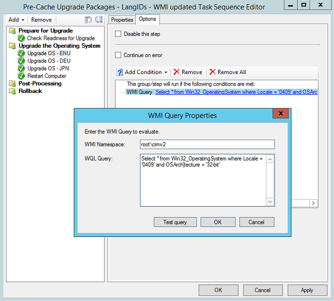

# Configure pre-cache content for task sequences

*Applies to: Configuration Manager (current branch)*

<!--1021244-->
The pre-cache feature for available deployments of task sequences lets clients download relevant content before a user installs the task sequence. The client can pre-cache content for task sequences that [upgrade an OS](create-a-task-sequence-to-upgrade-an-operating-system.md) or [install an OS image](create-a-task-sequence-to-install-an-operating-system.md).

For example, you only want a single in-place upgrade task sequence for all users, and have many architectures and languages. In previous versions, the content starts to download when the user installs an available task sequence deployment from Software Center. This delay adds more time before the installation is ready to start. All content referenced in the task sequence is downloaded. This content includes the OS upgrade package for all languages and architectures. If each upgrade package is roughly 3 GB in size, the total content is very large.

Pre-cache content gives you the option for the client to only download the applicable content and all other referenced content as soon as it receives the deployment. When the user selects **Install** in Software Center, the content is ready. The installation starts quickly because the content is on the local hard drive.

Use pre-caching to reduce bandwidth consumption of the following content types:<!--4224642-->

- OS upgrade packages
- OS images
- Driver packages
- Packages

> [!NOTE]
> Starting in version 2103, if you use a feature update with the **Upgrade OS** task sequence step, the option to **Pre-download content for this task sequence** doesn't apply to feature updates.<!--3555906-->

## Configure pre-caching

There are three steps to configure the pre-cache feature:

1. [Create and configure the packages](#bkmk_createpkg)
1. [Create a task sequence with conditional steps](#bkmk_createts)
1. [Deploy the task sequence and enable pre-caching](#bkmk_deploy)

### <a name="bkmk_createpkg"></a> 1. Create and configure the packages

The client evaluates attributes of the packages to determine which content it downloads during pre-caching.

#### OS upgrade package

Create [OS upgrade packages](../get-started/manage-operating-system-upgrade-packages.md) for specific architectures and languages. Specify the **Architecture** and **Language** on the **Data Source** tab of its properties.

#### OS image

Create [OS images](../get-started/manage-operating-system-images.md) for specific architectures and languages. Specify the **Architecture** and **Language** on the **Data Source** tab of its properties.

#### Driver package

Create [driver packages](../get-started/manage-drivers.md#driver-packages) for specific hardware models. Specify the **Model** on the **General** tab of its properties.

To determine which driver package it downloads during pre-caching, the client evaluates the model against the **Name** property of the **Win32_ComputerSystemProduct** WMI class.

> [!TIP]
> The actual query uses a `LIKE` statement with wildcards: `select * from win32_computersystemproduct where name like "%yourstring%"`. For example, if you specify `Surface` as the model, the query matches all models that include that string.<!-- 6315551 -->

#### Package

Create [packages](../../apps/deploy-use/packages-and-programs.md) for specific architectures and languages. Specify the **Architecture** and **Language** on the **General** tab of its properties.

### <a name="bkmk_createts"></a> 2. Create a task sequence

Create a task sequence with conditional steps for the different languages and architectures, or different hardware models for driver packages.

|Content|Step|
|---------|---------|
|OS upgrade package|[Upgrade OS](../understand/task-sequence-steps.md#BKMK_UpgradeOS)|
|OS image|[Apply OS Image](../understand/task-sequence-steps.md#BKMK_ApplyOperatingSystemImage)|
|Driver package|[Apply Driver Package](../understand/task-sequence-steps.md#BKMK_ApplyDriverPackage)|
|Package|[Install Package](../understand/task-sequence-steps.md#BKMK_InstallPackage)|

For example, the following **Upgrade OS** step uses the English version:




> [!TIP]
> The following WMI query is recommended for the English (United States) OS and 64-bit architecture:
>
> ```WMI
> SELECT * FROM Win32_OperatingSystem WHERE OSArchitecture LIKE '%64%' AND OSLanguage='1033'
> ```
>
> First add the language by selecting the **Operating System Language** condition. Then edit the WMI query to include the architecture clause.

### <a name="bkmk_deploy"></a> 3. Deploy the task sequence

[Deploy the task sequence](deploy-a-task-sequence.md). For the pre-cache feature, configure the following settings:

- On the **General** tab, select **Pre-download content for this task sequence**.

    > [!NOTE]
    > Starting in version 2103, if you use a feature update with the **Upgrade OS** task sequence step, this option doesn't apply to feature updates.<!--3555906-->

- On the **Deployment settings** tab, configure the task sequence as **Available**.

- On the **Scheduling** tab, choose the currently selected time for the setting, **Schedule when this deployment will be available**. The client starts pre-caching content at the deployment's available time. When a targeted client receives this policy, the available time is in the past, so pre-cache download starts right away. If the client receives this policy but the available time is in the future, the client doesn't start pre-caching content until the available time occurs.

- On the **Distribution Points** tab, configure the **Deployment options** settings. If the content isn't pre-cached before a user starts the installation, the client uses these settings.

    > [!IMPORTANT]
    > For a task sequence that installs an OS image, don't use the deployment option to **Download content locally when needed by the running task sequence**. When the task sequence wipes the disk before it applies the OS image, it removes the client cache. Since the content is gone, the task sequence fails.<!-- SCCMDocs-PR #1338 --> These deployment options are dynamic based on other options you select for the deployment. For more information, see [Deploy a task sequence](deploy-a-task-sequence.md#bkmk_deploy-options).<!-- MEMDocs#328, SCCMDocs#2114 -->

## User experience

- When the client receives the deployment policy, it starts to pre-cache the content after the deployment's available time. This content includes all referenced packages, but only the OS upgrade package that matches the architecture and language attributes on the package.

- When the client makes the deployment available to users, a notification displays to inform users about the new deployment. Now the task sequence is visible in Software Center. The user can go to Software Center and select **Install** to start the installation.

- If the client hasn't fully pre-cached the content when the user installs the task sequence, then the client uses the settings that you specify for the **Deployment options** on the **Distribution Points** tab of the deployment.

## See also

- [Create a task sequence to upgrade an OS](create-a-task-sequence-to-upgrade-an-operating-system.md)

- [Scenario to upgrade Windows to the latest version](upgrade-windows-to-the-latest-version.md)
