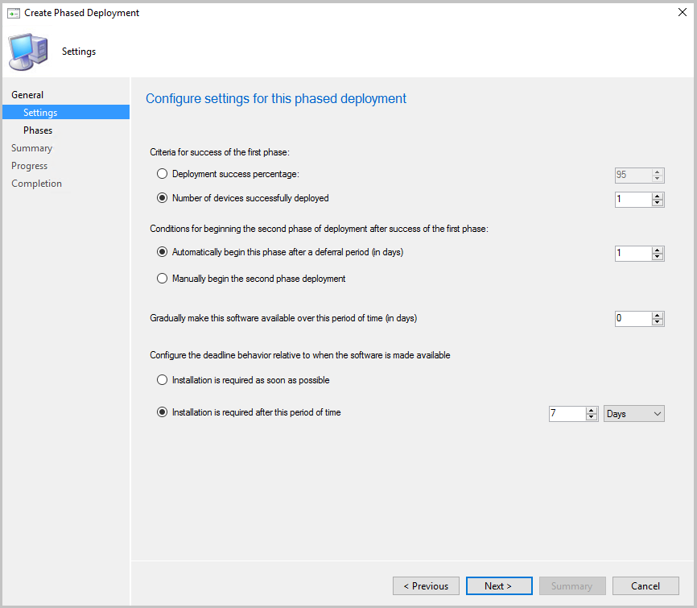

# Create phased deployments with Configuration Manager

*Applies to: Configuration Manager (current branch)*

Phased deployments automate a coordinated, sequenced rollout of software across multiple collections. For example, deploy software to a pilot collection, and then automatically continue the rollout based on success criteria. Create phased deployments with the default of two phases, or manually configure multiple phases.

Create phased deployments for the following objects:

- **Task sequence**
  - The phased deployment of task sequences doesn't support PXE or media installation
- **Application** <!--1358147-->  
- **Software update** <!--1358146-->  
  - You can't use an automatic deployment rule (ADR) with a phased deployment

## Prerequisites

### Security scope

Deployments created by phased deployments aren't viewable to any administrative user that doesn't have the **All** security scope. For more information, see [Security scopes](../../core/understand/fundamentals-of-role-based-administration.md#security-scopes).

### Distribute content

Before creating a phased deployment, distribute the associated content to a distribution point.<!--518293-->  

- **Application**: Select the target application in the console and use the **Distribute Content** action in the ribbon. For more information, see [Deploy and manage content](../../core/servers/deploy/configure/deploy-and-manage-content.md).

- **Task sequence**: You have to create referenced objects like the OS upgrade package before creating the task sequence. Distribute these objects before creating a deployment. Use the **Distribute Content** action on each object, or the task sequence. To view status of all referenced content, select the task sequence, and switch to the **References** tab in the details pane. For more information, see the specific object type in [Prepare for OS deployment](../get-started/prepare-for-operating-system-deployment.md).

- **Software update**: create the deployment package and distribute it. Use the Download Software Updates Wizard. For more information, see [Download software updates](../../sum/deploy-use/download-software-updates.md).  

##  Phase settings

These settings are unique to phased deployments. Configure these settings when creating or editing the phases to control the scheduling and behavior of the phased deployment process.

Optionally, use the following Windows PowerShell cmdlets to manually configure phases for software update and task sequence phased deployments:

- [New-CMSoftwareUpdatePhase](/powershell/module/configurationmanager/new-cmsoftwareupdatephase)
- [New-CMTaskSequencePhase](/powershell/module/configurationmanager/new-cmtasksequencephase)

### Criteria for success of the first phase

- **Deployment success percentage**: Specify the percent of devices that need to successfully complete the deployment for the first phase to succeed. By default, this value is 95%. In other words, the site considers the first phase successful when the compliance state for 95% of the devices is **Success** for this deployment. The site then continues to the second phase, and creates a deployment of the software to the next collection.

- **Number of devices successfully deployed**: Specify the number of devices that need to successfully complete the deployment for the first phase to succeed. This option is useful when the size of the collection is variable, and you have a specific number of devices to show success before moving to the next phase. <!--3555946-->

### Conditions for beginning second phase of deployment after success of the first phase  

- **Automatically begin this phase after a deferral period (in days)**: Choose the number of days to wait before beginning the second phase after the success of the first. By default, this value is one day.  

- **Manually begin the second phase of deployment**: The site doesn't automatically begin the second phase after the first phase succeeds. This option requires that you manually start the second phase. For more information, see [Move to the next phase](manage-monitor-phased-deployments.md#bkmk_move).  

    > [!Note]  
    > This option isn't available for phased deployments of applications.  

### Gradually make this software available over this period of time (in days)
<!--1358578-->
Configure this setting for the rollout in each phase to happen gradually. This behavior helps mitigate the risk of deployment issues, and decreases the load on the network that is caused by the distribution of content to clients. The site gradually makes the software available depending on the configuration for each phase. Every client in a phase has a deadline relative to the time the software is made available. The time window between the available time and deadline is the same for all clients in a phase. The default value of this setting is zero, so by default the deployment isn't throttled. Don't set the value higher than 30.<!--SCCMDocs-pr issue 2767-->

### Configure the deadline behavior relative to when the software is made available

- **Installation is required as soon as possible**: Set the deadline for installation on the device as soon as the device is targeted.  

- **Installation is required after this period of time**: Set a deadline for installation a certain number of days after device is targeted. By default, this value is seven days.

##  Automatically create a default two-phase deployment

1. Start the Create Phased Deployment wizard in the Configuration Manager console. This action varies based on the type of software you're deploying:  

    - **Application**: Go to the **Software Library**, expand **Application Management**, and select **Applications**. Select an existing application, and then choose **Create Phased Deployment** in the ribbon.  

    - **Software update**: Go to the **Software Library**, expand **Software Updates**, and select **All Software Updates**. Select one or more updates, and then choose **Create Phased Deployment** in the ribbon.  

        This action is available for software updates from the following nodes:  
        - Software Updates  
            - **All Software Updates**  
            - **Software Update Groups**
        - Windows Servicing, **All Windows Updates**  
        - Office 365 Client Management, **Office 365 Updates**  

    - **Task sequence**: Go to the **Software Library** workspace, expand **Operating Systems**, and select **Task Sequences**. Select an existing task sequence, and then choose **Create Phased Deployment** in the ribbon.  

2. On the **General** page, give the phased deployment a **Name**, **Description** (optional), and select **Automatically create a default two phase deployment**.  

3. Select **Browse** and choose a target collection for both the **First Collection** and **Second Collection** fields. For a task sequence and software updates, select from device collections. For an application, select from user or device collections. Select **Next**.  

    > [!Important]  
    > The Create Phased Deployment wizard doesn't notify you if a deployment is potentially high-risk. For more information, see [Settings to manage high-risk deployments](../../core/servers/manage/settings-to-manage-high-risk-deployments.md) and the note when you [Deploy a task sequence](deploy-a-task-sequence.md).  

4. On the **Settings** page, choose one option for each of the scheduling settings. For more information, see [Phase settings](#bkmk_settings). Select **Next** when complete.  

5. On the **Phases** page, see the two phases that the wizard creates for the specified collections. Select **Next**. These instructions cover the procedure to automatically create a default two-phase deployment. The wizard lets you add, remove, reorder, edit, or view phases for a phased deployment. For more information on these additional actions, see [Create a phased deployment with manually configured phases](#bkmk_manual).  

6. Confirm your selections on the **Summary** tab, and then select **Next** to complete the wizard.  

> [!NOTE]
> Starting on April 21, 2020, Office 365 ProPlus is being renamed to **Microsoft 365 Apps for enterprise**. For more information, see [Name change for Office 365 ProPlus](/deployoffice/name-change). You may still see the old name in the Configuration Manager product and documentation while the console is being updated.  

Optionally, use the following Windows PowerShell cmdlets for this task:

- [New-CMApplicationAutoPhasedDeployment](/powershell/module/configurationmanager/new-cmapplicationautophaseddeployment)
- [New-CMSoftwareUpdateAutoPhasedDeployment](/powershell/module/configurationmanager/new-cmsoftwareupdateautophaseddeployment)
- [New-CMTaskSequenceAutoPhasedDeployment](/powershell/module/configurationmanager/new-cmtasksequenceautophaseddeployment)

##  Create a phased deployment with manually configured phases
<!--1358148-->

Create a phased deployment with manually configured phases for a task sequence. Add up to 10 additional phases from the **Phases** tab of the Create Phased Deployment wizard.

> [!Note]  
> You can't currently manually create phases for an application. The wizard automatically creates two phases for application deployments.

1. Start the Create Phased Deployment wizard for either a task sequence or software updates.  

1. On the **General** page of the Create Phased Deployment wizard, give the phased deployment a **Name**, **Description** (optional), and select **Manually configure all phases**.  

1. From the **Phases** page of the Create Phased Deployment wizard, the following actions are available:  

    - **Filter** the list of deployment phases. Enter a string of characters for a case-insensitive match of the Order, Name, or Collection columns.

    - **Add** a new phase:  

        1. On the **General** page of the Add Phase Wizard, specify a **Name** for the phase, and then browse to the target **Phase Collection**. The additional settings on this page are the same as when normally deploying a task sequence or software updates.  

        1. On the **Phase Settings** page of the Add Phase Wizard, configure the scheduling settings, and select **Next** when complete. For more information, see [Settings](#bkmk_settings).

            > [!Note]  
            > You can't edit the phase settings, **Deployment success percentage** or **Number of devices successfully deployed**, on the first phase. These settings only apply to phases that have a previous phase.

        1. The settings on the **User Experience** and **Distribution Points** pages of the Add Phase Wizard are the same as when normally deploying a task sequence or software updates.  

        1. Review the settings on the **Summary** page, and then complete the Add Phase Wizard.  

    - **Edit**: This action opens the selected phase's Properties window, which has tabs the same as the pages of the Add Phase Wizard.  

    - **Remove**: This action deletes the selected phase.  

       > [!Warning]  
       > There is no confirmation, and no way to undo this action.  

    - **Move Up** or **Move Down**: The wizard orders the phases by how you add them. The most recently added phase is last in the list. To change the order, select a phase, and then use these buttons to move the phase's location in the list.  

       > [!Important]  
       > Review the phase settings after changing the order. Make sure the following settings are still consistent with your requirements for this phased deployment:  
       >
       > - Criteria for success of the previous phase  
       > - Conditions for beginning this phase of deployment after success of the previous phase

1. Select **Next**. Review the settings on the **Summary** page, and then complete the Create Phased Deployment wizard.

Optionally, use the following Windows PowerShell cmdlets for this task:

- [New-CMSoftwareUpdateManualPhasedDeployment](/powershell/module/configurationmanager/new-cmsoftwareupdatemanualphaseddeployment)
- [New-CMTaskSequenceManualPhasedDeployment](/powershell/module/configurationmanager/new-cmtasksequencemanualphaseddeployment)

After you create a phased deployment, open its properties to make changes:  

- **Add** additional phases to an existing phased deployment.  

- If a phase isn't active, you can **Edit**, **Remove**, or **Move** it up or down. You can't move it before an active phase.  

- When a phase is active, it's read-only. You can't edit it, remove it, or move its location in the list. The only option is to **View** the properties of the phase.  

- An application phased deployment is always read-only.  

## Next steps

Manage and monitor phased deployments:

- [Application](manage-monitor-phased-deployments.md?toc=/mem/configmgr/apps/toc.json&bc=/mem/configmgr/apps/breadcrumb/toc.json)
- [Software update](manage-monitor-phased-deployments.md?toc=/mem/configmgr/sum/toc.json&bc=/mem/configmgr/sum/breadcrumb/toc.json)  
- [Task sequence](manage-monitor-phased-deployments.md)  
