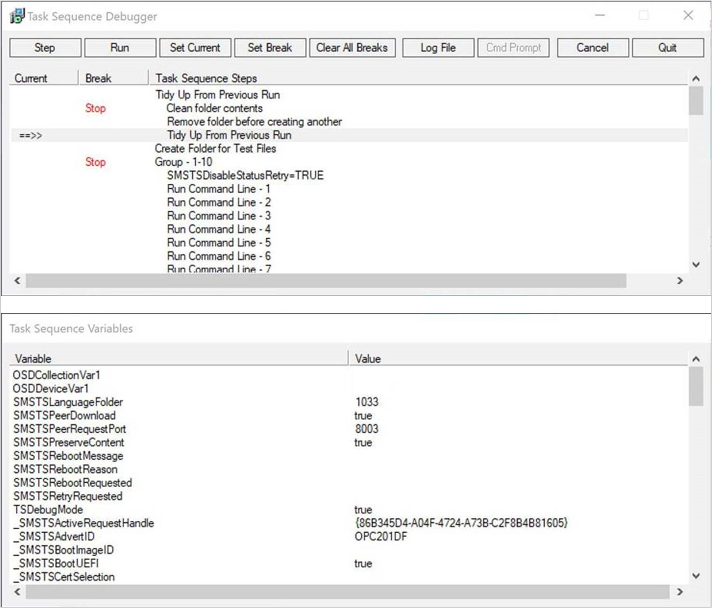

# Debug a task sequence

*Applies to: Configuration Manager (current branch)*

<!--3612274-->

The task sequence debugger is a troubleshooting tool. You deploy a task sequence in debug mode to a small collection. It lets you step through the task sequence in a controlled manner to aid troubleshooting and investigation. The debugger currently runs on the same device as the task sequence engine, it's not a remote debugger.

> [!TIP]
> This feature was first introduced in version 1906 as a [pre-release feature](../../core/servers/manage/pre-release-features.md). Beginning with version 2203, it's no longer a pre-release feature.
>
> Configuration Manager doesn't enable this optional feature by default. Before using it, you need to enable this feature. For more information, see [Enable optional features from updates](../../core/servers/manage/optional-features.md).

## Prerequisites

- Update the Configuration Manager client on the target device

- Sign in to the target device as a user in the local **Administrators** group. The debugger only runs for administrators.

- Update the boot image associated with the task sequence to make sure it has the latest client version

## Start the tool

1. In the Configuration Manager console, go to the **Software Library** workspace, expand **Operating Systems**, and select **Task Sequences**.

1. Select a task sequence. In the Deployment group of the ribbon, select **Debug**.

    > [!Tip]  
    > Alternatively, set the variable **TSDebugMode** to `TRUE` on a collection or computer object to which the task sequence is deployed. Any device that has this variable set will put any task sequence deployed to it into debug mode.

1. Create a debug deployment. The deployment settings are the same as a normal task sequence deployment. For more information, see [Deploy a task sequence](deploy-a-task-sequence.md#process).

    > [!Note]  
    > You can only select a small collection for a debug deployment. It only displays device collections with 10 or less members.

Use the task sequence variable **TSDebugOnError** to automatically start the debugger when the task sequence returns an error.<!-- 5012536 --> For more information, see [Task sequence variables - TSDebugOnError](../understand/task-sequence-variables.md#TSDebugOnError).

## Use the tool

When the task sequence runs on the device, the Task Sequence Debugger window opens similar to the following screenshot:

The debugger includes the following controls:

- **Step**: From the *current* position, run only the next step in the task sequence.  

    > [!Note]  
    > When the task sequence is in debug mode, if a step returns a fatal error, the task sequence doesn't fail as normal. This behavior gives you the option to retry a step after you make an external change.

- **Run**: From the *current* position, run the task sequence normally to the end, the next *break* point, or if a step fails. Before you use this action, make sure to set any break points with the **Set Break** action.

- **Set Current**: Select a step in the debugger and then select **Set Current**. This action moves the *current* pointer to that step. This action allows you to skip steps or move backwards.  

    > [!Warning]  
    > The debugger doesn't consider the type of step when you change the current position in the sequence. Some steps may set task sequence variables that are required for condition evaluation by later steps. If run out of order, some steps may fail or cause significant damage to a device. Use this option at your own risk.  

- **Set Break**: Select a step in the debugger and then select **Set Break**. This action adds a *break* point in the debugger. When you **Run** the task sequence, it stops at a *break*.  

  - Before you use the **Run** action, set break points.

  - If you create a break point in the debugger, and then the task sequence restarts the computer, the debugger keeps your break points after restart.<!-- 5012509 -->

- **Clear All Breaks**: Remove all break points.

- **Log File**: Opens the current task sequence log file, **smsts.log**, with [CMTrace](../../core/support/cmtrace.md). You can see log entries when the task sequence engine is "Waiting for the debugger."

- **Cmd Prompt**: In Windows PE, opens a command prompt.

- **Cancel**: Close the debugger, and fail the task sequence.

- **Quit**: Detach and close the debugger, but the task sequence continues to run normally.

The **Task Sequence Variables** window shows the current values for all variables in the task sequence environment. For more information, see [Task sequence variables](../understand/task-sequence-variables.md). If you use the [Set Task Sequence Variable](../understand/task-sequence-steps.md#BKMK_SetTaskSequenceVariable) step with the option to **Do not display this value**, the debugger doesn't display the variable value. You can't edit the variable values in the debugger.

> [!Note]
> Some task sequence variables are for internal use only, and not listed in the reference documentation.

The task sequence debugger continues to run after a [Restart Computer](../understand/task-sequence-steps.md#BKMK_RestartComputer) step, but you need to recreate any break points. Even though the task sequence may not require it, since the debugger requires user interaction, you need to sign in to Windows to continue. If you don't sign in after one hour to continue debugging, the task sequence fails.

It also steps into a child task sequence with the [Run Task Sequence](../understand/task-sequence-steps.md#child-task-sequence) step. The debugger window shows the steps of the child task sequence along with the main task sequence.

## Known issues

If you target both a normal deployment and debug deployment to the same device through multiple deployments, the task sequence debugger may not launch.

## See also

- [About task sequence steps](../understand/task-sequence-steps.md)
- [Task sequence variables](../understand/task-sequence-variables.md)
- [How to use task sequence variables](../understand/using-task-sequence-variables.md)
- [Deploy a task sequence](deploy-a-task-sequence.md)
