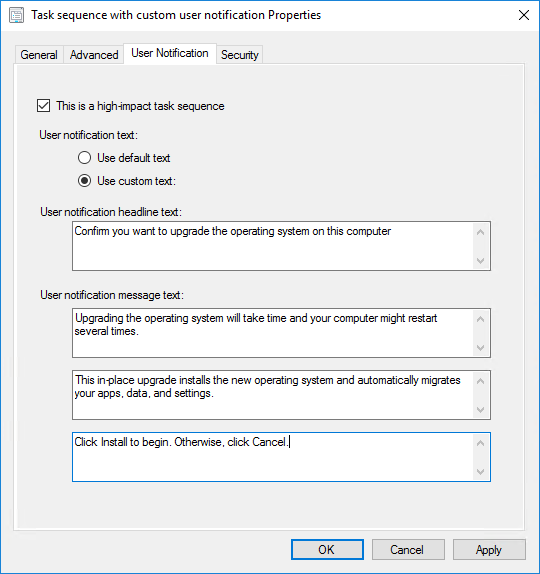
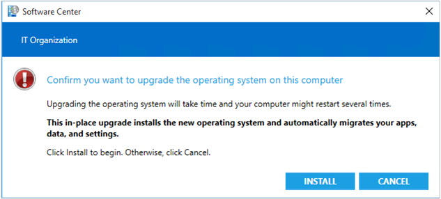

# High-impact task sequence settings

*Applies to: Configuration Manager (current branch)*

Configure a task sequence as high-impact and customize the messages that users receive when they run the task sequence. Any task sequence that meets certain conditions is automatically defined as high-impact. For more information, see [Manage high-risk deployments](../../core/servers/manage/settings-to-manage-high-risk-deployments.md).

> [!WARNING]
> If you use PXE deployments, and configure device hardware with the network adapter as the first boot device, these devices can automatically start an OS deployment task sequence without user interaction. Deployment verification doesn't manage this configuration. While this configuration may simplify the process and reduce user interaction, it puts the device at greater risk for accidental reimage.

## Set a task sequence as high-impact

Use the following procedure to set a task sequence as high-impact.

1. In the Configuration Manager console, go to the **Software Library** workspace, expand **Operating Systems**, and select **Task Sequences**.

2. Select the task sequence to configure, and select **Properties**.

3. On the **User Notification** tab, select **This is a high-impact task sequence**.

## Create a custom notification

> [!NOTE]
> The client only displays high-impact notifications for required OS deployment task sequences. It doesn't display them for non-OS deployment or stand-alone task sequences.

Use the following procedure to create a custom notification for high-impact deployments.

1. In the Configuration Manager console, go to the **Software Library** workspace, expand **Operating Systems**, and select **Task Sequences**.

2. Select the task sequence to configure, and select **Properties**.

3. On the **User Notification** tab, select **Use custom text**.

    > [!NOTE]
    > You can only set user notification text when you select the option, **This is a high-impact task sequence**.

4. Configure the following settings:

    > [!NOTE]
    > Each text box has a maximum limit of 255 characters.

    - **User notification headline text**: Specifies the blue text that displays on the Software Center user notification. For example, in the default user notification, this section contains "Confirm you want to upgrade the operating system on this computer."

    - **User notification message text**: There are three text boxes that provide the body of the custom notification. All text boxes require that you add text.

        - First text box: Specifies the main body of text, typically containing instructions for the user. For example, in the default user notification, this section contains "Upgrading the operating system takes time and your computer might restart several times."

        - Second text box: Specifies the bold text under the main body of text. For example, in the default user notification, this section contains "This in-place upgrade installs the new operating system and automatically migrates your apps, data, and settings."

        - Third text box: Specifies the last line of text under the bold text. For example, in the default user notification, this section contains "Click Install to begin. Otherwise, click Cancel."

## Example

You configure the following custom notification in task sequence properties:

The following notification message displays when the end user opens the installation from Software Center:

## Next steps

[Task sequence performance](task-sequence-performance.md)
