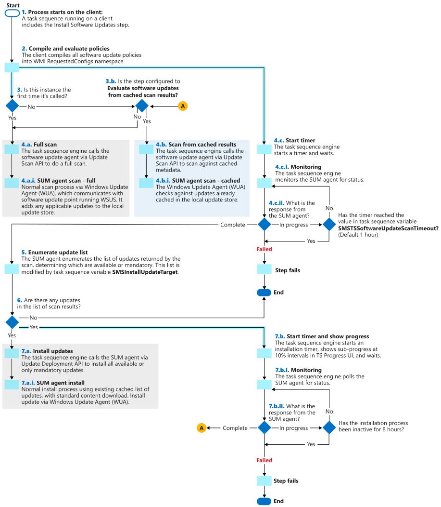

# Install Software Updates

*Applies to: Configuration Manager (current branch)*

The **Install Software Updates** step is commonly used in Configuration Manager task sequences. When installing or updating the OS, it triggers the software updates components to scan for and deploy updates. This step can cause challenges for some customers, such as long timeout delays or missed updates. Use the information in this article to help mitigate common issues with this step, and for better troubleshooting when things go wrong.

For more information on the step, see [Install Software Updates](task-sequence-steps.md#BKMK_InstallSoftwareUpdates)

## Recommendations

To help this process be successful, use the following recommendations:

- [Use offline servicing](#use-offline-servicing)
- [Single index](#single-index)
- [Reduce image size](#bkmk_resetbase)

### Use offline servicing

Use Configuration Manager to regularly install applicable software updates to your image files. This practice then reduces the number of updates that you need to install during the task sequence.

For more information, see [Apply software updates to an image](../get-started/manage-operating-system-images.md#apply-software-updates-to-an-image).

### Single index

Many image files include multiple indexes, such as for different editions of Windows. Reduce the image file to a single index that you require. This practice reduces the amount of time to apply software updates to the image. It also enables the next recommendation to reduce the image size.

Automate this process when you add an OS image to the site. For more information, see [Add an OS image](../get-started/manage-operating-system-images.md#BKMK_AddOSImages).<!--3719699-->

### <a name="bkmk_resetbase"></a> Reduce image size

When you apply software updates to the image, optimize the output by removing any superseded updates. Use the DISM command-line tool, for example:

``` Command
dism /Mount-Image /ImageFile:C:\Data\install.wim /MountDir:C:\Mountdir
dism /Image:C:\Mountdir /Cleanup-Image /StartComponentCleanup /ResetBase
dism /Unmount-Image /MountDir:C:\Mountdir /Commit  
```

There's an option to automate this process. For more information, see [Optimized image servicing](../get-started/manage-operating-system-images.md#optimized-image-servicing).<!--3555951-->

## Image engineering decisions

When you design your imaging process, there are several options that can affect the installation of software updates:

- [Periodically recapture the image](#bkmk_goldimage)  
- [Use offline servicing](#bkmk_offline)  
- [Use default image only](#bkmk_installwim)

### <a name="bkmk_goldimage"></a> Periodically recapture the image

You have an automated process to capture a custom OS image on a regular schedule. This capture task sequence installs the latest software updates. These updates can include cumulative, non-cumulative, and other critical updates such as servicing stack updates (SSU). The deployment task sequence installs any other updates since capture.

For more information on this process, see [Create a task sequence to capture an OS](../deploy-use/create-a-task-sequence-to-capture-an-operating-system.md).

#### Advantages: recapture image

- Fewer updates to apply at deployment time per client, which saves time and bandwidth during deployment
- Fewer updates to worry about causing restarts
- Customized image for the organization
- Fewer variables at deployment time

#### Disadvantages: recapture image

- Time to create and capture image, even though it's mostly automated
- Increased time to distribute the image to distribution points, which can be seen as outage for active deployments
- Time to test through pre-production environments may be longer than OS patch cycle, which can make the updated image irrelevant

### <a name="bkmk_offline"></a> Use offline servicing

Schedule Configuration Manager to apply software updates to your images.

For more information, see [Apply software updates to an image](../get-started/manage-operating-system-images.md#apply-software-updates-to-an-image).

#### Advantages: offline servicing

- Fewer updates to apply at deployment time per client, which saves time and bandwidth during deployment
- Fewer updates to worry about causing restarts
- You can schedule the servicing process at the site

#### Disadvantages: offline servicing

- Manual selection of updates
- Increased time to distribute the image to distribution points
- Only supports CBS-based updates. It can't apply Microsoft 365 Apps updates

> [!TIP]
> You can automate the selection of software updates using PowerShell. Use the [Get-CMSoftwareUpdate](/powershell/module/configurationmanager/get-cmsoftwareupdate) cmdlet to get a list of updates. Then use the [New-CMOperatingSystemImageUpdateSchedule](/powershell/module/configurationmanager/new-cmoperatingsystemimageupdateschedule) cmdlet to create the offline servicing schedule. The following example shows one method to automate this action:
>
> ```PowerShell
> # Get the OS image
> $Win10Image = Get-CMOperatingSystemImage -Name "Windows 10 Enterprise"
>
> # Get the latest cumulative update for Windows 10 1809
> $OSBuild = "1809"
> $LatestUpdate = Get-CMSoftwareUpdate -Fast | Where {$_.LocalizedDisplayName -Like "*Cumulative Update for Windows 10 Version $OSBuild for x64*" -and $_.LocalizedDisplayName -notlike "*Dynamic*"} | Sort-Object ArticleID -Descending | Select -First 1
> Write-Host "Latest update for Windows 10 build" $OSBuild "is" $LatestUpdate.LocalizedDisplayName
>
> # Create a new update schedule to apply the latest update
> New-CMOperatingSystemImageUpdateSchedule -Name $Win10Image.Name -SoftwareUpdate $LatestUpdate -RunNow -ContinueOnError $True
> ```

### <a name="bkmk_installwim"></a> Use default image only

Use the default Windows install.wim image file in your deployment task sequences.

#### Advantages: default image

- A known good source, which reduces the risk of image corruption as a possible issue
- Eliminates modifications to image as a possible issue

#### Disadvantages: default image

- Potential for high volume of updates during the deployment
- Increased deployment time for every device
- May not have needed customizations, requires other task sequence steps to customize

## Flowchart

This flowchart diagram shows the process when you include the Install Software Updates step in a task sequence.

[View the diagram at full size](media/ts-step-install-software-updates.svg)

  

1. **Process starts on the client**: A task sequence running on a client includes the Install Software updates step.
2. **Compile and evaluate policies**: The client compiles all software update policies into WMI RequestedConfigs namespace. (CIAgent.log)
3. *Is this instance the first time it's called?*  
    1. **Yes**: Go to **Full scan**  
    2. **No**: *Is the step configured with the option to [Evaluate software updates from cached scan results](task-sequence-steps.md#evaluate-software-updates-from-cached-scan-results)?*
        1. **Yes**: Go to **Scan from cached results**
        2. **No**: Go to **Full scan**
4. Scan process: either a full scan or scan from cached results, with monitoring process in parallel.
    1. **Full scan**: The task sequence engine calls the software update agent via Update Scan API to do a *full* scan. (WUAHandler.log, ScanAgent.log)  
        1. **SUM agent scan - full**: Normal scan process via Windows Update Agent (WUA), which communicates with software update point running WSUS. It adds any applicable updates to the local update store. (WindowsUpdate.log, UpdateStore.log)
    2. **Scan from cached results**: The task sequence engine calls the software update agent via Update Scan API to scan against cached metadata. (WUAHandler.log, ScanAgent.log)
        1. **SUM agent scan - cached**: The Windows Update Agent (WUA) checks against updates already cached in the local update store. (WindowsUpdate.log, UpdateStore.log)
    3. **Start scan timer**: The task sequence engine starts a timer and waits. (This process happens in parallel with either the full scan or scan from cached results process.)
        1. **Monitoring**: The task sequence engine monitors the SUM agent for status.
        2. *What's the response from the SUM agent?*
            - **In progress**: Has the timer reached the value in task sequence variable [SMSTSSoftwareUpdateScanTimeout](task-sequence-variables.md#SMSTSSoftwareUpdateScanTimeout)? (Default 1 hour)
                - **Yes**: The step fails.
                - **No**: Go to **Monitoring**
            - **Failed**: The step fails.
            - **Complete**: Go to **Enumerate update list**
5. **Enumerate update list**: The SUM agent enumerates the list of updates returned by the scan, determining which are available or mandatory.
6. *Are there any updates in the list of scan results?*
    - **Yes**: Go to **Install updates**
    - **No**: Nothing to install, the step successfully completes.
7. Deployment process: The install updates process happens in parallel with the deployment monitoring process.
    1. **Install updates**: The task sequence engine calls the SUM agent via Update Deployment API to install all available or only mandatory updates. This behavior is based on the configuration of the step, whether you select **Required for installation - Mandatory software updates only** or **Available for installation - All software updates**. You can also specify this behavior using the [SMSInstallUpdateTarget](task-sequence-variables.md#SMSInstallUpdateTarget) variable.
        1. **SUM agent install**: Normal install process using existing cached list of updates, with standard content download. Install update via Windows Update Agent (WUA). (UpdatesDeployment.log, UpdatesHandler.log, WuaHandler.log, WindowsUpdate.log)
    2. **Start deployment timer and show progress**: The task sequence engine starts an installation timer, shows subprogress at 10% intervals in TS Progress UI, and waits.
        1. **Monitoring**: The task sequence engine polls the SUM agent for status.
        2. *What's the response from the SUM agent?*
            - **In progress**: *Has the installation process been inactive for 8 hours?*
                - **Yes**: The step fails.
                - **No**: Go to **Monitoring**
            - **Failed**: The step fails.
            - **Complete**: Go to *Is the step configured with the option to **Evaluate software updates from cached scan results**?*

### Timeouts

The diagram includes two of the timeout variables that apply to this step. There are other standard timers from other components that can affect this process.

- Update scan timeout: One hour (smsts.log)
- Location request timeout: One hour (LocationServices.log, CAS.log)
- Content download timeout: One hour (DTS.log)
- Inactive distribution point timeout: One hour (LocationServices.log, CAS.log)
- Total install inactive timeout: Eight hours (smsts.log)

## Troubleshooting

Use the following resources and additional information to help you troubleshoot issues with this step:

- Make sure to target your software update deployments to the same collection as the task sequence deployment.

- Make sure to include software update points in boundary groups. For more information, see [Configuration Manager clients don't get software updates](/troubleshoot/mem/configmgr/clients-not-get-software-updates).

- To help you troubleshoot the software update management process, see [Troubleshoot software update management in Configuration Manager](/troubleshoot/mem/configmgr/troubleshoot-software-update-management).

- To help improve overall performance, reduce the size of the software update catalog. For example:

  - Remove unnecessary classifications, products, and languages. For more information, see [Configure classifications and products to synchronize](../../sum/get-started/configure-classifications-and-products.md).

  - Reindex the site database and rebuild statistics. For more information, see the [FAQ for site sizing and performance](../../core/understand/site-size-performance-faq.yml#should-i-implement-any-additional-sql-server-indexing-tasks-).

  - Decline unnecessary updates, for example:

    - Superseded.

        > [!NOTE]
        > Configuration Manager does this action for you. For more information, see [WSUS cleanup behavior](../../sum/deploy-use/software-updates-maintenance.md#wsus-cleanup-behavior-starting-in-version-1810).

    - Itanium
    - Beta
    - Version Next
    - ARM
    - Versions of Windows you aren't deploying
