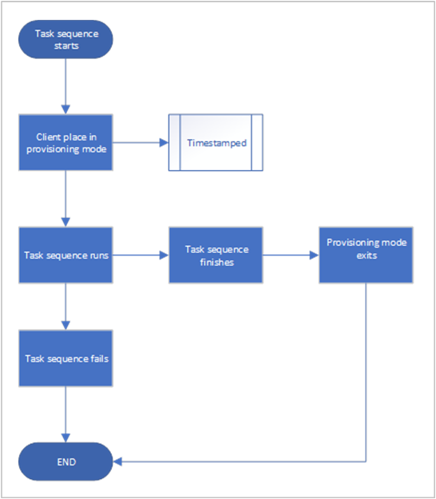
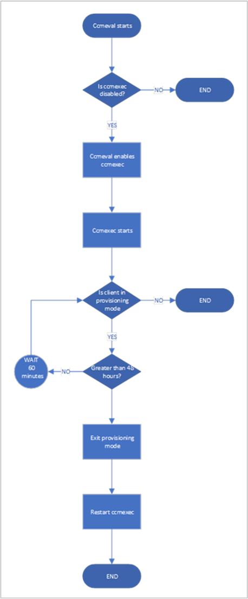

# Provisioning mode

*Applies to: Configuration Manager (current branch)*

During an OS deployment task sequence, Configuration Manager places the client in provisioning mode. (An OS deployment task sequence includes in-place upgrade.) In this state, the client doesn't process policy from the site. This behavior allows the task sequence to run without risk of additional deployments running on the client. When the task sequence completes, either success or handled failure, it exits client provisioning mode.

If the task sequence unexpectedly fails, the client can be left in provisioning mode. For example, if the device restarts in the middle of task sequence processing, and it's unable to recover. An administrator must manually identify and fix clients in this state.

## Manually remove provisioning mode

If a client is left in provisioning mode, use this manual process to return the client to normal operation.

```PowerShell
Invoke-WmiMethod -Namespace root\CCM -Class SMS_Client -Name SetClientProvisioningMode -ArgumentList $false
```

> [!IMPORTANT]
> One of the changes made by this WMI method is setting a registry value, but it makes other changes as well. Just changing the registry value doesn't fully take the client out of provisioning mode. If you manually edit the registry, the client may exhibit unexpected behaviors.

## Client provisioning mode timeout

The task sequence sets a timestamp when it puts the client in provisioning mode. Every 60 minutes, a client in provisioning mode checks the duration of time since the timestamp. If it's been in provisioning mode for more than 48 hours, the client automatically exits provisioning mode and restarts its process.

48 hours is the default provisioning mode timeout value. You can adjust this timer on a device by setting the **ProvisioningMaxMinutes** value in the following registry key: `HKLM\Software\Microsoft\CCM\CcmExec`. The value is specified in minutes. If this value doesn't exist or is `0`, the client uses the default 48 hours.

The timestamp **ProvisioningEnabledTime** is located in the following registry key: `HKLM\Software\Microsoft\CCM\CcmExec`. The timestamp has a value of the last time the machine entered provisioning mode. The format is epoch (Unix timestamp) and is in UTC.

This timestamp is also reset to the current time when you manually place the machine in provisioning mode by using the following command:

```powershell
Invoke-WmiMethod -Namespace root\CCM -Class SMS_Client -Name SetClientProvisioningMode -ArgumentList $true
```

## Process flow diagrams

These diagrams show the process flow for the task sequence and the client.

### Task sequence

The following diagram shows how the task sequence sets provisioning mode:



### Client remediation

The following diagram shows how the client exits provisioning mode:



## See also

[Setup Windows and ConfigMgr](task-sequence-steps.md#BKMK_SetupWindowsandConfigMgr)

[Upgrade Operating System](task-sequence-steps.md#BKMK_UpgradeOS)
