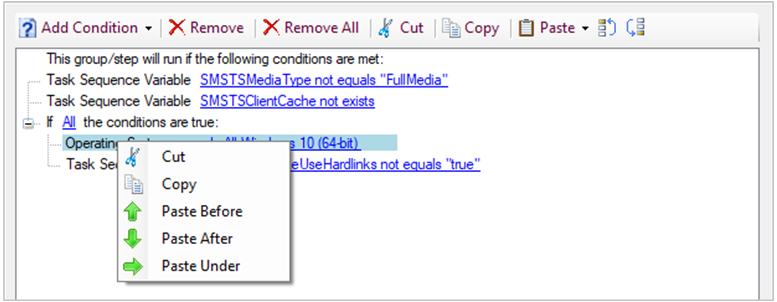

# Use the task sequence editor

*Applies to: Configuration Manager (current branch)*

Edit task sequences in the Configuration Manager console by using the **Task Sequence Editor**. Use the editor to:  

- Open a read-only view of the task sequence

- Add or remove steps from the task sequence  

- Change the order of the steps of the task sequence  

- Add or remove groups of steps  

- Copy and paste steps between task sequences

- Set step options like whether the task sequence continues when an error occurs  

- Add conditions to the steps and groups of a task sequence  

- Copy and paste conditions between steps in a task sequence

- Search the task sequence to quickly locate steps

Before you can edit a task sequence, you need to create it. For more information, see [Manage and create task sequences](../deploy-use/manage-task-sequences-to-automate-tasks.md).

## About the task sequence editor

The task sequence editor includes the following components:

<!-- The following numbered steps correspond to annotations in the above screenshot. Don't change the step numbers without also revising the image! -->

1. The name of the task sequence
2. Search. For more information, see [Search](#bkmk_search).
3. **Properties** for the selected group or step in the sequence

    For more information about the properties and options of a specific step, see [About task sequence steps](task-sequence-steps.md).

4. **Options** for the selected group or step in the sequence

    For more information on general options on all steps, or options of a specific step, see [About task sequence steps](task-sequence-steps.md).

    For more information on how to configure conditions, see [Conditions](#bkmk_conditions).

5. **Add** a group or steps
6. **Remove** a group or steps
7. Collapse all groups or expand all groups
8. Move the position of a group or step in the sequence (move up, move down)
9. The task sequence:
    - See the order of steps and groups.
    - Expand or collapse a group.
    - When you disable a step or group on its **Options**, it's greyed out in the sequence.
    - A step's icon changes to a red error if there's an issue with the step. For example, a required value is missing.
10. **OK**: Save and close
11. **Cancel**: Close without saving changes
12. **Apply**: Save changes and keep open

You can resize the task sequence editor using standard Windows controls. To resize the widths of the two main panes, use the mouse to select the bar between the task sequence and the step properties, and then drag it left or right.

> [!NOTE]
> Configuration Manager restricts actions for a task sequence that's greater than 2 MB in size. For example, the task sequence editor will display an error if you try to save changes to a large task sequence.<!--6888853--> For more information, see [Reduce the size of task sequence policy](../deploy-use/reduce-task-sequence-policy-size.md).

##  View a task sequence

1. In the Configuration Manager console, go to the **Software Library** workspace, expand **Operating Systems**, and then select the **Task Sequences** node.  

2. In the **Task Sequence** list, select the task sequence that you want to view.  

3. On the **Home** tab of the ribbon, in the **Task Sequence** group, select **View**.

    > [!TIP]
    > This action is the default. If you double-click a task sequence, you'll **View** the task sequence.

This action opens the task sequence editor in read-only mode. In this mode you can do the following actions:

- View all groups, steps, properties, and options
- Expand and collapse groups
- Search the task sequence
- Resize the editor window

In this read-only mode, you can't make any changes, including copying a step or condition. This action also doesn't lock the task sequence for editing. For more information on these locks, see [Reclaim lock for editing task sequences](#bkmk_sedo).

To make changes to a task sequence, close the task sequence editor that you have open in read-only mode. Then [Edit](#bkmk_edit) the task sequence.

> [!NOTE]  
> When you view or edit a task sequence that was created by the Create Task Sequence Wizard, the name of the step can be the action or type of the step. For example, you might see a step that has the name "Partition disk 0", which is the action for a step of type [Format and Partition Disk](task-sequence-steps.md#BKMK_FormatandPartitionDisk). All task sequence steps are documented by their *type*, not necessarily by the name of the step that the editor displays.  

##  Edit a task sequence

Use the following procedure to modify an existing task sequence:  

1. In the Configuration Manager console, go to the **Software Library** workspace, expand **Operating Systems**, and then select the **Task Sequences** node.  

2. In the **Task Sequence** list, select the task sequence that you want to edit.  

3. On the **Home** tab of the ribbon, in the **Task Sequence** group, select **Edit**. Then do any of the following actions:  

    - **Add a step**: Select **Add**, select a category, and then select the step to add. For example, to add the [Run Command Line](task-sequence-steps.md#BKMK_RunCommandLine) step: select **Add**, choose the **General** category, and then select **Run Command Line**. This action adds the step after the currently selected step.

    - **Add a group**: Select **Add**, and then choose **New Group**. After you add a group, then add steps to it.  

    - **Change the order**: Select the step or group that you want to reorder. Then use the **Move Up** or **Move Down** icons. You can move only one step or group at a time. These actions are also available when you right-click a group or step.

        You can cut, copy, and paste a group or a step. Right-click the item and select the action. You can also use standard keyboard shortcuts for each action:

        - Cut: **CTRL** + **X**
        - Copy: **CTRL** + **C**
        - Paste: **CTRL** + **V**

    - **Remove a step or group**: Select the step or group, and choose **Remove**.  

4. Select **OK** to save your changes and close the window. Select **Cancel** to discard your changes and close the window. Select **Apply** to save your changes and keep the task sequence editor open.  

For a list of the available task sequence steps, see [Task sequence steps](task-sequence-steps.md).  

> [!IMPORTANT]  
> If the task sequence has any unassociated references to an object as a result of the edit, the editor requires you fix the reference before it can close. Possible actions include:  
>
> - Correct the reference
> - Delete the unreferenced object from the task sequence  
> - Temporarily disable the failed task sequence step until the broken reference is corrected or removed  

You can open more than one instance of the task sequence editor at the same time. This behavior lets you compare multiple task sequences, or copy and paste steps between them. You can **Edit** one task sequence, and **View** another, but you can't do both actions on the same task sequence.

##  Conditions

Use conditions to control how the task sequence behaves. Add conditions to a single step or a group of steps. The task sequence evaluates the conditions before it runs the step on the device. It only runs the step if the conditions evaluate true. If a condition evaluates false, then the task sequence skips the group or step.

Use the **Options** tab to manage conditions:

The following types of conditions are available:

- **If statement**: Use an *if* statement to group conditions. You can evaluate **All conditions**, **Any condition**, or **None**.

- **Task sequence variable**. Evaluate the current value of any built-in, action, custom, or read-only [task sequence variable](task-sequence-variables.md) in the task sequence environment. For more information, see [Step conditions](using-task-sequence-variables.md#bkmk_access-condition).

    > [!NOTE]
    > You can use an array variable in this condition, but you have to specify the specific array member. For example, `OSDAdapter0EnableDHCP` specifies whether the *first* network adapter enables DHCP. For more information, see [Array variables](using-task-sequence-variables.md#bkmk_array).

- **OS version**: Evaluate the OS version of the device where the task sequence runs. This list is the general OS versions used throughout Configuration Manager. To evaluate a more detailed OS version, such as a specific version of Windows 10, use the **Query WMI** condition.

- **OS language**: Evaluate the OS language of the device where the task sequence runs. This list includes the 257 languages that Windows supports.

- **File properties**: Evaluate the version or timestamp of any file on the device where the task sequence runs.

- **Folder properties**: Evaluate the timestamp of any folder on the device where the task sequence runs.

- **Registry setting**: Evaluate any registry key value of the device where the task sequence runs.

- **Query WMI**: Specify the namespace and query to evaluate on the device where the task sequence runs.

- **Installed software**: Specify a Windows Installer file to load product information to match on the device where the task sequence runs. You can match against a specific product or any version of the product.

### Cmdlets for conditions

Manage conditions with the following PowerShell cmdlets:<!-- SCCMDocs #1118 -->

- [Get-CMTSStepConditionFile](/powershell/module/configurationmanager/Get-CMTSStepConditionFile)
- [Get-CMTSStepConditionFolder](/powershell/module/configurationmanager/Get-CMTSStepConditionFolder)
- [Get-CMTSStepConditionIfStatement](/powershell/module/configurationmanager/Get-CMTSStepConditionIfStatement)
- [Get-CMTSStepConditionOperatingSystem](/powershell/module/configurationmanager/Get-CMTSStepConditionOperatingSystem)
- [Get-CMTSStepConditionQueryWmi](/powershell/module/configurationmanager/Get-CMTSStepConditionQueryWmi)
- [Get-CMTSStepConditionRegistry](/powershell/module/configurationmanager/Get-CMTSStepConditionRegistry)
- [Get-CMTSStepConditionSoftware](/powershell/module/configurationmanager/Get-CMTSStepConditionSoftware)
- [Get-CMTSStepConditionVariable](/powershell/module/configurationmanager/Get-CMTSStepConditionVariable)

### Copy and paste conditions

<!-- 4621098 -->

To reuse conditions from one step to another, copy and paste conditions in the task sequence editor. Select a condition to cut or copy it. If a condition has children, it copies the entire block. If there's a condition on the clipboard, you can paste it with the following options:

- Paste before
- Paste after
- Paste under (only applies to nested conditions)

Use standard keyboard shortcuts to copy (**CTRL** + **C**) and cut (**CTRL** + **X**). The standard **CTRL** + **V** keyboard shortcut does the **Paste after** action.

There are also new options to move conditions up or down the list.

> [!Note]  
> You can copy and paste conditions between steps in a task sequence. It doesn't support this action between different task sequences.

##  Reclaim lock for editing

<!--3699337-->
If the Configuration Manager console stops responding, you can be locked out of making further changes until the lock expires after 30 minutes. This lock is part of the Configuration Manager SEDO (Serialized Editing of Distributed Objects) system. For more information, see [Configuration Manager SEDO](../../develop/core/understand/sedo.md).

You can clear your lock on a task sequence. This action only applies to your user account that has the lock, and on the same device from which the site granted the lock. When you attempt to access a locked task sequence, you can now **Discard Changes**, and continue editing the object. These changes would be lost anyway when the lock expired.

> [!TIP]
> You can clear your lock on any object in the Configuration Manager console. For more information, see [Using the Configuration Manager console](../../core/servers/manage/admin-console.md#bkmk_sedo).<!--4786915-->

##  Search

<!-- 4621085 -->

If you have a large task sequence with many groups and steps, it can be difficult to find specific steps. To more quickly locate steps in the task sequence, search in the task sequence editor.

Enter a search term to start. You can scope your search using the following types:

- Step name
- Step description
- Step type
- Group name
- Group description
- Variable name
- Conditions
- Other content, for example, strings like variable values or command lines

It enables all scopes by default.

You can also filter for all steps with the following attributes:

- Continue on error
- Has conditions

It doesn't enable either filter by default.

When you search, the editor window highlights in yellow the steps that match your search criteria.

Quickly access these search fields and navigate the search results with the following keyboard shortcuts:

- **CTRL** + **F**: enter a search string
- **CTRL** + **O**: select the search options to scope the results
- **F3** or **Enter**: step forward through the results
- **SHIFT** + **F3**: step backwards through the results

## See also

- [Manage and create task sequences](../deploy-use/manage-task-sequences-to-automate-tasks.md)

- [About task sequence steps](task-sequence-steps.md)

- [How to use task sequence variables](using-task-sequence-variables.md)

- [Using the Configuration Manager console](../../core/servers/manage/admin-console.md)