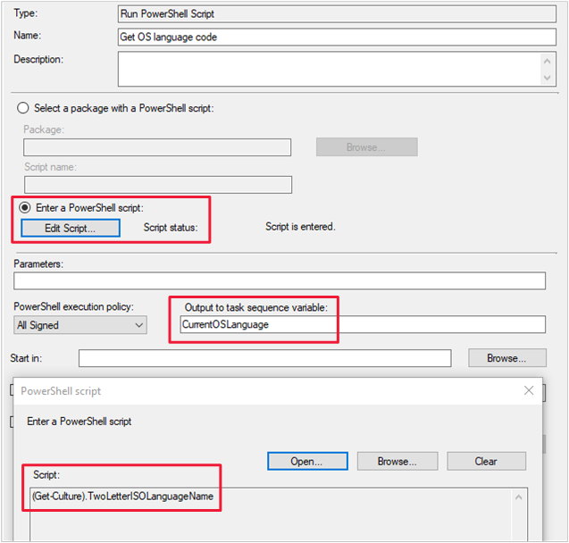
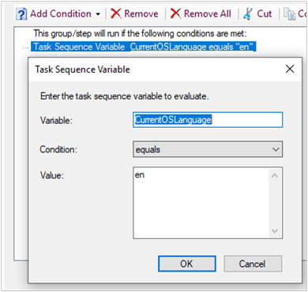

# How to use task sequence variables in Configuration Manager

*Applies to: Configuration Manager (current branch)*

 The task sequence engine in the OS deployment feature of Configuration Manager uses many variables to control its behaviors. Use these variables to:

- Set conditions on steps  
- Change behaviors for specific steps  
- Use in scripts for more complex actions  

For a reference of all available task sequence variables, see [Task sequence variables](task-sequence-variables.md).

## <a name="bkmk_types"></a> Types of variables

There are several types of variables:  

- [Built-in](#bkmk_built-in)  
- [Action](#bkmk_action)  
- [Custom](#bkmk_custom)  
- [Read-only](#bkmk_read-only)  
- [Array](#bkmk_array)  

### <a name="bkmk_built-in"></a> Built-in variables

Built-in variables provide information about the environment where the task sequence runs. Their values are available throughout the whole task sequence. Typically, the task sequence engine initializes built-in variables before it runs any steps.

For example, `_SMSTSLogPath` is an environment variable that specifies the path to which Configuration Manager components write log files. Any task sequence step can access this environment variable.

The task sequence evaluates some variables before each step. For example, `_SMSTSCurrentActionName` lists the name of the current step.

### <a name="bkmk_action"></a> Action variables

Task sequence action variables specify configuration settings that a single task sequence step uses. By default, the step initializes its settings before it runs. These settings are available only while the associated task sequence step runs. The task sequence adds the action variable value to the environment before it runs the step. It then removes the value from the environment after the step runs.

For example, you add the **Run Command Line** step to a task sequence. This step includes a **Start In** property. The task sequence stores a default value for this property as the `WorkingDirectory` variable. The task sequence initializes this value before it runs the **Run Command Line** step. While this step is running, access the **Start In** property value from the `WorkingDirectory` value. After the step completes, the task sequence removes the value of the `WorkingDirectory` variable from the environment. If the task sequence includes another **Run Command Line** step, it initializes a new `WorkingDirectory` variable. At that time, the task sequence sets the variable to the starting value for the current step. For more information, see [WorkingDirectory](task-sequence-variables.md#WorkingDirectory).  

The *default* value for an action variable is present when the step runs. If you set a *new* value, it's available to multiple steps in the task sequence. If you override a default value, the new value stays in the environment. This new value overrides the default value for other steps in the task sequence. For example, you add a **Set Task Sequence Variable** step as the first step of the task sequence. This step sets the `WorkingDirectory` variable to `C:\`. Any **Run Command Line** step in the task sequence uses the new starting directory value.  

Some task sequence steps mark certain action variables as *output*. Steps later in the task sequence read these output variables.

> [!Note]  
> Not all task sequence steps have action variables. For example, although there are variables associated with the **Enable BitLocker** action, there are no variables associated with the **Disable BitLocker** action.  

### <a name="bkmk_custom"></a> Custom variables

These variables are any that Configuration Manager doesn't create. Initialize your own variables to use as conditions, in command lines, or in scripts.

When you specify a name for a new task sequence variable, follow these guidelines:  

- The task sequence variable name can include letters, numbers, the underscore character (`_`), and a hyphen (`-`).  

- Task sequence variable names have a minimum length of one character and a maximum length of 256 characters.  

- User-defined variables must begin with a letter (`A-Z` or `a-z`).  

- User-defined variable names can't begin with the underscore character. Only read-only task sequence variables are preceded by the underscore character.  

- Task sequence variable names aren't case-sensitive. For example, `OSDVAR` and `osdvar` are the same task sequence variable.  

- Task sequence variable names can't begin or end with a space. They also can't have embedded spaces. The task sequence ignores any spaces at the beginning or the end of a variable name.  

There's no set limit to how many task sequence variables you can create. However, the number of variables is limited by the size of the task sequence environment. The total size limit for the task sequence environment is 8 KB. For more information, see [Reduce the size of task sequence policy](../deploy-use/reduce-task-sequence-policy-size.md).

### <a name="bkmk_read-only"></a> Read-only variables

You can't change the value of some variables, which are read-only. Usually the name begins with an underscore character (`_`). The task sequence uses them for its operations. Read-only variables are visible in the task sequence environment.

These variables are useful in scripts or command-lines. For example, running a command line and piping the output to a log file in `_SMSTSLogPath` with the other log files.

> [!NOTE]  
> Read-only task sequence variables can be read by steps in a task sequence but they can't be set. For example, use a read-only variable as part of the command line for a **Run Command Line** step. You can't set a read-only variable by using the **Set Task Sequence Variable** step.  

### <a name="bkmk_array"></a> Array variables

The task sequence stores some variables as an array. Each element in the array represents the settings for a single object. Use these variables when a device has more than one object to configure. The following task sequence steps use array variables:

- [Apply Network Settings](task-sequence-steps.md#BKMK_ApplyNetworkSettings)  

- [Format and Partition Disk](task-sequence-steps.md#BKMK_FormatandPartitionDisk)  

## <a name="bkmk_set"></a> How to set variables

For custom variables or variables that aren't read-only, there are several methods to initialize and set the value of the variable:  

- [Set Task Sequence Variable](#bkmk_set-ts-step) step
- [Set Dynamic Variables](#bkmk_set-dyn-step) step
- [Run PowerShell Script](#bkmk_run-ps) step
- [Collection and device variables](#bkmk_set-coll-var)  
- [TSEnvironment COM object](#bkmk_set-com)  
- [Prestart command](#bkmk_set-prestart)  
- [Task Sequence Wizard](#bkmk_set-tswiz)
- [Task Sequence Media Wizard](#bkmk_set-media)  

Delete a variable from the environment by using the same methods as creating a variable. To delete a variable, set the variable value to an empty string.  

You can combine methods to set a task sequence variable to different values for the same sequence. For example, set the default values using the task sequence editor, and then set custom values using a script.

If you set the same variable by different methods, the task sequence engine uses the following order:  

1. It evaluates collection variables first.  

2. Device-specific variables override the same variable set on a collection.  

3. Variables set by any method during the task sequence take precedence over collection or device variables.  

### General limitations for task sequence variable values

- Task sequence variable values can't be more than 4,000 characters.  

- You can't change a read-only task sequence variable. Read-only variables have names that start with an underscore character (`_`).  

- Task sequence variable values can be case-sensitive depending on the usage of the value. In most cases, task sequence variable values aren't case-sensitive. A variable that includes a password is case-sensitive.  

### <a name="bkmk_set-ts-step"></a> Set Task Sequence Variable

Use this step in the task sequence to set a single variable to a single value.

For more information, see [Set Task Sequence Variable](task-sequence-steps.md#BKMK_SetTaskSequenceVariable).

### <a name="bkmk_set-dyn-step"></a> Set Dynamic Variables

Use this step in the task sequence to set one or more task sequence variables. You define rules in this step to determine which variables and values to use.

For more information, see [Set Dynamic Variables](task-sequence-steps.md#BKMK_SetDynamicVariables).

### <a name="bkmk_run-ps"></a> Run PowerShell Script

<!-- 6315548 -->

Use this step in the task sequence to use a PowerShell script to set a task sequence variable.

You can specify a script name from a package, or directly enter a PowerShell script in the step. Then use the step property to **Output to task sequence variable** to save the script output to a custom task sequence variable.

For more information on this step, see [Run PowerShell Script](task-sequence-steps.md#BKMK_RunPowerShellScript).

> [!NOTE]
> You can also use a PowerShell script to set one or more variables with the **TSEnvironment** object. For more information, see [How to use variables in a running task sequence](../../develop/osd/how-to-use-task-sequence-variables-in-a-running-task-sequence.md) in the Configuration Manager SDK.

#### Example scenario with Run PowerShell Script step

Your environment has users in multiple countries/regions, so you want to query the OS language to set as a condition on multiple language-specific **Apply OS** steps.

1. Add an instance of the **Run PowerShell Script** to the task sequence before the **Apply OS** steps.

1. Use the option to **Enter a PowerShell script** to specify the following command:

    ```powershell
    (Get-Culture).TwoLetterISOLanguageName
    ```

    For more information on the cmdlet, see [Get-Culture](/powershell/module/microsoft.powershell.utility/get-culture). For more information on the two-letter ISO language names, see [List of ISO 639-1 codes](https://wikipedia.org/wiki/List_of_ISO_639-1_codes).

1. For the option to **Output to task sequence variable**, specify `CurrentOSLanguage`.

    

1. On the **Apply OS** step for the English language image, create the following condition: `Task Sequence Variable CurrentOSLanguage equals "en"`

    

    > [!TIP]
    > For more information on how to create a condition on a step, see [How to access variables - Step condition](#bkmk_access-condition).

1. Save and deploy the task sequence.

When the **Run PowerShell Script** step runs on a device with the English language version of Windows, the command returns the value `en`. It then saves that value into the custom variable. When the **Apply OS** step for the English language image runs on the same device, the condition evaluates to true. If you have multiple instances of the **Apply OS** step for different languages, the task sequence dynamically runs the step that matches the OS language.

### <a name="bkmk_set-coll-var"></a> Collection and device variables

You can define custom task sequence variables for devices and collections. Variables that you define for a device are referred to as per-device task sequence variables. Variables defined for a collection are referred to as per-collection task sequence variables. If there's a conflict, per-device variables take precedence over per-collection variables. This behavior means that task sequence variables that are assigned to a specific device automatically have a higher priority than variables that are assigned to the collection that contains the device.  

For example, device XYZ is a member of collection ABC. You assign MyVariable to collection ABC with a value of 1. You also assign MyVariable to device XYZ with a value of 2. The variable that's assigned to XYZ has higher priority than the variable that's assigned to collection ABC. When a task sequence with this variable runs on XYZ, MyVariable has a value of 2.

You can hide per-device and per-collection variables so that they aren't visible in the Configuration Manager console. When you use the option **Do not display this value in the Configuration Manager console**, the value of the variable isn't displayed in the console. The task sequence log file (**smsts.log**) or the task sequence debugger won't show the variable value either. The variable can still be used by the task sequence when it runs. If you no longer want these variables to be hidden, delete them first. Then redefine the variables without selecting the option to hide them.  

> [!WARNING]  
> If you include variables in the **Run Command Line** step's command line, the task sequence log file displays the full command line including the variable values. To prevent potentially sensitive data from appearing in the log file, set the task sequence variable **OSDDoNotLogCommand** to `TRUE`.

You can manage per-device variables at a primary site or at a central administration site. Configuration Manager doesn't support more than 1,000 assigned variables for a device.  

> [!IMPORTANT]  
> When you use per-collection variables for task sequences, consider the following behaviors:  
>
> - Changes to collections are always replicated throughout the hierarchy. Any changes that you make to collection variables apply not just to members of the current site, but to all members of the collection throughout the hierarchy.  
>  
> - When you delete a collection, this action also deletes the task sequence variables that you configured for the collection.  

#### Create task sequence variables for a *device*

1. In the Configuration Manager console, go to the **Assets and Compliance** workspace, and select the **Devices** node.  

2. Select the target device and select **Properties**.  

3. In the **Properties** dialog box, switch to the **Variables** tab.  

4. For each variable that you want to create, select the **New** icon. Specify the **Name** and **Value** of the task sequence variable. If you want to hide the variable so that it's not visible in the Configuration Manager console, select the option **Do not display this value in the Configuration Manager console**.  

5. After you've added all the variables to the device properties, select **OK**.  

#### Create task sequence variables for a *collection*

1. In the Configuration Manager console, go to the **Assets and Compliance** workspace, and select the **Device Collections** node. Select the target collection and choose **Properties**.  

2. In the **Properties** dialog box, switch to the **Collection Variables** tab.  

3. For each variable that you want to create, select the **New** icon. Specify the **Name** and **Value** of the task sequence variable. If you want to hide the variable so that it's not visible in the Configuration Manager console, select the option **Do not display this value in the Configuration Manager console**.  

4. Optionally, specify the priority for Configuration Manager to use when the task sequence variables are evaluated.  

5. After you've added all the variables to the collection properties, select **OK**.  

### <a name="bkmk_set-com"></a> TSEnvironment COM object

To work with variables from a script, use the **TSEnvironment** object.

For more information, see [How to use variables in a running task sequence](../../develop/osd/how-to-use-task-sequence-variables-in-a-running-task-sequence.md) in the Configuration Manager SDK.

### <a name="bkmk_set-prestart"></a> Prestart command

The prestart command is a script or executable that runs in Windows PE before the user selects the task sequence. The prestart command can query a variable or prompt the user for information, and then save it in the environment. Use the [TSEnvironment](#bkmk_set-com) COM object to read and write variables from the prestart command.

For more information, see [Prestart commands for task sequence media](prestart-commands-for-task-sequence-media.md).

### <a name="bkmk_set-tswiz"></a> Task Sequence Wizard

After you select a task sequence in the Task Sequence Wizard window, the page to edit task sequence variables includes an **Edit** button. You can use accessible keyboard shortcuts to edit the variables. This change helps in cases where a mouse isn't available.<!-- 4668846 -->

### <a name="bkmk_set-media"></a> Task Sequence Media Wizard

Specify variables for task sequences that run from media. When using media to deploy the OS, you add the task sequence variables and specify their values when you create the media. The variables and their values are stored on the media.  

> [!NOTE]  
> Task sequences are stored on stand-alone media. However, all other types of media, such as prestaged media, retrieve the task sequence from a management point.  

When you run a task sequence from media, you can add a variable on the **Customization** page of the wizard.

Use the media variables in place of per-collection or per-computer variables. If the task sequence is running from media, per-computer and per-collection variables don't apply and aren't used.  

> [!TIP]  
> The task sequence writes the package ID and prestart command line to the **CreateTSMedia.log** file on the computer that runs the Configuration Manager console. This log file includes the value for any task sequence variables. Review this log file to verify the value for the task sequence variables.  

For more information, see [Create task sequence media](../deploy-use/create-task-sequence-media.md).

## <a name="bkmk_access"></a> How to access variables

After you specify the variable and its value by using one of the methods from the previous section, use it in your task sequences. For example, access default values for built-in task sequence variables, or make a step conditional on the value of a variable.  

Use the following methods to access variable values in the task sequence environment:

- [Use in a step](#bkmk_access-step)  
- [Step condition](#bkmk_access-condition)  
- [Custom script](#bkmk_access-script)  
- [Windows setup answer file](#bkmk_access-answer)  
  
### <a name="bkmk_access-step"></a> Use in a step

Specify a variable value for a setting in a task sequence step. In the task sequence editor, edit the step, and specify the variable name as the field value. Enclose the variable name in percent signs (`%`).

For example, use the variable name as part of the **Command Line** field of the **Run Command Line** step. The following command line writes the computer name to a text file.

`cmd.exe /c echo %_SMSTSMachineName% > C:\File.txt`

### <a name="bkmk_access-condition"></a> Step condition

Use built-in or custom task sequence variables as part of a condition on a step or group. The task sequence evaluates the variable value before it runs the step or group.

To add a condition that evaluates a variable value, do the following steps:  

1. In the task sequence editor, select the step or group to which you want to add the condition.  

2. Switch to the **Options** tab for the step or group. Click **Add Condition**, and select **Task Sequence Variable**.  

3. In the **Task Sequence Variable** dialog box, specify the following settings:  

    - **Variable**: The name of the variable. For example, `_SMSTSInWinPE`.  

    - **Condition**: The condition to evaluate the variable value. The following conditions are available:

      - Exists
      - Not exists
      - Equals
      - Not equals
      - Greater than
      - Greater than or equals
      - Less than
      - Less than or equals
      - Like (supports wildcards of `*` and `?`) <!-- wildcards per https://www.reddit.com/r/SCCM/comments/6zg9az/why_is_there_a_like_condition_for_task_sequence/dmvs6tx -->
      - Not like (version 2103 or later)<!--8764365-->

    - **Value**: The value of the variable to check. For example, `false`.  

The three examples above form a common condition to test whether the task sequence is running from a boot image in Windows PE:

> **Task Sequence Variable** `_SMSTSInWinPE equals "false"`

See this condition on the **Capture Files and Settings** group of the default task sequence template to install an existing OS image.

For more information about conditions, see [Task sequence editor - Conditions](task-sequence-editor.md#bkmk_conditions).

### <a name="bkmk_access-script"></a> Custom script

Read and write variables by using the **Microsoft.SMS.TSEnvironment** COM object while the task sequence is running.

The following Windows PowerShell example queries the **_SMSTSLogPath** variable to get the current log location. The script also sets a custom variable.

```PowerShell
# Create an object to access the task sequence environment
$tsenv = New-Object -ComObject Microsoft.SMS.TSEnvironment

# Query the environment to get an existing variable
# Set a variable for the task sequence log path
$LogPath = $tsenv.Value("_SMSTSLogPath")

# Or, convert all of the variables currently in the environment to PowerShell variables
$tsenv.GetVariables() | % { Set-Variable -Name "$_" -Value "$($tsenv.Value($_))" }

# Write a message to a log file
Write-Output "Hello world!" | Out-File -FilePath "$LogPath\mylog.log" -Encoding "Default" -Append

# Set a custom variable "startTime" to the current time
$tsenv.Value("startTime") = (Get-Date -Format HH:mm:ss) + ".000+000"
```

### <a name="bkmk_access-answer"></a> Windows setup answer file

The Windows setup answer file that you supply can have embedded task sequence variables. Use the form `%varname%`, where *varname* is the name of the variable. The **Setup Windows and ConfigMgr** step replaces the variable name string for the actual variable value. These embedded task sequence variables can't be used in numeric-only fields in an unattend.xml answer file.

For more information, see [Setup Windows and ConfigMgr](task-sequence-steps.md#BKMK_SetupWindowsandConfigMgr).

## See also

- [Task sequence steps](task-sequence-steps.md)

- [Task sequence variables](task-sequence-variables.md)

- [Planning considerations for automating tasks](../plan-design/planning-considerations-for-automating-tasks.md)

- [Task sequence editor](task-sequence-editor.md)
