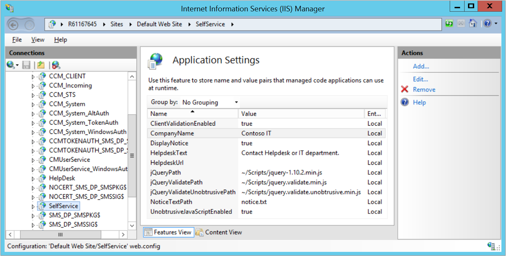

# Customize the self-service portal

*Applies to: Configuration Manager (current branch)*

<!--3601034-->

After you [install the BitLocker self-service portal](setup-websites.md), you can customize it for your organization. Add a custom notice, your organization name, and other organization-specific information.

## Branding

Brand the self-service portal with your organization's name, help desk URL, and notice text.

1. On the web server that hosts the self-service portal, sign in as an administrator.

1. Start the **Internet Information Services (IIS) Manager** (run **inetmgr.exe**).

1. Expand **Sites**, expand **Default Web Site**, and select the **SelfService** node. In the details pane, **ASP.NET** group, open **Application Settings**.

    

1. Select the item that you want to change, and in the **Actions** pane, select **Edit**. Change the **Value** to the new name that you want to use.

    > [!CAUTION]
    > Don't change the **Name** values. For example, don't change `CompanyName`, change `Contoso IT`. If you change the **Name** values, the self-service portal will stop working.

The changes take effect immediately.

### Supported branding values

For the values that you can set, see the following table:

|Name|Description|Default&nbsp;value|
|--- |--- |--- |
|CompanyName|The organization name that the self-service portal displays as a header at the top of every page.|`Contoso IT`|
|DisplayNotice|Display an initial notice that the user has to acknowledge.|`true`|
|HelpdeskText|The string in the right pane below "For all other related issues"|`Contact Helpdesk or IT Department`|
|HelpdeskUrl|The link for the HelpdeskText string.|(empty)|
|NoticeTextPath|The text of the initial notice that the user has to acknowledge. By default, the full file path on the web server is `C:\inetpub\Microsoft BitLocker Management Solution\Self Service Website\Notice.txt`. Edit and save the file in a plain text editor. This path value is relative to the SelfService application.|`Notice.txt`|

<!-- Not sure if we support changing these values. At a minimum need a description.
|ClientValidationEnabled||`true`|
|UnobtrusiveJavaScriptEnabled||`true`|
-->

For a screenshot of the default self-service portal, see [BitLocker self-service portal](self-service-portal.md).

> [!TIP]
> If necessary, you can localize some of these strings to display in different languages. For more information, see [Localization](#bkmk_localize).

## Session time-out

To make the user's session expire after a specified period of inactivity, you can change the session time-out setting for the self-service portal.

1. On the web server that hosts the self-service portal, sign in as an administrator.

1. Start the **Internet Information Services (IIS) Manager** (run **inetmgr.exe**).

1. Expand **Sites**, expand **Default Web Site**, and select the **SelfService** node. In the details pane, **ASP.NET** group, open **Session State**.

1. In the **Cookie Settings** group, change the **Time-out (in minutes)** value. It's the number of minutes after which the user's session expires. The default value is `5`. To disable the setting, so that there's no time-out, set the value to `0`.

1. In the **Actions** pane, select **Apply**.

##  Localize helpdesk text and URL

You can configure localized versions of the self-service portal `HelpdeskText` statement and `HelpdeskUrl` link. This string informs users how to get additional help when they use the portal. If you configure localized text, the portal displays the localized version for web browsers in that language. If it doesn't find a localized version, it displays the default value in the `HelpdeskText` and `HelpdeskUrl` settings.

1. On the web server that hosts the self-service portal, sign in as an administrator.

1. Start the **Internet Information Services (IIS) Manager** (run **inetmgr.exe**).

1. Expand **Sites**, expand **Default Web Site**, and select the **SelfService** node. In the details pane, **ASP.NET** group, open **Application Settings**.

1. In the **Actions** pane, select **Add**.

1. In the **Add Application Setting** window, configure the following values:

    - **Name**: enter `HelpdeskText_<language>`, where `<language>` is the language code for the text.

      For example, to create a localized `HelpdeskText` statement in Spanish (Spain), the name is `HelpdeskText_es-es`.

    - **Value**: the localized string to display in the right pane of the self-service portal below "For all other related issues"

1. Select **OK** to save the new setting.

1. Repeat this process to add a new application setting for `HelpdeskUrl_<language>` that matches the associated `HelpdeskText_<language>` setting.

Repeat this process to add a pair of settings for all languages that you support in your organization.

## Localize the notice file

You can configure localized versions of the initial notice that the user has to acknowledge in the self-service portal. By default, the full file path on the web server is `C:\inetpub\Microsoft BitLocker Management Solution\Self Service Website\Notice.txt`.

To display localized notice text, create a localized notice.txt file. Then save it under a specific language folder. For example: `Self Service Website\es-es\Notice.txt` for Spanish (Spain).

The self-service portal displays the notice text based on the following rules:

- If the default notice file is missing, the portal displays a message that the default file is missing.

- If you create a localized notice file in the appropriate language folder, it displays the localized notice text.

- If the web server doesn't find a localized version of the notice file, it displays the default notice.

- If the user sets their browser to a language that doesn't have a localized notice, the portal displays the default notice.

### Create a localized notice file

1. On the web server that hosts the self-service portal, sign in as an administrator.

1. Create a `<language>` folder for each supported language in the `Self Service Website` application path. For example, `es-es` for Spanish (Spain). By default, the full path is `C:\inetpub\Microsoft BitLocker Management Solution\Self Service Website\es-es`.

    For a list of the valid language codes you can use, see [National Language Support (NLS) API Reference](/windows/win32/intl/locale-identifiers#predefined-locale-identifiers).

    > [!TIP]
    > The name of the language folder can also be the language neutral name. For example, **es** for Spanish, instead of **es-es** for Spanish (Spain) and **es-ar** for Spanish (Argentina). If the user sets their browser to **es-es**, and that language folder doesn't exist, the web server recursively checks the parent locale folder (**es**). (The parent locales are defined in .NET.) For example,`Self Service Website\es\Notice.txt`. This recursive fallback mimics the .NET resource loading rules.

1. Create a copy of your default notice file with the localized text. Save it in the folder for the language code. For example, for Spanish (Spain), by default the full path is `C:\inetpub\Microsoft BitLocker Management Solution\Self Service Website\es-es\Notice.txt`.

Repeat this process to a localized notice file for all languages that you support in your organization.

## Next steps

Now that you've installed and customized the self-service portal, try it out! For more information, see [BitLocker self-service portal](self-service-portal.md).