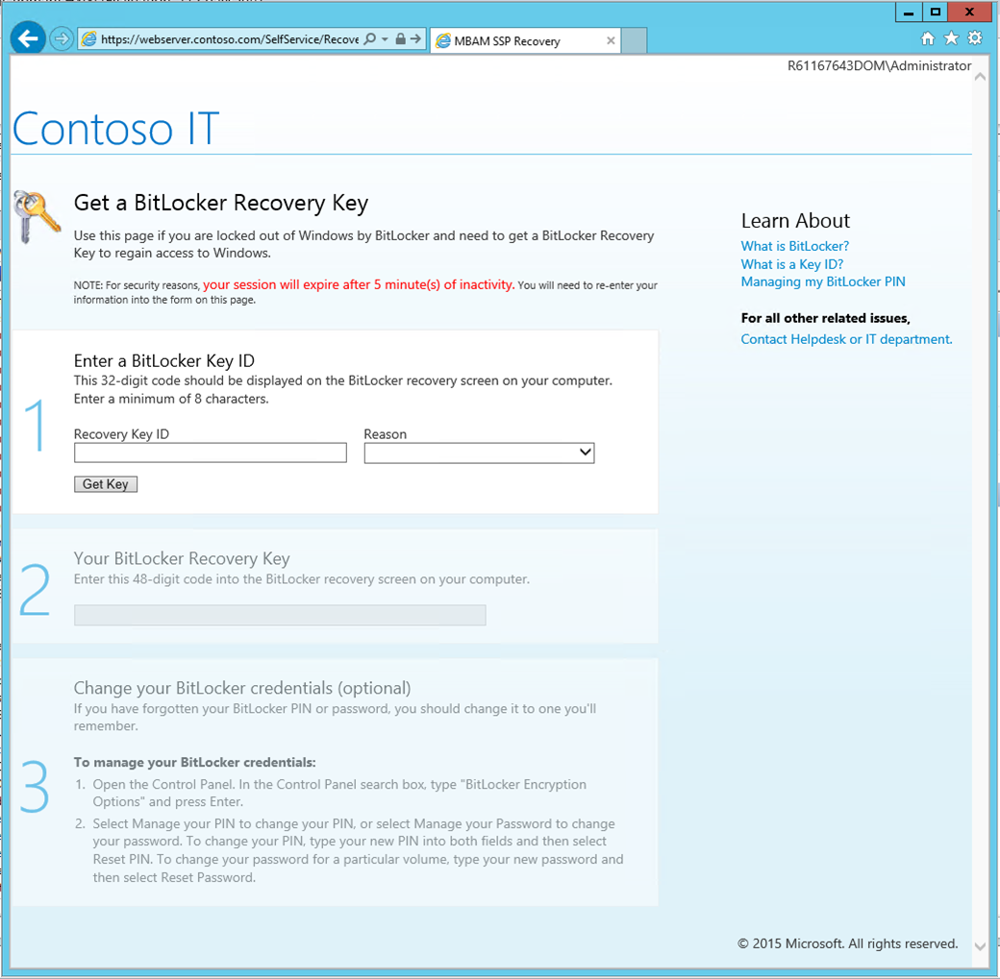
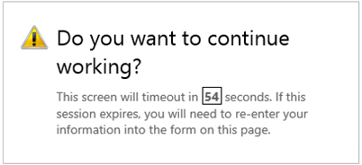
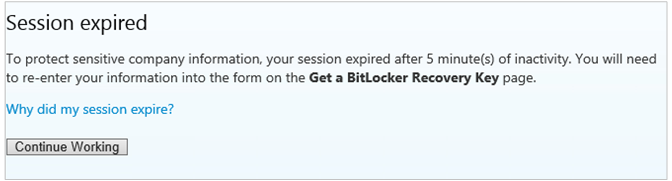

# BitLocker self-service portal

*Applies to: Configuration Manager (current branch)*

<!--3601034-->

After you [install the BitLocker self-service portal](setup-websites.md), if BitLocker locks a user's device, they can independently get access to their computers. The self-service portal requires no assistance from help desk staff.

> [!IMPORTANT]
> To get a recovery key from the self-service portal, a user must have successfully signed in to the computer at least once. This sign-in must be local to the device, not in a remote session. Otherwise, they need to contact the help desk for key recovery. A help desk administrator can use the [administration and monitoring website](helpdesk-portal.md) to request the recovery key.

BitLocker can lock the device in the following situations:

- The user forgets their BitLocker password or PIN

- There's a change to the device's OS files, BIOS, or Trusted Platform Module (TPM)

To request the BitLocker recovery key from the self-service portal:

1. When BitLocker locks a device, it displays the BitLocker recovery screen during startup. Write down the 32-digit BitLocker recovery key ID.

1. On another computer, go to the self-service portal in the web browser, for example `https://webserver.contoso.com/SelfService`.

1. Read and accept the notice.

1. In the **Recovery Key ID** field, enter the first eight digits of the BitLocker recovery key ID. If it matches multiple keys, then enter all 32 digits.

1. Choose one of the following options for the **Reason** for this request:

    - BIOS/TPM changed
    - OS filed modified
    - Lost PIN/passphrase

1. Select **Get Key**. The self-service portal displays the 48-digit **BitLocker recovery key**.

1. Enter this 48-digit code into the BitLocker recovery screen on your computer.

> [!NOTE]
> The BitLocker self-service portal may timeout after a period of inactivity. For example, after five minutes you may see a timeout warning with a 60 second counter.
>
> 
>
> If you don't respond to the countdown, the session will expire.
>
> 
