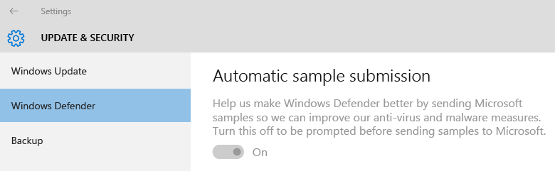

# How to create and deploy antimalware policies for Endpoint Protection in Configuration Manager

*Applies to: Configuration Manager (current branch)*

You can deploy antimalware policies to collections of Configuration Manager client computers to specify how Endpoint Protection protects them from malware and other threats. These policies include information about the scan schedule, the types of files and folders to scan, and the actions to take when malware is detected. When you enable Endpoint Protection, a default antimalware policy is applied to client computers. You can also use one of the supplied policy templates or create a custom policy to meet the specific needs of your environment.  

Configuration Manager supplies a selection of predefined templates. These are optimized for various scenarios and can be imported into Configuration Manager. These templates are available in the folder *&lt;ConfigMgr Install Folder\>*\AdminConsole\XMLStorage\EPTemplates.

> [!IMPORTANT]  
>  If you create a new antimalware policy and deploy it to a collection, this antimalware policy overrides the default antimalware policy.  

 Use the procedures in this topic to create or import antimalware policies and assign them to Configuration Manager client computers in your hierarchy.  

> [!NOTE]  
>  Before you perform these procedures, ensure that Configuration Manager is configured for Endpoint Protection as described in [Configuring Endpoint Protection](endpoint-protection-configure.md).  

##  Modify the default antimalware policy  

1.  In the Configuration Manager console, click **Assets and Compliance**.  

2.  In the **Assets and Compliance** workspace, expand **Endpoint Protection**, and then click **Antimalware Policies**.  

3.  Select the antimalware policy **Default Client Antimalware Policy** and then, on the **Home** tab, in the **Properties** group, click **Properties**.  

4.  In the **Default Antimalware Policy** dialog box, configure the settings that you require for this antimalware policy, and then click **OK**.  

    > [!NOTE]  
    >  For a list of settings that you can configure, see [List of Antimalware Policy Settings](#list-of-antimalware-policy-settings) in this topic.  

##  Create a new antimalware policy  

1.  In the Configuration Manager console, click **Assets and Compliance**.  

2.  In the **Assets and Compliance** workspace, expand **Endpoint Protection**, and then click **Antimalware Policies**.  

3.  On the **Home** tab, in the **Create** group, click **Create Antimalware Policy**.  

4.  In the **General** section of the **Create Antimalware Policy** dialog box, enter a name and a description for the policy.  

5.  In the **Create Antimalware Policy** dialog box, configure the settings that you require for this antimalware policy, and then click **OK**.   For a list of settings that you can configure, see [List of Antimalware Policy Settings](#list-of-antimalware-policy-settings).  

6.  Verify that the new antimalware policy is displayed in the **Antimalware Policies** list.  

##  Import an antimalware policy  

1.  In the Configuration Manager console, click **Assets and Compliance**.  

2.  In the **Assets and Compliance** workspace, expand **Endpoint Protection**, and then click **Antimalware Policies**.  

3.  In the **Home** tab, in the **Create** group, click **Import**.  

4.  In the **Open** dialog box, browse to the policy file to import, and then click **Open**.  

5.  In the **Create Antimalware Policy** dialog box, review the settings to use, and then click **OK**.  

6.  Verify that the new antimalware policy is displayed in the **Antimalware Policies** list.  

##  Deploy an antimalware policy to client computers  

1.  In the Configuration Manager console, click **Assets and Compliance**.  

2.  In the **Assets and Compliance** workspace, expand **Endpoint Protection**, and then click **Antimalware Policies**.  

3.  In the **Antimalware Policies** list, select the antimalware policy to deploy. Then, on the **Home** tab, in the **Deployment** group, click **Deploy**.  

    > [!NOTE]  
    >  The **Deploy** option cannot be used with the default client malware policy.  

4.  In the **Select Collection** dialog box, select the device collection to which you want to deploy the antimalware policy, and then click **OK**.  

##  List of Antimalware Policy Settings  
 Many of the antimalware settings are self-explanatory. Use the following sections for more information about the settings that might require more information before you configure them.  

- [Scheduled Scans Settings](#scheduled-scans-settings)
- [Scan Settings](#scan-settings)
- [Default Actions Settings](#default-actions-settings)
- [Real-time Protection Settings](#real-time-protection-settings)
- [Exclusion Settings](#exclusion-settings)
- [Advanced Settings](#advanced-settings)
- [Threat Overrides Settings](#threat-overrides-settings)
- [Cloud Protection Service](#cloud-protection-service)
- [Definition Updates Settings](#definition-updates-settings)

### Scheduled Scans Settings  

 **Scan type** - You can specify one of two scan types to run on client computers:  

- **Quick scan** - This type of scan checks the in-memory processes and folders where malware is typically found. It requires fewer resources than a full scan.  

- **Full Scan** - This type of scan adds a full check of all local files and folders to the items scanned in the quick scan. This scan takes longer than a quick scan and uses more CPU processing and memory resources on client computers.  

  In most cases, use **Quick scan** to minimize the use of system resources on client computers. If malware removal requires a full scan, Endpoint Protection generates an alert that is displayed in the Configuration Manager console. The default value is **Quick scan**.  

### Scan Settings  
**Scan email and email attachments** - Set to **Yes** to turn on e-mail scanning.

**Scan removable storage devices such as USB drives** - Set to **Yes** to scan removable drives during full scans.

**Scan network files** - Set to **Yes** to scan network files.

**Scan mapped network drives when running a full scan** - Set to **Yes** to scan any mapped network drives on client computers. Enabling this setting might significantly increase the scan time on client computers.

- The **Scan network files** setting must be set to **Yes** for this setting to be available to configure.  

- By default, this setting is set to **No**,  meaning that a full scan will not access mapped network drives.  

**Scan archived files** - Set to **Yes** to scan archived files such as .zip or .rar files.

**Allow users to configure CPU usage during scans** - Set to **Yes** to allow users to specify maximum percentage of CPU utilization during a scan. Scans will not always use the maximum load defined by users, but they cannot exceed it.

**User control of scheduled scans** - Specify level of user control. Allow users to set **Scan time only** or **Full control** of antivirus scans on their devices.

### Default Actions Settings  
 Select the action to take when malware is detected on client computers. The following actions can be applied, depending on the alert threat level of the detected malware.  

-   **Recommended** - Use the action recommended in the malware definition file.  

-   **Quarantine** - Quarantine the malware but do not remove it.  

-   **Remove** - Remove the malware from the computer.  

-   **Allow** - Do not remove or quarantine the malware.  

### Real-time Protection Settings  

|Setting name|Description|  
|------------------|-----------------|  
|**Enable real-time protection**|Set to  **Yes** to configure real-time protection settings for client computers. We recommend that you enable this setting.|  
|**Monitor file and program activity on your computer**|Set to **Yes** if you want Endpoint Protection to monitor when files and programs start to run on client computers and to alert you about any actions that they perform or actions taken on them.|  
|**Scan system files**|This setting lets you configure whether incoming, outgoing, or incoming and outgoing system files are monitored for malware. For performance reasons, you might have to change the default value of **Scan incoming and outgoing files** if a server has high incoming or outgoing file activity.|  
|**Enable behavior monitoring**|Enable this setting to use computer activity and file data to detect unknown threats. When this setting is enabled, it might increase the time required to scan computers for malware.|  
|**Enable protection against network-based exploits**|Enable this setting to protect computers against known network exploits by inspecting network traffic and blocking any suspicious activity.|  
|**Enable script scanning**|For Configuration Manager with no service pack only.   Enable this setting if you want to scan any scripts that run on computers for suspicious activity.|  
|**Block Potentially Unwanted Applications at download and prior to installation**|[Potential Unwanted Applications (PUA)](/microsoft-365/security/defender-endpoint/detect-block-potentially-unwanted-apps-microsoft-defender-antivirus) is a threat classification based on reputation and research-driven identification. Most commonly, these are unwanted application bundlers or their bundled applications.   Microsoft Edge also provides settings to block [potentially unwanted applications](/deployedge/microsoft-edge-potentially-unwanted-apps). Explore these options for complete protection against unwanted applications.   This protection policy setting is available and set to **Enabled** by default. When enabled, this setting blocks PUA at download and install time. However, you can exclude specific files or folders to meet the specific needs of your business or organization.    Starting in Configuration Manager version 2107, you can select to **Audit** this setting. Use PUA protection in audit mode to detect potentially unwanted applications without blocking them. PUA protection in audit mode is useful if your company would like the gauge the impact that enabling PUA protections will have in your environment. Enabling protection in audit mode allows you to determine the impact to your endpoints prior to enabling the protection in block mode.<!--9249870--> |  

### Exclusion Settings

For information about folders, files, and processes that are recommended for exclusion in Configuration Manager 2012 and Current Branch, see [Recommended antivirus exclusions for Configuration Manager 2012 and current branch site servers, site systems, and clients](https://support.microsoft.com/help/327453/recommended-antivirus-exclusions-for-configuration-manager-2012).

 **Excluded files and folders**:   
                  
Click **Set** to open the **Configure File and Folder Exclusions** dialog box and specify the names of the files and folders to exclude from Endpoint Protection scans.  

 If you want to exclude files and folders that are located on a mapped network drive, specify the name of each folder in the network drive individually. For example, if a network drive is mapped as F:\MyFolder and it contains subfolders named Folder1, Folder2 and Folder 3, specify the following exclusions:  

- F:\MyFolder\Folder1  

- F:\MyFolder\Folder2  

- F:\MyFolder\Folder3  

Beginning in version 1602, the existing **Exclude files and folders** setting in the **Exclusion settings** section of an antimalware policy is improved to allow device exclusions. For example, you can now specify the following as an exclusion: **\device\mvfs** (for Multiversion File System). The policy does not validate the device path; the Endpoint Protection policy is provided to the antimalware engine on the client which must be able to interpret the device string.  

 **Excluded file types**:

Click **Set** to open the **Configure File Type Exclusions** dialog box and specify the file extensions to exclude from Endpoint Protection scans. You can use wildcards when defining items in the exclusion list. For more information, see [Use wildcards in the file name and folder path or extension exclusion lists](/windows/security/threat-protection/windows-defender-antivirus/configure-extension-file-exclusions-windows-defender-antivirus#use-wildcards-in-the-file-name-and-folder-path-or-extension-exclusion-lists).

 **Excluded processes**:

Click **Set** to open the **Configure Process Exclusions** dialog box and specify the processes to exclude from Endpoint Protection scans. You can use wildcards when defining items in the exclusion list, however, there are some limitations. For more information, see [Use wildcards in the process exclusion list](/windows/security/threat-protection/windows-defender-antivirus/configure-process-opened-file-exclusions-windows-defender-antivirus#use-wildcards-in-the-process-exclusion-list)

### Advanced Settings  
 **Enable reparse point scanning** - Set to **Yes** if you want Endpoint Protection to scan NTFS reparse points.  

For more information about reparse points, see [Reparse Points](/windows/win32/fileio/reparse-points) in the Windows Dev Center.  

 **Randomize the scheduled scan start times (within 30 minutes)** -  Set to **Yes** to help avoid flooding the network, which can occur if all computers send their antimalware scans results to the Configuration Manager database at the same time. For Windows Defender Antivirus, this randomizes the scan start time to any interval from 0 to 4 hours, or for FEP and SCEP, to any interval plus or minus 30 minutes. This can be useful in VM or VDI deployments. This setting is also useful when you run multiple virtual machines on a single host. Select this option to reduce the amount of simultaneous disk access for antimalware scanning.

Beginning in version 1602 of Configuration Manager, the antimalware engine may request file samples to be sent to Microsoft for further analysis. By default, it will always prompt before it sends such samples. Administrators can now manage the following settings to configure this behavior:  

 **Enable auto sample file submission to help Microsoft determine whether certain detected items are Malicious** - Set to **Yes** to enable auto sample file submission. By default, this setting is **No** which means auto sample file submission is disabled and users are prompted before sending samples.  

 **Allow users to modify auto sample file submission settings** - This determines whether a user with local admin rights on a device can change the auto sample file submission setting in the client interface. By default, this setting is "No" which means it can only be changed from the Configuration Manager console, and local admins on a device cannot change this configuration.  
    For example, the following shows this setting set by the administrator as enabled, and greyed out to prevent changes by the user.

   

### Threat Overrides Settings  
 **Threat name and override action** - Click **Set** to customize the remediation action to take for each threat ID when it is detected during a scan.  

> [!NOTE]  
>  The list of threat names might not be available immediately after the configuration of Endpoint Protection. Wait until the Endpoint Protection point has synchronized the threat information, and then try again.  

### Cloud Protection Service

Cloud Protection Service enables the collection of information about detected malware on managed systems and the actions taken. This information is sent to Microsoft.

**Cloud Protection Service membership**
- **Do not join Cloud Protection Service** - No information is sent
- **Basic** - Collect and send lists of detected malware
- **Advanced** - Basic information as well as more comprehensive information that could contain personal information. For example, file paths and partial memory dumps.

**Allow users to modify Cloud Protection Service settings** - Toggles user control of Cloud Protection Service settings.

**Level for blocking suspicious files** - Specify the level at which the Endpoint Protection Cloud Protection Service will block suspicious files.

- **Normal** - The default Windows Defender blocking level
- **High** - Aggressively blocks unknown files while optimizing for performance (greater chance of blocking non-harmful files)
- **High with extra protection** - Aggressively blocks unknown files and applies additional protection measures (might impact client device performance)
- **Block unknown programs** - Blocks all unknown programs

**Allow extended cloud check to block and scan for up to (seconds)** - Specifies the number of seconds Cloud Protection Service can block a file while the service checks that the file is not known to be malicious.

> [!NOTE]  
> The number of seconds that you select for this setting is in addition to a default 10-second timeout. For example, if you enter 0 seconds, the Cloud Protection Service blocks the file for 10 seconds.

#### Details of Cloud Protection Service reporting

|**Frequency**|**Data collected or sent**|**Use of data** |
|------------------|--------------------------|------------------|
|When Windows Defender updates virus and spyware protection or definition files|-   Version of virus and spyware definitions - Virus and spyware protection version | Microsoft uses this information to ensure the latest virus and spyware updates are present on computers. If not present, Windows Defender updates automatically so computer protection stays up-to-date.|
|If Windows Defender finds potentially harmful or unwanted software on computers|- Name of potentially harmful or unwanted software - How the software was found  - Any actions that Windows Defender took to deal with the software  - Files affected by the software  - Information about the computer from the manufacturer (Sysconfig, SysModel, SysMarker) |Windows Defender uses this information to determine the type and severity of potentially unwanted software, and the best action to take. Microsoft also uses this information to help improve the accuracy of virus and spyware protection.|
|Once a month|- Virus and spyware definition update status - Status of real-time virus and spyware monitoring (on or off) |Windows Defender uses this information to verify that computers have the latest virus and spyware protection version and definitions. Microsoft also wants to make sure that real-time virus and spyware monitoring is turned on. This is a critical part of helping protect computers from potentially harmful or unwanted software.|
|During installation, or whenever users manually perform virus and spyware scan of your computer| List of running processes in your computer's memory | To identify any processes that might have been compromised by potentially harmful software.|

Microsoft collects only the names of affected files, not the contents of the files themselves.
This information helps determine what systems are especially vulnerable to specific threats.

### Definition Updates Settings  
 **Set sources and order for Endpoint Protection client updates** - Click **Set Source** to specify the sources for definition and scanning engine updates. You can also specify the order in which these sources are used. If Configuration Manager is specified as one of the sources, then the other sources are used only if software updates fail to download the client updates.  

 If you use any of the following methods to update the definitions on client computers, then the client computers must be able to access the Internet.  

-   Updates distributed from Microsoft Update  

-   Updates distributed from Microsoft Malware Protection Center  

> [!IMPORTANT]
>  Clients download definition updates by using the built-in system account. You must configure a proxy server for this account to enable these clients to connect to the Internet.  
> 
>  If you have configured a software updates automatic deployment rule to deliver definition updates to client computers, these updates will be delivered regardless of the definition updates settings.
> 
> [!div class="button"]
> [Next step >](endpoint-protection-configure-client.md)
> 
> [!div class="button"]
> [Back >](endpoint-configure-alerts.md)
