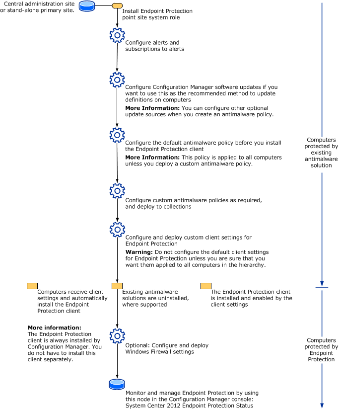

# Endpoint Protection

*Applies to: Configuration Manager (current branch)*

Endpoint Protection manages antimalware policies and Windows Defender Firewall security for client computers in your Configuration Manager hierarchy.

When you use Endpoint Protection with Configuration Manager, you have the following benefits:

- Configure antimalware policies, Windows Defender Firewall settings, and manage Microsoft Defender for Endpoint to selected groups of computers.
- Use Configuration Manager software updates to download the latest antimalware definition files to keep client computers up to date.
- Send email notifications, use in-console monitoring, and view reports. These actions inform administrative users when malware is detected on client computers.

Beginning with Windows 10 and Windows Server 2016 computers, Microsoft Defender Antivirus is already installed. For these operating systems, a management client for Microsoft Defender Antivirus is installed when the Configuration Manager client installs. On Windows 8.1 and earlier computers, the Endpoint Protection client is installed with the Configuration Manager client. Microsoft Defender Antivirus and the Endpoint Protection client have the following capabilities:

- Malware and spyware detection and remediation
- Rootkit detection and remediation
- Critical vulnerability assessment and automatic definition and engine updates
- Network vulnerability detection through Network Inspection System
- Integration with Cloud Protection Service to report malware to Microsoft. When you join this service, the Endpoint Protection client or Microsoft Defender Antivirus downloads the latest definitions from the Malware Protection Center when unidentified malware is detected on a computer.

> [!NOTE]
> The Endpoint Protection client can be installed on a server that runs Hyper-V and on guest virtual machines with supported operating systems. To prevent excessive CPU usage, Endpoint Protection actions have a built-in randomized delay so that protection services do not run simultaneously.

You can also manage Windows Defender Firewall settings with Endpoint Protection in the Configuration Manager console.

## Manage malware

Endpoint Protection in Configuration Manager allows you to create antimalware policies that contain settings for Endpoint Protection client configurations. Deploy these antimalware policies to client computers. Then monitor compliance in the **Endpoint Protection Status** node under **Security** in the **Monitoring** workspace. Also use Endpoint Protection reports in the **Reporting** node.

For more information, see the following articles:

- [How to create and deploy antimalware policies](endpoint-antimalware-policies.md): Create, deploy, and monitor antimalware policies with a list of the settings that you can configure.

- [How to monitor Endpoint Protection](monitor-endpoint-protection.md): Monitoring activity reports, infected client computers, and more.

- [How to manage antimalware policies and firewall settings](endpoint-antimalware-firewall.md): Remediate malware found on client computers.

- [Log files for Endpoint Protection](../../core/plan-design/hierarchy/log-files.md#BKMK_EPLog)

## Manage Windows Defender Firewall

Endpoint Protection in Configuration Manager provides basic management of the Windows Defender Firewall on client computers. For each network profile, you can configure the following settings:

- Enable or disable the Windows Defender Firewall.

- Block incoming connections, including connections in the list of allowed programs.

- Notify the user when Windows Defender Firewall blocks a new program.

> [!NOTE]
> Endpoint Protection supports managing the Windows Defender Firewall only.

For more information, see [How to create and deploy Windows Defender Firewall policies](create-windows-firewall-policies.md).

## Microsoft Defender for Endpoint

Configuration Manager manages and monitors Microsoft Defender for Endpoint, formerly known as Windows Defender for Endpoint. The Microsoft Defender for Endpoint service helps you detect, investigate, and respond to advanced attacks on your network. For more information, see [Microsoft Defender for Endpoints](defender-advanced-threat-protection.md).

## Endpoint Protection workflow

Use the following diagram to help you understand the workflow to implement Endpoint Protection in your Configuration Manager hierarchy.

## Recommendations

Use the following recommendations for Endpoint Protection in Configuration Manager.

### Configure custom client settings

When you configure client settings for Endpoint Protection, don't use the default client settings. The defaults apply settings to all computers in your hierarchy. Instead, configure custom client settings and assign these settings to collections of computers in your hierarchy.

When you configure custom client settings, you can do the following:

- Customize antimalware and security settings for different parts of your organization.
- Test the effects of running Endpoint Protection on a small group of computers before you deploy it to the entire hierarchy.
- Add more clients to the collection over time to phase your deployment of the Endpoint Protection settings.

### Distributing definition updates by using software updates

If you use Configuration Manager software updates to distribute definition updates, put definition updates in a package that doesn't include other software updates. This practice keeps the size of the definition update package smaller which allows it to replicate to distribution points more quickly.

## Next steps

[Example scenario: Using Endpoint Protection to protect computers from malware](scenarios-endpoint-protection.md)
