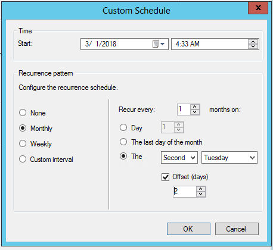

#  Automatically deploy software updates  

*Applies to: Configuration Manager (current branch)*

Use an automatic deployment rule (ADR) rather than adding new updates to an existing software update group. Typically, you use ADRs to deploy monthly software updates (also known as "Patch Tuesday" updates) and for managing Endpoint Protection definition updates. If you need help to determine which deployment method is right for you, see [Deploy software updates](deploy-software-updates.md).


##  <a name="BKMK_CreateAutomaticDeploymentRule"></a> Create an automatic deployment rule (ADR)  
Automatically approve and deploy software updates by using an ADR. The rule can add software updates to a new software update group each time the rule runs, or add software updates to an existing group. When a rule runs and adds software updates to an existing group, the rule removes all updates from the group. It then adds to the group the updates that meet the criteria you define. 

> [!WARNING]  
>  Before you create an ADR for the first time, verify that the site has completed software updates synchronization. This step is important when you run Configuration Manager with a non-English language. Software update classifications are displayed in English before the first synchronization, and then displayed in the localized languages after software update synchronization completes. Rules that you create before you sync software updates might not work properly after synchronization because the text string might not match.  


### <a name="bkmk_adr-process"></a> Process to create an ADR  

1.  In the Configuration Manager console, go to the **Software Library** workspace, expand **Software Updates**, and select the **Automatic Deployment Rules** node.  

2.  In the ribbon, click **Create Automatic Deployment Rule**.  

3.  On the **General** page of the Create Automatic Deployment Rule Wizard, configure the following settings:  

    -   **Name**: Specify the name for the ADR. The name must be unique, help to describe the purpose of the rule, and identify it from others in the Configuration Manager site.  

    -   **Description**: Specify a description for the ADR. The description should provide an overview of the deployment rule and other relevant information that helps to differentiate the rule from others. The description field is optional, has a limit of 256 characters, and has a blank value by default.  

    -   **Template**: Select a deployment template to specify whether to apply previously saved ADR configurations. Configure a deployment template containing multiple common update deployment properties that you can use when creating additional ADRs. These templates save time and help to ensure consistency across similar deployments. Select from one of the following built-in software update deployment templates:  

         - The **Patch Tuesday** template provides common settings to use when you deploy software updates on a monthly cycle.  

         - The **Office 365 Client Updates** template provides common settings to use when you deploy updates for Microsoft 365 Apps clients.
             > [!Note]
             > Starting on April 21, 2020, Office 365 ProPlus is being renamed to **Microsoft 365 Apps for enterprise**. If your ADRs rely on the "Title" property, you'll need to edit it starting June 9, 2020. `Microsoft 365 Apps Update - Semi-annual Channel Version 1908 for x64 based Edition (Build 11929.50000)` is an example of the new title. For more information on modifying your ADRs for the title change, see [Update channels for Microsoft 365 Apps](manage-office-365-proplus-updates.md#bkmk_channel). For more information about the name change, see [Name change for Office 365 ProPlus](/deployoffice/name-change).

         - The **SCEP and Windows Defender Antivirus Updates** template provides common settings to use when you deploy Endpoint Protection definition updates.  

    -   **Collection**: Specifies the target collection to be used for the deployment. Members of the collection receive the software updates that are defined in the deployment.  

    -   Decide whether to add software updates to a new or existing software update group. In most cases, choose to create a new software update group when the ADR runs. If the rule runs on a more aggressive schedule, you might choose to use an existing group. For example, if you run the rule daily for definition updates, then you could add the software updates to an existing software update group.  

    -   **Enable the deployment after this rule is run**: Specify whether to enable the software update deployment after the ADR runs. Consider the following options for this setting:  

        -   When you enable the deployment, the updates that meet the rule's defined criteria are added to a software update group. The software update content is downloaded as necessary. The content is copied to the specified distribution points, and the updates are deployed to the clients in the target collection.  

        -   When you don't enable the deployment, the updates that meet the rule's defined criteria are added to a software update group. The software update deployment content is downloaded, as necessary, and distributed to the specified distribution points. The site creates a disabled deployment on the software update group to prevent the updates from being deployed to clients. This option provides time to prepare to deploy the updates, verify the updates that meet the criteria are adequate, and then enable the deployment.  

4.  On the **Deployment Settings** page, configure the following settings:

    -  **Type of deployment**: Starting in version 2107, you can specify the deployment type for the software update deployment. Prior to version 2107, all deployments created by an automatic deployment rule are required. <!--9900107, 7033498-->

       - Select **Required** to create a mandatory software update deployment. The software updates are automatically installed on clients before the installation deadline you configure.

       - Select **Available** to create an optional software update deployment. This deployment is available for users to install from Software Center.
       > [!NOTE]  
       > Starting in Configuration Manager version 2203, you can select the **Pre-download content for this deployment** setting for **Available** deployments. This setting reduces installation wait times for clients since installation notifications won't be visible in Software Center until the content has fully downloaded. <!--4497776-->
       > - If an update is in multiple deployments for a client and the **Pre-download content for this deployment** setting is enabled for a least one of the deployments, then the content will pre-download.
       > - If you edit an existing deployment to use the **Pre-download content for this deployment** setting, the content will only pre-download if the software update is not yet available on the client.

    -   **Use Wake on LAN to wake up clients for required deployments**: Specifies whether to enable Wake On LAN at the deadline. Wake On LAN sends wake-up packets to computers that require one or more software updates in the deployment. The site wakes up any computers that are in sleep mode at the installation deadline time so the installation can initiate. Clients that are in sleep mode that don't require any software updates in the deployment aren't started. By default, this setting isn't enabled. Before using this option, configure computers and networks for Wake On LAN. For more information, see [How to configure Wake On LAN](../../core/clients/deploy/configure-wake-on-lan.md).  

    -   **Detail level**: Specify the level of detail for the update enforcement state messages that are reported by clients.  

        > [!IMPORTANT]  
        > - When you deploy definition updates, set the detail level to **Error only** to have the client report a state message only when a definition update fails. Otherwise, the client reports a large number of state messages that might impact site server performance.  
        > The **Error only** detail level does not send the enforcement status messages required for tracking pending reboots.

    -   **License terms setting**: Specify whether to automatically deploy software updates with associated license terms. Some software updates include license terms. When you automatically deploy software updates, the license terms aren't displayed, and there isn't an option to accept the license terms. Choose to automatically deploy all software updates regardless of an associated license term, or only deploy updates that don't have associated license terms.  

         - To review the license terms for a software update, select the software update in the **All Software Updates** node of the **Software Library** workspace. In the ribbon, click **Review License**.    

         - To find software updates with associated license terms, add the **License Terms** column to the results pane in the **All Software Updates** node. Click the heading for the column to sort by the software updates with license terms.  

5.  On the **Software Updates** page, configure the criteria for the software updates that the ADR retrieves and adds to the software update group.  

     - The limit for software updates in the ADR is 1000 software updates.  

     - If needed, filter on the content size for software updates in automatic deployment rules. For more information, see [Configuration Manager and simplified Windows servicing on down level operating systems](https://techcommunity.microsoft.com/t5/configuration-manager-archive/configuration-manager-and-simplified-windows-servicing-on-down/ba-p/274056).  

     - Starting in version 2111, the following options were added in the **Date Released or Revised** search criteria:<!--7023634 , 7033309-->
       - Older than 30 days
       - Older than 60 days
       - Older than 90 days
       - Older than 6 months
       - Older than 1 year  
     - You can use **Deployed** as an update filter for your automatic deployment rules. This filter helps identify new updates that may need to be deployed to your pilot or test collections. The software update filter can also help avoid redeploying older updates. 
         - When using **Deployed** as a filter, be mindful that you may have already deployed the update to another collection, such as a pilot or test collection. <!--4852033-->
     - A property filter for **Architecture** is now available. Use this filter to exclude architectures like Itanium and ARM64 that are less common. Remember that there are 32-bit (x86) applications and components running on 64-bit (x64) systems. Unless you're certain that you don't need x86, enable it as well when you choose x64.<!--1322266-->


6. On the **Evaluation Schedule** page, specify whether to enable the ADR to run on a schedule. When enabled, click **Customize** to set the recurring schedule.  

    - The start time configuration for the schedule is based on the local time of the computer that runs the Configuration Manager console.  

    - The ADR evaluation can run as often as three times per day.  

    - Never set the evaluation schedule with a frequency that exceeds the software updates synchronization schedule. This page displays the software update point sync schedule to help you determine evaluation schedule frequency.  

    - To manually run the ADR, select the rule in the **Automatic Deployment Rule** node of the console, and then click **Run Now** in the ribbon.  

    - ADRs can be scheduled to evaluate offset from a base day. For example, if Patch Tuesday actually falls on Wednesday for you, set the evaluation schedule for the second Tuesday of the month offset by one day.<!--1357133-->  
        - When scheduling evaluation with an offset during the last week of the month, if you choose an offset that continues into the next month, the site schedules evaluation for the last day of the month.<!--506731-->  
        

   
7.  On the **Deployment Schedule** page, configure the following settings:  

    -   **Schedule evaluation**: Specify the time that Configuration Manager evaluates the available time and installation deadline times. Choose to use Coordinated Universal Time (UTC) or the local time of the computer that runs the Configuration Manager console.  

          - When you select **Client local time** here, and then select **As soon as possible** for the **Software available time**, the current time on the computer running the Configuration Manager console is used to evaluate when updates are available. This behavior is the same with the **Installation deadline** and the time when updates are installed on a client. If the client is in a different time zone, these actions occur when the client's time reaches the evaluation time.  

    -   **Software available time**: Select one of the following settings to specify when the software updates are available to clients:  

        -   **As soon as possible**: Makes the software updates in the deployment available to clients as soon as possible. When you create the deployment with this setting selected, Configuration Manager updates the client policy. At the next client policy polling cycle, clients become aware of the deployment and the software updates are available for installation.  

        -   **Specific time**: Makes software updates included in the deployment available to clients at a specific date and time. When you create the deployment with this setting enabled, Configuration Manager updates the client policy. At the next client policy polling cycle, clients become aware of the deployment. However, the software updates in the deployment aren't available for installation until after the configured date and time.  
        
        > [!Note]
        > Starting in version 2203, the **Software available time** and **Installation deadline** for deployments created by an ADR are now calculated based on the time the ADR evaluation is scheduled and starts. Previously, these times were calculated based on when the ADR evaluation completed. This change makes the  **Software available time** and **Installation deadline** consistent and predictable for deployments. <!--12707738, 7033417-->

    -   **Installation deadline**: These options are only available for **Required** deployments. Select one of the following settings to specify the installation deadline for the software updates in the deployment:  

        -   **As soon as possible**: Select this setting to automatically install the software updates in the deployment as soon as possible.  

        -   **Specific time**: Select this setting to automatically install the software updates in the deployment at a specific date and time. Configuration Manager determines the deadline to install software updates by adding the configured **Specific time** interval to the **Software available time**.  

             - The actual installation deadline time is the displayed deadline time plus a random amount of time up to two hours. The randomization reduces the potential impact of clients in the collection installing updates in the deployment at the same time.  

             - The **Disable deadline randomization** in the **Computer Agent** group doesn't override the randomization behavior. For more information, see [Computer Agent client settings](../../core/clients/deploy/about-client-settings.md#computer-agent).  <!--9388804-->
        > [!Note]
        > Starting in version 2203, the **Software available time** and **Installation deadline** for deployments created by an ADR are now calculated based on the time the ADR evaluation is scheduled and starts. Previously, these times were calculated based on when the ADR evaluation completed. This change makes the  **Software available time** and **Installation deadline** consistent and predictable for deployments. <!--12707738, 7033417-->

    -  **Delay enforcement of this deployment according to user preferences, up to the grace period defined in client settings**: Enable this setting to give users more time to install required software updates beyond the deadline.  

        - This behavior is typically required when a computer is turned off for long time, and needs to install many software updates or applications. For example, when a user returns from vacation, they have to wait for a long time as the client installs overdue deployments.  

        - Configure this grace period with the property **Grace period for enforcement after deployment deadline (hours)** in client settings. For more information, see the [Computer agent](../../core/clients/deploy/about-client-settings.md#computer-agent) section. The enforcement grace period applies to all deployments with this option enabled and targeted to devices to which you also deployed the client setting.  

        - After the deadline, the client installs the software updates in the first non-business window, which the user configured, up to this grace period. However, the user can still open Software Center and install the software updates at any time. Once the grace period expires, enforcement reverts to normal behavior for overdue deployments.  

8. On the **User Experience** page, configure the following settings:  

    -   **User notifications**: Specify whether to display notification in Software Center at the configured **Software available time**. This setting also controls whether to notify users on the clients.  

    -   **Deadline behavior**: This setting is only configurable for **Required** deployments. Specify the behaviors when the software update deployment reaches the deadline outside of any defined maintenance windows. The options include whether to install the software updates, and whether to perform a system restart after installation. For more information about maintenance windows, see [How to use maintenance windows](../../core/clients/manage/collections/use-maintenance-windows.md).  
        
        > [!Note]
        > This applies only when the maintenance window is configured for the client device. If no maintenance window is defined on the device, the update of the installation and restart will always happen after the deadline.

    -   **Device restart behavior**: This setting is only configurable for **Required** deployments. Specify whether to suppress a system restart on servers and workstations if a restart is required to complete update installation.  

        > [!WARNING]  
        >  Suppressing system restarts can be useful in server environments, or when you don't want the target computers to restart by default. However, doing so can leave computers in an insecure state. Allowing a forced restart helps to ensure immediate completion of the software update installation.  

    -   **Write filter handling for Windows Embedded devices**: This setting controls the installation behavior on Windows Embedded devices that are enabled with a write filter. Choose the option to commit changes at the installation deadline or during a maintenance window. When you select this option, a restart is required and the changes persist on the device. Otherwise, the update is installed, applied to the temporary overlay, and committed later.  

           -  When you deploy a software update to a Windows Embedded device, make sure the device is a member of a collection that has a configured maintenance window.  

    - **Software updates deployment re-evaluation behavior upon restart**: Select this setting to configure software updates deployments to have clients run a software updates compliance scan immediately after a client installs software updates and restarts. This setting enables the client to check for additional updates that become applicable after the client restarts, then installs them during the same maintenance window.  

9. On the **Alerts** page, configure how Configuration Manager generates alerts for this deployment. Review recent software updates alerts from Configuration Manager in the **Software Updates** node of the **Software Library** workspace. If you're also using System Center Operations Manager, configure its alerts as well.  

10. On the **Download Settings** page, configure the following settings:  

    - Specify if clients should download and install the updates when they use a distribution point from a neighbor or the default site boundary groups.  

    - Specify if clients should download and install the updates from a distribution point in the site default boundary group, when the content for the software updates isn't available from a distribution point in the current or neighbor boundary groups.  

    - **Allow clients to share content with other clients on the same subnet**: Specify whether to enable the use of BranchCache for content downloads. For more information, see [BranchCache](../../core/plan-design/hierarchy/fundamental-concepts-for-content-management.md#branchcache). BranchCache is always enabled on clients. This setting is removed, as clients use BranchCache if the distribution point supports it.  

    - **If software updates are not available on distribution point in current, neighbor or site boundary groups, download content from Microsoft Updates**: Select this setting to have intranet-connected clients download software updates from Microsoft Update if updates aren't available on distribution points. Internet-based clients always go to Microsoft Update for software updates content.  

    - Specify whether to allow clients to download after an installation deadline when they use metered internet connections. Internet providers sometimes charge by the amount of data that you send and receive when you're on a metered connection.  

    > [!NOTE]  
    >  Clients request the content location from a management point for the software updates in a deployment. The download behavior depends upon how you've configured the distribution point, deployment package, and the settings on this page.   

11. On the **Deployment Package** page, select one of the following options:  

    - **Select a deployment package**: Add these updates to an existing deployment package.  

    - **Create a new deployment package**: Add these updates to a new deployment package. Configure the following additional settings:  

        -  **Name**: Specify the name of the deployment package. Use a unique name that describes the package content. It's limited to 50 characters.  

        -  **Description**: Specify a description that provides information about the deployment package. The optional description is limited to 127 characters.  

        -  **Package source**: Specifies the location of the software update source files. Type a network path for the source location, for example, `\\server\sharename\path`, or click **Browse** to find the network location. Create the shared folder for the deployment package source files before you proceed to the next page.  

            - You can't use the specified location as the source of another software deployment package.  

            - You can change the package source location in the deployment package properties after Configuration Manager creates the deployment package. If you do, first copy the content from the original package source to the new package source location.  

            -  The computer account of the SMS Provider and the user that's running the wizard to download the software updates must both have **Write** permissions to the download location. Restrict access to the download location. This restriction reduces the risk of attackers tampering with the software update source files.  

        -  **Sending priority**: Specify the sending priority for the deployment package. Configuration Manager uses this priority when it sends the package to distribution points. Deployment packages are sent in priority order: high, medium, or low. Packages with identical priorities are sent in the order in which they were created. If there's no backlog, the package processes immediately regardless of its priority.  

        - **Enable binary differential replication**: Enable this setting to use binary differential replication for the deployment package. For more information, see [Binary differential replication](../../core/plan-design/hierarchy/fundamental-concepts-for-content-management.md#binary-differential-replication).  

    - **No deployment package**: Deploy software updates to devices without first downloading and distributing content to distribution points. This setting is beneficial when dealing with extremely large update content. Also use it when you always want clients to get content from the Microsoft Update cloud service. Clients in this scenario can also download content from peers that already have the necessary content. The Configuration Manager client continues to manage the content download, thus can utilize the Configuration Manager peer cache feature, or other technologies such as Delivery Optimization. This feature supports any update type supported by Configuration Manager software updates management, including Windows and Microsoft 365 Apps updates.<!--1357933-->  

        > [!Note]  
        > Once you select this option and apply the settings, it can no longer be changed. The other options are greyed out.<!--SCCMDocs-pr issue 3003-->  

12. On the **Distribution Points** page, specify the distribution points or distribution point groups to host the software update files. For more information about distribution points, see [Distribution point configurations](../../core/servers/deploy/configure/install-and-configure-distribution-points.md#bkmk_configs). This page is available only when you create a new software update deployment package.  
  

13. On the **Download Location** page, specify whether to download the software update files from the internet or from your local network. Configure the following settings:  

    -   **Download software updates from the internet**: Select this setting to download the software updates from a specified location on the internet. This setting is enabled by default.  

    -   **Download software updates from a location on the local network**: Select this setting to download the software updates from a local directory or shared folder. This setting is useful when the computer that runs the wizard doesn't have internet access. Any computer with internet access can preliminarily download the software updates. Then store them in a location on the local network that's accessible from the computer that runs the wizard. Another scenario could be when downloading content that is published through System Center Updates Publisher or a third-party patching solution. The WSUS content share on the top-level software update point can be entered as the network location to download from, such as `\\server\WsusContent`. <!--memdocs-issue-211-->

14. On the **Language Selection** page, select the languages for which the site downloads the selected software updates. The site only downloads these updates if they're available in the selected languages. Software updates that aren't language-specific are always downloaded. By default, the wizard selects the languages that you've configured in the software update point properties. At least one language must be selected before proceeding to the next page. When you select only languages that a software update doesn't support, the download fails for the update.  

15. On the **Summary** page, review the settings. To save the settings to a deployment template, click **Save As Template**. Enter a name and select the settings you want to include in the template, then click **Save**. To change a configured setting, click the associated wizard page and change the setting.  

    -  The template name can consist of alphanumeric ASCII characters as well as `\` (backslash) or `'` (single quotation mark).  

16. Click **Next** to create the ADR.  

After you complete the wizard, the ADR runs. It adds the software updates that meet the specified criteria to a software update group. Then the ADR downloads the updates to the content library on the site server and distributes them to the configured distribution points. The ADR then deploys the software update group to clients in the target collection.  


##  <a name="BKMK_AddDeploymentToADR"></a> Add a new deployment to an existing ADR  

After you create an ADR, add additional deployments to the rule. This action helps you manage the complexity of deploying different updates to different collections. Each new deployment has the full range of functionality and deployment monitoring experience.  


### Process to add a new deployment to an existing ADR  

1.  In the Configuration Manager console, go to the **Software Library** workspace, expand **Software Updates**, select the **Automatic Deployment Rules** node, and then select the desired rule.  

2.  In the ribbon, click **Add Deployment**.   

3.  On the **Collection** page of the Add Deployment Wizard, configure the available settings similarly as the **General** page of the Create Automatic Deployment Rule Wizard. For more information, see the previous section on the [Process to create an ADR](#bkmk_adr-process). The rest of the Add Deployment Wizard includes the following pages, which also match detailed descriptions above:  

     - Deployment Settings
     - Deployment Schedule
     - User Experience
     - Alerts
     - Download Settings  

Deployments can also be added programmatically using Windows PowerShell cmdlets. For a complete description of using this method, see [New-CMSoftwareUpdateDeployment](/powershell/module/configurationmanager/new-cmsoftwareupdatedeployment) .

For more information about the deployment process, see [Software update deployment process](../understand/software-updates-introduction.md#BKMK_DeploymentProcess).

## Known issues

### Error code 0x87D20417
<!--9354590, 9391270-->
**Scenario:** When running Configuration Manager version 2010, you may notice that an automatic deployment rule fails and returns **Last Error Code** of 0x87D20417. In the **PatchDownloader.log**, you see `Failed to create temp file with GetTempFileName() at temp location C:\Windows\TEMP\, error 80 ` and 0-byte files in the %temp% directory. 

**Workaround:** Remove all the files from the temp directory specified in the **PatchDownloader.log** and rerun the ADR. 

**Resolution:** Install [KB 4600089](https://support.microsoft.com/topic/update-rollup-for-microsoft-endpoint-configuration-manager-current-branch-version-2010-403fa677-e418-e39d-6eb6-f279ea991a95), Update Rollup for Microsoft Endpoint Configuration Manager current branch, version 2010.

### <a name="bkmk_script"></a> Script to apply deployment package settings for automatic deployment rule
<!--3961933, 4396422-->

If you create an ADR with the **No deployment package** option, you're' unable to go back and add one later. To help you resolve this issue, we've uploaded the following script into [Community hub](../../core/servers/manage/community-hub.md):

   > [!TIP]
   > [Open this script](https://communityhub.microsoft.com/item/19635) directly in Community hub. For more information, see [Direct links to Community hub items](../../core/servers/manage/community-hub.md).

```powershell
<# Apply-ADRDeploymentPackageSettings #>

#=============================================
# START SCRIPT
#=============================================
param
(
[parameter(Mandatory = $true)]
[ValidateNotNullOrEmpty()]
[ValidateLength(1,256)]
[string]$sourceADRName,

[parameter(Mandatory = $true)]
[ValidateNotNullOrEmpty()]
[ValidateLength(1,256)]
[string]$targetADRName
)

Try {
       # Source ADR that already has the needed deployment package. You may need to create one if it doesn’t exist.
       $sourceADR = Get-CMSoftwareUpdateAutoDeploymentRule -Name $sourceADRName

       # Target ADR that will be updated to use the source ADR’s deployment package. Typically, this is the ADR that used the “No deployment package” option. 
       $targetADR = Get-CMSoftwareUpdateAutoDeploymentRule -Name $targetADRName

       # Apply the deployment package settings
       $targetADR.ContentTemplate = $sourceADR.ContentTemplate

       # Update the wmi object
       $targetADR.Put()
}
Catch{
       $exceptionDetails = "Exception: " + $_.Exception.Message + "HResult: " + $_.Exception.HResult
       Write-Error "Failed to apply ADR deployment package settings: $exceptionDetails"
}
#=============================================
# END SCRIPT
#=============================================
```

## Next steps
[Monitor software updates](monitor-software-updates.md)