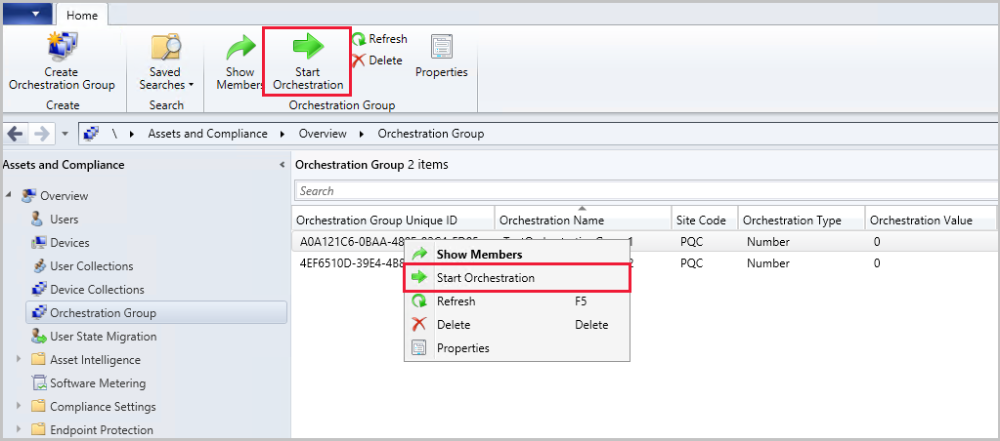

# Create orchestration groups in Configuration Manager
<!--3098816-->
*Applies to: Configuration Manager (current branch)*

## Create an orchestration group

1. In the Configuration Manager console, go to the **Assets and Compliance** workspace, and select the **Orchestration Group** node.

1. In the ribbon, select **Create Orchestration Group** to open the **Create Orchestration Group Wizard**.

1. On the **General** page, give your orchestration group a **Name** and optionally a **Description**. Specify your values for the following items:
   - **Orchestration Group timeout (in minutes)**: Time limit for all group members to complete update installation.
   - **Orchestration Group member timeout (in minutes)**: Time limit for a single device in the group to complete the update installation.

1. On the **Member Selection** page, first specify the **Site code**. Then select **Add** to add device resources as members of this orchestration group. **Search** for devices by name, and then **Add** them. You can also filter your search to a single collection by using **Search in Collection**.  Select **OK** when you finish adding devices to the selected resources list.
   - When selecting resources for the group, only valid clients are shown. Checks are made for verifying the site code, that the client is installed, and that resources aren't duplicated.

1. On the **Rule Selection** page, select one of the following options:

   - **Allow a percentage of the machines to be updated at the same time**, then select or enter a number for this percentage. Use this setting to allow for future flexibility of the size of the orchestration group. For example, your orchestration group contains 50 devices, and you set this value to 10. During a software update deployment, Configuration Manager allows five devices to simultaneously run the deployment. If you later increase the size of the orchestration group to 100 devices, then 10 devices update at once.

   - **Allow a number of the machines to be updated at the same time**, then select or enter a number for this specific count. Use this setting to always limit to a specific number of devices, whatever the overall size of the orchestration group.

   - **Specify the maintenance sequence**, then sort the selected resources in the proper order. Use this setting to explicitly define the order in which devices run the software update deployment.

1. Choose a **Pre-installation script**  and **Post-installation script** for your orchestration group as needed. The script should return a value of `0` for success. Any non-zero value is considered a script failure. Scripts with parameters can't be used. <!--9893550-->

   1. For Configuration Manager 2103 and later, choose a **Pre-installation script**  and **Post-installation script**  on the **Script Picker** page. Choose from the following options when adding or modifying a script: <!--6991647-->
      - **Add**: Allows you to choose a script to add. Type or paste a PowerShell script into the pane or use one fo the following options:  
        - **Open**: Open a specific `.ps1` file
        - **Browse**: Choose a script that's already approved from the [**Scripts**](../../apps/deploy-use/create-deploy-scripts.md) list. Scripts with parameters will be hidden from the list. <!--9893550-->
        - **Clear**: Clears the current script in the script pane
      - **Edit**: Edit the currently selected script
      - **Delete**: Removes the current script
      - **Script timeout (in seconds)**: The allowed time in seconds for the script to run before it times out
   1. For Configuration Manager 2010 and earlier, add scripts to your orchestration groups on the **Pre-Script** and **Post-Script** pages.
      1. On the **Pre-Script** page, enter a PowerShell script to run on each device *before* the deployment runs.
      1. On the **Post-Script** page, enter a PowerShell script to run on each device *after* the deployment runs and a restart, if required, occurs. The behavior is otherwise the same as the PreScript.

   > [!NOTE]
   > In version 2103 and later, the maximum script length is 50,000 characters. In version 2010 and earlier, the maximum script length is 5,000 characters.<!-- MEMDocs#1575 -->

1. Complete the wizard.

> [!WARNING]
> - Ensure pre-scripts and post-scripts are tested before using them for orchestration groups. The pre-scripts and post-scripts don't timeout and will run until the orchestration group member timeout has been reached.
> - Scripts that have parameters aren't supported. <!--9893550-->

## Display orchestration groups and members

From the **Assets and Compliance** workspace, select the **Orchestration Group** node. To view members, select an orchestration group and select **Show Members** in the ribbon. For more information about the available columns for the nodes, see [Monitor orchestration groups and members](monitor-orchestration-groups.md).

## Edit or delete an orchestration group

To delete the orchestration group, select it then select **Delete** in the ribbon or from the right-click menu. To edit an orchestration group, select it then select **Properties** in the ribbon or from the right-click menu. Change the settings from the following tabs:

- **General**: 
   - **Name**: The name of your orchestration group
   - **Description**: Orchestration group description (optional)
   - **Orchestration Group timeout (in minutes)**: Time limit for all group members to complete update installation.
   - **Orchestration Group member timeout (in minutes)**: Time limit for a single device in the group to complete the update installation.

- **Member Selection**:
   - **Site Code**: Site code for the orchestration group.
   - **Members**: Select **Add** to select more devices for the orchestration group. Choose **Remove** to remove the selected device.

- **Rules Selection**:
   - **Allow a percentage of the machines to be updated at the same time**, then select or enter a number for this percentage. Use this setting to allow for future flexibility of the size of the orchestration group. For example, your orchestration group contains 50 devices, and you set this value to 10. During a software update deployment, Configuration Manager allows five devices to simultaneously run the deployment. If you later increase the size of the orchestration group to 100 devices, then 10 devices update at once.
   - **Allow a number of the machines to be updated at the same time**, then select or enter a number for this specific count. Use this setting to always limit to a specific number of devices, whatever the overall size of the orchestration group.
   - **Specify the maintenance sequence**: Sort the selected resources to the proper order. Use this setting to explicitly define the order in which devices run the software update deployment.

- Choose a **Pre-installation script**  and **Post-installation script** for your orchestration group as needed. The script should return a value of `0` for success. Any non-zero value is considered a script failure. Scripts with parameters can't be used. <!--9893550-->

   - For Configuration Manager version 2103 and later, choose a **Pre-installation script**  and **Post-installation script**  on the **Script Picker** page. Choose from the following options when adding or modifying a script: <!--6991647-->
      - **Add**: Allows you to choose a script to add. Type or paste a PowerShell script into the pane or use one fo the following options:  
        - **Open**: Open a specific `.ps1` file
        - **Browse**: Choose a script that's already approved from the [**Scripts**](../../apps/deploy-use/create-deploy-scripts.md) list. Scripts with parameters will be hidden from the list. <!--9893550-->
        - **Clear**: Clears the current script in the script pane
      - **Edit**: Edit the currently selected script
      - **Delete**: Removes the current script
      - **Script timeout (in seconds)**: The allowed time in seconds for the script to run before it times out
      
   - For Configuration Manager version 2010 and earlier, add scripts to your orchestration groups on the **Pre-Script** and **Post-Script** tabs.
      - On the **Pre-Script** tab, enter a PowerShell script to run on each device *before* the deployment runs.
     - On the **Post-Script** tab, enter a PowerShell script to run on each device *after* the deployment runs and a restart, if required, occurs. The behavior is otherwise the same as the PreScript.
     > [!WARNING]
     > - For Configuration Manager version 2010 and earlier, ensure pre-scripts and post-scripts are tested before using them for orchestration groups. The pre-scripts and post-scripts don't timeout and will run until the orchestration group member timeout has been reached.
     > - Scripts that have parameters aren't supported <!--9893550-->
 
## Start orchestration

1. [Deploy software updates](deploy-software-updates.md) to a collection that contains the members of the orchestration group.

1. Orchestration starts when any client in the group tries to install any software update at deadline or during a maintenance window. It starts for the entire group, and makes sure that the devices update by following the orchestration group rules.
1. You can manually start orchestration by selecting it from the **Orchestration Group** node, then choosing **Start Orchestration** from the ribbon or right-click menu.
1. If needed, select **Ignore all applicable windows for the members** to start the installation immediately and bypass maintenance windows. <!--8031298-->
   - This option was introduced in Configuration Manager version 2103
1. If an orchestration group is in a *Failed* state:
   1. Determine why the orchestration failed and resolve any issues.
   1. [Reset the orchestration state for group members](#reset-orchestration-state-for-a-group member).
   1. From the **Orchestration Group** node, choose the **Start Orchestration** button to restart orchestration.
   

> [!TIP]
> - Orchestration groups only apply to software update deployments. They don't apply to other deployments.
> - You can right-click on an Orchestration Group member and select **Reset Orchestration Group Member**. This allows you to rerun orchestration.

## Reset orchestration state for a group member

If you want to rerun orchestration on a group member, you can clear its state such as *Complete* or *Failed*. To clear the state, right-click on the Orchestration Group member and select **Reset Orchestration Group Member**. You can also select **Reset Orchestration Group Member** from the ribbon. Before resetting the state, you should check the client to see why it failed and correct any issues found.

   

## Next steps

- [Orchestration groups prerequisites](orchestration-groups.md)
- [Monitor orchestration groups](monitor-orchestration-groups.md)
