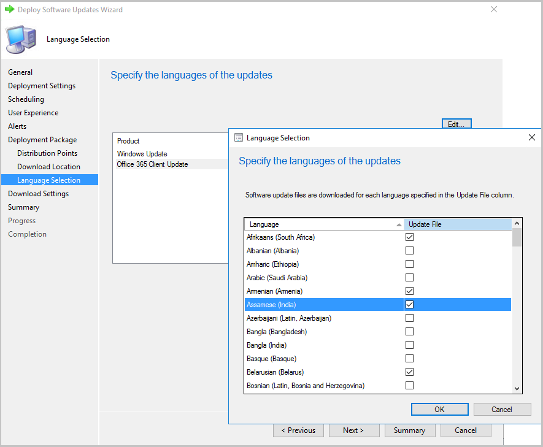
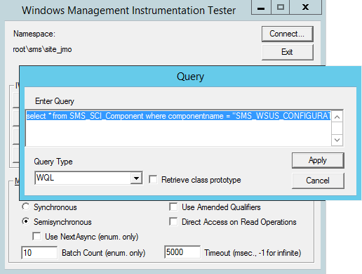
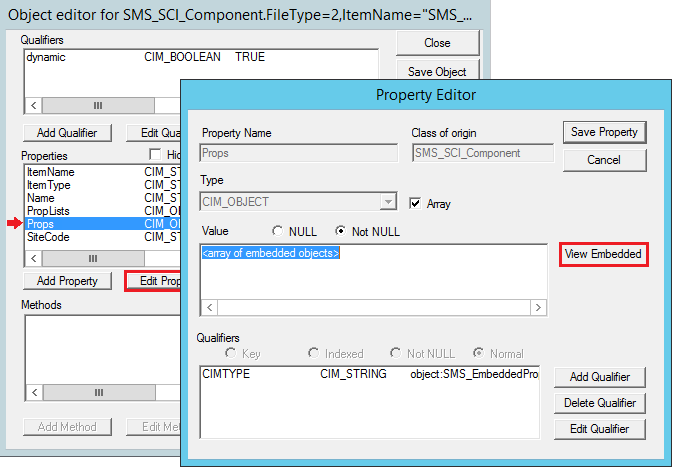
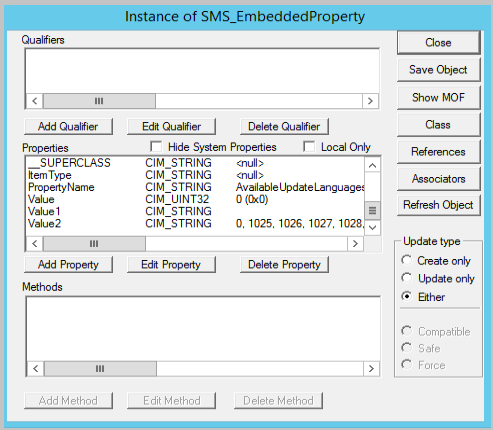
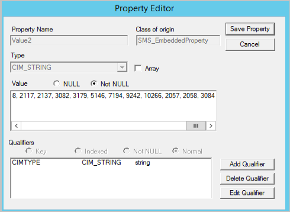

# Manage Microsoft 365 Apps with Configuration Manager

*Applies to: Configuration Manager (current branch)*

> [!Note]
> On April 21, 2020, Office 365 ProPlus was renamed to **Microsoft 365 Apps for enterprise**. For more information, see [Name change for Office 365 ProPlus](/deployoffice/name-change). You may still see references to the old name in the Configuration Manager console and supporting documentation while the console is being updated.

Configuration Manager lets you manage Microsoft 365 Apps in the following ways:

- [Deploy Microsoft 365 Apps](#bkmk_deploy): You can start the Microsoft 365 Apps Installer from the [Office 365 Client Management dashboard](office-365-dashboard.md) to make the initial Microsoft 365 Apps installation experience easier. The wizard lets you configure Microsoft 365 Apps installation settings, download files from Office Content Delivery Networks (CDNs), and create and deploy a script application with the content.

- [Deploy Microsoft 365 Apps updates](#bkmk_update): You can manage Microsoft 365 Apps client updates by using the software update management workflow. When Microsoft publishes a new Microsoft 365 Apps update to the Office Content Delivery Network (CDN), Microsoft also publishes an update package to Windows Server Update Services (WSUS). After Configuration Manager synchronizes the Microsoft 365 Apps updates from the WSUS catalog to the site server, the update is available to deploy to clients.

  - Starting in Configuration Manager version 2002, you can import Microsoft 365 Apps updates into disconnected environments. For more information, see [Synchronize Microsoft 365 Apps updates from a disconnected software update point](../get-started/synchronize-office-updates-disconnected.md).

- [Add languages for Microsoft 365 Apps update downloads](#bkmk_o365_lang): You can add support for Configuration Manager to download updates for any languages supported by Microsoft 365 Apps. Meaning Configuration Manager doesn't have to support the language as long as Microsoft 365 Apps does.

- [Change the update channel](#bkmk_channel): You can use group policy to distribute a registry key value change to Microsoft 365 Apps clients to change the update channel.

To review Microsoft 365 Apps client information and start some of these Microsoft 365 Apps management actions, use the [Office 365 Client Management dashboard](office-365-dashboard.md).

**Warning**: With Microsoft 365 Apps Perpetual updates there is currently a delay with the sync. The updates will appear in  Office 365 Updates node a week or so after the stated time in the 'Deate Released' column.

##  Deploy Microsoft 365 Apps
Start the Microsoft 365 Apps Installer from the Office 365 Client Management dashboard for the initial Microsoft 365 Apps installation. The wizard lets you configure Microsoft 365 Apps installation settings, download files from the Office Content Delivery Networks (CDNs), and create and deploy a script application for the files. Until Microsoft 365 Apps is installed on clients and the [Microsoft 365 Apps automatic updates task](/deployoffice/overview-update-process-microsoft-365-apps) runs, Microsoft 365 Apps updates aren't applicable. For testing purposes, you can run the update task manually.

For previous Configuration Manager versions, you must take the following steps to install Microsoft 365 Apps for the first time on clients:
- Download Office Deployment Tool (ODT)
- Download the Microsoft 365 Apps installation source files, including all of the language packs that you need.
- Generate the Configuration.xml that specifies the correct Microsoft 365 Apps version and channel.
- Create and deploy either a legacy package or a script application for clients to install Microsoft 365 Apps.

### Requirements
- The computer that runs the installer must have Internet access.  
- The user that runs the installer must have **Read** and **Write** access to the content location share provided in the wizard.
- If you receive a 404 download error, copy the following files to the user %temp% folder:
  - [releasehistory.xml](https://officecdn.microsoft.com/pr/wsus/releasehistory.cab)
  - [o365client_32bit.xml](https://officecdn.microsoft.com/pr/wsus/ofl.cab)  

### Limitations

- Content-enabled cloud management gateways don't support content for Microsoft 365 Apps updates. <!--7366753-->
- In certain circumstances when using Office Customization Tool for Click-to-Run, you may encounter the following exception:  `Could not load type 'System.Runtime.InteropServices.Architecture' from assembly 'mscorlib Version=4.0.0.0, Culture=neutral, PublicKeyToken=b77a5c561934e089'`. To work around the issue, update .NET Framework to version 4.7.1 or later for the machine running the Configuration Manager console. <!--12109686-->

### Deploy Microsoft 365 Apps using Configuration Manager 
The Office Customization Tool is integrated with the installer in the Configuration Manager console. When creating a deployment for Microsoft 365 Apps, you can dynamically configure the latest manageability settings. <!--1358149, these instructions are for 1806 and later-->

1. In the Configuration Manager console, navigate to **Software Library** > **Overview** > **Office 365 Client Management**.
2. Select **Office 365 Installer** in the upper-right pane. The installation wizard opens.
3. On the **Application Settings** page, provide a name and description for the app, enter the download location for the files, and then choose **Next**. The location must be specified as &#92;&#92;*server*&#92;*share*.
4. On the **Office Settings** page, select  **Go to the Office Customization Tool**. This will open the [Office Customization Tool for Click-to-Run](https://config.office.com).
5. Configure the desired settings for your Microsoft 365 Apps installation. Select **Submit** in the upper right of the page when you complete the configuration. 
6. On the **Deployment** page, determine if you would like to deploy now or at a later time. If you choose to deploy later, you can find the application in **Software Library** > **Application Management** > **Applications**.  
7. Confirm the settings on the **Summary** page. 
8. Select **Next** then **Close** once the wizard completes. 

After you create and deploy Microsoft 365 Apps using the installer, Configuration Manager may not manage the Microsoft 365 Apps updates by default. To enable Microsoft 365 Apps clients to receive updates from Configuration Manager, see [Deploy Microsoft 365 Apps updates with Configuration Manager](#bkmk_update).

After you deploy Microsoft 365 Apps, you can create automatic deployment rules to maintain the apps. To create an automatic deployment rule for Microsoft 365 Apps, select **Create an ADR** from the [Office 365 Client Management dashboard](office-365-dashboard.md). Select **Office 365 Client** when you choose the product. For more information, see [Automatically deploy software updates](automatically-deploy-software-updates.md).

## Drill through required Microsoft 365 Apps updates
<!--4224414-->
*(Introduced in version 1906)*

You can drill through compliance statistics to see which devices require a specific Microsoft 365 Apps software update. To view the device list, you need permission to view updates and the collections the devices belong to. To drill down into the device list:

1. Go to **Software Library** > **Office 365 Client Management** > **Office 365 Updates**.
1. Select any update that is required by at least one device.
1. Look at the **Summary** tab and find the pie chart under  **Statistics**.
1. Select the **View Required** hyperlink next to the pie chart to drill down into the device list.
1. This action takes you to a temporary node under **Devices** where you can see the devices requiring the update. You can also take actions for the node such as creating a new collection from the list.

##  Deploy Microsoft 365 Apps updates

Use the following steps to deploy Microsoft 365 Apps updates with Configuration Manager:

1. [Verify the requirements](/DeployOffice/manage-updates-to-office-365-proplus-with-system-center-configuration-manager#requirements-for-using-configuration-manager-to-manage-office-365-client-updates) for using Configuration Manager to manage Microsoft 365 Apps client updates in the **Requirements for using Configuration Manager to manage Microsoft 365 Apps client updates** section of the article.  

2. [Configure software update points](../get-started/configure-classifications-and-products.md) to synchronize the Microsoft 365 Apps client updates. Set **Updates** for the classification and select **Microsoft 365 Apps/Office 2019/Office LTSC** for the product. Synchronize software updates after you configure the software update points to use the **Updates** classification.
3. Enable Microsoft 365 Apps clients to receive updates from Configuration Manager. Use Configuration Manager client settings or group policy to enable the client.

    **Method 1**: You can use the Configuration Manager client setting to manage the Microsoft 365 Apps client agent. After you configure this setting and deploy Microsoft 365 Apps updates, the Configuration Manager client agent communicates with the Microsoft 365 Apps client agent to download the updates from a distribution point and install them. Configuration Manager takes inventory of Microsoft 365 Apps client settings.    

      1. In the Configuration Manager console, select **Administration** > **Overview** > **Client Settings**.  

      2. Open the appropriate device settings to enable the client agent. For more information about default and custom client settings, see [How to configure client settings](../../core/clients/deploy/configure-client-settings.md).  

      3. Select **Software Updates** and choose **Yes** for the **Enable management of the Office 365 Client Agent** setting.  

    **Method 2**:
    [Enable Microsoft 365 Apps clients to receive updates](/DeployOffice/manage-updates-to-office-365-proplus-with-system-center-configuration-manager#BKMK_EnableClient) from Configuration Manager by using the Office Deployment Tool or Group Policy.  

4. [Deploy the Microsoft 365 Apps updates](deploy-software-updates.md) to clients.

If Microsoft 365 Apps was installed recently, and depending on how it was installed, it is possible that the update channel has not been set yet. In that case, deployed updates will be detected as not applicable. There is a [scheduled Automatic Updates task](/deployoffice/overview-of-the-update-process-for-office-365-proplus) created when Microsoft 365 Apps installs. In this situation, this task needs to run at least once in order for the update channel to be set and updates detected as applicable. 

If Microsoft 365 Apps was installed recently and deployed updates are not detected, for testing purposes, you can start the Office Automatic Updates task manually and then start the [Software Updates Deployment Evaluation Cycle](../understand/software-updates-introduction.md#scan-for-software-updates-compliance-process) on the client. For instructions on how to do this in a task sequence, see [Updating Microsoft 365 Apps in a task sequence](manage-office-365-proplus-updates.md#bkmk_ts).

## Restart behavior and client notifications for Microsoft 365 Apps updates

The client receives pop-up and in-app notifications, and a countdown dialog, prior to installing the update. If any Microsoft 365 Apps are running during a client update enforcement, the Microsoft 365 Apps will not be forced to close. Instead, the update install will return as requiring a system restart. <!--510006--> For more information about notifications from Microsoft 365 Apps, see [End-user update notifications for Microsoft 365 Apps](/deployoffice/end-user-update-notifications-microsoft-365-apps).

> [!NOTE]
> Starting in version 2111, you can configure the end-user notification experience for Microsoft 365 Apps updates. The **Enable update notifications from Microsoft 365 Apps** option was added to the **Software Updates** group of client settings. For more information about this setting and the user notification experience, see [About client settings in Configuration Manager](../../core/clients/deploy/about-client-settings.md#enable-update-notifications-from-microsoft-365-apps).<!--10628998-->

##  Add languages for Microsoft 365 Apps update downloads
You can add support for Configuration Manager to download updates for any languages that are supported by Microsoft 365 Apps.

### Download updates for additional languages in version 1902, or later
<!--3555955-->

Starting in Configuration Manager version 1902, the update workflow separates the 38 languages for **Windows Update** from the numerous additional languages for **Office 365 Client Update**.

To select the necessary languages, use the **Language Selection** page in the following locations:
- Create Automatic Deployment Rule Wizard
- Deploy Software Updates Wizard
- Download Software Updates Wizard
- Automatic Deployment Rule Properties

In the **Language Selection** page, select **Office 365 Client Update**, then select **Edit**. Add the needed languages for Microsoft 365 Apps, then choose **OK**.

### To add support to download updates for additional languages in version 1902 and later
<!--9391197-->
When new languages are added to Microsoft 365 Apps they don't appear in the content download languages, you can add them if needed. Use the following procedure on the software update point at the central administration site or stand-alone primary site:

1. From a command prompt, type *wbemtest* as an administrative user to open the Windows Management Instrumentation Tester.
2. Select **Connect**, and then type *root\sms\site_&lt;siteCode&gt;*.
3. Choose **Query**, and then run the following query:
   *select &#42; from SMS_SCI_Component where componentname ="SMS_WSUS_CONFIGURATION_MANAGER"*  
   
4. In the results pane, double-click the object with the site code for the central administration site or stand-alone primary site.
5. Select the **Props** property, select **Edit Property**, and then **View Embedded**.
   
6. Starting at the first query result, open each object until you find the one with **AvailableUpdateLanguagesForO365** for the **PropertyName** property.
7. Select **Value2** and choose **Edit Property**.  
   
8. Add additional languages to the **Value2** property and select **Save Property**.   
   For example, 2057 (for en-gb), 2058 (for es-mx), and 3084 (for fr-ca), you would type `2057, 2058, 3084` for the example languages.
 
     
9. Select **Close**, select **Close**, select **Save Property**, and choose **Save Object** (if you select **Close** here the values are discarded). Select**Close**, and then **Exit** to exit the Windows Management Instrumentation Tester.
10. In the Configuration Manager console, go to **Software Library** > **Overview** > **Office 365 Client Management** > **Office 365 Updates**.
11. When you download Microsoft 365 Apps updates, the updates are downloaded in the languages that you select in the wizard and configured in this procedure. To verify that the updates download in the correct languages, go to the package source for the update and find files with the new language code in the filename.  

##  Updating Microsoft 365 Apps in a task sequence
When using [Install Software Updates](../../osd/understand/task-sequence-steps.md#BKMK_InstallSoftwareUpdates) task sequence step to Install Microsoft 365 Apps updates, it is possible that deployed updates will be detected as not applicable.  This might happen if the scheduled Office Automatic Updates task hasn't run at least once (see the note in [Deploy Microsoft 365 Apps updates](manage-office-365-proplus-updates.md#bkmk_update)). For example, this might happen if Microsoft 365 Apps was installed immediately before running this step.

To ensure that the update channel is set so that deployed updates will be properly detected, use one of the following methods:

**Method 1:**
1. On a machine with the same version of Microsoft 365 Apps, open Task Scheduler (taskschd.msc) and identify the Microsoft 365 Apps automatic updates task. Typically, it is located under **Task Scheduler Library** >**Microsoft**>**Office**.
2. Right-click on the automatic updates task and select **Properties**.
3. Go to the **Actions** tab and choose **Edit**. Copy the command and any arguments. 
4. In the Configuration Manager console, edit your task sequence.
5. Add a new **Run Command Line** step before the **Install Software Updates** step in the task sequence. If Microsoft 365 Apps is installed as part of the same task sequence, make sure this step runs after Office is installed.
6. Copy in the command and arguments that you gathered from the Office automatic updates scheduled task. 
7. Select **OK**. 

**Method 2:**
1. On a machine with the same version of Microsoft 365 Apps, open Task Scheduler (taskschd.msc) and identify the Microsoft 365 Apps automatic updates task. Typically, it is located under **Task Scheduler Library** >**Microsoft**>**Office**.
2. In the Configuration Manager console, edit your task sequence.
3. Add a new **Run Command Line** step before the **Install Software Updates** step in the task sequence. If Microsoft 365 Apps is installed as part of the same task sequence, make sure this step runs after Office is installed.
4. In the command line field, enter the command line that will run the scheduled task. See example below making sure the string in quotes matches the path and name of the task identified in step 1.  

    Example: `schtasks /run /tn "\Microsoft\Office\Office Automatic Updates 2.0"`
5. Select **OK**. 

##  Update channels for Microsoft 365 Apps
<!--6298093-->
When Office 365 ProPlus was renamed to **Microsoft 365 Apps for enterprise**, the update channels were also renamed. If you use an automatic deployment rule (ADR) to deploy updates, you'll need to make changes to your ADRs if they rely on the **Title** property. That's because the name of update packages in the Microsoft Update Catalog is changing.

Currently, the title of an update package for Office 365 ProPlus begins with "Office 365 Client Update" as seen in the following example:

&nbsp; &nbsp; Office 365 Client Update - Semi-annual Channel Version 1908 for x64 based Edition (Build 11929.20648)

For update packages released on and after June 9, 2020, the title will begin with "Microsoft 365 Apps Update" as seen in the following example:

&nbsp; &nbsp; Microsoft 365 Apps Update - Semi-annual Channel Version 1908 for x64 based Edition (Build 11929.50000)
 
 

|New Channel name|Previous Channel name|CDNBaseUrl|
|--|--|--|
|Semi-Annual Enterprise Channel|Semi-Annual Channel|`http://officecdn.microsoft.com/pr/7ffbc6bf-bc32-4f92-8982-f9dd17fd3114`|
|Semi-Annual Enterprise Channel (Preview)|Semi-Annual Channel (Targeted)|`http://officecdn.microsoft.com/pr/b8f9b850-328d-4355-9145-c59439a0c4cf`|
|Monthly Enterprise Channel|NA|`http://officecdn.microsoft.com/pr/55336b82-a18d-4dd6-b5f6-9e5095c314a6`|
|Current Channel|Monthly Channel|`http://officecdn.microsoft.com/pr/492350f6-3a01-4f97-b9c0-c7c6ddf67d60`|
|Current Channel (Preview)|Monthly Channel (Targeted)|`http://officecdn.microsoft.com/pr/64256afe-f5d9-4f86-8936-8840a6a4f5be`|
|Beta Channel     Beta Channel needs to be updated from the Office CDN on the internet instead of having Configuration Manager manage the update process. For more information, see [Use Configuration Manager to install Office Insider builds](https://insider.office.com/business/deploy/windows/configuration-manager).|Insider|`http://officecdn.microsoft.com/pr/5440fd1f-7ecb-4221-8110-145efaa6372f`|

For more information about how to modify your ADRs, see [Automatically deploy software updates](automatically-deploy-software-updates.md). For more information about the name change, see [Name change for Office 365 ProPlus](/deployoffice/name-change).

## Change the update channel after you enable Microsoft 365 Apps clients to receive updates from Configuration Manager

After deploying Microsoft 365 Apps, you can change the update channel with Group Policy or the Office Deployment Tool (ODT). For example, you can move a device from Semi-Annual Channel to Semi-Annual Channel (Targeted). When changing the channel, Office is updated automatically without having to reinstall or download the full version. For more information, see [Change the Microsoft 365 Apps update channel for devices in your organization](/deployoffice/change-update-channels).

## Next steps

Use the Office 365 Client Management dashboard in Configuration Manager to review Microsoft 365 Apps client information and deploy Microsoft 365 Apps. For more information, see [Office 365 Client Management dashboard](office-365-dashboard.md).
