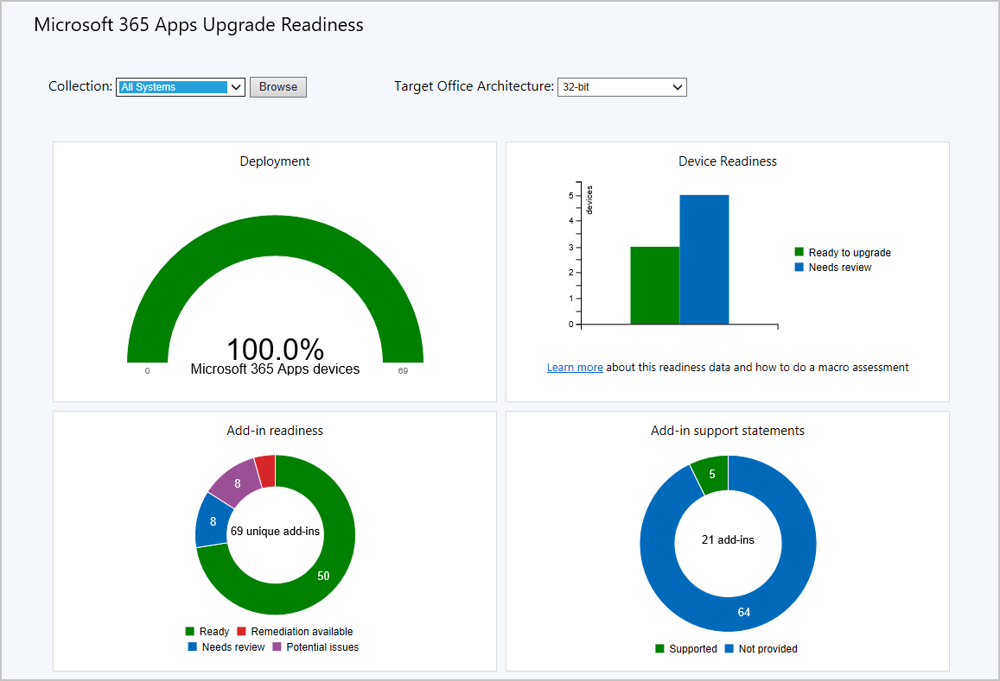
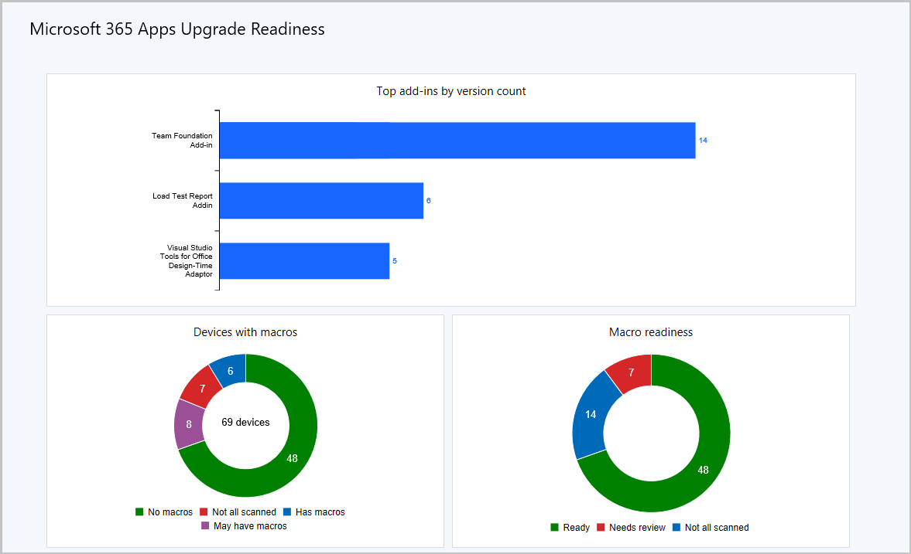
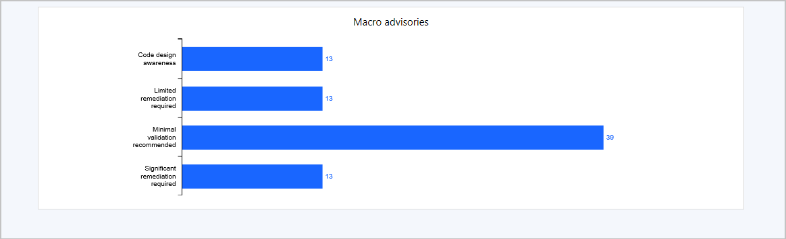
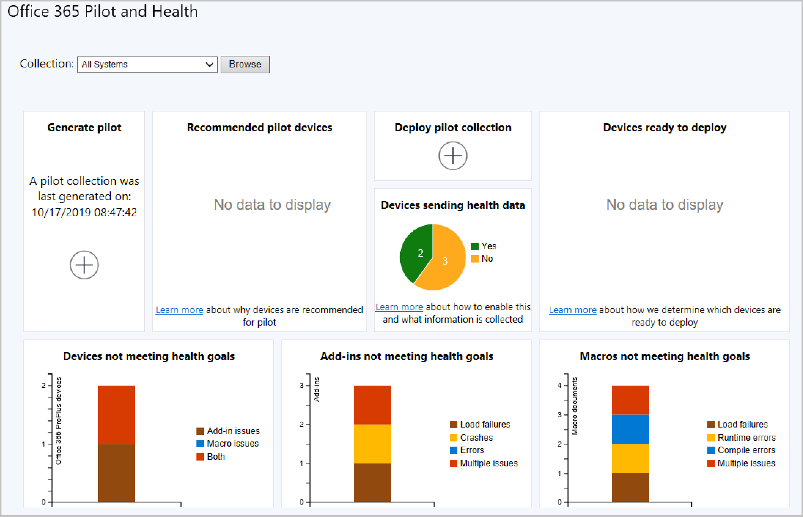

# Office 365 Client Management dashboard

*Applies to: Configuration Manager (current branch)*

> [!Note]
> Starting on April 21, 2020, Office 365 ProPlus is being renamed to **Microsoft 365 Apps for enterprise**. For more information, see [Name change for Office 365 ProPlus](/deployoffice/name-change). You may still see references to the old name in the Configuration Manager console and supporting documentation while the console is being updated.

> [!Note]
> Starting on April 1, 2025, office 365 client management dashboard add-in support statement will be removed from dashboard

Beginning in Configuration Manager version 1802, you can review Microsoft 365 Apps client information from the Office 365 Client Management dashboard. The Office 365 client management dashboard displays a list of relevant devices when graph sections are selected. <!--1357281 -->

## Prerequisites

### Enable hardware inventory

The data that is displayed in the Office 365 Client Management dashboard comes from hardware inventory. Enable hardware inventory and select the **Office 365 Configurations** hardware inventory class for data to display in the dashboard.
 
1. Enable hardware inventory, if it isn't yet enabled. For details, see [Configure hardware inventory](../../core/clients/manage/inventory/configure-hardware-inventory.md).
2. In the Configuration Manager console, navigate to **Administration** > **Client Settings** > **Default Client Settings**.  
3. On the **Home** tab, in the **Properties** group, click **Properties**.  
4. In the **Default Client Settings** dialog box, click **Hardware Inventory**.  
5. In the **Device Settings** list, click **Set Classes**.  
6. In the **Hardware Inventory Classes** dialog box, select **Office 365 Configurations**.  
7. Click **OK** to save your changes and close the **Hardware Inventory Classes** dialog box.

The Office 365 Client Management dashboard starts displaying data as hardware inventory is reported.

### Connectivity for the top-level site server

*(Introduced in version 1906 as a prerequisite)*

Your top-level site server needs access to the following endpoint to download the Microsoft Apps 365 readiness file:

- Starting March 2, 2021: `https://omex.cdn.office.net/mirrored/sccmreadiness/SOT_SCCM_AddinReadiness.CAB`
   - Location prior to March 2, 2021: `https://contentstorage.osi.office.net/sccmreadinessppe/sot_sccm_addinreadiness.cab`

> [!NOTE]
> - The location of this file is changing *March 2, 2021* <!--edit this, placeholder line-->. For more information, see [Download location change for Microsoft 365 Apps readiness file](https://techcommunity.microsoft.com/t5/configuration-manager-blog/download-location-change-for-microsoft-365-apps-readiness-file/ba-p/2110282).
> - Internet connectivity isn't required for the client devices for any of these scenarios.

### Enable data collection for Microsoft 365 Apps

*(Introduced in version 1910 as a prerequisite)*

Starting in version 1910, you'll need to enable data collection for Microsoft 365 Apps to populate information in the  **Office 365 Pilot and Health Dashboard**. The data is stored in the Configuration Manager site database and not sent to Microsoft.

This data is different from the diagnostic data, which is described in [Diagnostic data sent from Microsoft 365 Apps to Microsoft](/deployoffice/privacy/overview-privacy-controls#diagnostic-data-sent-from-office-365-proplus-to-microsoft).

You can enable data collection either by using Group Policy or by editing the registry.

#### Enable data collection from Group Policy

1. Download the latest [Administrative Template files from the Microsoft Download Center](https://www.microsoft.com/download/details.aspx?id=49030).
2. Enable the **Turn on telemetry data collection** policy setting under `User Configuration\Policies\Administrative Templates\Microsoft Office 2016\Telemetry Dashboard`.
    - Alternatively, apply the policy setting with the [Office cloud policy service](/DeployOffice/overview-office-cloud-policy-service).
    - The policy setting is also used by the Office Telemetry Dashboard, which you don't need to deploy for this data collection.

#### Enable data collection from the registry

The command below is an example of how to enable the data collection from the registry:

```cmd
reg add HKCU\Software\Policies\Microsoft\office\16.0\OSM /v EnableLogging /t REG_DWORD /d 1
```

## Viewing the Office 365 Client Management dashboard

To view the Office 365 Client Management dashboard in the Configuration Manager console, go to **Software Library** > **Overview** > **Office 365 Client Management**. At the top of the dashboard, use the **Collection** drop-down setting to filter the dashboard data by members of a specific collection. Beginning in Configuration Manager version 1802, the dashboard displays a list of relevant devices when graph sections are selected.

The Office 365 Client Management dashboard provides charts for the following information:

- Number of Microsoft 365 Apps clients
- Microsoft 365 Apps client versions
- Microsoft 365 Apps client languages
- Microsoft 365 Apps client channels
  For more information, see [Overview of update channels for Microsoft 365 Apps](/DeployOffice/overview-of-update-channels-for-office-365-proplus).


## <a name="bkmk_o365_readiness"></a> Integration for Microsoft 365 Apps readiness
<!--3735402-->
Starting in Configuration Manager version 1902, you can use the dashboard to identify devices with high confidence that are ready to upgrade to Microsoft 365 Apps. This integration provides insights into potential compatibility issues with add-ins and macros in your environment. Then use Configuration Manager to deploy Microsoft 365 Apps to ready devices.

The Office 365 client management dashboard includes a tile, **Office 365 Apps Upgrade Readiness**. This tile is a bar chart of devices in the following states:
- Not assessed
- Ready to upgrade
- Needs review

Select a state to drill-through to a device list. This readiness report shows more detail about devices. It includes columns for the compatibility state of both add-ins and macros.

### Prerequisites for Microsoft 365 Apps readiness integration

- Enable hardware inventory in client settings. For more information, see the [Prerequisites](#prerequisites) section.  

- The device needs connectivity to the Office content delivery network (CDN) to download an add-in readiness file. For more information, see [Content delivery networks](/office365/enterprise/content-delivery-networks). If the device can't download this file, the add-ins state is *Needs review*.  

    > [!Note]  
    > No data is sent to Microsoft for this feature.  

### <a name="bkmk_ort"></a> Detailed macro readiness

By default, the scanning agent looks at the most recently used (MRU) files list on each device. It counts the files in this list that support macros. These files include the following types:
- Macro-enabled Office file formats, such as Excel macro-enabled workbooks (.xlsm) or Word macro-enabled document (.docm)  
- Older Office formats that don't indicate whether there's macro content. For example, an Excel 97-2003 workbook (.xls).

## <a name="bkmk_readiness-dash"></a> Microsoft 365 Apps readiness dashboard

*(Introduced in version 1906)*

<!--4021125-->
To help you determine which devices are ready to upgrade to Microsoft 365 Apps, there's a readiness dashboard starting in version 1906. It includes the **Office 365 Apps Upgrade Readiness** tile that released in Configuration Manager current branch version 1902. The following new tiles on this dashboard help you evaluate add-in and macro readiness:

- Deployment
- Device readiness
- Add-in readiness
- Add-in support statements
- Top add-ins by count of version
- Number of devices that have macros
- Macro readiness
- Macro advisories

The following video is a session from Ignite 2019, which includes more information:

> [!VIDEO https://medius.studios.ms/Embed/Video-nc/IG19-BRK3090]

[Best practices for compatibility assessment and Microsoft Office 365 upgrades using Office Readiness in Configuration Manager](https://myignite.microsoft.com/archives/IG19-BRK3090)

### Using the Microsoft 365 Apps upgrade readiness dashboard

After verifying you have the [prerequisites](#prerequisites), use the following instructions to use the dashboard:
 
1. In the Configuration Manager console, go to the **Software Library** workspace, expand **Office 365 Client Management**.
1. Select the **Microsoft 365 Apps Upgrade Readiness** node.
1. Change the **Collection** and **Target Office Architecture** to change the information relayed in the dashboard.

[](./media/4021125-office-365-upgrade-readiness-dashboard.png#lightbox)

[](./media/4021125-office-365-to-add-ins.png#lightbox)

[](./media/4021125-office-365-macro-advisories.png#lightbox)

### Device Readiness information

Once the add-in and macro inventory on each device is evaluated, the devices are then grouped according to the information. Devices whose status are listed as **Ready to upgrade** aren't likely to have any compatibility issues.

Selecting the **Ready to upgrade** category on the graph shows more details about the devices in the limiting collection. You can review the device list, make selections according to your business requirements, and create a new device collection from your selection. Use your new collection to deploy Microsoft 365 Apps with Configuration Manager.

Devices that might be at risk for compatibility issues are marked as **Needs review**. These devices may need action to be taken before upgrading them to Microsoft 365 Apps. For example, you might update critical add-ins to a more recent version.

### Add-in information

> [!Note]
> Starting on April 1, 2025, office 365 client management dashboard add-in support statement will be removed from dashboard

 On each device, an inventory of all installed add-ins is collected. The inventory is then compared with the information Microsoft has about the add-in performance on Microsoft 365 Apps. If an add-in is found which is likely to cause issues after upgrading, then all devices with the add-in are flagged for review.

### Macro information

Configuration Manager looks at the most recently used files on each device. It counts the files in this list that support macros, including the following types:

- Macro-enabled Office file formats.
- Older Office formats, which don't indicate if there's macro content.

This report can be used to identify which devices have recently used files that may contain macros.

## <a name="bkmk_pilot"></a> Office 365 Pilot and Health dashboard
<!--4488272, 4488301-->
*(Introduced in version 1910)*

Starting in version 1910, the **Office 365 Pilot and Health Dashboard** helps you plan, pilot, and perform your Microsoft 365 Apps deployment. The dashboard provides health insights for devices with Microsoft 365 Apps to help identify possible issues that may affect your deployment plans. The **Office 365 Pilot and Health Dashboard** provides a recommendation for pilot devices based on add-in inventory. The following tiles are in the dashboard:

- Generate pilot
- Recommended pilot devices
- Deploy pilot
- Devices sending health data
- Devices not meeting health goals
- Add-ins not meeting health goals
- Macros not meeting health goals

### Using the Office 365 Pilot and Health dashboard

After verifying you have the [prerequisites](#prerequisites), use the following instructions to use the dashboard:

1. In the Configuration Manager console, go to the **Software Library** workspace, expand **Office 365 Client Management**.
1. Select the **Office 365 Pilot and Health** node.




### Generate pilot

Generate a pilot recommendation from a limiting collection at the click of a button. As soon as the action is launched, a background task starts calculating your pilot collection. Your limiting collection must contain at least one device with an Office version that isn't Office 365 Apps.

> [!NOTE]
> The **All Desktop and Server Clients (Office Pilot)** collection is managed by Configuration Manager. Manual changes aren't supported. If you delete or edit this collection, the pilot deployment won't work. <!--12610779-->

### Recommended pilot devices

**Recommended pilot devices** are a minimal set of devices representing all installed add-ins across the limiting collection you used when generating the pilot. Drill down to get a list of these devices. Then use the details to exclude any devices from the pilot if needed. If all of your add-ins are already on Microsoft 365 Apps devices, then devices with those add-ins won't be included in the calculation. This also means it's possible that you won't get any results in your pilot collection since all of your add-ins have been seen on devices where Microsoft 365 Apps is installed.

### Deploy pilot

Once you accept your pilot devices, deploy Microsoft 365 Apps to the pilot collection using the phased deployment wizard. Admins can define the pilot and limiting collection in the wizard to manage deployments.

### Health data

Once Microsoft 365 Apps is installed, enable health data on your pilot devices. The health data gives you insight into which add-ins and macros don't meet health goals. The **Devices ready to deploy** chart identifies non-pilot devices that are ready for deployment by using the health insights. Get a count of devices that are sending health data from the **Devices sending health data** chart.

### Devices not meeting health goals

This tile summarizes devices that have issues with add-ins, macros, or both.

### Add-ins not meeting health goals

- Load failures: The add-in failed to start.
- Crashes: The add-in failed while it was running.
- Error: The add-in reported an error.
- Multiple issues: The add-in has more than one of the above issues.

### Macros not meeting health goals

- Load failures: The document failed to load.
- Runtime errors: An error happened while the macro was running. These errors can be dependent on the inputs so may not always occur.
- Compile errors: The macro didn't compile correctly so it won't attempt to run.
- Multiple issues: The macro has more than one of the above issues.

### Known issues

There is a known issue with the **Deploy Pilot**  tile. At this time it can't be used to deploy to a pilot. The workaround is the existing workflow for deploying an application using the Phased Deployment Wizard. <!--5525871-->

## Next steps

[Manage Microsoft 365 Apps updates with Configuration Manager](manage-office-365-proplus-updates.md)
