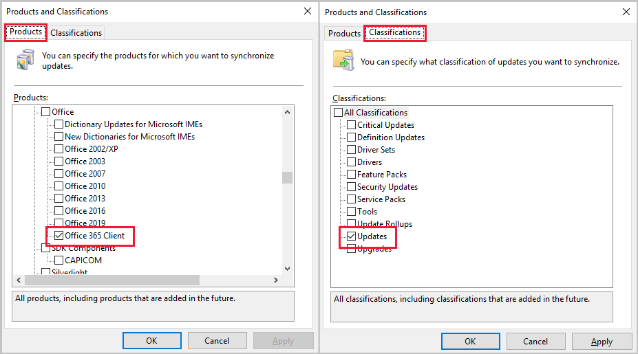

# <a name="bkmk_O365"></a> Synchronize Microsoft 365 Apps updates from a disconnected software update point

*Applies to: Configuration Manager (current branch)*
<!--4065163-->
Starting in Configuration Manager version 2002, you can use a tool to import Microsoft 365 Apps updates from an internet connected WSUS server into a disconnected Configuration Manager environment. Previously when you exported and imported metadata for software updated in disconnected environments, you were unable to deploy Microsoft 365 Apps updates. Microsoft 365 Apps updates require additional metadata downloaded from an Office API and the Office CDN, which isn't possible for disconnected environments.

> [!Note]
> Starting on April 21, 2020, Office 365 ProPlus is being renamed to **Microsoft 365 Apps for enterprise**. For more information, see [Name change for Office 365 ProPlus](/deployoffice/name-change). You may still see references to the old name in the Configuration Manager console and supporting documentation while the console is being updated.

## Prerequisites

- An internet connected WSUS server running a minimum of Windows Server 2012.
- The WSUS server needs connectivity to these two internet endpoints:
   - `officecdn.microsoft.com`
   - `config.office.com`
- Copy the OfflineUpdateExporter tool and its dependencies to the internet connected WSUS server.
  - The tool and its dependencies are in the **&lt;ConfigMgrInstallDir>/tools/OfflineUpdateExporter** directory.
- The user running the tool must be part of the **WSUS Administrators** group.
- The directory created to store the Microsoft 365 Apps update metadata and content should have appropriate access control lists (ACLs) to secure the files.
    - This directory must also be empty.
- Data being moved from the online WSUS server to the disconnected environment should be moved securely.

> [!IMPORTANT]
> Content will be downloaded for all Microsoft 365 Apps languages. Each update can have approximately 10 GB of content.

## Synchronize then decline unneeded Microsoft 365 Apps updates

1. On your internet connected WSUS, open the WSUS console.
1. Select **Options** then **Products and Classifications**.
1. In the **Products** tab, select **Office 365 Client** and select **Updates** in the **Classifications** tab.
[](./media/4065163-o365-updates-product-classification.png#lightbox)
1. Go to **Synchronizations** and select **Synchronize Now** to get the Microsoft 365 Apps updates into WSUS.
1. When the synchronization completes, decline any Microsoft 365 Apps updates that you don't want to deploy with Configuration Manager. You don't need to approve Microsoft 365 Apps updates in order for them to be downloaded.  
   - Declining unwanted Microsoft 365 Apps updates in WSUS doesn't stop them from being exported during a WsusUtil.exe export, but it does stop the OfflineUpdateExporter tool from downloading the content for them.
   - The OfflineUpdateExporter tool does the download of Microsoft 365 Apps updates for you. Other products will still need to be approved for download if you're exporting updates for them.
    - Create a [new update view in WSUS](/windows-server/administration/windows-server-update-services/manage/viewing-and-managing-updates#to-create-a-new-update-view-on-wsus) to easily see and decline unneeded Microsoft 365 Apps updates in WSUS.
1. If you're approving other product updates for download and export, wait for the content download to complete before running WsusUtil.exe export and copying the contents of the WSUSContent folder. For more information, see [Synchronize software updates from a disconnected software update point](synchronize-software-updates-disconnected.md)

## Exporting the Microsoft 365 Apps updates

1. Copy the OfflineUpdateExporter folder from Configuration Manager to the internet connected WSUS server.
    - The tool and its dependencies are in the **&lt;ConfigMgrInstallDir>/tools/OfflineUpdateExporter** directory.
1. From a command prompt on the internet connected WSUS server, run the tool with the following usage: **OfflineUpdateExporter.exe -O -D &lt;destination path>**

   |OfflineUpdateExporter Parameter|Description|
   |---|---|
   |**-O**|  **-Office**. Specifies product for updates export is Office 365 or Microsoft 365 Apps|
   |**-D**|**-Destination**. Destination is a required parameter and the entire path to the destination folder is needed.|

   - The **OfflineUpdateExporter** tool does the following:
      - Connects to WSUS
      - Reads the Microsoft 365 Apps update metadata in WSUS
      - Downloads the content and any additional metadata needed by the Microsoft 365 Apps updates to the destination folder

1. At the command prompt on the internet connected WSUS server, navigate to the folder that contains WsusUtil.exe. By default, the tool is located in %*ProgramFiles*%\Update Services\Tools. For example, if the tool is located in the default location, type **cd %ProgramFiles%\Update Services\Tools**.
   - If you're using Windows Server 2012, ensure [KB2819484](https://support.microsoft.com/help/2819484/cab-file-that-is-exported-by-using-the-wsusutil-exe-command-is-display) is installed on the WSUS servers.
   - The user that runs the WsusUtil tool must be a member of the local Administrators group on the server.

1. Type the following to export the software updates metadata to a GZIP file:  

    **WsusUtil.exe export**  *packagename*  *logfile*  

    For example:  

    **WsusUtil.exe export export.xml.gz export.log**

1. Copy the **export.xml.gz** file to the top-level WSUS server on the disconnected network.
1. If you approved updates for other products, copy the contents of the WSUSContent folder to the top-level disconnected WSUS server's WSUSContent folder.
1. Copy the destination folder used for the **OfflineUpdateExporter** to the top-level Configuration Manager site server on the disconnected network.

## Import the Microsoft 365 Apps updates

1. On the disconnected top-level WSUS server, import the update metadata from the **export.xml.gz** you generated on the internet connected WSUS server.
   
    For example:  

    **WsusUtil.exe import export.xml.gz import.log**
    
    By default, the WsusUtil.exe tool is located in %*ProgramFiles*%\Update Services\Tools.

1. Once the import is complete, you'll need to configure a site control property on the disconnected top-level Configuration Manager site server. This configuration change points Configuration Manager to the content for Microsoft 365 Apps. To change the property's configuration:
   1. Copy the [O365OflBaseUrlConfigured PowerShell script](#bkmk_o365_script) to the top-level disconnected Configuration Manager site server.
   1. Change `"D:\Office365updates\content"` to the full path of the copied directory containing the Microsoft 365 Apps content and metadata generated by OfflineUpdateExporter.
      > [!IMPORTANT]
      > Only local paths work for the O365OflBaseUrlConfigured property.
   1. Save the script as `O365OflBaseUrlConfigured.ps1`
   1. From an elevated PowerShell window on the disconnected top-level Configuration Manager site server, run `.\O365OflBaseUrlConfigured.ps1`.
   1. Restart the **SMS_Executive** service on the site server.
1. In the **Configuration Manager** console, navigate to **Administration** > **Site Configuration** > **Sites**.
1. Right-click on your top-level site, then select **Configure Site Components** > **Software Update Point**.
1. In the **Classifications** tab, select *Updates*. In the **Products** tab, select *Office 365 Client*.
1. [Synchronize software updates](synchronize-software-updates.md#manually-start-software-updates-synchronization) for Configuration Manager
1. When the synchronization completes, use your normal process to deploy Microsoft 365 Apps updates.

## <a name="bkmk_O365_ki"></a> Proxy configuration

- Proxy configuration isn't natively built into the tool. If proxy is set in the Internet Options on the server where the tool is running, in theory it will be used and should function properly.
   - From a command prompt, run `netsh winhttp show proxy` to see the configured proxy.


## <a name="bkmk_o365_script"></a> Modify O365OflBaseUrlConfigured property

```powershell
# Name: O365OflBaseUrlConfigured.ps1
#
# Description: This sample sets the O365OflBaseUrlConfigured property for the SMS_WSUS_CONFIGURATION_MANAGER component on the top-level site.
# This script must be run on the disconnected top-level Configuration Manager site server
#
# Replace "D:\Office365updates\content" with the full path to the copied directory containing all the Office metadata and content generated by the OfflineUpdateExporter tool.
# Only local paths work for the O365OflBaseUrlConfigured property.

$PropertyValue = "D:\Office365updates\content"

# Don't change any of the lines below
$PropertyName = "O365OflBaseUrlConfigured"

# Get provider instance
$providerMachine = Get-WmiObject -namespace "root\sms" -class "SMS_ProviderLocation"

if($providerMachine -is [system.array])
{
    $providerMachine=$providerMachine[0]
}

$SiteCode = $providerMachine.SiteCode

$component = gwmi -ComputerName $providerMachine.Machine -namespace root\sms\site_$SiteCode -query 'select comp.* from sms_sci_component comp join SMS_SCI_SiteDefinition sdef on sdef.SiteCode=comp.SiteCode where sdef.ParentSiteCode="" and comp.componentname="SMS_WSUS_CONFIGURATION_MANAGER"'
$properties = $component.props

Write-host "Updating $PropertyName property for site " $SiteCode

foreach ($property in $properties)
{
  if ($property.propertyname -eq $PropertyName) 
  {
    Write-host "Current value for $PropertyName is $($property.value2)"
    $property.value2 = $PropertyValue
    Write-host "Updating value for $PropertyName to $($property.value2)"
    break
  }
}

$component.props = $properties
$component.put()
```

## Next steps

[Add software updates to an update group](../deploy-use/add-software-updates-to-an-update-group.md)