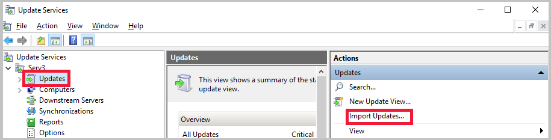
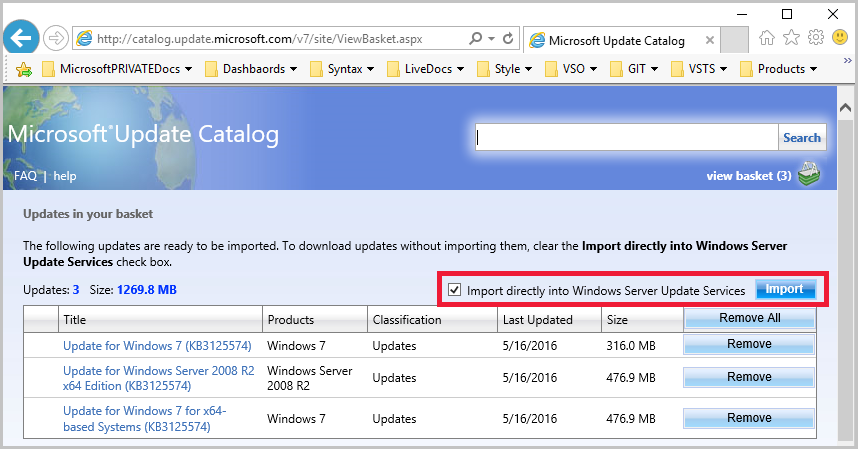

#   Synchronize software updates

*Applies to: Configuration Manager (current branch)*

 Software update synchronization in Configuration Manager is the process of retrieving the software update metadata that meets the criteria that you configure. This includes specific products, classifications, and languages. Typically, the software update point on the central administration site, or on a stand-alone primary site, retrieves the metadata from Microsoft Update. Then, the top-level site will send a synchronization request to other sites. When a site receives the synchronization request from the parent site, the software update point for the site retrieves software updates metadata from its upstream [synchronization source](../plan-design/plan-for-software-updates.md#BKMK_SyncSource). For more information about software update synchronization process, see [Software updates synchronization](../understand/software-updates-introduction.md#BKMK_Synchronization).

You configure software update synchronization to run on a schedule in the properties for the software update point at the top-level site. Once you configure the synchronization schedule, you'll typically not change the schedule as part of normal operations. However, you can manually initiate software update synchronization when it's necessary.

  > [!NOTE]  
  >  Software update points must be connected to their upstream synchronization source to synchronize software updates. When a software update point is disconnected from its upstream synchronization source, you can use the export and import method to synchronize software updates. For more information, see [Synchronize software updates from a disconnected software update point](synchronize-software-updates-disconnected.md).  

## Schedule software updates synchronization
When you configure a schedule for software updates synchronization, the top-level software update point starts synchronization with Microsoft Update at the scheduled date and time. The custom schedule allows you to synchronize software updates on a date and time when the demands of the Windows Server Update Services (WSUS) server, site server, and network are low. For example, you can set the schedule so that software updates are synchronized every week at 2:00 AM. During the scheduled synchronization, all changes to the software updates metadata since the last scheduled synchronization are inserted into the site database. This includes new software updates metadata or metadata that has been modified, removed, or is now expired.

Use the following procedures on the top-level site to schedule software updates synchronization.  

#### To schedule software updates synchronization  

  1.  In the Configuration Manager console, click **Administration**.  

  2.  In the Administration workspace, expand **Site Configuration**, and then click **Sites**.  

  3.  In the results pane, click the central administration site or stand-alone primary site.  

  4.  On the **Home** tab, in the **Settings** group, expand **Configure Site Components**, and then click **Software Update Point**.  

  5.  In the Software Update Point Component Properties dialog box, select **Enable synchronization on a schedule**, and then specify the synchronization schedule.  

## Manually start software updates synchronization
You can manually initiate software updates synchronization on the top-level site in the Configuration Manager console from the **All Software Updates** node in the **Software Library** workspace.  

Use the following procedures on the top-level site to manually initiate software updates synchronization.  

#### To manually start software updates synchronization  

1. In the Configuration Manager console that is connected to the central administration site or stand-alone primary site, click **Software Library**.  

2. In the Software Library workspace, expand **Software Updates** and click **All Software Updates** or **Software Update Groups**.  

3. On the **Home** tab, in the **All Software Updates** group, click **Synchronize Software Updates**. Click **Yes** in the dialog box to confirm that you want to initiate the synchronization process.  

   After you initiate the synchronization process on the software update point, you can monitor the synchronization process from the Configuration Manager console for all software update points in your hierarchy. Use the following procedure to monitor the software updates synchronization process.  

## Monitor software updates synchronization
After you initiate the synchronization process, you can use the Configuration Manager console to monitor the process for all software update points in your hierarchy. Use the following procedure to monitor the software update synchronization process. For more information about monitoring software updates, including the synchronization process, see [Monitor software updates](../deploy-use/monitor-software-updates.md).

#### To monitor the software updates synchronization process  

1. In the Configuration Manager console, click **Monitoring**.  

2. In the **Monitoring** workspace, click **Software Update Point Synchronization Status**.  

   The software update points in your Configuration Manager hierarchy are displayed in the results pane. From this view, you can monitor the synchronization status for all software update points. When you want more detailed information about the synchronization process, you can review the wsyncmgr.log file that is located in <*ConfigMgrInstallationPath*>\Logs on each site server.  

## Import updates from the Microsoft Update Catalog

The top-level Software Update Point uses WSUS to get information about software updates from Microsoft into Configuration Manager. Occasionally, you might need an update that doesn't automatically synchronize into WSUS for your selected products and classifications but is available in the [Microsoft Update Catalog](https://catalog.update.microsoft.com). Updates that don't automatically synchronize into WSUS are typically meant to resolve highly specific issues. Usually if an update is available in the catalog, you can import it into WSUS. You can then synchronize it into Configuration Manager and deploy it like any other update.

### To import an update from the Microsoft Update Catalog

1. Open the WSUS administration console and connect it to the top-level WSUS server in your hierarchy.
   - If Internet Explorer isn't the computer's default web browser, temporarily set it as the default.
2. Click on **Updates** or click your WSUS server's name. 
3. In the **Actions** pane, select **Import Updates...** which will open a browser window to the [Microsoft Update Catalog](https://catalog.update.microsoft.com).
   
4. If prompted, install the Microsoft Update Catalog ActiveX control. The control must be installed to import updates into WSUS. 
5. In the browser window, search for the update that you want. Click the **Add*** button to add it to the basket.
6. Click **view basket**. Make sure that the option to **Import directly into Windows Server Update Services** is selected. Then, click **Import**.
    
7. Once the import is complete, click **Close** on the browser window.
     - Reset your default browser if needed.
8. Synchronize your Configuration Manager Software Update Point.

## Next steps
After you synchronize software updates for the first time, or after there are new classifications or products available, you must [configure the new classifications and products](configure-classifications-and-products.md) to synchronize software updates with the new criteria.

After you synchronize software updates with the criteria that you need, [manage settings for software updates](manage-settings-for-software-updates.md).  
