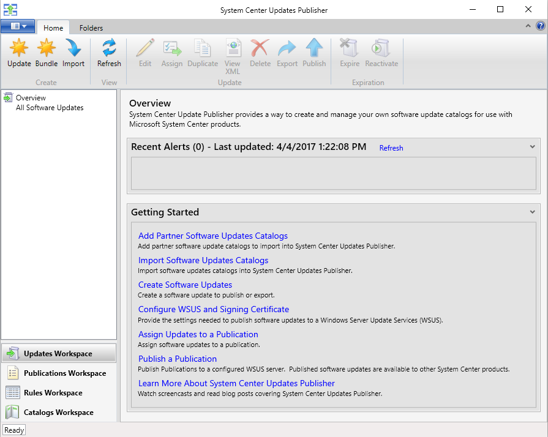
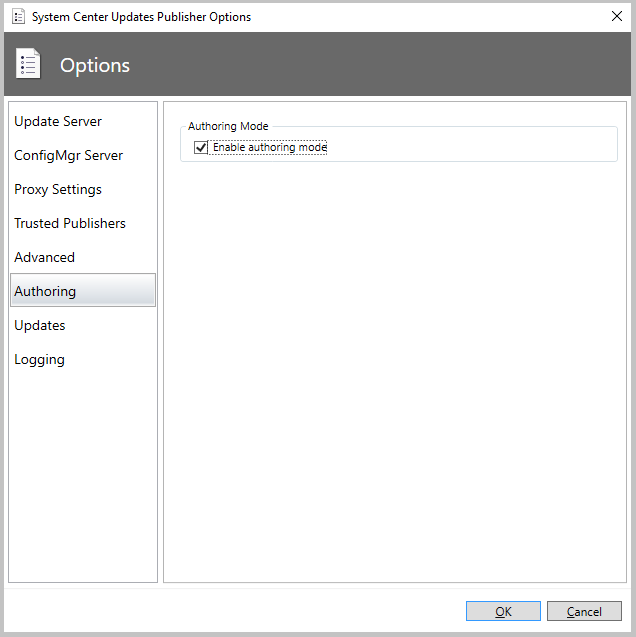
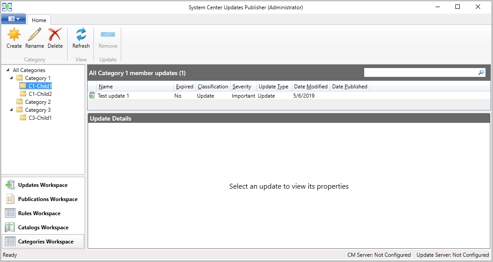
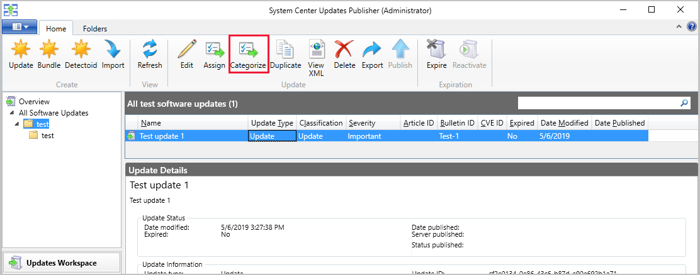
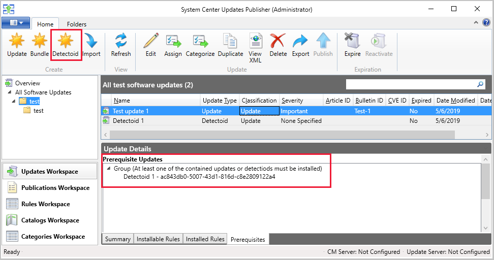

# System Center Updates Publisher

*Applies to: System Center Updates Publisher*

System Center Updates Publisher (Updates Publisher) is a stand-alone tool that enables independent software vendors or line-of-business application developers to manage custom updates. This custom updates management includes updates that have dependencies, like drivers and update bundles.

Using Updates Publisher, you can:

-   Import updates from external catalogs (non-Microsoft update catalogs).
-   Modify update definitions including applicability, and deployment metadata.
-   Export updates to external catalogs.
-   Publish updates to an update server.

After you publish updates to an update server, you can then use Configuration Manager to detect and deploy those updates to your managed devices.

>[!Important] 
> The System Center Updates Publisher (SCUP) and Integration with Configuration manager is unsupported starting January 31, 2024.
>
>"Support" in this context refers to both engineering and assisted technical support. No further engineering development will occur, and users are unable to receive phone or online assisted technical support.
>
>The information in this section is provided to help you plan for alternatives to using this feature, and will be removed in the future. 

## Workspaces
When you open Updates Publisher, it defaults to the Overview node of the *Updates Workspace.*

Updates Publisher has four workspaces to help organize it.

**Updates Workspace:** Use this workspace to [create](create-updates-with-updates-publisher.md) and [manage](manage-updates-with-updates-publisher.md) software updates and update bundles. This workspace includes assigning updates and bundles to a publication, publishing, and exporting to another Updates Publisher repository.

**Publications Workspace:** This workspace is where you [manage publications](updates-publisher-publications.md). A publication is group of updates you create to simplify the export and publishing of the updates.

Managing publications includes publishing updates to a server so your clients can find and install them, exporting updates and bundles for use by other Updates Publisher installations, or modifying the contents of or details of a publication.

**Rules Workspace:** Here is where you [manage applicability rules](updates-publisher-applicability-rules.md) that can be saved and then used with updates you deploy. There are two types of rules:

-   Installable rules – These rules help determine if a client should install an update.
-   Installed rules – These rules verify if an update is already installed.

**Catalogs Workspace:** Use this workspace to add and [manage software update catalogs](updates-publisher-catalogs.md). This workspace includes the import of software updates from those catalogs to the Updates Publisher repository.

## What's new in System Center Updates Publisher

>[!NOTE] 
> The latest version of System Center Updates Publisher was released on November 6, 2019. For more information, see the [Release history](#release-history) section.

>[!Important] 
> The System Center Updates Publisher (SCUP) and Integration with Configuration manager will be deprecated on January 31, 2024. 

There's a new authoring mode System Center Updates Publisher to help you author your updates. When you enable authoring mode, a **Categories Workspace** is added to the start screen. A new **Detectoid** button is also added to the **Updates Workspace** when authoring mode is enabled.

### To enable authoring mode

1. In upper left corner of the console, click on the **Updates Publisher** **Properties** tab, and then choose **Options**.
1. Go to the **Authoring** options.
1. Check the box for **Enable authoring mode**.

### About the categories workspace

The categories workspace enables update authors to organize updates that belong together. For instance, if you're an OEM, you might wish to organize your updates based on models or product lines. You can define multiple categories and child categories but not grand child categories as you're limited to two levels.

### Assign an update to a category

Once you've authored your update, you can assign it to a category by selecting the update then clicking the **Categorize** button. You can also right-click the update and select **Categorize**.

### About detectoids

Once authoring mode is enabled, you can create detectoids for updates. Detectoids are useful when you have multiple updates that use the same rule (or a set of rules) to determine applicability. In those instances, you would create a detectoid and assign it as a prerequisite for an update. You can assign multiple detectoids to an authored update.

### Create a detectoid

1. Open the **Updates Workspace**.
1. In the ribbon, click the **Detectoid** button.
1. Follow the prompts in the wizard to create your detectoid.

## Release history

- [2019 RTW version 6.0.394.0](https://techcommunity.microsoft.com/t5/Configuration-Manager-Blog/SCUP-adds-support-for-update-categories/ba-p/990111). Released November, 6, 2019
- [Update rollup version 6.0.283.0 from KB4462765](https://support.microsoft.com/help/4462765/update-rollup-for-system-center-updates-publisher). Released September 7, 2018.
- [2017 RTW version 6.0.276.0](https://techcommunity.microsoft.com/t5/Configuration-Manager-Blog/System-Center-Updates-Publisher-adds-support-for-new-OSes/ba-p/274986). Released March 26, 2018.

## Next steps
To get started, first [install](install-updates-publisher.md), and then [configure options](updates-publisher-options.md) for Updates Publisher.
