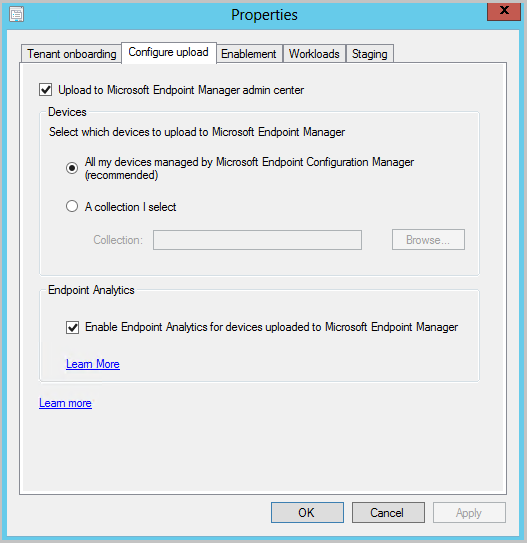

#  Microsoft Endpoint Manager tenant attach: Device sync and device actions
<!--3555758 live 3/4/2020  Configuration Manager version 2002 min-->
*Applies to: Configuration Manager (current branch)*

Microsoft Endpoint Manager is an integrated solution for managing all of your devices. Microsoft brings together Configuration Manager and Intune into a single console called **Microsoft Endpoint Manager admin center**. You can upload your Configuration Manager devices to the cloud service and take actions from the **Devices** blade in the admin center.

## Prerequisites

- An account that is a *Global Administrator* for signing in when applying this change. For more information, see [Azure Active Directory (Azure AD) administrator roles](/azure/role-based-access-control/rbac-and-directory-admin-roles#azure-ad-administrator-roles).

  - Onboarding creates a third-party app and a first party service principal in your Azure AD tenant.

- An Azure cloud environment.

  - The **Upload to Microsoft Endpoint Manager admin center** option is disabled for Microsoft Azure China 21Vianet (Azure China Cloud) and Azure US Government Cloud.<!--8815787--> Starting in version 2107, this option is available for US Government customers.

- Starting in version 2107, United States Government customers can use the following tenant attach features in the US Government cloud:<!-- 8353823 -->

  - Account onboarding
  - Tenant sync to Intune
  - Device sync to Intune
  - Device actions in the Microsoft Endpoint Manager admin center

- At least one Intune license for you as the administrator to access the Microsoft Endpoint Manager admin center. <!--10254915-->

- The [administration service](../develop/adminservice/overview.md) in Configuration Manager needs to be set up and functional. <!--1104776-->

- The user accounts triggering device actions have the following prerequisites:
   - The user account needs to be a synced user object in Azure AD (hybrid identity). This means that the user is synced to Azure Active Directory from Active Directory.
     - For Configuration Manager version 2103, and later:  
   Has been discovered with either [Azure Active Directory user discovery](../core/servers/deploy/configure/about-discovery-methods.md#azureaddisc) or [Active Directory user discovery](../core/servers/deploy/configure/about-discovery-methods.md#bkmk_aboutUser). <!--9089764-->
     - For Configuration Manager version 2010, and earlier:  
   Has been discovered with both [Azure Active Directory user discovery](../core/servers/deploy/configure/about-discovery-methods.md#azureaddisc) and [Active Directory user discovery](../core/servers/deploy/configure/about-discovery-methods.md#bkmk_aboutUser).
.

   - The **Initiate Configuration Manager action** permission under **Remote tasks** in the Microsoft Endpoint Manager admin center. 
      - For more information about adding or verifying permissions in the admin center, see [Role-based access control (RBAC) with Microsoft Intune](../../intune/fundamentals/role-based-access-control.md#roles).

- If your central administration site has a [remote provider](../core/plan-design/hierarchy/plan-for-the-sms-provider.md), then follow the instructions for the [CAS has a remote provider](../core/servers/manage/cmpivot-changes.md#cas-has-a-remote-provider) scenario in the CMPivot article. <!--7796824-->

This feature supports all OS versions that Configuration Manager currently supports as a client. For more information, see [Supported OS versions for clients and devices](../core/plan-design/configs/supported-operating-systems-for-clients-and-devices.md).<!-- MEMDocs#545 -->

## Internet endpoints

[!INCLUDE [Internet endpoints for tenant attach](../core/plan-design/network/includes/internet-endpoints-tenant-attach.md)]

Starting in version 2010, the service connection point validates important internet endpoints for tenant attach. These checks help make sure that the cloud service is available. It also helps you troubleshoot issues by quickly determining if network connectivity is a problem. For more information, see [Validate internet access](../core/servers/deploy/configure/about-the-service-connection-point.md#validate-internet-access).<!--8565578-->

> [!NOTE]
> The service connection point checks the CRL. If this server doesn't have access to the URLs listed above, the CRL check fails. Consider setting a system proxy or use the following command: 'netsh winhttp set proxy'. For more information, see [How the Windows Update client determines which proxy server to use to connect to the Windows Update Web site](https://support.microsoft.com/topic/how-the-windows-update-client-determines-which-proxy-server-to-use-to-connect-to-the-windows-update-web-site-08612ae5-3722-886c-f1e1-d012516c22a1). Make sure that you include a bypass list for internal site communications. This configuration may be neccesary as the proxy server settings within Configuration Manager only configure the proxy for Configuration Manager applications and not the underlying OS.

##  Enable device upload when co-management is already enabled

If you have co-management enabled currently, you'll use the co-management properties to enable device upload. When co-management isn't already enabled, [Use the **Cloud Attach Configuration Wizard**](#bkmk_config) to enable device upload instead.

When co-management is already enabled, edit the co-management properties to enable device upload using the instructions below:

1. In the Configuration Manager admin console, go to **Administration** > **Overview** > **Cloud Services** > **Cloud Attach**.
   - For version 2103 and earlier, select the **Co-management** node.
1. In the ribbon, select **Properties** for your co-management production policy.
1. In the **Configure upload** tab, select **Upload to Microsoft Endpoint Manager admin center**. Select **Apply**.
   - The default setting for device upload is **All my devices managed by Microsoft Endpoint Configuration Manager**. If needed, you can limit upload to a single device collection.
   - Starting in Configuration Manager version 2010, when a single collection is selected, its child collections are also uploaded.
1. Check the option to **Enable Endpoint analytics for devices uploaded to Microsoft Endpoint Manager** if you also want to get insights for optimizing the end-user experience in [Endpoint Analytics](../../analytics/overview.md).

> [!Important]
> When you enable Endpoint analytics data upload, your default client settings will be automatically updated to allow managed endpoints to send relevant data to your Configuration Manager site server. If you use custom client settings, you may need to update and re-deploy them for data collection to occur. For more details on this, as well as how to configure data collection, such as to limit collection only to a specific set of devices, see the section on [Configuring Endpoint analytics data collection](../../analytics/enroll-configmgr.md#bkmk_cm_enable).

   
1. Sign in with your *Global Administrator* account when prompted.
1. Select **Yes** to accept the **Create AAD Application** notification. This action provisions a service principal and creates an Azure AD application registration to facilitate the sync.
1. Choose **OK** to exit the co-management properties once you've done making changes.

##  Enable device upload when co-management isn't enabled

If you don't have co-management enabled, you'll use the **Cloud Attach Configuration Wizard** to enable device upload. You can upload your devices without enabling automatic enrollment for co-management or switching workloads to Intune. All Devices managed by Configuration Manager that have **Yes** in the **Client** column will be uploaded. If needed, you can limit upload to a single device collection. If co-management is already enabled in your environment, [Edit co-management properties](#bkmk_edit) to enable device upload instead.

When co-management isn't enabled, use the instructions below to enable device upload:

1. In the Configuration Manager admin console, go to **Administration** > **Overview** > **Cloud Services** >  **Cloud Attach**. For version 2103 and earlier, select the **Co-management** node.

    - Starting in Configuration Manager version 2111, the tenant attach onboarding experience changed. The cloud attach wizard makes it easier to enable tenant attach and other [cloud features](../cloud-attach/overview.md). You can choose a streamlined set of recommended defaults, or customize your cloud attach features. For more information on enabling tenant attach with the new wizard, see [Enable cloud attach](../cloud-attach/enable.md).<!--10964629-->

1. In the ribbon, select **Configure Cloud Attach** to open the wizard. For version 2103 and earlier, select **Configure co-management** to open the wizard.
1. On the onboarding page, select **AzurePublicCloud** for your environment. Azure Government Cloud and Azure China 21Vianet aren't supported.
   - Starting in version 2107, US Government customers can select **AzureUSGovernmentCloud**.<!-- 8353823 -->
1. Select **Sign In**. Use your *Global Administrator* account to sign in.
1. Ensure the **Enable Microsoft Endpoint Manager admin center** option is selected on the **Cloud attach** page. For version 2103 and earlier, select the **Upload to Microsoft Endpoint Manager admin center** option on the **Tenant onboarding** page.
   - Make sure the option **Enable automatic client enrollment for co-management** isn't checked if you don't want to enable co-management now. If you do want to enable co-management, select the option.
   - If you enable co-management along with device upload, you'll be given additional pages in the wizard to complete. For more information, see [Enable co-management](../comanage/how-to-enable.md).

   
1. Choose **Next** and then **Yes** to accept the **Create AAD Application** notification. This action provisions a service principal and creates an Azure AD application registration to facilitate the sync.
     - Optionally, you can import a previously created Azure AD application during tenant attach onboarding (starting in version 2006). For more information, see the [Import a previously created Azure AD application](#bkmk_aad_app) section.
1. On the **Configure upload** page, select the recommended device upload setting for **All my devices managed by Microsoft Endpoint Configuration Manager**. If needed, you can limit upload to a single device collection.
    - Starting in Configuration Manager version 2010, when a single collection is selected, its child collections are also uploaded. <!--8717629-->
1. Check the option to **Enable Endpoint analytics for devices uploaded to Microsoft Endpoint Manager** if you also want to get insights to optimize the end-user experience in [Endpoint Analytics](../../analytics/overview.md)
1. Select **Summary** to review your selection, then choose **Next**.
1. When the wizard is complete, select **Close**.  

## Perform device actions

1. In a browser, navigate to `endpoint.microsoft.com`
1. Select **Devices** then **All devices** to see the uploaded devices. You'll see **ConfigMgr** in the **Managed by** column for uploaded devices.
   
1. Select a device to load its **Overview** page.
1. Choose any of the following actions:
   - **Sync Machine Policy**
   - **Sync User Policy**
   - **App Evaluation Cycle**

   

[!INCLUDE [Import a previously created Azure AD application](includes/import-azure-app.md)]

## Display the Configuration Manager connector status from the admin console
 <!--IN9229333, CM7138634-->
From the Microsoft Endpoint Manager admin center, you can review the status of your Configuration Manager connector. To display the connector status, go to **Tenant administration** > **Connectors and tokens** > **Microsoft Endpoint Configuration Manager**. Select a Configuration Manager hierarchy to display additional information about it.
   
:::image type="content" source="media/7138634-connector-status.png" alt-text="Microsoft Endpoint Configuration Manager connector in the admin center" lightbox="media/7138634-connector-status.png":::

> [!NOTE]
> Some information isn't available if the hierarchy is running Configuration Manager version 2006 or earlier.

##  Offboard from tenant attach

While we know customers get enormous value by enabling tenant attach, there are rare cases where you might need to offboard a hierarchy. You can offboard from either the Configuration Manager console (recommend method) or from the Microsoft Endpoint Manager admin center.
### Offboard from the Configuration Manager console

When tenant attach is already enabled, edit the co-management properties to disable device upload and offboard.

1. In the Configuration Manager admin console, go to **Administration** > **Overview** > **Cloud Services** > **Cloud Attach**.
   - For version 2103 and earlier, select the **Co-management** node.
1. In the ribbon, select **Properties** for your co-management production policy.
1. In the **Configure upload** tab, remove the **Upload to Microsoft Endpoint Manager admin center** selection.
1. Select **Apply**.

### Offboard from the Microsoft Endpoint Manager admin center
<!-- CMADO7043245 INADO9412904 -->
If needed, you can offboard a Configuration Manager hierarchy from the Microsoft Endpoint Manager admin center. For example, you may need to offboard from the admin center following a disaster recovery scenario where the on-premises environment was removed. Follow the steps below to remove your Configuration Manager hierarchy from the Microsoft Endpoint Manager admin center:

1. Sign in to the [Microsoft Endpoint Manager admin center](https://go.microsoft.com/fwlink/?linkid=2109431).
1. Select **Tenant administration** then **Connectors and tokens**.
1. Select **Microsoft Endpoint Configuration Manager**.
1. Choose the name of the site you would like to offboard, then select **Delete**.
   - The connector may be listed as **Unknown** for version 2002 sites or if site information is lacking. <!--10569820, 10944009-->

When you offboard a hierarchy from the admin center, it may take up to two hours to remove from the Microsoft Endpoint Manager admin center. If you offboard a Configuration Manager 2103 or later site that's online and healthy, the process may only take a few minutes.

> [!NOTE]
> If you are using custom [RBAC roles with Intune](../../intune/fundamentals/role-based-access-control.md#roles), you will need to grant the **Organization** > **Delete** permission to offboard a hierarchy.

## Next steps

- [Enroll Configuration Manager devices into Endpoint analytics](../../analytics/enroll-configmgr.md#bkmk_cm_enroll)
- For information about the tenant attach log files, see [Troubleshoot tenant attach](troubleshoot.md).
