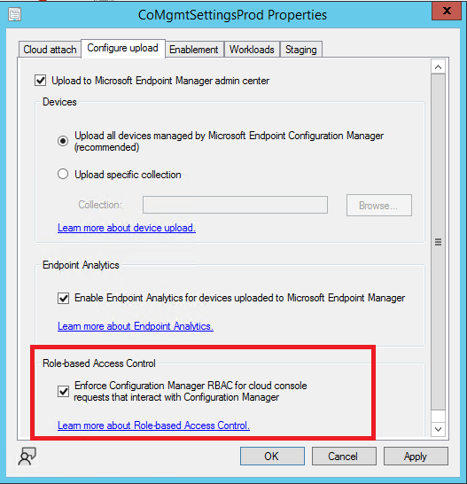
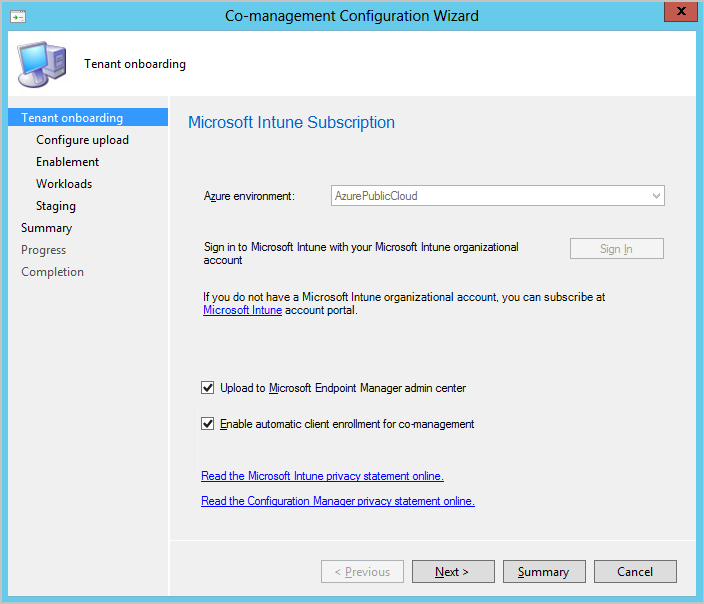
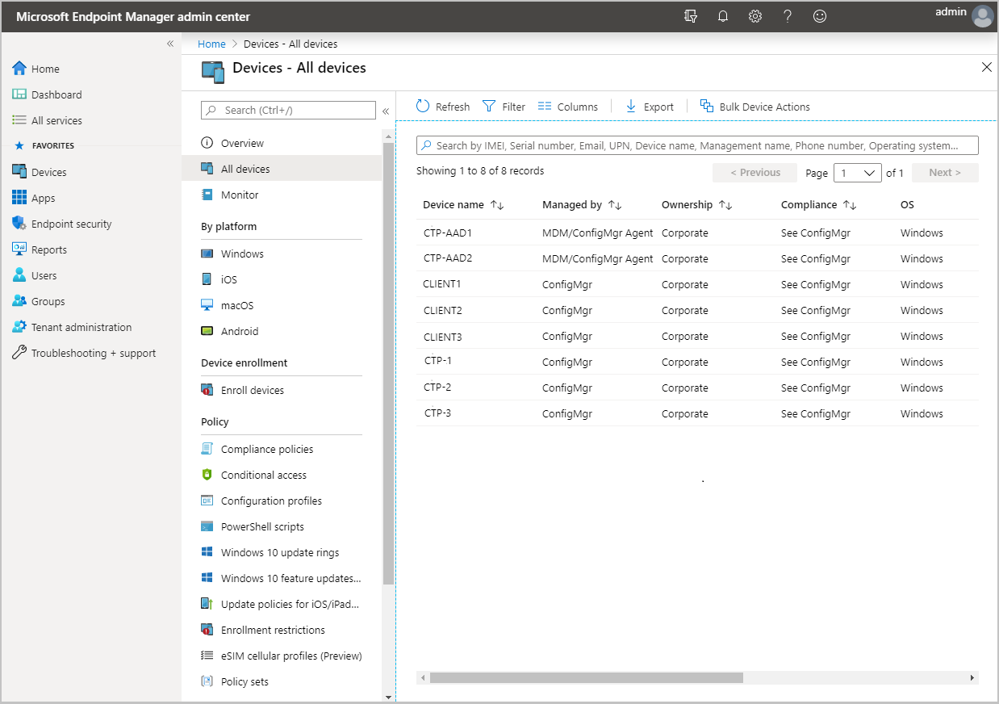
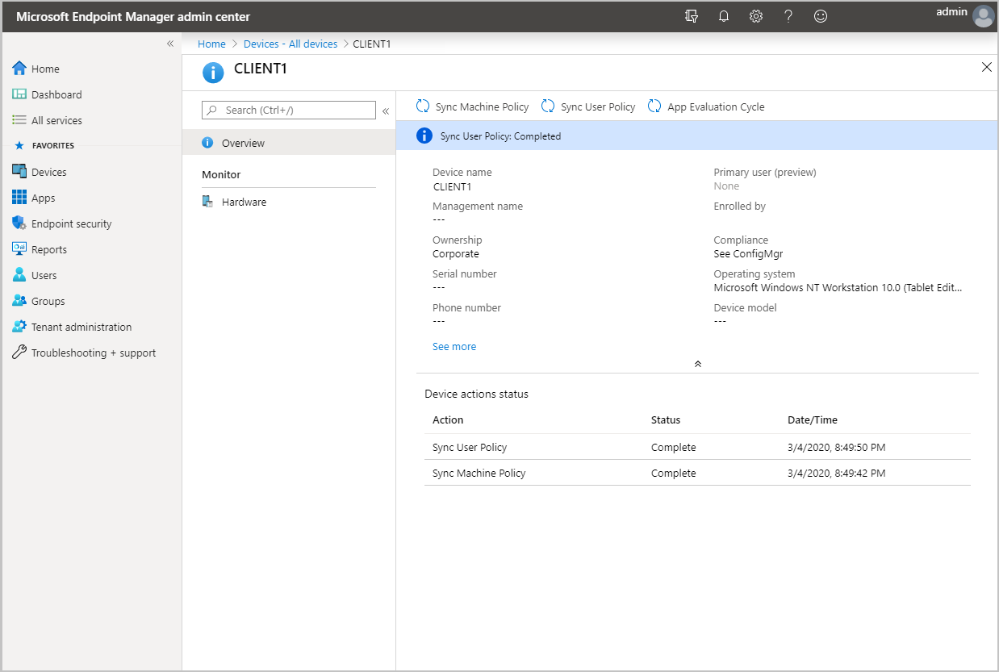

#  Enable Microsoft Intune tenant attach: Device sync and device actions
<!--3555758 live 3/4/2020  Configuration Manager version 2002 min-->
*Applies to: Configuration Manager (current branch)*

The Microsoft Intune family of products is an integrated solution for managing all of your devices. Microsoft brings together Configuration Manager and Intune into a single console called **Microsoft Intune admin center**. You can upload your Configuration Manager devices to the cloud service and take actions from the **Devices** blade in the admin center.

> [!IMPORTANT]
> When you attach your Configuration Manager site with a Microsoft Intune tenant, the site sends more data to Microsoft. [Tenant attach data collection](data-collection.md) article summarizes the data that is sent.

##  Enable device upload when co-management is already enabled

If you have co-management enabled currently, you must use the co-management properties to enable device upload. When co-management isn't already enabled, [Use the **Cloud Attach Configuration Wizard**](#bkmk_config) to enable device upload instead.  Before you enable tenant attach, verify that the [prerequisites for tenant attach](prerequisites.md) are met.

When co-management is already enabled, edit the co-management properties to enable device upload using the instructions below:

1. In the Configuration Manager admin console, go to **Administration** > **Overview** > **Cloud Services** > **Cloud Attach**.
   - For version 2103 and earlier, select the **Co-management** node.
1. In the ribbon, select **Properties** for your co-management production policy.
1. In the **Configure upload** tab, select **Upload to Microsoft Endpoint Manager admin center**. Select **Apply**.
   - The default setting for device upload is **All my devices managed by Microsoft Endpoint Configuration Manager**. If needed, you can limit upload to a single device collection.
   - When a single collection is selected, its child collections are also uploaded.
1. Check the option to **Enable Endpoint analytics for devices uploaded to Microsoft Endpoint Manager** if you also want to get insights for optimizing the end-user experience in [Endpoint Analytics](../../analytics/overview.md).
1. Check the option to **Enforce Role-based Access Control** for the devices uploading to cloud service. By default, SCCM RBAC is enforced along with Intune RBAC when you're uploading your Configuration Manager devices to the cloud service. Hence, the checkbox is checked by default. If you want to enforce only Intune RBAC or if you're using cloud-only account, you must uncheck the option.
1. Check the option to **Enable Uploading Microsoft Defender for Endpoint data for reporting on devices uploaded to Microsoft Intune admin center** if you want to use [Endpoint Security reports in Intune admin center](deploy-antivirus-policy.md#bkmk_mdereports)

> [!Important]
> When you enable Endpoint analytics data upload, your default client settings is automatically updated to allow managed endpoints to send relevant data to your Configuration Manager site server. If you use custom client settings, you may need to update and re-deploy them for data collection to occur. For more information on this, as well as how to configure data collection, such as to limit collection only to a specific set of devices, see the section on [Configuring Endpoint analytics data collection](../../analytics/enroll-configmgr.md#bkmk_cm_enable).

  
 
<!-- : : : image type="content" source="../../analytics/media/13058986-configure-upload-configmgr.png" alt-text="Upload devices to Microsoft Intune admin center." : : : -->
 
1. Sign in with your *Global Administrator* account when prompted.
1. Select **Yes** to accept the **Create Microsoft Entra Application** notification. This action provisions a service principal and creates a Microsoft Entra application registration to facilitate the sync.
1. Choose **OK** to exit the co-management properties once you've done making changes.

##  Enable device upload when co-management isn't enabled

If you don't have co-management enabled, use the **Cloud Attach Configuration Wizard** to enable device upload. You can upload your devices without enabling automatic enrollment for co-management or switching workloads to Intune. All Devices managed by Configuration Manager that have **Yes** in the **Client** column is uploaded. If needed, you can limit upload to a single device collection. If co-management is already enabled in your environment, [Edit co-management properties](#bkmk_edit) to enable device upload instead. Before you enable tenant attach, verify that the [prerequisites for tenant attach](prerequisites.md) have been met.

When co-management isn't enabled, use the instructions below to enable device upload:

1. In the Configuration Manager admin console, go to **Administration** > **Overview** > **Cloud Services** >  **Cloud Attach**. For version 2103 and earlier, select the **Co-management** node.

    - Starting in Configuration Manager version 2111, the tenant attach onboarding experience changed. The cloud attach wizard makes it easier to enable tenant attach and other [cloud features](../cloud-attach/overview.md). You can choose a streamlined set of recommended defaults, or customize your cloud attach features. For more information on enabling tenant attach with the new wizard, see [Enable cloud attach](../cloud-attach/enable.md).<!--10964629-->

1. In the ribbon, select **Configure Cloud Attach** to open the wizard. For version 2103 and earlier, select **Configure co-management** to open the wizard.
1. On the onboarding page, select **AzurePublicCloud** for your environment. Azure Government Cloud and Azure China 21Vianet aren't supported.
   - Starting in version 2107, US Government customers can select **AzureUSGovernmentCloud**.<!-- 8353823 -->
1. Select **Sign In**. Use your *Global Administrator* account to sign in.
1. Ensure the **Enable Microsoft Endpoint Manager admin center** option is selected on the **Cloud attach** page. For version 2103 and earlier, select the **Upload to Microsoft Endpoint Manager admin center** option on the **Tenant onboarding** page.
   - Make sure the option **Enable automatic client enrollment for co-management** isn't checked if you don't want to enable co-management now. If you do want to enable co-management, select the option.
   - If you enable co-management along with device upload, there will be given additional pages in the wizard to complete. For more information, see [Enable co-management](../comanage/how-to-enable.md).

   
1. Choose **Next** and then **Yes** to accept the **Create Microsoft Entra Application** notification. This action provisions a service principal and creates a Microsoft Entra application registration to facilitate the sync.
     - Optionally, you can import a previously created Microsoft Entra application during tenant attach onboarding. For more information, see the [Import a previously created Microsoft Entra application](#bkmk_aad_app) section.
1. On the **Configure upload** page, select the recommended device upload setting for **All my devices managed by Microsoft Endpoint Configuration Manager**. If needed, you can limit upload to a single device collection.
    - When a single collection is selected, its child collections are also uploaded. <!--8717629-->
1. Check the option to **Enable Endpoint analytics for devices uploaded to Microsoft Endpoint Manager** if you also want to get insights to optimize the end-user experience in [Endpoint Analytics](../../analytics/overview.md).
1. Check the option to **Enforce Role-based Access Control** for the devices uploading to cloud service. By default, SCCM RBAC is enforced along with Intune RBAC when you're uploading your Configuration Manager devices to the cloud service. Hence, the checkbox is checked by default. If you want to enforce only Intune RBAC or if you're using cloud-only account, you must uncheck the option.
1. Check the option to **Enable Uploading Microsoft Defender for Endpoint data for reporting on devices uploaded to Microsoft Intune admin center** if you want to use [Endpoint Security reports in Intune admin center](deploy-antivirus-policy.md#bkmk_mdereports)
1. Select **Summary** to review your selection, then choose **Next**.
1. When the wizard is complete, select **Close**.  

## Scope tags
<!--IN12698965-->
Tenant-attached devices receive the [default scope tag](../../intune/fundamentals/scope-tags.md#default-scope-tag) from Microsoft Intune. If you remove the default scope tag from a tenant-attached device, the device won't be displayed at all in the [Microsoft Intune admin center](https://go.microsoft.com/fwlink/?linkid=2109431). Currently, tenant-attached devices can't be assigned scope tags unlike [co-managed devices](../comanage/overview.md?toc=/mem/configmgr/cloud-attach/toc.json&bc=/mem/configmgr/cloud-attach/breadcrumb/toc.json) can.

However, sometimes you don’t want certain [Intune roles](../../intune/fundamentals/role-based-access-control.md#built-in-roles) to see tenant-attached devices. For instance, you may not want someone with Intune's **Help Desk Operator** role to see tenant-attached devices because they're servers. In these cases, create or use a custom role in Intune that doesn't have **Default** listed for its **Scope tags**. When [creating custom Intune roles](../../intune/fundamentals/create-custom-role.md#to-create-a-custom-role), keep in mind that the default scope tag is automatically added to all untagged objects.

## Perform device actions

1. In a browser, navigate to `intune.microsoft.com`
1. Select **Devices** then **All devices** to see the uploaded devices. You'll see **ConfigMgr** in the **Managed by** column for uploaded devices.
   
1. Select a device to load its **Overview** page.
1. Choose any of the following actions:
   - **Sync Machine Policy**
   - **Sync User Policy**
   - **App Evaluation Cycle**

   

## Display the Configuration Manager connector status from the admin console
 <!--IN9229333, CM7138634-->
From the Microsoft Intune admin center, you can review the status of your Configuration Manager connector. To display the connector status, go to **Tenant administration** > **Connectors and tokens** > **Microsoft Endpoint Configuration Manager**. Select a Configuration Manager hierarchy to display additional information about it.
   
:::image type="content" source="media/7138634-connector-status.png" alt-text="Microsoft Configuration Manager connector in the admin center" lightbox="media/7138634-connector-status.png":::

### View recommendations and insights to enrich the Configuration Manager site health and device management experience
<!-- 16957774 -->
You can view recommendations and insights for your Configuration Manager sites. These recommendations can help you improve the site health and infrastructure and enrich the device management experience.

Recommendations include:

- How to simplify your infrastructure
- Enhance device management
- Provide device insights
- Improve the health of the site

To view recommendations, go to **Tenant administration > Connectors and tokens > Microsoft Endpoint Configuration Manager**, and select a _site_ to view recommendations for that. Once selected, you’ll find the _Recommendations_ tab that displays each insight along with a _Learn more_ link that opens details on how to apply that recommendation.

##  Offboard from tenant attach

While we know customers get enormous value by enabling tenant attach, there are rare cases where you might need to offboard a hierarchy. You can offboard from either the Configuration Manager console (recommend method) or from the Microsoft Intune admin center.
### Offboard from the Configuration Manager console

When tenant attach is already enabled, edit the co-management properties to disable device upload and offboard.

1. In the Configuration Manager admin console, go to **Administration** > **Overview** > **Cloud Services** > **Cloud Attach**.
   - For version 2103 and earlier, select the **Co-management** node.
1. In the ribbon, select **Properties** for your co-management production policy.
1. In the **Configure upload** tab, remove the **Upload to Microsoft Endpoint Manager admin center** selection.
1. Select **Apply**.

### Offboard from the Microsoft Intune admin center
<!-- CMADO7043245 INADO9412904 -->
If needed, you can offboard a Configuration Manager hierarchy from the Microsoft Intune admin center. For example, you may need to offboard from the admin center following a disaster recovery scenario where the on-premises environment was removed. Follow the steps below to remove your Configuration Manager hierarchy from the Microsoft Intune admin center:

1. Sign in to the [Microsoft Intune admin center](https://go.microsoft.com/fwlink/?linkid=2109431).
1. Select **Tenant administration** then **Connectors and tokens**.
1. Select **Microsoft Endpoint Configuration Manager**.
1. Choose the name of the site you would like to offboard, then select **Delete**.
   - The connector may be listed as **Unknown** if the site information is lacking. <!--10569820, 10944009-->

When you offboard a hierarchy from the admin center, it may take up to two hours to remove from the Microsoft Intune admin center. If you offboard a Configuration Manager 2103 or later site that's online and healthy, the process may only take a few minutes.

> [!NOTE]
> If you are using custom [RBAC roles with Intune](../../intune/fundamentals/role-based-access-control.md#roles), you will need to grant the **Organization** > **Delete** permission to offboard a hierarchy.

[!INCLUDE [Import a previously created Azure AD application](includes/import-azure-app.md)]

## Next steps

- [Enroll Configuration Manager devices into Endpoint analytics](../../analytics/enroll-configmgr.md#bkmk_cm_enroll)
- For information about the tenant attach log files, see [Troubleshoot tenant attach](troubleshoot.md).
