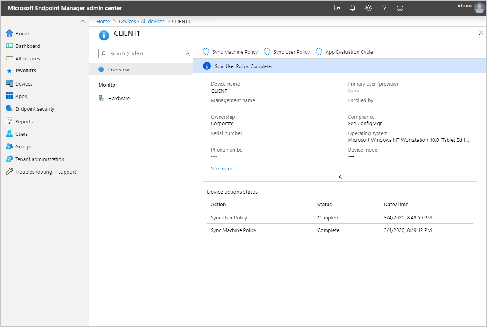

# Troubleshooting tenant attach

*Applies to: Configuration Manager (current branch)*

Starting with Configuration Manager 2002, Configuration Manager clients can be synced to Microsoft Endpoint Manager admin center. Some client actions can be run from the Microsoft Endpoint Manager admin center on the synchronized clients.

The available actions are:
- Sync Machine Policy
- Sync User Policy
- App Evaluation Cycle


[](./media/3555758-device-overview-actions.png#lightbox)
  
When an admin runs an action from Microsoft Endpoint Manager admin center, the notification request is forwarded to Configuration Manager site, and from the site to the client.

## Configuration Manager components

- **SMS_SERVICE_CONNECTOR**: Uses the Gateway Notification Worker for processing the notification from Microsoft Endpoint Manager admin center.
- **SMS_NOTIFICATION_SERVER**: Gets the notification and creates a client notification.
- **BgbAgent**: The client gets task and runs the requested action.

## SMS_SERVICE_CONNECTOR

When an action is initiated from the Microsoft Endpoint Manager admin center, **CMGatewayNotificationWorker.log** processes the request.  

```text
Received new notification. Validating basic notification details...
Validating device action message content...
Authorized to perform client action. TemplateID: RequestMachinePolicy TenantId: a1b2c3a1-b2c3-d4a1-b2c3-d4a1b2c3a1b2 AADUserID:     a1b2c3a1-b2c3-d4a1-b2c3-d4a1b2c3a1b2
Forwarded BGB remote task. TemplateID: 1 TaskGuid: a43dd1b3-a006-4604-b012-5529380b3b6f TaskParam: TargetDeviceIDs: 1  
```
 
1. A notification is received from Microsoft Endpoint Manager admin center.

   ```text
   Received new notification. Validating basic notification details..
   ```

1. User and device actions are validated.

   ```text
   Validating device action message content... 
   Authorized to perform client action. TemplateID: RequestMachinePolicy TenantId: a1b2c3a1-b2c3-d4a1-b2c3-d4a1b2c3a1b2 AADUserID:     a1b2c3a1-b2c3-d4a1-b2c3-d4a1b2c3a1b2
   ```

1. The remote task is forwarded to the SMS_NOTIFICATION_SERVER.

    ```text
   Forwarded BGB remote task. TemplateID: 1 TaskGuid: a43dd1b3-a006-4604-b012-5529380b3b6f TaskParam: TargetDeviceIDs: 1  
    ```


## SMS_NOTIFICATION_SERVER

Once the message is sent to the SMS_NOTIFICATION_SERVER, a task is sent from the management point to the corresponding client. You'll see the below in the **BgbServer.log**, which is on the management point:

```text
Get one push message from database.
Starting to send push task (PushID: 7 TaskID: 8 TaskGUID: A43DD1B3-A006-4604-B012-5529380B3B6F TaskType: 1 TaskParam: ) to 1 clients  with throttling (strategy: 1 param: 42)
```

## BgbAgent

The last step occurs on the client and can be seen in the **CcmNotificationAgent.log**. Once the task is received, it will request scheduler to perform the action. When the action is performed, you'll see a confirmation message:

```text
Receive task from server with pushid=7, taskid=8, taskguid=A43DD1B3-A006-4604-B012-5529380B3B6F, tasktype=1 and taskParam=

Send Task response message <BgbResponseMessage TimeStamp="2020-01-21T15:43:43Z"><PushID>8</PushID><TaskID>9</TaskID><ReturnCode>1</ReturnCode></BgbResponseMessage> successfully.
```

## Common issues

### <a name="bkmk_noauth"></a> Unauthorized to perform client action

If the admin doesn't have the required permissions in Configuration Manager, you'll see an `Unauthorized` response in the **CMGatewayNotificationWorker.log**.

```text
Received new notification. Validating basic notification details..
Validating device action message content...
Unauthorized to perform client action. TemplateID: RequestMachinePolicy TenantId: a1b2c3a1-b2c3-d4a1-b2c3-d4a1b2c3a1b2 AADUserID: 3a1e89e6-e190-4615-9d38-a208b0eb1c78
```  

Ensure the user running the action from the Microsoft Endpoint Manager admin center has the required permissions on Configuration Manager site. For more information, see [Microsoft Endpoint Manager tenant attach prerequisites](device-sync-actions.md#prerequisites).


### <a name="bkmk_aad"></a> The necessary configuration is missing in Azure Active Directory

**Error message:** The necessary configuration is missing in Azure Active Directory. Make sure to attach the Configuration Manager site to your Azure tenant, and assign the proper user role in Azure AD.

**Possible cause:** The user account is likely missing the **Admin User** role for the Configuration Manager Microservice application in Azure AD. Add the role in Azure AD from **Enterprise applications** > **Configuration Manager Microservice** > **Users and groups** > **Add user**. Groups are supported if you have Azure AD premium. Changes to this permission can take up to an hour to take effect.

### <a name="bkmk_noinfo"></a> Unable to get device or collection information

**Error message:** Unable to get device (or collection) information. Make sure Azure AD and AD user discovery are configured and the user is discovered by both. Verify that the user has proper permissions in Configuration Manager.

**Possible causes:** Typically, this error is caused by an issue with the admin account. Below are the most common issues with the administrative user account:

1. Verify the account has **Read** permission for the device's **Collection** in Configuration Manager.
1. Make sure that Configuration Manager has discovered the administrative user account you're using. In the Configuration Manager console, go to the **Assets and Compliance** workspace. Select the **Users** node, and find your user account.

    If your account isn't listed in the **Users** node, check the configuration of the site's [Active Directory User discovery](../core/servers/deploy/configure/about-discovery-methods.md#bkmk_aboutUser).

1. Verify the discovery data. Select your user account. In the ribbon, on the **Home** tab select **Properties**. In the properties window, confirm the following discovery data:

    - **Azure Active Directory Tenant ID**: This value should be a GUID for the Azure AD tenant.
    - **Azure Active Directory User ID**: This value should be a GUID for this account in Azure AD.
    - **User Principal Name**: The format of this value is user@domain. For example, `jqpublic@contoso.com`.

    If the Azure AD properties are empty, check the configuration of the site's [Azure AD user discovery](../core/servers/deploy/configure/about-discovery-methods.md#azureaddisc).

1. Use the same account to sign in to the admin center. The on-premises identity has to be synchronized with and match the cloud identity.


### <a name="bkmk_1603"></a> Unexpected error occurred

**Error message:** Unexpected error occurred

**Possible causes:** Unexpected errors are typically caused by either [service connection point](../core/servers/deploy/configure/about-the-service-connection-point.md), [adminstration service](../develop/adminservice/overview.md), or connectivity issues.

1. Verify the service connection point has connectivity to the cloud using the **CMGatewayNotificationWorker.log**.
1. Verify the administrative service is healthy by reviewing the SMS_REST_PROVIDER component from site component monitoring on the central site.
1. IIS must be installed on provider machine. For more information, see [Prerequisites for the administration service](../develop/adminservice/overview.md#prerequisites)
1. Verify the clock on the service connection point is in sync. If the service connection point's clock is slightly behind, apply [KB4563473 - Update rollup for Configuration Manager version 2002 tenant attach issues](https://support.microsoft.com/help/4563473). Check **AdminService.log** on the provider machine for any errors.

## Known issues


## Next steps

[Enable co-management](../comanage/overview.md) to get additional cloud-powered capabilities like conditional access.
