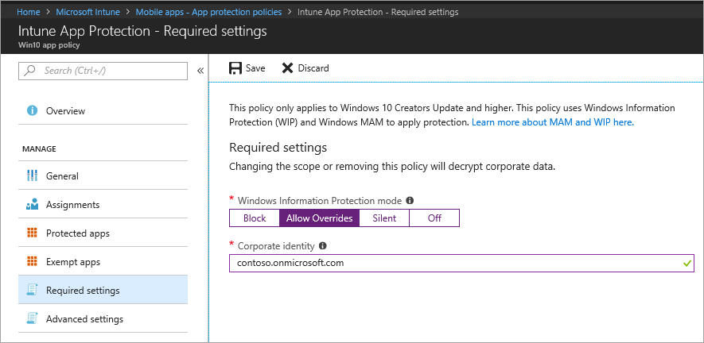

---
# required metadata

title: Windows Information Protection (WIP) app protection policy
titleSuffix: Microsoft Intune
description: Create and deploy Windows Information Protection (WIP) policy with Microsoft Intune
keywords:
author: Erikre
ms.author: erikre
manager: dougeby
ms.date: 04/17/2024
ms.topic: how-to
ms.service: microsoft-intune
ms.subservice: apps
ms.localizationpriority: medium
ms.assetid: 4e3627bd-a9fd-49bc-b95e-9b7532f0ed55

# optional metadata

ROBOTS: NOINDEX,NOFOLLOW
#audience:

ms.reviewer: mattcall
ms.suite: ems
search.appverid: MET150
#ms.tgt_pltfrm:
ms.custom: intune-azure
ms.collection:
- tier2
- M365-identity-device-management
- Windows
- FocusArea_Apps_Protect
---

# Create and deploy Windows Information Protection (WIP) policy with Intune

[!INCLUDE [wip-deprecation](../../includes/wip-deprecation.md)]
<!-- MAXADO-6010051 -->

[!INCLUDE [azure_portal](../includes/azure_portal.md)]

You can use Windows Information Protection (WIP) policies with Windows 10 apps to protect apps without device enrollment.

## Before you begin

You must understand a few concepts when adding a WIP policy:

### List of allowed and exempt apps

- **Protected apps:** These apps are the apps that need to adhere to this policy.

- **Exempt apps:** These apps are exempt from this policy and can access corporate data without restrictions.

### Types of apps

- **Recommended apps:** A pre-populated list of (mostly Microsoft 365 (Office)) apps that allow you to easily import into the policy.
- **Store apps:** You can add any app from the Windows store to the policy.
- **Windows desktop apps:** You can add any traditional Windows desktop apps to the policy (for example, .exe, .dll)

## Prerequisites

You must configure the MAM provider before you can create a WIP policy. Learn more about [how to configure your MAM provider with Intune](app-protection-policies-configure-windows-10.md).  

> [!IMPORTANT]
> WIP does not support multi-identity, only one managed identity can exist at a time. For more information about the capabilities and limitations of WIP, see [Protect your enterprise data using Windows Information Protection (WIP)](/windows/security/information-protection/windows-information-protection/protect-enterprise-data-using-wip).

Additionally, you need to have the following license and update:

- [Microsoft Entra ID P1 or P2](/azure/active-directory/active-directory-get-started-premium) license
- [Windows Creators Update](https://blogs.windows.com/windowsexperience/2017/04/11/how-to-get-the-windows-10-creators-update/#o61bC2PdrHslHG5J.97)

## To add a WIP policy

After you set up Intune in your organization, you can create a WIP-specific policy.

>[!IMPORTANT]
> Windows Information Protection (WIP) policies without enrollment has been deprecated. You can no longer create WIP policies for unenrolled devices.

> [!TIP]  
> For related information about creating WIP policies for Intune, including available settings and how to configure them, see [Create a Windows Information Protection (WIP) policy with MAM using the portal for Microsoft Intune](/windows/security/information-protection/windows-information-protection/create-wip-policy-using-mam-intune-azure) in the Windows Security documentation library. 

1. Sign in to the [Microsoft Intune admin center](https://go.microsoft.com/fwlink/?linkid=2109431).
2. Select **Apps** > **App protection policies** > **Create policy**.
3. Add the following values:
    - **Name:** Type a name (required) for your new policy.
    - **Description:** (Optional) Type a description.
    - **Platform:** Choose **Windows 10** as the supported platform for your WIP policy.
    - **Enrollment state:** Choose **Without enrollment** as the enrollment state for your policy.
4. Choose **Create**. The policy is created and appears in the table on the **App protection policies** pane.

## To add recommended apps to your protected apps list

1. Sign in to the [Microsoft Intune admin center](https://go.microsoft.com/fwlink/?linkid=2109431).
2. Select **Apps** > **App protection policies**.
3. On the **App protection policies** pane, choose the policy you want to modify. The **Intune App Protection** pane is displayed.
4. Choose **Protected apps** from the **Intune App Protection** pane. The **Protected apps** pane opens showing you all apps that are already included in the list for this app protection policy.
5. Select **Add apps**. The **Add apps** information shows you a filtered list of apps. The list at the top of the pane allows you to change the list filter.
6. Select each app that you want to allow access your corporate data.
7. Click **OK**. The **Protected apps** pane is updated showing all selected apps.
8. Click **Save**.

## Add a Store app to your protected apps list

**To add a Store app**

1. Sign in to the [Microsoft Intune admin center](https://go.microsoft.com/fwlink/?linkid=2109431).
2. Select **Apps** > **App protection policies**.
3. On the **App protection policies** pane, choose the policy you want to modify. The **Intune App Protection** pane is displayed.
4. Choose **Protected apps** from the **Intune App Protection** pane. The **Protected apps** pane opens showing you all apps that are already included in the list for this app protection policy.
5. Select **Add apps**. The **Add apps** information shows you a filtered list of apps. The list at the top of the pane allows you to change the list filter.
6. From the list, select **Store apps**.
7. Enter values for **Name**, **Publisher**, **Product Name**, and **Action**. Be sure to set the **Action** value to **Allow**, so that the app will have access to your corporate data.
9. Click **OK**. The **Protected apps** pane is updated showing all selected apps.
10. Click **Save**.

## Add a desktop app to your protected apps list

**To add a desktop app**
1. Sign in to the [Microsoft Intune admin center](https://go.microsoft.com/fwlink/?linkid=2109431).
2. Select **Apps** > **App protection policies**.
3. On the **App protection policies** pane, choose the policy you want to modify. The **Intune App Protection** pane is displayed.
4. Choose **Protected apps** from the **Intune App Protection** pane. The **Protected apps** pane opens showing you all apps that are already included in the list for this app protection policy.
5. Select **Add apps**. The **Add apps** information shows you a filtered list of apps. The list at the top of the pane allows you to change the list filter.
6. From the list, select **Desktop apps**.
7. Enter values for **Name**, **Publisher**, **Product Name**, **File**, **Min Version**, **Max Version**, and **Action**. Be sure to set the **Action** value to **Allow**, so that the app will have access to your corporate data.
9. Click **OK**. The **Protected apps** pane is updated showing all selected apps.
10. Click **Save**.

## WIP Learning
After you add the apps you want to protect with WIP, you need to apply a protection mode by using **WIP Learning**.

### Before you begin

WIP Learning is a report that allows you to monitor your WIP-enabled apps and WIP-unknown apps. The unknown apps are the ones not deployed by your organization's IT department. You can export these apps from the report and add them to your WIP policies to avoid productivity disruption before they enforce WIP in "Block" mode.

<!-- 1631908 -->
In addition to viewing information about WIP-enabled apps, you can view a summary of the devices that have shared work data with websites. With this information, you can determine which websites should be added to group and user WIP policies. The summary shows which website URLs are accessed by WIP-enabled apps.

When working with WIP-enabled apps and WIP-unknown apps, we recommend that you start with **Silent** or **Allow Overrides** while verifying with a small group that you have the right apps on your protected apps list. After you're done, you can change to your final enforcement policy, **Block**.

### What are the protection modes?

#### Block
WIP looks for inappropriate data sharing practices and stops the user from completing the action. Blocked actions can include sharing info across non-corporate-protected apps, and sharing corporate data between other people and devices outside of your organization.

#### Allow Overrides
WIP looks for inappropriate data sharing, warning users when they do something deemed potentially unsafe. However, this mode lets the user override the policy and share the data, logging the action to your audit log.

#### Silent
WIP runs silently, logging inappropriate data sharing, without blocking anything that would have been prompted for employee interaction while in Allow Override mode. Unallowed actions, like apps inappropriately trying to access a network resource or WIP-protected data, are still stopped.

#### Off (not recommended)
WIP is turned off and doesn't help to protect or audit your data.

After you turn off WIP, an attempt is made to decrypt any WIP-tagged files on the locally attached drives. Note that previous decryption and policy info isn't automatically reapplied if you turn WIP protection back on.

### Add a protection mode

1. From the **App policy** pane, choose the name of your policy, then choose **Required settings**.

    

1. Select a setting and then choose **Save**.

## Allow Windows Search Indexer to search encrypted items
Allows or disallows the indexing of items. This switch is for the Windows Search Indexer, which controls whether it indexes items that are encrypted, such as the Windows Information Protection (WIP) protected files.

This app protection policy option is in the **Advanced settings** of the Windows Information Protection policy. The app protection policy must be set to the *Windows 10* platform and the app policy **Enrollment state** must be set to **With enrollment**.

When the policy is enabled, WIP protected items are indexed and the metadata about them are stored in an unencrypted location. The metadata includes things like file path and date modified.

When the policy is disabled, the WIP protected items are not indexed and do not show up in the results in Cortana or file explorer. There may also be a performance impact on photos and Groove apps if there are many WIP protected media files on the device.

[!INCLUDE [cortana-app-deprecation](../includes/cortana-app-deprecation.md)]

## Add encrypted file extensions

In addition to setting the **Allow Windows Search Indexer to search encrypted items** option, you can specify a list of file extensions. Files with these extensions are encrypted when copying from a Server Message Block (SMB) share within the corporate boundary as defined in the network location list. When this policy is not specified, the existing auto-encryption behavior is applied. When this policy is configured, only files with the extensions in the list will be encrypted.

## Deploy your WIP app protection policy

> [!IMPORTANT]
> This information applies for WIP without device enrollment.

After you created your WIP app protection policy, you need to deploy it to your organization using MAM.

1. On the **App policy** pane, choose your newly created app protection policy, choose **User groups** > **Add user group**.

    A list of user groups, made up of all the security groups in your Microsoft Entra ID, opens in the **Add user group** pane.

2. Choose the group you want your policy to apply to, then choose **Select** to deploy the policy.

## Next steps

Learn more about Windows Information Protection, see [Protect your enterprise data using Windows Information Protection (WIP)](/windows/security/information-protection/windows-information-protection/protect-enterprise-data-using-wip).
