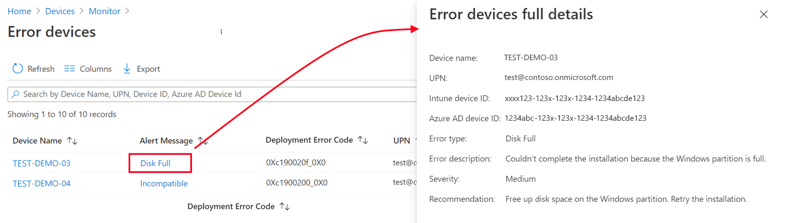

---
# required metadata

title: Use Windows Update for Business reports for Windows Updates in Microsoft Intune
titleSuffix: Microsoft Intune
description: Use Windows Update for Business reports to view data for Windows Updates you deploy with Intune.
keywords:
author: Smritib17
ms.author: smbhardwaj
manager: dougeby
ms.date: 03/04/2025
ms.topic: how-to
ms.service: microsoft-intune
ms.subservice: protect
ms.localizationpriority: high

# optional metadata

#ROBOTS:
#audience:

ms.reviewer: zadvor
ms.suite: ems
search.appverid: MET150
#ms.tgt_pltfrm:
#ms.custom:
ms.collection:
- tier1
- M365-identity-device-management
- highpri
- highseo
- sub-updates
---

# Windows Update reports for Microsoft Intune

With Intune, you can deploy updates to Windows 10/11 devices by using policies for:

- [Update rings for Windows 10 and later](../protect/windows-10-update-rings.md)
- [Feature updates for Windows 10 and later](../protect/windows-10-feature-updates.md)
- [Windows Driver updates for Windows 10 and later](../protect/windows-driver-updates-overview.md)

Reports for these policy types are available to help you monitor and troubleshoot update deployments. To support reporting, you must configure [Data collection settings](#configuring-for-client-data-reporting).  

Intune supports the following report options:

- **Reports in Intune**:
  - **Windows 10 update rings** – Use a [built-in report](#reports-for-update-rings-for-windows-10-and-later-policy) that's ready by default when you deploy update rings to your devices.
  - **Windows 10 feature updates** – Use [two built-in reports](#reports-for-windows-10-and-later-feature-updates-policy) that work together to gain a deep picture of update status and issues. These reports require you to configure data collection from devices before the reports can display data about feature updates.
  - **Windows Driver updates** – Use the [built-in reports](#reports-for-windows-driver-updates-policy) to understand which driver updates are applicable to your devices and which of those updates have been approved, installed, or paused.
  - **Windows update distribution** – Use the [three built-in reports](#windows-update-distribution-report) to understand the number of devices that are on each quality update level and the percentage coverage for each update across devices managed by Intune (including co-managed devices). The three distinct organizational reports function sequentially to provide insights on devices and their corresponding Windows update versions.

- **Windows Update for Business reports**:

  [Use Windows Update for Business reports with Intune](#use-windows-update-for-business-reports) to monitor Windows update rollouts. Windows Update for Business reports is a free service built on Azure Monitor and Log Analytics.

For more information, see [Monitor Windows Updates with Windows Update for Business reports](/windows/deployment/update/wufb-reports-overview) in the Windows documentation.

## Configuring for client data reporting

This method of configuring data collection using Windows diagnostic data in Intune is shared across all the reports, including drivers, feature updates, and expedite updates.

To support reporting, you must configure the following data collection settings:

- Enable [Windows diagnostic data](/windows/privacy/configure-windows-diagnostic-data-in-your-organization) collection from devices at a level of [*Required*](/windows/privacy/configure-windows-diagnostic-data-in-your-organization#diagnostic-data-settings) or higher.
- At the Tenant level, set [Enable features that require Windows diagnostic data in processor configuration](../protect/data-enable-windows-data.md#windows-data) to **On**. This setting can be configured in the [Microsoft Intune admin center](https://go.microsoft.com/fwlink/?linkid=2109431) at **Tenant administration** > **Connectors and tokens** > **Windows data**.

>[!NOTE]
> The [Windows update distribution reports](#windows-update-distribution-report) don’t require any additional configuration for client data reporting.

## Reports for Update rings for Windows 10 and later policy

Intune offers integrated report views for the Windows update ring policies you deploy. These views display details about the update ring deployment and status. To access reports, in the [Intune admin center](https://go.microsoft.com/fwlink/?linkid=2109431) go to **Devices** > **By platform** > **Windows** > **Manage updates** > **Windows 10 and later updates** > **Update rings** tab > and select an update ring policy.  Intune displays details similar to the following for the selected policy:

:::image type="content" source="./media/windows-10-update-rings/default-policy-view.png" alt-text="Screen capture of the default view for Update rings policy." lightbox="./media/windows-10-update-rings/default-policy-view.png":::

> [!TIP]
>
> For details about the policy actions at the top of the policy view, like *Delete*, *Pause*, and *Extend*, see [Manage your Windows Update rings](../protect/windows-10-update-rings.md#manage-your-windows-update-rings) in the *Update rings for Windows 10 and later policy in Intune* article.

On the policy page view:

- **Device and user check-in status**: The default report view for this policy. This default view includes a high-level bar chart that displays a count of devices reporting four status values for this policy, and a color bar that visually represents the percentage of devices reporting each status by color. This view displays the following four status results for the policy:
  - Succeeded
  - Error
  - Conflict
  - Not applicable

- **View report**: This button opens a more detailed report view for *Device and user check-in status*. The detailed report view includes a chart and color bar similar to that from the preceding high-level view, but reports one the additional status of **In progress**.

  This view also includes device specific details that include:  
  - Device name
  - Logged in user
  - Check-in status
  - Last report modification time
  
  :::image type="content" source="./media/windows-update-reports/report-view-details.png" alt-text="Screen capture that shows details available from the View report action.":::

  From this report view, you can select a device to drill in to view the list of the settings in the policy, and the status of the selected device for each of those settings. Additional drill-in is available by selecting a setting to open the *Setting details*. The *Setting details* display the name of the setting, the devices status (State) for that setting, and a list of profiles that manage the setting and that are assigned to the device. This is useful to help identify the source of a settings conflict.

- **Two additional report tiles**: You can select the tiles for the following reports to view additional details:

  - **Device assignment status** – This report shows all the devices that are targeted by the policy, including devices in a pending policy assignment state.

    For this report, you can select one or more status details you are interested in, and then select *Generate report* to update the view with only that information. In this following image, we have generated a report that displays only the devices that were successfully assigned this policy:
  
    :::image type="content" source="./media/windows-update-reports/successful-assignment-view.png" alt-text="Image of the results of the Assignment status report.":::
  
    This report supports drilling in to view the list of settings, with subsequent drill-in as seen in for the full report view available from the *View report* button.

  - **Per setting status** – View the configuration status of each setting for this policy across all devices and users. This view present a simple view of each setting in the policy, and the count of assigned devices that have success, error, or conflict. This report view doesn't support drilling in for additional detail.

## Reports for Windows 10 and later feature updates policy

Intune offers integrated reports to view detailed Windows update deployment status for devices using Feature updates for Windows 10 and later policies. To use reports for this feature, you must first configure prerequisites and policies that support data collection from devices.

The data in the Intune reports for Feature updates for Windows 10 and later policy is used only for these reports and doesn't surface in other Intune reports.

- [Windows 10 feature updates (Organizational)](#use-the-windows-10-feature-updates-organizational-report)- This report provides an overall view of compliance for devices on a per-policy basis.

- [Feature update failures report (Operational)](#use-the-feature-update-failures-operational-report) – This report provides details on Alerts – errors, warnings, information, and recommendations – on a per-policy basis to help troubleshoot and optimize your devices.

Before you can use the feature updates policy reports, you must configure prerequisites for the report.

### Prerequisites

- **Data collection**:

  Before a device can send the reporting data that's used in the Windows 10 feature updates report for Intune, you must [Configure data collection](#configuring-for-client-data-reporting):

  - Service-based data is collected for all feature update versions and doesn't require you to configure data collection.
  - Client-based data is collected from devices only after data collection is configured.
  
  Service and client-based data is described in [Use the Windows 10 feature updates (Organizational) report](#use-the-windows-10-feature-updates-organizational-report) later in this article.

- **Devices**:

  Devices must:

  - Meet the [prerequisites for Windows 10 and later feature updates policy](../protect/Windows-10-feature-updates.md#prerequisites) as documented in **Feature updates for Windows 10 and later policy in Intune**.
  - Be Microsoft Entra joined, or Microsoft Entra hybrid joined to support submitting of data for reporting.
  - Run Windows 10 1903 or later, or Windows 11. Although Windows 10 and later feature updates policy supports earlier versions of Windows, earlier versions don't support reporting of the data that Intune uses for the feature updates reports.

<!-- ### Configure data collection

The data that powers Intune's Windows feature updates reports isn't collected by the typical device sync with Intune. Instead, it's collected through the *[Windows health monitoring](../configuration/windows-health-monitoring.md)* device configuration policy, which uses the Windows 10/11 and Windows Server Connected User Experiences and Telemetry component (DiagTrack) to collect the data from Intune-managed devices. To enable use of this data in the reports, you must configure devices to send Windows Updates data.

#### Enable data collection

To Configure this setting for your devices, [Create a profile](../configuration/device-profile-create.md#create-the-profile) with the following information:

- **Platform**: Select **Windows 10 and later**.
- **Profile**: Select **Windows health monitoring**.
- **Name**: Enter a descriptive name for the profile, like **Intune data collection policy**.
- **Description**: Enter a description for the profile. This setting is optional, but recommended.
- In **Configuration Settings**:
  - **Health Monitoring**: Select *Enable* to collect event information from supported Windows 10/11 devices.
  - **Scope**: Select *Windows Updates*.

- Use the [Scope tags](../configuration/device-profile-create.md#scope-tags) and [Applicability rules](../configuration/device-profile-create.md#applicability-rules) to filter the profile to specific IT groups or devices in a group that meet a specific criteria. Only Windows 10 version 1903 and later and Windows 11 are supported for these reports.

  > [!div class="mx-imgBorder"]
  > 

When you complete the creation of the Windows health monitoring profile, the profile deploys to the assigned groups, and configuration of data collection is complete.

It can take up to 24 hours after setting up Windows health monitoring with Windows updates before the policy is applied.

> [!TIP]
> If you use [Endpoint Analytics](../../analytics/overview.md), you can modify the existing configuration profile. The same policy is used to collect data for Endpoint Analytics.
This section is now obsolete -->

### About reporting data latency

The data for these reports is generated at different times, which depend on the type of data:

- **Service-based data from Windows Update** – This data typically arrives in less than an hour after an event happens in the service. Events include Alerts for a device that can't register with Windows Update (which is viewable in the *Feature update failures report*), to status updates about when Windows Update began offering an update to clients. This data is available without configuring data collection.

- **Client-based data from Intune devices that are configured to send data to Intune** – This data is processed in batches and refreshes every eight hours, but is only available after you [configure data collection](#configuring-for-client-data-reporting). The data contains information like when a client doesn't have enough disk space to install an update. This data is also used in the Windows 10 feature updates organizational report to show the various installation steps a device moves through when installing feature updates.

### Use the Windows 10 feature updates (Organizational) report

The **Windows 10 feature updates** report provides an overview of compliance for devices you target with a [Windows feature updates](../protect/windows-10-feature-updates.md) policy.

> [!IMPORTANT]
> Before this report can show data, you must [configure data collection](#configuring-for-client-data-reporting) for the Windows feature updates reports.

This report provides you update installation status that's based on the update state from device and device-specific update details. The data in this report is timely, calls out the device name and state, and other update-related details. This report also supports filtering, searching, paging, and sorting.

To use the report:

1. Sign in to the [Microsoft Intune admin center](https://go.microsoft.com/fwlink/?linkid=2109431).

2. To view a summary report across all Windows 10 and later feature updates policies:

   - In the admin center, go to **Reports** > **Windows updates**. The default view displays the **Summary** tab:
     > [!div class="mx-imgBorder"]
     > 

3. To open the **Windows 10 feature updates** report and view device details for a specific feature updates profile:

   - In the admin center, go to **Reports** > **Windows updates** > select the **Reports** tab > select **Windows Feature Update Report**.

   - Select on **Select a feature update profile**, select a profile, and then **Generate report**.

   - Select **Update status** and **Ownership** to refine the report.
     > [!div class="mx-imgBorder"]
     > 
  
   The following list identifies the columns that are available in the view:
   - **Devices** – The name of the device.
   - **UPN** – Intune user identifier (email).
   - **Intune Device ID** – Intune device identifier.
   - **Microsoft Entra Device ID** – Microsoft Entra identifier for device.
   - **Last Event Time** – The last time there was new data, or something happened for the device and update.
   - **Update State** – The state of the update for the device. Initial state data is from the service-side, which is the status of the update in the system before it begins to install on the device. When client-side data is available, client-side data is shown, replacing the server-side data.
   - **Update Substate** – A low-level detailed version of the Update State.
   - **Update Aggregated Status** – A high-level summary of the Update State, like *In progress* or *Error*.
   - **Alert Type** – When applicable, Alert Type displays the most recent alert message.
   - **Alert Details** – *This column isn't in use.*
   - **Last Scan Time** – The last time this device ran a scan for Windows Update.
   - **Target Version** – This column is useful in policy reports as it shows the friendly name of the update being targeted on the device. This field can be particularly useful when the [win10 sxs] checkbox is selected to identify when and which devices were determined to be ineligible for the update and are now being targeted with the Win10 update.
   
   The following information applies to **Update State** and **Update Substate**:

   - **Service-side data**:
     - **Pending**:
       - **Validation** – The update can't be offered to the device because of a validation issue with the device and Windows Update.
       - **Scheduled** – The update isn't ready to be offered to the device but is scheduled for offering at a later date.
     - **On hold**:
       - **Admin paused** – The update is on hold because the Deployment being paused by an explicit Administrator action.
       - **ServicePaused** – The update is on hold because of an automatic action by Windows Update.
     - **Canceled**:
       - **Admin Cancelled** – The update offer was canceled by explicit Administrator action.
       - **Service Cancelled** – The update was canceled by Windows Update for one of the following reasons:  
          - The *end of service* for the selected content was reached and it’s no longer offered by Windows Update. For example, the device might have been added to a deployment after the content’s availability expired, or the content reached its end of service date before it could install on the device.
          - The deployment content has been superseded for the device. This can happen when the device is targeted by another deployment that deploys newer content. For example, one deployment targets the Windows 10 device to install version 2004 and a second deployment targets that same device with version 21H1. In this event, 2004 is superseded by the 21H1 deployment and Windows Update cancels the 2004 deployment to the device.
       - **Removed from Deployment** – The update offer was canceled because it was removed from the Deployment by explicit Administrator action.
       - **Not Supported** - The update was canceled by Windows Update as the device cannot be found in Azure Entra and is an invalid device. This can happen if the device is not Azure Entra joined or does not have a valid Device ID, Global Device ID.
     - **Offering**:
       - **OfferReady** – The update is currently being offered to the device by Windows Update.

   - **Client-side data**:
     - **On Hold**:
       - **Deferred** – Windows Update for Business (WUfB) policies are causing the device to defer the update being offered.
     - **Offering**:
       - **Offer Received** – The device scanned against Windows Update (WU) and identifies that the update is applicable but hasn't begun to download it.
     - **Installing**:
       - **Download Start** – The download process has begun.
       - **Download Complete** – The download process has completed.
       - **Install Start** – The pre-restart install process has started.
       - **Install Complete** – The pre-restart install process has finished. If the update doesn't require a restart, the update process ends here.
       - **Restart Required** – A restart is required to finish update.
       - **Restart Initiated** – The device has gone into restart.
       - **Restart Complete** – The device has come back from restart.
     - **Installed**:
       - **Update Installed** – The update successfully installed.
     - **Uninstalling**:
       - **Uninstall** – The device is actively uninstalling the update.
       - **Rollback** – A rollback has been initiated to a previous update because of a serious issue during installation.
       - **Update Uninstalled** – The update successfully uninstalled.
       - **Rollback complete** – A rollback has completed.
     - **Cancelled**:
       - **User Cancelled** – A user canceled the update.
       - **Device Cancelled** – The device canceled the update for a user. This action is usually because the update no longer applies.

   - **Other**:
     - **Needs attention**: The device has some issue and needs attention.

### Use the Feature update failures (Operational) report

The **Feature update failures** operational report provides details for devices that you target with a [Windows 10 and later feature updates](../protect/windows-10-feature-updates.md) policy, and that have attempted to install an update. Devices in this report might have an Alert that prevents the device from completing installation of the update.

> [!IMPORTANT]  
> Before this report can show data, you must [configure data collection](#configuring-for-client-data-reporting) for the Windows feature updates reports.

This report provides insights to update installation status, including the number of devices with errors. It also supports drilling in for more details to help you troubleshoot issues with the installation. This report supports filtering, searching, paging, and sorting.

To use the report:

1. Sign in to the [Microsoft Intune admin center](https://go.microsoft.com/fwlink/?linkid=2109431).

2. Select **Devices** > **Monitor**, and then below *Software updates* select **Feature update failures**.

   - The initial view displays a per-profile summary of how many devices have alerts for each of your profiles with the version of Windows that the profile targets:

     > [!div class="mx-imgBorder"]
     > 

   - Selecting a profile opens a dedicated view that contains all active Alerts for that profile.

   - While viewing the active alerts for the profile:

     - Select an *Alert Message* to open a pane that displays more details for that alert:
       > [!div class="mx-imgBorder"]
       > 

     - Select the device name to open the Device page:
       > [!div class="mx-imgBorder"]
       > 

The following list identifies Alert Messages, and suggested remediation actions:

|Alert Message |Description  |Recommendation |
|----|----|----|
| **CancelledByUser** | User canceled the update. | Retry the installation. |
| **DamagedMedia**  | The update file or the hard drive is damaged. | Run **Chkdsk /F** on the device with administrator privileges, then retry the update. |
| **DeploymentConflict** | Device is in more than one deployment of the same update type. Only the first deployment assigned is effective. | Remove the device from any deployments that shouldn't apply. |
| **DeviceRegistrationInvalidAzureADDeviceId**|The device isn't able to register or authenticate properly with Windows Update  because of an invalid Microsoft Entra Device ID. | Check that the device is joined to the Microsoft Entra tenant making the request. |
| **DeviceRegistrationInvalidGlobalDeviceId** | The device isn't able to register or authenticate properly with Windows Update  because of an invalid Global Device ID. | The Microsoft Account Sign-In Assistant (MSA) Service might be disabled, preventing Global Device ID assignment. Check that the MSA Service is running or able to run on the device. |
| **DeviceRegistrationIssue** | The device isn't able to register or authenticate properly with Windows Update. | Check that the device registration information is correct and the device can connect. |
| **DeviceRegistrationNoTrustType** | The device isn't able to register or authenticate properly with Windows Update because it can't establish Trust. | Check that the device is joined in Microsoft Entra ID using your account. If the issue persists, the device might need to be unenrolled from Intune first. |
| **DiskFull**  | The installation couldn't complete because the Windows partition is full. | Free up disk space on the Windows partition. Retry the installation. |
| **DownloadCancelled** | Windows Update couldn't download the update because the update server stopped the connection. | Make sure your network is working and retry the download. If it still fails, check your WSUS server or contact support. |
| **DownloadConnectionIssue**| Windows Update couldn't connect to the update server and the update couldn't download. | Make sure your network is working and retry the download. If it still fails, contact support. |
| **DownloadCredentialsIssue**| Windows Update couldn't download the file because the Background Intelligent Transfer Service (BITS) couldn't connect to the internet. A proxy server or firewall on your network might require credentials. | Retry the download. If it fails again, review your network configuration to make sure that this computer can access the internet. If you need help, contact support. |
| **DownloadIssue**  | There was an issue downloading the update. | Retry the installation. |
| **DownloadIssueServiceDisabled** | There was a problem with the Background Intelligent Transfer Service (BITS). The BITS service or a service it depends on might be disabled. | In the Services administration tool, make sure that the Background Intelligent Transfer Service is enabled. If the service isn't running, try starting it manually. If it won't start, check the event log for errors. |
| **DownloadTimeout** | A timeout occurred while Windows tried to contact the update service or the server containing the update's payload. | Retry the download. If it doesn't succeed, make sure that the update service and payload servers are running normally and that there are no network connectivity issues. |
| **EndOfService**  | Device is on a version of Windows that has passed its end of service date. | Update device to a version that is currently supported. |
| **EndOfServiceApproaching**| Device is on a version of Windows that is approaching its end of service date. | Update the device to a version that has a longer remaining servicing timeline. |
| **FailureResponseThreshold**| The failure response threshold setting was met for a deployment to which the device belongs. | Consider pausing the deployment and assessing for issues. |
| **FailureResponseThresholdPause** | A deployment to which the device belongs was paused because of its failure response threshold being met. | Review devices that encountered issues. |
| **FileNotFound**  | The downloaded update files can't be found. The Disk Cleanup utility or a non-Microsoft software cleaning tool might have removed the files during cleanup. | Download the update again, and then retry the installation. |
| **Incompatible**  | The system doesn't meet the minimum requirements to install the update. | Review the *ScanResult.xml* file for **Block Type=Hard**. |
| **IncompatibleArchitecture**| This update is for a different CPU architecture. | Make sure the target operating system architecture matches the host operating system architecture. |
| **IncompatibleServicingChannel** | Device is in a servicing channel that is incompatible with a deployment to which the device belongs. | Configure the device's servicing channel to a retail (Generally Available) update channel. |
| **InstallAccessDenied** | Installer doesn't have permission to access or replace a file. The installer might have tried to replace a file that an antivirus, antimalware, or a backup program is currently scanning. | Retry the installation. |
| **InstallCancelled** | The installation was canceled. | Retry the installation. |
| **InstallFileLocked** | Installer couldn't access a file that is already in use. The installer might have tried to replace a file that an antivirus, antimalware, or backup program is currently scanning. | Check the files under the *%SystemDrive%\$Windows.~bt* directory. Retry the installation. |
| **InstallIssue**  | There was an issue installing the update. | Run **dism /online /cleanup-image /restorehealth** on the device with administrator privileges, then retry the update. If the commands fail, a reinstall of Windows might be required. |
| **InstallIssueRedirection**| A known folder that doesn't support redirection to another drive might have been redirected to another drive. | Report this issue to Microsoft if this error is encountered more than a once. |
| **InstallMissingInfo** | Windows Update doesn't have information it needs about the update to finish the installation. | Another update might have replaced the one you're trying to install. Check the update, and then try reinstalling it. |
| **InstallOutOfMemory** | The installation couldn't complete because Windows ran out of memory. | Restart Windows, then try the installation again. If it still fails, allocate more memory to the virtual machine, or increase the size of the virtual memory pagefiles. |
| **InstallSetupError** | Windows Setup encountered an error while installing. | Check that the BIOS and drivers are up to date. Retry the download. |
| **InstallSystemError** | A system  occurred while installing. | Check that the BIOS and drivers are up to date. Retry the download. |
| **PolicyConflict**  | There are client policies (MDM, GP) that conflict with Windows Update  settings. | Check that the client policies configured on the device don't conflict with deployment settings. |
| **PolicyConflictDeferral** | The Deferral Policy configured on the device is preventing the update from installing. | Check that the client policies configured on the device don't conflict with deployment settings. |
| **PolicyConflictPause** | Updates are paused on the device, preventing the update from installing. | Check that the client policies configured on the device don't conflict with deployment settings. |
| **PostRestartIssue** | Windows Update couldn't determine the results of installing the update. The error is usually false and the update probably succeeded. | If the update you're trying to install isn't available, no action is required. If the update is still available, retry the installation. |
| **RollbackInitiated** | A rollback was started on this device, indicating a catastrophic issue occurred during the Windows Setup install process. | Run the [Setup Diagnostics Tool](/windows/deployment/upgrade/setupdiag) on the Device. Don't retry the installation until the impact is understood. |
| **SafeguardHold**  | Update can't install because of a known [Safeguard Hold](/windows/deployment/update/update-compliance-feature-update-status#safeguard-holds).  | View the *Deployment Error Code* column of the report to see the ID of the safeguard hold. Open the Windows release health dashboard at [https://aka.ms/WindowsReleaseHealth](/windows/release-health/) to view information about the active holds, including known issues with the update. |
| **UnexpectedShutdown** | The installation was stopped because a Windows shutdown or restart was in progress. | Ensure the device remains on during Windows installation. |
| **VersionMismatch** | Device is on a version of Windows that wasn't intended by Windows Update. | Confirm whether the device is on the intended version. |
| **WindowsRepairRequired** | The current version of Windows needs to be repaired before it can be updated. | Run the Startup Repair Tool on this device. |
| **WUBusy**   | Windows Update can't do this task because it's busy. | Restart Windows. Retry the installation. |
| **WUComponentMissing** | Windows Update might be missing a component or the update file might be damaged. | Run **dism /online /cleanup-image /restorehealth** on the device with administrator privileges, and then retry the update. If the commands fail, a reinstall of Windows might be required. |
| **WUDamaged**  | Windows Update or the update file might be damaged. | Run **dism /online /cleanup-image /restorehealth** on the device with administrator privileges, and then retry the update. If the commands fail, a reinstall of Windows might be required. |
| **WUDecryptionIssue** | Windows Update couldn't decrypt the encrypted update file because it couldn't find the proper key. | Retry the installation. |
| **WUDiskError**  | Windows Update encountered an error while reading or writing to the system drive. | Run the Windows Update Troubleshooter on the device. Retry the installation. |
| **WUIssue**  | Windows Update couldn't understand the metadata provided by the update service. This error usually indicates a problem with the update. | Contact support. |

## Reports for Windows Driver updates policy

Intune offers integrated reports to view detailed status for Windows driver updates for devices assigned to Windows Driver update policies. To use these reports, you must first configure the prerequisites and policies that support data collection from devices. These reports are applicable to Windows 10 and Windows 11.

The data in the Intune reports for Windows Driver update policies is used only for these reports and doesn't appear in other Intune reports. The following reports are available:

- [Windows Driver updates summary](#windows-driver-updates-summary)
- [Windows Driver updates report](#windows-driver-updates-report)
- [Windows Driver update failures](#windows-driver-update-failures)

### Prerequisites for driver updates reports

#### Devices and data collection

To support reporting on all status and events for driver updates, you must configure the following data collection settings:

- Enable [Windows diagnostic data](/windows/privacy/configure-windows-diagnostic-data-in-your-organization) collection from devices at a level of [*Required*](/windows/privacy/configure-windows-diagnostic-data-in-your-organization#diagnostic-data-settings) or higher.
- At the Tenant level, set [Enable features that require Windows diagnostic data in processor configuration](../protect/data-enable-windows-data.md#windows-data) to **On**. This setting can be configured in the [Microsoft Intune admin center](https://go.microsoft.com/fwlink/?linkid=2109431) at **Tenant administration** > **Connectors and tokens** > **Windows data**.

#### User permissions to use reports

To view these reports, users must be assigned an Intune role with the **Managed devices** > **View reports** permission. This permission is included in the following built-in roles:

- Endpoint Security Manager
- Read Only Operator
- Help Desk Operator

### Windows Driver updates summary

On the Summary tab of the Windows Updates node of Reports, you can view summary details about device success or failure for installing updates from device update policies. To find this report, navigate to **Reports** > **Windows Updates** > **Summary** tab and scroll down until you find the **Windows Driver updates**.

The following screen capture displays a summary of four policies, each assigned to a single device.

:::image type="content" source="./media/windows-update-reports/report-driver-updates-summary.png" alt-text="Screen capture of the Windows Driver Updates summary page." lightbox="./media/windows-update-reports/report-driver-updates-summary.png":::

This report allows you to view the status of driver updates for each policy (*Profile* column). It displays the number of devices that are up-to-date (*Success*), failed (*Error*), paused (*Paused*), etc. for the driver updates in that policy. However, each device is only represented once in a single status column, based on the worst status across all of the updates that apply to that device.

Intune ranks the following statuses in order of priority, from best (Success) to worst (NeedsReview):

- **Success** – All applicable driver updates have installed successfully.
- **In progress** – At least one update remains in progress, and none have been paused, failed, or worse.
- **Paused** – At least one update has been paused, but none have failed to install, been cancelled, or are pending review.
- **Error** – At least one update failed to install, but none are cancelled or pending review.
- **Cancelled** – At least one update has been declined, but none are pending review.
- **NeedsReview** – One or more updates are new to the policy and pending review to approve or decline.

For example: A policy might have three applicable driver updates for an assigned device. If one of the three fails to install on that device while the other two updates install successfully, the device is identified by adding one to the *Error* column. Once all three updates install successfully, the device is represented by adding one to the *Success* column and reducing the count of the *Error* column by one.

This report doesn’t support drilling in for more details about devices, driver updates, or policy details.

### Windows Driver updates report

The *Windows Driver Updates report* allows you to select a single driver update and view details about the policies in which it's applicable for a device. This report provides information about the driver from all your driver update policies, offering a different perspective than other reports, which only provide details specific to a single policy.

To find this report, in the admin center go to **Reports** > **Windows updates** > **Reports** tab, and then select the **Windows Driver Update Report** tile.

In the following screen capture, the report shows details for the driver update *Microsoft – APPLIANCES – 1.0.0.1*.

:::image type="content" source="./media/windows-update-reports/report-driver-updates-drivers.png" alt-text="Screen capture of the Windows 10 and later Driver updates report." lightbox="./media/windows-update-reports/report-driver-updates-drivers.png":::

To change the focus of this report to a different driver:

1. On the **Windows 10 and later Driver updates** view, select **Select a driver update** to open the **Driver updates** pane on the right.

2. The *Driver updates* pane displays a list of updates that are approved and applicable for at least one device from across all your driver update policies.

3. On the Driver updates pane, select a driver, and then **OK** to return to the Windows 10 and later Driver updates report view that now shows information for the driver you selected, and select **Generate again** to update the report.

In the following screen capture, only four drivers remain applicable to devices with driver updates policy, and those four updates are different versions of the same driver update.

:::image type="content" source="./media/windows-update-reports/report-driver-updates-pane.png" alt-text="Screen capture of Driver Updates pane of a driver updates policy." lightbox="./media/windows-update-reports/report-driver-updates-pane.png":::

**Column details**:

While most of the column details should be clear, the following warrant some explanation:

- **Update State** – This column presents the most recent status of the selected driver update, as reported by each device to which it applies. Further details can be found in the *Update Substrate* column.

  - **Cancelled** – The update was paused in the policy that applies to this device.
  - **Offering** – The update is approved, but the device hasn't yet installed it.
  - **Installed** – The update installed successfully.
  - **Needs attention** – There's an installation issue for the update on this device.

- **Policy** – This column identifies the name of the policy in which the update was approved.

- **Last Scan Time** – This column provides insight into when a device last checked for updates. This can help explain why approved updates haven't installed. For instance, if the last scan time is several weeks old, it may indicate that the device is either offline or unable to connect to scan for updates.

**Data retention**:

As devices across all your updates policies install the latest versions of a driver update, older driver update versions that are no longer needed by any device drops off the driver updates list. However, this isn't necessarily an immediate event. Reporting data for driver updates remains available until the end of a data retention period is reached. This period is six months since the last time an event for the update is received.

- If the update is approved and all applicable devices have installed the update, then six months after the last device updates is status, the update is removed from reporting details.
- Similarly, if an update is paused and shows no activity for the retention period, that update is also dropped from reporting details after six months. After an updates data ages out, if a paused update that remains applicable to a device is reapproved, subsequent status for that update begins to appear in reports. Previous data that aged out of reports won’t be restored or available.

### Windows Driver update failures

Windows driver updates include a report on driver update failures. To find this report, in the admin center go to **Devices** > **Monitor** > **Windows Driver update failures**. This report is part of the *Software updates* group and might require you to scroll down the admin center to locate it.

:::image type="content" source="./media/windows-update-reports/report-driver-updates-failures.png" alt-text="Screen capture of the Windows Driver update failure report." lightbox="./media/windows-update-reports/report-driver-updates-failures.png":::

When you select the report, you can view a list of your update policies and see a count of devices in each policy that have at least one driver update error. In the previous screen capture, only one driver has such an error.

By selecting that policy and entry, you can then view more information about the error, including:

- Device Name
- Driver Name
- Driver Class
- Alert Message
- Deployment Error Code
- UPN
- Intune Device ID

This view is a useful place to identify and start investigation of driver update installation failures.

## Windows update distribution report

The Windows update distribution report in Intune provide a summarized report to show the number of devices that are on each quality update level and the percentage coverage for each update across devices managed by Intune (including co-managed devices).

The report provides a drill down for each quality update that aggregates devices based on windows 10/11 feature version and the update statuses. The admins can get the list of devices that aggregate to the numbers shown in the previous two reports, which they can export and use for troubleshooting and analysis.

The report includes Intune managed and co-managed devices, and is based on the OS version updated at every device check-in. The report can slice the data based on device scope tags.

>[!NOTE]
> The Windows update distribution report can be used if you are using Update Rings, or not using any update policies in Intune.

The Windows update distribution report comprises three distinct organizational reports that function sequentially to provide insights on devices and their corresponding Windows update versions. To access this feature, navigate to **Reports** > **Windows Updates** > **Reports tab** > **Windows Update Distribution Report**.

The Windows update distribution report includes three nested reports:

- Windows quality update distribution report
- Windows quality update distribution per feature version report
- Windows quality update device version report

### Windows quality update distribution report

The report displays the distribution of devices against different Quality Updates (QUs) for the selected scope. It shows the counts of devices corresponding to the displayed QUs.

Select one or more scope tags from the drop-down list to generate the report. The drop-down list shows all the scope tags the user has access to, based on the user’s assigned scope tags.

:::image type="content" source="./media/windows-update-reports/windows-quality-updates-page1.png" alt-text="Screen capture of the Windows quality update distribution report." lightbox="./media/windows-update-reports/windows-quality-updates-page1.png":::

The report shows the number of devices under each QU level corresponding to the current month and the last 3 months from the day of reporting. The top rows typically represent the last three months, followed by other device data distributions.

**Column details**:

- **Update**: Monthly quality update version. The update format corresponds to YYYY-MM-UpdateType. For example, 2024-02-B.
  - **Older releases**: All windows devices running valid feature version (non-preview/insider) and running older than 3 months of quality update level are combined into a single entity shown as *Older releases*.
  - **Windows insider or other releases**: All those devices whose OS version does not align with the Windows 10/11 generally available feature release version and not on documented QU level, are combined under *Windows insider or other releases*.

- **Update Type**: Monthly quality update type. For more information, go to [Windows monthly update explained](https://techcommunity.microsoft.com/t5/windows-it-pro-blog/windows-monthly-updates-explained/ba-p/3773544)
  - B: Security Updates (released on patch Tuesday)
  - D: Non-Security Updates (released on 4th week of month)
  - OOB: Out of band updates

- **Release Date**: Release date of the monthly quality update.

- **Devices on this update**: Number of devices where the target quality update is installed.

- **% of all devices**: Number of devices running a particular quality update represented in percentage of total managed devices in Intune.

All QUs from this page are hyperlinked. When you select one of the current or last 3 months quality update (B, D or OOB), the [Windows quality update distribution per feature version](#windows-quality-update-distribution-per-feature-version) report is displayed.

When you select **Older releases**, the [Windows quality update device version](#windows-quality-update-device-version) report is displayed with a list of devices that are on an older quality update level excluding insider builds and unknown builds.

When you select **Windows insider or other releases**, the  [Windows quality update device version](#windows-quality-update-device-version) report is displayed with a list of devices whose feature version is insider release, or the quality update of the device cannot be mapped to documented quality update version in Windows 10/11 release information.

### Windows quality update distribution per feature version

The report provides the distribution of devices against Windows feature releases. The distribution of devices that are eligible to receive the selected quality update shown based on the Windows 10/11 feature versions that are generally available. The report aids IT administrators in making informed decisions for devices and managing devices that need attention.

:::image type="content" source="./media/windows-update-reports/windows-quality-updates-page2.png" alt-text="Screen capture of the Windows quality update distribution per feature version." lightbox="./media/windows-update-reports/windows-quality-updates-page2.png":::

The stacked chart displays the counts of devices that are up to date, those that need updates, and those for which the chosen quality update does not apply. Together, these counts make up the total Windows devices that Intune manages, including co-managed devices.

The table lists each supported feature version that the selected quality update affects.

Select **Columns** at the top of the table to toggle the visibility of columns, including the **Devices on this update** column, which is hidden by default. You can sort the data by the **Windows version** and **Build number** columns.

**Column details**:

- **Windows version**: Shows the Windows feature version.

- **Total devices**: Total managed devices corresponding to the Windows feature version.

- **Build Number**: Build number of the windows feature version. Devices running supported Windows 10/11 feature versions that the selected quality update does not cover are marked as **Not applicable**. Devices running unsupported Windows 10/11 feature versions, insider versions, or those with an unknown OS version, are grouped under one line item and marked as **Not applicable**.

- **Devices on this update or later**: Number of devices where the target quality update or later is installed.

- **Devices on this update**: Number of devices where the target quality update is installed.

- **Devices need update**: Number of devices that are applicable for the update but do not currently have it installed.
KB article: External link to target quality update’s KB Article for the corresponding Windows feature version.

When you select any device count, the [Windows quality update device version report](#windows-quality-update-device-version) is displayed.

### Windows quality update device version

The report presents a list of devices based on the selections from the previous 2 reports. The  criteria that you selected in the previous reports are displayed at the top of the page.
The report offers sortable columns and search options, along with an export feature allowing high volume data to be downloaded in CSV format.

:::image type="content" source="./media/windows-update-reports/windows-quality-updates-page3.png" alt-text="Screen capture of the Windows quality update device version." lightbox="./media/windows-update-reports/windows-quality-updates-page3.png":::

**Column details**:

- **Device Name**: The name of the device.

- **Intune Device Id**: Intune device identifier.

- **Entra Device Id**: Microsoft Entra identifier for device.

- **Primary UPN**: Intune user identifier (email).

- **OS version**: Operating System (OS) version build number. The OS version corresponds to the Windows 10/11 Feature Version (For example, Windows 10 22H2, Windows 11 22H1) and the Quality Update level (For example, 2022-08 B, 2023-02 OOB, 2023-02 C).

- **Windows feature version**: Windows feature version.

- **Windows quality version**: Windows quality update.

- **Managed by**: Management agent.

- **Last check-in**: Device last check-in date time

The search bar enables the search for a specific device or UPN. Select a device from the list to view the device’s details.

All these reports are cached, and have an expiry time of three days, after which you must generate a new report. Select **Generate Again** to get fresh data.

## Use Windows Update for Business reports

You can monitor Windows update rollouts by using [Windows Update for Business reports](/windows/deployment/update/wufb-reports-overview). Windows Update for Business reports is offered through the Azure portal and is included as part of Windows 10/11 licenses listed in the [prerequisites](/windows/deployment/update/wufb-reports-prerequisites). Azure Log Analytics ingestion and retention charges aren't incurred on your Azure subscription for Windows Update for Business reports data.

To use this solution, you'll:

- Use an Intune device configuration profile to deploy the [settings](/windows/deployment/update/wufb-reports-configuration-intune) to your Windows 10/11 devices.

- Optionally, deploy a configuration script as a Win32 app to those same devices to validate their configuration for Windows Update for Business reports.

- Use Windows Update for Business reports to [Monitor Windows updates](/windows/deployment/update/wufb-reports-workbook).

For guidance on this solution, see [Configuring Microsoft Intune devices for Windows Update For Business reports](/windows/deployment/update/wufb-reports-configuration-intune) in the Windows Update For Business reports documentation.

## Next steps

[Manage software updates in Intune](windows-update-for-business-configure.md)
