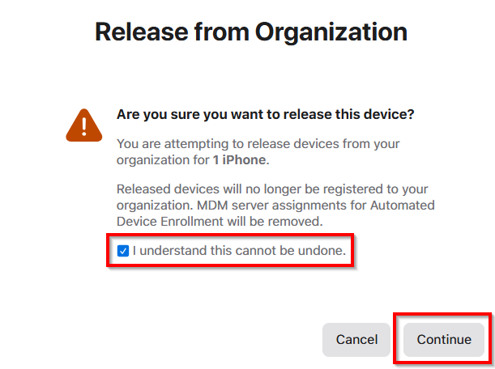

---
# required metadata

title: Retire or wipe devices using Microsoft Intune
description: Retire or wipe a device on an Android, Android work profile, AOSP, iOS/iPadOS, macOS, or Windows device using Microsoft Intune. Also delete a device from Microsoft Entra ID.
keywords:
author: Smritib17
ms.author: smbhardwaj
manager: dougeby
ms.date: 02/13/2025
ms.topic: how-to
ms.service: microsoft-intune
ms.subservice: remote-actions
ms.localizationpriority: high

# optional metadata

#ROBOTS:
#audience:

ms.reviewer:
ms.suite: ems
search.appverid: MET150
#ms.tgt_pltfrm:
ms.custom: intune-azure
ms.collection:
- tier1
- M365-identity-device-management
- highpri
---

# Remove devices by using wipe, retire, or manually unenrolling the device

By using the **Retire** or **Wipe** actions, you can remove devices from Intune that are no longer needed, being repurposed, or missing. Users can also issue a remote command from the Intune Company Portal to devices that are enrolled in Intune.

## Wipe

The **Wipe** device action restores a device to its factory default settings. The user data is kept if you choose the **Wipe device, but keep enrollment state and associated user account** checkbox. Otherwise, all data, apps, and settings are removed.

|Wipe action|**Wipe device, but keep enrollment state and associated user account**|Removed from Intune management|Description|
|:-------------:|:------------:|:------------:|------------|
|**Wipe**| Not checked | Yes | Wipes all user accounts, data, MDM policies, and settings. Resets the operating system to its default state and settings.|
|**Wipe**| Checked | No | Wipes all MDM Policies. Keeps user accounts and data. Resets user settings back to default. Resets the operating system to its default state and settings.|

> [!NOTE]
> The Wipe action is not available for iOS/iPadOS devices enrolled using Account Driven Apple User Enrollment. To create an Account Driven Apple User Enrollment profile, see [Set up iOS/iPadOS and iPadOS Account driven Apple User Enrollment](../enrollment/apple-account-driven-user-enrollment.md).

> [!NOTE]
> By design, Zebra has defined the Wipe action on any Android Zebra device to only remove corporate data from devices, and not perform a factory reset.
> To perform factory reset on a Zebra Android device, you can use either of these methods:
> - [Use Zebra StageNow](https://techdocs.zebra.com/stagenow/5-11/profiles/wipedevice/)
> - [Use OEM Config Data Wipe Configuration](https://techdocs.zebra.com/oemconfig/latest/mc/)

> [!NOTE]
> For fully managed Samsung devices (Android Enterprise), make sure that you do NOT have **Factory Reset** set to **Block** under **Device Restrictions**. If the **Factory Reset** toggle is set to **Block** and a **Wipe** action is in initiated, the device will lose contact with Intune and will also be prevented from being factory reset.

> [!IMPORTANT]
>
> The Wipe action doesn't remove the Autopilot registration from the device. To remove the Autopilot registration from the device, see [Deregister from Autopilot using Intune](/autopilot/registration-overview#deregister-from-autopilot-using-intune)

The **Retain enrollment state and user account** option is only available for Windows 10 version 1709 or later.

MDM policies will be reapplied the next time the device connects to Intune.

A wipe is useful for resetting a device before you give the device to a new user, or when the device has been lost or stolen. Be careful about selecting **Wipe**. Data on the device can't be recovered. The method that "Wipe" uses to remove data is simple file deletion, and the drive is BitLocker decrypted as part of this process.

### Wiping a device

1. Sign in to the [Microsoft Intune admin center](https://go.microsoft.com/fwlink/?linkid=2109431).
2. Select **Devices** > **All devices**.
3. Select the name of the device that you want to wipe.
4. In the pane that shows the device name, select **Wipe**.
5. For Windows 10 version 1709 or later, you also have the **Wipe device, but keep enrollment state and associated user account** option. If this option is selected, the following user account details are retained:

    |Retained during a wipe |Not retained|
    | -------------|------------|
    |User accounts associated with the device|User files|
    |Machine state \(domain join, Microsoft Entra joined)| User-installed apps \(store and Win32 apps)|
    |Mobile device management (MDM) enrollment|Non-default device settings|
    |OEM-installed apps \(store and Win32 apps)||
    |User profile||
    |User data outside of the user profile||
    |User autologon||

6. The **Wipe device, and continue to wipe even if device loses power** option makes sure that the wipe action can't be circumvented by turning off the device. This option keeps trying to reset the device until successful. In some configurations, this action may leave the device [unable to reboot](/troubleshoot/mem/intune/troubleshoot-device-actions#wipe-action).
7. For iOS/iPadOS eSIM devices, the cellular data plan is preserved by default when you wipe a device. If you want to remove the data plan from the device when you wipe the device, select the **Also remove the devices data plan...** option.
8. To confirm the wipe, select **Yes**.

If the device is on and connected, the **Wipe** action propagates across all device types in less than 15 minutes.

## Supported platforms for Wipe device action

**Wipe** is supported on the following platforms:

- Android Enterprise Dedicated, Fully Managed, and Corporate-Owned Work Profile devices
- Android Open Source Project (AOSP) devices
- iOS/iPadOS
- macOS
- Windows

**Wipe** isn't supported on:

- Android Enterprise personally owned devices with a work profile
- Linux

## Retire

The **Retire** action removes managed app data (where applicable), settings, and email profiles that were assigned by using Intune. The device is removed from Intune management. Removal happens the next time the device checks in and receives the remote **Retire** action. The device still shows up in Intune until the device checks in. If you want to remove stale devices immediately, use the [Delete action](devices-wipe.md#delete-devices-from-the-intune-admin-center) instead.

### Retire a device

1. Sign in to the [Microsoft Intune admin center](https://go.microsoft.com/fwlink/?linkid=2109431).
2. In the **Devices** pane, select **All devices**.
3. Select the name of the device that you want to retire.
4. In the pane that shows the device name, select **Retire**. To confirm, select **Yes**.

If the device is on and connected, the **Retire** action propagates across all device types in less than 15 minutes.

### Effect of the **Retire** action on data that remains on the device

When you use the **Retire** device action, the user's personal data is not removed from the device.  

The following tables describe what data is removed, and the effect of the **Retire** action on data that remains on the device after company data is removed.

#### iOS

> [!IMPORTANT]
> Retired devices might not be automatically deleted resulting in the device record remaining in Intune for 180 days unless issued a **Delete** action.

|Data type|iOS|
|-------------|-------|
|Company apps and associated data installed by Intune|**Apps installed using Company Portal:** For apps that are pinned to the management profile, all app data and the apps are removed. These apps include apps originally installed from App Store and later managed as company apps unless the app is configured to not be uninstalled on device removal.    **Microsoft apps that use App Protection Policies and were installed from App Store:** Intune triggers a [selective wipe](../apps/apps-selective-wipe.md) for apps protected by an [App Protection Policy](../apps/app-protection-policy.md) when a Retire action is initiated against an enrolled device. This wipe includes apps installed from the App Store that have work or school account data. The next time the app is launched, the selective wipe removes the protected work or school account data. In order for the selective wipe to occur, an App Protection Policy check-in must occur between the MDM enrollment and retire events. Personal app data and the apps aren't removed after a selective wipe.|
|Settings|Configurations set by Intune policy are no longer enforced. Users can change the settings.|
|Wi-Fi and VPN profile settings|Removed.|
|Certificate profile settings|Certificates are removed and revoked.|
|Management agent|The management profile is removed.|
|Email|Email profiles that are provisioned through Intune are removed. Cached email on the device is deleted.|
|Microsoft Entra Device Record |The Microsoft Entra ID record isn't removed.|

> [!NOTE]
> Users that reinstall the Outlook Mobile app following a **Retire** device action may need to choose to **Delete All Saved Contacts** before re-exporting contacts to avoid duplicate contact entries.  Previously exported contacts from Outlook Mobile are considered personal data and are not removed by the **Retire** device action.

#### Android device administrator

 [!INCLUDE [android_device_administrator_support](../includes/android-device-administrator-support.md)]

|Data type|Android|Android Samsung Knox Standard|
|-------------|-----------|------------------------|
|Web links|Removed.|Removed.|
|Unmanaged Google Play apps|Apps and data remain installed.    Company app data that's protected by Mobile Application Management (MAM) encryption within the app local storage is removed. Data that's protected by MAM encryption outside the app remains encrypted and unusable, but isn't removed. |Apps and data remain installed.    Company app data that's protected by Mobile Application Management (MAM) encryption within the app local storage is removed. Data that's protected by MAM encryption outside the app remains encrypted and unusable, but isn't removed.|
|Unmanaged line-of-business apps|Apps and data remain installed.|Apps are uninstalled and data that's local to the app is removed. No data that's outside the app (for example, on an SD card) is removed.|
|Managed Google Play apps|App data is removed. The app isn't removed. Data that's protected by Mobile Application Management (MAM) encryption outside the app (for example, an SD card) remains encrypted and unusable, but isn't removed.|App data is removed. The app isn't removed. Data that's protected by MAM encryption outside the app (for example, an SD card) remains encrypted, but isn't removed.|
|Managed line-of-business apps|App data is removed. The app isn't removed. Data that's protected by MAM encryption outside the app (for example, an SD card) remains encrypted and unusable, but isn't removed.|App data is removed. The app isn't removed. Data that's protected by MAM encryption outside the app (for example, an SD card) remains encrypted and unusable, but isn't removed.|
|Settings|Configurations set by Intune policy are no longer enforced. Users can change the settings.|Configurations set by Intune policy are no longer enforced. Users can change the settings.|
|Wi-Fi and VPN profile settings|Removed.|Removed.|
|Certificate profile settings|Certificates are revoked but not removed.|Certificates are removed and revoked.|
|Management agent|Device Administrator privilege is revoked.|Device Administrator privilege is revoked.|
|Email|N/A (Android devices don't support Email profiles)|Email profiles that are provisioned through Intune are removed. Cached email on the device is deleted.|
|Microsoft Entra unjoin|The Microsoft Entra ID record is removed.|The Microsoft Entra ID record is removed.|

#### Android Enterprise personally owned devices with a work profile

Removing company data from an Android personally owned work profile device removes all data, apps, and settings in the work profile on that device. The device is retired from management with Intune.

#### macOS

|Data type|macOS|
|-------------|-------|
|Settings|Configurations set by Intune policy are no longer enforced. Users can change the settings.|
|Wi-Fi and VPN profile settings|Removed.|
|Certificate profile settings|Certificates that were deployed through MDM are removed and revoked.|
|Management agent|The management profile is removed.|
|Outlook|If Conditional Access is enabled, the device doesn't receive new mail.|
|Microsoft Entra Device Record |The Microsoft Entra ID record isn't removed.|

#### Windows

|Data type|Windows 8.1 (MDM) and Windows RT 8.1|Windows RT|Windows 10|
|-------------|----------------------------------------------------------------|--------------|-----------------------------------------|
|Company apps and associated data installed by Intune|Keys are revoked for files that are protected by EFS. The user can't open the files.|Company apps aren't removed.|Apps are uninstalled. Sideloading keys are removed. For Windows 10 version 1709 (Creators Update) and later, Microsoft 365 Apps aren't removed. Intune management extension installed Win32 apps aren't uninstalled on unenrolled devices. Admins can use assignment exclusion to not offer Win32 apps to BYOD Devices.|
|Settings|Configurations set by Intune policy are no longer enforced. Users can change the settings.|Configurations set by Intune policy are no longer enforced. Users can change the settings.|Configurations set by Intune policy are no longer enforced. Users can change the settings.|
|Wi-Fi and VPN profile settings|Removed.|Removed.|Removed.|
|Certificate profile settings|Certificates are removed and revoked.|Certificates are removed and revoked.|Certificates are removed and revoked.|
|Email|Removes email that's EFS-enabled including emails and attachments in the Mail app for Windows.|Not supported.|Removes email that's EFS-enabled including emails and attachments in the Mail app for Windows. Removes mail accounts provisioned by Intune.|
|Microsoft Entra unjoin|No.|No.|The Microsoft Entra ID record is removed.|

> [!IMPORTANT]
> Windows devices that are not registered in the Windows Autopilot Service, upon being deleted or retired from Intune are removed from Microsoft Entra ID. Before performing these commands consider backing up the Bitlocker Recovery Key and/or a local administrator user account credentials. On the other hand, although Autopilot registered devices leave Microsoft Entra ID, their computer object is retained alongside their properties (e.g. Windows LAPS, Bitlocker Recovery Key, Entra ID groups memberships).

> [!NOTE]
> For Windows 10 devices that join Microsoft Entra ID during initial Setup (OOBE), the retire command will remove all Microsoft Entra accounts from the device. Follow the steps at [Start your PC in Safe mode](https://support.microsoft.com/en-us/help/12376/windows-10-start-your-pc-in-safe-mode) to login as a local admin and regain access to the user's local data.

## Manually unenroll devices

Device owners can manually unenroll their devices as explained in the following end user help articles:

- [Remove device from Company Portal for Android](../user-help/unenroll-your-device-from-intune-android.md)
- [Remove device from Company Portal for iOS app](../user-help/unenroll-your-device-from-intune-ios.md)
- [Remove device from Company Portal for macOS app](../user-help/unenroll-your-device-from-intune-macos.md)
- [Remove your Windows device from management](../user-help/unenroll-your-device-from-intune-windows.md)

> [!TIP]
> When a Windows device user un-enrolls their device via the Settings app, Intune does not automatically delete the Intune device or Microsoft Entra ID records. To remove record of the Intune device, sign in to Microsoft Intune and delete the device manually, or wait for your device cleanup rules to take effect. You must also manually delete the Microsoft Entra ID record, if applicable, because the cleanups rule will not remove it.  

## Delete devices from the Intune admin center

If you want to remove devices from the Intune admin center, you can delete them from the specific device pane. Intune issues a **Retire** or **Wipe** action depending on the OS/Enrollment type. Not all enrollment types support the **Retire** action. See the following table for the expected behavior based on the device platform and the enrollment type.

| OS      | Enrollment Type                                | Action triggered                                                                           |
|---------|--------------------------------------------|--------------------------------------------------------------------------------------------|
| Android | Device administrator                       | RETIRE - All Profiles are deleted, Company Portal (CP) app is signed out.           |
| Android | Personally owned devices with work profile | RETIRE - All Profiles are deleted, CP app is deleted.                               |
| Android | Corporate-owned devices with work profile  | WIPE                                                                       |
| Android | Dedicated devices                          | WIPE                                                                       |
| Android | Dedicated w/ Entra ID Shared Mode          | WIPE                                  |
| Android | Fully managed user devices                 | WIPE                                                                       |
| Android | AOSP Userless/AOSP User-Associated         | WIPE                                                                       |
| iOS     | All                                        | RETIRE - All Profiles are deleted, CP app is signed out                            |
| Windows | All                                        | RETIRE - All Profiles are deleted, work and school account is signed out                   |
| macOS   | All                                        | RETIRE - All Profiles are deleted, CP app is deleted                              |

1. Sign in to the [Microsoft Intune admin center](https://go.microsoft.com/fwlink/?linkid=2109431).
2. Choose **Devices** > **All devices** > choose the devices you want to delete > **Delete**.

> [!IMPORTANT]
> The **Delete** action triggers the following actions:
>
> * Depending on the device platform, it may retire the Microsoft Entra device record / unjoin the device from Microsoft Entra ID. For more information, see [Retire](devices-wipe.md#retire) section for the expected behavior.
> * BitLocker encryption is suspended if managed by Intune. To create a BitLocker profile, see [Manage BitLocker policy for Windows devices with Intune](../protect/encrypt-devices.md).

### Automatically remove devices with cleanup rules

You can configure Intune to automatically remove devices that appear to be inactive, stale, or unresponsive. These cleanup rules continuously monitor your device inventory so that your device records stay current. Devices removed in this way are obfuscated and removed from Intune management. This setting affects all devices managed by Intune, not just specific ones.

1. Sign in to the [Microsoft Intune admin center](https://go.microsoft.com/fwlink/?linkid=2109431).
2. Choose **Devices** > **Device cleanup rules** > **Yes**.
3. In the **Delete devices that haven't checked in for this many days** box, enter a number between 30 and 270.
4. Choose **Save**.

When a device cleanup rule runs, it removes the device from Intune. This action doesn't trigger a Wipe or Retire action.

If a removed device checks-in before its device certification expires, it reappears in the admin center. Once the device certification expires, the device must go through a re-enrollment process for it to show up in the console.

> [!IMPORTANT]
> The device clean-up rule doesn't trigger a Bitlocker suspension when Bitlocker encryption is managed by Intune. To create a Bitlocker profile: [Manage BitLocker policy for Windows devices with Intune](../protect/encrypt-devices.md)

> [!NOTE]
> Device cleanup rules aren't available for Jamf-managed devices.
>
> You need the permission **Managed Device Cleanup Settings with Update** set to **Yes** to update the device cleanup rules. This permission is part of [Intune Roles](../fundamentals/role-based-access-control.md).

## Delete devices from the Microsoft Entra admin center

You might need to delete devices from Microsoft Entra ID due to communication issues or missing devices. You can use the **Delete** action to remove device records from the Azure portal for devices that you know are unreachable and unlikely to communicate with Azure again. The **Delete** action doesn't remove a device from management.

1. Sign in to [Microsoft Entra ID in the Azure portal](https://azure.microsoft.com/services/active-directory/) by using your admin credentials. You can also sign in to the [Microsoft 365 admin center](https://admin.microsoft.com). From the menu, select **Admin centers** > **Microsoft Entra ID**.
2. Create an Azure subscription if you don't have one. The subscription shouldn't require a credit card or payment if you have a paid account (select the **Register your free Microsoft Entra ID** subscription link).
3. Select **Microsoft Entra ID**, and then select your organization.
4. Select the **Users** tab.
5. Select the user that's associated with the device that you want to delete.
6. Select **Devices**.
7. Remove devices as appropriate. For example, you might remove devices that are no longer in use, or devices that have inaccurate definitions.

## Retire an Apple ADE device from Intune

If you want to completely remove an Apple automated device enrollment (ADE) device from management by Intune, follow these steps:

1. Sign in to the [Microsoft Intune admin center](https://go.microsoft.com/fwlink/?linkid=2109431).
2. Choose **Devices** > **All devices** > choose the device > **Retire**.
3. Visit [business.apple.com](http://business.apple.com), go to the **Devices** section, and search for the device by its serial number.
4. Select the device, open the **...** menu, and then select **Release from Organization**.

5. Check **I understand this cannot be undone**, and then select **Continue**.

    

> [!NOTE]
> In some cases, the iOS device must be restored with iTunes to apply this change. Please find further instructions from Apple [here](https://support.apple.com/guide/itunes/restore-to-factory-settings-itnsdb1fe305/windows).

## Device states

For a description of device states, see the [managementStates collection](../developer/intune-data-warehouse-collections.md#managementstates).

## Fresh Start

Applicable for Windows 10 devices. Read more about [Fresh Start](device-fresh-start.md).

## Next steps

If you want to reenroll a deleted device, see [Enrollment options](../fundamentals/deployment-guide-enrollment.md).
