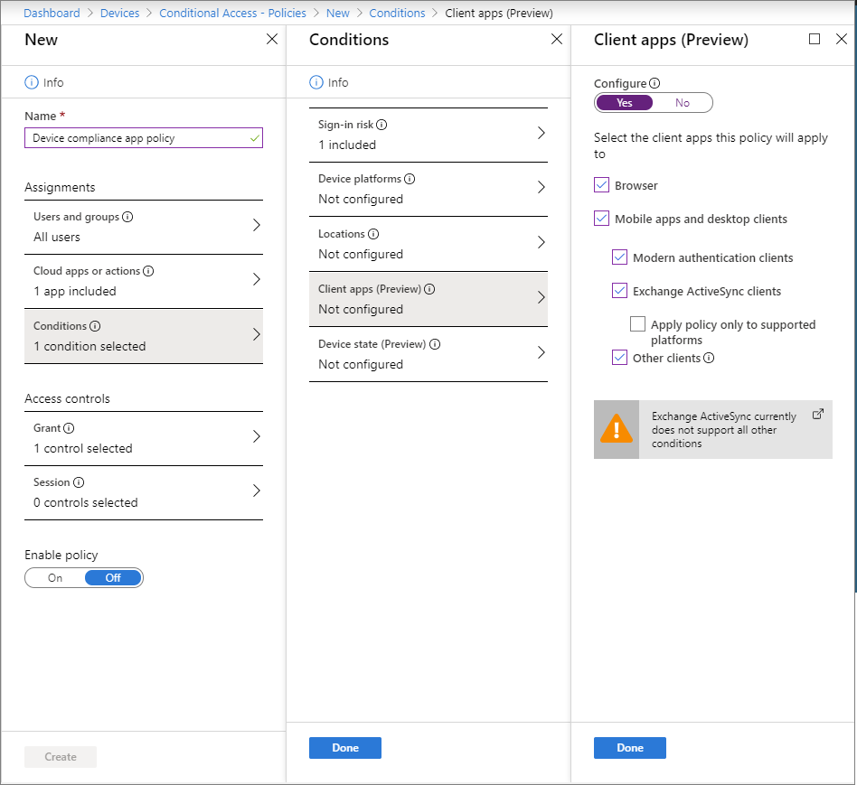
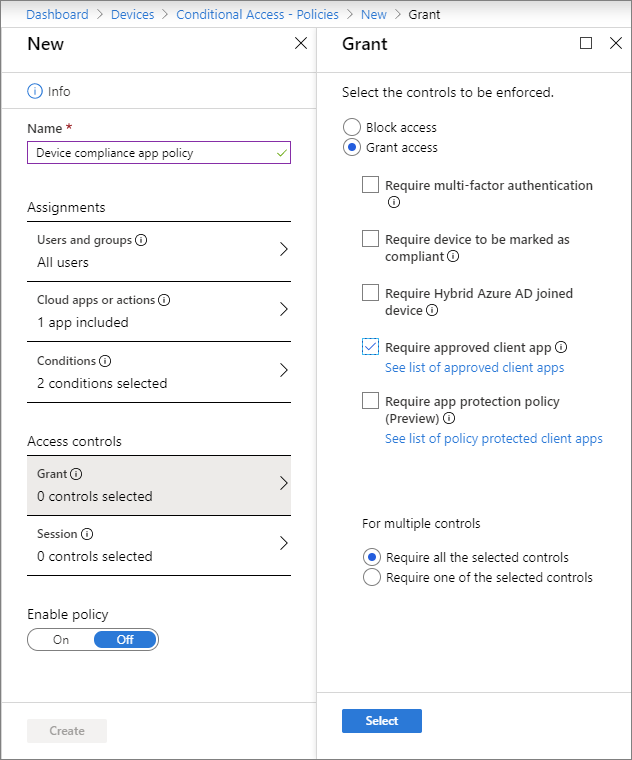

---
# required metadata

title: Manage corporate web access with a policy-protected browser 
titleSuffix: Microsoft Intune
description: Use a policy-protected browser assigned by Intune to manage corporate web browsing and web data transferring.
keywords:
author: Erikre
ms.author: erikre
manager: dougeby
ms.date: 03/12/2020
ms.topic: conceptual
ms.service: microsoft-intune
ms.subservice: apps
ms.localizationpriority: high
ms.technology:
ms.assetid: 1feca24f-9212-4d5d-afa9-7c171c5e8525

# optional metadata

#ROBOTS:
#audience:

ms.reviewer: ilwu
ms.suite: ems
search.appverid: MET150
#ms.tgt_pltfrm:
ms.custom: intune-azure, seoapril2019
ms.collection: M365-identity-device-management
---

# Manage web access using a Microsoft Intune policy-protected browser

[!INCLUDE [azure_portal](../includes/azure_portal.md)]

Using a browser protected with Intune policy (Microsoft Edge, you can ensure corporate websites are always accessed with safeguards in place.  When configured with Intune, protected browsers can take advantage of the following:

- Application protection policies
- Conditional Access
- Single sign-on
- Application configuration settings
- Azure application proxy integration

> [!IMPORTANT]
> The Intune Managed Browser has been retired. Use [Microsoft Edge](../apps/manage-microsoft-edge.md) for your protected Intune browser experience. 

## Microsoft Edge support

You can use Microsoft Edge for enterprise scenarios on iOS/iPadOS and Android devices. The following Microsoft Edge enterprise features that are enabled by Intune policies include:

- **Dual-Identity** - Users can add both a work account, as well as a personal account, for browsing. There is complete separation between the two identities, which is similar to the architecture and experience in Office 365 and Outlook. Intune admins will be able to set the desired policies for a protected browsing experience within the work account. 
- **Intune app protection policy integration** - Admins can now target app protection policies to Microsoft Edge, including the control of cut, copy, and paste, preventing screen captures, and ensuring that user-selected links open only in other managed apps.
- **Azure Application Proxy integration** - Admins can control access to SaaS apps and web apps, helping ensure browser-based apps only run in the secure Microsoft Edge browser, whether end users connect from the corporate network or connect from the Internet. 
- **Managed Favorites and Home Page shortcuts** - For ease of access, admins can set URLs to appear under favorites when end users are in their corporate context. Admins can set a homepage shortcut, which will show as the primary shortcut when the corporate user opens a new page or a new tab in Microsoft Edge.

Microsoft Intune protection policies for Microsoft Edge help to protect your organization's data and resources. Intune-protected Microsoft Edge ensures that your company's resources are protected not only within natively installed apps, but also when accessed through the web browser.

## Getting started

Microsoft Edge is a web browser app that you and your end users can download from public app stores for use in your organization. 

Operating system requirements for browser policies:
- Android 4 and later, or
- iOS/iPadOS 8.0 and later.

Earlier versions of Android and iOS/iPadOS will be able to continue using the Managed Browser, but will be unable to install new versions of the app and might not be able to access all of the app capabilities. We encourage you to update these devices to a supported operating system version.

>[!NOTE]
>The Managed Browser does not support the Secure Sockets Layer version 3 (SSLv3) cryptographic protocol.

## Application protection policies for protected browsers

Because Microsoft Edge and Managed Browser have integration with the Intune SDK, you can also apply app protection policies to them, including:
- Controlling the use of cut, copy, and paste.
- Preventing screen captures.
- Ensuring corporate links open only within managed apps and browsers.

For details, see [What are app protection policies?](app-protection-policy.md)

You can apply these settings to:

- Devices that are enrolled with Intune
- Enrolled with another MDM product
- Unmanaged devices

>[!NOTE]
>If users install the Managed Browser from the app store and Intune does not manage it, it can be used as a basic web browser, with support for Single Sign-On through the Microsoft MyApps site. Users are taken directly to the MyApps site, where they can see all of their provisioned SaaS applications.
While Managed Browser or Microsoft Edge are not managed by Intune, they cannot access data from other Intune-managed applications. 

## Conditional Access for protected browsers

The Managed Browser is now an approved client app for Conditional Access. This means that you can restrict mobile browser access to Azure AD-connected web apps where users can only use the Managed Browser, blocking access from any other unprotected browsers such as Safari or Chrome. This protection can be applied to Azure resources like Exchange Online and SharePoint Online, the Microsoft 365 admin center, and even on-premises sites that you have exposed to external users via the [Azure AD Application Proxy](https://docs.microsoft.com/azure/active-directory/active-directory-application-proxy-get-started). 

> [!NOTE]
> New web clips (pinned web apps) on iOS devices will open in Microsoft Edge instead of the Intune Managed Browser when required to open in a protected browser. For older iOS web clips, you must retarget these web clips to ensure they open in Microsoft Edge rather then the Managed Browser.

To restrict Azure AD-connected web apps to use the Intune Managed Browser on mobile platforms, you can create a Conditional Access policy requiring approved client applications. 

> [!TIP]  
> Conditional Access is an Azure Active Directory (Azure AD) technology. The Conditional Access node accessed from *Intune* is the same node as accessed from *Azure AD*.  

1. Sign in to the [Microsoft Endpoint Manager admin center](https://go.microsoft.com/fwlink/?linkid=2109431).
2. Select **Devices** > **Conditional Access** > **New policy**.
3. Add the policy **Name**. 
4. In the **Assignments** section, select **Conditions** > **Client apps**. The **Client apps** pane is displayed.
5. Click **Yes** under **Configure** to apply the policy to specific client apps.
6. Verify that **Browser** is selected as a client app.

    

    > [!NOTE]
    > If you want to restrict which native apps (non-browser apps) can access these cloud applications, you can also select **Mobile apps and desktop clients**.

7. Click **Done** > **Done**.
8. In the **Assignments** section, select **Users and groups** and choose the users or groups you would like to assign this policy. Click **Done** to close the pane.
9. In the **Assignments** section, select **Cloud apps or actions** to choose which apps to protect with this policy. Click **Done** to close the pane.
10. Select **Grant** from the **Access controls** section of the pane. 
11. Click **Grant access** and then click **Require approved client app**. 
12. Click **Select** on the **Grant** pane. This policy must be assigned to the cloud apps that you want to be accessible to only the Intune Managed Browser app.

    

Once the above policy is configured, users will be forced to use the Intune Managed Browser to access the Azure AD-connected web apps you have protected with this policy. If users attempt to use an unmanaged browser in this scenario, they will see a notice that the Intune Managed Browser must be used instead.

The Managed Browser does not support classic Conditional Access policies. For more information, see [Migrate classic policies in the Azure portal](https://docs.microsoft.com/azure/active-directory/active-directory-conditional-access-migration).

## Single Sign-on to Azure AD-connected web apps in policy-protected browsers

Microsoft Edge and Intune Managed Browser on iOS/iPadOS and Android can take advantage of SSO to all web apps (SaaS and on-prem) that are Azure AD-connected. When the Microsoft Authenticator app is present on iOS/iPadOS or the Intune Company Portal app on Android, users of a policy-protected browser will be able to access Azure AD-connected web apps without having to re-enter their credentials.

SSO requires your device to be registered by the Microsoft Authenticator app on iOS/iPadOS or the Intune Company Portal on Android. Users with the Authenticator app or Intune Company Portal will be prompted to register their device when they navigate to an Azure AD-connected web app in a policy-protected browser, if their device has not already been registered by another application. Once the device is registered with the account managed by Intune, that account will have SSO enabled for Azure AD-connected web apps. 

> [!NOTE]
> Device registration is a simple check-in with the Azure AD service. It does not require full device enrollment and does not give IT any additional privileges on the device.

## Create a protected browser app configuration

>[!IMPORTANT]
>For app configurations to apply, the user's protected browser or another app on the device must already be managed by [Intune app protection policy](app-protection-policy.md)

1. Sign in to the [Microsoft Endpoint Manager admin center](https://go.microsoft.com/fwlink/?linkid=2109431).
2. Select **Apps** > **App configuration policies** > **Add** > **Managed apps**.
3. On the **Basics** page of the **Create app configuration policy** pane, enter a **Name** and optional **Description** for the app configuration settings.
4. Choose **Select the public app** and choose the **Managed Browser** and/or **Edge** for iOS/iPadOS, for Android, or for both.
5. Click **Select** to return to the **Create app configuration policy** pane.
6. Click **Next** to display the **Settings** page.
7. On the **Settings** page you define key and value pairs to supply configurations for the app. Use the sections later in this article to learn about the different key and value pairs you can define.
8. Click **Next** to display the **Assignment** page and then click **Select groups to include** and/or **Select groups to exclude**.
9. Click **Next** to display the **Review + create** page.
10. Click **Create** after you have reviewed the app configuration policy.

The new configuration is created, and displayed on the **App configuration policy** pane.

## Assign the configuration settings you created

You assign the settings to Azure AD groups of users. If that user has the targeted protected browser app installed, then the app is managed by the settings you specified.

1. On the **Apps** pane of the Intune mobile application management dashboard, choose **App configuration policies**.
2. From the list of app configurations, select the one you want to assign.
3. On the next pane, choose **Assignments**.
4. On the **Assignments** pane, select the Azure AD group to which you want to assign the app configuration, and then choose **OK**.

## How to set Microsoft Edge as the protected browser for your organization

This setting allows you to configure if your users will be directed to Microsoft Edge or the Intune Managed Browser, assuming both browsers are targeted with app protection policy. **This application configuration policy setting should be targeted to Intune managed Apps from which the web link is opened.** 

If this setting is set to "True":

- Your users will directed to Microsoft Edge when opening links from Intune managed apps targeted with this setting. 
- If they do not have the app yet, they will be prompted to download Microsoft Edge from the store, regardless of if they have the Intune Managed Browser downloaded.

If this setting is set to "False":

- If your users have **both** the Managed Browser and Microsoft Edge downloaded, the Managed Browser will launch. 
- If your users have **either** the Managed Browser **or** Microsoft Edge downloaded, that browser app will launch. 
- If your users do not have either browser app downloaded, they will be prompted to download the Managed Browser.

Using the above procedure to create a Microsoft Edge app configuration. Supply the following key and value pair when selecting the **Configuration settings** on the **Configuration** pane (step 9):

| Key                              |  Value   |
|----------------------------------|----------|
| **com.microsoft.intune.useEdge** | **true** |

> [!NOTE]
> In the app protection policy that manages Microsoft Edge and associated apps specified in the app configuration, ensure the following data protection policy settings are set:
> - Send Org data to other apps: **Policy managed apps**
> - Restrict web content transfer with other apps: **Policy managed browsers**

## How to configure Application Proxy settings for protected browsers

Microsoft Edge and [Azure AD Application Proxy]( https://docs.microsoft.com/azure/active-directory/active-directory-application-proxy-get-started) can be used together to support the following scenarios for users of iOS/iPadOS and Android devices:

- A user downloads and signs in to the Microsoft Outlook app. Intune app protection policies are automatically applied. They encrypt saved data and block the user from transferring corporate files to unmanaged apps or locations on the device. When the user then clicks a link to an intranet site in Outlook, you can specify that the link opens in a protected browser application, rather than another browser. The protected browser recognizes that this intranet site has been exposed to the user through the Application Proxy. The user is automatically routed through the Application Proxy, to authenticate with any applicable multi-factor authentication, and Conditional Access before reaching the intranet site. This site, which could previously not be found while the user was remote, is now accessible and the link in Outlook works as expected.
- A remote user opens the protected browser application and navigates to an intranet site using the internal URL. The protected browser recognizes that this intranet site has been exposed to the user via the Application Proxy. The user is automatically routed through the Application Proxy, to authenticate with any applicable multi-factor authentication, and Conditional Access before reaching the intranet site. This site, which could previously not be found while the user was remote, is now accessible.

### Before you start

- Set up your internal applications through the Azure AD Application Proxy.
  - To configure Application Proxy and publish applications, see the [setup documentation](https://docs.microsoft.com/azure/active-directory/manage-apps/application-proxy). 
  - [Users must be assigned](https://docs.microsoft.com/azure/active-directory/manage-apps/application-proxy-add-on-premises-application#add-a-user-for-testing) to the Enterprise Application for which the redirection is to occur. This must be done even if the application is set to Passthrough mode for Pre-Authentication, and if the user assignment requirement has been turned off in the Application Proxy settings.
- Users of the Microsoft Edge app must have an [Intune app protection policy](app-protection-policy.md) assigned to the app.

    > [!NOTE]
    > Updated Application Proxy redirection data can take up to 24 hours to take effect in Microsoft Edge.

#### Step 1: Enable automatic redirection to a protected browser from Outlook
Outlook must be configured with an app protection policy that enables the setting **Restrict web content to display in the Managed Browser**.

#### Step 2: Assign an app configuration policy assigned for the protected browser
This procedure configures Microsoft Edge app to use app proxy redirection. 

Open the **Edge** tab in the configuration settings for the policy and select **Enable** for the Application proxy redirection value. Enabling this setting will give users access to corporate links and on-premises web apps published through the Azure application proxy.

For more information about how the Managed Browser, Microsoft Edge, and Azure AD Application Proxy can be used in tandem for seamless (and protected) access to on-premises web apps, see the Enterprise Mobility + Security blog post [Better together: Intune and Azure Active Directory team up to improve user access](https://cloudblogs.microsoft.com/enterprisemobility/2017/07/06/better-together-intune-and-azure-active-directory-team-up-to-improve-user-access).

## How to configure the homepage for a protected browser

This setting allows you to configure the homepage that users see when they start a protected browser or create a new tab. 
- This setting will show the web page in Managed Browser.  Edge will display a homepage shortcut instead.
- The homepage shortcut icon appears as an icon beneath the search control.  It cannot be edited or deleted.
- The homepage shortcut will display your organization's name to distinguish it.  It will always appear as the first icon.

Using the procedure to create a Microsoft Edge app configuration, supply the following key and value pair:

|                                Key                                |                                                           Value                                                            |
|-------------------------------------------------------------------|----------------------------------------------------------------------------------------------------------------------------|
| <strong>com.microsoft.intune.mam.managedbrowser.homepage</strong> | Specify a valid URL. Incorrect URLs are blocked as a security measure. Example: `https://www.bing.com` |

## How to configure bookmarks for a protected browser

This setting allows you to configure a set of bookmarks that is available to users of Microsoft Edge or the Managed Browser.

- These bookmarks cannot be deleted or modified by users
- These bookmarks display at the top of the list. Any bookmarks that users create are displayed below these bookmarks.
- If you have enabled App Proxy redirection, you can add App Proxy web apps using either their internal or external URL.

Using the procedure to create a Microsoft Edge app configuration, supply the following key and value pair:

|                                Key                                 |                                                                                                                                                                                                                                                         Value                                                                                                                                                                                                                                                          |
|--------------------------------------------------------------------|------------------------------------------------------------------------------------------------------------------------------------------------------------------------------------------------------------------------------------------------------------------------------------------------------------------------------------------------------------------------------------------------------------------------------------------------------------------------------------------------------------------------|
| <strong>com.microsoft.intune.mam.managedbrowser.bookmarks</strong> | The value for this configuration is a list of bookmarks. Each bookmark consists of the bookmark title, and the bookmark URL. Separate the title, and URL with the <strong>&#124;</strong> character.  Example:  <code>Microsoft Bing&#124;https://www.bing.com</code>  To configure multiple bookmarks, separate each pair with the double character, <strong>&#124;&#124;</strong>  Example:  <code>Bing&#124;https://www.bing.com&#124;&#124;Contoso&#124;https://www.contoso.com</code> |

## How to specify allowed and blocked URLs for a protected browser

Using the procedure to create a Microsoft Edge app configuration, supply the following key and value pair:

|Key|Value|
|-|-|
|Choose from: <ul><li>Specify allowed URLs (only these URLs are allowed; no other sites can be accessed):  **com.microsoft.intune.mam.managedbrowser.AllowListURLs**  </li><li>Specify blocked URLs (all other sites can be accessed): **com.microsoft.intune.mam.managedbrowser.BlockListURLs**</li></ul>|The corresponding value for the key is a list of URLs. You enter all the URLs you want to allow or block as a single value, separated by a pipe **&#124;** character.  Examples:  <code>URL1&#124;URL2&#124;URL3</code> <code>http://*.contoso.com/*&#124;https://*.bing.com/*&#124;https://expenses.contoso.com</code>|

>[!IMPORTANT]
>Do not specify both keys. If both keys are targeted to the same user, the allow key is used, as it's the most restrictive option.
>Additionally, make sure not to block important pages like your company websites.

### URL format for allowed and blocked URLs
Use the following information to learn about the allowed formats and wildcards that you can use when specifying URLs in the allowed and blocked lists:

- You can use the wildcard symbol (**&#42;**) according to the rules in the following permitted patterns list:

- Ensure that you prefix all URLs with **http** or **https** when entering them into the list.

- You can specify port numbers in the address. If you do not specify a port number, the values used are:

  - Port 80 for http

  - Port 443 for https

  Using wildcards for the port number is not supported. For example, `http://www.contoso.com:;` and `http://www.contoso.com: /;` are not supported.

- Use the following table to learn about the permitted patterns that you can use when you specify URLs:

|                  URL                  |                     Details                      |                                                Matches                                                |                                Does not match                                 |
|---------------------------------------|--------------------------------------------------|-------------------------------------------------------------------------------------------------------|-------------------------------------------------------------------------------|
|        `http://www.contoso.com`         |              Matches a single page               |                                            `www.contoso.com`                                            |  `host.contoso.com`  `www.contoso.com/images`  `contoso.com`/   |
|          `http://contoso.com`           |              Matches a single page               |                                             `contoso.com/`                                              | `host.contoso.com`  `www.contoso.com/images`  `www.contoso.com` |
|    `http://www.contoso.com/&#42;`     | Matches all URLs that begin with `www.contoso.com` |      `www.contoso.com`  `www.contoso.com/images`  `www.contoso.com/videos/tvshows`      |              `host.contoso.com`  `host.contoso.com/images`              |
|    `http://*.contoso.com/*`     |     Matches all subdomains under contoso.com     | `developer.contoso.com/resources`  `news.contoso.com/images`  `news.contoso.com/videos` |                               `contoso.host.com`                                |
|     `http://www.contoso.com/images`     |             Matches a single folder              |                                        `www.contoso.com/images`                                         |                          `www.contoso.com/images/dogs`                          |
|       `http://www.contoso.com:80`       |  Matches a single page, by using a port number   |                                       `http://www.contoso.com:80`                                       |                                                                               |
|        `https://www.contoso.com`        |          Matches a single, secure page           |                                        `https://www.contoso.com`                                        |                            `http://www.contoso.com`                             |
| `http://www.contoso.com/images/&#42;` |    Matches a single folder and all subfolders    |                  `www.contoso.com/images/dogs`  `www.contoso.com/images/cats`                   |                            `www.contoso.com/videos`                             |

- The following are examples of some of the inputs that you cannot specify:

  - `*.com`

  - `*.contoso/*`

  - `www.contoso.com/*images`

  - `www.contoso.com/*images*pigs`

  - `www.contoso.com/page*`

  - IP addresses

  - `https://*`

  - `http://*`

  - `http://www.contoso.com:*`

  - `http://www.contoso.com: /*`
  
## Soft transitions from work to personal accounts

The cornerstone of the Microsoft Edge mobile enterprise experience is the dual-identity model, meaning Microsoft Edge supports both work and personal identities. As with the Office 365 and Outlook apps, this dual-identity model allows end users to use Microsoft Edge for all browsing needs and easily move between the two experiences based on the content policies defined by the administrator. Browsing in the personal context is unaffected and corporate information is kept completely contained to the work context within Microsoft Edge. 

One of the benefits of this model is that when users try to open a link (such as a newspaper article, etc.) to a site that is not  allowed by your organization, they are able to do so in their personal context, which is kept entirely separate from their work context. These soft transitions from are enabled by default. 

Using the procedure to create a Microsoft Edge app configuration, supply the following key and value pair:

| Key                                                                | Value                                                 |
|--------------------------------------------------------------------|-------------------------------------------------------|
| **com.microsoft.intune.mam.managedbrowser.AllowTransitionOnBlock** | **False** blocks these soft transitions from occurring |

## How to access managed app logs using the Managed Browser on iOS

End users with the managed Browser installed on their iOS/iPadOS device can view the management status of all Microsoft published apps. They can send logs for troubleshooting their managed iOS/iPadOS apps.

1. Open iOS/iPadOS **Settings**.
2. Select the managed **Browser** application settings.
3. Toggle **Enable Intune Diagnostics** to set the browser in troubleshooting mode.
4. Open the managed **Browser**. Click **View Intune App Status** to review individual application policy settings.
5. Press **Get Started** and **Share Logs** or **Send Logs to Microsoft** to send the troubleshooting logs to your IT administrator or Microsoft.

You can also open the Browser in troubleshooting mode from within the app.

1. Open the Managed Browser.
2. Type `about:intunehelp` in the address box.
The Browser launches troubleshooting mode.

For a list of the settings stored in the app logs, see [Review app protection logs in the Managed Browser](app-protection-policy-settings-log.md).

## Security and privacy for the Managed Browser

- The Managed Browser does not use settings that users make for the built-in browser on their devices. The Managed Browser cannot access to these settings.

- If you configure the option **Require simple PIN for access** or **Require corporate credentials for access** in an app protection policy associated with the Managed Browser, and a user selects the help link on the authentication page, they can browse any Internet sites regardless of whether they were added to a block list in the policy.

- The Managed Browser can block access to sites only when they are accessed directly. It does not block access when intermediate services (such as a translation service) are used to access the site.

- To allow authentication, and access to Intune documentation, **&#42;.microsoft.com** is exempt from the allow or block list settings. It is always allowed.

### Turn off usage data
Microsoft automatically collects anonymous data about the performance and use of the Managed Browser to improve Microsoft products and services. Users can turn off data collection by using the **Usage Data** setting on their devices. You have no control over the collection of this data.

- On iOS/iPadOS devices, websites that users visit that have an expired or untrusted certificate cannot be opened.

## Next steps

- [What are app protection policies?](app-protection-policy.md) 
