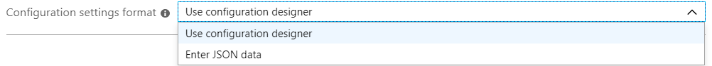
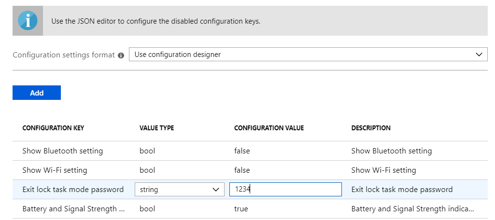
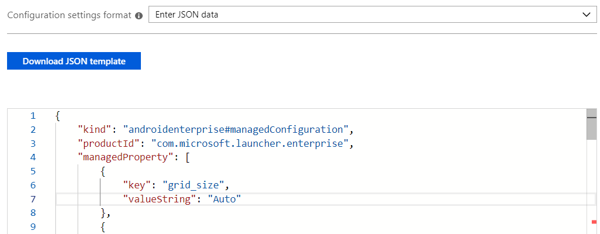
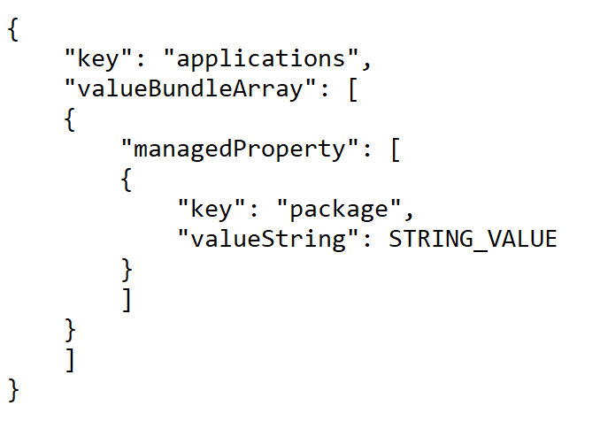
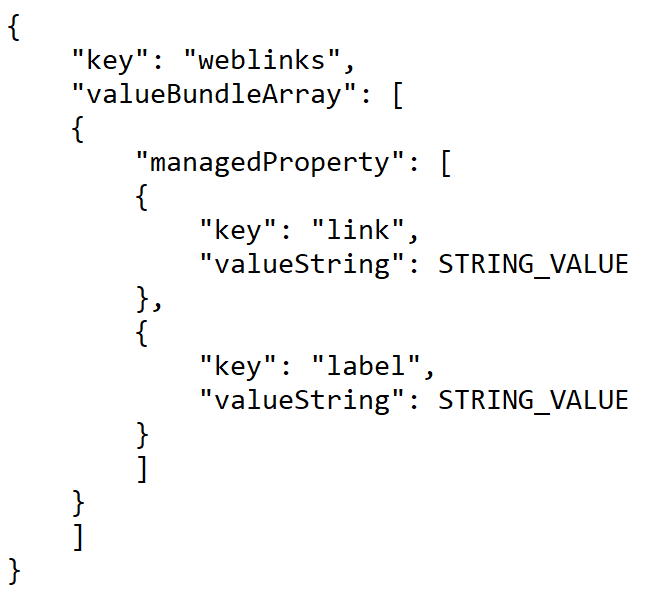
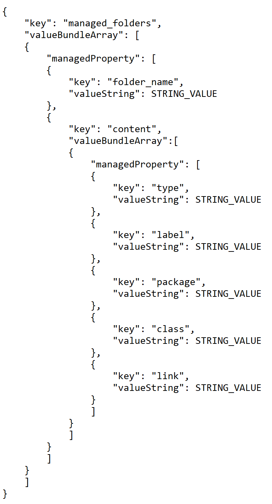

---
# required metadata

title: Configure the Microsoft Managed Home Screen app
titleSuffix: Microsoft Intune
description: Learn how to configure the Microsoft Managed Home Screen app.
keywords:
author: Erikre
ms.author: erikre
manager: dougeby
ms.date: 03/16/2022
ms.topic: how-to
ms.service: microsoft-intune
ms.subservice: apps
ms.localizationpriority: medium
ms.technology:
ms.assetid: 865c7f03-f525-4dfa-b3a8-d088a9106502

# optional metadata 

#ROBOTS:
#audience:

ms.reviewer: chmaguir
ms.suite: ems
search.appverid: MET150
#ms.tgt_pltfrm:
ms.collection:
- M365-identity-device-management
- Android
ms.custom: intune-azure
---

# Configure the Microsoft Managed Home Screen app for Android Enterprise

The Managed Home Screen is the application used for corporate-owned Android Enterprise dedicated devices enrolled via Intune and running in multi-app kiosk mode. For these devices, the Managed Home Screen acts as the launcher for other approved apps to run on top of it. The Managed Home Screen provides IT admins the ability to customize their devices and to restrict the capabilities that the end user can access. For even more details, see [How to setup Microsoft Managed Home Screen on Dedicated devices in multi-app kiosk mode](https://techcommunity.microsoft.com/t5/intune-customer-success/how-to-setup-microsoft-managed-home-screen-on-dedicated-devices/ba-p/1388060).   

## When to configure the Microsoft Managed Home Screen app

First, ensure that your devices are supported. Intune supports the enrollment of Android Enterprise dedicated devices for Android devices running OS version 8.0 and above that reliably connect to Google Mobile Services. Similarly, Managed Home Screen supports Android devices running OS version 8.0 and above. 

Typically, if settings are available to you through Device configuration, configure the settings there. Doing so will save you time, minimize errors, and will give you a better Intune-support experience. However, some of the Managed Home Screen settings are currently only available via the **App configuration policies** pane in the Intune console. Use this document to learn how to configure the different settings either using the configuration designer or a JSON script. Additionally, use this document to learn what Managed Home Screen settings are available using Device configuration. You may also see [Dedicated device settings](../configuration/device-restrictions-android-for-work.md#device-experience) for a full list of settings available in **Device configuration** that impact the Managed Home Screen. 

If using App configuration, navigate to the [Microsoft Endpoint Manager admin center](https://go.microsoft.com/fwlink/?linkid=2109431) and select **Apps** > **App configuration policies**. Add a configuration policy for **Managed devices** running **Android** and choose **Managed Home Screen** as the associated app. Select **Configuration settings** to configure the different available Managed Home Screen settings. 

## Choosing a Configuration Settings Format

There are two methods that you can use to define configuration settings for Managed Home Screen:

- **Configuration designer** allows you to configure settings with an easy-to-use UI that lets you toggle features on or off and set values. In this method, there are a few disabled configuration keys with value type `BundleArray`. These configuration keys can only be configured by entering JSON data. 
- **JSON data** allows you to define all possible configuration keys using a JSON script. 

If you add properties with Configuration Designer, you can automatically convert these properties to JSON by selecting **Enter JSON data** from the **Configuration settings format** dropdown.



## Using Configuration Designer

Configuration designer allows you to select pre-populated settings and their associated values. 



The following table lists the Managed Home Screen available configuration keys, value types, default values, and descriptions. The description provides the expected device behavior based on selected values. Configuration keys of type `BundleArray` are disabled in the Configuration Designer and are further described in the **Enter JSON Data** section of this document.

**Configuration to customize applications, folders, and general appearance of Managed Home Screen**:

| Configuration   Key | Value Type | Default Value | Description | Available in device configuration |
|-|-|-|-|-|
| Set allow-listed applications | bundleArray | See **Enter JSON Data** section of this   document.  | Allows you to define the set of apps visible on   the home screen from amongst the apps installed on the device. You can define   the apps by entering the app package name of the apps that you want visible. For example, `com.microsoft.emmx` would make settings accessible   on the home screen. The apps that you allow-list in this section should   already be installed on the device to be visible on the home screen. | ✔️ |
| Set pinned web links | bundleArray | See **Enter JSON Data** section of this document. | Allows   you to pin websites as quick launch icons on the home screen. With this   configuration, you can define the URL and add it to the home screen for the   end user to launch in the browser with a single tap. Note: We recommend that   you create, assign, and approve Managed Google Play web links to   your devices. When you do, they're treated like allow-listed applications. | ✔️ |
| Create Managed Folder for   grouping apps | bundleArray | See **Enter JSON Data** section of this document. | Allows you to create and name folders and group   apps within these folders. End users can't move folders, rename   the folders, or move the apps within the folders. Folders will appear in the   order created, and apps within the folders will appear alphabetically. Note:   all apps that you want to group into folders must be assigned as required to   the device and must have been added to the Managed Home Screen. | ✔️ |
| Set Grid Size | string | Auto | Allows you to set the grid size for apps to be   positioned on the managed home screen. You can set the number of app rows and   columns to define grid size in the following format: `columns;rows`. If you   define the grid size, then the maximum number of apps that shown in a row   on the home screen is the number of rows you set. The maximum number   of apps shown in a column in the home screen is the number   of columns you set. | ✔️ |
| Lock Home Screen | bool | TRUE | Removes the ability of the end user to move   around app icons on the home screen. If you enable this configuration key,   the app icons on the home screen are locked. End users can't drag and drop to different grid positions on the home screen. If   turned to false, end users can move around application and   weblink icons on the Managed Home Screen. | ✔️ |
| Application order enabled | bool | FALSE | Turning this setting to True enables the ability to set the order of applications, weblinks, and folders   on the Managed Home Screen. Once enabled, set the ordering   with app_order. | ✔️ |
| Application order | bundleArray | See **Enter JSON Data** section of this document. | Allows you to specify the order of applications,   weblinks, and folders on the Managed Home Screen. To use this   setting, Lock Home Screen must be enabled, Set grid   size must be defined, and Application order enabled must be set   to True. | ✔️ |
| Applications in folder are   ordered by name | bool | TRUE | False allows   items in a folder to appear in the order they're specified.   Otherwise, they'll appear in the folder alphabetically. | ❌ |
| Set app icon size | integer | 2 | Allows you to set the icon size for apps   displayed on the home screen. You can choose the following values in this   configuration for different sizes - 0 (Smallest), 1 (Small), 2 (Regular), 3   (Large) and 4 (Largest). | ✔️ |
| Set app folder icon | integer | 0 | Allows you to define the appearance of app   folders on the home screen. You can choose the appearance from following   values: Dark Square(0); Dark Circle(1); Light Square(2); Light Circle(3). | ✔️ |
| Set screen orientation | integer | 1 | Allows you to set the orientation of the home   screen to portrait mode, landscape mode or allow auto rotate. You can set the   orientation by entering values 1 (for portrait mode), 2 (for Landscape mode),   3 (for Autorotate). | ✔️ |
| Set device wall paper | string | Default | Allows you to set a wallpaper of your choice. Enter the URL of the image that you want to set as a wallpaper. | ✔️ |
| Define theme color | string | light | Specify if you want Managed Home   Screen to run in "light" or "dark" mode.  | ❌ |

**Configurations for device peripherals and Managed Home Screen settings**: 

| Configuration   Key | Value Type | Default Value | Description | Available in device   configuration  |
|-|-|-|-|-|
| Show Managed Setting | bool | TRUE | "Managed Setting" is a Managed Home   Screen app that appears only if you've configured any settings for quick   access. These settings can include the Show Wi-Fi Setting, Show Bluetooth   setting, Show volume setting, and show flashlight setting. These   settings can also be accessed by swiping-down on the screen. Set this key   to False to hide the "Managed Setting" app and have   end-users access settings only via swiping-down. | ✔️ |
| Show Wi-Fi setting | bool | FALSE | Turning this setting to True allows the end user to connect to different Wi-Fi networks. | ✔️ |
| Enable Wi-Fi allow-list | bool | FALSE | True fills out the Wi-Fi   allow-list key to restrict what Wi-Fi   networks are shown within Managed Home Screen. Set to False to show all possible   available Wi-Fi networks the device has discovered. This setting is   only relevant if show Wi-Fi setting has been set to True and the Wi-Fi allow-list has been filled out. | ✔️ |
| Wi-Fi allow-list | bundleArray | See **Enter JSON Data** section of this document. | Allows you to list all the SSIDs of what Wi-Fi   networks you want the device to show within Managed Home Screen. This list is   only relevant if show Wi-Fi setting and Enable Wi-Fi   allow-list have been set to True. If either setting has been   set to False, then   you don't need to modify this configuration. | ✔️ |
| Show Bluetooth setting | bool | FALSE | Turning this setting to True allows the   end user to turn on or off Bluetooth and to connect to different   Bluetooth-capable devices. | ✔️ |
| Show volume setting | bool | FALSE | Turning this setting to True allows the   end user to access a volume slider to adjust media volume. | ✔️ |
| Show flashlight setting | bool | FALSE | Turning this setting to True allows the   end user to on or off the device's flashlight. If the device doesn't support   a flashlight, then this setting won't appear, even if configured   to True. | ✔️ |
| Show device info setting | bool | FALSE | True allows end users to access quick info about the device from the Managed Setting app   or swipe-down. Accessible information includes device's make, model, and serial number for OS 8. | ✔️ |
| Show device's name on MHS | bool | FALSE | Turn this setting to True to easily view the device's Intune portal "device name" property from the Managed Settings app or from swipe-down when **Show device info setting** is set to True. Make sure to also include the string property "Device's name," which is auto-populated by Intune with the correct value. | ❌ |
| Show serial number for all supported OS version on MHS | choice | {{serialnumber}} | Ensure that in-app config device_serial_number is configured to display {{SerialNumber}} **Show device info setting** is set to True. This value is auto-populated by Intune with the correct value. | ❌ |
| Enable virtual home button | bool | FALSE | True allows end users to have access to a Managed Home Screen home button that will return   the user to the Managed Home Screen from the current task they are in. | ✔️ |
| Type of virtual home button | string | swipe_up | Use swipe_up to access home button with   a swipe up gesture. Use float to access a sticky, persistent home   button that can be moved around the screen by the end user. | ✔️ |
| Enable notifications badge | bool | FALSE | Enables the notification badge for app icons that   shows the number of new notifications on the app. If you enable this setting,   end users will see notification badges on apps that have unread   notifications. If you keep this configuration key disabled, the end user won't see any notification badged to apps that might have unread notifications. | ✔️ |
| Battery and Signal Strength   indicator bar | bool | TRUE | Turning this setting to True shows the   battery and signal strength indicator bar. | ❌ |

> [!IMPORTANT]
> The Managed Home Screen app has been updated at the API level to better adhere with the Google Play Store's requirements. In doing so, there were some changes to how Wi-Fi configuration works from Managed Home Screen. The changes include the following: 
> - Being unable to change (enable or disable) the Wi-Fi connection for the device. Users will be able to switch between networks, but will not be able to turn on/off Wi-Fi.
> - Being unable to automatically connect to a configured Wi-Fi network that requires a password for the first time. The configured network will automatically connect after you enter the password the first time.
> 
> On Android devices running OS 11, when an end-user tries to connect to a network via the Managed Home Screen app, they will get prompted with a consent pop-up. This pop-up comes from the Android platform, and is not specific to the Managed Home Screen app. Additionally, when an end-user tries to connect to a password protected network via the Managed Home Screen app, they will be asked to input the password. Even if the password is correct, the network will only change if the device is not connected to a network. Devices that are already connected to a stable network will not be able connect to a password protected network via the Managed Home Screen app.
> 
> On Android devices running OS 10, when an end-user tries to connect to a network via the Managed Home Screen app, they will get prompted with a consent via notifications. Because of this prompt, users on OS 10 will need to have access to the status bar and notifications in order to complete the consent step. Use the [General settings for dedicated devices](../configuration/device-restrictions-android-for-work.md#dedicated-devices) to make status bar and notifications available to your end-users, if appropriate. Additionally, when an end-user tries to connect to a password protected network via the Managed Home Screen app, they will be asked to input the password. Even if the password is correct, the network will only change if the device is not already connected to a stable network.

**Configurations for a custom screensaver**: 

| Configuration   Key | Value Type | Default Value | Description | Available in device configuration |
|-|-|-|-|-|
| Enable screen saver | bool | FALSE | To enable screen saver mode or not. If set to   true, you can configure screen_saver_image, screen_saver_show_time, inactive_time_to_show_screen_saver, and media_detect_screen_saver. | ✔️ |
| Screen saver image | string |   | Set the URL of the screen saver image. If no URL   is set, devices will show the default screen saver image when screen saver is   activated. The default image shows the Managed Home Screen app icon. | ✔️ |
| Screen saver show time | integer | 0 | Gives option to set the amount of time in seconds   the device will display the screen saver during screen saver mode. If set to   0, the screen saver will show on screen saver mode indefinitely until the   device becomes active. | ✔️ |
| Inactive time to enable screen saver | integer | 30 | The number of seconds the device is inactive   before triggering the screen saver. If set to 0, the device will never go   into screen saver mode. | ✔️ |
| Media detect before showing   screen saver | bool | TRUE | Choose whether the device screen should show   screen saver if audio/video is playing on device. If set to true, the device won't play audio/video, regardless of the value in inactive_time_to_show_scree_saver. If set to false, device screen will show screen saver   according to value set in inactive_time_to_show_screen_saver. | ✔️ |

> [!NOTE] 
> Managed Home Screen will start the screensaver whenever the lock screen appears. If the system's lock screen timeout is longer than **Screensaver show time** then the 
> screen saver will show until the lock screen appears. If the system's lock screen timeout is shorter than **inactive time to enable screen saver** the screensaver will appear
> as soon as the device's lock screen appears.

**Configurations to help with troubleshooting issues on the device**:

| Configuration   Key | Value Type | Default Value | Description | Available in device configuration |
|-|-|-|-|-|
| Exit lock task mode password | string |   | Enter a 4-6-digit code to use to temporarily drop   out of lock-task mode for troubleshooting. | ✔️ |
| Enable easy access debug menu | bool | FALSE | Turn this setting to True to access the   debug menu from the Managed Settings app or from swipe-down while in Managed   Home Screen. The debug menu is currently where the capability to exit kiosk   mode lives, and is accessed by clicking the back button about 15 times. Keep   this setting set to False to keep the entry point to debug menu   only accessible via the back button. | ✔️ |
| Enable MAX inactive time outside   of MHS | bool | FALSE | Turn this setting to True to automatically   re-launch Managed Home Screen after a set period of inactivity. The timer   will only count inactive time and, when configured, will reset each time the   user interacts with the device while outside of Managed Home Screen. Use   **MAX inactive time outside MHS** to set the inactivity timer. By default,   this setting is off. This setting can only be used if **Exit lock task mode   password** has been configured.  | ❌ |
| MAX inactive time outside MHS | integer | 180 | Set the maximum amount of inactive time, in   seconds, that a user can spend outside of Managed Home Screen before it is   automatically re-launched. By default, this configuration is set to 180   seconds. **Enable MAX inactive time outside of MHS** must be set to true to   use this setting. | ❌ |
| Enable MAX time outside MHS | bool | FALSE | Turn this setting to True to automatically   re-launch Managed Home Screen after a set period of time has passed. The   timer will factor in both inactive and active time spent outside of Managed   Home Screen. Use **MAX time outside MHS** to set the inactivity timer. By   default, this setting is off. This setting can only be used if **Exit lock   task mode password** has been configured. | ❌ |
| MAX time outside MHS | integer | 600 | Set the maximum amount of absolute time, in   seconds, that a user can spend outside of Managed Home Screen before it is   automatically re-launched. By default, this configuration is set to 600   seconds. **Enable MAX time outside of MHS** must be set to true to use this   setting. | ❌ |

**Configurations to customize Managed Home Screen experience when device is set up with Azure AD Shared device mode**:

|     Configuration Key    |     Value Type    |     Default Value    |     Description    |     Available in device configuration    |
|-|-|-|-|-|
|     Enable sign in    |     bool    |     FALSE    |     Turn this setting to True to enable   end-users to sign into Managed Home Screen. When used with   Azure AD Shared device mode, users who sign in to Managed Home Screen will   get automatically signed in to all other apps on the device that have participated   with Azure AD’s Shared device mode. By default this setting is off.     |     ✔️          |
|     Sign in type    |     string    |     AAD    |     Set this configuration to "AAD" to sign in   with an AAD account. Otherwise, set this configuration to "Other". Users who   sign in with a non-AAD account won't get single sign-on to all apps that   have integrated with Azure AD’s Shared device mode, but will still get signed   in to Managed Home Screen. By default, this setting uses "AAD" user accounts.   This setting can only be used if **Enable sign in** has been set to True.     |     ✔️          |
|     Set to the url of wallpaper    |     string    |          |     Allows you to set a wallpaper of your choice   for the sign in screen. To use this setting, enter the URL of the image that   you want set for the sign-in screen wallpaper. This image can be different   than the Managed Home Screen wallpaper that is configured with **Set device   wallpaper**. This setting can only be used if **Enable sign in** has been set   to True.      |     ✔️          |
|     Enable show organization logo on sign in   page    |     bool    |     TRUE    |     Turn this setting to True to use a company   logo that will appear on the sign-in screen and the Session PIN screen. This   setting is used with **Organization logo on sign in page** and   can only be used if **Enable sign in** has been set to True.      |     ✔️          |
|     Organization logo on sign in page    |     string    |          |     Allows you to brand your device with a logo   of your choice on the Managed Home Screen sign-in screen and Session PIN   screen. To use this setting, enter the URL of the image that you want set for   the logo. This setting can only be used if **Enable show organization logo on   sign in page** and **Enable sign in** have been set to True.     |     ✔️          |
|     Enable session PIN    |     bool    |     FALSE    |     Turn this setting to True if you want   end-users to get prompted to create a local Session PIN after they’ve   successfully signed in to Managed Home Screen. The Session PIN prompt will   appear before end-user gets access to the home screen, and can be used in   conjunction with other features. The Session PIN lasts for the duration of a   user’s sign-in, and is cleared upon sign-out. By default, this setting is   off. This setting can only be used if **Enable sign in** has been set to   True.      |     ✔️          |
|     Complexity of session PIN    |     string    |          |     Choose whether the local session PIN should   be **simple**, **complex**, or **alphanumeric complex**. If you choose **simple**, users will only be required to enter a numeric PIN. If you choose **complex**, users will get prompted to create a PIN with alphanumeric characters and no repeating (444) or ordered sequences (123, 432, 246) are allowed. Evaluation of repeating and sequential patterns begins at three (3) digits/characters. If you choose **alphanumeric complex**, then users will get prompted to create a PIN with alphanumeric characters, and at least one symbol or letter is required. No repeating (444) or ordered sequences (123, 432, 246) are allowed. Evaluation of repeating and sequential patterns begins at three (3) characters. The default value for this setting is one (1), where one (1) means that the user must have at least one character in their Session PIN. This setting can only be used if **Enable session PIN** and **Enable sign in** have been   set to True.    |     ✔️  <p>NOTE: The **alphanumeric complex** option is only available in app config today.        |
|     Minimum length for session PIN    |     string    |          |     Define the minimum length a user's session PIN must adhere to. This can be used with any of the complexity values for session PIN. This setting can only be used if **Enable session PIN** and **Enable sign in** have been set to True.    |     ❌        |
|     Maximum number of attempts for session PIN    |     string    |          |     Define the maximum number of times a user can attempt to enter their session PIN before getting automatically logged out from Managed Home Screen. The default value is zero (0), where zero (0) means the user gets infinite tries. This can be used with any of the complexity values for session PIN. This setting can only be used if **Enable session PIN** and **Enable sign in** have been set to True.    |     ❌        |
|     Customer facing folder    |     Bool    |     FALSE    |     Use this specification with   **Create   Managed Folder for grouping apps** to create a folder that can’t be exited   without a user entering their Session PIN. This setting can only be used if   **Enable session PIN** and **Enable sign in** have been set to True.     |     ❌          |
|     Require PIN code after returning from   screensaver     |     bool    |     FALSE    |     Turn this setting True if you want to   require end-users to enter their Session PIN to resume activity on Managed   Home Screen after the screensaver has appeared. This setting can only be used   if **Enable sign in** has been set to True.        |     ✔️          |
|     Enable auto sign-out     |     bool    |     FALSE    |     Turn this setting to True to automatically   sign current user out of Managed Home Screen after a specified period of   inactivity. When used with Azure AD Shared device mode, users   will also get signed out of all apps on the device that participate with   Azure AD Shared device mode. By default, this setting is turned off. This   setting can only be used if **Enable sign in** has been set to True.     |     ✔️          |
|     Auto sign-out time    |     integer    |     300    |     Set a period of inactivity, in seconds, that   can pass before user gets automatically signed out of Managed Home Screen.   This setting can only be used if **Enable auto sign-out** and **Enable sign   in** have been set to True.      |     ✔️          |
|     Count down time on auto sign-out dialog    |     integer    |     60    |     The amount of time, in seconds, to give   notice to user before signing them out of Managed Home Screen.  This setting can only be used if **Enable   auto sign-out** and **Enable sign in** have been set to True.      |     ✔️          |
|     Privacy statement title    |     string    |          |     Optionally display your organization’s   custom privacy statement on Managed Home Screen, next to Microsoft’s privacy   statement. Use this setting to name the link containing your organization’s   privacy statement, which is specified in **Privacy statement link**.    |     ❌          |
|     Privacy statement link    |     string    |          |     Optionally display your organization’s   custom privacy statement on Managed Home Screen, next to Microsoft’s privacy   statement. If you set a link but don't set **Privacy statement title**, the   title will read "Custom privacy statement".    |     ❌          |

## Enter JSON Data

Enter JSON data to configure all available settings for Managed Home Screen, and the settings disabled in **Configuration Designer**.



In addition to the list of configurable settings listed in the **Configuration Designer** table (above), the following table provides the configuration keys you can only configure via JSON data.

|    Configuration   Key    |    Value   Type    |    Default   Value    |    Description    |
|-|-|-|-|
|    Set allow-listed applications    |    bundleArray    |  |    Allows you to define the set of   apps visible on the home screen from all the apps installed on the   device. You can define the apps by entering the app package name of the apps   that you want to make visible. For example, `com.android.settings` would make settings accessible on the home screen. The apps that you allow-list in this section   should already be installed on the device to be visible on the home   screen.    |
|    Set pinned web links    |    bundleArray    |  |    Allows you to pin websites as   quick launch icons on the home screen. With this configuration, you can define   the URL and add it to the home screen for the end user to launch in the   browser with a single tap. Note: We recommend that you create, assign, and approve [Managed Google Play web links](./apps-add-android-for-work.md#managed-google-play-web-links) to your devices. When you do, they're treated like allow-listed applications.    |
|    Create Managed Folder for grouping   apps    |    bundleArray    |  |    Allows you to create and name   folders and group apps within these folders. End users can't move folders, rename the folders, or move the apps within the folders.   Folders will appear in the order created, and apps within the folders will   appear alphabetically.         Note: all apps that you want to   group into folders must be assigned as required to the device and must have   been added to the Managed Home Screen.     |

The following syntax is an example JSON script with all the available configuration keys included:

```json
{
    "kind": "androidenterprise#managedConfiguration",
    "productId": "app:com.microsoft.launcher.enterprise",
    "managedProperty": [
        {
            "key": "lock_home_screen",
            "valueBool": true
        },
        {
            "key": "wallpaper",
            "valueString": "default"
        },
        {
            "key": "icon_size",
            "valueInteger": 2
        },
        {
            "key": "app_folder_icon",
            "valueInteger": 0
        },
        {
            "key": "screen_orientation",
            "valueInteger": 1
        },
        {
            "key": "applications",
            "valueBundleArray": [
                {
                    "managedProperty": [
                        {
                            "key": "package",
                            "valueString": "app package name here"
                        }
                    ]
                }
            ]
        },
        {
            "key": "weblinks",
            "valueBundleArray": [
                {
                    "managedProperty": [
                        {
                            "key": "link",
                            "valueString": "link here"
                        },
                        {
                            "key": "label",
                            "valueString": "weblink label here"
                        }
                    ]
                }
            ]
        },
		{
            "key": "widgets",
            "valueBundleArray": [
                {
                    "managedProperty": [
                        {
                            "key": "package",
                            "valueString": "package name of application that exposes the widget here. An example: com.microsoft.launcher.enterprise"
                        },
                        {
                            "key": "widget_class",
                            "valueString": "class name of widget here. an example: Time"
                        },
                        {
                            "key": "span_x",
                            "valueInteger": 5
                        },
                        {
                            "key": "span_y",
                            "valueInteger": 2
                        }
                    ]
                }
            ]
        },
        {
            "key": "show_virtual_home",
            "valueBool": false
        },
        {
            "key": "virtual_home_type",
            "valueString": "swipe_up"
        },
        {
            "key": "show_virtual_status_bar",
            "valueBool": true
        },
        {
            "key": "exit_lock_task_mode_code",
            "valueString": "123456"
        },
        {
            "key": "show_wifi_setting",
            "valueBool": false
        },
        {
            "key": "show_bluetooth_setting",
            "valueBool": false
        },
        {
            "key": "show_flashlight_setting",
            "valueBool": false
        },
        {
            "key": "show_volume_setting",
            "valueBool": false
        },
        {
            "key": "show_device_info_setting",
            "valueBool": false
        },
	{
            "key": "show_device_name",
            "valueBool": false
        },
        {
            "key": "device_name",
            "valueString": "{{DeviceName}}"
        },
        {
            "key": "device_serial_number",
            "valueString": "{{SerialNumber}}"
        },
        {
            "key": "show_managed_setting",
            "valueBool": false
        },
        {
            "key": "enable_easy_access_debugmenu",
            "valueBool": false
        },
        {
            "key": "enable_wifi_allowlist",
            "valueBool": false
        },
        {
            "key": "wifi_allowlist",
            "valueBundleArray": [
                {
                    "managedProperty": [
                        {
                            "key": "SSID",
                            "valueString": "name of Wi-Fi network 1 here"
                        }
                    ]
                },   
                {
                    "managedProperty": [
                        {
                            "key": "SSID",
                            "valueString": "name of Wi-Fi network 2 here"
                        }
                    ]
                }  
            ]
        },
        {
            "key": "grid_size",
            "valueString": "4;5"
        },
        {
            "key": "app_order_enabled",
            "valueBool": true
        },
        {
            "key": "apps_in_folder_ordered_by_name",
            "valueBool": true
        },
        {
            "key": "app_orders",
            "valueBundleArray": [
                {
                    "managedProperty": [
                        {
                            "key": "package",
                            "valueString": "com.Microsoft.emmx"
                        },
                        {
                            "key": "type",
                            "valueString": "application"
                        },
                        {
                            "key": "container",
                            "valueInteger": 1
                        },
                        {
                            "key": "position",
                            "valueInteger": 1
                        }
                    ]
                },
                {
                    "managedProperty": [
                        {
                            "key": "folder_name",
                            "valueString": "Work"
                        },
                        {
                            "key": "type",
                            "valueString": "managed_folder"
                        },
                        {
                            "key": "container",
                            "valueInteger": 1
                        },
                        {
                            "key": "position",
                            "valueInteger": 2
                        }
                    ]
                },
                {
                    "managedProperty": [
                        {
                            "key": "package",
                            "valueString": "com.microsoft.launcher.enterprise"
                        },
                        {
                            "key": "type",
                            "valueString": "application"
                        },
                        {
                            "key": "class",
                            "valueString": "com.microsoft.launcher.launcher"
                        },
                        {
                            "key": "container",
                            "valueInteger": 1
                        },
                        {
                            "key": "position",
                            "valueInteger": 3
                        }
                    ]
                },
				{
                    "managedProperty": [
                        {
                            "key": "package",
                            "valueString": "class name for widget here"
                        },
                        {
                            "key": "type",
                            "valueString": "widget"
                        },
                        {
                            "key": "container",
                            "valueInteger": 1
                        },
                        {
                            "key": "position",
                            "valueInteger": 1
                        }
                    ]
                }	
            ]
        },
        {
            "key": "managed_folders",
            "valueBundleArray": [
                {
                    "managedProperty": [
                        {
                            "key": "folder_name",
                            "valueString": "Folder name here"
                        },
                        {
                            "key": "applications",
                            "valueBundleArray": [
                                {
                                    "managedProperty": [
                                        {
                                            "key": "package",
                                            "valueString": "com.microsoft.emmx"
                                        }
                                    ]
                                },
                                {
                                    "managedProperty": [
                                        {
                                            "key": "package",
                                            "valueString": "com.microsoft.bing"
                                        }
                                    ]
                                },
                                {
                                    "managedProperty": [
                                        {
                                            "key": "link",
                                            "valueString": "https://microsoft.com/"
                                        }
                                    ]
                                }
                            ]
                        }
                    ]
                },
                {
                    "managedProperty": [
                        {
                            "key": "folder_name",
                            "valueString": "Example folder name 2"
                        },
						{
                            "key": "is_customer_facing",
                            "valueBool": true
                        },
                        {
                            "key": "applications",
                            "valueBundleArray": [
                                {
                                    "managedProperty": [
                                        {
                                            "key": "package",
                                            "valueString": "com.microsoft.office.word"
                                        }
                                    ]
                                }
                            ]
                        }
                    ]
                }
            ]
        },
	{
            "key": "show_notification_badge",
            "valueBool": true
        },
	{
            "key": "show_screen_saver",
            "valueBool": true
        },
        {
            "key": "screen_saver_image",
            "valueString": "URL to desired screen saver image here"
        },
        {
            "key": "screen_saver_show_time",
            "valueInteger": 0
        },
	{
            "key": "inactive_time_to_show_screen_saver",
            "valueInteger": 30
        },
        {
            "key": "media_detect_before_screen_saver",
            "valueBool": true
        }, 
	{
            "key": "enable_max_inactive_time_outside_MHS",
            "valueBool": false
        },
        {
            "key": "enable_max_absolute_time_outside_MHS",
            "valueBool": false
        },
        {
            "key": "max_inactive_time_outside_MHS",
            "valueInteger": 180
        },
        {
            "key": "max_absolute_time_outside_MHS",
            "valueInteger": 600
        },
	{
            "key": "theme_color",
            "valueString": "light"
        },
        {
            "key": "enable_mhs_signin",
            "valueBool": true
        },
        {
            "key": "signin_type",
            "valueString": "AAD"
        },
        {
            "key": "signin_screen_wallpaper",
            "valueString": "URL to desired image for signin screen wallpaper here"
        },
        {
            "key": "enable_corporate_logo",
            "valueBool": true
        },
        {
            "key": "signin_screen_branding_logo",
            "valueString": "URL to desired image for branding logo here"
        },
        {
            "key": "enable_session_PIN",
            "valueBool": true
        },
        {
            "key": "session_PIN_complexity",
            "valueString": "simple"
        },
	{
            "key": "max_number_of_attempts_for_session_PIN",
            "valueInteger": 0
        },
        {
            "key": "minimum_length_for_session_PIN",
            "valueInteger": 1
        },
        {
            "key": "max_number_of_attempts_for_exit_PIN",
            "valueInteger": 0
        },
        {
            "key": "amount_of_time_before_try_exit_PIN_again",
            "valueInteger": 0
        }
        {
            "key": "enable_auto_signout",
            "valueBool": true
        },
        {
            "key": "inactive_time_to_signout",
            "valueInteger": 300
        },
        {
            "key": "auto_signout_time_to_give_user_notice",
            "valueInteger": 30
        },
        {
            "key": "enable_PIN_to_resume",
            "valueBool": true
        },
        {
            "key": "custom_privacy_statement_title",
            "valueString": "name of custom privacy statement here"
        },
        {
            "key": "custom_privacy_statement_url",
            "valueString": "link to custom privacy statement here"
        },


    ]
}
```

## Managed Home Screen debug screen
You can access the Managed Home Screen's debug screen by selecting the **back** button until the debug screen is displayed (select the **back** button 15 times or more). From this debug screen, you can launch the Android Device Policy application, view and upload logs, or temporarily pause kiosk mode to update the device. For more information about pausing kiosk mode, see the **Leave kiosk mode** item in the Android Enterprise [dedicated device settings](../configuration/device-restrictions-android-for-work.md#device-experience). If you would like an easier way to access Managed Home Screen's debug screen, you can enable the **Quick access to debug menu** setting using device configuration policies or you can set the **Enable easy access debug menu** to `True` using application configuration policies. 

## Next steps

- For more information about Android Enterprise dedicated devices, see [Set up Intune enrollment of Android Enterprise dedicated devices](../enrollment/android-kiosk-enroll.md).
