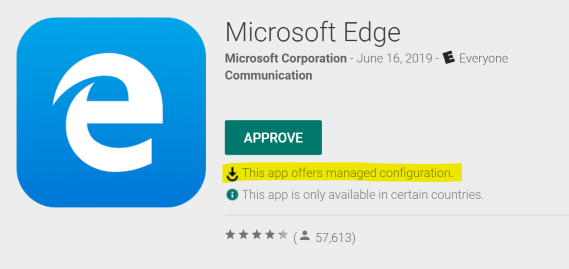
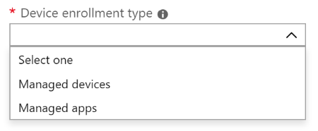
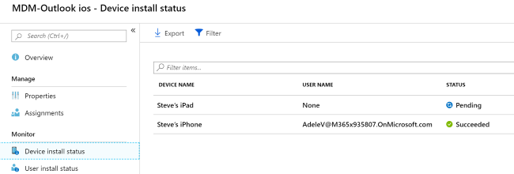
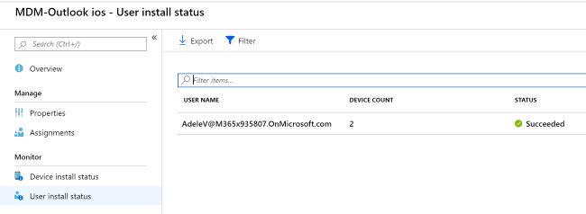
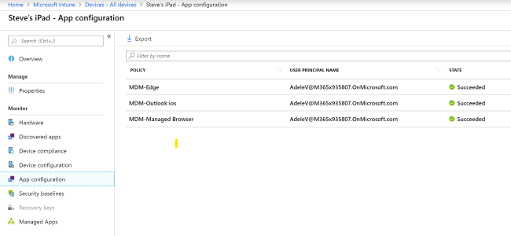
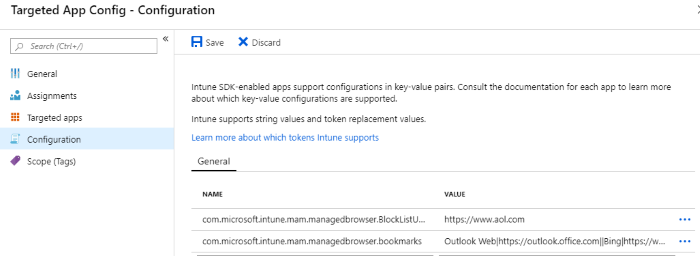

---
# required metadata

title: App configuration policies for Microsoft Intune
titleSuffix: 
description: Learn how to use app configuration policies on an iOS/iPadOS or Android device in Microsoft Intune.
keywords:
author: Erikre
ms.author: erikre
manager: dougeby
ms.date: 10/14/2022
ms.topic: how-to
ms.service: microsoft-intune
ms.subservice: apps
ms.localizationpriority: medium
ms.technology:
ms.assetid: 834B4557-80A9-48C0-A72C-C98F6AF79708

# optional metadata 

#ROBOTS:
#audience:

ms.reviewer: manchen
ms.suite: ems
search.appverid: MET150
#ms.tgt_pltfrm:
ms.custom: intune-azure
ms.collection:
- tier1
- M365-identity-device-management
- highpri
---

# App configuration policies for Microsoft Intune

App configuration policies can help you eliminate app setup problems by letting you assign configuration settings to a policy that is assigned to end-users before they run the app. The settings are then supplied automatically when the app is configured on the end-users device, and end-users don't need to take action. The configuration settings are unique for each app.

You can create and use app configuration policies to provide configuration settings for both iOS/iPadOS or Android apps. These configuration settings allow an app to be customized by using app configuration and management. The configuration policy settings are used when the app checks for these settings, typically the first time the app is run. 

An app configuration setting, for example, might require you to specify any of the following details:

- A custom port number
- Language settings
- Security settings
- Branding settings such as a company logo

If end-users were to enter these settings instead, they could do this incorrectly. App configuration policies can help provide consistency across an enterprise and reduce helpdesk calls from end-users trying to configure settings on their own. By using app configuration policies, the adoption of new apps can be easier and quicker.

The available configuration parameters and the implementation of the configuration parameters are decided by the developers of the application. Documentation from the application vendor should be reviewed to see what configurations are available and how the configurations influence the behavior of the application. For some applications, Intune will populate the available configuration settings. 

> [!NOTE]
> In the Managed Google Play Store, apps that support configuration will be marked as such:
> 
> 
>
> You will only see apps from [Managed Google Play store](https://play.google.com/work), not the [Google Play store](https://play.google.com/store/apps), when using Managed Devices as the Enrollment Type for Android devices.

You can assign an app configuration policy to a group of end-users and devices by using a combination of [include and exclude assignments](apps-inc-exl-assignments.md). As part of the process to add or update an app configuration policy, you can set the assignments for the app configuration policy. When you set the assignments for the policy, you can choose to include and exclude the [groups](../fundamentals/groups-add.md) of end-users for which the policy applies. When you choose to include one or more groups, you can choose to select specific groups to include or select built-in groups. Built-in groups include **All Users**, **All Devices**, and **All Users + All Devices**.

You can also use [filters](../fundamentals/filters.md) to refine the assignment scope when deploying app configuration policies for managed iOS and Android devices. You must first [create a filter](../fundamentals/filters.md#create-a-filter) using any of the available properties for iOS and Android. Then, in [Microsoft Intune admin center](https://go.microsoft.com/fwlink/?linkid=2109431) you can assign your managed app configuration policy by selecting **Apps** > **App configuration policies** > **Add** > **Managed devices** and go to the assignment page. After selecting a group, you can refine the applicability of the policy by choosing a filter and deciding to use it in **Include** or **Exclude** mode.

The app configuration policy workload provides a list of app configuration policies that have been created for your tenant. This list provides details, such as Name, Platform, Updated, Enrollment type, and Scope Tags. For additional details about a specific app configuration policy, select the policy. On the policy **Overview** pane, you can see specific details, such as the policy status based on device and based on user, as well as whether the policy has been assigned.

## Apps that support app configuration

App configuration can be delivered either through the mobile device management (MDM) OS channel on enrolled devices ([Managed App Configuration](https://developer.apple.com/library/content/samplecode/sc2279/Introduction/Intro.html) channel for iOS or the [Android in the Enterprise](https://developer.android.com/work/managed-configurations) channel for Android) or through the Mobile Application Management (MAM) channel.

Intune represents these different app configuration policy channels as:

- **Managed devices** - The device is managed by Intune as the unified endpoint management provider. The app must be pinned to the management profile on iOS/iPadOS or deployed through Managed Google Play on Android devices. In addition, the app supports the desired app configuration.
- **Managed apps** - An app that has either integrated the Intune App SDK or have been wrapped using the Intune Wrapping Tool and supports App Protection Policies (APP). In this configuration, neither the device's enrollment state or how the app is delivered to the device matter. The app supports the desired app configuration.



Apps may handle app configuration policy settings differently with respect to user preference. For example, with Outlook for iOS and Android, the Focused Inbox app configuration setting will respect the user setting, allowing the user to override admin intent. Other settings may let you control whether a user can or cannot change the setting based on the admin intent.

[!INCLUDE [android-supported-os](../includes/android-supported-os.md)]

### Managed devices

Selecting **Managed devices** as the **Device Enrollment Type** specifically refers to apps deployed by Intune on the enrolled device and thus are managed by Intune as the enrollment provider.

To support app configuration for apps deployed through Intune on enrolled devices, apps must be written to support the use of app configurations as defined by the OS. Consult your app vendor for details for which app config keys they support for delivery through the MDM OS channel. There are generally four scenarios for app configuration delivery in using the MDM OS channel:

- Only allow work or school accounts
- Account setup configuration settings
- General app configuration settings
- S/MIME configuration settings

### Managed apps

Selecting **Managed apps** as the **Device Enrollment Type** specifically refers to apps configured with an Intune App Protection Policy on devices regardless of the enrollment state.

To support app configuration through the MAM channel, the app must be integrated with [Intune App SDK](../developer/app-sdk.md). Line-of-business apps can either integrate the Intune App SDK or use the [Intune App Wrapping Tool](../developer/apps-prepare-mobile-application-management.md). For a comparison between the Intune App SDK and the Intune App Wrapping Tool, see [Prepare line-of-business apps for app protection policies](../developer/apps-prepare-mobile-application-management.md#feature-comparison).

Delivery of app configuration through the MAM channel does not require the device to be enrolled or for the app to be managed or delivered through the unified endpoint management solution. There are three scenarios for app configuration delivery using the MAM channel:

- General app configuration settings
- S/MIME configuration settings
- Advanced APP data protection settings which extend the capabilities offered by App Protection Policies

> [!NOTE]
> Intune managed apps will check-in with an interval of 30 minutes for Intune App Configuration Policy status, when deployed in conjunction with an Intune App Protection Policy. If an Intune App Protection Policy isn't assigned to the user, then the Intune App Configuration Policy check-in interval is set to 720 minutes.

For information on which apps support app configuration through the MAM channel, see [Microsoft Intune protected apps](apps-supported-intune-apps.md).

## Android Enterprise app configuration policies

For Android Enterprise app configuration policies, you can select the device enrollment type before creating an app configuration profile. You can account for certificate profiles that are based on enrollment type.

Enrollment type can be one of the following:

- **All Profile Types**: If a new profile is created and **All Profile Types** is selected for device enrollment type, you will not be able to associate a certificate profile with the app config policy. This option supports username and password authentication. If you use certificate-based authentication, don't use this option.
- **Fully Managed, Dedicated, and Corporate-Owned Work Profile Only**: If a new profile is created and **Fully Managed, Dedicated, and Corporate-Owned Work Profile Only** is selected, **Fully Managed, Dedicated, and Corporate-Owned Work Profile** certificate policies created under **Device** > **Configuration profiles** can be utilized. This option supports certificate-based authentication, and username and password authentication. **Fully Managed** relates to Android Enterprise fully managed devices (COBO). **Dedicated** relates to Android Enterprise dedicated devices (COSU). **Corporate-Owned Work Profile** relates to Android Enterprise corporate-owned work profile (COPE).
- **Personally-Owned Work Profile Only**: If a new profile is created and **Personally-Owned Work Profile Only** is selected, Work Profile certificate policies created under **Device** > **Configuration profiles** can be utilized. This option supports certificate-based authentication, and username and password authentication.

> [!NOTE]
> If you deploy a Gmail or Nine configuration profile to an Android Enterprise dedicated device work profile which doesn’t involve a user, it will fail because Intune can’t resolve the user.

> [!IMPORTANT]
> Existing policies created prior to the release of this feature (April 2020 release - 2004) that do not have any certificate profiles associated with the policy will default to **All Profile Types** for device enrollment type. Also, existing policies created prior to the release of this feature that have certificate profiles associated with them will default to Work Profile only.
> 
> Existing policies will not remediate or issue new certificates.

## Validate the applied app configuration policy

You can validate the app configuration policy using the following three methods:

   1. Verify the app configuration policy visibly on the device. Confirm that the targeted app is exhibiting the behavior applied in the app configuration policy.
   2. Verify via Diagnostic Logs (see the [Diagnostic Logs](#diagnostic-logs) section below).
   3. Verify in the Microsoft Intune admin center. In the [Microsoft Intune admin center](https://go.microsoft.com/fwlink/?linkid=2109431), select **Apps** > **All apps** > *select the related app**. Then, under the **Monitor** section, select either **Device install status** or **User install status**:

      

      

      Additionally,in the [Microsoft Intune admin center](https://go.microsoft.com/fwlink/?linkid=2109431), select **Devices** > **All Devices** > *select a device* > **App configuration**. The app configuration** pane will display all the assigned policies and their state:

      

## Diagnostic Logs

### iOS/iPadOS configuration on unmanaged devices

You can validate iOS/iPadOS configuration with the **Intune Diagnostic Log** for settings deployed through the managed app configuration policies. In addition to the below steps, you can access managed app logs using Microsoft Edge. For more information, see [Use Edge for iOS and Android to access managed app logs](manage-microsoft-edge.md#use-edge-for-ios-and-android-to-access-managed-app-logs).

1. If not already installed on the device, download and install the **Microsoft Edge** from the App Store. For more information, see [Microsoft Intune protected apps](apps-supported-intune-apps.md).
2. Launch the **Microsoft Edge** and enter **about:intunehelp** in the address box.
3. Click **Get Started**.
4. Click **Share Logs**.
5. Use the mail app of your choice to send the log to yourself so they can be viewed on your PC. 
6. Review **IntuneMAMDiagnostics.txt** in your text file viewer.
7. Search for `ApplicationConfiguration`. The results will look like the following:

    ``` JSON
        {
            (
                {
                    Name = "com.microsoft.intune.mam.managedbrowser.BlockListURLs";
                    Value = "https://www.aol.com";
                },
                {
                    Name = "com.microsoft.intune.mam.managedbrowser.bookmarks";
                    Value = "Outlook Web|https://outlook.office.com||Bing|https://www.bing.com";
                }
            );
        },
        {
            ApplicationConfiguration =             
            (
                {
                Name = IntuneMAMUPN;
                Value = "CMARScrubbedM:13c45c42712a47a1739577e5c92b5bc86c3b44fd9a27aeec3f32857f69ddef79cbb988a92f8241af6df8b3ced7d5ce06e2d23c33639ddc2ca8ad8d9947385f8a";
                },
                {
                Name = "com.microsoft.outlook.Mail.BlockExternalImagesEnabled";
                Value = true;
                }
            );
        }
    ```

Your application configuration details should match the application configuration policies configured for your tenant.



### iOS/iPadOS configuration on managed devices

You can validate iOS/iPadOS configuration with the **Intune Diagnostic Log** on managed devices for managed app configuration.

1. If not already installed on the device, download and install the **Microsoft Edge** from the App Store. For more information, see [Microsoft Intune protected apps](apps-supported-intune-apps.md).
2. Launch **Microsoft Edge** and enter **about:intunehelp** in the address box.
3. Click **Get Started**.
4. Click **Share Logs**.
5. Use the mail app of your choice to send the log to yourself so they can be viewed on your PC. 
6. Review **IntuneMAMDiagnostics.txt** in your text file viewer.
7. Search for `AppConfig`. Your results should match the application configuration policies configured for your tenant.

### Android configuration on managed devices

You can validate Android configuration with the **Intune Diagnostic Log** on managed devices for managed app configuration.

To collect logs from an Android device, you or the end user must download the logs from the device via a USB connection (or the **File Explorer** equivalent on the device). Here are the steps:

1. Connect the Android device to your computer with the USB cable.
2. On the computer, look for a directory that has the name of your device. In that directory, find `Android Device\Phone\Android\data\com.microsoft.windowsintune.companyportal`.
3. In the `com.microsoft.windowsintune.companyportal` folder, open the Files folder and open `OMADMLog_0`.
4. Search for `AppConfigHelper` to find app configuration related messages. The results will look similar to the following block of data:

    `2019-06-17T20:09:29.1970000       INFO   AppConfigHelper     10888  02256  Returning app config JSON [{"ApplicationConfiguration":[{"Name":"com.microsoft.intune.mam.managedbrowser.BlockListURLs","Value":"https:\/\/www.aol.com"},{"Name":"com.microsoft.intune.mam.managedbrowser.bookmarks","Value":"Outlook Web|https:\/\/outlook.office.com||Bing|https:\/\/www.bing.com"},{"Name":"com.microsoft.intune.mam.managedbrowser.homepage","Value":"https:\/\/www.arstechnica.com"}]},{"ApplicationConfiguration":[{"Name":"IntuneMAMUPN","Value":"AdeleV@M365x935807.OnMicrosoft.com"},{"Name":"com.microsoft.outlook.Mail.NotificationsEnabled","Value":"false"},{"Name":"com.microsoft.outlook.Mail.NotificationsEnabled.UserChangeAllowed","Value":"false"}]}] for user User-875363642`

## Graph API support for app configuration

You can use Graph API to accomplish app configuration tasks. For details, see [Graph API Reference MAM Targeted Config](/graph/api/resources/intune-shared-targetedmanagedappconfiguration?view=graph-rest-beta&viewFallbackFrom=graph-rest-1.0&preserve-view=true). For more information about Intune and Graph, see [Working with Intune in Microsoft Graph](/graph/api/resources/intune-graph-overview?view=graph-rest-1.0&preserve-view=true).

## Troubleshooting

### Using logs to show a configuration parameter

When the logs show a configuration parameter that is confirmed to be applying but doesn't seem to work, there may be an issue with the configuration implementation by the app developer. Reaching out to that app developer first, or checking their knowledge base, may save you a support call with Microsoft. If it is an issue with how the configuration is being handled within an app, it would have to be addressed in a future updated version of that app.

## Next steps

### Managed devices

- Learn how to use app configuration with your iOS/iPadOS devices.  See [Add app configuration policies for managed iOS/iPadOS devices](app-configuration-policies-use-ios.md).
- Learn how to use app configuration with your Android devices.  See [Add app configuration policies for managed Android devices](app-configuration-policies-use-android.md).

### Managed apps

- Learn how to use app configuration with managed apps. See [Add app configuration policies for managed apps without device enrollment](app-configuration-policies-managed-app.md).
