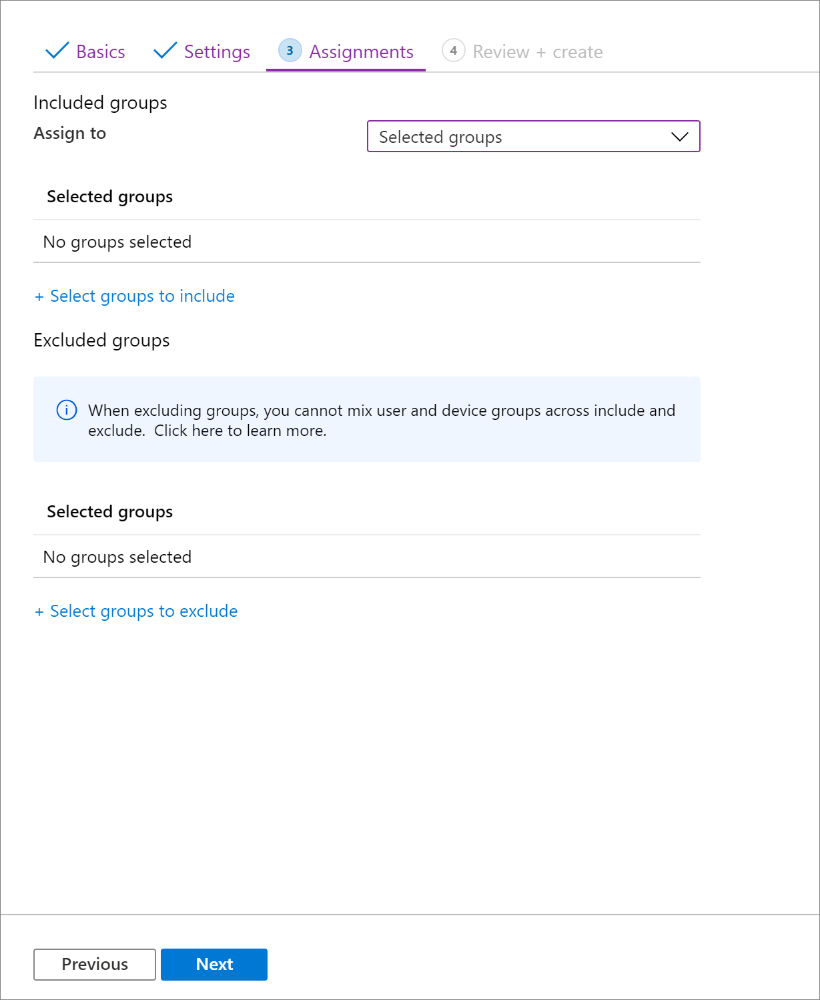
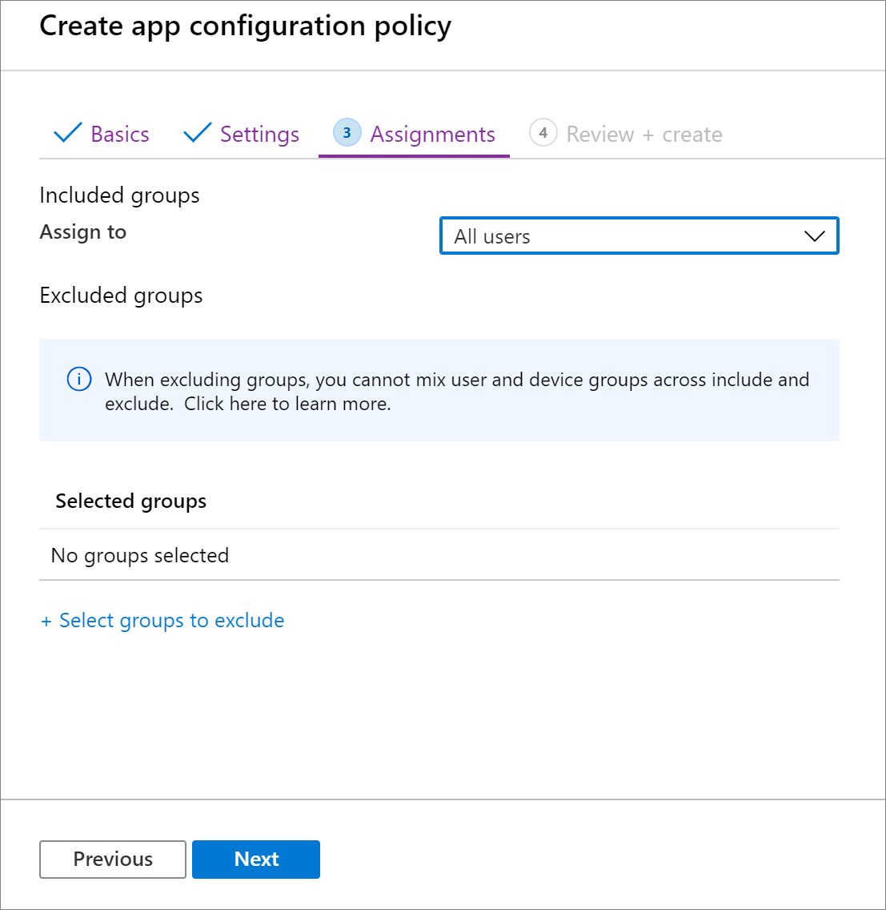
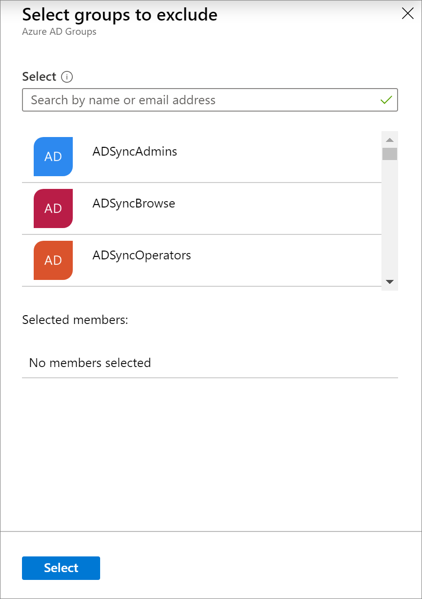

---
# required metadata

title: Add app configuration policies for managed iOS/iPadOS devices
titleSuffix: Microsoft Intune
description: Learn how to use app configuration policies to provide configuration data to an iOS/iPadOS app when it is run.
keywords:
author: Erikre
ms.author: erikre
manager: dougeby
ms.date: 03/29/2022
ms.topic: how-to
ms.service: microsoft-intune
ms.subservice: apps
ms.localizationpriority: medium
ms.technology:
ms.assetid: c9163693-d748-46e0-842a-d9ba113ae5a8

# optional metadata

#ROBOTS:
#audience:

ms.reviewer: manchen
ms.suite: ems
search.appverid: MET150
#ms.tgt_pltfrm:
ms.custom: intune-azure
ms.collection:
- M365-identity-device-management
- iOS/iPadOS
- highpri
---

# Add app configuration policies for managed iOS/iPadOS devices

[!INCLUDE [azure_portal](../includes/azure_portal.md)]

Use app configuration policies in Microsoft Intune to provide custom configuration settings for an iOS/iPadOS app. These configuration settings allow an app to be customized based on the app suppliers direction. You must get these configuration settings (keys and values) from the supplier of the app. To configure the app, you specify the settings as keys and values, or as XML containing the keys and values.

As the Microsoft Intune admin, you can control which user accounts are added to Microsoft Office applications on managed devices. You can limit access to only allowed organization user accounts and block personal accounts on enrolled devices. The supporting applications process the app configuration and remove and block unapproved accounts. The configuration policy settings are used when the app checks for them, typically the first time it is run.

Once you add an app configuration policy, you can set the assignments for the app configuration policy. When you set the assignments for the policy, you can choose to include and exclude the groups of users for which the policy applies. When you choose to include one or more groups, you can choose to select specific groups to include or select built-in groups. Built-in groups include **All Users**,  **All Devices**, and **All Users + All Devices**. 

> [!NOTE]
> Intune provides pre-created **All Users** and **All Devices** groups in the console with built-in optimizations for your convenience. It is highly recommended that you use these groups to target all users and all devices instead of any 'All users' or 'All devices' groups you may have created yourself.

Once you have selected the included groups for your application configuration policy, you can also choose the specific groups to exclude. For more information, see [Include and exclude app assignments in Microsoft Intune](apps-inc-exl-assignments.md).

> [!TIP]
> This policy type is currently available only for devices running iOS/iPadOS 8.0 and later. It supports the following app installation types:
>
> - **Managed iOS/iPadOS app from the app store**
> - **App package for iOS**
>
> For more information about app installation types, see [How to add an app to Microsoft Intune](apps-add.md). For more information about incorporating app config into your .ipa app package for managed devices, see Managed App Configuration in the [iOS developer documentation](https://developer.apple.com/library/archive/samplecode/sc2279/Introduction/Intro.html).

## Create an app configuration policy

1. Sign in to the [Microsoft Endpoint Manager admin center](https://go.microsoft.com/fwlink/?linkid=2109431).
2. Choose the **Apps** > **App configuration policies** > **Add** > **Managed devices**. Note that you can choose between **Managed devices** and **Managed apps**. For more information see [Apps that support app configuration](app-configuration-policies-overview.md#apps-that-support-app-configuration).
3. On the **Basics** page, set the following details:
    - **Name** - The name of the profile that appears in the Microsoft Endpoint Manager admin center.
    - **Description** - The description of the profile that appears in the Microsoft Endpoint Manager admin center.
    - **Device enrollment type** - This setting is set to **Managed devices**.
4. Select **iOS/iPadOS** as the **Platform**.
5. Click **Select app** next to **Targeted app**. The **Associated app** pane is displayed. 
6. On the **Targeted app** pane, choose the managed app to associate with the configuration policy and click **OK**.
7. Click **Next** to display the **Settings** page.
8. In the dropdown box, select the **Configuration settings format**. Select one of the following methods to add configuration information:
    - **Use configuration designer**
    - **Enter XML data**<br><br>
    For details about using the configuration designer, see [Use configuration designer](#use-configuration-designer). For details about entering XML data, see [Enter XML data](#enter-xml-data). 
9. Click **Next** to display the **Assignments** page.
10. In the dropdown box next to **Assign to**, select either **Selected groups**, **All users**, **All devices**, or **All users and all devies** to assign the app configuration policy to.

    

11. Select **All users** in the dropdown box.

    

12. Click **Select groups to exclude** to display the related pane.

    

13. Choose the groups you want to exclude and then click **Select**.

    >[!NOTE]
    >When adding a group, if any other group has already been included for a given assignment type, it is pre-selected and unchangeable for other include assignment types. Therefore, that group that has been used, cannot be used as an excluded group.

14. Click **Next** to display the **Review + create** page.
15. Click **Create** to add the app configuration policy to Intune.

## Use configuration designer

Microsoft Intune provides configuration settings that are unique to an app. You can use the configuration designer for apps on devices that are enrolled or not enrolled in Microsoft Intune. The designer lets you configure specific configuration keys and values that helps you create the underlying XML. You must also specify the data type for each value. These settings are supplied to apps automatically when the apps are installed.

### Add a setting

1. For each key and value in the configuration, set:
   - **Configuration key** - The case sensitive key that uniquely identifies the specific setting configuration.
   - **Value type** - The data type of the configuration value. Types include Integer, Real, String, or Boolean.
   - **Configuration value** - The value for the configuration.
2. Choose **OK** to set your configuration settings.

### Delete a setting

1. Choose the ellipsis (**...**) next to the setting.
2. Select **Delete**.

The \{\{ and \}\} characters are used by token types only and must not be used for other purposes.

### Allow only configured organization accounts in apps

As the Microsoft Intune administrator, you can control which work or school accounts are added to Microsoft apps on managed devices. You can limit access to only allowed organization user accounts and block personal accounts within the apps (if supported) on enrolled devices. For iOS/iPadOS devices, use the following key/value pairs in a Managed Devices app configuration policy:

| **Key** | **Values** |
|----|----|
| IntuneMAMAllowedAccountsOnly | <ul><li>**Enabled**: The only account allowed is the managed user account defined by the [IntuneMAMUPN](data-transfer-between-apps-manage-ios.md#configure-user-upn-setting-for-microsoft-intune-or-third-party-emm) key.</li><li>**Disabled** (or any value that is not a case insensitive match to **Enabled**): Any account is allowed.</li></ul> |
| IntuneMAMUPN | <ul><li>UPN of the account allowed to sign into the app.</li><li> For Intune enrolled devices, the <code>{{userprincipalname}}</code> token may be used to represent the enrolled user account.</li></ul>  |

   > [!NOTE]
   > The following apps process the above app configuration and only allow organization accounts:
   > - Edge for iOS (44.8.7 and later)
   > - Office, Word, Excel, PowerPoint for iOS (2.41 and later)
   > - OneDrive for iOS (10.34 and later)
   > - OneNote for iOS (2.41 and later)
   > - Outlook for iOS (2.99.0 and later)
   > - Teams for iOS (2.0.15 and later)

### Require configured organization accounts in apps

On enrolled devices, organizations can require that the work or school account is signed into managed Microsoft apps in order to receive Org data from other managed apps. For example, consider the scenario where the user has attachments included in email messages contained within the managed email profile located in the native iOS mail client. If the user attempts to transfer the attachments to a Microsoft app, like Office, that is managed on the device and has these keys applied, then this configuration will treat the transferred attachment as Org data, requiring the work or school account to be signed in and enforcing the app protection policy settings.

For iOS/iPadOS devices, use the following key/value pairs in a Managed Devices app configuration policy for each Microsoft app:

| **Key** | **Values** |
|----|----|
| IntuneMAMRequireAccounts | <ul><li>Enabled: The app requires the user to sign-in to the managed user account defined by the [IntuneMAMUPN](data-transfer-between-apps-manage-ios.md#configure-user-upn-setting-for-microsoft-intune-or-third-party-emm) key to receive Org data.</li><li>Disabled (or any value that is not a case insensitive match to Enabled): No account sign-in is required</li></ul>  |
| IntuneMAMUPN | <ul><li>UPN of the account allowed to sign into the app.</li><li> For Intune enrolled devices, the <code>{{userprincipalname}}</code> token may be used to represent the enrolled user account.</li></ul>  |

> [!NOTE]
> Apps must have Intune APP SDK for iOS version 12.3.3 or later and be targeted with an [Intune app protection policy](app-protection-policy.md) when requiring sign-in to work or school account. Within the app protection policy, the “Receive data from other apps” must be set to “All apps with incoming Org data”.  

At this time, app sign-in is only required when there is incoming Org data to a targeted app.

## Enter XML data

You can type or paste an XML property list that contains the app configuration settings for devices enrolled in Intune. The format of the XML property list varies depending on the app that you are configuring. For details about the exact format to use, contact the supplier of the app.

Intune validates the XML format. However, Intune does not check that the XML property list (PList) works with the target app.

To learn more about XML property lists:

- Refer to [Understand XML Property Lists](https://developer.apple.com/library/ios/documentation/Cocoa/Conceptual/PropertyLists/UnderstandXMLPlist/UnderstandXMLPlist.html) in the iOS Developer Library.

### Example format for an app configuration XML file

When you create an app configuration file, you can specify one or more of the following values by using this format:

```xml
<dict>
  <key>userprincipalname</key>
  <string>{{userprincipalname}}</string>
  <key>mail</key>
  <string>{{mail}}</string>
  <key>partialupn</key>
  <string>{{partialupn}}</string>
  <key>accountid</key>
  <string>{{accountid}}</string>
  <key>deviceid</key>
  <string>{{deviceid}}</string>
  <key>userid</key>
  <string>{{userid}}</string>
  <key>username</key>
  <string>{{username}}</string>
  <key>serialnumber</key>
  <string>{{serialnumber}}</string>
  <key>serialnumberlast4digits</key>
  <string>{{serialnumberlast4digits}}</string>
  <key>udidlast4digits</key>
  <string>{{udidlast4digits}}</string>
  <key>aaddeviceid</key>
  <string>{{aaddeviceid}}</string>
  <key>IsSupervised</key>
  <string>{{IsSupervised}}</string>
</dict>
```

### Supported XML PList data types

Intune supports the following data types in a property list:

- &lt;integer&gt;
- &lt;real&gt;
- &lt;string&gt;
- &lt;array&gt;
- &lt;dict&gt;
- &lt;true /&gt; or &lt;false /&gt;

### Tokens used in the property list

Additionally, Intune supports the following token types in the property list:
- \{\{userprincipalname\}\}—for example, **John\@contoso.com**
- \{\{mail\}\}—for example, **John\@contoso.com**
- \{\{partialupn\}\}—for example, **John**
- \{\{accountid\}\}—for example, **fc0dc142-71d8-4b12-bbea-bae2a8514c81**
- \{\{deviceid\}\}—for example, **b9841cd9-9843-405f-be28-b2265c59ef97**
- \{\{userid\}\}—for example, **3ec2c00f-b125-4519-acf0-302ac3761822**
- \{\{username\}\}—for example, **John Doe**
- \{\{serialnumber\}\}—for example, **F4KN99ZUG5V2** (for iOS/iPadOS devices)
- \{\{serialnumberlast4digits\}\}—for example, **G5V2** (for iOS/iPadOS devices)
- \{\{aaddeviceid\}\}—for example, **ab0dc123-45d6-7e89-aabb-cde0a1234b56**
- \{\{issupervised\}\}—for example, **True** (for iOS/iPadOS devices)

## Configure the Company Portal app to support iOS and iPadOS devices enrolled with Automated Device Enrollment

Apple's Automated Device Enrollments are not compatible with the app store version of the Company Portal app by default. However, you can configure the Company Portal app to support iOS/iPadOS DEP devices even when users have downloaded the Company Portal from the App Store by using the following steps.

1. In [Microsoft Endpoint Manager admin center](https://go.microsoft.com/fwlink/?linkid=2109431), add the Intune Company Portal app if it has not been added yet, by going to **Apps** > **All apps** > **Add**.
2. Go to **Apps** > **App configuration policies**, to create an app configuration policy for the Company Portal app.
3. Create an app configuration policy with the XML below. More information on how to create an app configuration policy and enter XML data can be found at [Add app configuration policies for managed iOS/iPadOS devices](app-configuration-policies-use-ios.md).

    - **Use the Company Portal on an Automated Device Enrollment (ADE) device enrolled with user affinity**: 
    
        > [!NOTE]
        > When the enrollment profile has **"Install Company Portal"** set to yes, Intune pushes the application configuration policy below automatically as part of the initial enrollment process. This configuration should not be deployed manually to users or devices as this will cause a conflict with the payload already sent during enrollment, resulting on end-users being asked to download a new management profile after signing in to Company Portal (when they shouldn't, because there is a management profile already installed on these devices).

        ``` xml
        <dict>
            <key>IntuneCompanyPortalEnrollmentAfterUDA</key>
            <dict>
                <key>IntuneDeviceId</key>
                <string>{{deviceid}}</string>
                <key>UserId</key>
                <string>{{userid}}</string>
            </dict>
        </dict>
        ```
    - **Use the Company Portal on a DEP device enrolled without user affinity (also known as Device Staging)**:

        > [!NOTE]
        > The user signing in to Company Portal is set as the primary user of the device.

        ``` xml
        <dict>
            <key>IntuneUDAUserlessDevice</key>
            <string>{{SIGNEDDEVICEID}}</string>
        </dict>
        ```    

4. Deploy the Company Portal to devices with the app configuration policy targeted to desired groups. Be sure to only deploy the policy to groups of devices that are already DEP enrolled.
5. Tell end users to sign into the Company Portal app when it is automatically installed.

> [!NOTE]
> When you add an app configuration to allow the Company Portal app on DEP devices without user affinity, you may experience a `STATE Policy Error`. Unlike other app configurations, this situation does not apply every time the device checks in. Instead, this app configuration is meant to be a one-time operation to enable existing devices enrolled without user affinity to attain user affinity when a user signs into the Company Portal. This app configuration is removed from the policy in the background once it has been successfully applied. The policy assignment will exist, but it will not report "success" once the app configuration is removed in the background. Once the app configuration policy has applied to the device, you can unassign the policy.

## Monitor iOS/iPadOS  app configuration status per device 
Once a configuration policy has been assigned, you can monitor iOS/iPadOS app configuration status for each managed device. From **Microsoft Intune** in the [Microsoft Endpoint Manager admin center](https://go.microsoft.com/fwlink/?linkid=2109431), select **Devices** > **All devices**. From the list of managed devices, select a specific device to display a pane for the device. On the device pane, select **App configuration**.  

## Additional information

- [Deploying Outlook for iOS/iPadOS and Android app configuration settings](/exchange/clients-and-mobile-in-exchange-online/outlook-for-ios-and-android/outlook-for-ios-and-android-configuration-with-microsoft-intune)

## Next steps

Continue to [assign](apps-deploy.md) and [monitor](apps-monitor.md) the app.
