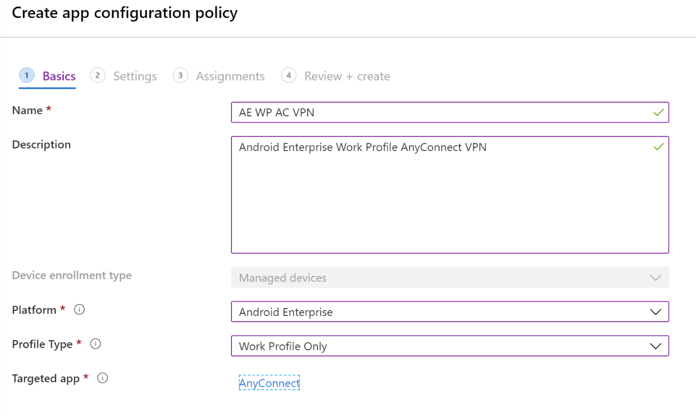
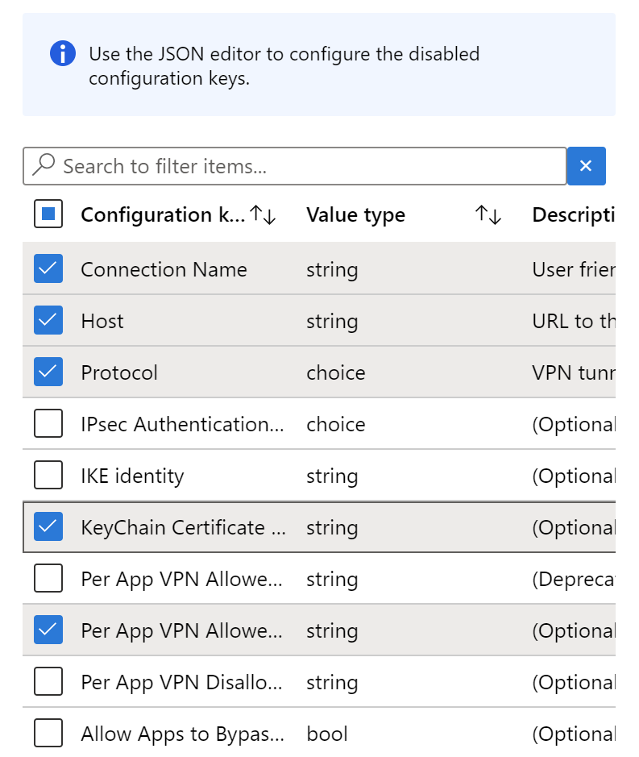
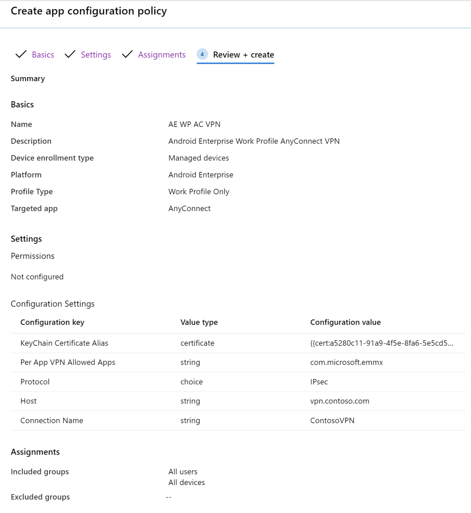
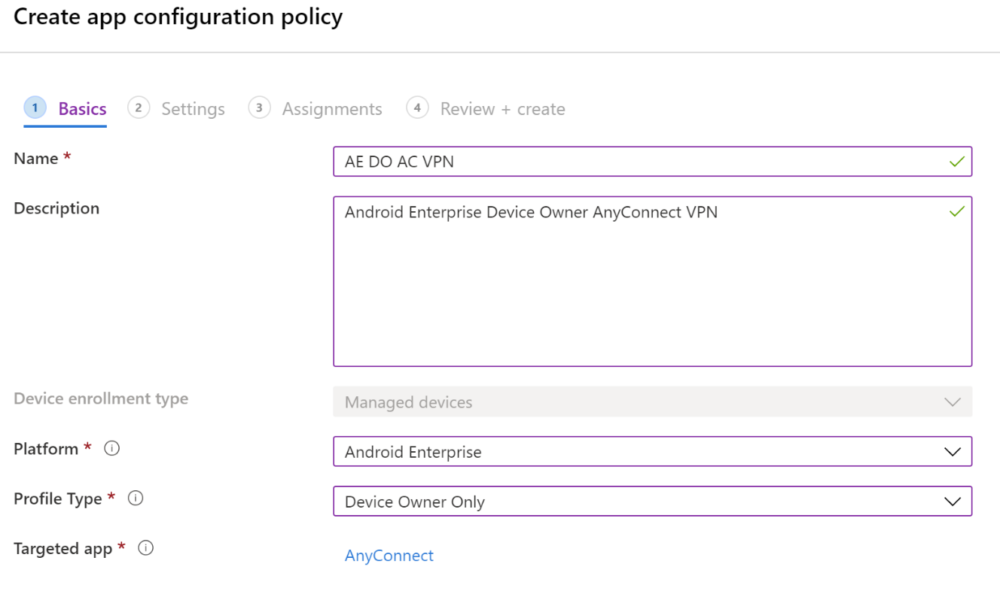
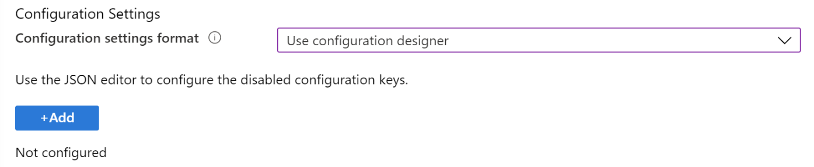
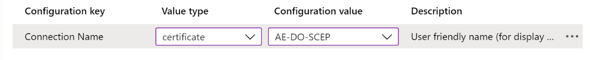
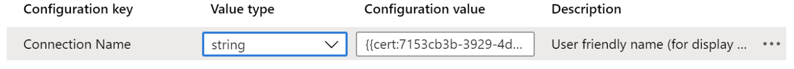
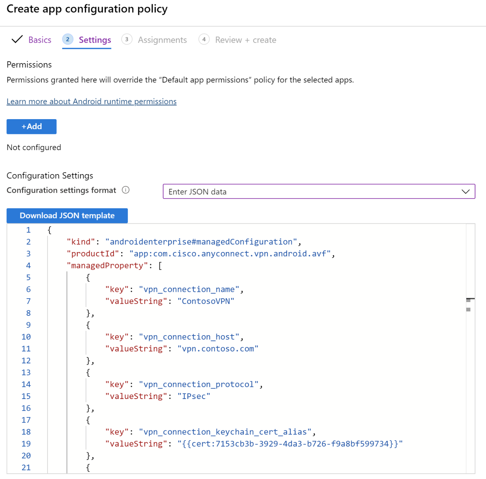

---
# required metadata

title: Configure a VPN for Android Enterprise devices
titleSuffix: Microsoft Intune
description: Use an app protection policy toc configure a VPN for Android Enterprise devices.
keywords:
author: Erikre
ms.author: erikre
manager: dougeby
ms.date: 06/01/2020
ms.topic: how-to
ms.service: microsoft-intune
ms.subservice: apps
ms.localizationpriority: high
ms.technology:
ms.assetid: 

# optional metadata

#ROBOTS:
#audience:

ms.reviewer: tycast
ms.suite: ems
search.appverid: MET150
#ms.tgt_pltfrm:
ms.custom: 
ms.collection: M365-identity-device-management
---

# Configure a VPN for Android Enterprise devices

This topic describes how to create an app configuration policy, which can be deployed in conjunction with a VPN client on Android Enterprise devices. This configuration will allow network traffic for chosen applications to access corporate resources.

> [!NOTE]
> The Android platform does not currently support the automatic triggering of a VPN client connection when one of the chosen applications is opened. The VPN connection must be initiated manually first, or you can use [always-on VPN](../configuration/vpn-settings-android-enterprise.md).

The pre-requisites for creating a configuration policy to achieve successful VPN access includes the capability of the chosen VPN client to support managed application configuration profiles. Currently, the VPN clients that support Intune app configuration policy includes:
- Cisco AnyConnect
- Citrix SSO
- F5 Access
- Palo Alto Global Connect
- Pulse Secure
- SonicWall Mobile Connect

If the method for authentication access to the VPN endpoint requires the use of client certificates, then the certificate profiles should be created in advance to help populate the required values for the app configuration policy.

> [!NOTE]
> While Android Enterprise work profile scenarios support both SCEP and PKCS certificates, Android Enterprise device owner scenarios currently only support SCEP certificates. 

The basic flow for creating and testing the per-app VPN profile is the following steps:
1.	Choose the appropriate VPN client application for your infrastructure.
2.	Identify the application package IDs of the productivity apps that you wish to use with the VPN connection.
3.	Deploy any certificate profiles required for meeting authentication requirements of the VPN connection. Make sure to verify successful deployment.
4.	Deploy the VPN client application.
5.	Prepare the app configuration-based VPN profile using information collected during earlier steps.
6.	Deploy the newly created VPN profile.
7.	Validate that the VPN client app will successfully connect to your VPN server infrastructure.
8.	Validate that traffic from your chosen productivity apps successfully transits the VPN when it is active.

## Get the app package ID

Identify the package ID for each application that you wish to give VPN access to. For publicly available applications, consider getting the package IDs for each of the applications in the Google Play store. The displayed URL for each application includes the package ID. For example, the package ID for the Android version of the Microsoft Edge browser is `com.microsoft.emmx`. The package ID is included as part of the URL.


For Line of Business (LOB) apps, ask your vendor or application development team to provide the relevant package ID.

## Certificates

In this topic, we assume your VPN connection will use certificate-based authentication, and that you have successfully deployed all the certificates in the chain needed for client authentication to succeed. Typically, this would be the client certificate, any intermediate certificates, as well as the root certificate.
For additional information about certificate deployment for Android Enterprise, start by reviewing the topic, [Use certificates for authentication in Microsoft Intune](../protect/certificates-configure.md).

Once your client authentication certificate profile has been deployed, you need some details about that profile to build the VPN app configuration policy.
If you’re not familiar with creating app configuration profiles, see the topic [Add app configuration policies for managed Android Enterprise devices](../apps/app-configuration-policies-use-android.md).
 

## Build the VPN Profile

There are two ways to build the app configuration policy for your VPN app. You can use the **configuration designer** or the **JSON data** option. The **JSON data** option is required when not all the required VPN settings are available in the **configuration designer** method. Consult your VPN vendor if you determine the JSON option is needed for support. In this topic, we will show examples of both methods. In both the **JSON data** and **configuration designer** methods, you can successfully incorporate certificate-based authentication. When using the **JSON data** method, you can start by using the **configuration designer** to extract the necessary profile values.

> [!NOTE]
> While many of the VPN client configuration parameters are similar, each app has its unique keys and options. Consult with your VPN vendor if questions arise. 

## Use the Configuration Designer Flow

1.	Start by adding a new app configuration policy for **Managed devices**.
2.	Enter an appropriate name.
3.	Select **Android Enterprise** as the platform.
4.	Select either **Work Profile Only** or **Device Owner Only** as the profile type if certificate-based authentication is required. The **Work Owner and Device Owner Profile** is not compatible with certificate-based authentication.
5.	For the targeted app, select the VPN client you have deployed; in this example we use the previously deployed Cisco AnyConnect VPN client

  

6. On the next page, use the configuration settings drop down and select the **Use Configuration designer** option.

  

7. Click **Add** to bring up the list of configuration keys.
8.	Select all the configuration keys you require for your chosen configuration. In this example, we use a minimal list to set for an AnyConnect VPN including certificate-based authentication and per-app VPN.
  
  

9. Enter appropriate values for the **Connection Name**, **Host**, and **Protocol** keys.

    

  > [!NOTE]
  > The names of these keys may vary depending on which VPN Client application you build the policy for.

10.	Enter the application package ID(s) you collected earlier in the **Per App VPN Allowed Apps** key.

    

11.	In the **KeyChain Certificate Alias** (optional) key switch the **Value type** from **string** to **certificate**, this will allow you to pick the correct client certificate profile to be used with VPN authentication.

    

12.	On the next page, choose any appropriate scope tags.
13.	On the next page, enter the appropriate groups to which you wish to deploy the app configuration policy.
14.	Select **Create** to complete the creation and deployment of the policy.

    

## Use the JSON Flow

Create a temporary profile:
1.	Start by adding a new app configuration policy for **Managed devices**.
2.	Enter an appropriate name (the use of this profile is temporary as it will NOT be saved).
3.	Select **Android Enterprise** as the platform.
4.	For the targeted app, select the VPN client you have deployed.
5.	Select either **Work Profile Only** or **Device Owner Only** as the profile type if certificate-based authentication is required. The **Work Owner and Device Owner Profile** is not compatible with certificate-based authentication.

    

6.	On the next page, use the **Configuration Settings** drop down and select the option **Use configuration designer**.

    

7.	Click **Add** to bring up the list of configuration keys.
8.	Select any one of the keys with a **Value type** of **string**, and click **OK**.

  

9.	Now change the **Value type** from **string** to **certificate**. This will allow you to pick the correct client certificate profile to be used with VPN authentication.

    

10.	Immediately change the **Value type** back to **string**. Note that the **Configuration value** changes to a token of format `{{cert:GUID}}`.
11.	Select and copy the token representation of the certificate to an alternate location, such as a text editor.

    

12.	Discard the profile being created – the only purpose of the previous steps was to determine the certificate token.

### Create the VPN profile

1.	Start by adding a new application configuration profile for **Managed devices**.
2.	Enter an appropriate name.
3.	Select **Android Enterprise** as the platform.
4.	For the targeted app, select the VPN client you have deployed.
5.	Select either **Work Profile Only** or **Device Owner Only** as the profile type if certificate-based authentication is required. The **Work Owner and Device Owner Profile** is not compatible with certificate-based authentication.
6.	Use the **Configuration Settings** drop down and select the option **Enter JSON data**.
7.	You can edit the JSON directly or if you prefer, use the **Download JSON template** button to download and then modify the template in an external editor of your choice. Be careful with text editors that have the option to use  **Smart quotes**, as their inclusion would render the JSON invalid.

    

8.	Regardless of which method you use, once you have populated the values you require for the desired configuration all remaining settings with a "STRING_VALUE" or STRING_VALUE value in the entire JSON must be removed.

#### Example JSON for F5 Access VPN

The following is an example of JSON data for F5 Access VPN.

``` JSON
{
    "kind": "androidenterprise#managedConfiguration",
    "productId": "app:com.f5.edge.client_ics",
    "managedProperty": [
        {
            "key": "disallowUserConfig",
            "valueBool": false
        },
        {
            "key": "vpnConfigurations",
            "valueBundleArray": [
                {
                    "managedProperty": [
                        {
                            "key": "name",
                            "valueString": "MyCorpVPN"
                        },
                        {
                            "key": "server",
                            "valueString": "vpn.contoso.com"
                        },
                        {
                            "key": "weblogonMode",
                            "valueBool": false
                        },
                        {
                            "key": "fipsMode",
                            "valueBool": false
                        },
                        {
                            "key": "clientCertKeychainAlias",
                            "valueString": "{{cert:77333880-14e9-0aa0-9b2c-a1bc6b913829}}"
                        },
                        {
                            "key": "allowedApps",
                            "valueString": "com.microsoft.emmx"
                        },
                        {
                            "key": "mdmAssignedId",
                            "valueString": ""
                        },
                        {
                            "key": "mdmInstanceId",
                            "valueString": ""
                        },
                        {
                            "key": "mdmDeviceUniqueId",
                            "valueString": ""
                        },
                        {
                            "key": "mdmDeviceWifiMacAddress",
                            "valueString": ""
                        },
                        {
                            "key": "mdmDeviceSerialNumber",
                            "valueString": ""
                        },
                        {
                            "key": "allowBypass",
                            "valueBool": false
                        }
                    ]
                }
            ]
        }
    ]
}
```

## Summary

Using an app configuration policy for Android Enterprise enrolled devices enables you to leverage per-app VPN behavior despite the absence of direct support for it in the platform. 

## Additional information

For related information, see the following topics:
- [Add app configuration policies for managed Android Enterprise devices](../apps/app-configuration-policies-use-android.md)
- [Android Enterprise device settings to configure VPN in Intune](../configuration/vpn-settings-android-enterprise.md)

## Next steps

- [Create VPN profiles to connect to VPN servers in Intune](../configuration/vpn-settings-configure.md)
