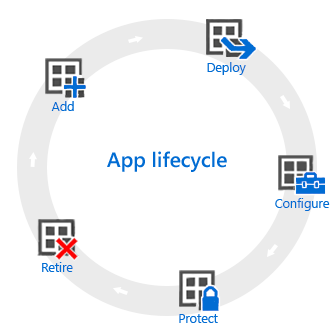

---
# required metadata

title: Overview of the app lifecycle for Microsoft Intune
description: Learn about the managed apps lifecycle in Microsoft Intune. The app lifecycle involves adding, deploying, configuring, protecting, and retiring apps.
keywords:
author: Erikre
ms.author: erikre
manager: dougeby
ms.date: 03/29/2022
ms.topic: conceptual
ms.service: microsoft-intune
ms.subservice: apps
ms.localizationpriority: medium
ms.technology:
ms.assetid: 60347012-bc3f-4b9a-a4f4-6d3c5021a6e6

# optional metadata

#ROBOTS:
#audience:

ms.reviewer: manchen
ms.suite: ems
search.appverid: MET150
#ms.tgt_pltfrm:
ms.custom: apps; get-started
ms.collection:
- tier1
- M365-identity-device-management
---

# Overview of the app lifecycle in Microsoft Intune

The Microsoft Intune app lifecycle begins when an app is added and progresses through additional phases until you remove the app. By understanding these phases, you'll have the details you need to get started with app management in Intune.

## Add

The first step in app deployment is to add the apps, which you want to manage and assign, to Intune. While you can work with many different app types, the basic procedures are the same. With  Intune you can add different app types, including apps written in-house (line-of-business), apps from the store, apps that are built in, and apps on the web. For more information about each of these app types, see [How to add an app to Microsoft Intune](apps-add.md).

## Deploy

After you've added the app to Intune, you can then [assign it to users and devices that you manage](apps-deploy.md). Intune makes this process easy, and after the app is deployed, you can [monitor the success](apps-monitor.md) of the deployment from the Intune within the portal. Additionally, in some app stores, such as the [Apple](vpp-apps-ios.md) and [Windows](windows-store-for-business.md) app stores, you can purchase app licenses in bulk for your company. Intune can synchronize data with these stores so that you can deploy and track license usage for these types of apps right from the Intune administration console.

## Configure

As part of the app lifecycle, new versions of apps are regularly released. Intune provides tools to easily [update apps](apps-add.md) that you have deployed to a newer version. Additionally, you can configure extra functionality for some apps, for example:

- [iOS/iPadOS app configuration policies](app-configuration-policies-use-ios.md) supply settings for compatible iOS/iPadOS apps that are used when the app is run. For example, an app might require specific branding settings or the name of a server to which it must connect.
- [Managed browser policies](manage-microsoft-edge.md) help you to configure settings for the [Microsoft Edge](apps-supported-intune-apps.md#microsoft-apps), which replaces the default device browser and lets you restrict the websites that your users can visit.

## Protect

Intune gives you many ways to help protect the data in your apps. The main methods are:

- [Conditional Access](../protect/conditional-access.md), which controls access to email and other services based on conditions that you specify. Conditions include device types or compliance with a [device compliance policy](../protect/device-compliance-get-started.md) that you deployed.
- [App protection policies](app-protection-policy.md) works with individual apps to help protect the company data that they use. For example, you can restrict copying data between unmanaged apps and apps that you manage, or you can prevent apps from running on devices that have been jailbroken or rooted.

## Retire

Eventually, it's likely that apps that you deployed become outdated and need to be removed. Intune makes it easy to uninstall apps. For more information, see [Uninstall an app](../apps/apps-add.md#uninstall-an-app).

## Next steps

- Learn about [app management in Microsoft Intune](app-management.md)
