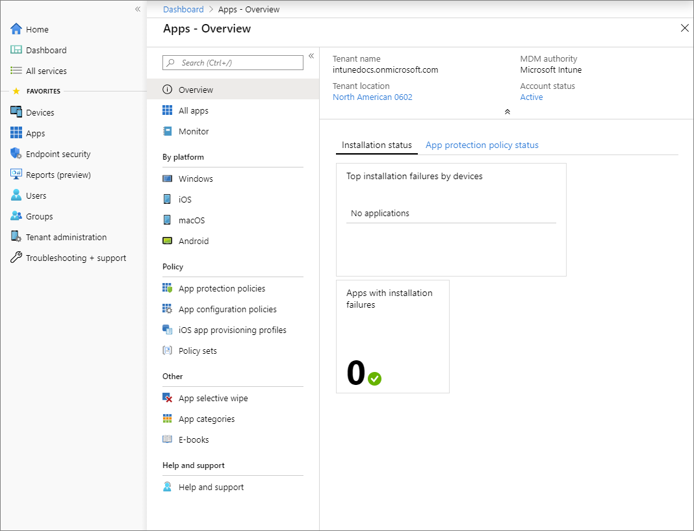

---
# required metadata

title: What is app management in Microsoft Intune?
titleSuffix:
description: Learn about client app management capabilities by platform for Microsoft Intune.
keywords:
author: Erikre
ms.author: erikre
manager: dougeby
ms.date: 12/02/2024
ms.topic: overview
ms.service: microsoft-intune
ms.subservice: apps
ms.localizationpriority: high
ms.assetid: 1975a2dc-3a14-4cb9-9afb-e2ba01a1c51b

# optional metadata

#audience:
#ROBOTS: 
ms.reviewer: bryanke
ms.suite: ems
search.appverid: MET150
#ms.tgt_pltfrm:
ms.custom: intune-azure; get-started
ai-usage: ai-assisted
ms.collection:
- tier1
- M365-identity-device-management
- highpri
- highseo
- FocusArea_Apps_AppManagement
---

# What is Microsoft Intune app management?

Microsoft Intune is a cloud-based service that protects your organization's data by using mobile device management (MDM) and mobile application management (MAM). You can use Intune to protect your organization's data at the app level (MAM) on both company devices and users' personal devices, such as smartphones, tablets, and laptops. Intune provides data protection for apps that have been enhanced to support Intune and deployed using Intune, as well as data protection for devices that have been enrolled in Intune.

The benefits of app management in Microsoft Intune include:
- **Data protection**: Intune helps protect organization (corporate) data by controlling how apps are used and ensuring that sensitive information isn't leaked or shared inappropriately.
- **Wide range of app support**: Intune supports various app types, such as store apps, web apps, and line-of-business (LOB) apps. In addition, Intune supports several platforms, such as iOS/iPadOS and Android. This app support allows organizations to manage a diverse set of applications using Intune.
- **Access control**: Intune enables organizations to manage access to organization resources, enforce compliance policies, and protect sensitive data.
- **App configuration and updates**: Intune allows organizations to manage app settings and updates, ensuring that employees are using the latest and most secure versions of their apps.
- **App management on personal devices**: You can specifically use MAM to assign, protect, and manage apps on devices that aren't enrolled with Intune.

Examples of using app management with Microsoft Intune include:
- Deploying, protecting, and managing apps for specific groups of users within your organization
- Configuring app settings, such as data sharing restrictions, to ensure compliance with corporate policies
- Implementing Conditional Access policies to control access to apps based on factors like device compliance, location, and user risk
- Automating app updates to keep employees up-to-date with the latest features and security patches

> [!VIDEO https://learn-video.azurefd.net/vod/player?id=54058b9c-868c-441e-aa55-09131997eaeb]

## Mobile Application Management (MAM) basics

[Intune mobile application management](app-lifecycle.md) refers to the suite of Intune management features that lets you publish, push, configure, secure, monitor, and update mobile apps for your users.

MAM allows you to manage and protect your organization's data within an application. Many productivity apps, such as the Microsoft 365 (Office) apps, can be managed by Intune MAM. See the official list of [Microsoft Intune protected apps](apps-supported-intune-apps.md) available for public use.

Intune MAM supports two configurations:

- **Intune MDM + MAM**: IT administrators can manage apps using MAM on devices that are enrolled with Intune mobile device management (MDM). To manage apps using MDM + MAM, customers should use Intune in the [Microsoft Intune admin center](https://go.microsoft.com/fwlink/?linkid=2109431).
- **Unenrolled devices with MAM managed applications**: IT administrators can manage org data and accounts in apps using MAM on unenrolled devices or devices enrolled with third-party EMM providers. To manage apps using MAM, customers should use Intune in the [Microsoft Intune admin center](https://go.microsoft.com/fwlink/?linkid=2109431). For more information about BYOD and Microsoft's EMS, go to the [Planning guide: Personal devices vs. Organization-owned devices](../fundamentals/intune-planning-guide.md#personal-devices-vs-organization-owned-devices).

## App management capabilities by platform

Intune offers a range of capabilities to help you get the apps you need on the devices you want to run them on. The following table provides a summary of app management capabilities.

| App Management Capability | Android/Android Enterprise | iOS/iPadOS | macOS | Windows 10/11 |
|-------------------------- | -------------------------- | ---------- | ----- | ---------- |
| Add and assign apps to devices and users | Yes | Yes | Yes | Yes |
| Assign apps to devices not enrolled with Intune | Yes | Yes | No | No |
| Use app configuration policies to control the startup behavior of apps | Yes | Yes | No | No |
| Use mobile app provisioning policies to renew expired apps | No | Yes | No | No |
| Protect company data in apps with app protection policies | Yes | Yes | No | Yes 1 |
| Remove only corporate data from an installed app (app selective wipe) | Yes | Yes | No | Yes |
| Monitor app assignments | Yes | Yes | Yes | Yes |
| Assign and track volume-purchased apps from an app store | No | Yes | No | Yes |
| Mandatory install of apps on devices (required) 2 | Yes | Yes | Yes | Yes |
| Optional installation on devices from the Company Portal (available installation) | Yes 3 | Yes | Yes | Yes |
| Install shortcut to an app on the web (web link) | Yes 4 | Yes | Yes | Yes |
| In-house (line-of-business) apps | Yes 5| Yes | Yes | Yes |
| Apps from a store | Yes | Yes | No | Yes |
| Update apps | Yes | Yes | No | Yes |

1 Consider using [Windows MAM](../apps/protect-mam-windows.md), or [Microsoft Purview Information Protection](/microsoft-365/compliance/information-protection) and [Microsoft Purview Data Loss Prevention](/microsoft-365/compliance/dlp-learn-about-dlp). Microsoft Purview simplifies the configuration set-up and provides an advanced set of capabilities.  
2 Applies to devices managed by Intune only. 
3 Intune supports available apps from Managed Google Play store on Android Enterprise devices. 
4 Intune doesn't provide installing a shortcut to an app as a web link on standard Android Enterprise devices. However, Web link support is provided for [multi-app dedicated Android Enterprise devices](../configuration/device-restrictions-android-for-work.md#device-experience).  
5 LOB for AE are supported, but the apps need to be published privately to Managed Google Play.

## Get started

You can find most app-related information in the **Apps** workload, which you can access by doing the following:

1. Sign in to the [Microsoft Intune admin center](https://go.microsoft.com/fwlink/?linkid=2109431).
1. Select **Apps**.

    

The apps workload provides links to access common app information and functionality.

The top of the App workload navigation menu provides commonly used app details:
- **Overview**: Select this option to view the tenant name, the MDM authority, the tenant location, the account status, app installation status, and app protection policy status.
- **All Apps**: Select this option to display a list of all available apps. You can add additional apps from this page. Additionally, you can see the status of each app, as well as whether each app is assigned. For more information, see [Add apps](apps-add.md) and [Assign apps](apps-deploy.md).
- **Monitor**
    - **App licenses**: View, assign, and monitor volume-purchased apps from the app stores. For more information, see [iOS volume-purchased program (VPP) apps](vpp-apps-ios.md).
    - **Discovered apps**: View apps that were assigned by Intune or installed on a device. For more information, see [Intune discovered apps](app-discovered-apps.md).
    - **App install status**: View the status of an app assignment that you created. For more information, see [Monitor app information and assignments with Microsoft Intune](apps-monitor.md#device-and-user-status-graphs).
    - **App Protection status**: View the status of an app protection policy for a user that you select.
    - **App Configuration status**: Provides details about the configuration state of each app based on user.
- **Platforms**: Select these platforms to view the available apps by platform.
    - Windows
    - iOS
    - macOS
    - Android
- **Managed apps**:
    - **Protection**: Select this option to associate settings with an app and help protect the company data it uses. For example, you might restrict the capabilities of an app to communicate with other apps, or you might require the user to enter a PIN to access a company app. For more information, see [App protection policies](app-protection-policies.md).
    - **Configuration**: Select this option to supply settings that might be required when a user runs an app. For more information, see [App configuration policies](app-configuration-policies-overview.md), [iOS app configuration policies](app-configuration-policies-use-ios.md), and [Android app configuration policies](app-configuration-policies-use-android.md).
    - **iOS app provisioning profiles**: iOS apps include a provisioning profile and code that is signed by a certificate. When the certificate expires, the app can no longer be run. Intune gives you the tools to proactively assign a new provisioning profile policy to devices that have apps that are nearing expiration. For more information, see [iOS app provisioning profiles](app-provisioning-profile-ios.md).
    - **S mode supplemental policies**: Select this option to authorize additional applications to run on your managed S mode devices. For more information, see [S mode supplemental policies](apps-win32-s-mode.md).
    - **Policies for Microsoft 365**: Select this option to create mobile app management policies for Office mobile apps that connect to Microsoft 365 services. You can also protect access to Exchange on-premises mailboxes by creating Intune app protection policies for Outlook for iOS/iPadOS and Android enabled with hybrid Modern Authentication. You must meet the requirements to use policies for Microsoft 365 apps. For more information about requirements, see [Requirements for using the Office cloud policy service](/deployoffice/overview-office-cloud-policy-service#requirements-for-using-the-office-cloud-policy-service). App protection policies are not supported for other apps that connect to on-premises Exchange or SharePoint services. For related information, see [Overview of the Office cloud policy service for Microsoft 365 Apps for enterprise](/deployoffice/overview-office-cloud-policy-service).
    - **App selective wipe**: Select this option to remove only corporate data from a selected user's device. For more information, see [App selective wipe](apps-selective-wipe.md).
    - **Quiet time**: Select this option to set up quiet time for an app. For more information, see [Quiet time](apps-quiet-time-policies.md).
- **Organize apps**:
    - **Assignment filters**: Select this option to create a filter that can be used to filter managed apps or managed devices. For more information, see [Filters](../fundamentals/filters.md).
    - **App categories**: Add, pin, and delete app category names.
    - **E-books**: Some app stores give you the ability to purchase multiple licenses for an app or books that you want to use in your company. For more information, see [Manage volume-purchased apps and books with Microsoft Intune](vpp-apps.md).
- **Help and support**: Troubleshoot, request support, or view Intune status. For more information, see [Troubleshoot problems](../fundamentals/help-desk-operators.md).

## Additional information

The following items within the console provide app related functionality:
- **Windows enterprise certificate**: Apply or view the status of a code-signing certificate that's used to distribute line-of-business apps to your managed Windows devices.
- **Windows Symantec certificate**: Apply or view the status of a Symantec code-signing certificate.
- **Windows side loading keys**: Add a Windows side-loading key that can be used to install an app directly to devices rather than publishing and downloading the app from the Windows store. For more information, see [Side-load a Windows app](app-sideload-windows.md).
- **Microsoft Configuration Manager**: Displays information about the Configuration Manager connector including last successful synchronization time and the connection status. Select a Configuration Manager hierarchy running version 2006, or later to display additional information about it.
- **Apple Business Manager location tokens**: Apply and view your iOS/iPadOS volume purchased licenses. For more information, see [How to manage iOS and macOS apps purchased through Apple Business Manager with Microsoft Intune](vpp-apps-ios.md).
- **Managed Google Play**: Managed Google Play is Google's enterprise app store and sole source of applications for Android Enterprise. For more information, see [Add Managed Google Play apps to Android Enterprise devices with Intune](apps-add-android-for-work.md).
- **Customization**: Customize the Company Portal to give it your company branding. For more information, see [Company Portal configuration](company-portal-app.md).

For more information about apps, see [Add apps to Microsoft Intune](apps-add.md).

## Next steps

- [Add an app to Microsoft Intune](apps-add.md)
