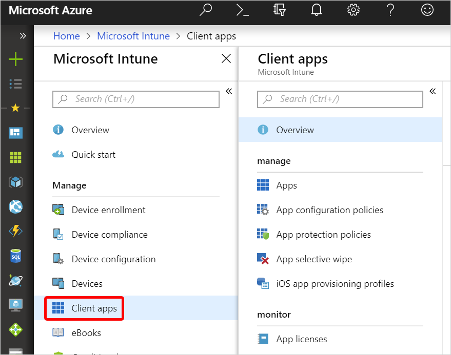
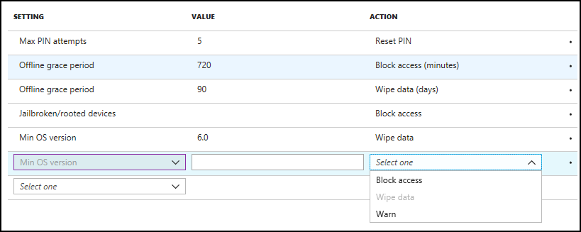

---
# required metadata

title: Wipe data using app protection policy conditional launch actions
titleSuffix: Microsoft Intune
description: Learn how to selectively wipe data using app protection policy conditional launch actions in Microsoft Intune.
keywords:
author: Erikre
ms.author: erikre
manager: dougeby
ms.date: 03/31/2023
ms.topic: how-to
ms.service: microsoft-intune
ms.subservice: apps
ms.localizationpriority: medium
ms.technology:
ms.assetid: f5ca557e-a8e1-4720-b06e-837c4f0bc3ca

# optional metadata

#ROBOTS:
#audience:

ms.reviewer: aanavath
ms.suite: ems
search.appverid: MET150
#ms.tgt_pltfrm:
ms.custom: seodec18
ms.collection:
- tier2
- M365-identity-device-management
---

# Selectively wipe data using app protection policy conditional launch actions in Intune

Conditional launch actions within Intune app protection policies provide organizations the ability to block access or wipe org data when certain device or app conditions aren't met.
 
You can explicitly choose to wipe your company's corporate data from the end user's device as an action to take for non-compliance by using these settings. For some settings, you'll be able to configure multiple actions, such as block access and wipe data based on different specified values.

## Create an app protection policy using conditional launch actions

1. Sign in to the [Microsoft Intune admin center](https://go.microsoft.com/fwlink/?linkid=2109431).
2. Select **Apps** > **App protection Policies**.
3. Click **Create policy** and select the platform of the device for your policy. 
4. Click **Configure required settings** to see the list of settings available to be configured for the policy. 
5. By scrolling down in the Settings pane, you'll see a section titled **Conditional launch** with an editable table.

    

6. Select a **Setting** and enter the **Value** that users must meet to sign in to your company app. 
7. Select the **Action** you want to take if users don't meet your requirements. In some cases, multiple actions can be configured for a single setting. For more information, see [How to create and assign app protection policies](app-protection-policies.md).

## Policy settings 

The app protection policy settings table has columns for **Setting**, **Value**, and **Action**.

### Windows policy settings

For managed apps on Windows devices, you can use MAM for Microsoft Edge. For more information, see [Conditional Access Compliance](../apps/protect-edge-mam-windows.md#conditional-access-compliance).

### iOS policy settings
For iOS/iPadOS, you'll be able to configure actions for the following settings using the **Setting** dropdown:
- Max PIN attempts
- Offline grace period
- Jailbroken/rooted devices
- Max OS version
- Min OS version
- Min app version
- Min SDK version
- Device model(s)
- Max allowed device threat level
- Disabled account

To use the **Device model(s)** setting, input a semi-colon separated list of iOS/iPadOS model identifiers. These values aren't case-sensitive. Besides within Intune Reporting for the 'Device model(s)' input, you can find an iOS/iPadOS model identifier in this [3rd party GitHub repository](https://gist.github.com/adamawolf/3048717). 
Example input: *iPhone5,2;iPhone5,3*

On end-user devices, the Intune client would take action based on a simple matching of device model strings specified in Intune for Application Protection Policies. Matching depends entirely on what the device reports. You (the IT administrator) are encouraged to ensure that the intended behavior occurs by testing this setting based on a variety of device manufacturers and models, and targeted to a small user group. The default value is **Not configured**. 
Set one of the following actions: 
- Allow specified (Block nonspecified)
- Allow specified (Wipe nonspecified)

**What happens if the IT admin inputs a different list of iOS/iPadOS model identifier(s) between policies targeted to the same apps for the same Intune user?** 
When conflicts arise between two app protection policies for configured values, Intune typically takes the most restrictive approach. Thus, the resultant policy sent down to the targeted app being opened by the targeted Intune user would be an intersection of the listed iOS/iPadOS model identifier(s) in *Policy A* and *Policy B* targeted to the same app/user combination. For example, *Policy A* specifies "iPhone5,2;iPhone5,3", while *Policy B* specifies "iPhone5,3", the resultant policy that the Intune user targeted by both *Policy A* and *Policy B* will be "iPhone5,3". 

### Android policy settings

For Android, you'll be able to configure actions for the following settings using the **Setting** dropdown:
- Max PIN attempts
- Offline grace period
- Jailbroken/rooted devices
- Min OS version
- Max OS version
- Min app version
- Min patch version
- Device manufacturer(s)
- SafetyNet device attestation
- Require threat scan on apps
- Min Company Portal version
- Max allowed device threat level
- Disabled account
- Require device lock

By using the **Min Company Portal version**, you can specify a specific minimum defined version of the Company Portal that is enforced on an end user device. This conditional launch setting allows you to set values to **Block access**, **Wipe data**, and **Warn** as possible actions when each value isn't met. The possible formats for this value follow the pattern *[Major].[Minor]*, *[Major].[Minor].[Build]*, or *[Major].[Minor].[Build].[Revision]*. Given that some end users may not prefer a forced update of apps on the spot, the 'warn' option may be ideal when configuring this setting. The Google Play Store does a good job of only sending the delta bytes for app updates, but this can still be a large amount of data that the user may not want to utilize if they are on data at the time of the update. Forcing an update and thereby downloading an updated app could result in unexpected data charges at the time of the update. The **Min Company Portal version** setting, if configured, will affect any end user who gets version 5.0.4560.0 of the Company Portal and any future versions of the Company Portal. This setting will have no effect on users using a version of Company Portal that is older than the version that this feature is released with. End users using app auto-updates on their device will likely not see any dialogs from this feature, given that they'll likely be on the latest Company Portal version. This setting is Android only with app protection for enrolled and unenrolled devices.

To use the **Device manufacturer(s)** setting, input a semi-colon separated list of Android manufacturers. These values aren't case-sensitive. Besides Intune Reporting, you can find the Android manufacturer of a device under the device settings.  
Example input: *Manufacturer A;Manufacturer B* 

>[!NOTE]
> These are some common manufacturers reported from devices using Intune, and can be used as input: Asus;Blackberry;Bq;Gionee;Google;Hmd global;Htc;Huawei;Infinix;Kyocera;Lemobile;Lenovo;Lge;Motorola;Oneplus;Oppo;Samsung;Sharp;Sony;Tecno;Vivo;Vodafone;Xiaomi;Zte;Zuk

On end-user devices, the Intune client would take action based on a simple matching of device model strings specified in Intune for Application Protection Policies. Matching depends entirely on what the device reports. You (the IT administrator) are encouraged to ensure that the intended behavior occurs by testing this setting based on a variety of device manufacturers and models, and targeted to a small user group. The default value is **Not configured**. 
Set one of the following actions: 
- Allow specified (Block on nonspecified)
- Allow specified (Wipe on nonspecified)

**What happens if the IT admin inputs a different list of Android manufacturer(s) between policies targeted to the same apps for the same Intune user?** 
When conflicts arise between two app protection policies for configured values, Intune typically takes the most restrictive approach. Thus, the resultant policy sent down to the targeted app being opened by the targeted Intune user would be an intersection of the listed Android manufacturers in *Policy A* and *Policy B* targeted to the same app/user combination. For example, *Policy A* specifies "Google;Samsung", while *Policy B* specifies "Google", the resultant policy that the Intune user targeted by both *Policy A* and *Policy B* will be "Google". 

### Additional settings and actions 

By default, the table will have populated rows as settings configured for **Offline grace period**, and **Max PIN attempts**, if the **Require PIN for access** setting is set to **Yes**.
 
To configure a setting, select a setting from the dropdown under the **Setting** column. Once a setting is selected, the editable text box will become enabled under the **Value** column in the same row, if a value is required to be set. Also, the dropdown will become enabled under the **Action** column with the set of conditional launch actions applicable to the setting. 

The following list provides the common list of actions:
- **Block access** – Block the end user from accessing the corporate app.
- **Wipe data** – Wipe the corporate data from the end user's device.
- **Warn** – Provide dialog to end user as a warning message.

In some cases, such as the **Min OS version** setting, you can configure the setting to perform all applicable actions based on different version numbers. 

Once a setting is fully configured, the row will appear in a read-only view and be available to be edited at any time. In addition, the row will appear to have a dropdown available for selection in the **Setting** column. Settings that have already been configured and don't allow multiple actions won't be available for selection in the dropdown.

## Next steps

Learn more information on Intune app protection policies, see:
- [How to create and assign app protection policies](app-protection-policies.md)
- [iOS/iPadOS app protection policy settings](app-protection-policy-settings-ios.md)
- [Android app protection policy settings in Microsoft Intune](app-protection-policy-settings-android.md) 
