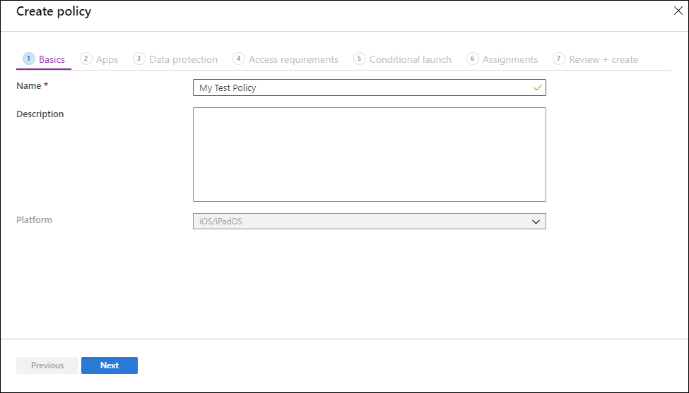

---
# required metadata

title: Create and deploy app protection policies 
titleSuffix: Microsoft Intune
description: This article describes how to create and assign Microsoft Intune app protection policies (APP).
keywords:
author: Erikre
ms.author: erikre
manager: dougeby
ms.date: 07/24/2024
ms.topic: how-to
ms.service: microsoft-intune
ms.subservice: apps
ms.localizationpriority: medium
ms.assetid: f31b2964-e932-4cee-95c4-8d5506966c85

# optional metadata

#ROBOTS:
#audience:

ms.reviewer: scottduf
ms.suite: ems
search.appverid: MET150
#ms.tgt_pltfrm:
ms.custom: intune-azure
ms.collection:
- tier1
- M365-identity-device-management
- highpri
- FocusArea_Apps_Protect
---

# How to create and assign app protection policies

[!INCLUDE [azure_portal](../includes/azure_portal.md)]

Learn how to create and assign Microsoft Intune app protection policies (APP) for users of your organization. This article also describes how to make changes to existing policies.

## Before you begin

App protection policies can apply to apps running on devices that may or may not be managed by Intune. For a more detailed description of how app protection policies work and the scenarios that are supported by Intune app protection policies, see [App protection policies overview](app-protection-policy.md).

The choices available in app protection policies (APP) enable organizations to tailor the protection to their specific needs. For some, it may not be obvious which policy settings are required to implement a complete scenario. To help organizations prioritize mobile client endpoint hardening, Microsoft has introduced taxonomy for its APP data protection framework for iOS and Android mobile app management.

The APP data protection framework is organized into three distinct configuration levels, with each level building off the previous level:

- **Enterprise basic data protection** (Level 1) ensures that apps are protected with a PIN and encrypted and performs selective wipe operations. For Android devices, this level validates Android device attestation. This is an entry level configuration that provides similar data protection control in Exchange Online mailbox policies and introduces IT and the user population to APP.
- **Enterprise enhanced data protection** (Level 2) introduces APP data leakage prevention mechanisms and minimum OS requirements. This is the configuration that is applicable to most mobile users accessing work or school data.
- **Enterprise high data protection** (Level 3) introduces advanced data protection mechanisms, enhanced PIN configuration, and APP Mobile Threat Defense. This configuration is desirable for users that are accessing high risk data.

To see the specific recommendations for each configuration level and the minimum apps that must be protected, review [Data protection framework using app protection policies](app-protection-framework.md).

If you're looking for a list of apps that have integrated the Intune SDK, see [Microsoft Intune protected apps](apps-supported-intune-apps.md).

For information about adding your organization's line-of-business (LOB) apps to Microsoft Intune to prepare for app protection policies, see [Add apps to Microsoft Intune](apps-add.md).

  > [!NOTE]
  > To ensure that policies are enforced, we recommend using Conditional Access together with Intune app protection policies. See **Require app protection policy** in https://learn.microsoft.com/entra/identity/conditional-access/howto-policy-approved-app-or-app-protection

## App protection policies for iOS/iPadOS and Android apps

When you create an app protection policy for iOS/iPadOS and Android apps, you follow a modern Intune process flow that results in a new app protection policy. For information about creating app protection policies for Windows apps, see [App protection policy settings for Windows](../apps/app-protection-policy-settings-windows.md).

### Create an iOS/iPadOS or Android app protection policy

1. Sign in to the [Microsoft Intune admin center](https://go.microsoft.com/fwlink/?linkid=2109431).
2. Select **Apps** > **App protection policies**. This selection opens the **App protection policies** details, where you create new policies and edit existing policies.
3. Select **Create policy** and select either **iOS/iPadOS** or **Android**. The **Create policy** pane is displayed.
4. On the **Basics** page, add the following values:

 | Value | Description |
 |:-------------|:-----------------------------------------------|
 | Name | The name of this app protection policy. |
 | Description | [Optional] The description of this app protection policy. |

5. Click **Next** to display the **Apps** page.  \
    The **Apps** page allows you to choose which apps should be targeted by this policy. You must add at least one app.

    | Value/Option | Description |
    |:-------------|:-----------------------------------------------|
    | Target policy to | In the **Target policy to** dropdown box, choose to target your app protection policy to **All Apps**, **Microsoft Apps**, or **Core Microsoft Apps**.
<ul><li>**All Apps** includes all Microsoft and partner apps that have integrated the Intune SDK.</li><li>**Microsoft Apps** includes all Microsoft apps that have integrated the Intune SDK.</li><li>**Core Microsoft Apps** includes the following apps: Microsoft Edge, Excel, Office, OneDrive, OneNote, Outlook, PowerPoint, SharePoint, Teams, To Do, and Word.</li></ul>
Next, you can select **View a list of the apps that will be targeted** to view a list of the apps that will be affected by this policy.|
    | Public apps | If you don't want to select one of the predefined app groups, you can choose to target individual apps by selecting **Selected apps** in the **Target policy to** dropdown box. Click **Select public apps** to select public apps to target. |
    | Custom apps | If you don't want to select one of the predefined app groups, you can choose to target individual apps by selecting **Selected apps** in the **Target policy to** dropdown box. Click **Select custom apps** to select custom apps to target based on a Bundle ID. You cannot choose a custom app when also targeting the options **All Apps**, **Microsoft Apps**, or **Core Microsoft Apps** in the same policy. |

    The app(s) you have selected will appear in the public and custom apps list.

    > [!NOTE]
    > **Public apps** are supported are apps from Microsoft and partners that are commonly used with Microsoft Intune. These Intune protected apps are enabled with a rich set of support for mobile application protection policies. For more information, see [Microsoft Intune protected apps](../apps/apps-supported-intune-apps.md). Custom apps are LOB apps that have been integrated with the Intune SDK or wrapped by the Intune App Wrapping Tool. For more information see [Microsoft Intune App SDK Overview](../developer/app-sdk.md) and [Prepare line-of-business apps for app protection policies](../developer/apps-prepare-mobile-application-management.md).

6. Click **Next** to display the **Data protection** page.  \
    This page provides settings for data loss prevention (DLP) controls, including cut, copy, paste, and save-as restrictions. These settings determine how users interact with data in the apps that this app protection policy applies.

    **Data protection settings**: 
    - **iOS/iPadOS data protection** - For information, see [iOS/iPadOS app protection policy settings - Data protection](app-protection-policy-settings-ios.md#data-protection).
    - **Android data protection** - For information, see [Android app protection policy settings - Data protection](app-protection-policy-settings-android.md#data-protection).

7. Click **Next** to display the **Access requirements** page.  \
    This page provides settings to allow you to configure the PIN and credential requirements that users must meet to access apps in a work context.

    **Access requirements settings**: 
    - **iOS/iPadOS access requirements** - For information, see [iOS/iPadOS app protection policy settings - Access requirements](app-protection-policy-settings-ios.md#access-requirements).
    - **Android access requirements** - For information, see [Android app protection policy settings - Access requirements](app-protection-policy-settings-android.md#access-requirements).

8. Click **Next** to display the **Conditional launch** page.  \
    This page provides settings to set the sign-in security requirements for your app protection policy. Select a **Setting** and enter the **Value** that users must meet to sign in to your company app. Then select the **Action** you want to take if users don't meet your requirements. In some cases, multiple actions can be configured for a single setting.

    **Conditional launch settings**: 
    - **iOS/iPadOS conditional launch** - For information, see [iOS/iPadOS app protection policy settings - Conditional launch](app-protection-policy-settings-ios.md#conditional-launch).
    - **Android conditional launch** - For information, see [Android app protection policy settings - Conditional launch](app-protection-policy-settings-android.md#conditional-launch).

9. Click **Next** to display the **Assignments** page. \
   The **Assignments** page allows you to assign the app protection policy to groups of users. You must apply the policy to a group of users to have the policy take effect.

10. Click **Next: Review + create** to review the values and settings you entered for this app protection policy.

11. When you're done, click **Create** to create the app protection policy in Intune.

    > [!TIP]
    > These policy settings are enforced only when using apps in the work context. When end users use the app to do a personal task, they aren't affected by these policies. Note that when you create a new file it is considered a personal file.

    > [!IMPORTANT]
    > It can take time for app protection policies to apply to existing devices. End users will see a notification on the device when the app protection policy is applied. Apply your app protection policies to devices before applying condidtional access rules.

End users can download the apps from the App store or Google Play. For more information, see:
* [Where to find work or school apps for iOS/iPadOS](../user-help/use-managed-apps-on-your-device-ios.md) 
* [Where to find work or school apps for Android](../user-help/use-managed-apps-on-your-device-android.md)

## Change existing policies
You can edit an existing policy and apply it to the targeted users. For more information on the policy delivery timing see, [Understand App Protection Policy delivery timing](app-protection-policy-delivery.md).

### To change the list of apps associated with the policy

1. In the **App protection policies** pane, select the policy you want to change.

2. In the *Intune App Protection* pane, select **Properties**.

3. Next to the section titled *Apps*, select **Edit**.

4. The **Apps** page allows you to choose which apps should be targeted by this policy. You must add at least one app.
    
    | Value/Option | Description |
    |:-------------|:-----------------------------------------------|
    | Public apps | In the **Target policy to** dropdown box, choose to target your app protection policy to **All public apps**, **Microsoft Apps**, or **Core Microsoft Apps**. Next, you can select **View a list of the apps that will be targeted** to view a list of the apps that will be affected by this policy.
If needed, you can choose to target individual apps by clicking **Select public apps**. 
 |
    | Custom apps | Click **Select custom apps** to select custom apps to target based on a Bundle ID. |

    The app(s) you have selected will appear in the public and custom apps list.

5. Click **Review + create** to review the apps selected for this policy.

6. When you're done, click **Save** to update the app protection policy.
 
#### To change the list of user groups

1. In the **App protection policies** pane, select the policy you want to change.

2. In the *Intune App Protection* pane, select **Properties**.

3. Next to the section titled *Assignments*, select **Edit**.

4. To add a new user group to the policy, on the *Include* tab choose **Select groups to include**, and select the user group. Choose **Select** to add the group. 

5. To exclude a user group, on the *Exclude* tab choose **Select groups to exclude**, and select the user group. Choose **Select** to remove the user group.  

6. To delete groups that were added previously, on either the *Include* or *Exclude* tabs, select the ellipsis (...) and select **Delete**.

7. Click **Review + create** to review the user groups selected for this policy.

8. After your changes to the assignments are ready, select **Save** to save the configuration and deploy the policy to the new set of users. If you select **Cancel** before you save your configuration, you'll discard all changes you've made to the *Include* and *Exclude* tabs.

### To change policy settings

1. In the **App protection policies** pane, select the policy you want to change.

2. In the *Intune App Protection* pane, select **Properties**.

3. Next to the section corresponding to the settings you want to change, select **Edit**. Then change the settings to new values.

5. Click **Review + create** to review the updated settings for this policy.

6. Select the **Save** to save your changes. Repeat the process to select a settings area and modify and then save your changes, until all your changes are complete. You can then close the *Intune App Protection - Properties* pane. 

## Target app protection policies based on device management state
In many organizations, it's common to allow end users to use both Intune Mobile Device Management (MDM) managed devices, such as corporate owned devices, and unmanaged devices protected with only Intune app protection policies. Unmanaged devices are often known as Bring Your Own Devices (BYOD).

Because Intune app protection policies target a user's identity, the protection settings for a user can apply to both enrolled (MDM managed) and nonenrolled devices (no MDM). Therefore, you can target an Intune app protection policy to either Intune enrolled or unenrolled iOS/iPadOS and Android devices using filters. For more information on creating filters see, [Use filters when assigning policies](../fundamentals/filters.md) . You can have one protection policy for unmanaged devices in which strict data loss prevention (DLP) controls are in place, and a separate protection policy for MDM managed devices, where the DLP controls may be a little more relaxed. For more information how this works on personal Android Enterprise devices, see [App protection policies and work profiles](android-deployment-scenarios-app-protection-work-profiles.md).

To use these filters when assigning policies, browse to **Apps** > **App protection policies** in the Intune admin center, and then select **Create policy**. You can also edit an existing app protection policy. Navigate to the **Assignments** page and select **Edit filter** to include or exclude filters for the assigned group. 

### Device Management types

 [!INCLUDE [android_device_administrator_support](../includes/android-device-administrator-support.md)]

- **Unmanaged**: For iOS/iPadOS devices, unmanaged devices are any devices where either Intune MDM management or a 3rd party MDM/EMM solution doesn't pass the `IntuneMAMUPN` key. For Android devices, unmanaged devices are devices where Intune MDM management hasn't been detected. This includes devices managed by third-party MDM vendors.
- **Intune managed devices**: Managed devices are managed by Intune MDM.
- **Android device administrator**: Intune-managed devices using the Android Device Administration API.
- **Android Enterprise**: Intune-managed devices using Android Enterprise Work Profiles or Android Enterprise Full Device Management.
- **Android Enterprise corporate-owned dedicated devices with Microsoft Entra shared device mode**: Intune-managed devices using Android Enterprise dedicated devices with Shared device mode. 
- **Android (AOSP) user-associated devices**: Intune-managed devices using AOSP user-associated management. 
- **Android (AOSP) userless devices**: Intune-managed devices using AOSP userless devices. These devices also leverage Microsoft Entra shared device mode. 

On Android, Android devices will prompt to install the Intune Company Portal app regardless of which Device Management type is chosen. For example, if you select 'Android Enterprise' then users with unmanaged Android devices will still be prompted.

For iOS/iPadOS, for the Device Management type to be enforced to Intune managed devices, additional app configuration settings are required. These settings communicate with the APP (App Protection Policy) service to indicate that the app is managed. Therefore, the APP settings will not apply until you deploy the app configuration policy. The following are the app configuration settings:

- **IntuneMAMUPN** and **IntuneMAMOID** must be configured for all MDM managed applications. For more information, see [How to manage data transfer between iOS/iPadOS apps in Microsoft Intune](data-transfer-between-apps-manage-ios.md#configure-user-upn-setting-for-microsoft-intune-or-third-party-emm).
- **IntuneMAMDeviceID** must be configured for all third-party and line-of-business MDM managed applications. The **IntuneMAMDeviceID** should be configured to the device ID token. For example, `key=IntuneMAMDeviceID, value={{deviceID}}`. For more information, see [Add app configuration policies for managed iOS/iPadOS devices](app-configuration-policies-use-ios.md).
- If only the **IntuneMAMDeviceID** is configured, the Intune APP will consider the device as unmanaged.

## Policy settings
To see a full list of the policy settings for iOS/iPadOS and Android, select one of the following links:

- [iOS/iPadOS policies](app-protection-policy-settings-ios.md)
- [Android policies](app-protection-policy-settings-android.md)

## Next steps
[Monitor compliance and user status](app-protection-policies-monitor.md)

## See also
* [Where to find work or school apps for Android (user help)](../user-help/use-managed-apps-on-your-device-android.md)
- [Where to find work or school apps for iOS/iPadOS (user help)](../user-help/use-managed-apps-on-your-device-ios.md) 
