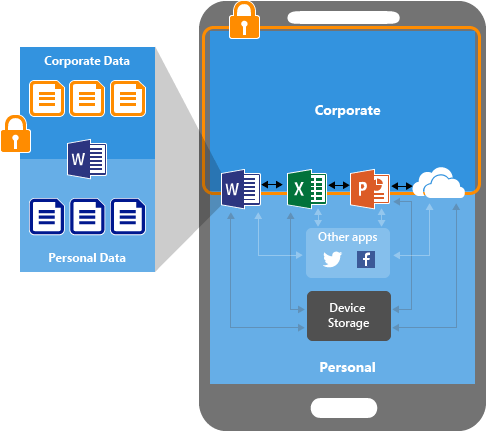

---
# required metadata

title: App protection policies overview
titleSuffix: Microsoft Intune
description: Learn how Microsoft Intune app protection policies help protect your company data and prevent data loss.
keywords:
author: Erikre
ms.author: erikre
manager: dougeby
ms.date: 08/09/2024
ms.topic: overview
ms.service: microsoft-intune
ms.subservice: apps
ms.localizationpriority: high
ms.assetid: 1c086943-84a0-4d99-8295-490a2bc5be4b

# optional metadata

#ROBOTS:
#audience:

ms.reviewer: scottduf
ms.suite: ems
search.appverid: MET150
#ms.tgt_pltfrm:
ms.custom: intune-azure, get-started
ai-usage: ai-assisted
ms.collection:
- tier1
- M365-identity-device-management
- highpri
---

# App protection policies overview

Intune app protection policies (APP) are rules that ensure an organization's data remains safe or contained in a managed app. These policies allow you to control how data is accessed and shared by apps on mobile devices. A policy can be a rule that is enforced when the user attempts to access or move "corporate" data, or a set of actions that are prohibited or monitored when the user is inside the app. A managed app in Intune is a [protected app](../apps/apps-supported-intune-apps.md) that has Intune app protection policies applied to it and is managed by Intune.

There are several [benefits](../apps/app-protection-policy.md#benefits-of-using-app-protection-policies) of using Intune app protection policies, including protecting corporate data on mobile devices without requiring device enrollment and controlling how data is accessed and shared by apps on mobile devices.

Examples of using app protection policies with Microsoft Intune include:
- Requiring a PIN or fingerprint to access corporate email on a mobile device
- Preventing users from copying and pasting corporate data into personal apps
- Restricting access to corporate data to only approved apps

Many productivity apps, such as the Microsoft 365 (Office) apps, can be managed using Intune MAM. See the official list of [Microsoft Intune protected apps](apps-supported-intune-apps.md) available for public use.

## How you can protect app data

Your employees use mobile devices for both personal and work tasks. While making sure your employees can be productive, you want to prevent data loss, intentional and unintentional. You'll also want to protect company data that is accessed from devices that aren't managed by you.

You can use Intune app protection policies **independent of any mobile-device management (MDM) solution**. This independence helps you protect your company's data with or without enrolling devices in a device management solution. By implementing **app-level policies**, you can restrict access to company resources and keep data within the purview of your IT department.

  > [!NOTE]
  > To ensure that policies are enforced, we recommend using Conditional Access together with Intune app protection policies. See **Require app protection policy** in https://learn.microsoft.com/entra/identity/conditional-access/howto-policy-approved-app-or-app-protection

### App protection policies on devices

App protection policies can be configured for apps that run on devices that are:

- **Enrolled in Microsoft Intune:** These devices are typically corporate owned.

- **Enrolled in a third-party Mobile device management (MDM) solution:** These  devices are typically corporate owned.

  > [!NOTE]
  > Mobile app management policies should not be used with third-party mobile app management or secure container solutions.

- **Not enrolled in any mobile device management solution:** These devices are typically employee owned devices that aren't managed or enrolled in Intune or other MDM solutions.

> [!IMPORTANT]
> You can create mobile app management policies for Office mobile apps that connect to Microsoft 365 services. You can also protect access to Exchange on-premises mailboxes by creating Intune app protection policies for Outlook for iOS/iPadOS and Android enabled with hybrid Modern Authentication. Before using this feature, make sure you meet the [Outlook for iOS/iPadOS and Android requirements](/Exchange/clients/outlook-for-ios-and-android/use-hybrid-modern-auth?view=exchserver-2019&preserve-view=true). App protection policies are not supported for other apps that connect to on-premises Exchange or SharePoint services.

## Benefits of using App protection policies

The important benefits of using App protection policies are the following:

- **Protecting your company data at the app level.** Because mobile app management doesn't require device management, you can protect company data on both managed and unmanaged devices. The management is centered on the user identity, which removes the requirement for device management.

- **End-user productivity isn't affected and policies don't apply when using the app in a personal context.** The policies are applied only in a work context, which gives you the ability to protect company data without touching personal data.

- **App protection policies makes sure that the app-layer protections are in place.** For example, you can:
  - Require a PIN to open an app in a work context
  - Control the sharing of data between apps
  - Prevent the saving of company app data to a personal storage location

- **MDM, in addition to MAM, makes sure that the device is protected**. For example, you can require a PIN to access the device, or you can deploy managed apps to the device. You can also deploy apps to devices through your MDM solution, to give you more control over app management.

There are additional benefits to using MDM with App protection policies, and companies can use App protection policies with and without MDM at the same time. For example, consider an employee that uses both a phone issued by the company, and their own personal tablet. The company phone is enrolled in MDM and protected by App protection policies while the personal device is protected by App protection policies only.

If you apply a MAM policy to the user without setting the device state, the user will get the MAM policy on both the BYOD device and the Intune-managed device. You can also apply MAM policies based on the device management state. For more information see, [Target app protection policies based on device management state](../apps/app-protection-policies.md#target-app-protection-policies-based-on-device-management-state). When you create an app protection policy, select **No** next to **Target to all app types**. Then, do any of the following:

- Apply a less strict MAM policy to Intune managed devices, and apply a more restrictive MAM policy to non MDM-enrolled devices.
- Apply a MAM policy to unenrolled devices only.

## Supported platforms for app protection policies

Intune offers a range of capabilities to help you get the apps you need on the devices you want to run them on. For more information, see [App management capabilities by platform](app-management.md#app-management-capabilities-by-platform).

Intune app protection policies platform support aligns with Office mobile application platform support for Android and iOS/iPadOS devices. For details, see the **Mobile apps** section of [Office System Requirements](https://products.office.com/office-system-requirements#coreui-contentrichblock-9r05pwg). 

Preview: In addition, you can create app protection policies for Windows devices. For details, see [App protection experience for Windows devices](#preview-app-protection-experience-for-windows-devices).

> [!IMPORTANT]
> The Intune Company Portal is required on the device to receive App Protection Policies on Android.  

## App protection policy data protection framework

The choices available in app protection policies (APP) enable organizations to tailor the protection to their specific needs. For some, it may not be obvious which policy settings are required to implement a complete scenario. To help organizations prioritize mobile client endpoint hardening, Microsoft has introduced taxonomy for its APP data protection framework for iOS and Android mobile app management.

The APP data protection framework is organized into three distinct configuration levels, with each level building off the previous level:

- **Enterprise basic data protection** (Level 1) ensures that apps are protected with a PIN and encrypted and performs selective wipe operations. For Android devices, this level validates Android device attestation. This is an entry level configuration that provides similar data protection control in Exchange Online mailbox policies and introduces IT and the user population to APP.
- **Enterprise enhanced data protection** (Level 2) introduces APP data leakage prevention mechanisms and minimum OS requirements. This is the configuration that is applicable to most mobile users accessing work or school data.
- **Enterprise high data protection** (Level 3) introduces advanced data protection mechanisms, enhanced PIN configuration, and APP Mobile Threat Defense. This configuration is desirable for users that are accessing high risk data.

To see the specific recommendations for each configuration level and the minimum apps that must be protected, review [Data protection framework using app protection policies](app-protection-framework.md).

## How app protection policies protect app data

### Apps without app protection policies

When apps are used without restrictions, company and personal data can get intermingled. Company data can end up in locations like personal storage or transferred to apps beyond your purview and result in data loss. The arrows in the following diagram show unrestricted data movement between both corporate and personal apps, and to storage locations.

### Data protection with app protection policies (APP)

You can use App protection policies to prevent company data from saving to the local storage of the device (see the image below). You can also restrict data movement to other apps that aren't protected by App protection policies. App protection policy settings include:

- Data relocation policies like  **Save copies of org data**, and **Restrict cut, copy, and paste**.
- Access policy settings like **Require simple PIN for access**, and **Block managed apps from running on jailbroken or rooted devices**.

### Data protection with APP on devices managed by an MDM solution

The below illustration shows the layers of protection that MDM and App protection policies offer together.

The MDM solution adds value by providing the following:

- Enrolls the device
- Deploys the apps to the device
- Provides ongoing device compliance and management

The App protection policies add value by providing the following:

- Help protect company data from leaking to consumer apps and services
- Apply restrictions like *save-as*, *clipboard*, or *PIN*, to client apps
- Wipe company data when needed from apps without removing those apps from the device

### Data protection with APP for devices without enrollment

The following diagram illustrates how the data protection policies work at the app level without MDM.

For BYOD devices not enrolled in any MDM solution, App protection policies can help protect company data at the app level.
However, there are some limitations to be aware of, such as:

- You can't deploy apps to the device. The end user has to get the apps from the store.
- You can't provision certificate profiles on these devices.
- You can't provision company Wi-Fi and VPN settings on these devices.

## Apps you can manage with app protection policies

Any app that has been integrated with the [Intune SDK](../developer/app-sdk.md) or wrapped by the [Intune App Wrapping Tool](../developer/apps-prepare-mobile-application-management.md) can be managed using Intune app protection policies. See the official list of [Microsoft Intune protected apps](apps-supported-intune-apps.md) that have been built using these tools and are available for public use.

The Intune SDK development team actively tests and maintains support for apps built with the native Android, iOS/iPadOS (Obj-C, Swift), Xamarin, and Xamarin.Forms platforms. While some customers have had success with Intune SDK integration with other platforms such as React Native and NativeScript, we do not provide explicit guidance or plugins for app developers using anything other than our supported platforms.

## End-user requirements to use app protection policies

The following list provides the end-user requirements to use app protection policies on an Intune-managed app:

- The end user must have a Microsoft Entra account. See [Add users and give administrative permission to Intune](../fundamentals/users-add.md) to learn how to create Intune users in Microsoft Entra ID.

- The end user must have a license for Microsoft Intune assigned to their Microsoft Entra account. See [Manage Intune licenses](../fundamentals/licenses-assign.md) to learn how to assign Intune licenses to end users.

- The end user must belong to a security group that is targeted by an app protection policy. The same app protection policy must target the specific app being used. App protection policies can be created and deployed in the [Microsoft Intune admin center](https://go.microsoft.com/fwlink/?linkid=2109431). Security groups can currently be created in the [Microsoft 365 admin center](https://admin.microsoft.com).

- The end user must sign into the app using their Microsoft Entra account.

## App protection policies for Microsoft 365 (Office) apps

There are a few additional requirements that you want to be aware of when using App protection policies with Microsoft 365 (Office) apps.

> [!IMPORTANT]
> Intune mobile application management (MAM) on Android requires Microsoft Entra ID device registration for Microsoft 365 apps. To improve security, Android devices must be registered with Microsoft Entra ID to continue receiving MAM policy for Microsoft 365 apps. 
>
> When accessing Microsoft 365 apps that are targeted with a MAM policy, users might be prompted to authenticate if the device is not already registered with Entra ID. Users will need to complete the authentication and registration process to access their Microsoft 365 MAM-enabled applications.
> 
> 
>
> If you have Conditional Access policies or multi-factor authentication enabled, devices should already be registered, and users will not notice any change.
>
> To view which devices are registered, navigate to the [Microsoft Entra admin center](https://entra.microsoft.com/) > **Devices** > **All devices** report, filter by **OS** and sort by **Registered**. For related information, see [Manage device identities using the Microsoft Entra admin center](/entra/identity/devices/manage-device-identities).

### Outlook mobile app

The additional requirements to use the [Outlook mobile app](https://products.office.com/outlook) include the following:

- The end user must have the Outlook mobile app installed to their device.
- The end user must have an [Microsoft 365 Exchange Online](https://products.office.com/exchange/exchange-online) mailbox and license linked to their Microsoft Entra account.

  > [!NOTE]
  > The Outlook mobile app currently only supports Intune App Protection for Microsoft Exchange Online and [Exchange Server with hybrid modern authentication](/Exchange/clients/outlook-for-ios-and-android/use-hybrid-modern-auth?view=exchserver-2019&preserve-view=true) and does not support Exchange in Office 365 Dedicated.

### Word, Excel, and PowerPoint

The additional requirements to use the [Word, Excel, and PowerPoint](https://products.office.com/business/office) apps include the following:

- The end user must have a license for [Microsoft 365 Apps for business or enterprise](https://products.office.com/business/compare-more-office-365-for-business-plans) linked to their Microsoft Entra account. The subscription must include the Office apps on mobile devices and can include a cloud storage account with [OneDrive for Business](https://onedrive.live.com/about/business/). Microsoft 365 licenses can be assigned in the [Microsoft 365 admin center](https://admin.microsoft.com) following these [instructions](https://support.office.com/article/Assign-or-remove-licenses-for-Office-365-for-business-997596b5-4173-4627-b915-36abac6786dc).

- The end user must have a managed location configured using the granular save as functionality under the "Save copies of org data" application protection policy setting. For example, if the managed location is OneDrive, the [OneDrive](https://onedrive.live.com/about/) app should be configured in the end user's Word, Excel, or PowerPoint app.

- If the managed location is OneDrive, the app must be targeted by the app protection policy deployed to the end user.

  > [!NOTE]
  > The Office mobile apps currently only support SharePoint Online and not SharePoint on-premises.

### Managed location needed for Office

A managed location (i.e. OneDrive) is needed for Office. Intune marks all data in the app as either "corporate" or "personal". Data is considered "corporate" when it originates from a business location. For the Office apps, Intune considers the following as business locations: email (Exchange) or cloud storage (OneDrive app with a OneDrive for Business account).

### Skype for Business

There are additional requirements to use Skype for Business. See [Skype for Business](https://products.office.com/skype-for-business/it-pros) license requirements. For Skype for Business (SfB) hybrid and on-prem configurations, see [Hybrid Modern Auth for SfB and Exchange goes GA](https://techcommunity.microsoft.com/t5/Skype-for-Business-Blog/Hybrid-Modern-Auth-for-SfB-and-Exchange-goes-GA/ba-p/134756) and [Modern Auth for SfB OnPrem with Microsoft Entra ID](https://techcommunity.microsoft.com/t5/Skype-for-Business-Blog/Modern-Auth-for-SfB-OnPrem-with-AAD/ba-p/180910), respectively.

## App protection Global policy

If a OneDrive administrator browses to **admin.onedrive.com** and selects **Device access**, they can set **Mobile application management** controls to the OneDrive and SharePoint client apps.

The settings, made available to the OneDrive Admin console, configure a special Intune app protection policy called the **Global** policy. This global policy applies to all users in your tenant, and has no way to control the policy targeting.

Once enabled, the OneDrive and SharePoint apps for iOS/iPadOS and Android are protected with the selected settings by default. An IT Pro can edit this policy in the [Microsoft Intune admin center](https://go.microsoft.com/fwlink/?linkid=2109431) to add more targeted apps and to modify any policy setting.

By default, there can only be one **Global** policy per tenant. However, you can use [Intune Graph APIs](../developer/intune-graph-apis.md) to create extra global policies per tenant, but doing so isn't recommended. Creating extra global policies isn't recommended because troubleshooting the implementation of such a policy can become complicated.

While the **Global** policy applies to all users in your tenant, any standard Intune app protection policy will override these settings.

> [!NOTE]
> The policy settings in the OneDrive Admin Center are no longer being updated. Microsoft Intune may be used instead. For more information, see [Control access to features in the OneDrive and SharePoint mobile apps](/onedrive/control-access-to-mobile-app-features).

## App protection features

### Multi-identity

Multi-identity support allows an app to support multiple audiences. These audiences are both "corporate" users and "personal" users. Work and school accounts are used by "corporate" audiences, whereas personal accounts would be used for consumer audiences, such as Microsoft 365 (Office) users. An app that supports multi-identity can be released publicly, where app protection policies apply only when the app is used in the work and school ("corporate") context. Multi-identity support uses the [Intune SDK](../developer/app-sdk.md) to only apply app protection policies to the work or school account signed into the app. If a personal account is signed into the app, the data is untouched. App protection policies can be used to prevent the transfer of work or school account data to personal accounts within the multi-identity app, personal accounts within other apps, or personal apps.

> [!IMPORTANT]
> Regardless of whether an app supports multi-identity, only a single "corporate" identity can have an Intune App Protection Policy applied.

For an example of "personal" context, consider a user who starts a new document in Word, this is considered personal context so Intune App Protection policies are not applied. Once the document is saved on the "corporate" OneDrive account, then it is considered "corporate" context and Intune App Protection policies are applied.

Consider the following examples for the work or "corporate" context:

- A user starts the OneDrive app by using their work account. In the work context, they can't move files to a personal storage location. Later, when they use OneDrive with their personal account, they can copy and move data from their personal OneDrive without restrictions.
- A user starts drafting an email in the Outlook app. Once the subject or message body is populated, the user is unable to switch the FROM address from the work context to the personal context as the subject and message body are protected by the App Protection policy.

> [!NOTE]
> Outlook has a combined email view of both "personal" and "corporate" emails. In this situation, the Outlook app prompts for the Intune PIN on launch.

> [!IMPORTANT]
> Although Edge is in "corporate" context, users can intentionally move OneDrive "corporate" context files to an unknown personal cloud storage location. To avoid this, see [Manage websites to allow upload files](manage-microsoft-edge.md#manage-websites-to-allow-upload-files) and configure the allowed/blocked site list for Edge.

### Intune app PIN

The Personal Identification Number (PIN) is a passcode used to verify that the correct user is accessing the organization's data in an application.

**PIN prompt** 
Intune prompts for the user's app PIN when the user is about to access "corporate" data. In multi-identity apps such as Word, Excel, or PowerPoint, the user is prompted for their PIN when they try to open a "corporate" document or file. In single-identity apps, such as line-of-business apps managed using the [Intune App Wrapping Tool](../developer/apps-prepare-mobile-application-management.md), the PIN is prompted at launch, because the [Intune SDK](../developer/app-sdk.md) knows the user's experience in the app is always "corporate".

**PIN prompt, or corporate credential prompt, frequency** 
The IT admin can define the Intune app protection policy setting **Recheck the access requirements after (minutes)** in the [Microsoft Intune admin center](https://go.microsoft.com/fwlink/?linkid=2109431). This setting specifies the amount of time before the access requirements are checked on the device, and the application PIN screen, or corporate credential prompt, is shown again. However, important details about PIN that affect how often the user will be prompted are:

- **The PIN is shared among apps of the same publisher to improve usability:**  On iOS/iPadOS, one app PIN is shared amongst all apps **of the same app publisher**. For example, all Microsoft apps share the same PIN. On Android, one app PIN is shared amongst all apps.
- **The *Recheck the access requirements after (minutes)* behavior after a device reboot:**  A timer tracks the number of minutes of inactivity that determine when to show the Intune app PIN, or corporate credential prompt next. On iOS/iPadOS, the timer is unaffected by device reboot. Thus, device reboot has no effect on the number of minutes the user has been inactive from an iOS/iPadOS app with Intune PIN (or corporate credential) policy targeted. On Android, the timer is reset on device reboot. As such, Android apps with Intune PIN (or corporate credential) policy will likely prompt for an app PIN, or corporate credential prompt, regardless of the 'Recheck the access requirements after (minutes)' setting value **after a device reboot**.  
- **The rolling nature of the timer associated with the PIN:**  Once a PIN is entered to access an app (app A), and the app leaves the foreground (main input focus) on the device, the timer gets reset for that PIN. Any app (app B) that shares this PIN will not prompt the user for PIN entry because the timer has reset. The prompt will show up again once the 'Recheck the access requirements after (minutes)' value is met again.

For iOS/iPadOS devices, even if the PIN is shared between apps from different publishers, the prompt will show up again when the **Recheck the access requirements after (minutes)** value is met again for the app that is not the main input focus. So, for example, a user has app *A* from publisher *X* and app *B* from publisher *Y*, and those two apps share the same PIN. The user is focused on app *A* (foreground), and app *B* is minimized. After the **Recheck the access requirements after (minutes)** value is met and the user switches to app *B*, the PIN would be required.

  > [!NOTE]
  > In order to verify the user's access requirements more often (i.e. PIN prompt), especially for a frequently used app, it is recommended to reduce the value of the 'Recheck the access requirements after (minutes)' setting.

**Built-in app PINs for Outlook and OneDrive** 
The Intune PIN works based on an inactivity-based timer (the value of **Recheck the access requirements after (minutes)**). As such, Intune PIN prompts show up independently from the built-in app PIN prompts for Outlook and OneDrive which often are tied to app launch by default. If the user receives both PIN prompts at the same time, the expected behavior should be that the Intune PIN takes precedence.

**Intune PIN security** 
The PIN serves to allow only the correct user to access their organization's data in the app. Therefore, an end user must sign in with their work or school account before they can set or reset their Intune app PIN. This authentication is handled by Microsoft Entra ID via secure token exchange and is not transparent to the [Intune SDK](../developer/app-sdk.md). From a security perspective, the best way to protect work or school data is to encrypt it. Encryption is not related to the app PIN but is its own app protection policy.

**Protecting against brute force attacks and the Intune PIN** 
As part of the app PIN policy, the IT administrator can set the maximum number of times a user can try to authenticate their PIN before locking the app. After the number of attempts has been met, the [Intune SDK](../developer/app-sdk.md) can wipe the "corporate" data in the app.

**Intune PIN and a selective wipe** 
On iOS/iPadOS, the app level PIN information is stored in the keychain that is shared between apps with the same publisher, such as all first party Microsoft apps. This PIN information is also tied to an end user account. A selective wipe of one app shouldn't affect a different app.

For example, a PIN set for Outlook for the signed in user is stored in a shared keychain. When the user signs into OneDrive (also published by Microsoft), they will see the same PIN as Outlook since it uses the same shared keychain. When signing out of Outlook or wiping the user data in Outlook, the Intune SDK does not clear that keychain because OneDrive might still be using that PIN. Because of this, selective wipes do not clear that shared keychain, including the PIN. This behavior remains the same even if only one app by a publisher exists on the device.

Since the PIN is shared amongst apps with the same publisher, if the wipe goes to a single app, the Intune SDK does not know if there are any other apps on the device with the same publisher. Thus, the Intune SDK does not clear the PIN since it might still be used for other apps. The expectation is that the app PIN should be wiped when last app from that publisher will be removed eventually as part of some OS cleanup.
 
If you observe the PIN being wiped on some devices, the following is likely happening: Since the PIN is tied to an identity, if the user signed in with a different account after a wipe, they will be prompted to enter a new PIN. However, if they sign in with a previously existing account, a PIN stored in the keychain already can be used to sign in.

**Setting a PIN twice on apps from the same publisher?** 
MAM (on iOS/iPadOS) currently allows application-level PIN with alphanumeric and special characters (called 'passcode') which requires the participation of applications (i.e. WXP, Outlook, Managed Browser, Viva Engage) to integrate the [Intune SDK for iOS](../developer/app-sdk-ios-phase1.md). Without this, the passcode settings are not properly enforced for the targeted applications. This was a feature released in the Intune SDK for iOS v. 7.1.12.

In order to support this feature and ensure backward compatibility with previous versions of the Intune SDK for iOS/iPadOS, all PINs (either numeric or passcode) in 7.1.12+ are handled separately from the numeric PIN in previous versions of the SDK. Another change was introduced in the Intune SDK for iOS v 14.6.0 that causes all PINs in 14.6.0+ to be handled separately from any PINs in previous versions of the SDK.

Therefore, if a device has applications with Intune SDK for iOS versions before 7.1.12 AND after 7.1.12 from the same publisher (or versions before 14.6.0 AND after 14.6.0), they will have to set up two PINs. The two PINs (for each app) are not related in any way (i.e. they must adhere to the app protection policy that's applied to the app). As such, *only* if apps A and B have the same policies applied (with respect to PIN), user may set up the same PIN twice.

This behavior is specific to the PIN on iOS/iPadOS applications that are enabled with Intune Mobile App Management. Over time, as applications adopt later versions of the Intune SDK for iOS/iPadOS, having to set a PIN twice on apps from the same publisher becomes less of an issue. Please see the note below for an example.

  >[!NOTE]
  > For example, if app A is built with a version prior to 7.1.12 (or 14.6.0) and app B is built with a version greater than or equal to 7.1.12 (or 14.6.0) from the same publisher, the end user will need to set up PINs separately for A and B if both are installed on an iOS/iPadOS device.
  >
  > If an app C that has SDK version 7.1.9 (or 14.5.0) is installed on the device, it will share the same PIN as app A.
  >
  > An app D built with 7.1.14 (or 14.6.2) will share the same PIN as app B.  
  >
  > If only apps A and C are installed on a device, then one PIN will need to be set. The same applies to if only apps B and D are installed on a device.

### App data encryption

IT administrators can deploy an app protection policy that requires app data to be encrypted. As part of the policy, the IT administrator can also specify when the content is encrypted.

**How does Intune data encryption process**  
See the [Android app protection policy settings](app-protection-policy-settings-android.md) and [iOS/iPadOS app protection policy settings](app-protection-policy-settings-ios.md) for detailed information on the encryption app protection policy setting.

**Data that is encrypted** 
Only data marked as "corporate" is encrypted according to the IT administrator's app protection policy. Data is considered "corporate" when it originates from a business location. For the Office apps, Intune considers the following as business locations:

- Email (Exchange)
- Cloud storage (OneDrive app with a OneDrive for Business account)

For line-of-business apps managed by the [Intune App Wrapping Tool](../developer/apps-prepare-mobile-application-management.md), all app data is considered "corporate".

### Selective wipe

**Remotely wipe data** 
Intune can wipe app data in three different ways:

- Full device wipe
- Selective wipe for MDM
- MAM selective wipe

For more information about remote wipe for MDM, see [Remove devices by using wipe or retire](../remote-actions/devices-wipe.md). For more information about selective wipe using MAM, see [the Retire action](../remote-actions/devices-wipe.md#retire) and [How to wipe only corporate data from apps](apps-selective-wipe.md).

[Full device wipe](../remote-actions/devices-wipe.md) removes all user data and settings from **the device** by restoring the device to its factory default settings. The device is removed from Intune.

  > [!NOTE]
  > Full device wipe, and selective wipe for MDM can only be achieved on devices enrolled with Intune mobile device management (MDM).

**Selective wipe for MDM** 
See [Remove devices - retire](../remote-actions/devices-wipe.md#retire) to read about removing company data.

**Selective wipe for MAM** 
Selective wipe for MAM simply removes company app data from an app. The request is initiated using Intune. To learn how to initiate a wipe request, see [How to wipe only corporate data from apps](apps-selective-wipe.md).

If the user is using the app when selective wipe is initiated, the [Intune SDK](../developer/app-sdk.md) checks every 30 minutes for a selective wipe request from the Intune MAM service. It also checks for selective wipe when the user launches the app for the first time and signs in with their work or school account.

**When On-Premises (on-prem) services don't work with Intune protected apps** 
Intune app protection depends on the identity of the user to be consistent between the application and the [Intune SDK](../developer/app-sdk.md). The only way to guarantee that is through modern authentication. There are scenarios in which apps may work with an on-prem configuration, but they are neither consistent nor guaranteed.

**Secure way to open web links from managed apps** 
The IT administrator can deploy and set app protection policy for [Microsoft Edge](manage-microsoft-edge.md), a web browser that can be managed easily with Intune. The IT administrator can require all web links in Intune-managed apps to be opened using a managed browser.

## App protection experience for iOS devices

### Device fingerprint or face IDs

Intune app protection policies allow control over app access to only the Intune licensed user. One of the ways to control access to the app is to require either Apple's Touch ID or Face ID on supported devices. Intune implements a behavior where if there is any change to the device's biometric database, Intune prompts the user for a PIN when the next inactivity timeout value is met. Changes to biometric data include the addition or removal of a fingerprint, or face. If the Intune user does not have a PIN set, they are led to set up an Intune PIN.

The intent of this process is to continue keeping your organization's data within the app secure and protected at the app level. This feature is only available for iOS/iPadOS, and requires the participation of applications that integrate the Intune SDK for iOS/iPadOS, version 9.0.1 or later. Integration of the SDK is necessary so that the behavior can be enforced on the targeted applications. This integration happens on a rolling basis and is dependent on the specific application teams. Some apps that participate include WXP, Outlook, Managed Browser, and Viva Engage.
  
### iOS share extension

You can use the iOS/iPadOS share extension to open work or school data in unmanaged apps, even with the data transfer policy set to **managed apps only** or **no apps**. Intune app protection policy cannot control the iOS/iPadOS share extension without managing the device. Therefore, Intune ***encrypts "corporate" data before it is shared outside the app***. You can validate this encryption behavior by attempting to open a "corporate" file outside of the managed app. The file should be encrypted and unable to be opened outside the managed app.

### Universal Links support

By default, Intune app protection policies will prevent access to unauthorized application content. In iOS/iPadOS, there is functionality to open specific content or applications using [Universal Links](https://developer.apple.com/ios/universal-links/).

Users can disable an app's Universal Links by visiting them in Safari and selecting **Open in New Tab** or **Open**. In order to use Universal Links with Intune app protection policies, it's important to re-enable the universal links. The end user would need to do an **Open in** <***app name***> in Safari after long pressing a corresponding link. This should prompt any additional protected app to route all Universal Links to the protected application on the device.

### Multiple Intune app protection access settings for same set of apps and users

Intune app protection policies for access will be applied in a specific order on end-user devices as they try to access a targeted app from their corporate account. In general, a wipe would take precedence, followed by a block, then a dismissible warning. For example, if applicable to the specific user/app, a minimum iOS/iPadOS operating system setting that warns a user to update their iOS/iPadOS version will be applied after the minimum iOS/iPadOS operating system setting that blocks the user from access. So, in the scenario where the IT admin configures the min iOS operating system to 11.0.0.0 and the min iOS operating system (Warning only) to 11.1.0.0, while the device trying to access the app was on iOS 10, the end user would be blocked based on the more restrictive setting for min iOS operating system version that results in blocked access.

When dealing with different types of settings, an Intune SDK version requirement would take precedence, then an app version requirement, followed by the iOS/iPadOS operating system version requirement. Then, any warnings for all types of settings in the same order are checked. We recommend the Intune SDK version requirement be configured only upon guidance from the Intune product team for essential blocking scenarios.

## App protection experience for Android devices

 > [!NOTE]
 > App protection policies (APP) are not supported on Intune managed Android Enterprise dedicated devices without [Shared device mode](/azure/active-directory/develop/msal-shared-devices). On these devices, Company Portal installation is needed for an APP block policy to take effect with no impact to the user. App protection policies are supported on Intune managed Android Enterprise dedicated devices with Shared device mode, as well as on AOSP userless devices that leverage Shared device mode.

### Microsoft Teams Android devices

The Teams app on [Microsoft Teams Android devices](https://www.microsoft.com/microsoft-teams/across-devices/devices?rtc=2) does not support APP (does not receive policy through the Company Portal app). This means that app protection policy settings will not be applied to Teams on Microsoft Teams Android devices. If you have app protection policies configured for these devices, consider creating a group of Teams device users and exclude that group from the related app protection policies. Additionally, consider modifying your Intune Enrollment Policy, Conditional Access Policies and Intune Compliance policies so they have supported settings. If you cannot change your existing policies, you must configure (exclusion) [Device Filters](/MicrosoftTeams/devices/authentication-best-practices-for-android-devices#using-filters-for-devices). Verify each setting against the existing Conditional Access configuration and Intune Compliance policy to know if you have unsupported settings. For related information see [Supported Conditional Access and Intune device compliance policies for Microsoft Teams Rooms and Teams Android Devices](/microsoftteams/rooms/supported-ca-and-compliance-policies?tabs=mtr-a). For information related to Microsoft Teams Rooms, see [Conditional Access and Intune compliance for Microsoft Teams Rooms](/microsoftteams/rooms/conditional-access-and-compliance-for-devices).

### Device biometric authentication

For Android devices that support biometric authentication, you can allow end users to use fingerprint or Face Unlock, depending on what their Android device supports. You can configure whether all biometric types beyond fingerprint can be used to authenticate. Note that fingerprint and Face Unlock are only available for devices manufactured to support these biometric types and are running the correct version of Android. Android 6 and higher is required for fingerprint, and Android 10 and higher is required for Face Unlock.

### Company Portal app and Intune app protection

Much of app protection functionality is built into the Company Portal app. Device enrollment is *not required* even though the Company Portal app is always required. For Mobile Application Management (MAM), the end user just needs to have the Company Portal app installed on the device.

### Multiple Intune app protection access settings for same set of apps and users

Intune app protection policies for access will be applied in a specific order on end-user devices as they try to access a targeted app from their corporate account. In general, a block would take precedence and then a dismissible warning. For example, if applicable to the specific user/app, a minimum Android patch version setting that warns a user to take a patch upgrade will be applied after the minimum Android patch version setting that blocks the user from access. So, in the scenario where the IT admin configures the min Android patch version to 2018-03-01 and the min Android patch version (Warning only) to 2018-02-01, while the device trying to access the app was on a patch version 2018-01-01, the end user would be blocked based on the more restrictive setting for min Android patch version that results in blocked access.

When dealing with different types of settings, an app version requirement would take precedence, followed by an Android operating system version requirement and an Android patch version requirement. Then, any warnings are checked for all types of settings in the same order.

### Intune app protection policies and Google Play’s device integrity check for Android devices

Intune app protection policies provide the capability for admins to require end-user devices to pass Google Play’s device integrity check for Android devices. A new Google Play service determination will be reported to the IT admin at an interval determined by the Intune service. How often the service call is made is throttled due to load, thus this value is maintained internally and is not configurable. Any IT admin configured action for the Google device integrity setting will be taken based on the last reported result to the Intune service at the time of conditional launch. If there is no data, access will be allowed depending on no other conditional launch checks failing, and Google Play Service "roundtrip" for determining attestation results will begin in the backend and prompt the user asynchronously if the device has failed. If there is stale data, access will be blocked or allowed depending on the last reported result, and similarly, a Google Play Service "roundtrip" for determining attestation results will begin and prompt the user asynchronously if the device has failed.

### Intune app protection policies and Google's Verify Apps API for Android devices

Intune App Protection Policies provide the capability for admins to require end-user devices to send signals via Google's Verify Apps API for Android devices. The instructions on how to do this vary slightly by device. The general process involves going to the Google Play Store, then clicking on **My apps & games**, clicking on the result of the last app scan which will take you to the Play Protect menu. Ensure the toggle for **Scan device for security threats** is switched to on.

### Google's Play Integrity API

Intune leverages Google's Play Integrity APIs to add to our existing root detection checks for unenrolled devices. Google has developed and maintained this API set for Android apps to adopt if they do not want their apps to run on rooted devices. The Android Pay app has incorporated this, for example. While Google does not share publicly the entirety of the root detection checks that occur, we expect these APIs to detect users who have rooted their devices. These users can then be blocked from accessing, or their corporate accounts wiped from their policy enabled apps. **Check basic integrity** tells you about the general integrity of the device. Rooted devices, emulators, virtual devices, and devices with signs of tampering fail basic integrity. **Check basic integrity & certified devices** tells you about the compatibility of the device with Google's services. Only unmodified devices that have been certified by Google can pass this check. Devices that will fail include the following:

- Devices that fail basic integrity
- Devices with an unlocked bootloader
- Devices with a custom system image/ROM
- Devices for which the manufacturer didn't apply for, or pass, Google certification
- Devices with a system image built directly from the Android Open Source Program source files
- Devices with a beta/developer preview system image

See Google's documentation on [Google's Play Integrity API](https://developer.android.com/google/play/integrity) for technical details.

### Play integrity verdict setting and the 'jailbroken/rooted devices' setting

Play integrity verdict requires the end user to be online, at least for the duration of the time when the "roundtrip" for determining attestation results executes. If end user is offline, IT admin can still expect a result to be enforced from the **jailbroken/rooted devices** setting. That being said, if the end user has been offline too long, the **Offline grace period** value comes into play, and all access to work or school data is blocked once that timer value is reached, until network access is available. Turning on both settings allows for a layered approach to keeping end-user devices healthy which is important when end-users access work or school data on mobile.

### Google Play Protect APIs and Google Play Services

The app protection policy settings that leverage Google Play Protect APIs require Google Play Services to function. Both the **Play integrity verdict**, and **Threat scan on apps** settings require Google determined version of Google Play Services to function correctly. Since these are settings that fall in the area of security, the end user will be blocked if they have been targeted with these settings and are not meeting the appropriate version of Google Play Services or have no access to Google Play Services.

## Preview: App protection experience for Windows devices

There are two categories of policy settings: *Data protection* and *Health Checks*. The term ***policy-managed app*** refers to apps that are configured with app protection policies.

### Data protection

The **Data protection** settings impact the org data and context. As the admin, you can control the movement of data into and out of the context of org protection. The org context is defined by documents, services, and sites accessed by the specified org account. The following policy settings help control external data received into the org context and org data sent out of the org context. 

### Health Checks

Health checks allow you to configure conditional launch capabilities. To do this, you must set the health check conditions for your app protection policy. Select a **Setting** and enter the **Value** that users must meet to access your org data. Then select the **Action** you want to take if users do not meet your conditionals. In some cases, multiple actions can be configured for a single setting.

## Next steps

[How to create and deploy app protection policies with Microsoft Intune](app-protection-policies.md)

[Available Android app protection policy settings with Microsoft Intune](app-protection-policy-settings-android.md)

[Available iOS/iPadOS app protection policy settings with Microsoft Intune](app-protection-policy-settings-ios.md)
