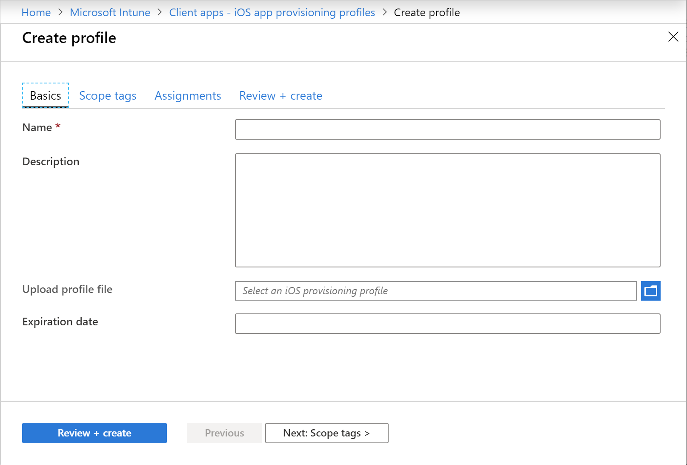

---
# required metadata

title: iOS/iPadOS app provisioning profiles in Microsoft Intune
titleSuffix:
description: Intune gives you the tools to proactively assign a new provisioning profile to devices that have apps that are nearing expiry.
keywords:
author: Erikre
ms.author: erikre
manager: dougeby
ms.date: 03/29/2022
ms.topic: how-to
ms.service: microsoft-intune
ms.subservice: apps
ms.localizationpriority: medium
ms.technology:
ms.assetid: bbc3ba4a-df48-4aeb-988b-69a177764e3a

# optional metadata

#ROBOTS:
#audience:

ms.reviewer: manchen
ms.suite: ems
search.appverid: MET150
#ms.tgt_pltfrm:
ms.custom: intune-azure
ms.collection:
- tier2
- M365-identity-device-management
- iOS/iPadOS
---

# Use iOS app provisioning profiles to prevent your apps from expiring

[!INCLUDE [azure_portal](../includes/azure_portal.md)]

## Introduction

Apple iOS/iPadOS line-of-business apps that are assigned to iPhones and iPads are built with an included provisioning profile and code that is signed with a certificate. When the app is run, iOS/iPadOS confirms the integrity of the iOS/iPadOS app and enforces policies that are defined by the provisioning profile. The following validations happen:

- **Installation file integrity** - iOS/iPadOS compares the app's details with the enterprise signing certificate's public key. If they differ, the app's content might have changed, and the app is not allowed to run.
- **Capabilities enforcement** - iOS/iPadOS attempts to enforce the app's capabilities from the enterprise provisioning profile (not individual developer provisioning profiles) that are in the app installation (.ipa) file.

The enterprise signing certificate that you use to sign apps typically lasts for three years. However, the provisioning profile expires after a year. While the certificate is still valid, Intune gives you the tools to proactively assign a new provisioning profile to devices that have apps that are nearing expiry.
After the certificate expires, you must sign the app again with a new certificate and embed a new provisioning profile with the key of the new certificate.

As the admin, you can include and exclude security groups to assign iOS/iPadOS app provisioning configuration. For example, you can assign an iOS/iPadOS app provisioning configuration to All Users, but exclude an executive group.

## How to create an iOS mobile app provisioning profile

1. Sign in to the [Microsoft Intune admin center](https://go.microsoft.com/fwlink/?linkid=2109431).
2. Select **Apps** > **iOS app provisioning profiles** > **Create profile**.
3. On the **Basics** page, add the following values:
    - **Name** - Provide a name for this mobile provisioning profile.
    - **Description** - Optionally, provide a description for the policy.
    - **Upload profile file** - Choose **Open** icon, and then choose an Apple Mobile Configuration Profile file (with the extension `.mobileprovision`) that you downloaded from the [Apple Developer website](https://developer.apple.com/).

   The **Expiration date** will be populated from a value in the Apple Mobile Configuration Profile file that you added above. 

   

4. Click **Next: Scope tags**. 
   On the **Scope tags** page you can optionally configure scope tags to determine who can see iOS/iPadOS app provisioning profile in Intune. For more information about scope tags, see [Use role-based access control and scope tags for distributed IT](../fundamentals/scope-tags.md).
5. Click **Next: Assignments**. 
   The **Assignments** page allows you can assign the profile to users and devices. It is important to note that you can assign a profile to a device whether or not the device is managed by Intune.
6. Click **Next: Review + create** to review the values you entered for the profile.
7. When you are done, click **Create** to create the iOS/iPadOS app provisioning profile in Intune. 

## Next steps

Assign the profile to the required iOS/iPadOS devices. For more information, use the steps in [How to assign device profiles](../configuration/device-profile-assign.md).
