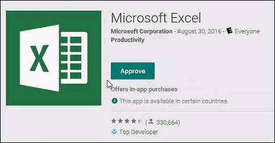
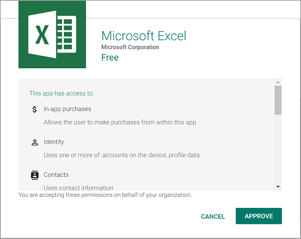
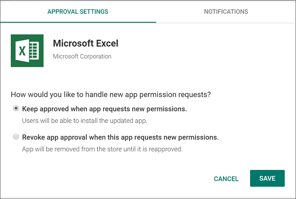

---
# required metadata

title: Add and assign Managed Google Play apps to Android Enterprise devices
titleSuffix: Microsoft Intune
description: Understand how to synchronize and assign apps to Android Enterprise devices from the Managed Google Play store.
keywords:
author: Erikre
ms.author: erikre
manager: dougeby
ms.date: 05/05/2022
ms.topic: how-to
ms.service: microsoft-intune
ms.subservice: apps
ms.localizationpriority: medium
ms.technology:
ms.assetid: 2f6c06bf-e29a-4715-937b-1d2c7cf663d4

# optional metadata

#ROBOTS:
#audience:

ms.reviewer: chrisbal
ms.suite: ems
search.appverid: MET150
#ms.tgt_pltfrm:
ms.collection:
- M365-identity-device-management
- Android
- highpri
ms.custom: intune-classic
---

# Add Managed Google Play apps to Android Enterprise devices with Intune

Managed Google Play is Google's enterprise app store and sole source of applications for Android Enterprise in Intune. You can use Intune to orchestrate app deployment through Managed Google Play for any Android Enterprise scenario (including personally-owned work profile, dedicated, fully managed, and corporate-owned work profile enrollments). How you add Managed Google Play apps to Intune differs from how Android apps are added for non-Android Enterprise. Store apps, line-of-business (LOB) apps, and web apps are approved in or added to Managed Google Play, and then synchronized into Intune so that they appear in the Client Apps list. Once they appear in the Client Apps list list, you can manage assignment of any Managed Google Play app as you would any other app.

To make it easier for you to configure and use Android Enterprise management, upon connecting your Intune tenant to Managed Google Play, Intune will automatically add four common Android Enterprise related apps to the Intune admin console. The four apps are the following:

- **[Microsoft Intune](https://play.google.com/store/apps/details?id=com.microsoft.intune)** - Used for Android Enterprise fully managed scenarios. This app is automatically installed to fully managed devices during the device enrollment process.
- **[Microsoft Authenticator](https://play.google.com/store/apps/details?id=com.azure.authenticator)** - Helps you sign-in to your accounts if you use two-factor verification. This app is automatically installed to fully managed devices during the device enrollment process.
- **[Intune Company Portal](https://play.google.com/store/apps/details?id=com.microsoft.windowsintune.companyportal)** - Used for App Protection Policies (APP) and Android Enterprise personally-owned work profile scenarios. This app is automatically installed to fully managed devices during the device enrollment process.
- **[Managed Home Screen](https://play.google.com/store/apps/details?id=com.microsoft.launcher.enterprise)** - Used for Android Enterprise dedicated multi-app kiosk scenarios. IT admins should create an assignment to install this app on dedicated devices that are going to be used in multi-app kiosk scenarios.

>[!NOTE]
>When an end user enrolls their Android Enterprise fully managed device, the Intune Company Portal app is automatically installed and the application icon may be visible to the end user. If the end user attempts to launch the Intune Company Portal app, the end user will be redirected to the Microsoft Intune app and the Company Portal app icon will be subsequently hidden.

## Before you start
- Make sure you have connected your Intune tenant to Managed Google Play.  For more information, see [Connect your Intune account to your Managed Google Play account](../enrollment/connect-intune-android-enterprise.md).
- If you intend to enroll personally-owned work profile devices, make sure you have configured Intune and Android personally-owned work profiles to work together in the **Device enrollment** workload of the portal. For more information, see [Enroll Android devices](../enrollment/android-work-profile-enroll.md).

>[!NOTE]
>When you work with Microsoft Intune, we recommend that you use either the Microsoft Edge or Google Chrome browser.

## Managed Google Play app types
There are three types of apps that are available with Managed Google Play:

- **Managed Google Play store app** - Public apps that are generally available in the Play Store. Manage these apps in Intune by browsing for the apps you want to manage, approving them, and then synchronizing them into Intune.
- **Managed Google Play private app** - These are LOB apps published to Managed Google Play by Intune admins.  These apps are private and are available only to your Intune tenant. This is how LOB apps are managed and deployed with Managed Google Play and Android Enterprise.
- **Managed Google Play web link** - Web links with IT admin-defined icons that are deployable to Android Enterprise devices. These appear on devices in the device's app list just like regular apps.

## Managed Google Play store apps

> [!NOTE]
> Most newly-created items in Intune take on the scope tags of the creator. This is not the case for Managed Google Play Store apps. Admins can assign a scope tag to apply to all newly-synced Managed Google Play apps on the Managed Google Play connector pane. For more information, see [Connect your Intune Account to your Managed Google Play account](../enrollment/connect-intune-android-enterprise.md).

There are two ways to browse and approve Managed Google Play store apps with Intune:

1. **Directly in the Intune console** - Browse and approve store apps in a view hosted within Intune. This opens directly in the Intune console and does not require you to reauthenticate with a different account.
2. **In Managed Google Play console** - You can optionally open the Managed Google Play console directly and approve apps there. See [Sync a Managed Google Play app with Intune](#sync-a-managed-google-play-app-with-intune) for more information.  This requires a separate login using the account you used to connect your Intune tenant to Managed Google Play.

### Add a Managed Google Play store app directly in the Intune console

1. Sign in to the [Microsoft Endpoint Manager admin center](https://go.microsoft.com/fwlink/?linkid=2109431).
2. Select **Apps** > **All apps** > **Add**.
3. In the **Select app type** pane, under the available **Store app** types, select **Managed Google Play app**.
4. Click **Select**. The **Managed Google Play** app store is displayed.

    > [!NOTE]
    > Your Intune tenant account must be connected to your Android Enterprise account to browse Managed Google Play store apps. For more information, see [Connect your Intune account to your Managed Google Play account](../enrollment/connect-intune-android-enterprise.md).

5. Select an app to view the app details.
6. On the page that displays the app, click **Approve**. A window for the app opens asking you to give permissions for the app to perform various operations.
7. Select **Approve** to accept the app permissions and continue.
8. Select **Keep approved when app requests new permissions** in the **Approval Settings** tab and then click **Done**. 

    > [!IMPORTANT]
    > If you do not choose this option, you will need to manually approve any new permissions if the app developer publishes an update. This will cause installations and updates of the app to stop until permissions are approved. For this reason, it is recommended to select the option to automatically approve new permissions. 

9. Click **Select** to select the app.
10. Click **Sync** at the top of the blade to sync the app with the Managed Google Play service.
11. Click **Refresh** to update the app list and display the newly added app.

### Add a Managed Google Play store app in the Managed Google Play console (Alternative)
If you prefer to synchronize a Managed Google Play app with Intune rather than adding it directly using Intune, use the following steps.

> [!IMPORTANT]
> The information provided below is an alternative method to adding a Managed Google Play app using Intune as described above.

1. Go to the [Managed Google Play store](https://play.google.com/work). Sign in with the same account you used to configure the connection between Intune and Android Enterprise.
2. Search the store and select the app you want to assign by using Intune.
3. On the page that displays the app, click **Approve**.  
    In the following example, the Microsoft Excel app has been chosen.

    

   A window for the app opens asking you to give permissions for the app to perform various operations.

4. Select **Approve** to accept the app permissions and continue.

    

5. Select an option for handling new app permission requests, and then select **Save**.

    

    The app is approved, and it is displayed in your IT admin console. Next, you can [Sync a Managed Google Play app with Intune](#sync-a-managed-google-play-app-with-intune).

## Managed Google Play private (LOB) apps

There are two ways to add LOB apps to Managed Google Play:

1. Directly in the Intune console - This allows you to add LOB apps by submitting just the app APK and a title, directly within Intune. This method does not require you to have a Google developer account and does not require you to pay the fee to register with Google as a developer.  This method is simpler and has a significantly reduced number of steps, and makes LOB apps available for management in as little as ten minutes.
1. In the Google Play Developer Console - If you have a Google developer account or want to configure advanced distribution features that are only available in the Google Play Developer Console (like adding additional app screenshots), you can use the [Google Play Developer Console](https://play.google.com/apps/publish). 

### Managed Google Play private (LOB) app publishing directly in the Intune console

1. Sign in to the [Microsoft Endpoint Manager admin center](https://go.microsoft.com/fwlink/?linkid=2109431).
2. Select **Apps** > **All apps** > **Add**.
3. In the **Select app type** pane, under the available **Store app** types, select **Managed Google Play app**.
4. Click **Select**. The **Managed Google Play** app store is displayed within Intune.
5. Select **Private apps** (next to the *lock* icon) in the Google Play window. 
6. Click the **"+"** button at the lower right to add a new app.
7. Add an app **Title** and click **Upload APK** add the APK app package.
   > [!NOTE]
   > Your app's package name must be globally unique in Google Play (not just unique within your enterprise or Google Play Developer account). Otherwise, you will receive the **Upload a new APK file with a different package name** error.
8. Click **Create**.
9. Close the Managed Google Play pane if you are done adding apps.
10. Click **Sync** on the **App app** pane to sync with the Managed Google Play service. 

    > [!NOTE]
    > Private apps may take several minutes to become available to sync. If the app does not appear the first time you perform a sync, wait a couple minutes and initiate a new sync. You can also sync apps from the Managed Google Play store. For related information, see [Sync a Managed Google Play app with Intune](#sync-a-managed-google-play-app-with-intune).

For more information about Managed Google Play private apps including a FAQ, see Google's support article: https://support.google.com/googleplay/work/answer/9146439

>[!IMPORTANT]
>Private apps added using this method can never be made public. Only use this publishing option if you are sure that this app will always be private to your organization.

### Managed Google Play private (LOB) app publishing using the Google Developer Console

1. Sign in to the [Google Play Developer Console](https://play.google.com/apps/publish) with the same account you used to configure the connection between Intune and Android Enterprise.

    > [!NOTE]
    > If you are signing in for the first time, you must register and pay a fee to become a member of the Google Developer program.

2. In the console, add new application. For details, see Google's support doc: [Publish Private apps](https://support.google.com/googleplay/android-developer/answer/9874937).
3. You upload and provide information about your app in the same way as you publish any app to the Google Play store. However, you must specifically add your organization using the Google Play Console. For details, see Google's support doc [Publish to your own organization](https://support.google.com/googleplay/android-developer/answer/9874937#zippy=%2Cpublish-to-your-own-organization).

    > [!NOTE]
    > Follow Google's support documentation to make the app available only to your organization. The app won't be available on the public Google Play store.

    For more information about uploading and publishing Android apps, see [Google Developer Console Help](https://support.google.com/googleplay/android-developer/answer/113469).
4. After you've published your app, sign in to the [Managed Google Play store](https://play.google.com/work) with the same account that you used to configure the connection between Intune and Android Enterprise.
5. In the **Apps** node of the store, verify that the app you've published is displayed.  
    The app is automatically approved to be synchronized with Intune.

## Managed Google Play web links

Managed Google Play web links are installable and manageable just like other Android apps. When installed on a device, they will appear in the user's app list alongside the other apps they have installed. When selected, they will launch in the device's browser.

> [!NOTE]
> Web links pushed down from Managed Google Play will not open in the corporate context of Microsoft Edge if you have configured your Intune application protection policy setting **Receive data from other apps** to be **Policy managed apps**. When a web link is pushed down through Managed Google Play, it’s not recognized as a MAM-managed app, which is why Microsoft Edge will open in the personal context or InPrivate mode if the user is not signed in with a personal account. For related information, see [Android app protection policy settings in Microsoft Intune](../apps/app-protection-policy-settings-android.md).

Web links will open with Microsoft Edge or any other browser app you choose to deploy. Be sure to deploy at least one browser app to devices in order for web links to be able to open properly. However, all of the **Display** options available for web links (full screen, standalone, and minimal UI) will only work with the Chrome browser. 

To create a Managed Google Play web link:

1. Sign in to the [Microsoft Endpoint Manager admin center](https://go.microsoft.com/fwlink/?linkid=2109431).
2. Select **Apps** > **All apps** > **Add**.
3. In the **Select app type** pane, under the available **Store app** types, select **Managed Google Play app**.
4. Click **Select**. The **Managed Google Play** app store is displayed within Intune.
5. Select **Web apps** (next to the *Globe* icon) in the Google Play window.
6. Click the **"+"** button at the lower right to add a new app.
7. Add an app **Title**, the web app **URL**, select how the app should be displayed, and select an app icon.
8. Click **Create**.
9. Close the Managed Google Play pane if you are done adding apps.
10. Click **Sync** on the **App app** pane to sync with the Managed Google Play service. 

    > [!NOTE]
    > Web apps may take several minutes to become available to sync. If the app does not appear the first time you perform a sync, wait a couple minutes and initiate a new sync.

## Sync a Managed Google Play app with Intune

If you have approved an app from the store and don't see it in the **Apps** workload, force an immediate sync as follows:

1. Sign in to the [Microsoft Endpoint Manager admin center](https://go.microsoft.com/fwlink/?linkid=2109431).
3. Select **Tenant administration** > **Connectors and tokens** > **Managed Google Play**.
5. In the **Managed Google Play** pane, choose **Sync**.  
    The page updates the time and status of the last sync.
6. In the Microsoft Endpoint Manager admin center select  **Apps** > **All apps**.  
    The newly available Managed Google Play app is displayed.

## Assign a Managed Google Play app to Android Enterprise personally-owned and corporate-owned work profile devices

When the app is displayed in the **App licenses** node of the **Apps** workload pane, you can [assign it just as you would assign any other app](./apps-deploy.md) by assigning the app to groups of users.

After you assign the app, it is installed (or available for install) on the devices of the users that you've targeted. The user of the device is not asked to approve the installation. For more information about Android Enterprise personally-owned work profile devices, see [Set up enrollment of Android Enterprise personally-owned work profile devices](../enrollment/android-work-profile-enroll.md). 

> [!NOTE] 
> Only apps that have been assigned will show up in the Managed Google Play store for an end user. As such, this is a key step for the admin to take when setting up apps with Managed Google Play.

## Assign a Managed Google Play app to Android Enterprise fully managed devices

[Android Enterprise fully managed devices](../enrollment/android-fully-managed-enroll.md) are corporate-owned devices associated with a single user and used exclusively for work and not personal use. Users on fully managed devices can get their available company apps from the Managed Google Play app on their device.

By default, an Android Enterprise fully managed device will not allow employees to install any apps that are not approved by the organization. Also, employees will not be able to remove any installed apps against policy. If you wish to allow users to access the full Google Play store to install apps rather than only having access to the approved apps in Managed Google Play store, you can set the **Allow access to all apps in Google Play store** to **Allow**. With this setting, the user can access all the apps in the Google Play store using their corporate account, however purchases may limited. You can remove the limited purchases restriction by allowing users to add new accounts to the device. Doing so will enable end users to have the ability to purchase apps from the Google Play store using personal accounts, as well as conduct in-app purchases. For more information, see [Android Enterprise device settings to allow or restrict features using Intune](../configuration/device-restrictions-android-for-work.md). 

> [!NOTE]
> The Microsoft Intune app, the Microsoft Authenticator app, and the Company Portal app will be installed as required apps onto all fully managed devices during onboarding. Having these apps automatically installed provides Conditional Access support, and Microsoft Intune app users can see and resolve compliance issues. 

## Update a Managed Google Play app
By default, Managed Google Play apps will not update unless the following conditions are met:

- The device is connected to wi-fi
- The device is charging
- The device is not actively being used 
- The app to be updated is not running on the foreground

For more information, see the [Manage App Updates](https://support.google.com/googleplay/work/answer/9350374?hl=en) documentation from Google. 

You can choose to configure the wi-fi requirement for dedicated, fully managed, and corporate-owned work profile devices by configuring app auto-updates in [device configurations policies](../configuration/device-restrictions-android-for-work.md).

For dedicated, fully managed, and corporate-owned work profile devices, you can choose an app update mode when an app is assigned to groups. The update modes available are:

- **Default**: The app's updates are subject to default conditions (described above). 
- **High Priority**: The app will update as soon as possible from when a new update is released, disregarding all of the default conditions. This may be disruptive for some users since the update can occur while the device is being used.
- **Postpone**: When the app receives a new update, a 90-day waiting period is triggered. After 90 days, the app is updated to the newest version available, even if that version was not the update that triggered the waiting period. Note that the 90-day window is not configurable. To terminate the waiting period early, change the update mode to either **Default** or **High Priority**.

To edit the app update mode:
1. Sign in to the [Microsoft Endpoint Manager admin center](https://go.microsoft.com/fwlink/?linkid=2109431).
2. Select **Apps** > **All apps**.
3. Select the app from the apps list.
4. Select **Properties**.
5. Select **Edit** by the **Assignments** section.
6. Find the group you'd like to edit the app update mode for by clicking the corresponding group mode for that group.
7. Under **app settings**, select the desired update mode.

## Manage Android Enterprise app permissions
Android Enterprise requires you to approve apps in the Managed Google Play web console before you sync them with Intune and assign them to your users. Because Android Enterprise allows you to silently and automatically push the apps to users' devices, you must accept the app permissions on behalf of all your users. Users don't see any app permissions when they install the apps, so it's important that you understand the permissions.

When an app developer updates permissions with a new version of the app, the permissions are not automatically accepted even if you approved the previous permissions. Devices that run the previous version of the app can still use it. However, the app is not upgraded until the new permissions are approved. Devices without the app installed do not install the app until you approve the app's new permissions. 

### Update app permissions

Periodically visit the Managed Google Play console to check for new permissions. You can configure Google Play to send you or others an email when new permissions are required for an approved app. If you assign an app and observe that it isn't installed on devices, check for new permissions following these steps:

1. Go to [Google Play](https://play.google.com/work).
2. Sign in with the Google account that you used to publish and approve the apps.
3. Select the **Updates** tab, and check to see whether any apps require an update.  
    Any listed apps require new permissions and are not assigned until they are applied.

Alternatively, you can configure Google Play to automatically reapprove app permissions on a per-app basis.

## Additional Managed Google Play app reporting for Android Enterprise personally-owned work profile devices

For Managed Google Play apps deployed to Android Enterprise personally-owned work profile devices, you can view the status and version number of the app installed on a device using Intune. 

## Working with Managed Google Play closed testing tracks

You can distribute a non-production version of a Managed Google Play app to devices enrolled in an Android Enterprise scenario (**Android Enterprise personally-owned work profile (BYOD)**, **Android Enterprise fully managed (COBO)**, **Android Enterprise dedicated devices (COSU)**, and **Android Enterprise corporate-owned work profile (COPE)**) in order to perform testing. In Intune, you can see whether an app has a pre-production build test track published to it, as well as be able to assign that track to Azure Active Directory user groups or device groups. The workflow for assigning a production version to a group that currently exists is the same as assigning a non-production channel. After deployment, the install status of each track will correspond with the track's version number in Managed Google Play. For more information, see [Google Play's closed test tracks for app pre-release testing](https://support.google.com/googleplay/android-developer/answer/3131213).

> [!NOTE]
> Required app deployments for non-production app tracks are currently unavilable for devices enrolled in Android Enterprise personally-owned work profile (BYOD).

## Delete Managed Google Play apps
When necessary, you can delete Managed Google Play apps from Microsoft Intune. To delete a Managed Google Play app, open Microsoft Intune in the portal and select **Apps** > **All apps**. From the app list, select the ellipses (...) to the right of the Managed Google Play app, then select **Delete** from the displayed list. When you delete a Managed Google Play app from the app list, the managed Google Play app is automatically unapproved.

> [!NOTE]
> If an app is unapproved or deleted from the managed Google Play store, it will not be removed from the Intune client apps list. This allows you to still target an uninstall policy to users even if the app is unapproved.
> 
> To turn off Android Enterprise enrollment and management, see [Disconnect your Android Enterprise administrative account](../enrollment/connect-intune-android-enterprise.md#disconnect-your-android-enterprise-administrative-account).

## Android Enterprise system apps

You can enable an Android Enterprise system app for [Android Enterprise dedicated devices](../enrollment/android-kiosk-enroll.md) or [fully managed devices](../enrollment/android-fully-managed-enroll.md). For more information about adding an Android Enterprise system app, see [Add Android Enterprise system apps to Microsoft Intune](apps-ae-system.md).

## Next steps

- [Assign apps to groups](apps-deploy.md)
