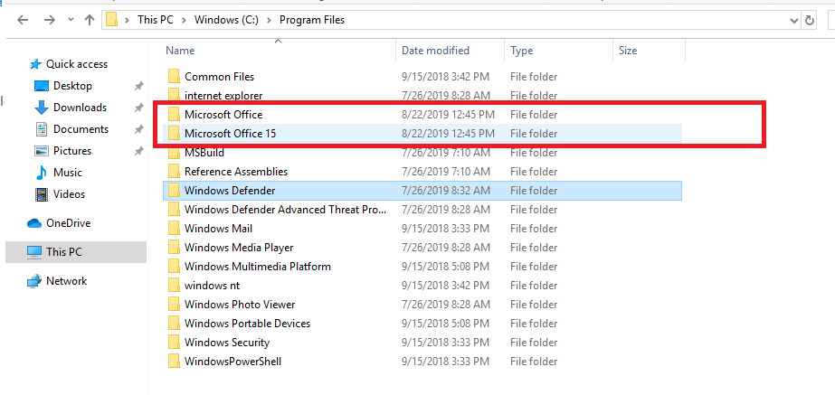
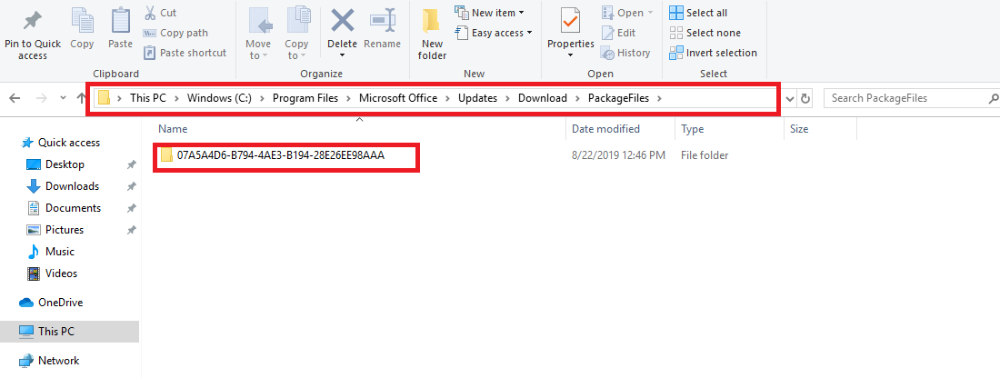
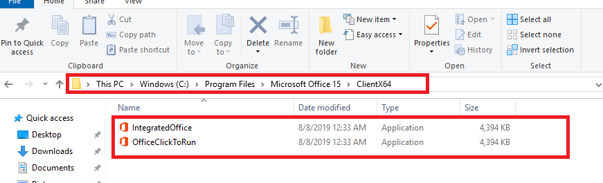

---
# required metadata

title: Add Microsoft 365 Apps to Windows 10/11 devices using Microsoft Intune
titleSuffix: 
description: Learn how you can use Microsoft Intune to install Microsoft 365 apps on Windows 10/11 devices.
keywords:
author: Erikre
ms.author: erikre
manager: dougeby
ms.date: 03/29/2022
ms.topic: how-to
ms.service: microsoft-intune
ms.subservice: apps
ms.localizationpriority: medium
ms.technology:
ms.assetid: 3292671a-5f5a-429e-90f7-b20019787d22

# optional metadata

#ROBOTS:
#audience:

ms.reviewer: craigma
ms.suite: ems
search.appverid: MET150
#ms.tgt_pltfrm:
ms.custom: intune-azure, seoapril2019
ms.collection:
- M365-identity-device-management
- Windows
- highpri
---

# Add Microsoft 365 Apps to Windows 10/11 devices with Microsoft Intune

Before you can assign, monitor, configure, or protect apps, you must add them to Intune. One of the available [app types](apps-add.md#app-types-in-microsoft-intune) is Microsoft 365 apps for Windows 10 devices. By selecting this app type in Intune, you can assign and install Microsoft 365 apps to devices you manage that run Windows 10. You can also assign and install apps for the Microsoft Project Online desktop client and Microsoft Visio Online Plan 2, if you own licenses for them. The available Microsoft 365 apps are displayed as a single entry in the list of apps in the Intune console within Azure.

> [!NOTE]
> Microsoft Office 365 ProPlus has been renamed to **Microsoft 365 Apps for enterprise**. In our documentation, we'll commonly refer to it as **Microsoft 365 Apps**.
> 
> You must use Microsoft 365 Apps licenses to activate Microsoft 365 Apps apps deployed through Microsoft Intune. Microsoft 365 Apps for business edition is supported by Intune, however you must configure the app suite of the Microsoft 365 Apps for business edition using XML data. For more information, see [Configure app suite using XML data](apps-add-office365.md#step-2---option-2-configure-app-suite-using-xml-data).
>
> Using the Office Deployment Tool (ODT) to install OneDrive through Intune is not supported. However, OneDrive will install as a component of some Microsoft 365 App installations. For related information, see [Configuration options for the Office Deployment Tool](/deployoffice/office-deployment-tool-configuration-options). 

## Before you start

> [!IMPORTANT]
> If there are .msi Office apps on the end-user device, you must use the **Remove MSI** feature to safely uninstall these apps. Otherwise, the Intune delivered Microsoft 365 apps will fail to install.
> 
> Multiple required or available app assignments are not additive. A later app assignment will overwrite pre-existing installed app assignments.

- Devices to which you deploy these apps must be running the Windows 10 Creators Update or later.
- Intune supports adding Office apps from the Microsoft 365 Apps suite only.
- If any Office apps are open when Intune installs the app suite, the installation might fail, and users might lose data from unsaved files.
- This installation method is not supported on Windows Home, Windows Team, Windows Holographic, or Windows Holographic for Business devices.
- Intune does not support installing Microsoft 365 desktop apps from the Microsoft Store (known as Office Centennial apps) on a device to which you have already deployed Microsoft 365 apps with Intune. If you install this configuration, it might cause data loss or corruption.
- Multiple required or available app assignments are not additive. A later app assignment will overwrite pre-existing installed app assignments. For example, if the first set of Office apps contains Word, and the later one does not, Word will be uninstalled. This condition does not apply to any Visio or Project applications.
- Multiple Microsoft 365 deployments are not currently supported. Only one deployment will be delivered to the device.
- **Office version** - Choose whether you want to assign the 32-bit or 64-bit version of Office. You can install the 32-bit version on both 32-bit and 64-bit devices, but you can install the 64-bit version on 64-bit devices only.
- **Remove MSI from end-user devices** - Choose whether you want to remove pre-existing Office .MSI apps from end-user devices. The installation won't succeed if there are pre-existing .MSI apps on end-user devices. The apps to be uninstalled are not limited to the apps selected for installation in **Configure App Suite**, as it will remove all Office (MSI) apps from the end user device. For more information, see [Remove existing MSI versions of Office when upgrading to Microsoft 365 Apps](/deployoffice/upgrade-from-msi-version). When Intune reinstalls Office on your end user's machines, end users will automatically get the same language packs that they had with previous .MSI Office installations.

## Select Microsoft 365 Apps

1. Sign in to the [Microsoft Endpoint Manager admin center](https://go.microsoft.com/fwlink/?linkid=2109431).
2. Select **Apps** > **All apps** > **Add**.
3. Select **Windows 10** in the **Microsoft 365 Apps** section of the **Select app type** pane.
4. Click **Select**. The **Add Microsoft 365 Apps** steps are displayed.

## Step 1 - App suite information

In this step, you provide information about the app suite. This information helps you to identify the app suite in Intune, and it helps users to find the app suite in the company portal.

1. In the **App suite information** page, you can confirm or modify the default values:
    - **Suite Name**: Enter the name of the app suite as it is displayed in the company portal. Make sure that all suite names that you use are unique. If the same app suite name exists twice, only one of the apps is displayed to users in the company portal.
    - **Suite Description**: Enter a description for the app suite. For example, you could list the apps you've selected to include.
    - **Publisher**: Microsoft appears as the publisher.
    - **Category**: Optionally, select one or more of the built-in app categories or a category that you created. This setting makes it easier for users to find the app suite when they browse the company portal.
    - **Show this as a featured app in the Company Portal**: Select this option to display the app suite prominently on the main page of the company portal when users browse for apps.
    - **Information URL**: Optionally, enter the URL of a website that contains information about this app. The URL is displayed to users in the company portal.
    - **Privacy URL**: Optionally, enter the URL of a website that contains privacy information for this app. The URL is displayed to users in the company portal.
    - **Developer**: Microsoft appears as the developer.
    - **Owner**: Microsoft appears as the owner.
    - **Notes**: Enter any notes that you want to associate with this app.
2. Click **Next** to display the **Configure app suite** page.

## Step 2 - (**Option 1**) Configure app suite using the configuration designer 

You can choose a method for configuring app setting by selecting a **Configuration settings format**. Setting format options include:
- Configuration designer
- Enter XML data

When you choose **Configuration designer** the **Add app** pane will change to offer three additional settings areas:
- Configure app suite
- App suite information
- Properties

:::image type="content" source="./media/apps-add-office365/apps-add-microsoft-365-02.png" alt-text="Screenshot: Add Microsoft 365 Apps - Configuration designer.":::

1. On the **Configuration app suite** page choose **Configuration designer**.
   - **Select Office apps**: Select the standard Office apps that you want to assign to devices by choosing the apps in the dropdown list.
   - **Select other Office apps (license required)**: Select additional Office apps that you want to assign to devices and that you have licenses for by choosing the apps in the dropdown list. These apps include licensed apps, such as Microsoft Project Online desktop client and Microsoft Visio Online Plan 2.
   - **Architecture**: Choose whether you want to assign the **32-bit** or **64-bit** version of Microsoft 365 Apps. You can install the 32-bit version on both 32-bit and 64-bit devices, but you can install the 64-bit version on 64-bit devices only.
    - **Update Channel**: Choose how Office is updated on devices. For information about the various update channels, see [Overview of update channels for Microsoft 365 Apps for enterprise](/DeployOffice/overview-of-update-channels-for-office-365-proplus). Choose from:
        - **Monthly**
        - **Monthly (Targeted)**
        - **Semi-Annual**
        - **Semi-Annual (Targeted)**

        After you choose a channel, you can choose the following:
        - **Remove other versions**: Choose **Yes** to remove other versions of Office (MSI) from user devices. Choose this option when you want to remove pre-existing Office .MSI apps from end-user devices. The installation won't succeed if there are pre-existing .MSI apps on end-user devices. The apps to be uninstalled are not limited to the apps selected for installation in **Configure App Suite**, as it will remove all Office (MSI) apps from the end user device. For more information, see [Remove existing MSI versions of Office when upgrading to Microsoft 365 Apps](/deployoffice/upgrade-from-msi-version). When Intune reinstalls Office on your end user's machines, end users will automatically get the same language packs that they had with previous .MSI Office installations. 
        - **Version to install**: Choose the version of Office that should be installed.
        - **Specific version**: If you have chosen **Specific** as the **Version to install** in the above setting, you can select to install a specific version of Office for the selected channel on end user devices. 
            
            The available versions will change over time. Therefore, when creating a new deployment, the versions available may be newer and not have certain older versions available. Current deployments will continue to deploy the older version, but the version list will be continually updated per channel.
            
            For devices that update their pinned version (or update any other properties) and are deployed as available, the reporting status will show as Installed if they installed the previous version until the device check-in occurs. When the device check-in happens, the status will temporarily change to Unknown, however it will not be shown to the user. When the user initiates the install for the newer available version, the user will see the status changed to Installed.
            
            For more information, see [Overview of update channels for Microsoft 365 Apps](/DeployOffice/overview-of-update-channels-for-office-365-proplus).
    - **Use shared computer activation**: Select this option when multiple users share a computer. For more information, see [Overview of shared computer activation for Microsoft 365 Apps](/DeployOffice/overview-of-shared-computer-activation-for-office-365-proplus).
    - **Automatically accept the app end user license agreement**: Select this option if you don't require end users to accept the license agreement. Intune then automatically accepts the agreement.
    - **Languages**: Office is automatically installed in any of the supported languages that are installed with Windows on the end-user's device. Select this option if you want to install additional languages with the app suite. 

        You can deploy additional languages for Microsoft 365 Apps managed through Intune. The list of available languages includes the **Type** of language pack (core, partial, and proofing). In the portal, select **Microsoft Intune** > **Apps** > **All apps** > **Add**. In the **App type** list of the **Add app** pane, select **Windows 10** under **Microsoft 365 Apps**. Select **Languages** in the **App Suite Settings** pane. For additional information, see [Overview of deploying languages in Microsoft 365 Apps](/deployoffice/overview-of-deploying-languages-in-office-365-proplus).
2. Click **Next** to display the **Scope tags** page.

## Step 2 - (**Option 2**) Configure app suite using XML data 

If you selected the **Enter XML data** option under the **Setting format** dropdown box on the **Configure app suite** page, you can configure the Office app suite using a custom configuration file.

:::image type="content" source="./media/apps-add-office365/apps-add-microsoft-365-01.png" alt-text="Screenshot: Add Microsoft 365 - Configuration designer - XML example.":::

1. Added your configuration XML.

    > [!NOTE]
    > The Product ID can either be Business (`O365BusinessRetail`) or Proplus (`O365ProPlusRetail`). However, you can only configure the app suite of the Microsoft 365 Apps for business edition using XML data. Note that Microsoft Office 365 ProPlus has been renamed to **Microsoft 365 Apps for enterprise**.

2. Click **Next** to display the **Scope tags** page.

For more information about entering XML data, see [Configuration options for the Office Deployment Tool](/DeployOffice/configuration-options-for-the-office-2016-deployment-tool).

## Step 3 - Select scope tags (optional)
You can use scope tags to determine who can see client app information in Intune. For full details about scope tags, see [Use role-based access control and scope tags for distributed IT](../fundamentals/scope-tags.md).

1. Click **Select scope tags** to optionally add scope tags for the app suite.
2. Click **Next** to display the **Assignments** page.

## Step 4 - Assignments

1. Select the **Required**, **Available for enrolled devices**, or **Uninstall** group assignments for the app suite. For more information, see [Add groups to organize users and devices](../fundamentals/groups-add.md) and [Assign apps to groups with Microsoft Intune](apps-deploy.md).
2. Click **Next** to display the **Review + create** page.

## Step 5 - Review + create

1. Review the values and settings you entered for the app suite.
2. When you are done, click **Create** to add the app to Intune.

    The **Overview** blade is displayed.

## Deployment details

Once the deployment policy from Intune is assigned to the target machines through [Office configuration service provider (CSP)](/windows/client-management/mdm/office-csp), the end device will automatically download the installation package from the *officecdn.microsoft.com* location. You will see two directories appearing in the *Program Files* directory:

Under the *Microsoft Office* directory, a new folder is created where the installation files are stored:

Under the *Microsoft Office 15* directory, the Office Click-to-Run installation launcher files are stored. The installation will start automatically if the assignment type is required:

The installation will be in silent mode if the assignment of Microsoft 365 is configured as required. The downloaded installation files will be deleted once the installation succeeded. If the assignment is configured as **Available**, the Office applications will appear in the Company Portal application so that end-users can trigger the installation manually.

## Troubleshooting
Intune uses the [Office Deployment Tool](/DeployOffice/overview-of-the-office-2016-deployment-tool) to download and deploy Microsoft 365 Apps to your client computers using the [Office 365 CDN](/office365/enterprise/content-delivery-networks). Reference the best practices outlined in [Managing Office 365 endpoints](/office365/enterprise/managing-office-365-endpoints) to ensure that your network configuration permits clients to access the CDN directly rather than routing CDN traffic through central proxies to avoid introducing unnecessary latency.

> [!IMPORTANT]
> For custom Office Deployment Tool XML installs, the install status only reflects the result of the installation attempt. The install status does not reflect whether the app is currently installed on the machine.

Run the [Microsoft Support and Recovery Assistant for Microsoft 365](https://diagnostics.office.com) on a targeted device if you encounter installation or run-time issues.

### Additional troubleshooting details

When you are unable to install the Microsoft 365 apps to a device, you must identify whether the issue is Intune-related or OS/Office-related. If you can see the two folders *Microsoft Office* and *Microsoft Office 15* appearing in the *Program Files* directory of the device, you can confirm that Intune has initiated the deployment successfully. If you cannot see the two folders appearing under *Program Files*, you should confirm the below cases:

- The device is properly enrolled into Microsoft Intune. 
- There is an active network connection on the device. If the device is in airplane mode, is turned off, or is in a location with no service, the policy will not apply until network connectivity is established.
- Both Intune and Microsoft 365 network requirements are met and the related IP ranges are accessible based on the following articles:

  - [Intune network configuration requirements and bandwidth](/intune/network-bandwidth-use)
  - [Office 365 URLs and IP address ranges](/office365/enterprise/urls-and-ip-address-ranges)

- The correct groups have been assigned the Microsoft 365 app suite. 

In addition, monitor the size of the directory *C:\Program Files\Microsoft Office\Updates\Download*. The installation package downloaded from the Intune cloud will be stored in this location. If the size does not increase or only increases very slowly, it is recommended to double-check the network connectivity and bandwidth.

Once you can conclude that both Intune and the network infrastructure work as expected, you should further analyze the issue from an OS perspective. Consider the following conditions:

- The target device must run on Windows 10 Creators Update or later.
- No existing Office apps are opened while Intune deploys the applications.
- Existing MSI versions of Office have been properly removed from the device. Intune utilizes Office Click-to-Run which is not compatible with Office MSI. This behavior is further mentioned in this document: 
  [Office installed with Click-to-Run and Windows Installer on same computer isn't supported](https://support.office.com/article/office-installed-with-click-to-run-and-windows-installer-on-same-computer-isn-t-supported-30775ef4-fa77-4f47-98fb-c5826a6926cd)
- The sign-in user should have permission to install applications on the device.
- Confirm there are no issues based on the Windows Event Viewer log **Windows Logs** > **Applications**.
- Capture Office installation verbose logs during the installation. To do this, follow these steps: 
    1. Activate verbose logging for Office installation on the target machines. To do this, run the following command to modify the registry: 
        `reg add HKLM\SOFTWARE\Microsoft\ClickToRun\OverRide /v LogLevel /t REG_DWORD /d 3` 
    2. Deploy the Microsoft 365 Apps to the target devices again. 
    3. Wait approximately 15 to 20 minutes and go to the **%temp%** folder and the **%windir%\temp** folder, sort by **Date Modified**, pick the *{Machine Name}-{TimeStamp}.log* files that are modified according to your repro time. 
    4. Run the following command to disable verbose log: 
        `reg delete HKLM\SOFTWARE\Microsoft\ClickToRun\OverRide /v LogLevel /f` 
        The verbose logs can provide further detailed information on the installation process.

## Errors during installation of the app suite

See [How to enable Microsoft 365 Apps ULS logging](/office/troubleshoot/diagnostic-logs/how-to-enable-office-365-proplus-uls-logging) for information on how to view verbose installation logs.

The following tables list common error codes you might encounter and their meaning.

### Status for Office CSP

| Status | Phase | Description |
|--------------------------------------------------|--------------------|------------------------------------------------------------------------------------------------------------------------------------------------------------------------------------------------|
| 1460 (ERROR_TIMEOUT) | Download | Failed to download the Office Deployment Tool |
| 13 (ERROR_INVALID_DATA) | - | Cannot verify the signature of the downloaded Office Deployment Tool |
| Error code from CertVerifyCertificateChainPolicy | - | Failed certification check for the downloaded Office Deployment Tool |
| 997 | WIP | Installing |
| 0 | After installation | Installation succeeded |
| 1603 (ERROR_INSTALL_FAILURE) | - | Failed any prerequisite check, such as:SxS (Tried to install when 2016 MSI is installed)Version mismatchOthers |
| 0x8000ffff (E_UNEXPECTED) | - | Tried to uninstall when there is no Click-to-Run Office on the machine |
| 17002 | - | Failed to complete the scenario (install). Possible reasons:Installation canceled by userInstallation canceled by another installationOut of disk space during installationUnknown language ID |
| 17004 | - | Unknown SKUs |

### Office Deployment Tool error codes

| Scenario | Return code | UI | Note |
|------------------------------------------------------------------------------------------------------------------|---------------------------------------|----------------------------------------------------|------------------------------------|
| Uninstall effort when there is no active Click-to-Run installation | -2147418113, 0x8000ffff or 2147549183 | Error Code: 30088-1008Error Code: 30125-1011 (404) | Office Deployment Tool |
| Install when there is MSI version installed | 1603 | - | Office Deployment Tool |
| Installation canceled by user, or by another installation | 17002 | - | Click-to-Run |
| Try to install 64-bit on a device that has 32-bit installed. | 1603 | - | Office Deployment Tool return code |
| Try to install an unknown SKU (not a legitimate use case for Office CSP since we should only pass in valid SKUs) | 17004 | - | Click-to-Run |
| Lack of space | 17002 | - | Click-to-Run |
| The Click-to-Run client failed to start (unexpected) | 17000 | - | Click-to-Run |
| The Click-to-Run client failed to queue scenario (unexpected) | 17001 | - | Click-to-Run |

## Next steps

- To assign the app suite to additional groups, see [Assign apps to groups](./apps-deploy.md).
