---
# required metadata

title: Configure Google Chrome for Android devices using Intune 
titleSuffix: Microsoft Intune
description: Use Intune configuration policies with Google Chrome for Android devices. 
keywords:
author: Erikre
ms.author: erikre
manager: dougeby
ms.date: 03/14/2023
ms.topic: how-to
ms.service: microsoft-intune
ms.subservice: apps
ms.localizationpriority: medium
ms.technology:
ms.assetid: 

# optional metadata

#ROBOTS:
#audience:

ms.reviewer: chrisbal
ms.suite: ems
search.appverid: MET150
#ms.tgt_pltfrm:
ms.collection:
- tier2
- M365-identity-device-management
- Android
---

# Configure Google Chrome for Android devices using Intune 

You can use an Intune app configuration policy to configure Google Chrome for Android devices. The settings for the app can be automatically applied. For example, you can specifically set the bookmarks and the URLs that you would like to block or allow.

## Prerequisites

- The user's Android Enterprise device must be enrolled in Intune. For more information, see [Set up enrollment of Android Enterprise personally-owned work profile devices](../enrollment/android-work-profile-enroll.md).
- Google Chrome is added as a Managed Google Play app. For more information about Managed Google Play, see [Connect your Intune account to your Managed Google Play account](../enrollment/connect-intune-android-enterprise.md).

## Add the Google Chrome app to Intune

1. Sign in to the [Microsoft Intune admin center](https://go.microsoft.com/fwlink/?linkid=2109431).
2. Select **Apps** > **All apps** > **Add** then add the **Managed Google Play** app.
3. Go to Managed Google Play, search with **Google Chrome** and approve.

    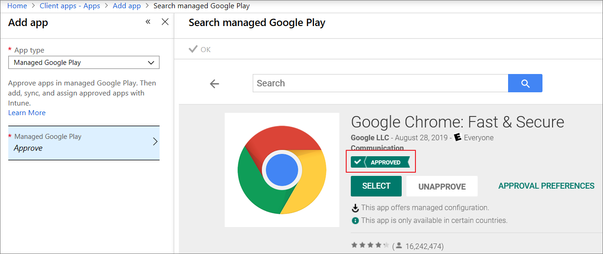

4. Assign Google Chrome to a group as a required app type. Google Chrome will be deployed automatically when the device is enrolled into Intune.

For additional details about adding a Managed Google Play app to Intune, see [Managed Google Play store apps](apps-add-android-for-work.md#managed-google-play-store-apps).

## Add app configuration for managed AE devices

1. From the [Microsoft Intune admin center](https://go.microsoft.com/fwlink/?linkid=2109431), select **Apps** > **App configuration policies** > **Add** > **Managed devices**.
2. Set the following details:
    - **Name** - The name of the profile that appears in the portal.
    - **Description** - The description of the profile that appears in the portal.
    - **Device enrollment type** - This setting is set to **Managed devices**.
    - **Platform** - Select **Android**.

    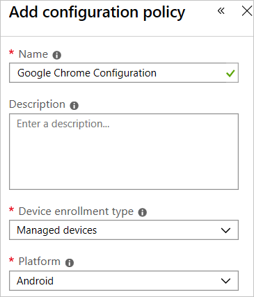

3. Click **Associated app** to display the **Associated app** pane. Find and select **Google Chrome**. This list contains [Managed Google Play apps that you've approved and synchronized with Intune](apps-add-android-for-work.md).

    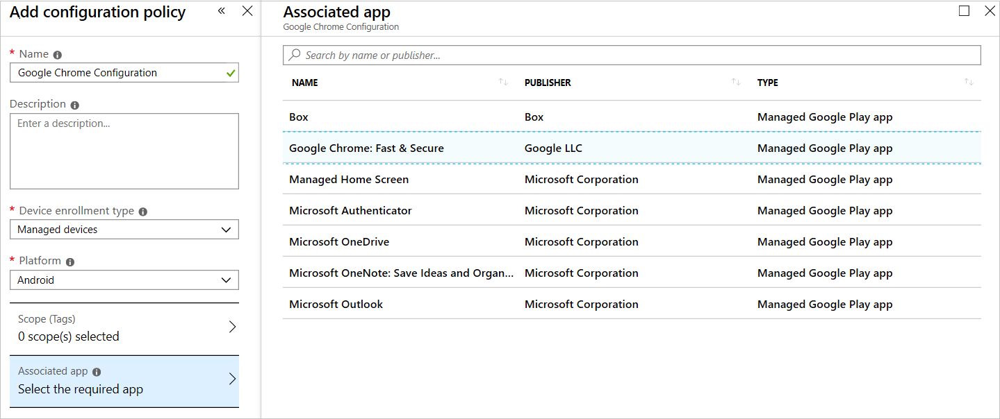

4. Click **Configuration settings**, select **Use configuration designer**, and then click **Add** to select the configuration keys.

    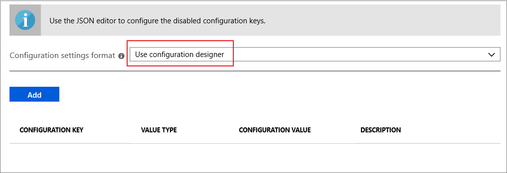

    Below is the example of the common settings:
    - **Block access to a list of URLs**: `["*"]`
    - **Allow access to a list of URLs**: `["baidu.com", "youtube.com", "chromium.org", "chrome://*"]`
    - **Managed Bookmarks**: `[{"toplevel_name": "My managed bookmarks folder"  },  {"url": "baidu.com",   "name": "Baidu"},  {"url": "youtube.com", "name": "Youtube"},  {"name": "Chrome links",  "children": [{"url": "chromium.org", "name": "Chromium"},    {"url": "dev.chromium.org", "name": "Chromium Developers"}]}]`
    - **Incognito mode availability**: `Incognito mode disabled`

    Once the configuration settings are added using the configuration designer, they will be listed in a table. 

    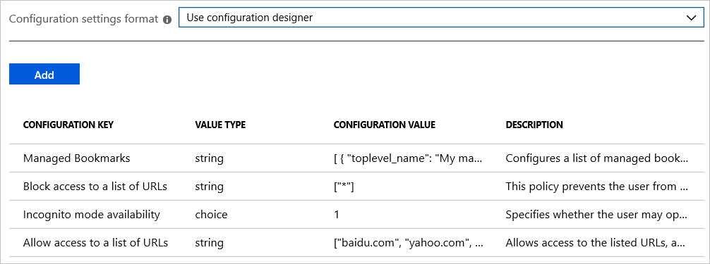

    The above settings create bookmarks and block access to all URLs except `baidu.com`, `youtube.com`, `chromium.org`, and `chrome://`.

5. Click **OK** and **Add** to add your configuration policy to Intune.
6. Assign this configuration policy to a user group. For more information, see [Assign apps to groups with Microsoft Intune](apps-deploy.md).

## Verify the device settings

Once the Android device is enrolled with Android Enterprise, the managed Google Chrome app with the portfolio icon will be deployed automatically.

   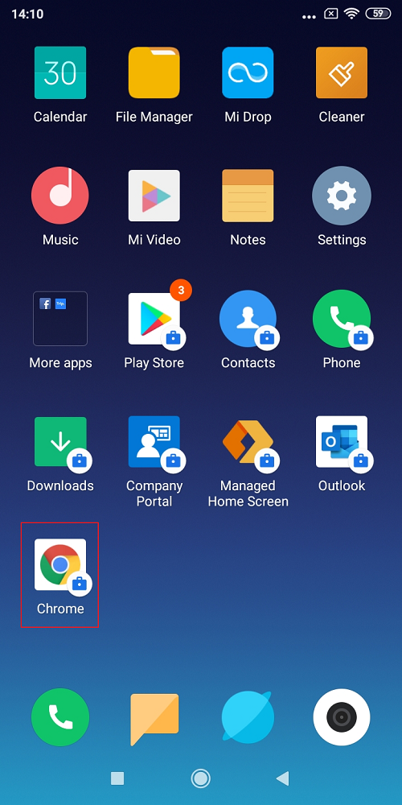

Launch Google Chrome and you will find the settings applied.

   Bookmarks: 
   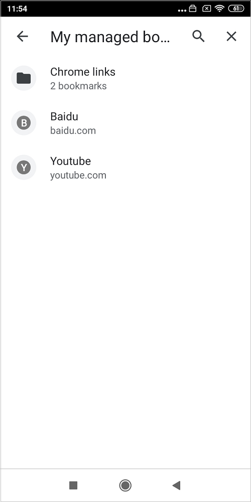

   Blocked URL: 
   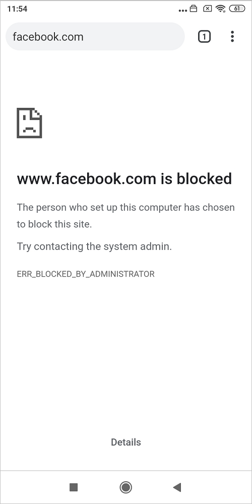

   Allow URL: 
   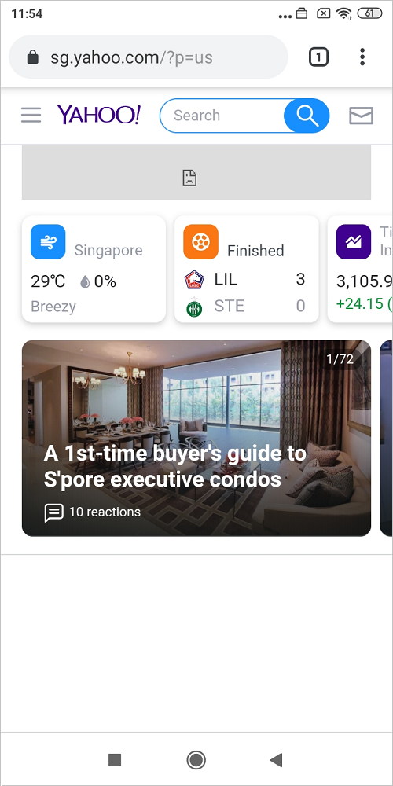

   Incognito tab: 
   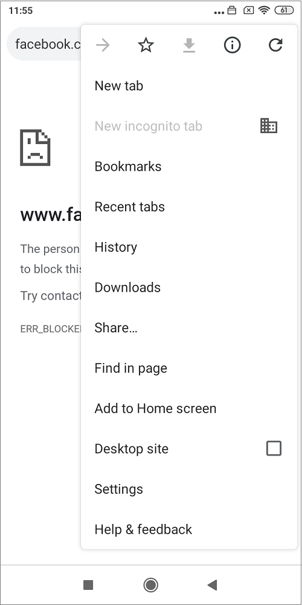

## Troubleshooting

1. Check Intune to monitor the policy deployment status.

    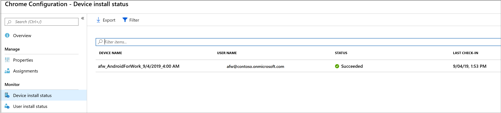

2. Launch Google Chrome and visit **chrome://policy**. We can confirm if the settings are applied successfully.

    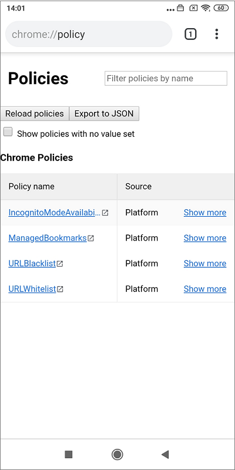

## Additional information

- [Add app configuration policies for managed Android Enterprise devices](app-configuration-policies-use-android.md)
- [Chrome Enterprise policy list](https://cloud.google.com/docs/chrome-enterprise/policies/)

## Next steps

- For more information about Android Enterprise fully managed devices, see [Set up Intune enrollment of Android Enterprise fully manage devices](../enrollment/android-fully-managed-enroll.md).
