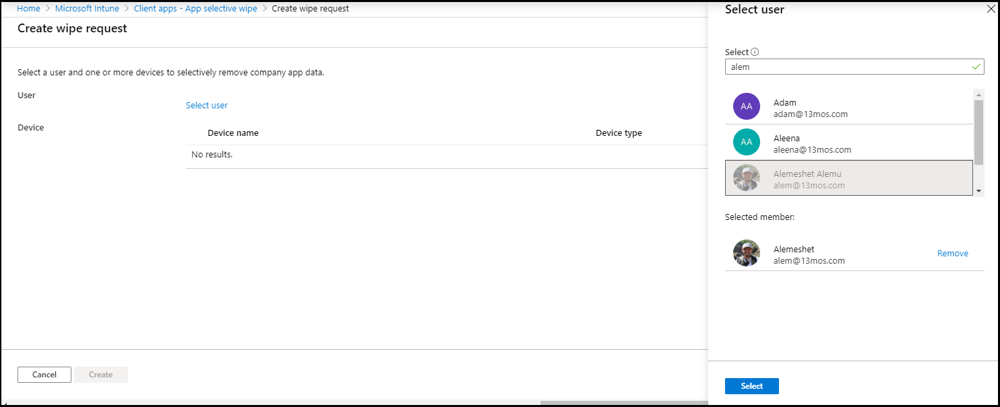
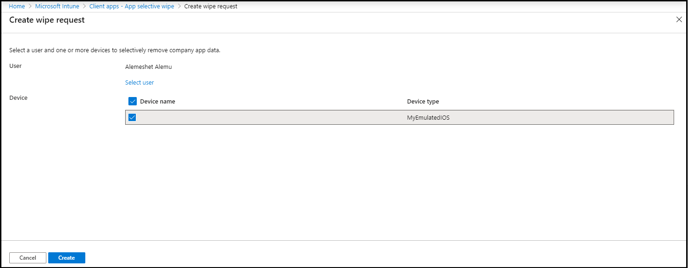
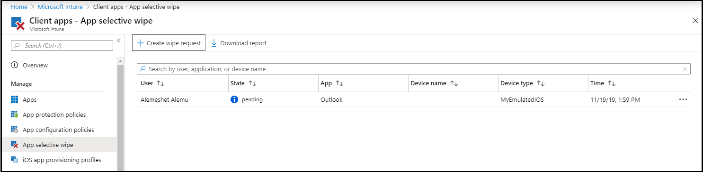
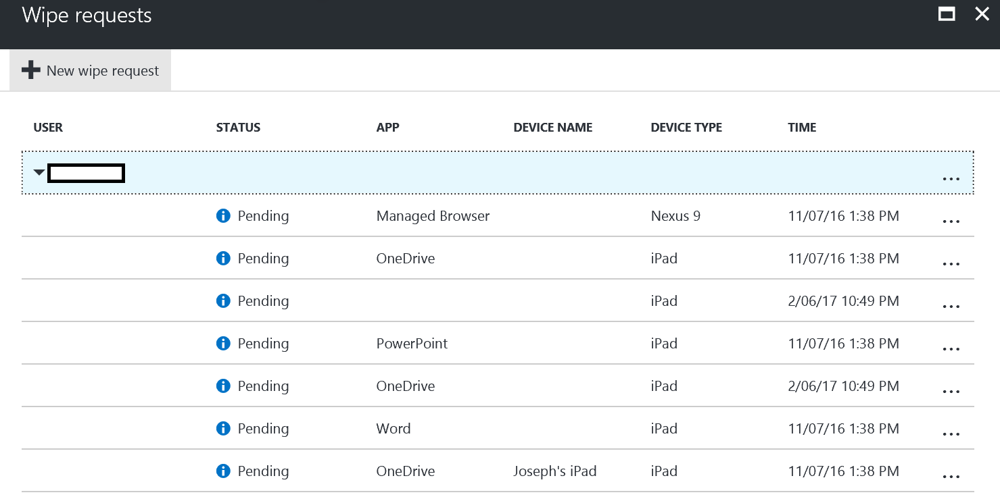
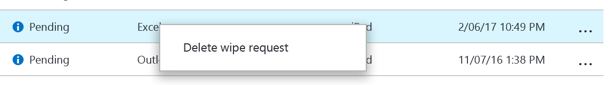

---
# required metadata

title: How to wipe only corporate data from apps
titleSuffix: Microsoft Intune
description: Learn how to selectively wipe only corporate data from Intune-managed apps with Microsoft Intune.
keywords:
author: Erikre
ms.author: erikre
manager: dougeby
ms.date: 03/29/2022
ms.topic: how-to
ms.service: microsoft-intune
ms.subservice: apps
ms.localizationpriority: medium
ms.technology:
ms.assetid: 42605e6e-5b84-44ff-b86e-346ea123b53e

# optional metadata

#ROBOTS:
#audience:

ms.reviewer: manchen
ms.suite: ems
search.appverid: MET150
#ms.tgt_pltfrm:
ms.custom: intune-azure
ms.collection:
- tier1
- M365-identity-device-management
- highpri
---

# How to wipe only corporate data from Intune-managed apps

When a device is lost or stolen, or if the employee leaves your company, you want to make sure company app data is removed from the device. But you might not want to remove personal data on the device, especially if the device is an employee-owned device.

>[!NOTE]
> The iOS/iPadOS, Android, and Windows 10 platforms are the only platforms currently supported for wiping corporate data from Intune managed apps. Intune managed apps are applications that include the Intune APP SDK, and have at least one enabled and licensed user account in your organization. Deployment of Application Protection Policies is required to enable app selective wipe on Android and iOS.

> [!NOTE]
> For iOS 16 and later devices, the "Device Name" value for all selective wipe actions and status will be a generic device name.  For more information, see [Apple Developer documentation](https://developer.apple.com/documentation/uikit/uidevice/1620015-name).

To selectively remove company app data, create a wipe request by using the steps in this topic. After the request is finished, the next time the app runs on the device, company data is removed from the app. In addition, you can also configure a selective wipe of your company data as a new action when the conditions of Application Protection Policies (APP) Access settings are not met. This feature helps you automatically protect and remove sensitive company data from applications based on pre-configured criteria.

>[!IMPORTANT]
> Contacts synced directly from the app to the native address book are removed. Any contacts synced from the native address book to another external source can't be wiped. Currently, this only applies to the Microsoft Outlook app.

## Deployed WIP policies without user enrollment

Windows Information Protection (WIP) policies can be deployed without requiring MDM users to enroll their Windows 10 device. This configuration allows companies to protect their corporate documents based on the WIP configuration, while allowing the user to maintain management of their own Windows devices. Once documents are protected with a WIP policy, the protected data can be selectively wiped by an Intune administrator ([Global administrator or an Intune Service administrator](../fundamentals/users-add.md#types-of-administrators)). By selecting the user and device, and sending a wipe request, all data that was protected via the WIP policy will become unusable. From the Intune in the portal, select **Client app** > **App selective wipe**. For more information, see [Create and deploy Windows Information Protection (WIP) app protection policy with Intune](windows-information-protection-policy-create.md).

## Create a device based wipe request

1. Sign in to the [Microsoft Intune admin center](https://go.microsoft.com/fwlink/?linkid=2109431).
2. Select **Apps** > **App selective wipe** > **Create wipe request**. 
   The **Create wipe request** pane is displayed.
3. Click **Select user**, choose the user whose app data you want to wipe, and click **Select** at the bottom of the **Select user** pane.

    

4. Click **Select the device**, choose the device, and click **Select** at the bottom of the **Select Device** pane.

    

5. Click **Create** to make a wipe request.

The service creates and tracks a separate wipe request for each protected app on the device, and the user associated with the wipe request.

   

## Create a user based wipe request

By adding a user to the User-level wipe we will automatically issue wipe commands to all apps on all the user's devices.  The user will continue to get wipe commands at every check-in from all devices.  To re-enable a user, you must remove them from the list.  

1. Sign in to the [Microsoft Intune admin center](https://go.microsoft.com/fwlink/?linkid=2109431).
2. Select **Apps** > **App selective wipe** > **User-Level Wipe**
3. Click **Add** and **Select user** pane is displayed.
4. Chose the user whose app data you would like to wipe and click **Select**.

## Monitor your wipe requests

You can have a summarized report that shows the overall status of the wipe request, and includes the number of pending requests and failures. Completed wipe request entries remain in the report for 4 days after completion. In the event that a wipe request is not marked as completed, but remains in a pending state, the request remains in the report for a total number of days equal to the sum of the value of Offline grace period wipe data + 4 days for the record to be deleted which, by default, is 94 days.

To get more details, follow these steps:

1. On the **Apps** > **App selective wipe** pane, you can see the list of your requests grouped by users. Because the system creates a wipe request for each protected app running on the device, you might see multiple requests for a user. The status indicates whether a wipe request is **pending**, **failed**, or **successful**.

    

Additionally, you are able to see the device name, and its device type, which can be helpful when reading the reports.

>[!IMPORTANT]
> The user must open the app for the wipe to occur, and the wipe may take up to 30 minutes after the request was made.

## Delete a device wipe request

Wipes with pending status are displayed until you manually delete them. To manually delete a wipe request:

1. On the **Client Apps - App selective wipe** pane.

2. From the list, right-click on the wipe request you want to delete, then choose **Delete wipe request**.

    

3. You're prompted to confirm the deletion, choose **Yes** or **No**, then click **OK**.

## Delete a user wipe request

User wipes will remain in the list until removed by an administrator. To remove a user from the list:

1. On the **Client Apps - App selective wipe** pane select **User-Level Wipe**
2. From the list, right-click on the user you want to delete, then choose **Delete**.

## See also

[What's app protection policy](app-protection-policy.md)

[What's app management](app-management.md)
