# Microsoft Intune protected apps

The apps listed in this article are supported partner and Microsoft apps that are commonly used with Microsoft Intune. Intune protected apps are enabled with a rich set of mobile application protection policies.

> [!NOTE]
> For your client line-of-business apps, you can incorporate mobile app management using the [Intune App Software Development Kit](../developer/app-sdk.md) (SDK), or the [App Wrapping Tool for iOS](../developer/app-wrapper-prepare-ios.md) and the [App Wrapping Tool for Android](../developer/app-wrapper-prepare-android.md).

## Core app settings

The following tables provide details of supported partner and Microsoft apps that are commonly used with Microsoft Intune. These apps support the **core App Protection Policy settings** which are defined as:

- Protecting work or school account data while leaving personal data untouched in apps that support multi-identity
- Restricting data transfer and copy-and-paste functions
- Encrypting work or school account data
- Configuring work or school account web links to open inside a managed browser, like Microsoft Edge
- Enforcing access requirements to access work or school account data
- Enforcing conditional launch behaviors to protect the work or school account data
- Applying data loss prevention policies without managing the user's device
- Enabling app protection without requiring enrollment
- Enabling app protection on devices managed with third-party unified endpoint management solutions

## Advanced app settings

In addition to supporting the core App Protection Policy settings, apps are also capable of supporting **advanced App Protection Policy and App Configuration Policy** settings. These settings require app investment:

- App Configuration Policies can be used by apps to customize app behavior and/or App Protection Policy settings.
- On enrolled devices, managed apps can use *org allowed accounts mode* to require sign-in with a specific identity and disable multi-identity functionality.
- The *Sync policy managed app data with native apps* App Protection Policy setting can be utilized by apps to restrict the synchronization of contact or calendar data to the native apps.
- The *Org data notifications* App Protection Policy setting can be utilized by apps to limit the exposure of sensitive data in notifications.
- The *Open data into Org documents* App Protection Policy setting can be utilized by apps to restrict importing data from unmanaged locations.
- The *Save copies of org data* App Protection Policy setting can be utilized by apps to restrict which locations can be used when saving work or school account data.

## Microsoft apps

> [!NOTE]
> For more information on Conditional Access support, see [App protection policy requirement](/azure/active-directory/conditional-access/concept-conditional-access-grant#require-app-protection-policy).

The below apps support the Core Intune App Protection Policy settings and are also capable of supporting advanced App Protection Policy and App Configuration Policy settings:

|App|Platform|[Core App Protection Policy settings](apps-supported-intune-apps.md#core-app-settings)|[App configuration](app-configuration-policies-overview.md)|Org allowed accounts ([iOS](app-configuration-policies-use-ios.md#allow-only-configured-organization-accounts-in-apps), [Android](app-configuration-policies-use-android.md#allow-only-configured-organization-accounts-in-apps))|Sync policy managed app data with native apps ([iOS](app-protection-policy-settings-ios.md#functionality), [Android](app-protection-policy-settings-android.md#functionality))|Org data notifications ([iOS](app-protection-policy-settings-ios.md#functionality), [Android](app-protection-policy-settings-android.md#functionality))|Open data into Org documents ([iOS](app-protection-policy-settings-ios.md#data-transfer), [Android](app-protection-policy-settings-android.md#data-transfer))|Save copies of org data ([iOS](app-protection-policy-settings-ios.md#data-transfer), [Android](app-protection-policy-settings-android.md#data-transfer))|
|--- |--- |:-: |--- |:-: |:-: |:-: |:-: |:-: |
|Microsoft Azure|[Android](https://play.google.com/store/apps/details?id=com.microsoft.azure&pcampaignid=web_share)|✔|No settings|✖|N/A|✖|✖|N/A| 
|Microsoft Azure|[iOS](https://apps.apple.com/app/microsoft-azure/id1219013620)|✔|No settings|✖|N/A|✖|✖|N/A| 
|Microsoft Copilot|[Android](https://play.google.com/store/apps/details?id=com.microsoft.copilot)|✔|No settings|✖|N/A|✖|✖|N/A|
|Microsoft Copilot|[iOS](https://apps.apple.com/us/app/microsoft-copilot/id6472538445)|✔|No settings|✔ Supported for v28.1.420324001 or later|N/A|✖|✖|N/A|
|Microsoft Edge|[Android](https://play.google.com/store/apps/details?id=com.microsoft.emmx)|✔|✔ see [Edge app config](manage-microsoft-edge.md)|✔|N/A|N/A|N/A|✔|
|Microsoft Edge|[iOS](https://apps.apple.com/us/app/microsoft-edge/id1288723196)|✔|✔ see [Edge app config](manage-microsoft-edge.md)|✔|N/A|N/A|N/A|✔|
|Microsoft Excel|[Android](https://play.google.com/store/apps/details?id=com.microsoft.office.excel)|✔|No settings|✔|N/A|✖|✖|✔|
|Microsoft Excel|[iOS](https://apps.apple.com/us/app/microsoft-excel/id586683407)|✔|No settings|✔|N/A|✖|✖|✔|
|Microsoft Launcher|[Android](https://play.google.com/store/apps/details?id=com.microsoft.launcher)|✔|✔ see [Launcher app config](configure-microsoft-launcher.md)|✖|N/A|✖|✖|N/A|
|Microsoft Lens - PDF Scanner|[Android](https://play.google.com/store/apps/details?id=com.microsoft.office.officelens)|✔|No settings|✖|N/A|✖|✖|N/A|
|Microsoft Lens - PDF Scanner|[iOS](https://apps.apple.com/us/app/microsoft-lens-pdf-scanner/id975925059)|✔|No settings|✖|N/A|✖|✖|N/A|
|Microsoft Lists|[iOS](https://apps.apple.com/us/app/microsoft-lists/id1530637363)|✔|No settings|✔|N/A|N/A|✔|✔|
|Microsoft Lists|[Android](https://play.google.com/store/apps/details?id=com.microsoft.lists.public&gl=US)|✔|No settings|✖|N/A|N/A|✖|✖|
|Microsoft Loop|[iOS](https://apps.apple.com/us/app/microsoft-loop/id1637682491)|✔|No settings|✔|N/A|✖|N/A|N/A|
|Microsoft Loop|[Android](https://play.google.com/store/apps/details?id=com.microsoft.loop)|✔|No settings|✔|N/A|✖|N/A|N/A|
|Office (Microsoft 365)|[Android](https://play.google.com/store/apps/details?id=com.microsoft.office.officehubrow)|✔|✔ see [Office app config](manage-microsoft-office.md)|✔|N/A|✖|✖|✔|
|Microsoft 365 (Office)|[iOS](https://apps.apple.com/app/microsoft-office/id541164041)|✔|✔ see [Office app config](manage-microsoft-office.md)|✔|N/A|✔ Supported for v2.72 or later|✖|✔|
|Microsoft OneDrive|[Android](https://play.google.com/store/apps/details?id=com.microsoft.skydrive)|✔|No settings|✔|N/A|✖|✔|N/A|
|Microsoft OneDrive|[iOS](https://apps.apple.com/us/app/onedrive-cloud-storage-for/id477537958)|✔|No settings|✔|N/A|✖|✔|N/A|
|Microsoft OneNote|[Android](https://play.google.com/store/apps/details?id=com.microsoft.office.onenote)|✔|No settings|✔|N/A|✖|✖|N/A|
|Microsoft OneNote|[iOS](https://apps.apple.com/us/app/microsoft-onenote-for-iphone/id410395246)|✔|No settings|✔|N/A|✖|✖|N/A|
|Microsoft Outlook|[Android](https://play.google.com/store/apps/details?id=com.microsoft.office.outlook)|✔|✔ see [Outlook app config](/exchange/clients-and-mobile-in-exchange-online/outlook-for-ios-and-android/outlook-for-ios-and-android-configuration-with-microsoft-intune)|✔|✔|✔|✔|✖|
|Microsoft Outlook|[iOS](https://apps.apple.com/us/app/microsoft-outlook/id951937596)|✔|✔ see [Outlook app config](/exchange/clients-and-mobile-in-exchange-online/outlook-for-ios-and-android/outlook-for-ios-and-android-configuration-with-microsoft-intune)|✔|✔|✔ Supports "Block org data" for v4.34.0 or later|✔|✔|
|Microsoft Planner|[Android](https://play.google.com/store/apps/details?id=com.microsoft.planner)|✔|No settings|✖|N/A|✖|✖|N/A|
|Microsoft Planner|[iOS](https://apps.apple.com/us/app/microsoft-planner/id1219301037)|✔|No settings|✖|N/A|✖|✖|N/A|
|Microsoft PowerPoint|[Android](https://play.google.com/store/apps/details?id=com.microsoft.office.powerpoint)|✔|No settings|✔|N/A|✖|✖|✔|
|Microsoft PowerPoint|[iOS](https://apps.apple.com/us/app/microsoft-powerpoint/id586449534)|✔|No settings|✔|N/A|✖|✖|✔|
|Microsoft Remote Desktop|[Android](https://play.google.com/store/apps/details?id=com.microsoft.rdc.androidx)|✔|✔|✖|N/A|N/A|N/A|N/A|
|Microsoft Remote Desktop|[iOS](https://apps.apple.com/us/app/remote-desktop-mobile/id714464092)|✔|✔|✖|N/A|N/A|N/A|N/A|
|Microsoft SharePoint|[Android](https://play.google.com/store/apps/details?id=com.microsoft.sharepoint)|✔|No settings|✖|N/A|✖|✖|N/A|
|Microsoft SharePoint|[iOS](https://apps.apple.com/us/app/microsoft-sharepoint/id1091505266)|✔|No settings|✖|N/A|✖|✖|N/A|
|Microsoft Teams|[Android](https://play.google.com/store/apps/details?id=com.microsoft.teams)|✔|No settings|✔|N/A|✔|✔|✔|
|Microsoft Teams|[iOS](https://apps.apple.com/us/app/microsoft-teams/id1113153706)|✔|No settings|✔|N/A|✔ Supported for v2.0.22 or later|✔|✔|
|Microsoft To-Do|[Android](https://play.google.com/store/apps/details?id=com.microsoft.todos)|✔|No settings|✖|N/A|✖|✖|N/A|
|Microsoft To-Do|[iOS](https://apps.apple.com/us/app/microsoft-to-do/id1212616790)|✔|No settings|✖|N/A|✖|✖|N/A|
|Microsoft Word|[Android](https://play.google.com/store/apps/details?id=com.microsoft.office.word)|✔|No settings|✔|N/A|✖|✖|✔|
|Microsoft Word|[iOS](https://apps.apple.com/us/app/microsoft-word/id586447913)|✔|No settings|✔|N/A|✖|✖|✔|
|Microsoft Viva Engage|[Android](https://play.google.com/store/apps/details?id=com.yammer.v1)|✔|No settings|✔|N/A|✖|✖|N/A|
|Microsoft Viva Engage|[iOS](https://apps.apple.com/us/app/yammer/id289559439)|✔|No settings|✔|N/A|✖|✖|N/A|

The below apps support the core Intune App Protection Policy settings.

|App|Platform|[Core App Protection Policy settings](app-protection-policy.md)|[App configuration](app-configuration-policies-overview.md)|
|--- |--- |:-: |--- |
|Dynamics 365 Remote Assist|[Android](https://play.google.com/store/apps/details?id=com.microsoft.ramobile)|✔|No settings|
|Dynamics 365 Remote Assist|[iOS](https://apps.apple.com/us/app/dynamics-365-remote-assist/id1470512565)|✔|No settings|
|Dynamics 365 Sales|[Android](https://play.google.com/store/apps/details?id=com.microsoft.crm.crmphone.sales)|✔|No settings|
|Dynamics 365 Sales|[iOS](https://apps.apple.com/app/dynamics-365-sales/id1485578688)|✔|No settings|
|Dynamics 365 for phone|[iOS](https://apps.apple.com/us/app/dynamics-365-for-phones/id1003997947)|✔|No settings|
|Dynamics 365 for phone|[Android](https://play.google.com/store/apps/details?id=com.microsoft.crm.crmphone)|✔|No settings|
|Field Service (Dynamics 365)|[Android](https://play.google.com/store/apps/details?id=com.microsoft.crm.crmphone.fieldServices)|✔|No settings|
|Field Service (Dynamics 365)|[iOS](https://apps.apple.com/app/field-service-dynamics-365/id1485579247?ls=1)|✔|No settings|
|Microsoft 365 Admin|[Android](https://play.google.com/store/apps/details?id=com.ms.office365admin)|✔|No settings|
|Microsoft 365 Admin|[iOS](https://apps.apple.com/app/microsoft-365-admin/id761397963)|✔|No settings|
|Microsoft Azure Information Protection Viewer|[Android](https://play.google.com/store/apps/details?id=com.microsoft.ipviewer)|✔|No settings|
|Microsoft Azure Information Protection Viewer|[iOS](https://apps.apple.com/us/app/rms-sharing/id689516635)|✔|No settings|
|Microsoft Dynamics CRM|[Android](https://play.google.com/store/apps/details?id=com.microsoft.crm.crmphone)|✔|No settings|
|Microsoft Dynamics CRM|[iOS](https://apps.apple.com/app/microsoft-dynamics-crm/id678800460)|✔|No settings|
|Microsoft PowerApps|[Android](https://play.google.com/store/apps/details?id=com.microsoft.msapps)|✔|No settings|
|Microsoft PowerApps|[iOS](https://apps.apple.com/us/app/powerapps/id1047318566)|✔|No settings|
|Microsoft Power Automate|[Android](https://play.google.com/store/apps/details?id=com.microsoft.flow)|✔|No settings|
|Microsoft Power Automate|[iOS](https://apps.apple.com/us/app/microsoft-flow/id1094928825)|✔|No settings|
|Microsoft Power BI|[Android](https://play.google.com/store/apps/details?id=com.microsoft.powerbim)|✔|No settings|
|Microsoft Power BI|[iOS](https://apps.apple.com/us/app/microsoft-power-bi/id929738808)|✔|No settings|
|Microsoft Skype for Business|[Android](https://play.google.com/store/apps/details?id=com.microsoft.office.lync15)|✔|No settings|
|Microsoft Skype for Business|[iOS](https://apps.apple.com/app/skype-for-business-formerly/id605841731)|✔|No settings|
|Microsoft Whiteboard|[iOS](https://apps.apple.com/app/microsoft-whiteboard/id1352499399)|✔|No settings|
|Microsoft Whiteboard|[Android](https://play.google.com/store/apps/details?id=com.microsoft.whiteboard.publicpreview)|✔|No settings|

> [!NOTE]
> For Microsoft 365 (Office) for Android, add the Office Hub, Office Hub (HL), and Office Hub (ROW) apps to Android App Protection Policies.

## Partner productivity apps

The following apps support the core Intune App Protection Policy settings. Apps are also capable of supporting advanced App Protection Policy and App Configuration Policy settings. For more information, contact the app vendor.

> [!IMPORTANT]
> Contact the app vendor for specific details on Intune related support. 

| App   title | App description | App store links for supported   platform(s) | 
|-------------------------------------------------|-------------------------|---------------------------------------------|
| :::no-loc text="365Pay"::: 
 | The 365Pay app provides a quick way to buy products across various experiences offered in your workplace. Use your unique QR code to touchlessly checkout at any 365 self-checkout experiences. You can earn loyalty points while ordering ahead from the cafeteria and scan and pay for products using the app itself. The 365Pay app also helps you stay up to date on new and exciting products and promotions being offered at your location! | [Google Play link (Android)](https://play.google.com/store/apps/details?id=com.avinside&hl=en_US), [App Store link (iOS)](https://apps.apple.com/us/app/365pay/id1087422156) | 
| :::no-loc text="Achievers"::: 
 | The Achievers app puts the power of recognition in your hands. Achieving great things is a challenge. Recognizing someone for great achievements is easy. Engage, align, and recognize colleagues with the touch of a screen at any time and anywhere. | [Google Play link (Android)](https://play.google.com/store/apps/details?id=com.achievers.client), [App Store link (iOS)](https://apps.apple.com/app/achievers/id945779451) | 
| :::no-loc text="Acronis Access"::: 
 | Safely access your business files from anywhere and any device with Acronis Access. Easily share documents with colleagues, customers, and vendors while keeping files and data secure and private, where only you and your organization can touch them. The app is designed for extreme ease of use with unparalleled security, privacy, and management capabilities. | [App Store link (iOS)](https://apps.apple.com/us/app/acronis-access/id429704844?mt=8) |                       
| :::no-loc text="Adobe Acrobat Reader"::: 
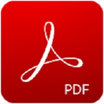 | Open, view, and work with PDFs in a Microsoft Intune managed environment with Adobe Acrobat Reader. Available for iOS/iPadOS and Android. | [Google Play link (Android)](https://play.google.com/store/apps/details?id=com.adobe.reader), [App Store link (iOS)](https://apps.apple.com/app/adobe-acrobat-reader-for-pdf/id469337564) |
| :::no-loc text="Akumina EXP"::: 
 | Connect to your personalized digital workplace from anywhere with Akumina EXP. Akumina empowers businesses to create a personalized modern intranet and digital workplace to help employees connect to the business, their tasks, and each other.
The Akumina EXP app provides the following features:<ul><li>A gateway to your complete digital workplace and favorite tools</li><li>Company news, events, and important information</li><li>Options to comment, like, and share intranet content</li><li>Easy access to information with document libraries and people directory search</li><li>Targeted notifications, updates, and critical alerts</li><li>Managed preferences and tags for a personalized experience</li><li>Collaboration areas to recognize and celebrate teammates</li><li>Ability to complete tasks in integrated systems, such as Workday, ServiceNow, Microsoft365</li></ul>
Used by over 6+ Millions daily active users in 80 languages, Akumina is the global digital workplace and modern intranet solution for modern enterprises.
To access Akumina Mobile, your organization must have an active Akumina subscription. | [Google Play link (Android)](https://play.google.com/store/apps/details?id=com.akumina.exp), [App Store link (iOS)](https://apps.apple.com/app/akumina-exp/id6449744821) |
| :::no-loc text="Align for Intune"::: 
 | Align for Intune allows you to review your legal documents, highlight documents with a touch of your finger, and markup documents with the Apple Pencil. Additionally, you can easily sync documents, making them instantly available on your laptop and to your teammates across the firm.
Align for Intune requires an Intune license. This app has been specially developed to operate with Microsoft Intune mobile application management (MAM). | [App Store link (iOS)](https://apps.apple.com/us/app/align-for-intune/id6468679454) |
| :::no-loc text="Appian for Intune"::: 
 | Appian empowers business users to monitor, collaborate, and take action on the go, enabling your mobile workforce to stay connected to key business processes and enterprise data.
Appian’s Business Process Management and Case Management Suite delivers mobile access to event notifications, forms, tasks, information, reports, content, and ad-hoc collaboration.
Appian provides the following: <ul><li>Mobile access to the Appian platform</li><li>Mobile task management</li><li>Collaborative activity feed</li><li>Enterprise data discovery</li><li>Offline forms processing</li><li>Access to enterprise reports and analytics</li></ul>This application requires authorized access to an instance of Appian. | [Google Play link (Android)](https://play.google.com/store/apps/details?id=com.appian.android.intune), [App Store link (iOS)](https://apps.apple.com/app/id1573771379) |
| :::no-loc text="ArcGIS Indoors for Intune"::: 
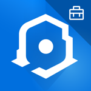 | ArcGIS Indoors for Intune provides an indoor mapping experience for understanding the location of things and activities happening within your organization’s indoor environment. Use the wayfinding, location sharing, and workspace reservation capabilities to feel more connected to your workplace or campus, see increased levels of productivity and collaboration, and less time feeling the stress of being lost. | [Google Play link (Android)](https://play.google.com/store/apps/details?id=com.esri.indoors.intune), [App Store link (iOS)](https://apps.apple.com/app/arcgis-indoors-for-intune/id1613222675) |
| :::no-loc text="ArchXtract (MDM)"::: 
 | ArchXtract is used to decompress zip files between Microsoft Intune managed applications. The ArchXtract app is the upgraded version of the Intune managed decompression app known as ZipExtractor. ArchXtract supports a wide variety of compression methods.

Characteristic: <ul><li>Microsoft Intune policies can be applied to protect company information</li><li>Supports Zip files can be created with major compression tools such as 7-zip, Lhaplus, WinZip, and WinRAR</li><li>Archive files, other than zip, can now be decompressed</li><li>Compression methods such as Deflate, Deflate64, BZip2, LZMA (no password), and PPMd can be decompressed</li><li>Devices, which use the ArchXtract can be managed from web</li><li>Archive files with password can be decompressed on mobile devices</li><li>Open the file by changing the Encoding to prevent garbled characters</li><li>Text and Image files can be viewed.</li></ul>

Supported file types: bmp, jpeg, png, gif, PDF, txt, csv, html, xml
Supported compression methods include Deflate64, BZip2, LZMA (no password), PPMd.

Important: To use the full functionality of this application, you need a connect to a company work account and a valid subscription for Microsoft Intune. Some functions may not be available in some countries or regions. |  [Google Play link (Android)](https://play.google.com/store/apps/details?id=jp.co.cegb.archxtractforstore&hl=en_US&gl=US), [App Store link (iOS)](https://apps.apple.com/app/archxtract-mdm-support/id1488048735) | 
| :::no-loc text="Asana: Work in one place"::: 
 | Asana allows you to manage team projects and your individual tasks. Asana organizes work so you and your teams are clear on what to do, when to do it, and how to get it done. By using Asana, you can do the following:<ul><li>Access Asana on mobile or on the web.</li><li>Set up different projects to bring your team’s work together in one shared space.</li><li>Boost your productivity with My Tasks, where you can see all the work that’s been assigned to you in one to-do list.</li><li>Keep collaboration going, wherever you are.</li><li>Visit the web app to see how all of your projects are progressing with Portfolios.</li><li>Personalize task management with Custom Fields to capture important information about your tasks.</li><li>Choose timeline view for projects to see a Gantt chart with task dependencies.</li><li>Unlock the ability to track company goals and milestones with Goals.</li></ul> | [Google Play link (Android)](https://play.google.com/store/apps/details?id=com.asana.app), [App Store link (iOS)](https://apps.apple.com/us/app/asana-work-in-one-place/id489969512) | 
| :::no-loc text="AssetScan For Intune"::: 
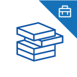 | AssetScan is a proprietary application linked to the Asset Point tool suite. AssetScan supports technology inventory gathering and verification for both data centers and desktop locations. | [App Store link (iOS)](https://apps.apple.com/app/assetscan-for-intune/id1582325082) | 
| :::no-loc text="Atom Edge"::: 
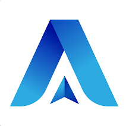 | Atom Edge provides corporate security through an integrated suite of services, designed to elevate the operational capabilities of businesses. The Atom Edge application offers a comprehensive approach to security management, blending automation, real-time analytics, and strategic planning to ensure a safe and efficient working environment. | [Google Play link (Android)](https://play.google.com/store/apps/details?id=com.arlanto.atomedge),  [App Store link (iOS)](https://apps.apple.com/app/atom-edge/id6472163711) | 
| :::no-loc text="AventX Mobile Work Orders"::: 
 | AventX Mobile Work Orders allows maintenance users of Oracle eAM to view work order packets on the go with an iPhone or iPad – even offline. As with paper, users can mark-up electronic work orders with the added benefit of attaching rich media, like pictures and audio files, as context to the completed work. Adding to the efficiency of mobile, AventX allows technicians to route, close and upload completed work orders from anywhere, increasing time in the field and decreasing time spent manually entering the same information after the work is done. | [App Store link (iOS)](https://apps.apple.com/app/mobile-work-orders/id1144125126) | 
| :::no-loc text="Beakon Mobile App"::: 
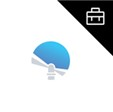 | The Beakon Mobile App helps you reduce workplace incidents and risk, while managing compliance. Beakon’s system enables employees and contractors to report audits, incidents, hazards, and near misses. You're then able to classify and manage incidents across your entire business and apply cost-efficient strategies to manage and minimize workplace risk. | [Google Play link (Android)](https://play.google.com/store/apps/details?id=io.beakon&pli=1), [App Store link (iOS)](https://apps.apple.com/app/beakon-mobile-app/id1365533931) | 
| :::no-loc text="Board Papers"::: 
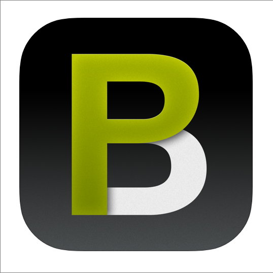 | Board Papers is a board portal solution that combines an iPad application with Microsoft SharePoint® integration. | [App Store link (iOS)](https://apps.apple.com/app/board-papers/id458518678) |
| :::no-loc text="Bob HR"::: 
 | Bob HR provides a seamless HR experience on the go.
 An employee can:<ul><li>Connect with coworkers through the social features – Post and react to Shoutouts, Kudos, and Polls</li><li>Get to know new joiners, birthdays, and work anniversaries</li><li>Clock in and out</li><li>Receive push notifications when it’s time to submit their timesheet, when their time off request is approved, and when they need to sign or read a document</li><li>Manage their timesheet</li><li>Request and manage their time off</li><li>See which of their teammates and coworkers are available or on leave</li><li>Review and sign documents</li><li>Search the employee directory and connect with their colleagues</li><li>Update personal information (self-service)</li><li>Access important company links</li></ul>
A manager can receive push notification and take action anytime, anywhere:<ul><li>Approve/decline time off requests</li><li>Approve/decline employee timesheets</li></ul> | [Google Play link (Android)](https://play.google.com/store/apps/details?id=com.hibob&hl=en&gl=US), [App Store link (iOS)](https://apps.apple.com/us/app/bob-hr/id1297148884) | 
| :::no-loc text="Box - Cloud Content Management"::: 
 | Box helps you get work done on the go. It's fast, secure and simple to use, so you can be productive from anywhere, which is the reason 97,000 businesses, including Eli Lilly and Company, General Electric, KKR & Co., P&G and The GAP securely access and manage their critical information with Box. The Box app integrates with Intune SDK and supports a number of Intune Mobile Application Management policies without using Mobile Device Management. | [App Store link (iOS)](https://apps.apple.com/app/box-cloud-content-management/id290853822) | 
| :::no-loc text="Board.Vision"::: 
 | Board.Vision is the next generation board portal designed with industry-leading features to accelerate the board’s decision-making process. Built in the Cloud and offered as a SaaS product, Board.Vision efficiently connects related parties to the corporate governance ecosystem to accelerate collaboration and decision-making.
Board.Vision is developed in collaboration with the Board.Vision team's in-house corporate secretarial subject matter experts (SMEs), contributing centuries of experience in corporate governance, corporate administration and secretarial services. The Board.Vision team's SMEs not only possess in-depth knowledge and understanding of the latest conventions and regulations governing businesses and entities, they have influenced the development of corporate governance standards in Singapore. Board.Vision is unique, enabling the best practices in corporate governance in the Singaporean context.
The Board.Vision team understands their customers' pain points and what boards need today to uphold their profound governance responsibilities. Board.Vision enables boards to work more efficiently and effectively by offering features and functionality that streamline board processes. | [Google Play link (Android)](https://play.google.com/store/apps/details?id=sg.com.trustedsource.boardVision), [App Store link (iPadOS)](https://apps.apple.com/us/app/board-vision-for-ipad/id1392826843), [App Store link (iOS)](https://apps.apple.com/app/board-vision-for-iphone/id1457788861) |
| :::no-loc text="Box for EMM"::: 
 | Keep your employees connected and collaborative while you centrally manage security, policy, and provisioning across any mobile device using Box for EMM. | [App Store link (iOS)](https://apps.apple.com/us/app/box-for-emm/id882085676?mt=8) |
| :::no-loc text="BuddyBoard"::: 
 | BuddyBoard is an app for business that provides comfortable multi-person handwritten communication. This app allows you to save time and paper resources by importing drawings and documents and reviewing them simultaneously with your team, customers, or vendors. The content written with this app can also be viewed and edited on a web browser.
**Note:** This software requires your company’s work account and a Microsoft managed environment. Please contact your company’s IT administrator if you have issues or questions about the use of the software. | [App Store link (iOS)](https://apps.apple.com/jp/app/buddyboard/id1544013449) |
| :::no-loc text="CAPTOR&trade; for Intune"::: 
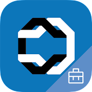 | CAPTOR is used by organizations to securely capture content on iOS/iPadOS and Android devices, especially in regulated industries such as healthcare, legal, government, law enforcement, insurance, real estate, manufacturing, and financial services. CAPTOR combines the productivity functions of document scanning, audio/video recording, photo/document annotating, and QR-Code reading. CAPTOR requires a [license key from Inkscreen](https://www.inkscreen.com/trial).

Key Features:
<ul><li>Scan multi-page documents using smart edge detection, as well as edit, annotate, and save as PDF capabilities.</li><li>Combine/merge PDF files and rearrange or delete pages.</li><li>Use e-Signature annotation for signing PDF documents.</li><li>Capture high resolution photos and videos.</li><li>Record ambient audio.</li><li>Read QR codes and a launch secure browser.</li><li>Annotate photos and documents with arrows, drawings, highlighters, and text labels.</li><li>Apply informative captions to media.</li><li>Enhanced search for photos and documents containing text, audio, and video using speech recognition.</li><li>Configure IT policies to enforce authentication, PDF version, Open In, default browser, file naming, and much more.</li><li>Support for BYOD/COPE (completely separate work content from personal) and enable personal privacy.</li></ul>  | [Google Play link (Android)](https://play.google.com/store/apps/details?id=com.inkscreen.captor.intune), [App Store link (iOS)](https://apps.apple.com/app/captor-for-intune/id1561413342) |
| :::no-loc text="CellTrust SL2&trade; for Microsoft Intune"::: 
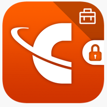 | CellTrust SL2&trade; for Microsoft Intune is an enterprise-level application that works by assigning a secure Mobile Business Number (MBN) on bring-your-own devices to keep personal and business communications separate on a single device. The seamless solution secures SMS messages and business calls on the device without using the personal number. This capability is vital for enterprises that require greater security for business communications, as well as archiving for eDiscovery and compliance needs.    Microsoft Intune is a cloud-based service in the enterprise mobility management (EMM) space that helps enable your workforce to be productive while keeping your corporate data protected.    CellTrust SL2&trade; for Microsoft Intune delivers a powerful enterprise mobility platform, allowing employees to work on the go—with easy access to secure business applications, and voice and text messaging. The app was developed with Microsoft Intune SDKs and customized features to allow organizations to tailor it based on their industry and IT needs. | [Google Play link (Android)](https://play.google.com/store/apps/details?id=com.celltrust.sl2_intune), [App Store link (iOS)](https://apps.apple.com/us/app/celltrust-sl2-for-intune/id1442087513?mt=8) |
| :::no-loc text="Cerby"::: 
 | Use Cerby's Two Factor Authentication (2FA) application to safely and securely log in to shared accounts. | [Google Play link (Android)](https://play.google.com/store/apps/details?id=com.cerby), [App Store link (iOS)](https://apps.apple.com/us/app/cerby/id1533747684) |
| :::no-loc text="CiiMS GO"::: 
 | CiiMS Go allows for mobile access to your CiiMS Lite, integrated Occurrence Book application used to record and manage occurrence related information in environments where manual occurrence books and registers are used. CiiMS Go allows you to do the following:<ul><li>Report incidents and collect specific information relating to the type of incident</li><li>Conduct inspections, assessments or audits using structured checklists</li><li>Attach photos, files or voice notes</li><li>Offline ability allows for recording of information while uploading of data occurs once connectivity is available</li><li>Receive rule-based and proximity alerts as push notifications (requires background location access) </li><li>Make and share comments on alerts</li><li>Initiate proximity based proactive or reactive roll-call (requires background location access) </li></ul> | [Google Play link (Android)](https://play.google.com/store/apps/details?id=za.co.onlineintelligence.mobile.ciims.ciimsgo), [App Store link (iOS)](https://apps.apple.com/us/app/ciims-go/id1174735218?platform=iphone) |
| :::no-loc text="Cinebody"::: 
 | Cinebody provides a simple and powerful way to create video with your favorite communities on your iPhone. | [App Store link (iOS)](https://apps.apple.com/us/app/cinebody/id1086788890) |
| :::no-loc text="Cisco Jabber for Intune"::: 
 | Cisco Jabber for Intune is for admins to organize and protect BYOD environments with mobile application management (MAM). This app allows admins to protect corporate data while keeping employees connected. | [Google Play link (Android)](https://play.google.com/store/apps/details?id=com.cisco.im.intune), [App Store link (iOS)](https://apps.apple.com/app/cisco-jabber-for-intune/id1487776871) |
| :::no-loc text="Webex for Intune"::: 
 | Webex for Intune brings together your teams, your customers, and your work in real-time and anytime. You can call, message, and meet.

Capabilities: <ul><li>Calling built into the app for deeper conversations</li><li>Messaging and file sharing integrated with your content and workflow</li><li>Upgraded meeting experiences with personalized layouts & virtual backgrounds</li><li>Smart presence lets you know when people are available</li><li>Control Webex Devices directly from the app</li></ul>
Built-in Intelligence: <ul><li>Notes, highlights and live translation in 10 languages</li><li>Unlock revolutionary people insights with Webex Graph</li><li>Reduce disruptions with noise removal & speech enhancements</li><li>Auto adjust meeting quality for the best experience</li></ul>
Equal experiences for everyone: <ul><li>Reactions to allow everyone to participate in their own way</li><li>Work on any device from anywhere: desktop, mobile, web or Cisco Devices</li></ul> | [Google Play link (Android)](https://play.google.com/store/apps/details?id=com.cisco.wx2.android.msintune), [App Store link (iOS)](https://apps.apple.com/app/cisco-webex-teams-for-intune/id1512240567) |
| :::no-loc text="Citrix Secure Mail"::: 
 | Citrix Secure Mail is a containerized email, calendar, and contacts app with a rich user experience. | [App Store link (iOS)](https://apps.apple.com/us/app/citrix-secure-mail/id1155203964?mt=8) |
| :::no-loc text="Comfy"::: 
 | Comfy is the workplace experience app that empowers you to get the most out of your office. | [Google Play link (Android)](https://play.google.com/store/apps/details?id=com.buildingrobotics.comfy), [App Store link (iOS)](https://apps.apple.com/app/comfy/id805595791) |
| :::no-loc text="Condeco"::: 
 | The Condeco app allows you to book work spaces. With a few taps you can book a workstation or a meeting room, along with other areas like parking, lockers, quiet spaces, breakout zones, and more. | [Google Play link (Android)](https://play.google.com/store/apps/details?id=com.condecosoftware.condeco) |
| :::no-loc text="Confidential File Viewer"::: 
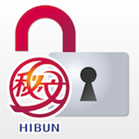 | The Confidential File Viewer (HIBUN) app is used to decrypt and reference password-protected encrypted files. Use the confidential file viewer to decrypted confidential files that have been created and encrypted using HIBUN Data Encryption. Confidential files encrypted with HIBUN AE Information Cypher can also be decrypted using the confidential file viewer. | [Google Play link (Android)](https://play.google.com/store/apps/details?id=jp.co.hitachi_solutions.Hibun.HibunDP&hl=ja), [App Store link (iOS)](https://apps.apple.com/jp/app/mi-wen-ji-mifairubyua/id1041326843) |
| :::no-loc text="DealCloud"::: 
 | The DealCloud integrated mobile app for Intune brings the power of DealCloud to the palm of your hand. The DealCloud iOS application provides Intune protection by integrating the Intune SDK. DealCloud provides 360-degree meeting overviews, a business card scanner, and access to all DealCloud web content. Additionally, DealCloud provides push notifications and a configuration user experience. | [App Store link (iOS)](https://apps.apple.com/us/app/dealcloud/id1168096912) |
| :::no-loc text="Diligent Boards"::: 
 | With Diligent Boards, organizations can conduct board, committee, and leadership meetings. Diligent Boards provides executives and senior leaders a secure way to access critical meeting and governance information. Diligent provides immediate access to sensitive meeting materials, along with the tools to review, discuss and collaborate on business topics. | [App Store link (iOS)](https://apps.apple.com/app/diligent-boards/id412771395) |
| :::no-loc text="Dooray! for Intune"::: 
 | Dooray! is the all-in-one collaboration solution including Task management, Messenger, Mail, Meeting, Calendar, Drive, Wiki, Workflow, Board, and more. Admins can manage policies to protect corporate data while keeping employees connected through the Microsoft Intune admin center for Dooray! for Intune.

Dooray! for Intune includes the following: <ul><li>Project: Task, file, and wiki management in one place</li><li>Messenger: Efficient communication for collaboration</li><li>Mail: Smart mail system integrated with tasks and schedules</li><li>Meeting: Anytime, anywhere, anyone!</li><li>Calendar: Effective task and schedule management</li><li>Drive: Easy and secure file storage solution</li><li>Wiki: Collaboration on ideas and knowledge with your team</li><li>Workflow: Streamlined decision-making system</li><li>Board: Information sharing and communication</li><li>Stream: Notifications for important updates</li></ul> | [Google Play link (Android)](https://play.google.com/store/apps/details?id=com.dooray.intune), [App Store link (iOS)](https://apps.apple.com/app/6448622191) |
| :::no-loc text="Egnyte for Intune"::: 
 | The Egnyte mobile app allows you to extend the office by working from anywhere with ease. You can securely access data, preview files, upload new content, collaborate on folders and file links, and edit and co-edit files in popular formats. You can also set up permissions for authorized access, create link expirations, and receive notifications when files are accessed.
Egnyte for Intune works with workspaces and devices managed by Microsoft Intune. Intune enables companies to control how the organization’s devices are used and also to configure specific policies. | [App Store link (iOS)](https://apps.apple.com/us/app/egnyte-for-intune/id1596098287) |
| :::no-loc text="Egress Secure Mail for Intune"::: 
 | Send and receive encrypted   emails and files from your mobile device. Egress Secure Email provides   user-friendly tools to secure sensitive data, with end-to-end encryption,   access revocation and message restrictions to empower users to stay in   control of the information they share.
The Egress Secure Email app   requires you to be a licensed user of the Egress platform, with a valid   subscription and appropriate infrastructure. | [Google Play link (Android)](https://play.google.com/store/apps/details?id=com.egress.switchdroid.intune) | 
| :::no-loc text="Enterprise Files for Intune"::: 
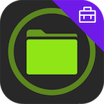 | Integrated with Intune Mobile Application Management, the Enterprise Files for Intune app provides safe document access to multiple back-end file stores. You can provide secure access to cloud and on-premises storage with enforceable MAM Protection Policies for your data. Users can have as much control over file actions as your business needs dictate, from viewing only to edit, copy, move and delete. Whether it’s PDF annotation, video, audio or image presentations, folder management, or document review and edit, Enterprise Files for Intune is an ideal tool for the task. | [App Store link (iOS)](https://apps.apple.com/app/id6443992292) | 
| :::no-loc text="ePRINTit SaaS"::: 
 | ePRINTit SaaS is a mobile printing platform connecting people who need to print with print locations. Offering print services for public and corporate printing, ePRINTit’s robust offerings are convenient and accessible for customers alike. For more information, visit [www.eprintit.com](https://www.eprintit.com). | [Google Play link (Android)](https://play.google.com/store/apps/details?id=com.eprintitsaas.mobile&pli=1), [App Store link (iOS)](https://apps.apple.com/us/app/eprintit-saas/id6443684419) | 
| :::no-loc text="EVALARM"::: 
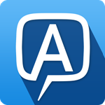 | EVALARM is a mobile crisis communication system that automatically informs the right group of people about a crisis and provides them with individual instructions and contact lists.
This application supports crisis communication processes as part of hazard prevention management in companies, authorities, universities, schools, kindergartens, hospitals and public institutions.
To configure the EVALARM platform, you define your individual crisis scenarios, determine which people or groups of people are alerted, and determine which instructions and contact lists are to be transmitted. | [App Store link (iOS)](https://apps.apple.com/app/evalarm/id966258645) | 
| :::no-loc text="F2 Manager Intune"::: 
 | F2 Manager offers a combined calender and list view to view meetings and their related items. F2 Manager supports inline annotation and submittal handling (approval process).

**Note:** To use the F2 Manager app with your business data, you must be a user of the F2 eGovernment platform, with mobile services enabled by your IT department. | [App Store link (iOS)](https://apps.apple.com/app/f2-manager-intune/id1587696871) |
| :::no-loc text="F2 Touch Intune"::: 
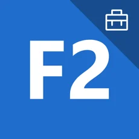 | With the F2 Touch app, you can access and edit corporate case and document information. The app accesses the cBrain F2 eGovernment platform and enables employees and corporate management to securely perform their daily tasks while away from the office.

Key features of the F2 Touch app: <ul><li>Manage your inbox</li><li>Read and approve submittals</li><li>Read and create matters and documents</li><li>Chat</li><li>Search the corporate document archive</li></ul>

**Note:** To use the F2 Touch Intune app with your business data, you must be a user of the F2 eGovernment platform, with mobile services and Intune enabled by your IT department. | [Google Play link (Android)](https://play.google.com/store/apps/details?id=com.cbrain.f2touchapp.intune), [App Store link (iOS)](https://apps.apple.com/dk/app/f2-touch-intune/id1571703604) |
| :::no-loc text="FactSet 3.0"::: 
 | FactSet delivers superior analytics, service, content, and technology to help investment professionals see and seize opportunity sooner. Our Factset 3.0 app is a phone optimized experience that allows our subscribing users to leverage the power and intelligence of the FactSet workstation anytime, anywhere. | [Google Play link (Android)](https://play.google.com/store/apps/details?id=com.factset.wireless), [App Store link (iOS)](https://apps.apple.com/app/factset-3-0/id1464041112) | 
| :::no-loc text="Fellow.app"::: 
 | Fellow is a meeting management app that helps you and your team build great meeting habits by collaborating on agendas, sharing meeting notes, and documenting action items - all from right inside Microsoft Teams. | [App Store link (iOS)](https://apps.apple.com/us/app/fellow-app/id1477264742) | 
| :::no-loc text="Firstup - Intune"::: 
 | Firstup for Intune is a workforce communications app that helps companies reach employees with relevant, personalized information that they need to do their best work. Firstup for Intune allows Intune admins to create policies that secure the application in a bring-your-own-device (BYOD) environment.
Firstup solves the problem of poor employee engagement by keeping all workers informed and connected. Employees have one place to find out what’s happening at work. Companies have an easier, faster way to publish content and news and can measure how many employees engaged with their content.
Firstup for Intune includes the following features:<ul><li>An official source for all workforce communications, allowing you to reach every worker with the information they need to know to do their best work.</li><li>Push notifications and reminders for breaking news or time-sensitive tasks</li><li>Ability to upload and share videos, photos, documents, or articles</li><li>Personalized user experience with profiles and the ability to choose channels to follow</li><li>A simple way to save and find important information with bookmarking and powerful search</li><li>The ability for users to comment and share</li><li>A powerful way to connect everyone at your company and create a better digital employee experience</li></ul> **IMPORTANT:** This software requires your company’s work account and a Microsoft managed environment. Some functionality may not be available in all countries/regions. Please contact your company’s IT administrator if you have issues or questions about the use of the software. | [App Store link (iOS)](https://apps.apple.com/us/app/firstup-intune/id6446034583) |
| :::no-loc text="FleetSafer"::: 
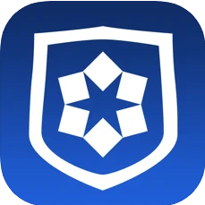 | FleetSafer is a risk measurement and mitigation tool that enforces communications policies and monitors safe driving practices. FleetSafer requires a Cogosense enterprise account. FleetSafer uses GPS or a connected cogoB smart device to automatically engage when driving movement is detected, disabling access to the device and silencing all calls and notifications. Calling, text, social, and email functionality is disabled. Driving behavior is monitored. | [Google Play link (Android)](https://play.google.com/store/apps/details?id=com.aegismobility.guardian), [App Store link (iOS)](https://apps.apple.com/app/id957483278) |
| :::no-loc text="Freshservice for Intune"::: 
 | Freshservice for Intune is designed for Freshservice customers with Microsoft Intune enabled. This app offers the freedom to request and manage services seamlessly on the go, including incident management, asset management, user management, service catalog, and task management. The app is designed with productivity at its core, delivering everything users need while ensuring efficiency, collaboration, and customer satisfaction.  | [Google Play link (Android)](https://play.google.com/store/apps/details?id=com.freshservice.helpdesk.intune), [App Store link (iOS)](https://apps.apple.com/in/app/freshservice-for-intune/id6475669802) |
| :::no-loc text="Fuze Mobile for Intune"::: 
 | Fuze Mobile for Intune allows end users to communicate using voice calling, video meetings, contact center, chat messaging, and content sharing. Admins can deploy Fuze Mobile securely and at scale in a BYOD context. Fuze Mobile for Intune requires both a Fuze account and a Microsoft managed environment. | [Google Play link (Android)](https://play.google.com/store/apps/details?id=com.fuze.fuzeapp), [App Store link (iOS)](https://apps.apple.com/app/fuze-mobile/id1160444971) |
| :::no-loc text="Global Relay"::: 
 | Put compliance at the heart of your communication with one powerful app. Global Relay is an enterprise unified communication platform purpose-built for financial and other regulated industries to meet collaboration, compliance, privacy, and security requirements.
Global Relay supports BYOD and corporate programs, ensuring compliant communication with customers, colleagues, and industry peers via text, voice, WhatsApp, and other preferred channels.
The Global Relay App is available for mobile, desktop, and web. And, Global Relay is fully integrated with Microsoft Intune SDK to provide MDM/MAM policy control for IT Administrators.
<b>NOTE: You must be a Global Relay customer or partner to use this app.</b> | [Google Play link (Android)](https://play.google.com/store/apps/details?id=com.globalrelay.message.intune), [App Store link (iOS)](https://apps.apple.com/app/global-relay/id576031737) |
| :::no-loc text="Goodnotes 6"::: 
 | Goodnotes 6 is a powerful note-taking app designed to provide a seamless and natural handwriting experience on digital paper. This comprehensive solution combines the simplicity of handwriting, the power of digital tools, and advanced AI features to enhance productivity and organization. Whether you're in a meeting, on a call, or brainstorming, Goodnotes keeps your ideas organized and accessible. | [App Store link (iOS)](https://apps.apple.com/us/app/goodnotes-6/id1444383602) |
| :::no-loc text="Groupdolists"::: 
 | Groupdolists helps to coordinates incident response teams, whether corporate or public sector, in a single organization or across multiple organizations. Groupdolists creates a common operating picture between all responders, wherever they are, and synchronizes their efforts in real time.

Benefits include the following:<ul><li>Groupdolists brings emergency (and everyday) operating procedures to interactive life.</li><li>Groupdolists pushes task lists to response teams, regardless of their location or device, instantly synchronizing what needs to be done and by whom, as well as confirming completed tasks in chronological order.</li><li>Groupdolists increases transparency, provides greater accountability, and offers a "leadership view" for those who need to see but not touch.</li><li>Groupdolists instantly synchronizes not just tasks, but photos, videos, links, comments, and documents to all team members. Everything you use is available for reference and action.</li><li>Groupdolists provides complete after-action documentation in both PDF and Excel formats.</li></ul> | [Google Play link (Android)](https://play.google.com/store/apps/details?id=com.groupdolists.android&hl=en_CA&gl=US) |
| :::no-loc text="HCSS Field: Time, cost, safety"::: 
 | HCSS Field is a mobile app for heavy civil construction. It is designed to replace paper-based processes with digital solutions. It integrates with the HCSS software suite to streamline field operations, project management, safety, and team communication. | [App Store link (iOS)](https://apps.apple.com/app/hcss-field-time-cost-safety/id720784422) | 
| :::no-loc text="HCSS Plans: Revision control"::: 
 | HCSS Plans is a collaborative app for heavy civil construction. It allows teams to work with the latest project plans and documents, enabling seamless teamwork, smart revision control, and instant document access. | [App Store link (iOS)](https://apps.apple.com/app/hcss-plans-revision-control/id1319971186) | 
| :::no-loc text="Hearsay for Intune"::: 
 | Hearsay for Intune enables advisors to manage and nurture their book of business in a protected BYOD environment with mobile application management (MAM). This version of Hearsay allows IT administrators to protect corporate data while keeping advisors in touch with their book of business.   Hearsay, a mobile application that enables financial services professionals to move business forward. Leverage compliant texting and seamless voice calling to connect with your entire book of business. Stay productive with calendar integration to set appointments, and schedule reminder messages for upcoming meetings, birthday greetings, and more. Hearsay for Intune gives enterprise users all the features they expect from Hearsay, while providing IT administrators the MAM functionality they need to keep corporate data safe. In the event of a lost or stolen device, IT can remove Hearsay for Intune from the device along with any sensitive data associated with it. | [Google Play link (Android)](https://play.google.com/store/apps/details?id=com.hearsaysocial.messages.intune), [App Store link (iOS)](https://apps.apple.com/app/hearsay-for-intune/id1501771956) | 
| :::no-loc text="Hey DAN for Intune"::: 
 | Hey DAN (formerly Dial-A-Note) is a Voice-to-CRM solution. Increase your productivity and mobility by dictating your CRM notes directly into the app, and the technology enters the information directly into the respective fields within your CRM. Hey DAN has effectively combined the latest technology and artificial intelligence to bring you an accurate CRM note entry solution.
Reduce your time spent on administrative tasks with Hey DAN: <ul><li>Snap pictures of business cards and Hey DAN will create new contacts or update existing ones.</li><li>Speak your meeting notes and Hey DAN will analyze, enter them, assign a follow-up task and/or update profiles.</li><li>Dictate expenses and Hey DAN will enter them into the system/tracker of your choice.</li></ul> | [Google Play link (Android)](https://play.google.com/store/apps/details?id=com.civi.heydanforintune), [App Store link (iOS)](https://apps.apple.com/app/hey-dan-for-intune/id6448539741) | 
| :::no-loc text="HowNow"::: 
 | Use HowNow to get all the knowledge you need, everywhere you work. You can bring together the knowledge, business intelligence, and insights you need from a variety of internal and external sources. HowNow is tailored to you by personalizing learning for you based on your role, business goals, skill requirements, performance, and work you’re doing. You can teach, learn, and share knowledge with your team in any format you like at any time, from anywhere. | [Google Play link (Android)](https://play.google.com/store/apps/details?id=com.hownow.gethownow), [App Store link (iOS)](https://apps.apple.com/app/hownow/id1464131703) | 
| :::no-loc text="HP Advance for Intune"::: 
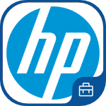 | HP Advance is not a stand-alone application; it does require the use of Mobile Connector.
HP Advance utilizes the powerful capabilities of HP output management software by providing an easy to use interface that allows users to do the following actions:<ul><li>Print a document or web page within seconds</li><li>Select only authorized printers</li><li>Search for authorized printers by printer name, long name or printer location</li><li>Print multiple copies</li><li>Release print jobs</li></ul>
All these features are available with a few simple touches and without requiring the use of a configured mail client on the mobile device. | [Google Play link (Android)](https://play.google.com/store/apps/details?id=com.hp.mobileconnector.intune), [App Store link (iOS)](https://apps.apple.com/us/app/hp-advance-for-intune/id1643745017) | 
| :::no-loc text="iAnnotate for Intune/O365"::: 
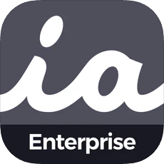| Designed for Microsoft Intune enterprise users, iAnnotate for Intune/O365 allows you to read, annotate, and share PDFs, Microsoft 365 (Office) files, images and web pages. Seamlessly integrate with OneDrive and Outlook, while easily converting all MS documents to PDFs for quick markup. IT administrators must visit https://enterprise.iannotate.com/ to activate a 30-day free trial and to view the iAnnotate for Intune deployment guide. | [App Store link (iOS)](https://apps.apple.com/app/iannotate-for-intune-o365/id1567388828) |
| :::no-loc text="iBabs for Intune"::: 
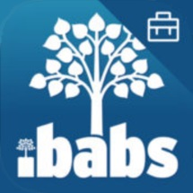| iBabs enables users to reduce the time needed to prepare for meetings and facilitates cooperation between colleagues.
This version of iBabs is intended for Enterprise users and government agencies, and it also requires a Microsoft Intune environment. | [App Store link (iOS)](https://apps.apple.com/us/app/ibabs-for-intune/id1130847428?mt=8) |
| :::no-loc text="Idenprotect Go"::: 
| Idenprotect Go is an Identity Driven internet browser designed specifically for enterprise mobile users to access both Intranet and Internet web pages. Idenprotect Go’s unique use of PKI technology allows biometric-based password-less authentication to Mutual TLS and Kerberos secured websites and services. Integration with Microsoft’s Intune SDK provides full app protection policy control via the Microsoft Intune platform providing MAM control of the application giving the ultimate balance of usability and security. | [Google Play link (Android)](https://play.google.com/store/apps/details?id=uk.co.applymobile.idenprotectgo), [App Store link (iOS)](https://apps.apple.com/app/idenprotect-go/id1544060692) |
| :::no-loc text="Island Browser for Intune"::: 
 | Island is the browser designed for the enterprise that makes work fluid, while keeping it fundamentally secure. With core security controls naturally embedded in the browser itself, Island enables organizations to control, see, and govern how users, apps, and underlying data interact. This is done all while delivering the same smooth Chromium-based experience users expect. This app version has been designed to work with Microsoft Intune MAM. | [Google Play link (Android)](https://play.google.com/store/apps/details?id=io.island.island.intune), [App Store link (iOS)](https://apps.apple.com/il/app/island-enterprise-browser/id1661957370) |
| :::no-loc text="iManage Work 10 For Intune"::: 
| Confidently and securely access content from iManage Work with Work Mobility for Intune. Empower users to find, edit, collaborate, and share documents and emails from their iOS device. iManage Mobility enables users to be productive from anywhere, with a consistent user experience and the same security protections as iManage Work 10. | [App Store link (iOS)](https://apps.apple.com/app/imanage-work-10-for-intune/id1337285529?ls=1) |
| :::no-loc text="Incorta (BestBuy)"::: 
| With on-the-go business intelligence using your iOS device and Incorta Mobile App, dive deep into your operational analytics and favorite dashboards anytime, anywhere.
Fuel your curiosity, explore insights, and stay current with near real-time trends that impact business success.
The Incorta Mobile App includes the following features:<ul><li>Interactive dashboards and insights</li><li>Dynamic filtering and drill-down navigation</li><li>Bookmarks and favorites</li><li>Export and share dashboards</li></ul> | [App Store link (iOS)](https://apps.apple.com/us/app/incorta-bestbuy/id6446140689) |
| :::no-loc text="Intapp 2.0"::: 
| The Intapp 2.0 application provides secure mobile access to Intapp CRM (DealCloud) and Risk and Compliance (Intake and Conflicts). Intapp 2.0 iOS app provides Intune protection by integrating the Intune SDK. The CRM product helps users stay on top of their day-to-day tasks while out of office, providing access to information beyond just what's available at your desk, with dashboards, views, and template reports optimized for on-the-go consumption. The Intapp Risk and Compliance solution makes it easy to manage client requests and related workflows, review and resolve conflicts reports, initiate conflicts quick search, and access client and matter data. This app requires access to an existing cloud environment of Intapp CRM or Risk & Compliance. | [App Store link (iOS)](https://apps.apple.com/us/app/intapp-2-0/id1666527728?uo=2) |
| :::no-loc text="IntraActive"::: 
| Want to reach employees on the go with corporate information from your intranet? Then, IntraActive is the app for you. Set up the design of the app with your logo and corporate colors and specify what content you want to display and how. This customization will give your users the right corporate feeling and ensure they can stay informed about what is going on in your organization; anytime, anywhere. | [Google Play link (Android)](https://play.google.com/store/apps/details?id=intraactiveapp.proactive.dk.intraactiveapp), [App Store link (iOS)](https://apps.apple.com/us/app/intraactive/id1384949661) |
| :::no-loc text="ISEC7 MAIL for Intune"::: 
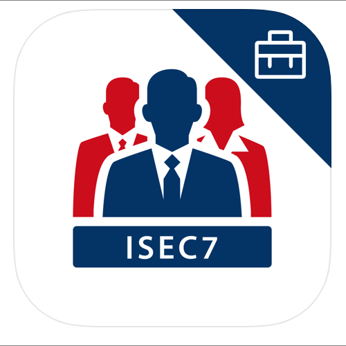| ISEC7 Mobile Exchange Delegate provides mobile access to authorized Microsoft® Exchange Mailboxes and Public Folders. | [Google Play link (Android)](https://play.google.com/store/apps/details?id=com.isec7.android.med.intune), [App Store link (iOS)](https://apps.apple.com/de/app/isec7-med-for-intune/id1491037389) |
| :::no-loc text="ixArma"::: 
| IxArma app 6 is the mobile part of alarm server management for ixArma 6, enabling comprehensive business continuity management for any alarm scenario. Users of the ixArma 6 app can rapidly respond to incidents and emergencies in real time and on the go. The ixArma 6 app is browser independent and simple to operate.
The IxArma provides the following functionality:<ul><li>Alarms of different priorities according to predefined alarm scenarios and plans</li><li>Alarms of various priorities with visual and acoustic signaling</li><li>Interactive alarms with updates in real time</li><li>Acknowledge or reject alarm, also with PIN</li><li>Alarm progress and control monitoring in real time</li><li>Fully server-based app management</li><li>Mass SMS notification</li><li>Multilingual (DE, FR, IT, EN)</li><li>MDM version available on request</li></ul>
**NOTE:** ixArma 6 app does not work with older version of ixArma 5. Do not upgrade your app unless your ixArma is version 6. | [Google Play link (Android)](https://play.google.com/store/apps/details?id=com.inax.ixarmav6&pli=1), [App Store link (iOS)](https://apps.apple.com/gb/app/ixarma-6/id1582838799) |
| :::no-loc text="KeePassium for Intune"::: 
| KeePassium for Intune is a password manager for enterprise, government, and academic organizations managed by Microsoft Intune. The app enables company's administrators to safeguard corporate information by enforcing app configuration and data protection policies.
The end-user version of KeePassium is available at http://keepassium.app.
**IMPORTANT:** This app requires your company’s work account and a managed environment. Some functionality may not be available in all countries. Please contact your company’s IT administrator if you have issues or questions about this app. | [App Store link (iOS)](https://apps.apple.com/app/id6446429955) |
| :::no-loc text="Klaxoon for Intune"::: 
| Klaxoon for Intune is for Klaxoon customers that have enabled Microsoft Intune Mobile Application Management (MAM). Every day, workshops replace traditional meetings and are becoming a more efficient way to drive performance. Klaxoon is a hybrid and complete workspace that enables every type of workshop to be more engaging, mindful, and efficient: ideation workshops, design thinking, project management, customer meetings, team rituals, training sessions, business reviews, and more.  | [App Store link (iOS)](https://apps.apple.com/app/klaxoon-for-intune/id1658568739) |
| :::no-loc text="Kofax Power PDF Mobile"::: 
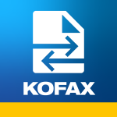| Kofax Power PDF Mobile is an easy-to-use PDF viewer and editor, providing instant access to your PDF files anytime, anywhere. Kofax Power PDF Mobile ensures a high-quality mobile PDF reading experience with a rich set of functions.
PDF viewing includes the following capabilities:<ul><li>View PDF packages, comments, attachments, and encrypted documents.</li><li>Choose from single-page view or continuous view.</li><li>Switch between day and night modes to protect your eyes.</li><li>Reach the corresponding page by page number.</li><li>Add and edit bookmarks quickly.</li><li>Search the document.</li><li>Reflow the text for easier reading or keep the original layout.</li></ul>  | [App Store link (iOS)](https://apps.apple.com/us/app/kofax-power-pdf-mobile/id1599500192) |
| :::no-loc text="Leap Work for Intune"::: 
| Leap Work is a B2C communication app. Employees can call or send text, voice, and file messages to client's messengers of their choice: WhatsApp&trade;, WeChat&trade;, Telegram&trade;, Line&trade;, SMS and others. Leap Work is a part of LeapXpert's Federated Messaging Orchestration Platform (FMOP). FMOP concept allows the promotion of messaging to a formal business communication channel, similar to calling or emailing.  Use Leap Work to: <ul><li>Reach clients on their messengers</li><li>Own and control all company's communication data</li><li>Gather employees and clients communication on one platform</li><li>Allow group chats between employees and clients</li><li>Keep company communication history always available for monitoring and compliance purposes</li></ul> | [Google Play link (Android)](https://play.google.com/store/apps/details?id=com.leapxpert.leap.work.intune), [App Store link (iOS)](https://apps.apple.com/sg/app/leap-work-for-intune/id1536700401) |
| :::no-loc text="LiquidText"::: 
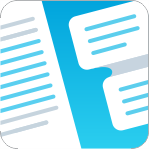| LiquidText offers a fast, natural way to review, gather, and organize information across all your documents and webpages—then apply the results to writing reports, meeting prep, or simply studying. Pull out key facts and connect them together, squeeze a document to compare sections, draw a line to connect ideas in different documents, comment on multiple pages at once, build upon your thoughts, and much more.
**NOTE**: To use LiquidText with Intune, you need a LiquidText Enterprise account. Visit [LiquidText](https://liquidtext.net/enterprise) to learn more. | [App Store link (iOS)](https://apps.apple.com/us/app/liquidtext/id922765270) |
| :::no-loc text="LumApps for Intune"::: 
| LumApps for Intune allows Intune admins to organize and protect Bring Your Own Device (BYOD) environments. From Microsoft Intune admin center, admins can create policies to protect corporate data while keeping employees connected. The LumApps platform provides corporate news, business tools, essential documents, and social communities.

LumApps for Intune includes several features: <ul><li>Browse listed content, including company news and targeted information streams</li><li>View detailed content and comments with attached files</li><li>React to content in real-time</li><li>Like and respond to posts and comments</li><li>View all communities at a glance and follow your favorites</li><li>Check your preferred communities’ activity</li><li>Create your own community post with attached files, links, and tags</li><li>Quick access to LumApps Help page</li></ul>

To use LumApps for Intune, your company’s active subscription plan to LumApps must include the mobile option, with valid login credentials. Additionally, LumApps for Intune requires a Microsoft managed environment. Please contact your company’s IT administrator if you have issues or questions about using LumApps for Intune.  | [Google Play link (Android)](https://play.google.com/store/apps/details?id=com.lumapps.android.intune), [App Store link (iOS)](https://apps.apple.com/gb/app/lumapps-for-intune/id1542216268) |
| :::no-loc text="M-Files for Intune"::: 
| M-Files® is content management (ECM) and document management solution that helps to manages, find, track, and secure information for companies of all sizes.
The M-Files mobile application lets you access your M-Files documents anytime and anywhere – even when you’re on the go or not connected to your office network. The application enables you to find documents from your M-Files Vaults via search functions and various customizable views, as well as view and approve documents and workflows.
To be able to utilize the mobile application, you need to have an M-Files system set up and to possess the required access rights. To get started, you need an M-Files server address and login credentials. | [Google Play link (Android)](https://play.google.com/store/apps/details?id=com.mfiles.mfms), [App Store link (iOS)](https://apps.apple.com/app/m-files-for-intune/id1551120145) |
| :::no-loc text="MangoApps - Work from Anywhere"::: 
| MangoApps - Work from Anywhere makes teamwork, file sharing, and collaboration easy. It is a comprehensive business collaboration tool for Mobile and offers advanced team and company communication, project management, and information sharing features that help companies and their employees stay organized while working together and sharing information. Collaboration features such as chat, company intranet, and wikis, among other convenient task management tools, can all be used from your phone while you're on the go or from your desktop computer while you're in the office. It's a cross-platform social collaboration app, so no matter where you are and which device you're using, you can use MangoApps - Work from Anywhere to access work-related information and stay in touch with colleagues and clients. | [Google Play link (Android)](https://play.google.com/store/apps/details?id=com.ms.engage&hl=en_IN&gl=US), [App Store link (iOS)](https://apps.apple.com/us/app/mangoapps-work-from-anywhere/id347307528?platform=iphone) |
| :::no-loc text="Meetings by Decisions"::: 
| Meetings by Decisions is a solution for Microsoft Teams and Microsoft 365 (Office). With Decisions, users improve collaboration, engagement, and productivity by using agenda builder, Teams in-meeting extensions, secure voting, minutes templates, task management, and more. | [Google Play link (Android)](https://play.google.com/store/apps/details?id=com.meetingdecisions.androidApp), [App Store link (iOS)](https://apps.apple.com/app/meetings-by-decisions/id1532239791) |
| :::no-loc text="Meetio Enterprise"::: 
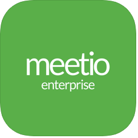| Meetio's mobile app for organizations using Meetio room management solutions. Meetio Enterprise simplifies your workday by allowing you to schedule meetings and meeting rooms - all at once, while you're on the go. | [Google Play link (Android)](https://play.google.com/store/apps/details?id=com.getmeetio.personal), [App Store link (iOS)](https://apps.apple.com/app/meetio/id1340190306) |
| :::no-loc text="Mobile Helix Link for Intune"::: 
| The Mobile Helix Link for Intune app uniquely integrates document management and Outlook email in a single, encrypted app. Quickly find files. Annotate, edit, compare, and email files seamlessly. Use Intune and the Microsoft Authentication Library to manage and secure the LINK app using Microsoft Intune and Entra ID. | [App Store link (iOS)](https://apps.apple.com/app/mobile-helix-link-for-intune/id6473648085) |
| :::no-loc text="MultiLine for Intune"::: 
 | MultiLine for Intune is a secure, carrier-agnostic business application that enables employees to compliantly communicate with external clients through a separate business number on their own personal devices (BYOD) within the Microsoft Intune environment. This version of MultiLine allows IT and mobility managers to secure their client communication data while ensuring employees are not using their personal number or other consumer messengers for business communications. MultiLine for Intune works over any iOS/Android device and can be deployed over any global carrier. MultiLine’s technology allows employees to make and receive calls on their business number over WiFi, mobile data and/or GSM (not VoIP-only) ensuring employees are always accessible and connected with their clients no matter where they work. The solution unifies voice, SMS, and other consumer messaging channels through a single inbox within the MultiLine mobile and desktop application, allowing employees to reach their clients on their preferred channels. All voice and messaging conversations can be automatically captured and ingested into any CRM or archival/surveillance platform, ensuring firms are meeting their regulatory requirements. | [Google Play link (Android)](https://play.google.com/store/apps/details?id=com.moviuscorp.multilineforintune), [App Store link (iOS)](https://apps.apple.com/app/multiline-for-intune/id1484594063) |
| :::no-loc text="MURAL - Visual Collaboration"::: 
 | MURAL is a collaborative intelligence company powering ideation, innovation, alignment, and team building. Use the MURAL - Visual Collaboration app to work together in either real-time or asynchronously using digital whiteboard and collaboration features that are designed to inspire better collaboration and lead to business-driving outcomes. | [Google Play link (Android)](https://play.google.com/store/apps/details?id=com.mural), [App Store link (iOS)](https://apps.apple.com/us/app/mural-visual-collaboration/id1156631145) |
| :::no-loc text="myBLDNG"::: :::image type="content" alt-text="Partner app - myBLDNG by Bldng.ai icon" source="./media/apps-supported-intune-apps/icon-p-mybldng.png" border="false" ::: | myBLDNG makes it easy to navigate your virtual office space, book a workplace, and share your workday with your colleagues. It makes co-working easier. | [Google Play link (Android)](https://play.google.com/store/apps/details?id=no.bldngai.mybldng), [App Store link (iOS)](https://apps.apple.com/no/app/mybldng/id1581378929) |
| :::no-loc text="My Portal By MangoApps"::: 
 | My Portal is an all-in-one app for a mobile-first workplace. It brings communication, collaboration, engagement, and training tools into one comprehensive portal for your company.
This unified portal makes it easy to create a central location for fast access to all the tools that members need to connect, communicate, collaborate, and manage. | [Google Play link (Android)](https://play.google.com/store/apps/details?id=com.ms.portal&hl=en_IN&gl=US), [App Store link (iOS)](https://apps.apple.com/in/app/my-portal-by-mangoapps/id1542778888) |
| :::no-loc text="MyITOps for Intune"::: 
 | With the MyITOps for Intune app you can do the following:
<ul><li>Visualize business service health, at a glance via Sunburst, Cards and ServiceTree widgets</li><li>Create your own, branded custom mobile friendly dashboards</li><li>Subscribe to push notifications for instant visibility of IT alerts and incidents</li><li>See the status, severity, and business impact of alerts, clustered into correlation scenarios and drill down to root cause</li><li>Take actions to assign, accept and close alerts and incidents</li><li>Work collaboratively in Service Outage Rooms to resolve issues by leveraging ChatOps with seamless integration for Microsoft Teams and Slack</li><li>Keep communications in sync with your ITSM tooling throughout the incident/alert lifecycle</li><li>Securely deploy and configure the MyITOps for Intune app through Microsoft's Intune Mobile Device Management platform</li></ul>
<b>NOTE:</b> The MyITOps for Intune app requires active credentials for the Interlink Software AIOps Platform. | [Google Play link (Android)](https://play.google.com/store/apps/details?id=com.myitops.asiapp.msint), [App Store link (iOS)](https://apps.apple.com/app/myitops-for-intune/id1615987058) |
| :::no-loc text="MyQ Roger: OCR scanner PDF"::: 
 | Scan all your documents with a few clicks using a smartphone, save them in your device or to your favorite cloud services (OneDrive, iCloud, Google Drive, Dropbox, or Box), and carry them wherever you go. MyQ Roger is your digital workplace assistant, allowing you to have the office in your pocket. This free app simplifies your life: at work, during studies, and on daily personal activities. Download MyQ Roger now and scan your own way. | [Google Play link (Android)](https://play.google.com/store/apps/details?id=cloud.myq.roger&hl=en&gl=US), [App Store link (iOS)](https://apps.apple.com/us/app/myq-roger-ocr-scanner-pdf/id1543934608) |
| :::no-loc text="Nexis Newsdesk&trade; Mobile"::: 
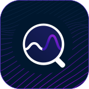 | Newsdesk delivers relevant news from all media types – online, print, social, and broadcast – in a single destination. With the Newsdesk mobile app you will: <ul><li>Be in the know while on the go</li><li>Enjoy a seamless experience between mobile and web</li><li>Access headlines and extracts of articles right in the app</li><li>Easily share articles</li><li>Tag favorite feeds or save articles to read later</li><li>See which favorite searches have new coverage</li></ul> | [Google Play link (Android)](https://play.google.com/store/apps/details?id=com.lexisnexis.newsdesk), [App Store link (iOS)](https://apps.apple.com/us/app/nexis-newsdesk-mobile/id1567099763) |  
| :::no-loc text="Nine Work for Intune"::: 
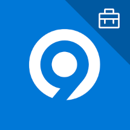 | Nine is a full-fledged email application for Android based on Direct Push technology to synchronize with Microsoft Exchange Server using Microsoft Exchange ActiveSync, and also designed for entrepreneurs or ordinary people who want to have efficient communication with their colleagues, friends, and family members at any time, anywhere. | [Google Play link (Android)](https://play.google.com/store/apps/details?id=com.ninefolders.hd3.work.intune) |  
| :::no-loc text="Notate for Intune"::: 
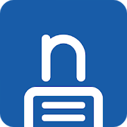 | Notate is the ultimate Exchange Information Manager. Go paperless and improve collaboration. Let Notate advance your digital transformation. | [Google Play link (Android)](https://play.google.com/store/apps/details?id=com.shafersystems.notate.intune&hl=en_US), [App Store link (iOS)](https://apps.apple.com/app/notate-for-microsoft-intune/id1511979523) | 
| :::no-loc text="Now Mobile - Intune"::: 
 | Now employees can find answers and get work done across IT, HR, Facilities, Finance, Legal and other departments, all from a modern mobile app powered by the Now Platform&#174;.
The Now Platform&#174; delivers employee experiences and productivity through digital workflows across departments, systems and people.
Examples of things you can do in the app:<ul><li>IT: Request a laptop or a reset password</li><li>Facilities: Find and book a conference room</li><li>Finance: Request a corporate credit card</li><li>Legal: Have a new vendor sign a non-disclosure agreement (NDA)</li><li>HR: Find the next company holiday and check the vacation policy</li></ul>
Now&#174; Mobile powered by the Now Platform&#174; - finally work life can be as great as real life | [Google Play link (Android)](https://play.google.com/store/apps/details?id=com.servicenow.requestor.mam.intune), [App Store link (iOS)](https://apps.apple.com/app/now-mobile-intune/id1494183300) | 
| :::no-loc text="OfficeMail Go"::: 
 |OfficeMail Go is an email client app that uses ActiveSync and is integrated with Microsoft Intune. It is not only a secure and safe email client, but also an app that helps reinforce various convenience aspects. The app implements several features, including a shared mailbox and calendars for collaborating with your colleagues. Additionally, OfficeMail Go provides secure email for business use and powerful functions that support Microsoft Exchange Server and Microsoft 365. It also provides internal apps such as email, calendar, contacts, tasks, and notes in Microsoft Exchange.
OfficeMail Go is compatible with MDM solutions such as Microsoft Intune, AirWatch, Citrix, and MobileIron based on Android Enterprise. Additionally, the Intune SDK is integrated into the app, and it supports Intune app protection policies. | [Google Play link (Android)](https://play.google.com/store/apps/details?id=app.officemail.go) | 
| :::no-loc text="Omnipresence Go"::: 
 | Omnipresence is a Customer Experience Management platform for Life Sciences companies. You can use Omnipresence CXM to engage with customers and patients of Life Sciences companies. 
Omnipresence is built by life sciences experts who understand pharma, biotech, and med-device business needs and compliance requirements. As a unified platform, functional teams can work together using a shared view of their customers and plans across devices, online and offline, in harmony with their Microsoft applications. By using Omnipresence, you can focus on enabling great customer experiences based on advanced analytics and AI that deliver insights to enrich every stage of the customer journey.| [Google Play link (Android)](https://play.google.com/store/apps/details?id=com.omnipresence.live), [App Store link (iOS)](https://apps.apple.com/in/app/omnipresence-technologies/id1504126395#?platform=iphone) | 
| :::no-loc text="PenPoint"::: 
 | PenPoint works with PenLink’s on-premises software, PLX, to conduct lawful communications surveillance operations in the support of law enforcement investigations. PenPoint for Intune provides secure mobile access to communications surveillance data collected and stored by a PLX system. | [Google Play link (Android)](https://play.google.com/store/apps/details?id=com.penlink.PenPoint), [App Store link (iOS)](https://itunes.apple.com/app/penpoint/id1451352658?mt=8) | 
| :::no-loc text="PrinterOn for Microsoft"::: 
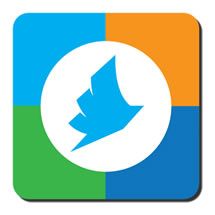 | PrinterOn's wireless mobile printing solutions enable users to remotely print from anywhere at any time over a secure network.| [Google Play link (Android)](https://play.google.com/store/apps/details?id=com.printeron.droid.phone), [App Store link (iOS)](https://apps.apple.com/us/app/printeron/id406584999) | 
| :::no-loc text="Qlik Sense Mobile"::: 
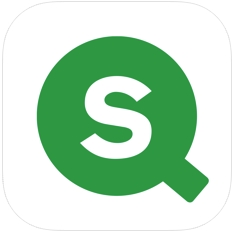 | Qlik Sense is a market leading, next generation application for self-service oriented analytics. Qlik's patented associative technology allows people to easily combine data from many different sources and explore it freely, without the limitations of query-based tools. | [Google Play link (Android)](https://play.google.com/store/apps/details?id=com.qlik.qliksense.mobile), [App Store link (iOS)](https://apps.apple.com/app/qlik-sense-mobile/id1217049362) | 
| :::no-loc text="Re:Work Enterprise"::: 
 | Re:Work Enterprise, an email client app using ActiveSync, is a secure, safe, and convenient email client. Features include a shared mailbox and calendars for collaboration with colleagues. Re:Work Enterprise supports Microsoft Exchange Server and Microsoft 365 (Office), as well Microsoft Exchange email, calendar, contacts, tasks, and notes. | [Google Play link (Android)](https://play.google.com/store/apps/details?id=so.rework.app.enterprise), [App Store link (iOS)](https://apps.apple.com/us/app/re-work-enterprise/id1528303033) | 
| :::no-loc text="Recruitment.Exchange"::: 
 | Recruitment.Exchange (REX) is a Mobile AI Copilot for exponential recruitment. It is designed to:<ul><li>Increase speed of sourcing, screening, and processing of candidates.</li><li>Automatically generate skill-based candidate inventory by expertise and proficiency levels.</li><li>Engage, communicate, and act on-the-go with candidates and colleagues.</li></ul>

REX mobile app takes recruitment to the next level by making the power of domain AI directly accessible anytime and anywhere in the comfort of your palm.
In addition to being available as an integrated app interface for highly scalable enterprise applications, powerful app features can also operate in standalone mode. | [Google Play link (Android)](https://play.google.com/store/apps/details?id=com.recruitment.exchange), [App Store link (iOS)](https://apps.apple.com/us/app/recruitment-exchange/id6451382847)  |  
| :::no-loc text="RICOH Spaces V2"::: 
 | RICOH Spaces V2 is a cloud hosted workplace enhancement platform designed to optimize your business with areas such as desk bookings, space bookings, wayfinding, workplace insights, and more. | [Google Play link (Android)](https://play.google.com/store/apps/details?id=com.ricohspaces.app), [App Store link (iOS)](https://apps.apple.com/app/ricoh-spaces-v2/id6444533360) | 
| :::no-loc text="RingCentral for Intune"::: 
 | RingCentral for Intune gives users messaging, video, and phone services in one simple app, while allowing IT admins to enforce granular security controls to protect corporate data. | [Google Play link (Android)](https://play.google.com/store/apps/details?id=com.ringcentral.intune), [App Store link (iOS)](https://apps.apple.com/us/app/ringcentral-for-intune/id1610956051) | 
| :::no-loc text="Riskonnect Resilience"::: 
 | Stay connected with your response team, your critical plans, and your resources during a disruption. Riskonnect Resilience, the mobile application for Riskonnect Business Continuity and Resilience, lets you securely access recovery plans, launch an incident, collaborate with team members, and send emergency notifications. | [Google Play link (Android)](https://play.google.com/store/apps/details?id=com.avalution.catalystportalmobile), [App Store link (iOS)](https://apps.apple.com/us/app/riskonnect-resilience/id1499503288) | 
| :::no-loc text="SAP Fiori"::: 
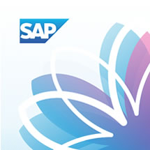 | Increase your daily productivity by tackling your most common business tasks anywhere and anytime with the SAP Fiori Client mobile app for iPhone and iPad. Deliver a next-level mobile experience with enhanced attachment handling and full-screen operations using this enhanced mobile runtime for the Web version of over 750 SAP Fiori app. Plus, access custom SAP Fiori mobile apps—built by customers using SAP Fiori mobile service—that are ready to support Intune mobile app management. |  |  
| :::no-loc text="Secure Contacts"::: 
 | The :::no-loc text="Secure Contacts"::: app allows you to synchronize your business contacts on iOS devices from various corporate data sources in a compliant way.
Features:
<ul><li>Access to all business contacts<ul><li>Personal Microsoft Exchange Online address book</li><li>Company address book</li><li>Further data sources (Microsoft Dynamics CRM, Salesforce, etc.)</li></ul></li><li>Favorites list, including the most important contacts</li><li>Caller identification without synchronization with the device address book</li><li>Starting phone calls, chats, SMS (via Microsoft Teams and the iPhone's native apps)</li><li>Encrypted and compliant storage of all data</li><li>Mobile Application Management via Microsoft Intune (App Protection Policies)</li><li>Access control via Microsoft Entra Conditional Access (Compliant Device and App Protection Policy)</li></ul>

Requirements: <ul><li>For the full range of functions, an activation by Provectus Technologies GmbH is required.<li>To use the :::no-loc text="Secure Contacts"::: app a Microsoft Entra user account must be present and activated with following functions:<ul><li>Microsoft Entra ID P1 (or higher)</li><li>Exchange Online P1 (or higher)</li><li>Microsoft Intune</li></ul></li><li>In order to use the Microsoft Teams integration, the Microsoft Teams function must be activated</li></ul> | [App Store link (iOS)](https://apps.apple.com/us/app/secure-contacts/id1617596880) |
| :::no-loc text="Seismic \| Intune"::: 
 | Seismic \| Intune is for administrators to add security and protection policies to protect corporate data while enabling employees to sell. Seismic provides the following capabilities:<ul><li>Find content fast with fast search results</li><li>Get buyer-specific recommendations when you need them, where you need them</li><li>Access sales content, training, and communications online and offline</li><li>Stay informed with a real-time newsfeed you dial in to your specific interests</li><li>Collaborate with your team and stay in the loop, wherever you are</li><li>Delight buyers with a modern, eloquent engagement experience</li><li>Gain insights by tracking buyer engagement, down to which pages and how long</li></ul>
Seismic solves the individual challenges of Sales, Marketing, and Sales Enablement teams by making all three teams more effective together. Your Marketing team builds useful content with brand protection and scalability, and mines data intelligence to continuously improve ROI over time. The Sales Enablement team distributes targeted sales content, news, and training in apps for mobile, CRM, email, and browsers. Sellers find, learn, connect, and close from any device, anywhere, and are more knowledgeable and productive than ever. | [Google Play link (Android)](https://play.google.com/store/apps/details?id=com.seismic.doccenter), [App Store link (iOS)](https://apps.apple.com/app/seismic-intune/id6444794878) |  
| :::no-loc text="Senses"::: 
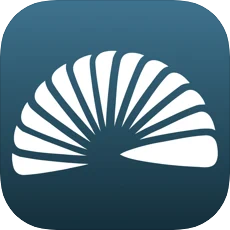 | Senses is a cloud sales support tool. Senses helps manage sales and customer success, and proposes best practices based on accumulated customer information. | [App Store link (iOS)](https://apps.apple.com/app/senses-%E3%82%BB%E3%83%B3%E3%82%B7%E3%83%BC%E3%82%BA/id1210014628) |
| :::no-loc text="ServiceNow Agent - Intune"::: 
 | ServiceNow Mobile Agent app delivers out-of-the-box, mobile-first experiences for the most common service desk agent workflows, making it easy for agents to triage, act on and resolve requests on the go. The app enables service desk agents to promptly manage and resolve end user issues from their mobile devices. Agents use the app’s intuitive interface to accept and update work even without Internet connectivity. The app greatly simplifies work by leveraging native device capabilities for tasks like navigation, barcode scanning, or collecting a signature.  The app comes with out-of-the-box workflows for service desk agents in IT, Customer Service, HR, Field Services, Security Ops and IT Asset Management. Organizations can easily configure and extend the workflows to meet their own unique needs.
With Mobile Agent you can:<ul><li>Manage the work assigned to your teams.</li><li>Triage incidents and cases.</li><li>Act on approvals with swipe gestures and quick actions.</li><li>Complete work while offline.</li><li>Access the full issue details, activity stream, and related lists of records.</li><li>Optimize workflows with location, camera, and touchscreen hardware</li></ul> | [Google Play link (Android)](https://play.google.com/store/apps/details?id=com.servicenow.fulfiller.mam.intune), [App Store link (iOS)](https://apps.apple.com/app/servicenow-agent-intune/id1494183149) |  
| :::no-loc text="Singletrack for Intune"::: 
 | Singletrack for Intune lets users access their CRM data anywhere and at any time, while supporting the Mobile Application Management (MAM) policies offered by Microsoft Intune. Users can connect with contacts and send out research. They can also log new interactions, as well as view and update existing ones.
You can choose to receive local notifications of recently finished Interactions and log draft interactions to be completed on your desktop at a later date. You can also work offline to capture data when convenient. | [App Store link (iOS)](https://apps.apple.com/us/app/singletrack-for-intune/id6502955456) |  
| :::no-loc text="Slack for Intune"::: 
 | Slack for Intune is for Slack customers that have enabled Microsoft Intune Mobile Application Management (MAM). | [Google Play link (Android)](https://play.google.com/store/apps/details?id=com.Slack.intune), [App Store link (iOS)](https://apps.apple.com/app/slack-for-intune/id1558736484) |  
| :::no-loc text="PK Protect for Intune"::: 
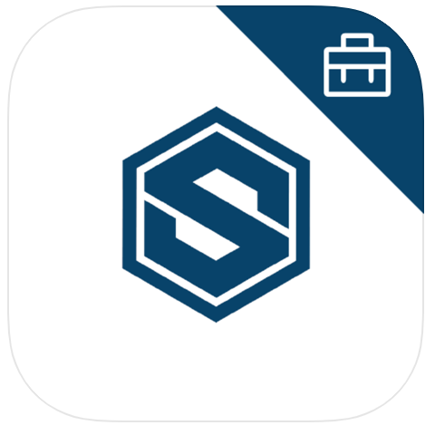 | PK Protect for Intune is specifically designed for existing PKWARE customers operating in an Intune environment. PK Protect lets you get your work done on the go. It's fast, secure and simple to use so you can be productive from anywhere. If you're unsure if you have PK Protect, contact your company's IT administrator. With PK Protect, you can: Encrypt and decrypt files using Smartkeys, Decrypt archives with X.509 Digital Certificates, Create and manage Smartkeys, Perform digital signing and authentication of data with X.509 Digital Certificates, Encrypt and decrypt files with Strong Passphrase encryption, including AE2, Log in with existing Active Directory credentials, Create and view unencrypted zip archives. PK Protect armors data at its core, eliminating vulnerabilities everywhere data is used, shared or stored. For nearly three decades, PKWARE has provided encryption and compression software to more than 30,000 enterprise customers and over 200 government agencies. Available for iOS/iPadOS and Android. | [App Store link (iOS)](https://apps.apple.com/app/smartcrypt-for-intune/id1489232256) |
| :::no-loc text="ServiceNow Agent - Intune"::: 
 | ServiceNow Mobile Agent app delivers out-of-the-box, mobile-first experiences for the most common service desk agent workflows, making it easy for agents to triage, act on and resolve requests on the go. The app enables service desk agents to promptly manage and resolve end user issues from their mobile devices. Agents use the app’s intuitive interface to accept and update work even without Internet connectivity. The app greatly simplifies work by using native device capabilities for tasks like navigation, barcode scanning, or collecting a signature.  The app comes with out-of-the-box workflows for service desk agents in IT, Customer Service, HR, Field Services, Security Ops and IT Asset Management. Organizations can easily configure and extend the workflows to meet their own unique needs.
With Mobile Agent you can:<ul><li>Manage the work assigned to your teams.</li><li>Triage incidents and cases.</li><li>Act on approvals with swipe gestures and quick actions.</li><li>Complete work while offline.</li><li>Access the full issue details, activity stream, and related lists of records.</li><li>Optimize workflows with location, camera, and touchscreen hardware</li></ul> | [Google Play link (Android)](https://play.google.com/store/apps/details?id=com.servicenow.fulfiller.mam.intune), [App Store link (iOS)](https://apps.apple.com/app/servicenow-agent-intune/id1494183149) |  
| :::no-loc text="Slack for Intune"::: 
 | Slack for Intune is for Slack customers that have enabled Microsoft Intune Mobile Application Management (MAM). | [Google Play link (Android)](https://play.google.com/store/apps/details?id=com.Slack.intune), [App Store link (iOS)](https://apps.apple.com/app/slack-for-intune/id1558736484) |  
| :::no-loc text="PK Protect for Intune"::: 
 | PK Protect for Intune is designed for existing PKWARE customers operating in an Intune environment. PK Protect lets you get your work done on the go. It's fast, secure and simple to use so you can be productive from anywhere. If you are unsure if you have PK Protect, contact your company's IT administrator. With PK Protect, you can: Encrypt and decrypt files using Smartkeys, Decrypt archives with X.509 Digital Certificates, Create and manage Smartkeys, Perform digital signing and authentication of data with X.509 Digital Certificates, Encrypt and decrypt files with Strong Passphrase encryption, including AE2, Log in with existing Active Directory credentials, Create and view unencrypted zip archives. PK Protect armors data at its core, eliminating vulnerabilities everywhere data is used, shared or stored. For nearly three decades, PKWARE has provided encryption and compression software to more than 30,000 enterprise customers and over 200 government agencies. Available for iOS/iPadOS and Android. | [App Store link (iOS)](https://apps.apple.com/app/smartcrypt-for-intune/id1489232256) |
| :::no-loc text="Speaking Email"::: 
   | Get more time in your day by having your email read to you on the move. Voice commands and simple gestures designed to be safe to use while driving give you the ability to archive, flag or even reply on the move.
Smart content detection skips over disclaimers, reply headers, and email signatures to speak only the content without the clutter.
Employees can sign in via Intune to access Microsoft 365 Exchange email. | [App Store link (iOS)](https://apps.apple.com/app/apple-store/id991406423?ct=intune) | 
| :::no-loc text="Synchrotab for Intune"::: 
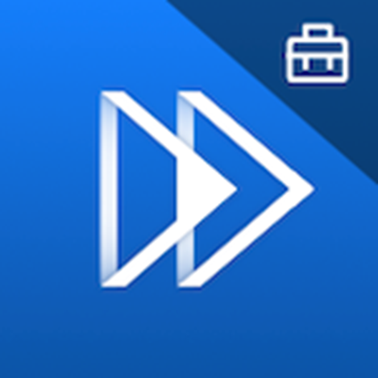 | Synchrotab is an iOS app that allows a presenter to broadcast PDF documents from a tablet or iPhone to a group of up to 8 viewer tablets. The devices communicate via peer-to-peer Wi-Fi, thus eliminating the need for a common network access. Time stamped records of materials displayed and active participants is supplied as required, together with embedded meeting notes. The viewer sees a synchronized version of the presenter’s screen with zoom and on-screen mark-up capability. Multiple documents may be uploaded to the primary device memory via email or external file network, allowing immediate access to an entire library of presentations or reports. Synchrotab makes its own statement of sustainability while eliminating costly printing and freight charges. The system was designed in cooperation with a major global investment bank ensuring exacting standards of security and integration with corporate devices. | [App Store link (iOS)](https://apps.apple.com/app/synchrotab-for-intune/id1626123415) |
| :::no-loc text="Synergi Life"::: 
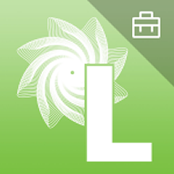 | Synergi Life Mobile App, an extension of Synergi Life, lets users easily create observations and incident reports anytime and from anywhere, using their phones to take a snapshot and make a voice recording.
Synergi Life (previously named Synergi) is a complete business solution for risk and QHSE management, managing all non-conformances, incidents, risk, risk analyses, audits, assessments and improvement suggestions.
The Synergi Life Mobile App requires you to be a licensed user of the Synergi Life risk and QHSE management system, and have the necessary back-end licensed software and services. | [Google Play link (Android)](https://play.google.com/store/apps/details?id=com.dnv.mobilesolutions.synergimobile.uibase), [App Store link (iOS)](https://apps.apple.com/us/app/synergi-life/id641181737)  |  
| :::no-loc text="Tableau Mobile for Intune"::: 
 | Tableau Mobile gives you the freedom to stay on top of your data, no matter where you are or when you need it. With a fast, intuitive, and interactive experience, explore your dashboards and find just what you’re looking for, all from the convenience of your mobile device.
The Tableau Mobile app requires a Tableau Server or Tableau Online account. Please note, it does not work with Tableau Public.
Features:
<ul><li>Interactive previews let you access your data even when you’re offline.</li><li>Mark your favorite dashboards or views to always have them at your fingertips.</li><li>Scroll, search, and browse your organization’s dashboards with a navigation experience that’s both intuitive and familiar.</li><li>Interact with your data to ask and answer questions on the go.</li></ul> | [Google Play link (Android)](https://play.google.com/store/apps/details?id=com.Tableau.TableauApp.Intune), [App Store link (iOS)](https://apps.apple.com/app/tableau-mobile-for-intune/id1500089067)  |  
| :::no-loc text="Talent.Exchange"::: 
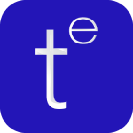 | Talent.Exchange (TALEX) is a Mobile AI Copilot for staffing and resource management professionals. It is designed to:<ul><li>Increase speed of sourcing, screening, and processing of candidates and employees (based on use case).</li><li>Automatically generate skill-based supply inventory by expertise and proficiency levels.</li><li>Provide global market and competitor demand visibility to staffing professionals to increase their revenue and monetization.</li><li>Engage, communicate and act on-the-go with candidates and colleagues.</li></ul>
TALEX mobile app takes staffing and resource management to the next level by making the power of domain AI directly accessible anytime and anywhere in the comfort of your palm. In addition to being available as an integrated app interface for highly scalable enterprise applications, powerful app features can also operate in standalone mode. | [Google Play link (Android)](https://play.google.com/store/apps/details?id=com.talent.exchange), [App Store link (iOS)](https://apps.apple.com/us/app/talent-exchange/id6468228155)  |  
| :::no-loc text="Unique Moments"::: 
 | Unlock the power of data with Unique! Record your meetings anywhere and anytime you want - thanks to the Unique app. After a meeting, you can upload the recording into the Unique platform to add it to the deal room. No information will be missed anymore.
Increase your revenue by improving client interactions and automating routine tasks. With Unique Moments you can record conversations, assign those conversations to deal/coaching rooms, and view deal/coaching rooms. | [Google Play link (Android)](https://play.google.com/store/apps/details?id=ch.unique.moments), [App Store link (iOS)](https://apps.apple.com/ro/app/unique-moments/id1619761948) | 
| :::no-loc text="Varicent"::: 
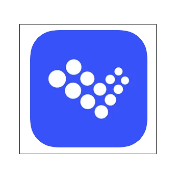 | Varicent helps sellers understand which activities provide the best results. Reports, dashboards, and workflows help sales to understand:<ul><li>Achievement</li><li>Bonus</li><li>Commission</li><li>Credits</li><li>Disputes</li><li>Key Performance Indicators (KPIs)</li><li>Opportunity potential</li><li>Plan approval</li><li>Plan assignment</li><li>Quota</li><li>Ranking</li><li>Rewards</li><li>Territory</li><li>Transactional payout</li></ul>
If you’re an individual seller, manager, or leader, Varicent can help you understand the right information at the right time. Full views of charts, graphs, dashboards and workflow execution (including information input) are right at your fingertips. Realize a better time-to-value for your go-to-market strategy with Varicent Sales Performance Management.
NOTE: This application requires that you're a client of Varicent to utilize all features and functionalities and maximize seller performance. | [Google Play link (Android)](https://play.google.com/store/apps/details?id=com.varicent), [App Store link (iOS)](https://apps.apple.com/app/varicent/id1534176581) |  
| :::no-loc text="Vbrick Mobile"::: 
 | Customers using Vbrick Enterprise Video Platform (EVP) can upload and view on-demand videos using the Vbrick mobile app. Customers can use Microsoft Intune to manage access to the Vbrick mobile app. The Vbrick mobile app includes the following features:<ul><li>View a carousel of featured videos</li><li>Browse feeds of recommended and most recent content</li><li>Search for videos</li><li>Scan categories and channels to find videos of interest</li><li>Approved that Media Contributors can upload videos captured on your mobile device</li></ul>
**NOTE**: The Vbrick app requires users to have an active account and email address in their company’s cloud-hosted Vbrick tenant. | [Google Play link (Android)](https://play.google.com/store/apps/details?id=com.vbrick.rev), [App Store link (iOS)](https://apps.apple.com/us/app/vbrick-mobile/id1630811585) |  
| :::no-loc text="VerityRMS"::: 
 | VerityRMS for iOS offers Asset Managers and Investment Professionals a full-featured and modern mobile experience. Equipped with a full suite of consumption and authoring tools, users can harness their firm’s investment process from anywhere. | [App Store link (iOS)](https://apps.apple.com/app/verityrms/id589633211) |  
| :::no-loc text="Voltage SecureMail"::: 
  | Send and receive Voltage encrypted secure email and attachments in the Microsoft Intune managed environment with Voltage SecureMail Mobile. Any user can receive and read Voltage encrypted messages. However, replying to messages and composing new secure emails requires these features to be enabled by the sending organization. Users can also compose, send, reply to, forward, and print encrypted messages, according to the SecureMail Mobile policy for their organization or for the organization sending the secure message. | [Google Play link (Android)](https://play.google.com/store/apps/details?id=com.voltage.mobile.securemail.ui), [App Store link (iOS)](https://apps.apple.com/us/app/voltage-mail/id516444730) | 
| :::no-loc text="VPSX&reg; Print for Intune"::: 
 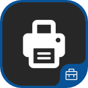 | VPSX&reg; Print is not a stand-alone application. It requires the use of Mobile Connector for VPSX.
VPSX Print utilizes the capabilities of LRS&reg; output management software by providing an easy to use interface that allows users to do the following actions:<ul><li>Print a document or web page within seconds</li><li>Select only authorized VPSX printers</li><li>Search for authorized printers by printer name, long name or printer location</li><li>Print multiple copies</li><li>Locate and print to nearby printer</li></ul> | [Google Play link (Android)](https://play.google.com/store/apps/details?id=com.lrs.vpsxprint.intune), [App Store link (iOS)](https://apps.apple.com/us/app/vpsx-print-for-intune/id1520029386) | 
| :::no-loc text="Zero for Intune"::: 
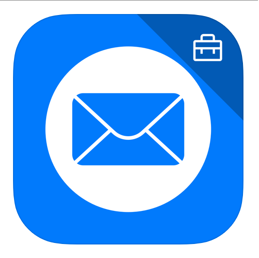 | The ZERØ for Intune application is specifically designed for MDM deployment via Microsoft Intune. This app allows both ZERØ and Microsoft Intune customers to take advantage of a secure Intune MDM deployment, as well as organize and protect BYOD environments with mobile application management (MAM). | [App Store link (iOS)](https://apps.apple.com/app/zero-for-intune/id1508485761) |  
| :::no-loc text="Zoom for Intune"::: 
 | Zoom is your communications hub for meetings, webinars, chat and cloud phone. Start or join meetings with flawless video, crystal clear audio and instant screen sharing from desktop, mobile or conference rooms. | [Google Play link (Android)](https://play.google.com/store/apps/details?id=us.zoom.videomeetings4intune), [App Store link (iOS)](https://apps.apple.com/app/zoom-for-intune/id1462818858?mt=8) |  

## Partner UEM apps

The following apps enable coexistence between apps that support Intune App Protection Policies and partner unified endpoint management (UEM) solutions. These apps support the core Intune App Protection Policy settings. Apps are also capable of supporting advanced App Protection Policy and App Configuration Policy settings. For more information, contact the app vendor.

| App   title | App description | App store links for supported   platform(s) | 
|-------------------------------------------------|-------------------------|---------------------------------------------|
| :::no-loc text="Blackberry Enterprise BRIDGE"::: 
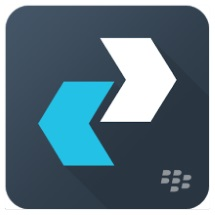 | BlackBerry Enterprise BRIDGE allows you to securely view, edit, and save documents using Intune-managed Microsoft apps, such as Microsoft Word, Microsoft PowerPoint, and Microsoft Excel from BlackBerry Dynamics. You can share your documents as email attachments and maintain data encryption during the document-sharing process between BlackBerry Dynamics and Intune-managed mobile apps. | [Google Play link (Android)](https://play.google.com/store/apps/details?id=com.blackberry.intune.bridge), [App Store link (iOS)](https://apps.apple.com/us/app/blackberry-enterprise-bridge/id1305494864?mt=8) |
| :::no-loc text="Workspace ONE Send"::: 
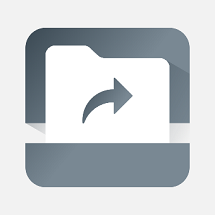 | Workspace ONE Send provides seamless editing and sending capabilities for customers using Microsoft Intune to manage Microsoft 365 apps using VMware productivity apps. | [Google Play link (Android)](https://play.google.com/store/apps/details?id=com.airwatch.vmsend), [App Store link (iOS)](https://apps.apple.com/us/app/vmware-workspace-one-send/id1336333505?mt=8) |

## Next steps

To learn how to add apps for each platform to Intune, see:

- [Android store apps](store-apps-android.md)
- [Android LOB apps](lob-apps-android.md)
- [iOS store apps](store-apps-ios.md)
- [iOS LOB apps](lob-apps-ios.md)
- [Web apps (for all platforms)](web-app.md)
- [Microsoft store apps](store-apps-windows.md)
- [Windows LOB app](lob-apps-windows.md)
- [Microsoft 365 apps for Windows 10](apps-add-office365.md)
- [Microsoft 365 apps for macOS](apps-add-office365-macos.md)
- [Built-in apps](apps-add-built-in.md)
- [Win32 apps](apps-win32-add.md)
- [Enterprise App Catalog app (Win32)](apps-add-enterprise-app.md)
