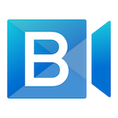
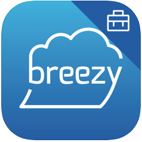
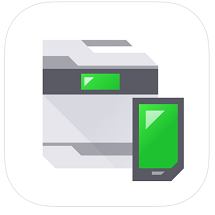
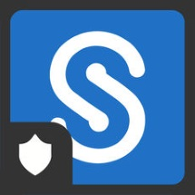

# Microsoft Intune protected apps  

The apps listed in this topic are supported partner and Microsoft apps that are commonly used with Microsoft Intune. Intune protected apps are enabled with a rich set of mobile application protection policies.

> [!NOTE]
> For your client line-of-business apps, you can incorporate mobile app management using the [Intune App Software Development Kit](../developer/app-sdk.md) (SDK), or the [App Wrapping Tool for iOS](../developer/app-wrapper-prepare-ios.md) and the [App Wrapping Tool for Android](../developer/app-wrapper-prepare-android.md).

The following tables provide details of supported partner and Microsoft apps that are commonly used with Microsoft Intune. These apps support the **core App Protection Policy settings** which are defined as:

- Protecting work or school account data while leaving personal data untouched in apps that support multi-identity
- Restricting data transfer and copy-and-paste functions
- Encrypting work or school account data
- Configuring work or school account web links to open inside a managed browser, like Microsoft Edge
- Enforcing access requirements to access work or school account data
- Enforcing conditional launch behaviors to protect the work or school account data
- Applying data loss prevention policies without managing the user's device
- Enabling app protection without requiring enrollment
- Enabling app protection on devices managed with third-party Unified Endpoint Management solutions

In addition to supporting the core App Protection Policy settings, apps are also capable of supporting **advanced App Protection Policy and App Configuration Policy** settings. These settings require app investment:

- App Configuration Policies can be used by apps to customize app behavior and/or App Protection Policy settings.
- On enrolled devices, managed apps can leverage *org allowed accounts mode* to require sign-in with a specific identity and disable multi-identity functionality.
- The *Sync policy managed app data with native apps* App Protection Policy setting can be utilized by apps to restrict the synchronization of contact or calendar data to the native apps.
- The *Org data notifications* App Protection Policy setting can be utilized by apps to limit the exposure of sensitive data in notifications.
- The *Open data into Org documents* App Protection Policy setting can be utilized by apps to restrict importing data from unmanaged locations.
- The *Save copies of org data* App Protection Policy setting can be utilized by apps to restrict which locations can be used when saving work or school account data.

## Microsoft apps

> [!NOTE]
> For more information on Conditional Access support, see [App protection policy requirement](/azure/active-directory/conditional-access/concept-conditional-access-grant#require-app-protection-policy).

The below apps support the Core Intune App Protection Policy settings and are also capable of supporting advanced App Protection Policy and App Configuration Policy settings:

|App|Platform|[Core App Protection Policy settings](app-protection-policy.md)|[App configuration](app-configuration-policies-overview.md)|Org allowed accounts ([iOS](app-configuration-policies-use-ios.md#allow-only-configured-organization-accounts-in-apps), [Android](app-configuration-policies-use-android.md#allow-only-configured-organization-accounts-in-apps))|Sync policy managed app data with native apps ([iOS](app-protection-policy-settings-ios.md#functionality), [Android](app-protection-policy-settings-android.md#functionality))|Org data notifications ([iOS](app-protection-policy-settings-ios.md#functionality), [Android](app-protection-policy-settings-android.md#functionality))|Open data into Org documents ([iOS](app-protection-policy-settings-ios.md#data-transfer), [Android](app-protection-policy-settings-android.md#data-transfer))|Save copies of org data ([iOS](app-protection-policy-settings-ios.md#data-transfer), [Android](app-protection-policy-settings-android.md#data-transfer))|
|--- |--- |:-: |--- |:-: |:-: |:-: |:-: |:-: |
|Microsoft Edge|[Android](https://play.google.com/store/apps/details?id=com.microsoft.emmx)|✔|✔ see [Edge app config](manage-microsoft-edge.md)|✔|N/A|N/A|N/A|N/A|
|Microsoft Edge|[iOS](https://apps.apple.com/us/app/microsoft-edge/id1288723196)|✔|✔ see [Edge app config](manage-microsoft-edge.md)|✔|N/A|N/A|N/A|N/A|
|Microsoft Excel|[Android](https://play.google.com/store/apps/details?id=com.microsoft.office.excel)|✔|No settings|✔|N/A|✖|✖|✔|
|Microsoft Excel|[iOS](https://apps.apple.com/us/app/microsoft-excel/id586683407)|✔|No settings|✔|N/A|✖|✖|✔|
|Microsoft Launcher|[Android](https://play.google.com/store/apps/details?id=com.microsoft.launcher)|✔|✔ see [Launcher app config](configure-microsoft-launcher.md)|✖|N/A|✖|✖|N/A|
|Microsoft Lists|[iOS](https://apps.apple.com/us/app/microsoft-lists/id1530637363)|✔|No settings|✔|N/A|N/A|✔|✔|
|Microsoft Lists|[Android](https://play.google.com/store/apps/details?id=com.microsoft.lists.public&gl=US)|✔|No settings|✔|N/A|N/A|✔|✔|
|Microsoft Office|[Android](https://play.google.com/store/apps/details?id=com.microsoft.office.officehubrow)|✔|✔ see [Office app config](manage-microsoft-office.md)|✔|N/A|✖|✖|✔|
|Microsoft Office|[iOS](https://apps.apple.com/app/microsoft-office/id541164041)|✔|✔ see [Office app config](manage-microsoft-office.md)|✔|N/A|✖|✖|✔|
|Microsoft OneDrive|[Android](https://play.google.com/store/apps/details?id=com.microsoft.skydrive)|✔|No settings|✔|N/A|✖|✔|N/A|
|Microsoft OneDrive|[iOS](https://apps.apple.com/us/app/onedrive-cloud-storage-for/id477537958)|✔|No settings|✔|N/A|✖|✔|N/A|
|Microsoft OneNote|[Android](https://play.google.com/store/apps/details?id=com.microsoft.office.onenote)|✔|No settings|✔|N/A|✖|✖|N/A|
|Microsoft OneNote|[iOS](https://apps.apple.com/us/app/microsoft-onenote-for-iphone/id410395246)|✔|No settings|✔|N/A|✖|✖|N/A|
|Microsoft Outlook|[Android](https://play.google.com/store/apps/details?id=com.microsoft.office.outlook)|✔|✔ see [Outlook app config](/exchange/clients-and-mobile-in-exchange-online/outlook-for-ios-and-android/outlook-for-ios-and-android-configuration-with-microsoft-intune)|✔|✔|✔|✔|✖|
|Microsoft Outlook|[iOS](https://apps.apple.com/us/app/microsoft-outlook/id951937596)|✔|✔ see [Outlook app config](/exchange/clients-and-mobile-in-exchange-online/outlook-for-ios-and-android/outlook-for-ios-and-android-configuration-with-microsoft-intune)|✔|✔|✔|✔|✔|
|Microsoft Planner|[Android](https://play.google.com/store/apps/details?id=com.microsoft.planner)|✔|No settings|✖|N/A|✖|✖|N/A|
|Microsoft Planner|[iOS](https://apps.apple.com/us/app/microsoft-planner/id1219301037)|✔|No settings|✖|N/A|✖|✖|N/A|
|Microsoft PowerPoint|[Android](https://play.google.com/store/apps/details?id=com.microsoft.office.powerpoint)|✔|No settings|✔|N/A|✖|✖|✔|
|Microsoft PowerPoint|[iOS](https://apps.apple.com/us/app/microsoft-powerpoint/id586449534)|✔|No settings|✔|N/A|✖|✖|✔|
|Microsoft SharePoint|[Android](https://play.google.com/store/apps/details?id=com.microsoft.sharepoint)|✔|No settings|✖|N/A|✖|✖|N/A|
|Microsoft SharePoint|[iOS](https://apps.apple.com/us/app/microsoft-sharepoint/id1091505266)|✔|No settings|✖|N/A|✖|✖|N/A|
|Microsoft Teams|[Android](https://play.google.com/store/apps/details?id=com.microsoft.teams)|✔|No settings|✔|N/A|✔|✔|✔|
|Microsoft Teams|[iOS](https://apps.apple.com/us/app/microsoft-teams/id1113153706)|✔|No settings|✔|N/A|✔|✔|✔|
|Microsoft To-Do|[Android](https://play.google.com/store/apps/details?id=com.microsoft.todos)|✔|No settings|✖|N/A|✖|✖|N/A|
|Microsoft To-Do|[iOS](https://apps.apple.com/us/app/microsoft-to-do/id1212616790)|✔|No settings|✖|N/A|✖|✖|N/A|
|Microsoft Word|[Android](https://play.google.com/store/apps/details?id=com.microsoft.office.word)|✔|No settings|✔|N/A|✖|✖|✔|
|Microsoft Word|[iOS](https://apps.apple.com/us/app/microsoft-word/id586447913)|✔|No settings|✔|N/A|✖|✖|✔|
|Microsoft Yammer|[Android](https://play.google.com/store/apps/details?id=com.yammer.v1)|✔|No settings|✖|N/A|✖|✖|N/A|
|Microsoft Yammer|[iOS](https://apps.apple.com/us/app/yammer/id289559439)|✔|No settings|✖|N/A|✖|✖|N/A|

The below apps support the core Intune App Protection Policy settings.

|App|Platform|[Core App Protection Policy settings](app-protection-policy.md)|[App configuration](app-configuration-policies-overview.md)|
|--- |--- |:-: |--- |
|Dynamics 365 Remote Assist|[Android](https://play.google.com/store/apps/details?id=com.microsoft.ramobile)|✔|No settings|
|Dynamics 365 Remote Assist|[iOS](https://apps.apple.com/us/app/dynamics-365-remote-assist/id1470512565)|✔|No settings|
|Dynamics 365 Sales|[Android](https://play.google.com/store/apps/details?id=com.microsoft.crm.crmphone.sales)|✔|No settings|
|Dynamics 365 Sales|[iOS](https://apps.apple.com/app/dynamics-365-sales/id1485578688)|✔|No settings|
|Dynamics 365 for phone|[iOS](https://apps.apple.com/us/app/dynamics-365-for-phones/id1003997947)|✔|No settings|
|Dynamics 365 for phone|[Android](https://play.google.com/store/apps/details?id=com.microsoft.crm.crmphone)|✔|No settings|
|Field Service (Dynamics 365)|[Android](https://play.google.com/store/apps/details?id=com.microsoft.crm.crmphone.fieldServices)|✔|No settings|
|Field Service (Dynamics 365)|[iOS](https://apps.apple.com/app/field-service-dynamics-365/id1485579247?ls=1)|✔|No settings|
|Field Service Mobile|[Android](https://play.google.com/store/apps/details?id=com.microsoft.d365.fs.mobile)|✔|No settings|
|Field Service Mobile|[iOS](https://apps.apple.com/app/field-service-mobile/id1414669075)|✔|No settings|
|Microsoft 365 Admin|[Android](https://play.google.com/store/apps/details?id=com.ms.office365admin)|✔|No settings|
|Microsoft 365 Admin|[iOS](https://apps.apple.com/app/microsoft-365-admin/id761397963)|✔|No settings|
|Microsoft Azure Information Protection Viewer|[Android](https://play.google.com/store/apps/details?id=com.microsoft.ipviewer)|✔|No settings|
|Microsoft Azure Information Protection Viewer|[iOS](https://apps.apple.com/us/app/rms-sharing/id689516635)|✔|No settings|
|Microsoft Bookings|[Android](https://play.google.com/store/apps/details?id=com.microsoft.exchange.bookings)|✔|No settings|
|Microsoft Bookings|[iOS](https://apps.apple.com/us/app/microsoft-bookings/id1065657468)|✔|No settings|
|Microsoft Dynamics CRM|[Android](https://play.google.com/store/apps/details?id=com.microsoft.crm.crmphone)|✔|No settings|
|Microsoft Dynamics CRM|[iOS](https://apps.apple.com/app/microsoft-dynamics-crm/id678800460)|✔|No settings|
|Microsoft Kaizala|[Android](https://play.google.com/store/apps/details?id=com.microsoft.mobile.polymer)|✔|No settings|
|Microsoft Kaizala|[iOS](https://apps.apple.com/app/microsoft-kaizala/id1112208399)|✔|No settings|
|Microsoft PowerApps|[Android](https://play.google.com/store/apps/details?id=com.microsoft.msapps)|✔|No settings|
|Microsoft PowerApps|[iOS](https://apps.apple.com/us/app/powerapps/id1047318566)|✔|No settings|
|Microsoft Power Automate|[Android](https://play.google.com/store/apps/details?id=com.microsoft.flow)|✔|No settings|
|Microsoft Power Automate|[iOS](https://apps.apple.com/us/app/microsoft-flow/id1094928825)|✔|No settings|
|Microsoft Power BI|[Android](https://play.google.com/store/apps/details?id=com.microsoft.powerbim)|✔|No settings|
|Microsoft Power BI|[iOS](https://apps.apple.com/us/app/microsoft-power-bi/id929738808)|✔|No settings|
|Microsoft Skype for Business|[Android](https://play.google.com/store/apps/details?id=com.microsoft.office.lync15)|✔|No settings|
|Microsoft Skype for Business|[iOS](https://apps.apple.com/app/skype-for-business-formerly/id605841731)|✔|No settings|
|Microsoft Stream|[Android](https://play.google.com/store/apps/details?id=com.microsoft.stream)|✔|No settings|
|Microsoft Stream|[iOS](https://apps.apple.com/us/app/microsoft-stream/id1401013624)|✔|No settings|
|Microsoft Visio Viewer|[iOS](https://apps.apple.com/us/app/microsoft-visio-viewer-flowcharts-and-diagrams/id1139787983)|✔|No settings|
|Microsoft Whiteboard|[iOS](https://apps.apple.com/app/microsoft-whiteboard/id1352499399)|✔|No settings|
|Microsoft Whiteboard|[Android](https://play.google.com/store/apps/details?id=com.microsoft.whiteboard.publicpreview)|✔|No settings|

> [!NOTE]
> For Microsoft Office for Android, add the Office Hub, Office Hub (HL), and Office Hub (ROW) apps to Android App Protection Policies.

## Partner productivity apps

The following apps support the core Intune App Protection Policy settings. Apps are also capable of supporting advanced App Protection Policy and App Configuration Policy settings. For more information, contact the app vendor.

> [!IMPORTANT]
> Contact the app vendor for specific details on Intune related support. 

| App   title | App description | App store links for supported   platform(s) | 
|-------------------------------------------------|-------------------------|---------------------------------------------|
| **Acronis Access**
 | Safely access your business files from anywhere and any device with Acronis Access. Easily share documents with colleagues, customers, and vendors while keeping files and data secure and private, where only you and your organization can touch them. The app is designed for extreme ease of use with unparalleled security, privacy, and management capabilities. | [App Store link (iOS)](https://apps.apple.com/us/app/acronis-access/id429704844?mt=8) |                       
| **Adobe Acrobat Reader**
 | Open, view, and work with PDFs in a Microsoft Intune managed environment with Adobe Acrobat Reader. Available for iOS/iPadOS and Android. | [Google Play link (Android)](https://play.google.com/store/apps/details?id=com.adobe.reader), [App Store link (iOS)](https://apps.apple.com/app/adobe-acrobat-reader-for-pdf/id469337564) |
| **Appian for Intune**
 | Appian empowers business users to monitor, collaborate, and take action on the go, enabling your mobile workforce to stay connected to key business processes and enterprise data.
Appian’s Business Process Management and Case Management Suite delivers mobile access to event notifications, forms, tasks, information, reports, content, and ad-hoc collaboration.
Appian provides the following: <ul><li>Mobile access to the Appian platform</li><li>Mobile task management</li><li>Collaborative activity feed</li><li>Enterprise data discovery</li><li>Offline forms processing</li><li>Access to enterprise reports and analytics</li></ul>This application requires authorized access to an instance of Appian. | [App Store link (iOS)](https://apps.apple.com/app/id1573771379) |
| **ArchXtract (MDM)**
 | ArchXtract is used to decompress zip files between Microsoft Intune managed applications. The ArchXtract app is the upgraded version of the Intune managed decompression app known as ZipExtractor. ArchXtract supports a wide variety of compression methods.

Characteristic: <ul><li>Microsoft Intune policies can be applied to protect company information</li><li>Supports Zip files can be created with major compression tools such as 7-zip, Lhaplus, WinZip, and WinRAR</li><li>Archive files, other than zip, can now be decompressed</li><li>Compression methods such as Deflate, Deflate64, BZip2, LZMA (no password), and PPMd can be decompressed</li><li>Devices which use the ArchXtract can be managed from web</li><li>Archive files with password can be decompressed on mobile devices</li><li>Open the file by changing the Encoding to prevent garbled characters</li><li>Text and Image files can be viewed.</li></ul>

Supported file types: bmp, jpeg, png, gif, PDF, txt, csv, html, xml
Supported compression methods include Deflate64, BZip2, LZMA (no password), PPMd.

Important: To use the full functionality of this application, you need a connect to a company work account and a valid subscription for Microsoft Intune. Some functions may not be available in some countries. |  [Google Play link (Android)](https://play.google.com/store/apps/details?id=jp.co.cegb.archxtractforstore&hl=en_US&gl=US), [App Store link (iOS)](https://apps.apple.com/app/archxtract-mdm-support/id1488048735) | 
| **AssetScan For Intune**
 | AssetScan is a proprietary application linked to the Asset Point tool suite. AssetScan supports technology inventory gathering and verification for both data centers and desktop locations. | [App Store link (iOS)](https://apps.apple.com/app/assetscan-for-intune/id1582325082) | 
| **AventX Mobile Work Orders**
 | AventX Mobile Work Orders allows maintenance users of Oracle eAM to view work order packets on the go with an iPhone or iPad – even offline. As with paper, users can mark-up electronic work orders with the added benefit of attaching rich media, like pictures and audio files, as context to the completed work. Adding to the efficiency of mobile, AventX allows technicians to route, close and upload completed work orders from anywhere, increasing time in the field and decreasing time spent manually entering the same information after the work is done. | [App Store link (iOS)](https://apps.apple.com/app/mobile-work-orders/id1144125126) | 
| **Bluejeans Video Conferencing**
 | BlueJeans delivers a premium video conferencing experience that is optimized for the mobile workforce. With amazing features, like Dolby Voice® audio, BlueJeans helps make every meeting more productive regardless of where the participants are located.
Features:
<ul><li>Participate in BlueJeans video meetings with up to 150 attendees.</li><li>Experience HD video and Dolby Voice® audio for the highest fidelity meetings.</li><li>Share and receive content for maximum productivity on-the-go.</li><li>Facilitate professional meetings with intuitive controls that make meeting moderation a breeze.</li><li>Integrate your calendar to enable one touch to join and easily jump from meeting-to-meeting.</li><li>Eliminate low-bandwidth spots with intelligent bandwidth management that optimize network settings.</li><li>Select safe driving mode while on the road for distraction-free meetings.</li></ul> | [Google Play link (Android)](https://play.google.com/store/apps/details?id=com.bluejeansnet.Base), [App Store link (iOS)](https://apps.apple.com/app/bluejeans-video-conferencing/id560788314) |
| **Board Papers**
 | Board Papers is a board portal solution that combines an iPad application with Microsoft SharePoint® integration. | [App Store link (iOS)](https://apps.apple.com/app/board-papers/id458518678) |
| **Box - Cloud Content Management**
 | Box helps you get work done on the go. It's fast, secure and simple to use, so you can be productive from anywhere, which is the reason 97,000 businesses, including Eli Lilly and Company, General Electric, KKR & Co., P&G and The GAP securely access and manage their critical information with Box. The Box app integrates with Intune SDK and supports a number of Intune Mobile Application Management policies without using Mobile Device Management. | [App Store link (iOS)](https://apps.apple.com/app/box-cloud-content-management/id290853822) | 
| **Box for EMM**
 | Keep your employees connected and collaborative while you centrally manage security, policy, and provisioning across any mobile device using Box for EMM. | [App Store link (iOS)](https://apps.apple.com/us/app/box-for-emm/id882085676?mt=8) |
| **Breezy for Intune**
 | Breezy For Intune provides secure print capabilities for your iOS device. Our integration with Intune ensures that your data stays secure while on-device, and own our end-to-end encryption and enterprise grade security ensure that it stays that way on its way to the printer. | [App Store link (iOS)](https://apps.apple.com/app/breezy-for-intune/id1447680750?mt=8) |
| **CAPTOR&trade; for Intune**
 | CAPTOR is used by organizations to securely capture content on iOS/iPadOS and Android devices, especially in regulated industries such as healthcare, legal, government, law enforcement, insurance, real estate, manufacturing, and financial services. CAPTOR combines the productivity functions of document scanning, audio/video recording, photo/document annotating, and QR-Code reading. CAPTOR requires a [license key from Inkscreen](https://www.inkscreen.com/trial).

Key Features:
<ul><li>Scan multi-page documents using smart edge detection, as well as edit, annotate, and save as PDF capabilities.</li><li>Combine/merge PDF files and rearrange or delete pages.</li><li>Use e-Signature annotation for signing PDF documents.</li><li>Capture high resolution photos and videos.</li><li>Record ambient audio.</li><li>Read QR codes and a launch secure browser.</li><li>Annotate photos and documents with arrows, drawings, highlighters, and text labels.</li><li>Apply informative captions to media.</li><li>Enhanced search for photos and documents containing text, audio, and video using speech recognition.</li><li>Configure IT policies to enforce authentication, PDF version, Open In, default browser, file naming, and much more.</li><li>Support for BYOD/COPE (completely separate work content from personal) and enable personal privacy (GDPR compliance).</li></ul>  | [Google Play link (Android)](https://play.google.com/store/apps/details?id=com.inkscreen.captor.intune), [App Store link (iOS)](https://apps.apple.com/app/captor-for-intune/id1561413342) |
| **CellTrust SL2&trade; for Microsoft Intune**
 | CellTrust SL2&trade; for Microsoft Intune is an enterprise-level application that works by assigning a secure Mobile Business Number (MBN) on bring-your-own devices to keep personal and business communications separate on a single device. The seamless solution secures SMS messages and business calls on the device without using the personal number. This capability is vital for enterprises that require greater security for business communications, as well as archiving for eDiscovery and compliance needs.    Microsoft Intune is a cloud-based service in the enterprise mobility management (EMM) space that helps enable your workforce to be productive while keeping your corporate data protected.    CellTrust SL2&trade; for Microsoft Intune delivers a powerful enterprise mobility platform, allowing employees to work on the go—with easy access to secure business applications, and voice and text messaging. The app was developed with Microsoft Intune SDKs and customized features to allow organizations to tailor it based on their industry and IT needs. | [Google Play link (Android)](https://play.google.com/store/apps/details?id=com.celltrust.sl2_intune), [App Store link (iOS)](https://apps.apple.com/us/app/celltrust-sl2-for-intune/id1442087513?mt=8) |
| **Cisco Jabber for Intune**
 | Cisco Jabber for Intune is for admins to organize and protect BYOD environments with mobile application management (MAM). This app allows admins to protect corporate data while keeping employees connected. | [Google Play link (Android)](https://play.google.com/store/apps/details?id=com.cisco.im.intune), [App Store link (iOS)](https://apps.apple.com/app/cisco-jabber-for-intune/id1487776871) |
| **Webex for Intune**
 | Webex for Intune brings together your teams, your customers, and your work in real-time and anytime. You can call, message, and meet.

Capabilities: <ul><li>Calling built into the app for deeper conversations</li><li>Messaging and file sharing integrated with your content and workflow</li><li>Upgraded meeting experiences with personalized layouts & virtual backgrounds</li><li>Smart presence lets you know when people are available</li><li>Control Webex Devices directly from the app</li></ul>
Built-in Intelligence: <ul><li>Notes, highlights and live translation in 10 languages</li><li>Unlock revolutionary people insights with Webex Graph</li><li>Reduce disruptions with noise removal & speech enhancements</li><li>Auto adjust meeting quality for the best experience</li></ul>
Equal experiences for everyone: <ul><li>Reactions to allow everyone to participate in their own way</li><li>Work on any device from anywhere: desktop, mobile, web or Cisco Devices</li></ul> | [Google Play link (Android)](https://play.google.com/store/apps/details?id=com.cisco.wx2.android.msintune), [App Store link (iOS)](https://apps.apple.com/app/cisco-webex-teams-for-intune/id1512240567) |
| **Citrix Secure Mail**
 | Citrix Secure Mail is a containerized email, calendar, and contacts app with a rich user experience. | [Google Play link (Android)](https://play.google.com/store/apps/details?id=com.citrix.mail.droid), [App Store link (iOS)](https://apps.apple.com/us/app/citrix-secure-mail/id1155203964?mt=8) |
| **Comfy**
 | Comfy is the workplace experience app that empowers you to get the most out of your office. | [Google Play link (Android)](https://play.google.com/store/apps/details?id=com.buildingrobotics.comfy), [App Store link (iOS)](https://apps.apple.com/app/comfy/id805595791) |
| **Confidential File Viewer**
 | The Confidential File Viewer (HIBUN) app is used to decrypt and reference password-protected encrypted files. Use the confidential file viewer to decrypted confidential files that have been created and encrypted using HIBUN Data Encryption. Confidential files encrypted with HIBUN AE Information Cypher can also be decrypted using the confidential file viewer. | [Google Play link (Android)](https://play.google.com/store/apps/details?id=jp.co.hitachi_solutions.Hibun.HibunDP&hl=ja), [App Store link (iOS)](https://apps.apple.com/jp/app/mi-wen-ji-mifairubyua/id1041326843) |
| **Dashflow for Intune**
 | Dashflow&trade; is an artificial intelligence tool for businesses that need precise institutional-grade appraisal of commercial real estate investments.
You can use Dashflow&trade;: <ul><li>When bidding, advising or evaluating CRE assets and deals.</li><li>To save time and money on staff and on training, while boosting morale.</li><li>Anywhere: in the Board room or in a café, on a desktop or on a train, at home or at work.</li><li>To review and filter more deals, so improving productivity many-fold</li><li>To improve precision, increase flexibility, reduce risks, avoid errors and release creativity.</li><li>To get an instant check of results via a live Excel financial model: the DashModel.</li><li>To be far more responsive within and without your firm.</li></ul> | [App Store link (iOS)](https://apps.apple.com/app/dashflow-for-intune/id1576703796) |
| **Diligent Boards**
 | With Diligent Boards, organizations can conduct board, committee, and leadership meetings. Diligent Boards provides executives and senior leaders a secure way to access critical meeting and governance information. Diligent provides immediate access to sensitive meeting materials, along with the tools to review, discuss and collaborate on business topics. | [App Store link (iOS)](https://apps.apple.com/app/diligent-boards/id412771395) |
| **Egress Secure Mail for Intune**
 | Send and receive encrypted   emails and files from your mobile device. Egress Secure Email provides   user-friendly tools to secure sensitive data, with end-to-end encryption,   access revocation and message restrictions to empower users to stay in   control of the information they share.
The Egress Secure Email app   requires you to be a licensed user of the Egress platform, with a valid   subscription and appropriate infrastructure. | [Google Play link (Android)](https://play.google.com/store/apps/details?id=com.egress.switchdroid.intune) | 
| **F2 Touch Intune**
 | With the F2 Touch app for iPad and iPhone, you can access and edit corporate case and document information. The app accesses the cBrain F2 eGovernment platform and enables employees and corporate management to securely perform their daily tasks while away from the office.

Key features of the F2 Touch for iPad and iPhone: <ul><li>Manage your inbox</li><li>Read and approve submittals</li><li>Read and create matters and documents</li><li>Chat</li><li>Search the corporate document archive</li></ul>

**Note:** To use the F2 Touch Intune app with your business data, you must be a user of the F2 eGovernment platform, with mobile services and Intune enabled by your IT department. | [App Store link (iOS)](https://apps.apple.com/dk/app/f2-touch-intune/id1571703604) |
| **FactSet 3.0**
 | FactSet delivers superior analytics, service, content, and technology to help investment professionals see and seize opportunity sooner. Our Factset 3.0 app is a phone optimized experience that allows our subscribing users to leverage the power and intelligence of the FactSet workstation anytime, anywhere. | [Google Play link (Android)](https://play.google.com/store/apps/details?id=com.factset.wireless), [App Store link (iOS)](https://apps.apple.com/app/factset-3-0/id1464041112) | 
| **FleetSafe‪r**
 | FleetSafer is a risk measurement and mitigation tool that enforces communications policies and monitors safe driving practices. FleetSafer requires a Cogosense enterprise account. FleetSafer uses GPS or a connected cogoB smart device to automatically engage when driving movement is detected, disabling access to the device and silencing all calls and notifications. Calling, text, social, and email functionality is disabled. Driving behavior is monitored. | [Google Play link (Android)](https://play.google.com/store/apps/details?id=com.aegismobility.guardian), [App Store link (iOS)](https://apps.apple.com/app/id957483278) |
| **Fuze Mobile for Intune**
 | Fuze Mobile for Intune allows end users to communicate using voice calling, video meetings, contact center, chat messaging, and content sharing. Admins can deploy Fuze Mobile securely and at scale in a BYOD context. Fuze Mobile for Intune requires both a Fuze account and a Microsoft managed environment. | [Google Play link (Android)](https://play.google.com/store/apps/details?id=com.fuze.fuzeappmdm), [App Store link (iOS)](https://apps.apple.com/app/fuze-mobile-for-intune/id1530095324) |
| **Groupdolists**
 | Groupdolists helps to coordinates incident response teams, whether corporate or public sector, in a single organization or across multiple organizations. Groupdolists creates a common operating picture between all responders, wherever they are, and synchronizes their efforts in real time.

Benefits include the following:<ul><li>Groupdolists brings emergency (and everyday) operating procedures to interactive life.</li><li>Groupdolists pushes task lists to response teams, regardless of their location or device, instantly synchronizing what needs to be done and by whom, as well as confirming completed tasks in chronological order.</li><li>Groupdolists increases transparency, provides greater accountability, and offers a "leadership view" for those who need to see but not touch.</li><li>Groupdolists instantly synchronizes not just tasks, but photos, videos, links, comments, and documents to all team members. Everything you use is available for reference and action.</li><li>Groupdolists provides complete after-action documentation in both PDF and Excel formats.</li></ul> | [Google Play link (Android)](https://play.google.com/store/apps/details?id=com.groupdolists.android&hl=en_CA&gl=US), [App Store link (iOS)](https://apps.apple.com/us/app/groupdolists/id1260967873) |
| **Hearsay Relate for Intune**
 | Hearsay Relate for Intune enables advisors to manage and nurture their book of business in a protected BYOD environment with mobile application management (MAM). This version of Hearsay Relate allows IT administrators to protect corporate data while keeping advisors in touch with their book of business.   Hearsay Relate, a mobile application that enables financial services professionals to move business forward. Leverage compliant texting and seamless voice calling to connect with your entire book of business. Stay productive with calendar integration to set appointments, and schedule reminder messages for upcoming meetings, birthday greetings, and more. Hearsay Relate for Intune gives enterprise users all the features they expect from Hearsay Relate, while providing IT administrators the MAM functionality they need to keep corporate data safe. In the event of a lost or stolen device, IT can remove Hearsay Relate for Intune from the device along with any sensitive data associated with it. | [Google Play link (Android)](https://play.google.com/store/apps/details?id=com.hearsaysocial.messages.intune), [App Store link (iOS)](https://apps.apple.com/app/hearsay-relate-for-intune/id1501771956) | 
| **HowNow**
 | Use HowNow to get all the knowledge you need, everywhere you work. You can bring together the knowledge, business intelligence, and insights you need from a variety of internal and external sources. HowNow is tailored to you by personalizing learning for you based on your role, business goals, skill requirements, performance, and work you’re doing. You can teach, learn, and share knowledge with your team in any format you like at any time, from anywhere. | [Google Play link (Android)](https://play.google.com/store/apps/details?id=com.hownow.gethownow), [App Store link (iOS)](https://apps.apple.com/app/hownow/id1464131703) | 
| **iAnnotate for Intune/O365**
| Designed for Microsoft Intune enterprise users, iAnnotate for Intune/O365 allows you to read, annotate, and share PDFs, Microsoft Office files, images and web pages. Seamlessly integrate with OneDrive and Outlook, while easily converting all MS documents to PDFs for quick markup. IT administrators must visit https://enterprise.iannotate.com/ to activate a 30-day free trial and to view the iAnnotate for Intune deployment guide. | [App Store link (iOS)](https://apps.apple.com/app/iannotate-for-intune-o365/id1567388828) |
| **iBabs for Intune**
| ISEC7 Mobile Exchange Delegate allows authorized representatives via iPhone and iPad to agree to appointments for their colleagues, to manage their contacts, and to answer emails on behalf of other users. | [App Store link (iOS)](https://apps.apple.com/us/app/ibabs-for-intune/id1130847428?mt=8) |
| **iManage Work 10 For Intune**
| Confidently and securely access content from iManage Work with Work Mobility for Intune. Empower users to find, edit, collaborate, and share documents and emails from their iOS device. iManage Mobility enables users to be productive from anywhere, with a consistent user experience and the same security protections as iManage Work 10. | [App Store link (iOS)](https://apps.apple.com/app/imanage-work-10-for-intune/id1337285529?ls=1) |
| **ISEC7 MED for Intune**
| ISEC7 Mobile Exchange Delegate provides mobile access to authorised Microsoft® Exchange Mailboxes and Public Folders. | [Google Play link (Android)](https://play.google.com/store/apps/details?id=com.isec7.android.med.intune), [App Store link (iOS)](https://apps.apple.com/app/isec7-med-for-intune/id1491037389?ls=1) |
| **Leap Work for Intune**
| Leap Work is a B2C communication app. Employees can call or send text, voice, and file messages to client's messengers of their choice: WhatsApp&trade;, WeChat&trade;, Telegram&trade;, Line&trade;, SMS and others. Leap Work is a part of LeapXpert's Federated Messaging Orchestration Platform (FMOP). FMOP concept allows the promotion of messaging to a formal business communication channel, similar to calling or emailing.  Use Leap Work to: <ul><li>Reach clients on their messengers</li><li>Own and control all company's communication data</li><li>Gather employees and clients communication on one platform</li><li>Allow group chats between employees and clients</li><li>Keep company communication history always available for monitoring and compliance purposes</li></ul> | [Google Play link (Android)](https://play.google.com/store/apps/details?id=com.leapxpert.leap.work.intune), [App Store link (iOS)](https://apps.apple.com/sg/app/leap-work-for-intune/id1536700401) |
| **Lexmark Mobile Print Intune**
| Mobile computing has become pervasive—it's simply a state of always on, barrier-free connectedness that entertains, enlightens and helps you get more work done.   While business users expect desktop and mobile printing to be equally convenient, IT managers know how complicated it can be to provide seamless output due to mobile's unique characteristics. With connectivity, security and network challenges to solve across multiple operating systems, providing your users with the flexible printing they expect can be complex.   Lexmark offers the experience and innovation to help you meet the printing needs of your users in a way that's easy and hassle-free for IT. By addressing your challenges with a comprehensive set of tools and options, we can help you achieve a mobile printing experience that is more transparent, simple and secure.  | [App Store link (iOS)](https://apps.apple.com/sg/app/lexmark-mobile-print/id469415392) |
| **LumApps for Intune**
| LumApps for Intune allows Intune admins to organize and protect Bring Your Own Device (BYOD) environments. From Microsoft Endpoint Manager admin center, admins can create policies to protect corporate data while keeping employees connected. The LumApps platform provides corporate news, business tools, essential documents, and social communities.

LumApps for Intune includes several features: <ul><li>Browse listed content, including company news and targeted information streams</li><li>View detailed content and comments with attached files</li><li>React to content in real-time</li><li>Like and respond to posts and comments</li><li>View all communities at a glance and follow your favorites</li><li>Check your preferred communities’ activity</li><li>Create your own community post with attached files, links, and tags</li><li>Quick access to LumApps Help page</li></ul>

To use LumApps for Intune, your company’s active subscription plan to LumApps must include the mobile option, with valid login credentials. Additionally, LumApps for Intune requires a Microsoft managed environment. Please contact your company’s IT administrator if you have issues or questions about using LumApps for Intune.  | [Google Play link (Android)](https://play.google.com/store/apps/details?id=com.lumapps.android.intune), [App Store link (iOS)](https://apps.apple.com/gb/app/lumapps-for-intune/id1542216268) |
| **M-Files for Intune**
| M-Files® is content management (ECM) and document management solution that helps to manages, find, track, and secure information for companies of all sizes.
The M-Files mobile application lets you access your M-Files documents anytime and anywhere – even when you’re on the go or not connected to your office network. The application enables you to find documents from your M-Files Vaults via search functions and various customizable views, as well as view and approve documents and workflows.
To be able to utilize the mobile application, you need to have an M-Files system set up and to possess the required access rights. To get started, you need an M-Files server address and login credentials. | [Google Play link (Android)](https://play.google.com/store/apps/details?id=com.mfiles.mfms), [App Store link (iOS)](https://apps.apple.com/app/m-files-for-intune/id1551120145) |
| **Meetio Enterprise**
| Meetio's mobile app for organizations using Meetio room management solutions. Meetio Enterprise simplifies your workday by allowing you to schedule meetings and meeting rooms - all at once, while you're on the go. | [Google Play link (Android)](https://play.google.com/store/apps/details?id=com.getmeetio.personal), [App Store link (iOS)](https://apps.apple.com/app/meetio/id1340190306) |
| **MultiLine for Intune**
 | MultiLine for Intune is a secure, carrier-agnostic business application that enables employees to compliantly communicate with external clients through a separate business number on their own personal devices (BYOD) within the Microsoft Intune environment. This version of MultiLine allows IT and mobility managers to secure their client communication data while ensuring employees are not using their personal number or other consumer messengers for business communications. MultiLine for Intune works over any iOS/Android device and can be deployed over any global carrier. MultiLine’s technology allows employees to make and receive calls on their business number over WiFi, mobile data and/or GSM (not VoIP-only) ensuring employees are always accessible and connected with their clients no matter where they work. The solution unifies voice, SMS, and other consumer messaging channels through a single inbox within the MultiLine mobile and desktop application, allowing employees to reach their clients on their preferred channels. All voice and messaging conversations can be automatically captured and ingested into any CRM or archival/surveillance platform, ensuring firms are meeting their regulatory requirements. | [Google Play link (Android)](https://play.google.com/store/apps/details?id=com.moviuscorp.multilineforintune), [App Store link (iOS)](https://apps.apple.com/app/multiline-for-intune/id1484594063) |
| **My Portal By MangoApps**
 | My Portal is an all-in-one app for a mobile-first workplace. It brings communication, collaboration, engagement, and training tools into one comprehensive portal for your company.
This unified portal makes it easy to create a central location for fast access to all the tools that members need to connect, communicate, collaborate, and manage. | [App Store link (iOS)](https://apps.apple.com/in/app/my-portal-by-mangoapps/id1542778888) |
| **Nine Work for Intune**
 | Nine is a full-fledged email application for Android based on Direct Push technology to synchronize with Microsoft Exchange Server using Microsoft Exchange ActiveSync, and also designed for entrepreneurs or ordinary people who want to have efficient communication with their colleagues, friends, and family members at any time, anywhere. | [Google Play link (Android)](https://play.google.com/store/apps/details?id=com.ninefolders.hd3.work.intune), [App Store link (iOS)](https://apps.apple.com/app/nine-mail-email-calendar/id1079689905) |  
| **Notate for Intune**
 | Notate is the ultimate Exchange Information Manager. Go paperless and improve collaboration. Let Notate advance your digital transformation. | [App Store link (iOS)](https://apps.apple.com/app/notate-for-microsoft-intune/id1511979523) | 
| **Now&#174; Mobile - Intune**
 | Now employees can find answers and get work done across IT, HR, Facilities, Finance, Legal and other departments, all from a modern mobile app powered by the Now Platform&#174;.
The Now Platform&#174; delivers employee experiences and productivity through digital workflows across departments, systems and people.
Examples of things you can do in the app:<ul><li>IT: Request a laptop or a reset password</li><li>Facilities: Find and book a conference room</li><li>Finance: Request a corporate credit card</li><li>Legal: Have a new vendor sign a non-disclosure agreement (NDA)</li><li>HR: Find the next company holiday and check the vacation policy</li></ul>
Now&#174; Mobile powered by the Now Platform&#174; - finally work life can be as great as real life | [Google Play link (Android)](https://play.google.com/store/apps/details?id=com.servicenow.requestor.mam.intune), [App Store link (iOS)](https://apps.apple.com/app/now-mobile-intune/id1494183300) | 
| **Omnipresence Go**
 | Omnipresence is a Customer Experience Management platform for Life Sciences companies. You can use Omnipresence CXM to engage with customers and patients of Life Sciences companies. 
Omnipresence is built by life sciences experts who understand pharma, biotech, and med-device business needs and compliance requirements. As a unified platform, functional teams can work together using a shared view of their customers and plans across devices, online and offline, in harmony with their Microsoft applications. By using Omnipresence, you can focus on enabling great customer experiences based on advanced analytics and AI that deliver insights to enrich every stage of the customer journey.| [Google Play link (Android)](https://play.google.com/store/apps/details?id=com.omnipresence.live), [App Store link (iOS)](https://apps.apple.com/in/app/omnipresence-technologies/id1504126395#?platform=iphone) | 
| **PenPoint**
 | PenPoint works with PenLink’s on-premise software, PLX, to conduct lawful communications surveillance operations in the support of law enforcement investigations. PenPoint for Intune provides secure mobile access to communications surveillance data collected and stored by a PLX system. | [Google Play link (Android)](https://play.google.com/store/apps/details?id=com.penlink.PenPoint), [App Store link (iOS)](https://itunes.apple.com/app/penpoint/id1451352658?mt=8) | 
| **PrinterOn for Microsoft**
 | PrinterOn's wireless mobile printing solutions enable users to remotely print from anywhere at any time over a secure network.| [Google Play link (Android)](https://play.google.com/store/apps/details?id=com.printeron.droid.phone) | 
| **Qlik Sense Mobile**
 | Qlik Sense is a market leading, next generation application for self-service oriented analytics. Qlik's patented associative technology allows people to easily combine data from many different sources and explore it freely, without the limitations of query-based tools. | [Google Play link (Android)](https://play.google.com/store/apps/details?id=com.qlik.qliksense.mobile), [App Store link (iOS)](https://apps.apple.com/app/qlik-sense-mobile/id1217049362) | 
| **SAP Fiori**
 | Increase your daily productivity by tackling your most common business tasks anywhere and anytime with the SAP Fiori Client mobile app for iPhone and iPad. Deliver a next-level mobile experience with enhanced attachment handling and full-screen operations using this enhanced mobile runtime for the Web version of over 750 SAP Fiori app. Plus, access custom SAP Fiori mobile apps—built by customers using SAP Fiori mobile service—that are ready to support Intune mobile app management. | [App Store link (iOS)](https://apps.apple.com/us/app/sap-fiori-client/id824997258?mt=8) |  
| **Senses**
 | Senses is a cloud sales support tool. Senses helps manage sales and customer success, and proposes best practices based on accumulated customer information. | [App Store link (iOS)](https://apps.apple.com/app/senses-%E3%82%BB%E3%83%B3%E3%82%B7%E3%83%BC%E3%82%BA/id1210014628) |
| **ServiceNow&#174; Agent - Intune**
 | ServiceNow Mobile Agent app delivers out-of-the-box, mobile-first experiences for the most common service desk agent workflows, making it easy for agents to triage, act on and resolve requests on the go. The app enables service desk agents to promptly manage and resolve end user issues from their mobile devices. Agents use the app’s intuitive interface to accept and update work even without Internet connectivity. The app greatly simplifies work by leveraging native device capabilities for tasks like navigation, barcode scanning, or collecting a signature.  The app comes with out-of-the-box workflows for service desk agents in IT, Customer Service, HR, Field Services, Security Ops and IT Asset Management. Organizations can easily configure and extend the workflows to meet their own unique needs.
With Mobile Agent you can:<ul><li>Manage the work assigned to your teams.</li><li>Triage incidents and cases.</li><li>Act on approvals with swipe gestures and quick actions.</li><li>Complete work while offline.</li><li>Access the full issue details, activity stream, and related lists of records.</li><li>Optimize workflows with location, camera, and touchscreen hardware</li></ul> | [Google Play link (Android)](https://play.google.com/store/apps/details?id=com.servicenow.fulfiller.mam.intune), [App Store link (iOS)](https://apps.apple.com/app/servicenow-agent-intune/id1494183149) |  
| **ServiceNow&#174; Onboarding - Intune**
 | ServiceNow&#174; Mobile Onboarding empowers new hires to complete tasks, view content, and get help across departments—including IT, HR, Facilities, Finance, and Legal—all from a single native mobile app.  Streamline the onboarding experience by allowing new hires to:<ul><li>Order a laptop and phone from IT.</li><li>Set up a workspace with Facilities.</li><li>Sign a non-disclosure agreement (NDA) from Legal.</li><li>Submit a photo and update their profile with HR.</li><li>Review an expense policy from Finance and get help if they have questions.</li></ul>Powered by the Now Platform&#174;, Mobile Onboarding manages workflows across multiple departments and systems, hiding the complexity of backend processes. New hires don't even have to know which departments are involved in any given process. They receive a simple and easy onboarding experience and can complete tasks before they even start, ensuring they are day-one ready. | [Google Play link (Android)](https://play.google.com/store/apps/details?id=com.servicenow.onboarding.mam.intune), [App Store link (iOS)](https://apps.apple.com/app/servicenow-onboarding-intune/id1494184220) |  
| **Slack for Intune**
 | Slack for Intune is for Slack customers that have enabled Microsoft Intune Mobile Application Management (MAM). | [Google Play link (Android)](https://play.google.com/store/apps/details?id=com.Slack.intune), [App Store link (iOS)](https://apps.apple.com/app/slack-for-intune/id1558736484) |  
| **PK Protect for Intune**
 | PK Protect for Intune is specifically designed for existing PKWARE customers operating in an Intune environment. PK Protect lets you get your work done on the go. It's fast, secure and simple to use so you can be productive from anywhere. If you are unsure if you have PK Protect, contact your company's IT administrator. With PK Protect, you can: Encrypt and decrypt files using Smartkeys, Decrypt archives with X.509 Digital Certificates, Create and manage Smartkeys, Perform digital signing and authentication of data with X.509 Digital Certificates, Encrypt and decrypt files with Strong Passphrase encryption, including AE2, Login with existing Active Directory credentials, Create and view unencrypted zip archives. PK Protect armors data at its core, eliminating vulnerabilities everywhere data is used, shared or stored. For nearly three decades, PKWARE has provided encryption and compression software to more than 30,000 enterprise customers and over 200 government agencies. Available for iOS/iPadOS and Android. | [Google Play link (Android)](https://play.google.com/store/apps/details?id=com.pkware.smartcrypt.intune), [App Store link (iOS)](https://apps.apple.com/app/smartcrypt-for-intune/id1489232256) |
| **Space Connect**
 | Space Connect brings together people and office space to enable businesses to manage office space more effectively & automatically. Book desks, book rooms, check your calendar, find your colleagues, and more with our mobile workspace management solution. | [Google Play link (Android)](https://play.google.com/store/apps/details?id=com.bluechilli.spaceconnectapp), [App Store link (iOS)](https://apps.apple.com/app/space-connect/id1023361383) |  
| **Speaking Email**
   | Get more time in your day by having your email read to you on the move. Voice commands and simple gestures designed to be safe to use while driving give you the ability to archive, flag or even reply on the move.
Smart content detection skips over disclaimers, reply headers, and email signatures to speak only the content without the clutter.
Employees can sign in via Intune to access Microsoft 365 Exchange email. | [App Store link (iOS)](https://apps.apple.com/app/apple-store/id991406423?ct=intune) | 
| **Synergi Life**
 | Synergi Life Mobile App, an extension of Synergi Life, lets users easily create observations and incident reports anytime and from anywhere, using their phones to take a snapshot and make a voice recording.
Synergi Life (previously named Synergi) is a complete business solution for risk and QHSE management, managing all non-conformances, incidents, risk, risk analyses, audits, assessments and improvement suggestions.
The Synergi Life Mobile App requires you to be a licensed user of the Synergi Life risk and QHSE management system, and have the necessary back-end licensed software and services. | [Google Play link (Android)](https://play.google.com/store/apps/details?id=com.dnv.mobilesolutions.synergimobile.uibase), [App Store link (iOS)](https://apps.apple.com/us/app/synergi-life/id641181737)  |  
| **Tableau Mobile for Intune**
 | Tableau Mobile gives you the freedom to stay on top of your data, no matter where you are or when you need it. With a fast, intuitive, and interactive experience, explore your dashboards and find just what you’re looking for, all from the convenience of your mobile device.
The Tableau Mobile app requires a Tableau Server or Tableau Online account. Please note, it does not work with Tableau Public.
Features:
<ul><li>Interactive previews let you access your data even when you’re offline.</li><li>Mark your favorite dashboards or views to always have them at your fingertips.</li><li>Scroll, search, and browse your organization’s dashboards with a navigation experience that’s both intuitive and familiar.</li><li>Interact with your data to ask and answer questions on the go.</li></ul> | [Google Play link (Android)](https://play.google.com/store/apps/details?id=com.Tableau.TableauApp.Intune), [App Store link (iOS)](https://apps.apple.com/app/tableau-mobile-for-intune/id1500089067)  |  
| **Vera for Intune**
 | Encrypt, track, and revoke access to files and email attachments directly from your mobile device with Vera for Intune. Protect your most valuable information, no matter what apps you use: Microsoft, Box, Google, Dropbox, and more. | [Google Play link (Android)](https://play.google.com/store/apps/details?id=com.veradocs.android.intune), [App Store link (iOS)](https://apps.apple.com/us/app/vera-for-intune/id1235182010?mt=8) |  
| **Zero for Intune**
 | The ZERØ for Intune application is specifically designed for MDM deployment via Microsoft Intune. This app allows both ZERØ and Microsoft Intune customers to take advantage of a secure Intune MDM deployment, as well as organize and protect BYOD environments with mobile application management (MAM). | [App Store link (iOS)](https://apps.apple.com/app/zero-for-intune/id1508485761) |  
| **Zoom for Intune**
 | Zoom is your communications hub for meetings, webinars, chat and cloud phone. Start or join meetings with flawless video, crystal clear audio and instant screen sharing from desktop, mobile or conference rooms. | [Google Play link (Android)](https://play.google.com/store/apps/details?id=us.zoom.videomeetings4intune), [App Store link (iOS)](https://apps.apple.com/app/zoom-for-intune/id1462818858?mt=8) |  

## Partner UEM apps

The following apps enable coexistence between apps that support Intune App Protection Policies and partner unified endpoint management (UEM) solutions. These apps support the core Intune App Protection Policy settings. Apps are also capable of supporting advanced App Protection Policy and App Configuration Policy settings. For more information, contact the app vendor.

| App   title | App description | App store links for supported   platform(s) | 
|-------------------------------------------------|-------------------------|---------------------------------------------|
| **Blackberry Enterprise BRIDGE**
 | BlackBerry Enterprise BRIDGE allows you to securely view, edit, and save documents using Intune-managed Microsoft apps, such as Microsoft Word, Microsoft PowerPoint, and Microsoft Excel from BlackBerry Dynamics. You can share your documents as email attachments and maintain data encryption during the document-sharing process between BlackBerry Dynamics and Intune-managed mobile apps. | [Google Play link (Android)](https://play.google.com/store/apps/details?id=com.blackberry.intune.bridge), [App Store link (iOS)](https://apps.apple.com/us/app/blackberry-enterprise-bridge/id1305494864?mt=8) |
| **Citrix ShareFile for Intune**
| Protect corporate data while accessing and sharing files from ShareFile. It directly integrates with Microsoft Word, Excel, and PowerPoint, to allow access to files from ShareFile without ever leaving your office application.| [Google Play link (Android)](https://play.google.com/store/apps/details?id=com.citrix.sharefile.intune), [App Store link (iOS)](https://apps.apple.com/us/app/citrix-sharefile-for-intune/id1056495502?mt=8) | 
| **Workspace ONE Send**
 | Workspace ONE Send provides seamless editing and sending capabilities for customers using Microsoft Intune to manage Microsoft 365 apps using VMware productivity apps. | [Google Play link (Android)](https://play.google.com/store/apps/details?id=com.airwatch.vmsend), [App Store link (iOS)](https://apps.apple.com/us/app/vmware-workspace-one-send/id1336333505?mt=8) |

## Next steps

To learn how to add apps for each platform to Intune, see:

- [Android store apps](store-apps-android.md)
- [Android LOB apps](lob-apps-android.md)
- [iOS store apps](store-apps-ios.md)
- [iOS LOB apps](lob-apps-ios.md)
- [Web apps (for all platforms)](web-app.md)
- [Microsoft store apps](store-apps-windows.md)
- [Windows LOB app](lob-apps-windows.md)
- [Microsoft 365 apps for Windows 10](apps-add-office365.md)
- [Microsoft 365 apps for macOS](apps-add-office365-macos.md)
- [Built-in apps](apps-add-built-in.md)
- [Win32 apps](app-management.md)
