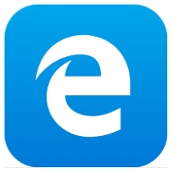
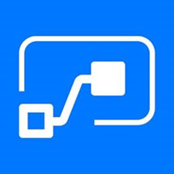
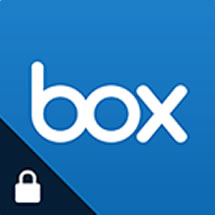

# Microsoft Intune protected apps  

The apps listed in this topic are supported partner and Microsoft apps that are commonly used with Microsoft Intune. Intune protected apps are enabled with a rich set of mobile application protection policies. These apps allow you to:

- Restrict copy-and-paste and save-as functions
- Configure web links to open inside the secure Microsoft browser
- Enable multi-identity use and app-level Conditional Access
- Apply data loss prevention policies without managing the user's device
- Enable app protection without requiring enrollment
- Enable app protection on devices managed with 3rd party EMM tools

> [!NOTE]
> For your client line-of-business apps, you can incorporate mobile app management using the [Intune App Software Development Kit](../developer/app-sdk.md) (SDK), or the [App Wrapping Tool for iOS](../developer/app-wrapper-prepare-ios.md) and the [App Wrapping Tool for Android](../developer/app-wrapper-prepare-android.md).

The following tables provide details of supported partner and Microsoft apps that are commonly used with Microsoft Intune.

## Microsoft apps

| App   title | App description and information | App store links for supported   platform(s) |
|-------------------------------------------------|-------------------------|---------------------------------------------|
| **Field Service Mobile**
 | Dynamics 365 for Field Service provides the cross-platform, multi-device Field Service Mobile application that is specifically crafted to the field service worker's needs. Robust offline capabilities allow field service workers to continue accessing and interacting with the data that they need when visiting remote destinations without internet connectivity. Field service workers can keep the back-office informed of work being performed in the field by periodically synchronizing data up to the server so that the proper actions can be taken or kick-started as appropriate. The mobile application is entirely customizable and extensible, allowing any organization to brand the application as its own, define what types of data field service workers can access, and much more. | [Google Play link (Android)](https://play.google.com/store/apps/details?id=com.microsoft.d365.fs.mobile), [App Store link (iOS)](https://apps.apple.com/us/app/field-service-mobile/id1414669075) |
| **Microsoft Azure Information Protection Viewer**
 | Securely collaborate with others using the AIP Viewer App. View protected files (rights protected email messages, PDF files, pictures, text files) that someone has shared with you. | [Google Play link (Android)](https://play.google.com/store/apps/details?id=com.microsoft.ipviewer), [App Store link (iOS)](https://itunes.apple.com/us/app/rms-sharing/id689516635?mt=8) |
| **Microsoft Bookings**
 | Microsoft Bookings is an appointment scheduling app that helps you keep track of your bookings, your staff, and your customers. You'll never miss an appointment, and you'll have fewer no-shows.
With the Bookings app you can: <ul><li>View and manage your calendar</li><li>Create bookings or make changes to existing ones on-the-go</li><li>See real time availability of your staff members</li><li>Respond to customers quickly and easily</li><li>Quickly get directions to where your next booking is</li><li>Manage your customer list</li></ul> | [Google Play link (Android)](https://play.google.com/store/apps/details?id=com.microsoft.exchange.bookings), [App Store link (iOS)](https://itunes.apple.com/us/app/microsoft-bookings/id1065657468?mt=8) |  
| **Microsoft Cortana**
 | Fast, easy and fun to stay on top of work & life with your personal assistant Cortana. Bring your smart digital assistant to your phone to help keep track of the important stuff wherever you are, across your devices. | [Google Play link (Android)](https://play.google.com/store/apps/details?id=com.microsoft.cortana), [App Store link (iOS)](https://apps.apple.com/us/app/cortana/id1054501703)
| **Microsoft Dynamics CRM**
 | Engage your customers while staying productive at work and on the go with Microsoft Dynamics CRM. Arrive prepared for every appointment and update notes, tasks, contacts, accounts, cases, and leads while the details are still fresh. Allows salespeople to manage their sales data, guided by contextual business process, while on the go. Gives agents and supervisors freedom of mobility with the full scope of case management. Get a seamless user experience in a 'configure once, deploy everywhere' model. Available for iOS/iPadOS and Android. | [Google Play link (Android)](https://play.google.com/store/apps/details?id=com.microsoft.crm.crmphone), [App Store link (iOS)](https://itunes.apple.com/app/microsoft-dynamics-crm/id678800460?mt=8) |  
| **Microsoft Edge**
 | Microsoft Edge creates one continuous browsing experience for Windows 10 users across their devices. Content and data sync seamlessly in the background, so users can browse across devices, without skipping a beat. Familiar Microsoft Edge features like the Hub allow users to organize the web in a way that cuts through the clutter, making it easier to find, view and manage their content on-the-go. Microsoft Edge is designed for Windows 10 users to browse the web how they need to, wherever they are, without disrupting their flow. | [Google Play link (Android)](https://play.google.com/store/apps/details?id=com.microsoft.emmx&hl=en_US), [App Store link (iOS)](https://itunes.apple.com/us/app/microsoft-edge/id1288723196?mt=8) |  
| **Microsoft Excel**
 | Make Excel spreadsheets look better than ever on your tablet and phone. Be confident that when you edit or create spreadsheets, they'll look exactly how you want across computers, Macs, tablets, and phones. Be up and running in no time with a familiar Office look and feel, along with an intuitive touch experience.

This app can be used as a multi-identity app for Android and iOS/iPadOS. | [Google Play link (Android)](https://play.google.com/store/apps/details?id=com.microsoft.office.excel), [App Store link (iOS)](https://itunes.apple.com/us/app/microsoft-excel/id586683407?mt=8) |  
| **Power Automate**
 | Carry the full power of Power Automate in your pocket. With Power Automate, you can create automated workflows between your favorite apps and services to streamline your business, save time, and work more efficiently.| [Google Play link (Android)](https://play.google.com/store/apps/details?id=com.microsoft.flow), [App Store link (iOS)](https://itunes.apple.com/us/app/microsoft-flow/id1094928825) |  
| **Microsoft Intune Managed Browser**
 | Provide a web browsing solution that's managed by your corporate IT administrator using Intune mobile application management policies.
**NOTE:** The Intune Manage Browser will be retired. Use Microsoft Edge for your protected Intune browser experience. |  |   
| **Microsoft Kaizala**
 | Microsoft Kaizala is a mobile app and service designed for large group communications and work management. Kaizala makes it easy to connect and coordinate work with your entire value chain, including field employees, vendors, partners, and customers wherever they are. | [Google Play link (Android)](https://play.google.com/store/apps/details?id=com.microsoft.mobile.polymer), [App Store link (iOS)](https://itunes.apple.com/in/app/microsoft-kaizala/id1112208399) |  
| **Microsoft Launcher**
 | Microsoft Launcher (formerly known as Arrow Launcher) can personalize your Android device to match your style with wallpapers, theme colors, icon packs, and more. With a Microsoft account or work/school account, you can access your calendar, documents, and recent activities in your personalized feed. You can even open photos, docs and webpages on your Windows PC, to be productive across all your devices. | [Google Play link (Android)](https://play.google.com/store/apps/details?id=com.microsoft.launcher) |  
| **Microsoft Office**
 | The Microsoft Office app combines the Word, Excel, and PowerPoint apps you know and rely on with new capabilities that create a simpler, yet more powerful Office experience on the go. | [Google Play link (Android)](https://play.google.com/store/apps/details?id=com.microsoft.office.officehubrow), [App Store link (iOS)](https://apps.apple.com/app/microsoft-office/id541164041) |  
| **Microsoft OneDrive**
 | Get online storage for your work files to share and collaborate on them with other people at your work or school. Plus, easily access your personal and work files when you're on the go.

This app can be used as a multi-identity app for Android and iOS/iPadOS. | [Google Play link (Android)](https://play.google.com/store/apps/details?id=com.microsoft.skydrive), [App Store link (iOS)](https://itunes.apple.com/us/app/onedrive-cloud-storage-for/id477537958?mt=8) |  
| **Microsoft OneNote**
 | Capture your thoughts, discoveries, and ideas with OneNote, your very own digital notebook. Seize that moment of inspiration, take your class notes, or track that list of errands that are too important to forget. Whether you're at home, in the office, or on the go, your notes are available to you on all your devices.

This app can be used as a multi-identity app for Android and iOS/iPadOS. | [Google Play link (Android)](https://play.google.com/store/apps/details?id=com.microsoft.office.onenote), [App Store link (iOS)](https://itunes.apple.com/us/app/microsoft-onenote-for-iphone/id410395246?mt=8) |  
| **Microsoft Outlook**
 | Get more done from anywhere with one unified view of your email, calendar, contacts, and attachments using this free email app. Automatically extract your most important messages—across all your email accounts. Easily view your calendar, share available times, schedule meetings, and attach files from email, OneDrive, or Dropbox with just a few taps.

This app can be used as a multi-identity app for Android and iOS/iPadOS.| [Google Play link (Android)](https://play.google.com/store/apps/details?id=com.microsoft.office.outlook), [App Store link (iOS)](https://itunes.apple.com/us/app/microsoft-outlook/id951937596?mt=8) |  
| **Microsoft Planner**
 | Take the chaos out of teamwork and get more done. Microsoft Planner makes it easy for your team to create new plans, organize and assign tasks, share files, chat about what you're working on, and get updates on progress. | [Google Play link (Android)](https://play.google.com/store/apps/details?id=com.microsoft.planner), [App Store link (iOS/iPadOS)](https://itunes.apple.com/us/app/microsoft-planner/id1219301037?mt=8) |  
| **Microsoft PowerApps**
 | PowerApps is a service that lets you build business apps that run in a browser or on a phone or tablet, and no coding experience is required.| [Google Play link (Android)](https://play.google.com/store/apps/details?id=com.microsoft.msapps), [App Store link (iOS/iPadOS)](https://itunes.apple.com/us/app/powerapps/id1047318566) |  
| **Microsoft Power BI**
 | Get live mobile access to your important business information with the Microsoft Power BI app. Easily view and interact with your dashboards and reports for all your business data. | [Google Play link (Android)](https://play.google.com/store/apps/details?id=com.microsoft.powerbim), [App Store link (iOS)](https://itunes.apple.com/us/app/microsoft-power-bi/id929738808?mt=8) |  
| **Microsoft PowerPoint**
 | Make PowerPoint presentations look great on your tablet and phone. Be confident that when you edit or create presentations, they'll look exactly how you want across computers, Macs, tablets, and phones. Be up and running in no time with a familiar Office look and feel, along with an intuitive touch experience.

This app can be used as a multi-identity app for Android and iOS/iPadOS. | [Google Play link (Android)](https://play.google.com/store/apps/details?id=com.microsoft.office.powerpoint), [App Store link (iOS)](https://itunes.apple.com/us/app/microsoft-powerpoint/id586449534?mt=8) |  
| **Microsoft SharePoint**
 | Bring your company intranet in your pocket with on-the-go-access from the SharePoint mobile app. Get quick access to your team sites, organization portals and resources, and the people you work with—both on-premises or online in Office 365. | [Google Play link (Android)](https://play.google.com/store/apps/details?id=com.microsoft.sharepoint), [App Store link (iOS)](https://itunes.apple.com/us/app/microsoft-sharepoint/id1091505266?ls=1&mt=8) |  
| **Microsoft To-Do**
 | Microsoft To-Do is a simple and intelligent to-do list that makes it easy to plan your day. Whether it's for work, school or home, To-Do will help you to increase your productivity and decrease your stress levels. It combines intelligent technology and beautiful design to empower you to create a simple daily workflow. | [Google Play link (Android)](https://play.google.com/store/apps/details?id=com.microsoft.todos), [App Store link (iOS)](https://itunes.apple.com/us/app/microsoft-to-do/id1212616790) |  
| **Microsoft Skype for Business**
 | Get a single easy-to-use interface for any mobile device to access your favorite Skype features: voice and video over wireless, rich presence, instant messaging, conferencing, and calling. Available for iOS/iPadOS and Android.| [Google Play link (Android)](https://play.google.com/store/apps/details?id=com.microsoft.office.lync15), [App Store link (iOS)](https://itunes.apple.com/app/skype-for-business-formerly/id605841731?mt=8) |  
| **Microsoft StaffHub**
 | Microsoft StaffHub is a cloud-based platform that slips work (and the tools to manage it) into everyone's back pocket. With Microsoft StaffHub, Firstline Workers can view schedules, swap shifts, and request time off. Managers can create schedules, approve requests, and share information. On mobile or web, it's the one-stop app for scheduling, sharing, and communicating. Microsoft StaffHub gives everyone the freedom to manage work. | [Google Play link (Android)](https://play.google.com/store/apps/details?id=ols.microsoft.com.shiftr), [App Store link (iOS)](https://itunes.apple.com/us/app/microsoft-staffhub/id1122181468?mt=8) |  
| **Microsoft Stream**
 | Microsoft Stream is your central destination for enterprise video content with built-in intelligence features, deep integration across Office 365, and IT management and security capabilities that businesses of all sizes require.
With the Microsoft Stream mobile app you can:<ul><li>Find and engage with videos you need fast with smart search tools</li><li>Watch videos at your own convenience by saving content for offline viewing</li><li>Enjoy the best experience for consuming Stream videos by deep-linking into the app</li><li>Get the enterprise-level security and compliance features you expect from Office 365</li></ul>
This app requires an appropriate commercial Office 365 subscription. If you are not sure about your organization's subscription or the services you have access to, please contact your IT department. To learn more about managing Microsoft Stream with Intune, visit [aka.ms/streamintune](https://aka.ms/streamintune).
By downloading this app, you agree to the license terms (see [aka.ms/eulastreamios](https://aka.ms/eulastreamios)) and privacy terms (see [aka.ms/privacy](https://aka.ms/privacy)).
To learn more, please visit [aka.ms/microsoftstreamdocs](https://aka.ms/microsoftstreamdocs). For support or feedback, email us at streamiosstore@microsoft.com. | [Google Play link (Android)](https://play.google.com/store/apps/details?id=com.microsoft.stream), [App Store link (iOS)](https://itunes.apple.com/us/app/microsoft-stream/id1401013624?mt=8) |  
| **Microsoft Teams**
 | Microsoft Teams is your chat-centered workspace in Office 365. Instantly access all your team's content from a single place where messages, files, people and tools live together. Take it with you on your favorite mobile device.| [Google Play link (Android)](https://play.google.com/store/apps/details?id=com.microsoft.teams), [App Store link (iOS)](https://itunes.apple.com/us/app/microsoft-teams/id1113153706?mt=8) |  
| **Microsoft Visio Viewer**
 | You can view and interact with Visio diagrams on iPhone on the go for free. Sign in with your Microsoft Account or open a Visio attachment from email, and enjoy the amazing view of Visio diagrams on any iPhone running iOS 9.0 or later. You can also share the diagrams with anyone who can then view Visio diagrams on their iPhone or in a web browser even they don't have Visio installed on their Windows desktop.| [App Store link (iOS)](https://itunes.apple.com/us/app/microsoft-visio-viewer-flowcharts-and-diagrams/id1139787983?mt=8) | 
| **Microsoft Whiteboard**
 | Microsoft Whiteboard app provides a freeform intelligent canvas where teams can ideate, create, and collaborate visually via the cloud. It enhances teamwork by allowing all team members to edit and comment directly on the canvas in real time, no matter where they are. And all your work stays safe in the cloud, ready to be picked back up from any device. | [App Store link (iOS)](https://apps.apple.com/app/microsoft-whiteboard/id1352499399) |   
| **Microsoft Word**
 | Make Word documents look better than ever on your tablet and phone. Be confident that when you edit or create documents, they'll look exactly how you want across computers, Macs, tablets, and phones. Be up and running in no time with a familiar Office look and feel, along with an intuitive touch experience.

This app can be used as a multi-identity app for Android and iOS/iPadOS. | [Google Play link (Android)](https://play.google.com/store/apps/details?id=com.microsoft.office.word), [App Store link (iOS)](https://itunes.apple.com/us/app/microsoft-word/id586447913?mt=8) |  
| **Microsoft Work Folders**
 | Allow individual employees to securely access their files from both inside and outside the corporate environment using Work Folders, a Windows Server feature. | [App Store link (iOS)](https://itunes.apple.com/us/app/work-folders/id950878067?mt=8) | 
| **Yammer**
 | Break down organizational silos and facilitate team collaboration with Yammer. Connect to the right people in your organization, share and search for information across teams, and organize around projects and ideas so you can do more. | [Google Play link (Android)](https://play.google.com/store/apps/details?id=com.yammer.v1), [App Store link (iOS)](https://itunes.apple.com/us/app/yammer/id289559439?mt=8) |  

## Partner apps 

| App   title | App description | App store links for supported   platform(s) | 
|-------------------------------------------------|-------------------------|---------------------------------------------|
| **Acronis Access**
 | Safely access your business files from anywhere and any device with Acronis Access. Easily share documents with colleagues, customers, and vendors while keeping files and data secure and private, where only you and your organization can touch them. The app is designed for extreme ease of use with unparalleled security, privacy, and management capabilities. | [App Store link (iOS)](https://itunes.apple.com/us/app/acronis-access/id429704844?mt=8) |                       
| **Adobe Acrobat Reader**
 | Open, view, and work with PDFs in a Microsoft Intune managed environment with Adobe Acrobat Reader. Available for iOS/iPadOS and Android. | [Google Play link (Android)](https://play.google.com/store/apps/details?id=com.adobe.reader), [App Store link (iOS)](https://apps.apple.com/app/adobe-acrobat-reader-for-pdf/id469337564) |                      
| **Blackberry Enterprise BRIDGE**
 | BlackBerry Enterprise BRIDGE allows you to securely view, edit, and save documents using Intune-managed Microsoft apps, such as Microsoft Word, Microsoft PowerPoint, and Microsoft Excel from BlackBerry Dynamics. You can share your documents as email attachments and maintain data encryption during the document-sharing process between BlackBerry Dynamics and Intune-managed mobile apps. | [Google Play link (Android)](https://play.google.com/store/apps/details?id=com.blackberry.intune.bridge), [App Store link (iOS)](https://itunes.apple.com/us/app/blackberry-enterprise-bridge/id1305494864?mt=8) |
| **Board Papers**
 | Board Papers is a board portal solution that combines an iPad application with Microsoft SharePoint® integration. | [App Store link (iOS)](https://apps.apple.com/app/board-papers/id458518678) |
| **Breezy for Intune**
 | Breezy For Intune provides secure print capabilities for your iOS device. Our integration with Intune ensures that your data stays secure while on-device, and own our end-to-end encryption and enterprise grade security ensure that it stays that way on its way to the printer. | [App Store link (iOS)](https://apps.apple.com/us/app/breezy-for-intune/id1447680750?mt=8) |
| **Box for EMM**
 | Keep your employees connected and collaborative while you centrally manage security, policy, and provisioning across any mobile device using Box for EMM. | [App Store link (iOS)](https://itunes.apple.com/us/app/box-for-emm/id882085676?mt=8) |
| **CellTrust SL2&trade; for Microsoft Intune**
 | CellTrust SL2&trade; for Microsoft Intune is an enterprise-level application that works by assigning a secure Mobile Business Number (MBN) on bring-your-own devices to keep personal and business communications separate on a single device. The seamless solutions secures SMS messages and business calls on the device without using the personal number. This capability is vital for enterprises that require greater security for business communications, as well as archiving for eDiscovery and compliance needs.    Microsoft Intune is a cloud-based service in the enterprise mobility management (EMM) space that helps enable your workforce to be productive while keeping your corporate data protected.    CellTrust SL2&trade; for Microsoft Intune delivers a powerful enterprise mobility platform, allowing employees to work on the go—with easy access to secure business applications, and voice and text messaging. The app was developed with Microsoft Intune SDKs and customized features to allow organizations to tailor it based on their industry and IT needs. | [Google Play link (Android)](https://play.google.com/store/apps/details?id=com.celltrust.sl2_intune), [App Store link (iOS)](https://itunes.apple.com/us/app/celltrust-sl2-for-intune/id1442087513?mt=8) |
| **Citrix Secure Mail**
 | Citrix Secure Mail is a containerized email, calendar, and contacts app with a rich user experience. | [Google Play link (Android)](https://play.google.com/store/apps/details?id=com.citrix.mail.droid), [App Store link (iOS)](https://itunes.apple.com/us/app/citrix-secure-mail/id1155203964?mt=8) |               
| **Citrix ShareFile for Intune**
| Protect corporate data while accessing and sharing files from ShareFile. It directly integrates with Microsoft Word, Excel, and PowerPoint, to allow access to files from ShareFile without ever leaving your office application.| [Google Play link (Android)](https://play.google.com/store/apps/details?id=com.citrix.sharefile.intune), [App Store link (iOS)](https://itunes.apple.com/us/app/citrix-sharefile-for-intune/id1056495502?mt=8) | 
| **Egress Secure Mail for Intune**
 | Send and receive encrypted   emails and files from your mobile device. Egress Secure Email provides   user-friendly tools to secure sensitive data, with end-to-end encryption,   access revocation and message restrictions to empower users to stay in   control of the information they share.
The Egress Secure Email app   requires you to be a licensed user of the Egress platform, with a valid   subscription and appropriate infrastructure. | [Google Play link (Android)](https://play.google.com/store/apps/details?id=com.egress.switchdroid.intune) | 
| **Hearsay Relate for Intune**
 | Hearsay Relate for Intune enables advisors to manage and nurture their book of business in a protected BYOD environment with mobile application management (MAM). This version of Hearsay Relate allows IT administrators to protect corporate data while keeping advisors in touch with their book of business.   Hearsay Relate, a mobile application that enables financial services professionals to move business forward. Leverage compliant texting and seamless voice calling to connect with your entire book of business. Stay productive with calendar integration to set appointments, and schedule reminder messages for upcoming meetings, birthday greetings, and more. Hearsay Relate for Intune gives enterprise users all the features they expect from Hearsay Relate, while providing IT administrators the MAM functionality they need to keep corporate data safe. In the event of a lost or stolen device, IT can remove Hearsay Relate for Intune from the device along with any sensitive data associated with it. | [Google Play link (Android)]( https://play.google.com/store/apps/details?id=com.hearsaysocial.messages.intune), [App Store link (iOS)](https://apps.apple.com/app/hearsay-relate-for-intune/id1501771956) | 
| **iBabs for Intune**
| ISEC7 Mobile Exchange Delegate allows authorized representatives via iPhone and iPad to agree to appointments for their colleagues, to manage their contacts, and to answer emails on behalf of other users. | [App Store link (iOS)](https://itunes.apple.com/us/app/ibabs-for-intune/id1130847428?mt=8) |
| **ISEC7 MED for Intune**
| Make your meetings simpler, more substantive, and more environmentally friendly. | [App Store link (iOS)](https://apps.apple.com/app/isec7-med-for-intune/id1491037389?ls=1) |
| **Lexmark Mobile Print Intune**
| Mobile computing has become pervasive—it's simply a state of always on, barrier-free connectedness that entertains, enlightens and helps you get more work done.   While business users expect desktop and mobile printing to be equally convenient, IT managers know how complicated it can be to provide seamless output due to mobile's unique characteristics. With connectivity, security and network challenges to solve across multiple operating systems, providing your users with the flexible printing they expect can be complex.   Lexmark offers the experience and innovation to help you meet the printing needs of your users in a way that's easy and hassle-free for IT. By addressing your challenges with a comprehensive set of tools and options, we can help you achieve a mobile printing experience that is more transparent, simple and secure.  | [App Store link (iOS)](https://itunes.apple.com/us/app/lexmark-mobile-print-intune/id1368424840?ls=1&mt=8) |
| **Meetio Enterprise**
| Meetio's mobile app for organizations using Meetio room management solutions. Meetio Enterprise simplifies your workday by allowing you to schedule meetings and meeting rooms - all at once, while you're on the go. | [Google Play link (Android)](https://play.google.com/store/apps/details?id=com.getmeetio.personal), [App Store link (iOS)](https://apps.apple.com/se/app/meetio-enterprise/id1340190306) |
| **Nine Work for Intune**
 | Nine is a full-fledged email application for Android based on Direct Push technology to synchronize with Microsoft Exchange Server using Microsoft Exchange ActiveSync, and also designed for entrepreneurs or ordinary people who want to have efficient communication with their colleagues, friends, and family members at anytime, anywhere. | [Google Play link (Android)](https://play.google.com/store/apps/details?id=com.ninefolders.hd3.work.intune), [App Store link (iOS)](https://apps.apple.com/us/app/nine-mail-email-calendar/id1079689905) |  
| **Now&#174; Mobile - Intune**
 | Now employees can find answers and get work done across IT, HR, Facilities, Finance, Legal and other departments, all from a modern mobile app powered by the Now Platform&#174;.
The Now Platform&#174; delivers employee experiences and productivity through digital workflows across departments, systems and people.
Examples of things you can do in the app:<ul><li>IT: Request a laptop or a reset password</li><li>Facilities: Find and book a conference room</li><li>Finance: Request a corporate credit card</li><li>Legal: Have a new vendor sign an NDA</li><li>HR: Find the next company holiday and check the vacation policy</li></ul>
Now&#174; Mobile powered by the Now Platform&#174; - finally work life can be as great as real life | [Google Play link (Android)](https://play.google.com/store/apps/details?id=com.servicenow.requestor.mam.intune), [App Store link (iOS)](https://apps.apple.com/us/app/now-mobile-intune/id1494183300) | 
| **PrinterOn for Microsoft**
 | PrinterOn's wireless mobile printing solutions enable users to remotely print from anywhere at any time over a secure network.| [Google Play link (Android)](https://play.google.com/store/apps/details?id=com.printeron.droid.phone), [App Store link (iOS)](https://itunes.apple.com/us/app/printeron-for-microsoft/id1258715414?mt=8) | 
| **Qlik Sense Mobile**
 | Qlik Sense is a market leading, next generation application for self-service oriented analytics. Qlik's patented associative technology allows people to easily combine data from many different sources and explore it freely, without the limitations of query-based tools. | [Google Play link (Android)](https://play.google.com/store/apps/details?id=com.qlik.qliksense.mobile), [App Store link (iOS)](https://apps.apple.com/us/app/qlik-sense-mobile/id1217049362) | 
| **SAP Fiori**
 | Increase your daily productivity by tackling your most common business tasks anywhere and anytime with the SAP Fiori Client mobile app for iPhone and iPad. Deliver a next-level mobile experience with enhanced attachment handling and full-screen operations using this enhanced mobile runtime for the Web version of over 750 SAP Fiori app. Plus, access custom SAP Fiori mobile apps—built by customers using SAP Fiori mobile service—that are ready to support Intune mobile app management. | [App Store link (iOS)](https://itunes.apple.com/us/app/sap-fiori-client/id824997258?mt=8) |  
| **ServiceNow&#174; Agent - Intune**
 | ServiceNow Mobile Agent app delivers out-of-the-box, mobile-first experiences for the most common service desk agent workflows, making it easy for agents to triage, act on and resolve requests on the go. The app enables service desk agents to promptly manage and resolve end user issues from their mobile devices. Agents use the app’s intuitive interface to accept and update work even without Internet connectivity. The app greatly simplifies work by leveraging native device capabilities for tasks like navigation, barcode scanning, or collecting a signature.  The app comes with out-of-the-box workflows for service desk agents in IT, Customer Service, HR, Field Services, Security Ops and IT Asset Management. Organizations can easily configure and extend the workflows to meet their own unique needs.
With Mobile Agent you can:<ul><li>Manage the work assigned to your teams.</li><li>Triage incidents and cases.</li><li>Act on approvals with swipe gestures and quick actions.</li><li>Complete work while offline.</li><li>Access the full issue details, activity stream, and related lists of records.</li><li>Optimize workflows with location, camera, and touchscreen hardware</li></ul> | [Google Play link (Android)](https://play.google.com/store/apps/details?id=com.servicenow.fulfiller.mam.intune), [App Store link (iOS)](https://apps.apple.com/us/app/servicenow-agent-intune/id1494183149) |  
| **ServiceNow&#174; Onboarding - Intune**
 | ServiceNow&#174; Mobile Onboarding empowers new hires to complete tasks, view content, and get help across departments—including IT, HR, Facilities, Finance, and Legal—all from a single native mobile app.  Streamline the onboarding experience by allowing new hires to:<ul><li>Order a laptop and phone from IT.</li><li>Setup a workspace with Facilities.</li><li>Sign an NDA from Legal.</li><li>Submit a photo and update their profile with HR.</li><li>Review an expense policy from Finance and get help if they have questions.</li></ul>Powered by the Now Platform&#174;, Mobile Onboarding manages workflows across multiple departments and systems, hiding the complexity of backend processes. New hires don't even have to know which departments are involved in any given process. They receive a simple and easy onboarding experience and can complete tasks before they even start, ensuring they are day-one ready. | [Google Play link (Android)](https://play.google.com/store/apps/details?id=com.servicenow.onboarding.mam.intune), [App Store link (iOS)](https://apps.apple.com/app/servicenow-onboarding-intune/id1494184220) |  
| **Smartcrypt for Intune**
 | Smartcrypt for Intune is specifically designed for existing PKWARE customers operating in an Intune environment. Smartcrypt lets you get your work done on the go. It's fast, secure and simple to use so you can be productive from anywhere. If you are unsure if you have Smartcrypt please contact your company's IT administrator. With Smartcrypt, you can: Encrypt and decrypt files using Smartkeys, Decrypt archives with X.509 Digital Certificates, Create and manage Smartkeys, Perform digital signing and authentication of data with X.509 Digital Certificates, Encrypt and decrypt files with Strong Passphrase encryption, including AE2, Login with existing Active Directory credentials, Create and view unencrypted zip archives. Smartcrypt armors data at its core, eliminating vulnerabilities everywhere data is used, shared or stored. For nearly three decades, PKWARE has provided encryption and compression software to more than 30,000 enterprise customers and over 200 government agencies. Available for iOS/iPadOS and Android. | [App Store link (iOS)](https://apps.apple.com/app/smartcrypt-for-intune/id1489232256) |  
| **Speaking Email**
   | Get more time in your day by having your email read to you on the move. Voice commands and simple gestures designed to be safe to use while driving give you the ability to archive, flag or even reply on the move.
Smart content detection skips over disclaimers, reply headers, and email signatures to speak only the content without the clutter.
Employees can sign in via Intune to access Office 365 Exchange email. | [App Store link (iOS)](https://itunes.apple.com/app/apple-store/id991406423?ct=intune) | 
| **Synergi Life**
 | Synergi Life Mobile App, an extension of Synergi Life, lets users easily create observations and incident reports anytime and from anywhere, using their phones to take a snapshot and make a voice recording.
Synergi Life (previously named Synergi) is a complete business solution for risk and QHSE management, managing all non-conformances, incidents, risk, risk analyses, audits, assessments and improvement suggestions.
The Synergi Life Mobile App requires you to be a licensed user of the Synergi Life risk and QHSE management system, and have the necessary back-end licensed software and services. | [Google Play link (Android)](https://play.google.com/store/apps/details?id=com.dnv.mobilesolutions.synergimobile.uibase), [App Store link (iOS)](https://itunes.apple.com/us/app/synergi-life/id641181737)  |  
| **Tact for Intune**
 | Tact for Intune is the first CRM and Sales Assistant that unifies data from Salesforce.com, email, calendar, maps and other everyday tools into a conversational, human-friendly experience. Powered by AI, Tact automates the administrative work for the salesperson, unifies CRM with other data sources to deliver a single pane of glass, and pushes intelligence to each seller in order to nudge them into high performance behavior. Enterprises can now gain increased seller productivity, richer customer data and better CRM adoption while ensuring enterprise-grade security at the application layer with Tact for Intune. | [Google Play link (Android)](https://play.google.com/store/apps/details?id=com.tactile.tact), [App Store link (iOS)](https://apps.apple.com/us/app/tact-for-intune/id1477117416?mt=8)  |  
| **Vera for Intune**
 | Encrypt, track, and revoke access to files and email attachments directly from your mobile device with Vera for Intune. Protect your most valuable information, no matter what apps you use: Microsoft, Box, Google, Dropbox, and more. | [App Store link (iOS)](https://itunes.apple.com/us/app/vera-for-intune/id1235182010?mt=8) |  
| **Workspace ONE Send**
 | Workspace ONE Send provides seamless editing and sending capabilities for customers using Microsoft Intune to manage Office 365 apps using VMware productivity apps. | [Google Play link (Android)](https://play.google.com/store/apps/details?id=com.airwatch.vmsend), [App Store link (iOS)](https://itunes.apple.com/us/app/vmware-workspace-one-send/id1336333505?mt=8) |
| **Zero - email for attorneys**
 | ZERØ’s email client has been engineered to help lawyers work less and bill more. With ZERØ, lawyers can:<ul><li>Predictively file messages to their document management system or to their corresponding email folders.</li><li>Sort their inboxes by parameters such as importance and sender.</li><li>Receive a warning in real-time if they are about to send a message to a potential wrong recipient.</li><li>Automatically and contemporaneously capture the time spent interacting with client messages from their mobile devices.</li></ul> | [App Store link (iOS)](https://apps.apple.com/app/zero-email-for-attorneys/id1216474378) |  
| **Zoom for Intune**
 | Zoom is your communications hub for meetings, webinars, chat and cloud phone. Start or join meetings with flawless video, crystal clear audio and instant screen sharing from desktop, mobile or conference rooms. | [Google Play link (Android)](https://play.google.com/store/apps/details?id=us.zoom.videomeetings4intune), [App Store link (iOS)](https://apps.apple.com/us/app/zoom-for-intune/id1462818858?mt=8) |  

## Next steps

To learn how to add apps for each platform to Intune, see:

- [Android store apps](store-apps-android.md)
- [Android LOB apps](lob-apps-android.md)
- [iOS store apps](store-apps-ios.md)
- [iOS LOB apps](lob-apps-ios.md)
- [Web apps (for all platforms)](web-app.md)
- [Windows Phone 8.1 store apps](store-apps-windows-phone-8-1.md)
- [Windows Phone LOB apps](lob-apps-windows-phone.md)
- [Microsoft store apps](store-apps-windows.md)
- [Windows LOB app](lob-apps-windows.md)
- [Office 365 apps for Windows 10](apps-add-office365.md)
- [Office 365 apps for macOS](apps-add-office365-macos.md)
- [Built-in apps](apps-add-built-in.md)
- [Win32 apps](app-management.md)
