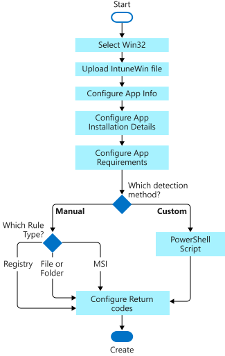
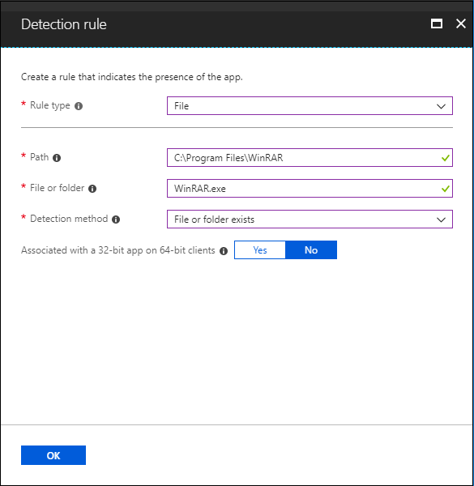
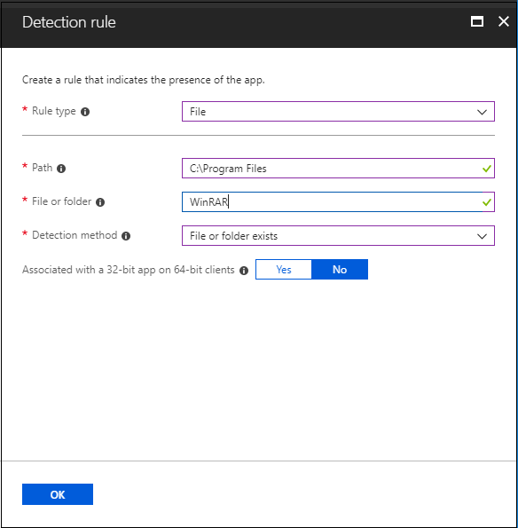
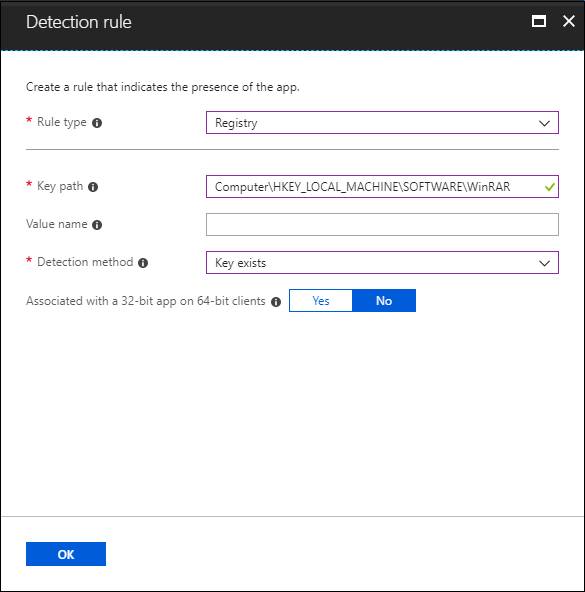
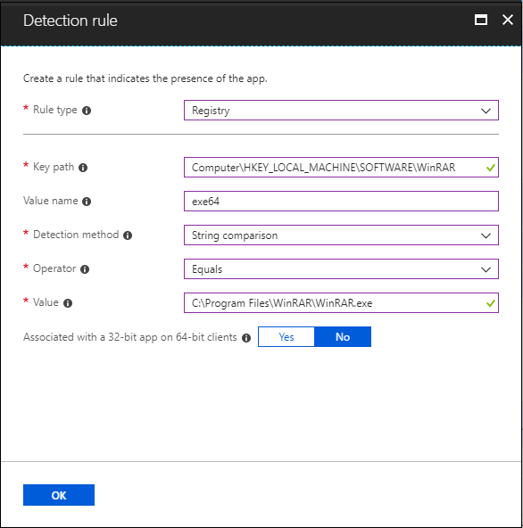

# Add, assign, and monitor a Win32 app in Microsoft Intune

After you've [prepared a Win32 app to be uploaded to Intune](apps-win32-prepare.md) by using the [Microsoft Win32 Content Prep Tool](https://go.microsoft.com/fwlink/?linkid=2065730), you can add the app to Intune. To learn more about preparing a Win32 app to be uploaded, see [Prepare Win32 app content for upload](apps-win32-prepare.md).

> [!NOTE]
> For information about Enterprise App Catalog apps, see [Add an Enterprise App Catalog app (Win32) to Microsoft Intune](../apps/apps-add-enterprise-app.md). 

## Prerequisites

To use Win32 app management, be sure you meet the following criteria:

- Use Windows 10 version 1607 or later (Enterprise, Pro, and Education versions).
- Devices must be joined or registered to Microsoft Entra ID and be auto-enrolled. The Intune management extension supports devices that are Microsoft Entra joined, Microsoft Entra registered, hybrid domain joined, or group policy enrolled. 
  > [!NOTE]
  > For the scenario of group policy enrollment, the user uses the local user account to Microsoft Entra join their Windows 10 device. The user must log on to the device by using their Microsoft Entra user account and enroll in Intune. Intune will install the Intune Management extension on the device if a PowerShell script or a Win32 app is targeted to the user or device.
- Windows application size is capped at 30 GB per app.

Much like a standard line-of-business (LOB) app, you can add a Win32 app to Microsoft Intune. This type of app is typically written in-house or by a third party. 

## Process flow to add a Win32 app to Intune

## Add a Win32 app to Intune

The following steps help you add a Windows app to Intune:

1. Sign in to the [Microsoft Intune admin center](https://go.microsoft.com/fwlink/?linkid=2109431).
2. Select **Apps** > **All apps** > **Add**.
3. On the **Select app type** pane, under the **Other** app types, select **Windows app (Win32)**.

    > [!IMPORTANT]
    > Be sure to use the latest version of the Microsoft Win32 Content Prep Tool. If you don't use the latest version, you'll see a warning that says the app was packaged using an older version of the tool. 

4. Click **Select**. The **Add app** steps appear.

## Step 1: App information

### Select the app package file

1. On the **Add app** pane, click **Select app package file**. 
2. On the **App package file** pane, select the browse button. Then, select a Windows installation file with the extension *.intunewin*.
   The app details appear.
3. When you're finished, select **OK** on the **App package file** pane.

### Set app information

On the **App information** page, add the details for your app. Depending on the app that you chose, some of the values on this page might be automatically filled in.

- **Name**: Enter the name of the app as it appears in the company portal. Make sure all app names that you use are unique. If the same app name exists twice, only one of the apps appears in the company portal.
- **Description**: Enter the description of the app. The description appears in the company portal.
- **Publisher**: Enter the name of the publisher of the app.
- **Category**: Select one or more of the built-in app categories, or select a category that you created. Categories make it easier for users to find the app when they browse through the company portal.
- **Show this as a featured app in the Company Portal**: Display the app prominently on the main page of the company portal when users browse for apps.
- **Information URL**: Optionally, enter the URL of a website that contains information about this app. The URL appears in the company portal.
- **Privacy URL**: Optionally, enter the URL of a website that contains privacy information for this app. The URL appears in the company portal.
- **Developer**: Optionally, enter the name of the app developer.
- **Owner**: Optionally, enter a name for the owner of this app. An example is **HR department**.
- **Notes**: Enter any notes that you want to associate with this app.
- **Logo**: Upload an icon that's associated with the app. This icon is displayed with the app when users browse through the company portal.

Select **Next** to display the **Program** page.

## Step 2: Program

On the **Program** page, configure the app installation and removal commands for the app:

- **Install command**: Add the complete installation command line to install the app. 

    For example, if your app's file name is **MyApp123**, add the following:

    `msiexec /p "MyApp123.msp"`
    
    If the application is `ApplicationName.exe`, the command would be the application name followed by the command arguments (switches) that the package supports. For example:

    `ApplicationName.exe /quiet`
    
    In the preceding command, the `ApplicationName.exe` package supports the `/quiet` command argument. 
    
    For the specific arguments that the application package supports, contact your application vendor.

    > [!IMPORTANT]
    > Admins must be careful when they use the command tools. Unexpected or harmful commands might be passed via the **Install command** and **Uninstall command** fields.
    >
    > Calling `powershell.exe` in either of these fields will result in a 32-bit Powershell instance being launched. To force 64-bit Powershell execution, use the following command:
    >
    > `%SystemRoot%\Sysnative\WindowsPowerShell\v1.0\powershell.exe`

- **Uninstall command**: Add the complete command line to uninstall the app based on the app's GUID. 

    For example:
    
    `msiexec /x "{12345A67-89B0-1234-5678-000001000000}"`

    > [!NOTE]
    > Environment variable expansion within the **Uninstall command** is not supported. If you require the use of environment variables, use a custom wrapper script within your Win32 package to wrap the appropriate command and use this script for the **Uninstall command**.

- **Installation time required**: The number of minutes the system will wait for install program to finish. Default value is 60 minutes. If the app takes longer to install than the set installation time, the system will fail the app install. Max timeout value is 1440 minutes (1 day).

- **Allow available uninstall**: Select **Yes** to provide the uninstall option for this app for users from the Company Portal. Select **No** to prevent users from uninstalling the app from the Company Portal.

- **Install behavior**: Set the install behavior to either **System** or **User**.

    > [!NOTE]
    > You can configure a Win32 app to be installed in **User** or **System** context. **User** context refers to only a particular user. **System** context refers to all users of a Windows 10 device.
    > 
    > When a device is enrolled by being Microsoft Entra registered, select **System**.
    >
    > Users are not required to be logged in on the device to install Win32 apps.
    > 
    > The Win32 app installation and uninstallation will happen under admin privilege (by default) when the app is set to install in user context and the user on the device has admin privileges.
    
- **Device restart behavior**: Select one of the following options:
    - **Determine behavior based on return codes**: Choose this option to restart the device based on the return codes. This option means that the device will restart based on the configured return code. With this configuration, a hard reboot return code will immediately trigger a restart of the device and a soft reboot return code will notify the user that a restart is required to finish the installation.
    - **No specific action**: Choose this option to suppress device restarts during the app installation of MSI-based apps.
    - **App install may force a device restart**: Choose this option to allow the app installation to finish without suppressing restarts. This option means that the Win32 app installation is allowed to complete without suppressing restarts. With this configuration, a hard reboot return code will notify the user that a restart of the device will be triggered in 120 minutes and a soft reboot return code will only notify the user that a restart is required to finish the installation.
    - **Intune will force a mandatory device restart**: Choose this option to always restart the device after a successful app installation.

- **Specify return codes to indicate post-installation behavior**: Add the return codes that are used to specify either app installation retry behavior or post-installation behavior. Return code entries are added by default during app creation. However, you can add more return codes or change existing return codes.
    1. In the **Code type** column, set the **Code type** to one of the following:
        - **Failed**: The return value that indicates an app installation failure.
        - **Hard reboot**: The hard reboot return code doesn't allow the next Win32 app to be installed on the client without reboot. 
        - **Soft reboot**: The soft reboot return code allows the next Win32 app to be installed without requiring a client reboot. Reboot is necessary to complete installation of the current application.
        - **Retry**: The retry return code agent will attempt to install the app three times. It will wait for five minutes between each attempt. 
        - **Success**: The return value that indicates the app was successfully installed.
    2. If needed, select **Add** to add more return codes, or modify existing return codes.

Select **Next** to display the **Requirements** page.    

## Step 3: Requirements

On the **Requirements** page, specify the requirements that devices must meet before the app is installed:

- **Operating system architecture**: Choose the architectures needed to install the app.
- **Minimum operating system**: Select the minimum operating system needed to install the app.
- **Disk space required (MB)**: Optionally, add the free disk space needed on the system drive to install the app.
- **Physical memory required (MB)**: Optionally, add the physical memory (RAM) required to install the app.
- **Minimum number of logical processors required**: Optionally, add the minimum number of logical processors required to install the app.
- **Minimum CPU speed required (MHz)**: Optionally, add the minimum CPU speed required to install the app.
- **Configure additional requirement rules**:
    1. Select **Add** to display the **Add a Requirement rule** pane and configure more requirement rules. Select the **Requirement type** value to choose the type of rule that you'll use to determine how a requirement is validated. Requirement rules can be based on file system information, registry values, or PowerShell scripts.
        - **File**: When you choose **File** as the **Requirement type** value, the requirement rule must detect a file or folder, date, version, or size. 
            - **Path**: The full path of the folder that contains the file or folder to detect.
            - **File or folder**: The file or folder to detect.
            - **Property**: Select the type of rule used to validate the presence of the app.
            - **Associated with a 32-bit app on 64-bit clients**: Select **Yes** to expand any path environment variables in the 32-bit context on 64-bit clients. Select **No** (default) to expand any path variables in the 64-bit context on 64-bit clients. 32-bit clients will always use the 32-bit context.
        - **Registry**: When you choose **Registry** as the **Requirement type** value, the requirement rule must detect a registry setting based on value, string, integer, or version.
            - **Key path**: The full path of the registry entry that contains the value to detect.
            - **Value name**: The name of the registry value to detect. If this value is empty, the detection will happen on the key. The (default) value of a key will be used as detection value if the detection method is other than file or folder existence.
            - **Registry key requirement**: Select the type of registry key comparison that's used to determine how the requirement rule is validated.
            - **Associated with a 32-bit app on 64-bit clients**: Select **Yes** to search the 32-bit registry on 64-bit clients. Select **No** (default) to search the 64-bit registry on 64-bit clients. 32-bit clients will always search the 32-bit registry.
        - **Script**: Choose **Script** as the **Requirement type** value when you can't create a requirement rule based on file, registry, or any other method available to you in the Microsoft Intune admin center.
            - **Script file**: For a rule based on a PowerShell script requirement, if the existing code is 0, we'll detect the standard output (STDOUT) in more detail. For example, we can detect STDOUT as an integer that has a value of 1.
            - **Run script as 32-bit process on 64-bit clients**: Select **Yes** to run the script in a 32-bit process on 64-bit clients. Select **No** (default) to run the script in a 64-bit process on 64-bit clients. 32-bit clients run the script in a 32-bit process.
            - **Run this script using the logged on credentials**: Select **Yes** to run the script by using the signed-in device credentials.
            - **Enforce script signature check**: Select **Yes** to verify that a trusted publisher has signed the script, which will allow the script to run with no warnings or prompts displayed. The script will run unblocked. Select **No** (default) to run the script with user confirmation without signature verification.
            - **Select output data type**: Select the data type used for determining a requirement rule match.
    2. When you're finished setting the requirement rules, select **OK**.

Select **Next** to display the **Detection rules** page.

## Step 4: Detection rules

On the **Detection rules** pane, configure the rules to detect the presence of the app. You can choose to add multiple rules:

- **Rules format**: Select how the presence of the app will be detected. You can choose to either manually configure the detection rules or use a custom script to detect the presence of the app. You must choose at least one detection rule.

  > [!NOTE]
  > The conditions for *all* rules must be met to detect the app.
  >
  > If Intune detects that the app isn't present on the device, Intune will offer the app again within approximately 24 hours. This will occur only for apps targeted with the required intent.

- **Manually configure detection rules**: You can select one of the following rule types:
    - **MSI**: Verify based on an MSI version check. This option can be added only once. When you choose this rule type, you have two settings:
        - **MSI product code**: Add a valid MSI product code for the app.
        - **MSI product version check**: Select **Yes** to verify the MSI product version in addition to the MSI product code.
    - **File**: Verify based on file or folder detection, date, version, or size.
        - **Path**: Enter the full path of the folder that contains the file or folder to detect. This shouldn't include special characters such as **,** or **"**.
        - **File or folder**: Enter the file or folder to detect.
        - **Detection method**: Select the type of detection method used to validate the presence of the app.
        - **Associated with a 32-bit app on 64-bit clients**: Select **Yes** to expand any path environment variables in the 32-bit context on 64-bit clients. Select **No** (default) to expand any path variables in the 64-bit context on 64-bit clients. 32-bit clients will always use the 32-bit context.
            
        **Examples of file-based detection**

        Check for file existence.
         
        
        
        Check for folder existence.
        
        
        
    - **Registry**: Verify based on value, string, integer, or version.
        - **Key path**: The full path of the registry entry that contains the value to detect. A valid syntax is HKEY_LOCAL_MACHINE\Software\WinRAR or HKLM\Software\WinRAR.
        - **Value name**: The name of the registry value to detect. If this value is empty, the detection will happen on the key. The (default) value of a key will be used as detection value if the detection method is other than file or folder existence.
        - **Detection method**: Select the type of detection method that's used to validate the presence of the app.
        - **Associated with a 32-bit app on 64-bit clients**: Select **Yes** to search the 32-bit registry on 64-bit clients. Select **No** (default) to search the 64-bit registry on 64-bit clients. 32-bit clients will always search the 32-bit registry.
            
        **Examples for registry-based detection**
        
        Check if the registry key exists.
            
            
            
        Check if the registry value exists.
        
            
        
        Check for registry value string equals.
        
            
     
- **Use a custom detection script**: Specify the PowerShell script that will be used to detect this app. 
    
   - **Script file**: Select a PowerShell script that will detect the presence of the app on the client. The app will be detected when the script both returns a **0** value exit code and writes a string value to STDOUT.

   - **Run script as 32-bit process on 64-bit clients**: Select **Yes** to run the script in a 32-bit process on 64-bit clients. Select **No** (default) to run the script in a 64-bit process on 64-bit clients. 32-bit clients run the script in a 32-bit process.

   - **Enforce script signature check**: Select **Yes** to verify that a trusted publisher has signed the script, which will allow the script to run with no warnings or prompts displayed. The script will run unblocked. Select **No** (default) to run the script without signature verification.
    
   The Intune agent checks the results from the script. It reads the values written by the script to the STDOUT stream, the standard error (STDERR) stream, and the exit code. If the script exits with a nonzero value, the script fails and the application detection status isn't installed. If the exit code is zero and STDOUT has data, the application detection status is installed. 

   > [!NOTE]
   > We recommend encoding your script as UTF-8 BOM. When the script exits with the value of **0**, the script execution was successful. The second output channel indicates that the app was detected. STDOUT data indicates that the app was found on the client. We don't look for a particular string from STDOUT.

The version of your Win32 app is displayed in the Microsoft Intune admin center. The app version is provided in the **All apps** list, where you can filter by Win32 apps and select the optional **version** column. In the [Microsoft Intune admin center](https://go.microsoft.com/fwlink/?linkid=2109431), select **Apps** > **All apps** > **Columns** > **Version** to display the app version in the app list.

After you've added your rules, select **Next** to display the **Dependencies** page.

## Step 5: Dependencies

App dependencies define a relationship between apps where one app requires one or more dependent apps to be installed. If Intune has not yet installed an app on a device, any apps configured as dependent apps must be installed first. If an app is already installed on a device, Intune will install any newly configured dependent apps, that are configured for automatic installation, the next time Intune evaluates app policy on the device.

You can add Win32 app dependencies only after your Win32 app has been added and uploaded to Intune. After your Win32 app has been added, you'll see the **Dependencies** option on the pane for your Win32 app. There's a maximum of 100 dependencies, which includes the dependencies of any included dependencies, as well as the app itself. 

Any Win32 app dependency needs to also be a Win32 app. It doesn't support depending on other app types, such as single MSI LOB apps or Microsoft Store apps.

When you're adding an app dependency, you can search based on the app name and publisher. Additionally, you can sort your added dependencies based on app name and publisher. Previously added app dependencies can't be selected in the list of added app dependencies. 

You can choose whether or not to install each dependent app automatically. By default, the **Automatically install** option is set to **Yes** for each dependency. By automatically installing a dependent app, even if the dependent app isn't targeted to the user or device, Intune will install the app on the device to satisfy the defined dependency relationship.

> [!IMPORTANT]
> You do not have to assign dependent apps; Intune automatically targets and installs them based on the app relationships that you create.

> [!NOTE]
> The install status of a dependent app will be displayed within Intune only if the app is targeted to the user or device.

It's important to note that a dependency can have recursive sub-dependencies, and each sub-dependency will be evaluated before the main dependency is evaluated. Additionally, evaluation and installation of dependencies doesn't follow a specific order at a dependency level.

Win32 apps added to Intune can't be removed while they are in a dependency relationship. These apps can only be deleted after the dependency relationship is removed. This requirement is applied to both parent and child apps in a dependency relationship. Also, this requirement ensures that dependencies are enforced properly and that dependency behavior is more predictable. 

### Select the dependencies

On the **Dependencies** page, select applications that must be installed before your Win32 app can be installed:
1. Select **Add** to display the **Add dependency** pane.
3. Add the dependent apps, and then click **Select**.
4. Choose whether to automatically install the dependent apps by selecting **Yes** or **No** under the **Automatically Install** column.

After you've selected dependencies, select **Next** to display the **Scope tags** page.

### Understand additional dependency details

The user will see Windows notifications indicating that dependent apps are being downloaded and installed as part of the Win32 app installation process. 

#### Dependency limitations

The following bulleted list provides additional clarity about dependency limitations:
-	If an app has 100 dependencies, then the app graph has a total size of 101 (100 dependency apps + 1 parent app). 
-	If an app has 3 dependencies, and one of the dependency apps has 2 dependencies, then the app graph has a total size of 6 (1 parent app + 3 dependency app + 2 dependency apps that are from another dependency app).
-	If an app is a dependency for multiple app “graphs”, meaning that the dependency is somewhere in the dependency chain for some app graph, then all apps from all the separate graphs are summed to calculate the dependency size. For example, if graph A has 23 apps, graph B has 62 apps, and graph C has 20 apps, and app X exist as a dependency app somewhere in the dependency chain in all 3 graphs, then the total size of the graph is 103 (app X is only counted once), which surpasses the 100 limit restriction. 

#### Dependency failures

When a dependent app isn't installed, the user will commonly see one of the following notifications:
- One or more dependent apps failed to be installed.
- One or more dependent app requirements aren't met.
- One or more dependent apps are pending a device reboot.

If you choose not to put a dependency in the **Automatically install** column, the Win32 app installation won't be attempted. Additionally, app reporting will show that the dependency was flagged as `failed` and provide a failure reason. You can view the dependency installation failure by selecting a failure (or warning) provided in the Win32 app [installation details](/troubleshoot/mem/intune/troubleshoot-app-install#win32-app-installation-troubleshooting).

Each dependency will adhere to Intune Win32 app retry logic (try to install three times after waiting for five minutes) and the global reevaluation schedule. Dependencies aren't applicable for uninstalling a Win32 app. However, if it's set as a dependent app, the Company Portal won't show the uninstall button for the app. To delete a dependency, you must select the ellipsis (three dots) to the left of the dependent app located at the end of the row of the dependency list. 

## Step 6: Supersedence

When you supersede an application, you can specify which app will be updated or replaced. To update an app, disable the uninstall previous version option. To replace an app, enable the uninstall previous version option. There's a maximum of 10 updated or replaced apps, including references to other apps. For example, your app references another app. This other app references other apps, and so on. This scenario creates a graph of apps. All apps in the graph count toward the maximum value of 10.

To add apps that the current app will supersede:
1. In the **Supersedence** step, click **Add** to choose apps that should be superseded.

    > [!NOTE]
    > There can be a maximum of 10 nodes in a supersedence relationship in Intune.

2. Find and click the apps to apply the supersedence relationship in the **Add Apps** pane. Click **Select** to add the apps to your supersedence list.
3. In the list of superseded apps, modify the **Uninstall previous version** option for each selected app to specify whether an uninstall command will be sent by Intune to each selected app. If the installer of the current app updates the selected app automatically, then it isn't necessary to send an uninstall command. When replacing a selected app with a different app, it may be necessary to turn on the **Uninstall previous version** option to remove and replace the older app.
4. Once this step is finalized, click **Next**.

For more information, see [Add Win32 app supersedence](../apps/apps-win32-supersedence.md).
<!--
## Step 6: Select scope tags (optional)
You can use scope tags to determine who can see client app information in Intune. For full details about scope tags, see [Use role-based access control and scope tags for distributed IT](../fundamentals/scope-tags.md).

Click **Select scope tags** to optionally add scope tags for the app. Then select **Next** to display the **Assignments** page.
-->

## Step 7: Assignments

You can select the **Required**, **Available for enrolled devices**, or **Uninstall** group assignments for the app. For more information, see [Add groups to organize users and devices](../fundamentals/groups-add.md) and [Assign apps to groups with Microsoft Intune](apps-deploy.md).

> [!IMPORTANT]
> For the scenario when a Win32 app is deployed and assigned based on user targeting, if the Win32 app requires device admin privileges or any other permissions that the standard user of the device doesn't have, the app will fail to install.

1. For the specific app, select an assignment type:
    - **Required**: The app is installed on devices in the selected groups.
    - **Available for enrolled devices**: Users install the app from the company portal app or the company portal website.
    - **Uninstall**: The app is uninstalled from devices in the selected groups.
2. Select **Add group** and assign the groups that will use this app.
3. On the **Select groups** pane, select groups to assign based on users or devices.
4. After you select your groups, you can also set **End user notifications**, **Availability**, and **Installation deadline**. For more information, see [Set Win32 app availability and notifications](apps-win32-app-management.md#set-win32-app-availability-and-notifications).
5. If you don't want this app assignment to affect groups of users, select **Included** under the **MODE** column. In the **Edit assignment** pane, change the **mode** value from  **Included** to **Excluded**. Select **OK** to close the **Edit assignment** pane.
6. In the **App settings** section, select the **Delivery optimization priority** value for the app. This setting will determine how the app content will be downloaded. You can choose to download the app content in background mode or foreground mode based on assignment. 

After you finish setting the assignments for the apps, select **Next** to display the **Review + create** page.

## Step 8: Review and create

1. Review the values and settings that you entered for the app. Verify that you configured the app information correctly.
2. Select **Create** to add the app to Intune.

    The **Overview** pane for the LOB app appears.

At this point, you've completed steps to add a Win32 app to Intune. For information about app assignment and monitoring, see [Assign apps to groups with Microsoft Intune](apps-deploy.md) and [Monitor app information and assignments with Microsoft Intune](apps-monitor.md).

## Next steps

- [Monitor app information and assignments with Microsoft Intune](apps-monitor.md)
- [Troubleshoot Win32 app issues](apps-win32-troubleshoot.md)
