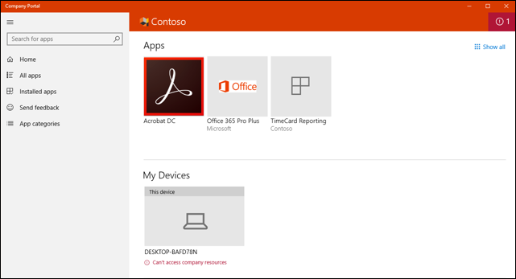
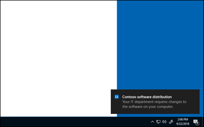

# Win32 app management in Microsoft Intune

Microsoft Intune allows Win32 app management capabilities. Although it's possible for cloud-connected customers to use Microsoft Endpoint Configuration Manager for Win32 app management, Intune-only customers will have greater management capabilities for their Win32 apps. This topic provides an overview of the Intune Win32 app management features and related information.

> [!NOTE]
> This app management capability supports both 32-bit and 64-bit operating system architecture for Windows applications.

> [!IMPORTANT]
> When you're deploying Win32 apps, consider using the [Intune Management Extension](../apps/intune-management-extension.md) approach exclusively, particularly when you have a multiple-file Win32 app installer. If you mix the installation of Win32 apps and line-of-business apps during Autopilot enrollment, the app installation might fail. The Intune management extension is installed automatically when a PowerShell script or Win32 app is assigned to the user or device.

## Prerequisites

To use Win32 app management, be sure the following criteria are met:

- Use Windows 10 version 1607 or later (Enterprise, Pro, or Education editions).
- Devices must be enrolled in Intune and either:
  - [Azure AD registered](/azure/active-directory/devices/concept-azure-ad-register) 
  - [Azure AD joined](/azure/active-directory/devices/concept-azure-ad-join)
  - [Hybrid Azure AD joined](/azure/active-directory/devices/concept-azure-ad-join-hybrid)
- Windows application size must not be greater than 8 GB per app.

  > [!NOTE]
  > Intune will automatically install the Intune Management Extension (IME) on the device if a PowerShell script or a Win32 app is targeted to the user or device.

## Prepare the Win32 app content for upload

Before you can add a Win32 app to Microsoft Intune, you must prepare the app by using the Microsoft Win32 Content Prep Tool. You use the Microsoft Win32 Content Prep Tool to pre-process Windows classic (Win32) apps. The tool converts application installation files into the *.intunewin* format. For more information and steps, see [Prepare Win32 app content for upload](apps-win32-prepare.md). 

## Add, assign, and monitor a Win32 app

After you have [prepared a Win32 app to be uploaded to Intune](apps-win32-prepare.md) by using the Microsoft Win32 Content Prep Tool, you can add the app to Intune. For more information and steps, see [Add, assign, and monitor a Win32 app in Microsoft Intune](apps-win32-add.md).

> [!NOTE]
> Windows application size is limited to 8 GB per app.

## Delivery optimization

Windows 10 1709 and later clients will download Intune Win32 app content by using a delivery optimization component on the Windows 10 client. Delivery optimization provides peer-to-peer functionality that's turned on by default. 

You can configure the Delivery Optimization agent to download Win32 app content in either background or foreground mode based on assignment. Delivery optimization can be configured by group policy and via Intune device configuration. For more information, see [Delivery Optimization for Windows 10](/windows/deployment/update/waas-delivery-optimization). 

> [!NOTE]
> You can also install a Microsoft Connected Cache server on your Configuration Manager distribution points to cache Intune Win32 app content. For more information, see [Microsoft Connected Cache in Configuration Manager](/configmgr/core/plan-design/hierarchy/microsoft-connected-cache#bkmk_intune).

## Install required and available apps on devices

The user will see Windows notifications for the required and available app installations. The following image shows an example notification where the app installation is not complete until the device is restarted. 

    

The following image notifies the user that app changes are being made to the device.

    

Additionally, the Company Portal app shows more app installation status messages to users. The following conditions apply to Win32 dependency features:
- App failed to be installed. Dependencies defined by the admin were not met.
- App was installed successfully but requires a restart.
- App is in the process of being installed but requires a restart to continue.

## Set Win32 app availability and notifications
You can configure the start time and deadline time for a Win32 app. At the start time, the Intune management extension will start the app content download and cache it for the required intent. The app will be installed at the deadline time. 

For available apps, the start time will dictate when the app is visible in the company portal, and content will be downloaded when the user requests the app from the company portal. You can also enable a restart grace period. 

> [!IMPORTANT]
> The **Restart grace period** setting in the **Assignment** section is available only when **Device restart behavior** of the **Program** section is set to either of the following options:
> - **Determine behavior based on return codes**
> - **Intune will force a mandatory device restart**

Set the app availability based on a date and time for a required app by using the following steps:

1. Sign in to the [Microsoft Endpoint Manager admin center](https://go.microsoft.com/fwlink/?linkid=2109431).
2. Select **Apps** > **All apps**.
3. In the **Windows app (Win32)** list, select an app. 
4. From the app pane, select **Properties** > **Edit** next to the **Assignments** section. Then select **Add group** below the **Required** assignment type. 
   
   Note that app availability can be set based on the assignment type. **Assignment type** can be **Required**, **Available for enrolled devices**, or **Uninstall**.
5. Select a group on the **Select group** pane to specify which group of users will be assigned the app. 

    > [!NOTE]
    > **Assignment type** options include the following: 
    > - **Required**: You can choose **make this app required for all users** and/or **make this app required on all devices**. 
    > - **Available for enrolled devices**: You can choose **make this app available to all users with enrolled devices**. 
    > - **Uninstall**: You can choose **uninstall this app for all users** and/or **uninstall this app for all devices**.

6. To modify the **End user notification** options, select **Show all toast notifications**.
7. In the **Edit assignment** pane, set **End user notifications** to **Show all toast notifications**. Note that you can set **End user notifications** to **Show all toast notifications**, **Show toast notifications for computer restarts**, or **Hide all toast notifications**.
8. Set **App availability** to **A specific date and time** and select your date and time. This date and time specify when the app is downloaded to the user's device. 
9. Set **App installation deadline** to **A specific date and time** and select your date and time. This date and time specify when the app is installed on the user's device. When more than one assignment is made for the same user or device, the app installation deadline time is picked based on the earliest time possible.

10. Select **Enabled** next to **Restart grace period**. The restart grace period starts as soon as the app installation has finished on the device. When the setting is disabled, the device can restart without warning. 

    You can customize the following options:
    
    - **Device restart grace period (minutes)**: The default value is 1,440 minutes (24 hours). This value can be a maximum of 2 weeks.
    - **Select when to display the restart countdown dialog box before the restart occurs (minutes)**: The default value is 15 minutes.
    - **Allow user to snooze the restart notification**: You can choose **Yes** or **No**.
        - **Select the snooze duration (minutes)**: The default value is 240 minutes (4 hours). The snooze value can't be more than the reboot grace period.

    > [!IMPORTANT]
    > Restart time is not registered when the user doesn't have admin privileges to the device.

11. Select **Review + save**.

## Notifications for Win32 apps 
If needed, you can suppress showing user notifications per app assignment. From Intune, select **Apps** > **All apps** > *the app* > **Assignments** > **Include Groups**. 

> [!NOTE]
> Win32 apps installed through the Intune management extension won't be uninstalled on unenrolled devices. Admins can use assignment exclusion to not offer Win32 apps to Bring Your Own Device (BYOD) devices.

## Next steps

- For more information about adding apps to Intune, see [Add apps to Microsoft Intune](apps-add.md).
