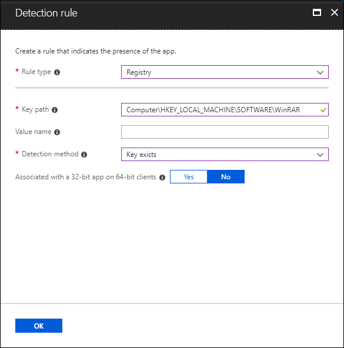
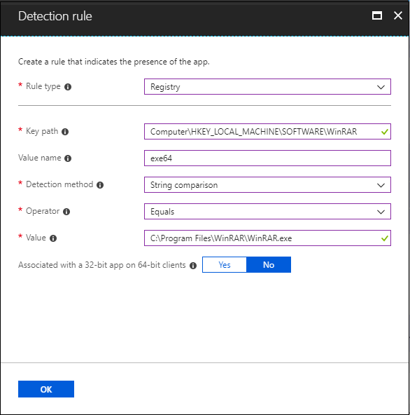

# Intune Standalone - Win32 app management

[Intune standalone](../fundamentals/mdm-authority-set.md) now allows greater Win32 app management capabilities. While it is possible for cloud connected customers to use Configuration Manager for Win32 app management, Intune-only customers will have greater management capabilities for their Win32 line-of-business (LOB) apps. This topic provides an overview of the Intune Win32 app management feature and troubleshooting information.

> [!NOTE]
> This app management capability supports both 32-bit and 64-bit operating system architecture for Windows applications.

> [!IMPORTANT]
> When deploying Win32 apps, consider using [Intune Management Extension](../apps/intune-management-extension.md) exclusively, particularly when you have a multi-file Win32 app installer. If you mix the installation of Win32 apps and line-of-business apps during AutoPilot enrollment, the app installation may fail.  

## Prerequisites

To use Win32 app management, be sure you meet the following criteria:

- Windows 10 version 1607 or later (Enterprise, Pro, and Education versions)
- Windows 10 client needs to be: 
  - Devices must be joined to Azure AD and auto-enrolled. The Intune management extension supports Azure AD joined, hybrid domain joined, group policy enrolled devices are supported. 
  > [!NOTE]
  > For the group policy enrolled scenario - The end user uses the local user account to AAD join their Windows 10 device. The user must log onto the device using their AAD user account and enroll into Intune. Intune will install the Intune Management extension on the device if a PowerShell script or a Win32 app is targeted to the user or device.
- Windows application size is capped at 8 GB per app.

## Prepare the Win32 app content for upload

Use the [Microsoft Win32 Content Prep Tool](https://go.microsoft.com/fwlink/?linkid=2065730) to pre-process Windows Classic (Win32) apps. The tool converts application installation files into the *.intunewin* format. The tool also detects some of the attributes required by Intune to determine the application installation state. After you use this tool on the app installer folder, you will be able to create a Win32 app in the Intune console.

> [!IMPORTANT]
> The [Microsoft Win32 Content Prep Tool](https://go.microsoft.com/fwlink/?linkid=2065730) zips all files and subfolders when it creates the *.intunewin* file. Be sure to keep the Microsoft Win32 Content Prep Tool separate from the installer files and folders, so that you don't include the tool or other unnecessary files and folders in your *.intunewin* file.

You can download the [Microsoft Win32 Content Prep Tool](https://go.microsoft.com/fwlink/?linkid=2065730) from GitHub as a zip file. The zipped file contains a folder named **Microsoft-Win32-Content-Prep-Tool-master**. The folder contains the prep tool, the license, a readme, and the release notes. 

### Process flow to create .intunewin file

   

### Run the Microsoft Win32 Content Prep Tool

If you run `IntuneWinAppUtil.exe` from the command window without parameters, the tool will guide you to input the required parameters step by step. Or, you can add the parameters to the command based on the following available command-line parameters.

### Available command-line parameters 

|    **Command-line   parameter**    |    **Description**    |
|:------------------------------:|:----------------------------------------------------------:|
|    `-h`     |    Help    |
|    `-c <setup_folder>`     |    Folder for all setup files. All files in this folder will be compressed into *.intunewin* file.    |
|    `-s <setup_file>`     |    Setup file (such as *setup.exe* or *setup.msi*).    |
|    `-o <output_folder>`     |    Output folder for the generated *.intunewin* file.    |
|    `-q`       |    Quiet   mode    |

### Example commands

|    **Example command**    |    **Description**    |
|:-----------------------------------------------------------------------------------------:|:--------------------------------------------------------------------------------------------------------------------------------------------------------------------------------------------------------------------------------------------------------------------------------------------------------------------------------------------------------------------------------------------------:|
|    `IntuneWinAppUtil -h`    |    This command will show usage information for the tool.    |
|    `IntuneWinAppUtil -c c:\testapp\v1.0 -s c:\testapp\v1.0\setup.exe -o c:\testappoutput\v1.0 -q`    |    This command will generate the `.intunewin` file from the specified source folder and setup file. For the MSI setup file, this tool will retrieve required information for Intune. If `-q` is specified, the command will run in quiet mode, and if the output file already exists, it will be overwritten. Also, if the output folder does not exist, it will be created automatically.    |

When generating an *.intunewin* file, put any files you need to reference into a subfolder of the setup folder. Then, use a relative path to reference the specific file you need. For example:

**Setup source folder:** *c:\testapp\v1.0*<br>
**License file:** *c:\testapp\v1.0\licenses\license.txt*

Refer to the *license.txt* file by using the relative path *licenses\license.txt*.

## Create, assign, and monitor a Win32 app

Much like a line-of-business (LOB) app, you can add a Win32 app to Microsoft Intune. This type of app is typically written in-house or by a 3rd party. 

### Process flow to add a Win32 app to Intune


### Add a Win32 app to Intune

The following steps provide guidance to help you add a Windows app to Intune.

1. Sign in to the [Microsoft Endpoint Manager Admin Center](https://go.microsoft.com/fwlink/?linkid=2109431).
2. Select **Apps** > **All apps** > **Add**.
3. In the **Select app type** pane, under the **Other** app types, select **Windows app (Win32)**.

    > [!IMPORTANT]
    > Be sure to use the latest version of the Microsoft Win32 Content Prep Tool. If you don't use the latest version, you will see a warning indicating that the app was packaged using an older version of the Microsoft Win32 Content Prep Tool. 

4. Click **Select**. The **Add app** steps are displayed.

## Step 1 - App information

### Select the app package file

1. In the **Add app** pane, click **Select app package file**. 
2. In the **App package file** pane, select the browse button. Then, select a Windows installation file with the extension *.intunewin*.
   The app details will be displayed.
3. When you're finished, select **OK** on the **App package file** pane.

### Set app information

1. In the **App information** page, add the details for your app. Depending on the app that you chose, some of the values in this pane might be automatically filled in.
    - **Name**: Enter the name of the app as it appears in the company portal. Make sure all app names that you use are unique. If the same app name exists twice, only one of the apps appears in the company portal.
    - **Description**: Enter the description of the app. The description appears in the company portal.
    - **Publisher**: Enter the name of the publisher of the app.
    - **Category**: Select one or more of the built-in app categories, or select a category that you created. Categories make it easier for users to find the app when they browse through the company portal.
    - **Show this as a featured app in the Company Portal**: Display the app prominently on the main page of the company portal when users browse for apps.
    - **Information URL**: Optionally, enter the URL of a website that contains information about this app. The URL appears in the company portal.
    - **Privacy URL**: Optionally, enter the URL of a website that contains privacy information for this app. The URL appears in the company portal.
    - **Developer**: Optionally, enter the name of the app developer.
    - **Owner**: Optionally, enter a name for the owner of this app. An example is **HR department**.
    - **Notes**: Enter any notes that you want to associate with this app.
    - **Logo**: Upload an icon that is associated with the app. This icon is displayed with the app when users browse through the company portal.
2. Click **Next** to display the **Program** page.

## Step 2: Program

1. In the **Program** page, configure the app installation and removal commands for the app:
    - **Install command**: Add the complete installation command line to install the app. 

        For example, if your app filename is **MyApp123**, add the following:<br>
        `msiexec /p “MyApp123.msp”`<p>
        And, if the application is `ApplicationName.exe`, the command would be the application name followed by the command arguments (switches) supported by the package. <br>For example:<br>
        `ApplicationName.exe /quiet`<br>
        In the above command, the `ApplicationName.exe` package supports the `/quiet` command argument.<p> 
        For the specific arguments supported by the application package, contact your application vendor.

    - **Uninstall command**: Add the complete uninstall command line to uninstall the app based on the app’s GUID. 

        For example:
        `msiexec /x “{12345A67-89B0-1234-5678-000001000000}”`

    - **Install behavior**: Set the install behavior to either **System** or **User**.

        > [!NOTE]
        > You can configure a Win32 app to be installed in **User** or **System** context. **User** context refers to only a given user. **System** context refers to all users of a Windows 10 device.
        >
        > End users are not required to be logged in on the device to install Win32 apps.
        > 
        > The Win32 app install and uninstall will be executed under admin privilege (by default) when the app is set to install in user context and the end user on the device has admin privileges.
    
    - **Device restart behavior**: Select one of the following options:
        - **Determine behavior based on return codes**: Choose this option to restart the device based on the return codes.
        - **No specific action**: Choose this option to suppress device restarts during the app installation of MSI-based apps.
        - **App install may force a device restart**: Choose this option to allow the app installation to complete without suppressing restarts.
        - **Intune will force a mandatory device restart**: Choose this option to always restart the device after a successful app installation.

    - **Specify return codes to indicate post-installation behavior**: Add the return codes used to specify either app installation retry behavior or post-installation behavior. Return code entries are added by default during app creation. However, you can add additional return codes or change existing return codes.
        1. In the **Code type** column, set the **Code type** to one of the following:
            - **Failed** – The return value that indicates an app installation failure.
            - **Hard reboot** – The hard reboot return code does not allow next  Win32 apps to be installed on the client without reboot. 
            - **Soft reboot** – The soft reboot return code allows the next Win32 app to be installed without requiring a client reboot. Reboot is necessary to complete installation of the current application.
            - **Retry** – The retry return code agent will attempt to install the app three times. It will wait for 5 minutes between each attempt. 
            - **Success** – The return value that indicates the app was successfully installed.
        2. If needed, click **Add** to add additional return codes, or modify existing return codes.
2. Click **Next** to display the **Requirements** page.        

## Step 3: Requirements

1. In the **Requirements** page, specify the requirements that devices must meet before the app is installed:
    - **Operating system architecture**: Choose the architectures need to install the app.
    - **Minimum operating system**: Select the minimum operating system needed to install the app.
    - **Disk space required (MB)**: Optionally, add the free disk space needed on the system drive to install the app.
    - **Physical memory required (MB)**: Optionally, add the physical memory (RAM) required to install the app.
    - **Minimum number of logical processors required**: Optionally, add the minimum number of logical processors required to install the app.
    - **Minimum CPU speed required (MHz)**: Optionally, add the minimum CPU speed required to install the app.
    - **Configure additional requirement rules**: 
        1. Click **Add** to display the **Add a Requirement rule** pane and configure additional requirement rules. Select the **Requirement type** to choose the type of rule that you will use to determine how a requirement is validated. Requirement rules can be based on file system information, registry values, or PowerShell scripts. 
            - **File**: When you choose **File** as the **Requirement type**, the requirement rule must detect a file or folder, date, version, or size. 
                - **Path** – The full path of the folder containing the file or folder to detect.
                - **File or folder** - The file or folder to detect.
                - **Property** – Select the type of rule used to validate the presence of the app.
                - **Associated with a 32-bit app on 64-bit clients** - Select **Yes** to expand any path environment variables in the 32-bit context on 64-bit clients. Select **No** (default) to expand any path variables in the 64-bit context on 64-bit clients. 32-bit clients will always use the 32-bit context.
            - **Registry**: When you choose **Registry** as the **Requirement type**, the requirement rule must detect a registry setting based on value, string, integer, or version.
                - **Key path** – The full path of the registry entry containing the value to detect.
                - **Value name** - The name of the registry value to detect. If this value is empty, the detection will happen on the key. The (default) value of a key will be used as detection value if the detection method is other than file or folder existence.
                - **Registry key requirement** – Select the type of registry key comparison used to determine how the requirement rule is validated.
                - **Associated with a 32-bit app on 64-bit clients** - Select **Yes** to search the 32-bit registry on 64-bit clients. Select **No** (default) search the 64-bit registry on 64-bit clients. 32-bit clients will always search the 32-bit registry.
            - **Script**: Choose **Script** as the **Requirement type**, when you cannot create a requirement rule based on file, registry, or any other method available to you in the Intune console.
                - **Script file** – For PowerShell script based requirement rule, if exist code is 0, we will detect the STDOUT in more detail. For example, we can detect STDOUT as an integer that has a value of 1.
                - **Run script as 32-bit process on 64-bit clients** - Select **Yes** to run the script in a 32-bit process on 64-bit clients. Select **No** (default) to run the script in a 64-bit process on 64-bit clients. 32-bit clients run the script in a 32-bit process.
                - **Run this script using the logged on credentials**: Select **Yes** to run the script using the signed in device credentials**.
                - **Enforce script signature check** - Select **Yes** to verify that the script is signed by a trusted publisher, which will allow the script to run with no warnings or prompts displayed. The script will run unblocked. Select **No** (default) to run the script with end-user confirmation without signature verification.
                - **Select output data type**: Select the data type used when determining a requirement rule match.
        2. When you're finished setting the requirement rules, select **OK**.
2. Click **Next** to display the **Detection rules** page.   

## Step 4: Detection rules

1. In the **Detection rules** page, configure the rules to detect the presence of the app:
    
    **Rules format**: Select how the presence of the app will be detected. You can choose to either manually configure the detection rules or use a custom script to detect the presence of the app. You must choose at least one detection rule. 

    > [!NOTE]
    > In the **Detection rules** pane, you can choose to add multiple rules. The conditions for **all** rules must be met to detect the app.
    >
    > If Intune detects that the app is not present on the device, Intune will offer the app again after 24 hours. This will only occur for apps targeted with required intent.

    - **Manually configure detection rules** - You can select one of the following rule types:
        1. **MSI** – Verify based on MSI version check. This option can only be added once. When you choose this rule type, you have two settings:
            - **MSI product code** – Add a valid MSI product code for the app.
            - **MSI product version check** – Select **Yes** to verify the MSI product version in addition to the MSI product code.
        2. **File** – Verify based on file or folder detection, date, version, or size.
            - **Path** – The full path of the folder containing the file or folder to detect.
            - **File or folder** - The file or folder to detect.
            - **Detection method** – Select the type of detection method used to validate the presence of the app.
            - **Associated with a 32-bit app on 64-bit clients** - Select **Yes** to expand any path environment variables in the 32-bit context on 64-bit clients. Select **No** (default) to expand any path variables in the 64-bit context on 64-bit clients. 32-bit clients will always use the 32-bit context.
            
            **Examples of file-based detection**
            1. Check for file existence.
         
                
        
            2. Check for folder existence.
         
                
        
        3. **Registry** – Verify based on value, string, integer, or version.
            - **Key path** – The full path of the registry entry containing the value to detect.
            - **Value name** - The name of the registry value to detect. If this value is empty, the detection will happen on the key. The (default) value of a key will be used as detection value if the detection method is other than file or folder existence.
            - **Detection method** – Select the type of detection method used to validate the presence of the app.
            - **Associated with a 32-bit app on 64-bit clients** - Select **Yes** to search the 32-bit registry on 64-bit clients. Select **No** (default) search the 64-bit registry on 64-bit clients. 32-bit clients will always search the 32-bit registry.
            
            **Examples for registry-based detection**
            1. Check for registry key exists.
            
                    
            
            2. Check if registry value exists.
        
                    
        
            3. Check for registry value string equals.
        
                    
     
    - **Use a custom detection script** – Specify the PowerShell script that will be used to detect this app. 
    
       1. **Script file** – Select a PowerShell script that will detect the presence of the app on the client. The app will be detected when the script both returns a 0 value exit code and writes a string value to STDOUT.

       2. **Run script as 32-bit process on 64-bit clients** - Select **Yes** to run the script in a 32-bit process on 64-bit clients. Select **No** (default) to run the script in a 64-bit process on 64-bit clients. 32-bit clients run the script in a 32-bit process.

       3. **Enforce script signature check** - Select **Yes** to verify that the script is signed by a trusted publisher, which will allow the script to run with no warnings or prompts displayed. The script will run unblocked. Select **No** (default) to run the script with end-user confirmation without signature verification.
    
            Intune agent checks the results from the script. It reads the values written by the script to the standard output (STDOUT) stream, the standard error (STDERR) stream, and the exit code. If the script exits with a nonzero value, the script fails and the application detection status is not installed. If the exit code is zero and STDOUT has data, the application detection status is Installed. 

            > [!NOTE]
            > Microsoft recommends encoding your script as UTF-8. When the script exits with the value of 0, the script execution was success. Second output channel indicates app was detected - STDOUT data indicates that the app was found on the client. We do not look for a particular string from STDOUT.

2. Once you have added your rule(s), select **Next** to display the **Dependencies** page.

## Step 5: Dependencies

App dependencies are applications that must be installed before your Win32 app can be installed. You can require that other apps are installed as dependencies. Specifically, the device must install the dependent app(s) before it installs the Win32 app. ​There is a maximum of 100 dependencies, which includes the dependencies of any included dependencies, as well as the app itself. You can add Win32 app dependencies only after your Win32 app has been added and uploaded to Intune. Once your Win32 app has been added, you'll see the **Dependencies** option on the pane for your Win32 app. 

Any Win32 app dependency needs to be also be a Win32 app. It does not support depending on other app types, such as single MSI LOB apps or Store apps.

When adding an app dependency, you can search based on the app name and publisher. Additionally, you can sort your added dependencies based on app name and publisher. Previously added app dependencies cannot be selected in the added app dependency list. 

You can choose whether or not to install each dependent app automatically. By default, the **Automatically install** option is set to **Yes** for each dependency. By automatically installing a dependent app, even if the dependent app is not targeted to the user or device, Intune will install the app on the device to satisfy the dependency before installing your Win32 app.​ It's important to note that a dependency can have recursive sub-dependencies, and each sub-dependency will be installed before installing the main dependency. Additionally, installation of dependencies does not follow an install order at a given dependency level.

### Select the dependencies

In the **Dependencies** page, select applications that must be installed before your Win32 app can be installed:
1. Click **Add** to display the **Add dependency** pane.
3. Once you have added the dependent app(s), click **Select**.
4. Choose whether to automatically install the dependent app by selecting **Yes** or **No** under the **Automatically Install** column.
5. Click **Next** to display the **Scope tags** page.

### Understand additional dependency details

The end user will see Windows Toast Notifications indicating that dependent apps are being downloaded and installed as part of the Win32 app installation process. Additionally, when a dependent app is not installed, the end user will commonly see one of the following notifications:
- 1 or more dependent apps failed to install​
- 1 or more dependent app requirements not met​
- 1 or more dependent apps are pending a device reboot

If you choose not to **Automatically install** a dependency, the Win32 app installation will not be attempted. Additionally, app reporting will show that the dependency was flagged as `failed` and also provide a failure reason. You can view the dependency installation failure by clicking on a failure (or warning) provided in the Win 32 app [installation details](troubleshoot-app-install.md#win32-app-installation-troubleshooting).​ 

Each dependency will adhere to Intune Win32 app retry logic (try to install 3 times after waiting for 5 minutes) and the global re-evaluation schedule.​ Also, dependencies are only applicable at the time of installing the Win32 app on the device. Dependencies are not applicable for uninstalling a Win32 app.​ To delete a dependency, you must click on the ellipses (three dots) to the left of the dependent app located at the end of the row of the dependency list.​ 

## Step 6 - Select scope tags (optional)
You can use scope tags to determine who can see client app information in Intune. For full details about scope tags, see [Use role-based access control and scope tags for distributed IT](../fundamentals/scope-tags.md).

1. Click **Select scope tags** to optionally add scope tags for the app. 
2. Click **Next** to display the **Assignments** page.

## Step 7 - Assignments

You can select the **Required**, **Available for enrolled devices**, or **Uninstall** group assignments for the app. For more information, see [Add groups to organize users and devices](~/intune/fundamentals/groups-add.md) and [Assign apps to groups with Microsoft Intune](apps-deploy.md).

1. For the specific app, select an assignment type:
    - **Required**: The app is installed on devices in the selected groups.
    - **Available for enrolled devices**: Users install the app from the Company Portal app or Company Portal website.
    - **Uninstall**: The app is uninstalled from devices in the selected groups.
2. Click **Add group** and assign the groups that will use this app.
3. In the **Select groups** pane, select to assign based on users or devices. 
4. After you have selected your groups, you can also set **End user notifications**, **Availability**, and **Installation deadline**. For more information, see [Set Win32 app availability and notifications](~/intune/apps/apps-win32-app-management.md#set-win32-app-availability-and-notifications).
5. If you want to exclude any groups of users from being affected by this app assignment, select **Included** under the **MODE** column. The **Edit assignment** pane will be displayed. You can set the **mode** from being **Included** to being **Excluded**. Click **OK** to close the **Edit assignment** pane.
6. Once you have completed setting the assignments for the apps, click **Next** to display the **Review + create** page.

## Step 8 - Review + create

1. Review the values and settings you entered for the app. Verify that you configured the app information correctly.
2. When you are done, click **Create** to add the app to Intune.

    The **Overview** blade for the line-of-business app is displayed.

At this point, you have completed steps to add a Win32 app to Intune. For information about app assignment and monitoring, see [Assign apps to groups with Microsoft Intune](apps-deploy.md) and [Monitor app information and assignments with Microsoft Intune](apps-monitor.md).

## Delivery Optimization

Windows 10 1709 and above clients will download Intune Win32 app content using a delivery optimization component on the Windows 10 client. Delivery optimization provides peer-to-peer functionality that it is turned on by default. Delivery optimization can be configured by group policy and via Intune Device configuration. For more information, see [Delivery Optimization for Windows 10](https://docs.microsoft.com/windows/deployment/update/waas-delivery-optimization). 

> [!NOTE]
> You can also install a Microsoft Connected Cache server on your Configuration Manager distribution points to cache Intune Win32 app content. For more information, see [Microsoft Connected Cache in Configuration Manager - Support for Intune Win32 apps](https://docs.microsoft.com/configmgr/core/plan-design/hierarchy/microsoft-connected-cache#bkmk_intune).

## Install required and available apps on devices

The end user will see Windows Toast Notifications for the required and available app installations. The following image shows an example toast notification where the app installation is not complete until the device is restarted. 

    

The following image notifies the end user that app changes are being made to the device.

    

## Set Win32 app availability and notifications
You can configure the start time and deadline time for a Win32 app. At the start time, Intune management extension will start the app content download and cache it for required intent. The app will be installed at the deadline time. For available apps, start time will dictate when the app is visible in the Company Portal and content will be downloaded when the end user requests the app from the Company Portal. Additionally, you can enable a restart grace period. 

Set the app availability based on a date and time for a required app using the following steps:

1. Sign in to the [Microsoft Endpoint Manager Admin Center](https://go.microsoft.com/fwlink/?linkid=2109431).
2. Select **Apps** > **All apps**.
3. Select an existing **Windows app (Win32)** from the list. 
4. From the app pane, select **Properties** > **Edit** next to the **Assignments** section > **Add group** below the **Required** assignment type. 
   Note that app availability can be set based on the assignment type. The **Assignment type** can be **Required**, **Available for enrolled devices**, or **Uninstall**.
5. Select a group in the **Select group** pane to specify which group of users will be assigned the app. 

    > [!NOTE]
    > **Assignment type** options included the following:<br>
    > - **Required**: You can choose to **make this app required for all users** and/or **make this app required on all devices**.<br>
    > - **Available for enrolled devices**: You can choose to **make Make this app available to all users with enrolled devices**.<br>
    > - **Uninstall**: You can choose to ***uninstall this app for all users** and/or **uninstall this app for all devices**.

6. To modify the **End user notification** options select **Show all toast notifications**.
7. In the **Edit assignment** pane, set the **Ender user notifications** to **Show all toast notifications**. Note that you can set **End user notifications** to **Show all toast notifications**, **Show toast notifications for computer restarts**, or **Hide all toast notifications**.
8. Set the **App availability** to **A specific date and time** and select your date and time. This date and time specifies when the app is downloaded to the end users device. 
9. Set the **App installation deadline** to **A specific date and time** and select your date and time. This date and time specifies when the app is installed on the end users device. When more than one assignment is made for the same user or device, the app installation deadline time is picked based on the earliest time possible.

10. Click **Enabled** next to the **Restart grace period**. The restart grace period starts as soon as the app install has been completed on the device.​ When disabled, the device can restart without warning. <br>You can customize the following options:
    - **Device restart grace period (minutes)**: The default value is 1440 minutes (24 hours). This value can be a maximum of 2 weeks.
    - **Select when to display the restart countdown dialog box before the restart occurs (minutes)**: The default value is 15 minutes.
    - **Allow user to snooze the restart notification**: You can choose **Yes** or **No**.
        - **Select the snooze duration (minutes)**: The default value is 240 minutes (4 hours). The snooze value cannot be more than reboot grace period.

11. Click **Review + save**.

## Toast notifications for Win32 apps 
If needed, you can suppress showing end user toast notifications per app assignment. From Intune, select **Apps** > **All apps** > select the app > **Assignments** > **Include Groups**. 

> [!NOTE]
> Intune management extension installed Win32 apps will not be uninstalled on unenrolled devices. Admins can leverage assignment exclusion to not offer Win32 apps to BYOD Devices.

## Troubleshoot Win32 app issues
Agent logs on the client machine are commonly in `C:\ProgramData\Microsoft\IntuneManagementExtension\Logs`. You can leverage `CMTrace.exe` to view these log files. For more information, see [CMTrace](https://docs.microsoft.com/configmgr/core/support/cmtrace).

    

> [!IMPORTANT]
> To allow proper installation and execution of LOB Win32 apps, anti-malware settings should exclude the following directories from being scanned:<p>
> **On X64 client machines**:<br>
> *C:\Program Files (x86)\Microsoft Intune Management Extension\Content*<br>
> *C:\windows\IMECache*
>  
> **On X86 client machines**:<br>
> *C:\Program Files\Microsoft Intune Management Extension\Content*<br>
> *C:\windows\IMECache*

### Detecting the Win32 app file version using PowerShell

If you have difficulty detecting the Win32 app file version, consider using or modifying the following PowerShell command:

``` PowerShell

$FileVersion = [System.Diagnostics.FileVersionInfo]::GetVersionInfo("<path to binary file>").FileVersion
#The below line trims the spaces before and after the version name
$FileVersion = $FileVersion.Trim();
if ("<file version of successfully detected file>" -eq $FileVersion)
{
#Write the version to STDOUT by default
$FileVersion
exit 0
}
else
{
#Exit with non-zero failure code
exit 1
}
```

In the above PowerShell command, replace the `<path to binary file>` string with the path to your Win32 app file. An example path would be similar to the following:<br>
`C:\Program Files (x86)\Microsoft SQL Server Management Studio 18\Common7\IDE\ssms.exe`

Also, replace the `<file version of successfully detected file>` string with the file version that you need to detect. An example file version string would be similar to the following:<br>
`2019.0150.18118.00 ((SSMS_Rel).190420-0019)`

If you need to get the version information of your Win32 app, you can use the following PowerShell command:

``` PowerShell

[System.Diagnostics.FileVersionInfo]::GetVersionInfo("<path to binary file>").FileVersion

```

In the above PowerShell command, replace `<path to binary file>` with your file path.

### Additional troubleshooting areas to consider
- Check targeting to make sure agent is installed on the device - Win32 app targeted to a group or PowerShell Script targeted to a group will create agent install policy for security group.
- Check OS Version – Windows 10 1607 and above.  
- Check Windows 10 SKU - Windows 10 S, or Windows versions running with S-mode enabled, do not support MSI installation.

For more information about troubleshooting Win32 apps, see [Win32 app installation troubleshooting](troubleshoot-app-install.md#win32-app-installation-troubleshooting).

## Next steps

- For more information about adding apps to Intune, see [Add apps to Microsoft Intune](apps-add.md).
