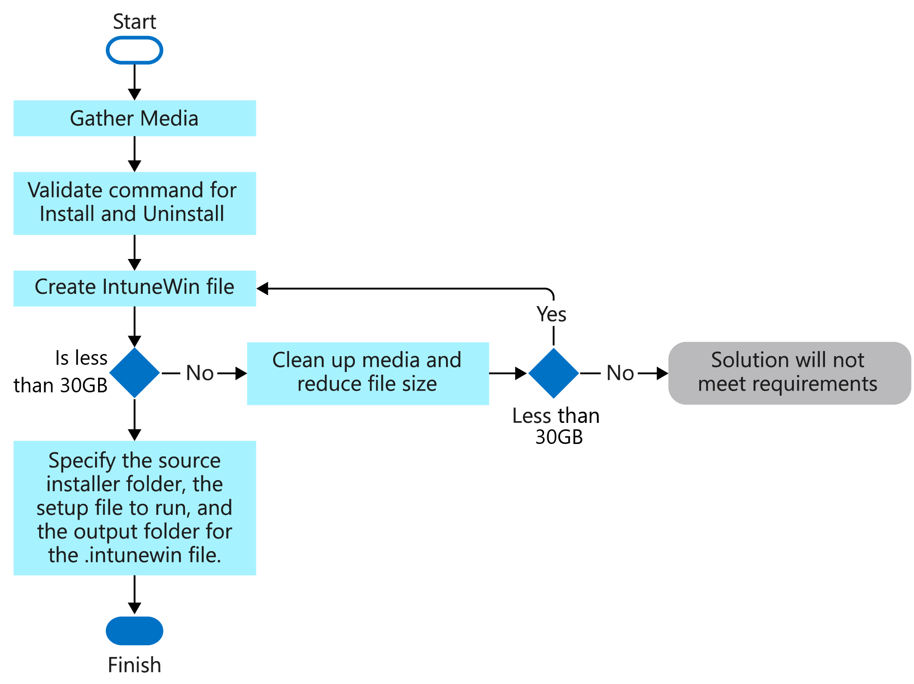

# Prepare Win32 app content for upload

Before you can add a Win32 app to Microsoft Intune, you must prepare the app by using the [Microsoft Win32 Content Prep Tool](https://go.microsoft.com/fwlink/?linkid=2065730).

## Prerequisites

To use Win32 app management, be sure you meet the following criteria:

- Use Windows 10 version 1607 or later (Enterprise, Pro, and Education versions).
- Devices must be registered or joined to Azure Active Directory (Azure AD) and auto-enrolled. The Intune management extension supports devices that are Azure AD registered, Azure AD joined, hybrid domain joined, and group policy enrolled.
  > [!NOTE]
  > For the scenario of group policy enrollment, the user uses the local user account to Azure AD join their Windows 10 device. The user must log on to the device by using their Azure AD user account and enroll in Intune. Intune will install the Intune Management extension on the device if a PowerShell script or a Win32 app is targeted to the user or device.
- Windows application size is capped at 8 GB per app.

## Convert the Win32 app content

Use the [Microsoft Win32 Content Prep Tool](https://go.microsoft.com/fwlink/?linkid=2065730) to pre-process Windows classic (Win32) apps. The tool converts application installation files into the *.intunewin* format. The tool also detects some of the attributes that Intune requires to determine the application installation state. After you use this tool on the app installer folder, you'll be able to create a Win32 app in the Microsoft Intune admin center.

> [!IMPORTANT]
> The [Microsoft Win32 Content Prep Tool](https://go.microsoft.com/fwlink/?linkid=2065730) zips all files and subfolders when it creates the *.intunewin* file. Be sure to keep the Microsoft Win32 Content Prep Tool separate from the installer files and folders, so that you don't include the tool or other unnecessary files and folders in your *.intunewin* file.

You can download the [Microsoft Win32 Content Prep Tool](https://go.microsoft.com/fwlink/?linkid=2065730) from GitHub as a .zip file. The zipped file contains a folder named *Microsoft-Win32-Content-Prep-Tool-master*. The folder contains the prep tool, the license, a readme, and the release notes.

### Process flow to create a .intunewin file

   

### Running the Microsoft Win32 Content Prep Tool

If you run `IntuneWinAppUtil.exe` from the command window without parameters, the tool will guide you to enter the required parameters step by step. Or, you can add the parameters to the command based on the following available command-line parameters.

### Available command-line parameters

|    **Command-line   parameter**    |    **Description**    |
|--------------------------------|------------------------------------------------------------|
|    `-h`     |    Help    |
|    `-c <setup_folder>`     |    Folder for all setup files. All files in this folder will be compressed into an *.intunewin* file.    |
|    `-s <setup_file>`     |    Setup file (such as *setup.exe* or *setup.msi*).    |
|    `-o <output_folder>`     |    Output folder for the generated *.intunewin* file.    |
|    `-q`       |    Quiet mode.    |

### Example commands

|    **Example command**    |    **Description**    |
|-------------------------------------------------------------------------------------------|----------------------------------------------------------------------------------------------------------------------------------------------------------------------------------------------------------------------------------------------------------------------------------------------------------------------------------------------------------------------------------------------------|
|    `IntuneWinAppUtil -h`    |    This command will show usage information for the tool.    |
|    `IntuneWinAppUtil -c c:\testapp\v1.0 -s c:\testapp\v1.0\setup.exe -o c:\testappoutput\v1.0 -q`    |    This command will generate the *.intunewin* file from the specified source folder and setup file. For the MSI setup file, this tool will retrieve required information for Intune. If `-q` is specified, the command will run in quiet mode. If the output file already exists, it will be overwritten. Also, if the output folder doesn't exist, it will be created automatically.    |

When you're generating an *.intunewin* file, put any files you need to reference into a subfolder of the setup folder. Then, use a relative path to reference the specific file you need. For example:

**Setup source folder:** *c:\testapp\v1.0* 
**License file:** *c:\testapp\v1.0\licenses\license.txt*

Refer to the *license.txt* file by using the relative path *licenses\license.txt*.

## Next steps

- [Add a Win32 app to Microsoft Intune](apps-win32-add.md)
